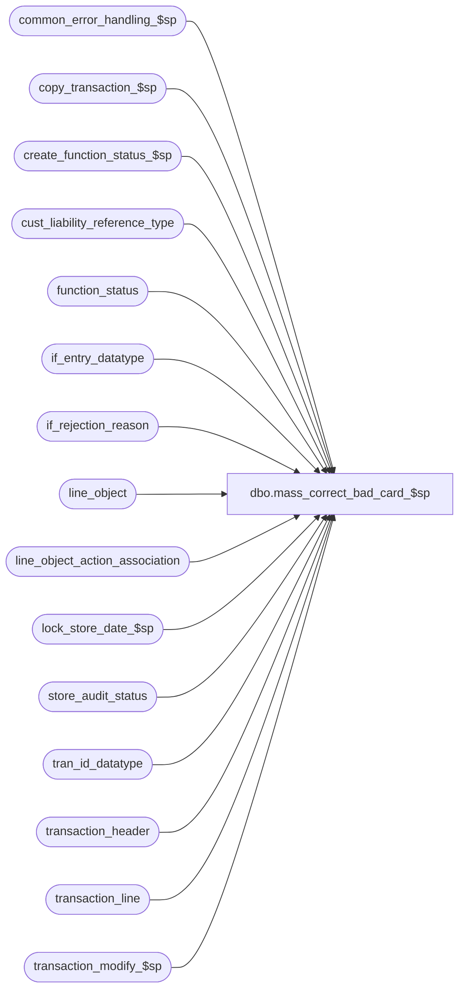

# dbo.mass_correct_bad_card_$sp

**Database:** auditworks_external  
**Server:** bedrockdb01  

## Architecture Diagram



## Table Dependencies

| Referenced Table |
|---|
| common_error_handling_$sp |
| copy_transaction_$sp |
| create_function_status_$sp |
| cust_liability_reference_type |
| function_status |
| if_entry_datatype |
| if_rejection_reason |
| line_object |
| line_object_action_association |
| lock_store_date_$sp |
| store_audit_status |
| tran_id_datatype |
| transaction_header |
| transaction_line |
| transaction_modify_$sp |

## Stored Procedure Code

```sql
create proc dbo.mass_correct_bad_card_$sp 
( @process_id               binary(16),
  @user_id                  int
) 

AS

/* 
PROC NAME: mass_correct_bad_card_$sp
     DESC: Handle I/F rejection 'Invalid Credit Card' by reassigning the credit card receivable line object to 
           another line_object. This second line object can be another receivable account or an expense (write off),
           or a liability account or an offset to expense (write off).
           Called from frontend.

HISTORY:
Date     Name               Def  Desc
Aug12,13 Paul             145958 call common_error_handling_$sp, use try .. catch
Oct25,06 Phu               77931 Fix outer join for SQL 2005 Mode 90.
Nov01,05  Paul             62153 apply 61728 to SA5, simplify error logic, added nolock hints
Sep20,05  Paul             60471 apply DV-1298 to SA5 - use invalid_reference_no.
Apr28,05  Paul           DV-1234 expand transaction_id to use tran_id_datatype
Feb08,05  David          DV-1206 Treat I/F reject reason 113 same as reason 2.
Sep17,04  Maryam         DV-1146 Use user_id.
Jul21,04  Maryam         DV-1071 receive @process_id and pass it to the sub procs, pass zero entry_id,
                                 modify the call to lock_store_date_$sp as it no longer outputs the user name
24-Oct-05 David            61728 Set ref# to decrypted # if feeding C/L.
23-Aug-05 David          DV-1298 Treat I/F reject reason 113 same as reason 2. Use invalid_reference_no.
29-Dec-03 Winnie         DV-1007 Set update_in_progress = 101 instead of 100
16-May-02 Henry          1-CD0IX Add R3.5 standardized common error handling
04-Apr-01 Phu               7501 Use system function to retrieve user name
01-Mar-00 Phu               5900 Change @@fetch_status > 0 to @@fetch_status <> 0 for MS SQL compatibility
28-Jul-99 Daphna F          5026 calls delete_if_details_$sp instead of deleting 
					if_transaction_header and setting off trigger
05-Feb-99 Matt C
07-Jan-99 Andrew V
01-May-97 Yin Wan Ng         n/a author
*/

DECLARE
        @errmsg 			 nvarchar(1024),
        @errno 			 int,
        @function_no		 tinyint,
        @transaction_id		 tran_id_datatype,
        @line_id			 numeric(5,0),
        @store_no			 int,
        @transaction_date		 smalldatetime,
        @register_no		 smallint,
        @if_entry_no		 if_entry_datatype,
        @update_in_progress	 smallint,
        @ret_int			 int,
        @cursor_open		 tinyint,
        @invalid_association	 tinyint,
        @lock_store_failure	 tinyint,
        @reference_type		 tinyint,
-- used for common error handling.
	@object_name		nvarchar(255),
	@process_name		nvarchar(100),
	@operation_name		nvarchar(100),
	@message_id		int

SELECT @errmsg              = NULL,
       @function_no         = 101,
       @invalid_association = 0,
       @lock_store_failure  = 0,
       @process_name = 'mass_correct_bad_card_$sp',
       @message_id = 201068,
       @cursor_open = 0;

BEGIN TRY

    SELECT @errmsg = 'Unable to create table #correct_transaction_line',
	   @object_name = '#correct_transaction_line',
	   @operation_name = 'CREATE';

CREATE TABLE #correct_transaction_line(
        transaction_id           numeric(14,0) not null, -- tran_id_datatype
        line_id                  numeric(5,0)  not null,
        transaction_category     tinyint       null,
        line_object              smallint      null,	
        line_action              tinyint       null,
        db_cr_none               smallint      null,
        reference_type           tinyint       null);

    SELECT @errmsg = 'Unable to create table #correct_transaction_line',
	   @operation_name = 'INSERT';
 
INSERT #correct_transaction_line(
        transaction_id,
        line_id,
        transaction_category,
        line_object,
        line_action,
        db_cr_none,
        reference_type)
SELECT DISTINCT
        h.transaction_id,
        l.line_id,
       a.transaction_category,
        a.line_object,
        a.line_action,
        a.db_cr_none,
        a.reference_type
  FROM transaction_header h
       INNER JOIN transaction_line l ON (h.transaction_id = l.transaction_id)
       INNER JOIN if_rejection_reason r ON (h.transaction_id = r.transaction_id AND l.line_id = r.line_id)
       LEFT JOIN line_object_action_association a ON (h.transaction_category = a.transaction_category
                                                      AND r.replace_line_object = a.line_object
                                                      AND r.replace_line_action = a.line_action
                                                      AND l.db_cr_none = a.db_cr_none)
 WHERE r.if_reject_reason IN (2,113)
   AND r.replace_line_object  IS NOT NULL -- 
   AND r.replace_line_action  IS NOT NULL; 

    SELECT @errmsg = 'Unable to delete from table #correct_transaction_line',
	   @operation_name = 'DELETE';

DELETE #correct_transaction_line
 WHERE transaction_category IS NULL -- 
   OR line_object IS NULL -- 
   OR line_action IS NULL -- 
   OR db_cr_none  IS NULL; 

 SELECT @invalid_association = ABS( SIGN( @@rowcount )),
	@errmsg      = 'Unable to open cursor mass_bad_card_cusr',
	@object_name = 'mass_bad_card_cusr',
	@operation_name = 'OPEN';

DECLARE mass_bad_card_cusr CURSOR FAST_FORWARD
    FOR 
      SELECT transaction_id,
             line_id,
             reference_type
        FROM #correct_transaction_line;

OPEN mass_bad_card_cusr 
  SELECT @cursor_open = 1;

WHILE 1 = 1
  BEGIN
    SELECT @errmsg = 'Unable to select from transaction_header',
	       @object_name = 'transaction_header',
	       @operation_name = 'FETCH';
    FETCH mass_bad_card_cusr INTO @transaction_id,
                                  @line_id,
                                  @reference_type;
    IF @@fetch_status <> 0
      BREAK;

    SELECT @errmsg = 'Unable to select from transaction_header',
	       @object_name = 'transaction_header',
	       @operation_name = 'SELECT';

    SELECT @store_no         = store_no,
           @transaction_date = transaction_date,
           @register_no      = register_no
      FROM transaction_header WITH (NOLOCK)
     WHERE transaction_id = @transaction_id;

    SELECT @errmsg = 'Unable to execute create_function_status_$sp',
	       @object_name = 'create_function_status_$sp',
	       @operation_name = 'EXEC';

    EXEC create_function_status_$sp @process_id,
    				    @user_id, 
                                    @function_no, 
                                    @transaction_id, 
                                    @errmsg OUTPUT, 
                                    @store_no, 
                                    @transaction_date, 
                                    0, 
                                    @register_no;

    SELECT @update_in_progress =  101,
           @ret_int            = null,
           @errmsg = 'Unable to execute lock_store_date_$sp',
           @object_name = 'lock_store_date_$sp',
           @operation_name = 'EXEC';
            
    EXEC lock_store_date_$sp @process_id,
    			     @user_id,
    			     @store_no, 
                             @transaction_date, 
                             0,
                             @update_in_progress, 
                             @ret_int OUTPUT;

    IF @errno = 201550  /* store date in use */
          SELECT @ret_int = 1, @lock_store_failure = 1;

    IF @ret_int <> 0 -- can't lock store-date
      BEGIN
         SELECT @errmsg = 'Unable to delete function_status (skip)',
           @object_name = 'function_status',
           @operation_name = 'DELETE';
        DELETE function_status
         WHERE user_id        = @user_id
           AND process_id     = @process_id
           AND function_no    = @function_no
           AND transaction_id = @transaction_id
           AND store_no = @store_no;
        CONTINUE; -- can't lock so skip transaction
      END;

    SELECT @errmsg = 'Unable to execute copy_transaction_$sp',
		@object_name = 'copy_transaction_$sp',
	       	@operation_name = 'EXEC';

    EXEC copy_transaction_$sp @process_id,
                              @user_id,
                              @transaction_id, 
                              @errmsg OUTPUT, 
                              @if_entry_no OUTPUT
      SELECT @errmsg = 'Unable to update transaction_header',
		 @object_name = 'transaction_header',
		 @operation_name = 'UPDATE';
    BEGIN TRAN
      UPDATE transaction_header
         SET updated_by_user_id = @user_id,
             edit_progress_flag   = 100
       WHERE transaction_id = @transaction_id;

      SELECT @errmsg =  'Unable to update transaction_line',
		 @object_name = 'transaction_line',
		 @operation_name = 'UPDATE';

      UPDATE transaction_line
         SET line_object        = r.replace_line_object,
             line_action        = r.replace_line_action,
             line_object_type   = o.line_object_type,
             reference_type     = @reference_type,
             line_modified_flag = 1
        FROM if_rejection_reason r, 
             transaction_line l, 
             line_object o
       WHERE r.transaction_id = @transaction_id
         AND r.line_id = @line_id
         AND l.transaction_id = r.transaction_id
         AND l.line_id = r.line_id
         AND o.line_object = r.replace_line_object;

       SELECT @errmsg =  'Unable to clean invalid_reference_no.';

    -- If writing-off (i.e. feeding C/L), then set ref# to decrypted, and clean up invalid ref#.
    -- Note: invalid_reference_no is set by FE.
      UPDATE transaction_line
         SET reference_no = invalid_reference_no,
             invalid_reference_no = NULL --
       WHERE transaction_id = @transaction_id
         AND line_id = @line_id
         AND invalid_reference_no IS NOT NULL --
         AND reference_type IN (SELECT reference_type FROM cust_liability_reference_type);

    COMMIT TRAN

      SELECT @errmsg = 'Unable to execute transaction_modify_$sp',
	    @object_name = 'transaction_modify_$sp',
	    @operation_name = 'EXEC';

    EXEC transaction_modify_$sp @process_id, @user_id, @transaction_id, @errmsg OUTPUT, 0, @function_no, 1;

      SELECT @errmsg = 'Unable to update store_audit_status',
	       @object_name = 'store_audit_status',
	       @operation_name = 'UPDATE';
    UPDATE store_audit_status
       SET update_in_progress = 0
     WHERE store_no       = @store_no
       AND sales_date     = @transaction_date
       AND date_reject_id = 0;

  END; /* while 1 = 1 */

SELECT @errmsg = 'Unable to close crsr mass_bad_card_cusr',
	       @object_name = 'mass_bad_card_cusr',
	       @operation_name = 'CLOSE';

CLOSE mass_bad_card_cusr;
DEALLOCATE mass_bad_card_cusr;
SELECT @cursor_open = 0;

  SELECT @errmsg = 'Unable to drop temp table',
	       @object_name = '#correct_transaction_line',
	       @operation_name = 'DROP';
DROP TABLE #correct_transaction_line;

IF @invalid_association > 0
  BEGIN
    SELECT @errno = 201501,
	   @errmsg = 'Warning: invalid association detected ',
	   @object_name = ' ',
	   @operation_name = 'SELECT';
    GOTO business_rule_error;	
  END;
ELSE IF @lock_store_failure > 0
  BEGIN 
    SELECT @errno = 201550,
	   @errmsg = 'Warning: some stores were locked ',
	   @object_name = ' ',
	   @operation_name = 'SELECT';
  GOTO business_rule_error;
END;

RETURN;


business_rule_error:
  SELECT @message_id = @errno

  EXEC common_error_handling_$sp @function_no, @errno, @errmsg, 2, @message_id, 
		@process_name, @object_name, @operation_name, 0, 1, 0, null, 0, 
		null, null, null, null, null, null, 0, @process_id, @user_id;
  RETURN;

END TRY

BEGIN CATCH; -- common error handler

  /* common error handler */

  SELECT @errno = ERROR_NUMBER(),
	@errmsg = COALESCE(@errmsg, ' ') + ERROR_MESSAGE();

  IF @cursor_open = 1
    BEGIN
      CLOSE mass_bad_card_cusr;
      DEALLOCATE mass_bad_card_cusr;
    END

  EXEC common_error_handling_$sp @function_no, @errno, @errmsg, 0, @message_id, 
		@process_name, @object_name, @operation_name, 0, 1, 0, null, 0, 
		null, null, null, null, null, null, 0, @process_id, @user_id;

RETURN;

END CATCH;
```

