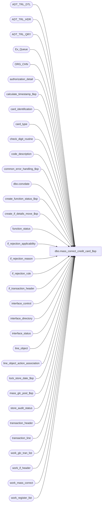

# dbo.mass_correct_credit_card_$sp

**Database:** auditworks_external  
**Server:** bedrockdb01  

## Architecture Diagram



## Table Dependencies

| Referenced Table |
|---|
| ADT_TRL_DTL |
| ADT_TRL_HDR |
| ADT_TRL_QRY |
| Ex_Queue |
| ORG_CHN |
| authorization_detail |
| calculate_timestamp_$sp |
| card_identification |
| card_type |
| check_digit_routine |
| code_description |
| common_error_handling_$sp |
| dbo.convdate |
| create_function_status_$sp |
| create_if_details_move_$sp |
| function_status |
| if_rejection_applicability |
| if_rejection_reason |
| if_rejection_rule |
| if_transaction_header |
| interface_control |
| interface_directory |
| interface_status |
| line_object |
| line_object_action_association |
| lock_store_date_$sp |
| mass_glc_post_$sp |
| store_audit_status |
| transaction_header |
| transaction_line |
| work_glc_tran_list |
| work_if_header |
| work_mass_correct |
| work_register_list |

## Stored Procedure Code

```sql
create proc dbo.mass_correct_credit_card_$sp 
(@process_id               binary(16),
 @user_id                  int,
 @revalidate_spid          int = NULL
)
AS

/* Proc Name: mass_correct_credit_card_$sp.
   Desc : To re-evaluate type 2 ( invalid card number ) interface rejections.
    If any of the invalid cards are now ok then remove interface reject
    reasons = 2 and 113. If all cards in a transaction are now on file then
    update any applicable interfaces and update the if_reject_qty.
   Called by mass_auto_revalidate_$sp.
   Front-end will populate if_rejection_reason.memo2 with encrypted version of card numbers.

HISTORY
Date     Name		Def# Description
Mar03,15 Vicci    TFS-108677 Avoid error 8114-Error converting data type nvarchar to numeric when the invalid card was both short and alpha.
Nov14,14 Vicci     TFS-92326 Take into account the fact that the value of the output parameter of a proc called with a TRY/CATCH is not returned 
                             to the calling proc when a raise-error occurs, when calling lock_store_date_$sp.  Do not report individual 201571 errors
                             since individual pre-verified 201550 errors have already been reported by the lock_store_date_$sp proc.
Jan19,12 Vicci        132481 Remove usage of data length function for substring extraction from unicode strings since it returns a length
                             of double that corresponding to the character positions within the string in the case of nvarchar and nchar data types.
Jan17,12 Vicci        132439 Remove references to CRDM user-defined string datatypes from S/A since CRDM is not changing them to support unicode.
Feb03,11 Paul                moved select of @entry_id for safety
Jan21,11 Vicci        124247 Correct error handling following call to lock_store_date_$sp to recognize the fact that it
                             is normal to receive an @@error of 266 along with a return code of 201550 given the common
                             error handling rollback with will already have occurred and the proc is being called within
                             a begin tran.
Feb27,07 Paul        DV-1357 uplift 73592 to SA5
Oct25,06 Phu           77931 Fix outer join for SQL 2005 Mode 90.
Nov09,05 Paul        DV-1322 apply 62921 to SA5
Nov01,05 Paul          62153 avoid division by zero, added nolock hints, apply 61728 to SA5,
				don't log audit trail unless there is some work to do
Sep20,05 Paul          60471 apply 60266, DV-1298 to SA5
Jul19,05 David       DV-1294 Revalidate I/F reject 113. 
Apr29,05 Paul        DV-1234 expand transaction_id to use tran_id_datatype
Mar22,05 Paul        DV-1218 Change audit trail seperator, comments
Feb23,05 David       DV-1206 Log encrypted version of card numbers.
Sep17,04 Maryam      DV-1146 change user_name to user_id.
Aug30,04 Maryam      DV-1120 Use convdate function for dates when logging the audit trail.
Aug23,04 Maryam      DV-1120 change audit trail query
Jul27,04 Maryam      DV-1071 Insert into ADT_TRL_HDR with include APP_ID, FNCTTN_NUM, use ORG_CHN_WRKSTN instead of register table.
May20,04 David       DV-1071 Use ORG_CHN table as new the Store table.
Apr21,04 Maryam      DV-1071 receive @process_id and @user_name and pass it to the sub procs.
			     modify the call to lock_store_date_$sp as it no longer outputs the user_name, 
			     added data length(reference_no) <= 20 for encrypted credit cards
Jun15,06 Vicci         73592 Skip store/dates locked by the Edit since lock will be held all day
Nov04,05 David         62921 Replace line_object based on line_object_type (4,6,8).
Oct21,05 David         61728 Get card_type from authorization detail for reject 113.
Sep16,05 David         60266 Check for reference_type when identifying card_type.
Jul14,05 David       DV-1298 Revalidate I/F reject 113. Log encrypted version of card numbers.
Feb16,04 Phu           21459 Remove unnecessary transaction id ranges in the where clause
Feb02,04 Phu           21723 Rejects not fixed when called directly from FE
Sep19,03 Phu           15801 Validate all or specific transactions
Sep15,03 ShuZ        1-G7A5F Remove all references to the interface_directory '... _check' 
                             fields from stored procedures/triggers and replace with usage 
                             of if_rejection_applicability table.
Apr24,03 Paul        1-KO2HY populate till_no
Apr01,03 Vicci          7340 prevent arithmetic overflow by changing @digit datatype to smallint
Jul26,02 Paul        1-E7L7M populate key_11 in Ex_Queue with entry_date_time
May16,02 Henry	     1-CD0IX Add R3.5 standardized common error handling
Feb25,02 Paul S      1-B8PTX removed unnecessary distinct when inserting audit trail header
Sep18,01 Paul           8726 use datetime for @entry_date_time
Sep12,01 David C        8720 R3 C/L - Include interface_id 28 in work_glc_tran_list
Jul25,01 David C        8413 Add transaction_id to if_transaction_header
Jun15,01 Paul           8082 move insert to ex_queue down to reduce deadlocking
May29,01 Paul           8027 remove hold logic
May23,01 Winnie         7557 Audit Trail enchancements.
May04,01 Henry          7369 Allows user-defined IF rejection reasons.
Aug14,00 Phu            6722 Correct MS error 3902: commit tran without begin tran
Jun01,00 John G         5678 Break down employee_no_check into component parts.
Mar01,00 Phu   5900 Change @@fetch_status > 0 to @@fetch_status <> 0 for MS SQL compatibility
Jan14,00 Paul           5824 corrected error trap message
May01,98 Paul
Jan16,97 Paul                author
 */

DECLARE 
	@calculated_card_type		nchar(1),
	@calculated_line_object		smallint,
	@cursor_open			tinyint,
	@date_reject_id			tinyint,
	@digit				smallint,
	@edit_timestamp			float,
	@entry_date_time		datetime,
	@entry_id_filler		numeric(12,0),
	@errmsg				nvarchar(255),
	@errno				int,
	@function_no			tinyint,
	@glc_rows			int,
	@if_reject_flag			tinyint,
	@register_no			smallint,
	@ret				int,
	@rows				int,
	@rows_deleted			int,
	@ORG_CHN_NAME			nvarchar(50),
	@sep				nchar(1),
	@store_no			int,
	@sum_digit			smallint,
	@table_key			nvarchar(255),
	@table_key_descr		nvarchar(255),
	@tinyint_filler			tinyint,
	@transaction_date		smalldatetime,
	@object_name			nvarchar(255),
	@process_name			nvarchar(100),
	@operation_name			nvarchar(100),
	@message_id			int,
	@all_selected_flag		tinyint,
	@if_rejection_description       nvarchar(100),
	@ENTRY_ID                       binary(16),
	@all_selected_descr		nvarchar(255),
	@some_skipped                   int

SELECT 
	@calculated_card_type = '?',
	@calculated_line_object = 0,
	@digit = 0,
	@sum_digit = 0,
	@function_no = 79,
	@cursor_open = 0,
	@tinyint_filler = 0,
	@entry_id_filler = 0,
	@entry_date_time = getdate(),
	@process_name = 'mass_correct_credit_card_$sp',
	@message_id = 201068,
	@ENTRY_ID = NEWID(),
	@all_selected_flag = 0, -- selected transactions
	@sep = NCHAR(12), -- audit trail seperator
	@some_skipped = 0

IF NOT EXISTS(
  SELECT 1
  FROM if_rejection_reason
  WHERE if_reject_reason IN (2,113)
    AND (process_id = @revalidate_spid OR @revalidate_spid IS NULL))
  RETURN

/*{ build temp table of rejected lines */

SELECT  tl.transaction_id,
	tl.line_id,
	orig_line_object = tl.line_object,
	line_action,
	check_digit_routine=0,
	card_no = CONVERT( numeric(20,0), ISNULL(ISNULL(invalid_reference_no, reference_no),'0')),
	card_no_char = RIGHT('00000000000000000000'+LTRIM(RTRIM(ISNULL(invalid_reference_no, reference_no))),20),
	calculated_card_type = @calculated_card_type,
	calculated_line_object = @calculated_line_object,
	tl.reference_type,
	digit1 = @digit,
	digit2 = @digit,
	digit3 = @digit,
	digit4 = @digit,
	digit5 = @digit,
	digit6 = @digit,
	digit7 = @digit,
	digit8 = @digit,
	digit9 = @digit,
	digit10 = @digit,
	digit11 = @digit,
	digit12 = @digit,
	digit13 = @digit,
	digit14 = @digit,
	digit15 = @digit,
	digit16 = @digit,
	digit17 = @digit,
	digit18 = @digit,
	digit19 = @digit,
	digit20 = @digit,
	sum_of_digits = @sum_digit,
	remainder_value = @digit,
	th.store_no,
	th.register_no,
	th.transaction_date,
	th.transaction_category,
	tl.line_object_type
   INTO #credit_cards
   FROM if_rejection_reason ir, transaction_header th WITH (NOLOCK), transaction_line tl WITH (NOLOCK)
  WHERE ir.if_reject_reason = 2
    AND th.transaction_id = ir.transaction_id
    AND ir.transaction_id = tl.transaction_id
    AND ir.line_id = tl.line_id
    AND th.date_reject_id = 0
    AND (ir.process_id = @revalidate_spid OR @revalidate_spid IS NULL)
    AND IsNumeric(ISNULL(invalid_reference_no, reference_no)) = 1
    AND (len(tl.reference_no) <= 20 OR tl.invalid_reference_no IS NOT NULL)

SELECT @errno = @@error,
	@rows = @@rowcount
IF @errno != 0
  BEGIN
   SELECT @errmsg = 'Failed to build table #credit_cards (2)',
	  @object_name = '#credit_cards',
	  @operation_name = 'SELECT'
  GOTO error
  END

INSERT INTO #credit_cards
SELECT  tl.transaction_id,
	tl.line_id,
	tl.line_object,
	line_action,
	0,
	NULL, -- card_no
	NULL, -- card_no_char
	IsNull(ad.card_type,'?'), -- calculated_card_type
	@calculated_line_object,
	tl.reference_type,
	@digit, @digit, @digit, @digit, @digit, @digit, @digit, @digit, @digit, @digit, 
	@digit, @digit, @digit, @digit, @digit, @digit, @digit, @digit, @digit, @digit, 
	@sum_digit,
	@digit, -- remainder_value
	th.store_no,
	th.register_no,
	th.transaction_date,
	th.transaction_category,
	tl.line_object_type
   FROM if_rejection_reason ir
        INNER JOIN transaction_header th WITH (NOLOCK) ON (th.transaction_id = ir.transaction_id)
        INNER JOIN transaction_line tl WITH (NOLOCK) ON (ir.transaction_id = tl.transaction_id AND ir.line_id = tl.line_id)
        LEFT JOIN authorization_detail ad WITH (NOLOCK) ON (tl.transaction_id = ad.transaction_id AND tl.line_id = ad.line_id)
  WHERE ir.if_reject_reason = 113
    AND th.date_reject_id = 0
    AND (ir.process_id = @revalidate_spid OR @revalidate_spid IS NULL)

  SELECT @errno = @@error,
	 @rows = @rows + @@rowcount
  IF @errno != 0
  BEGIN
    SELECT @errmsg = 'Failed to populate table #credit_cards (113)',
           @object_name = '#credit_cards',
           @operation_name = 'SELECT'
    GOTO error
  END

IF @rows = 0
BEGIN
  DELETE function_status
   WHERE user_id = @user_id
     AND function_no = @function_no
     AND process_id = @process_id

  SELECT @errno = @@error
  IF @errno != 0
  BEGIN
    SELECT @errmsg = 'Unable to delete function_no ' + CONVERT(nvarchar, @function_no) + ' from function_status',
           @object_name = 'function_status',
           @operation_name = 'DELETE'
    GOTO error
  END

  UPDATE if_rejection_reason
     SET process_id = NULL
    WHERE transaction_id >= 1
    AND transaction_id <= 999999999999
    AND line_id >= 0
    AND line_id <= 99999
    AND if_reject_reason IN (2,113)
    AND (process_id = @revalidate_spid OR @revalidate_spid IS NULL)

    SELECT @errno = @@error
    IF @errno != 0
    BEGIN
      SELECT @errmsg = 'Unable to set process_id to null in if_rejection_reason (1)',
             @object_name = 'if_rejection_reason',
             @operation_name = 'UPDATE'
      GOTO error
    END    

  DROP TABLE #credit_cards
  RETURN
END -- IF @rows = 0

UPDATE #credit_cards
   SET calculated_card_type = card_type
  FROM #credit_cards ec, card_identification ci
 WHERE ec.card_no >= ci.from_account_no
   AND ec.card_no <= ci.to_account_no
   AND ec.reference_type = ci.reference_type

SELECT @errno = @@error
IF @errno != 0
  BEGIN
   SELECT @errmsg = 'Failed to update #credit_cards (calculated_card_type)',
	  @object_name = '#credit_cards',
	  @operation_name = 'UPDATE'
   GOTO error
  END

DELETE FROM #credit_cards
  WHERE calculated_card_type = '?'

SELECT @errno = @@error
IF @errno != 0
 BEGIN
   SELECT @errmsg = 'Failed to DELETE #credit_cards',
	  @object_name = '#credit_cards',
	  @operation_name = 'DELETE'
   GOTO error
 END

UPDATE #credit_cards
   SET check_digit_routine=check_digit_routine_number
  FROM #credit_cards ec, card_type ct
 WHERE calculated_card_type = card_type

SELECT @errno = @@error
IF @errno != 0
 BEGIN
   SELECT @errmsg = 'Failed to UPDATE #credit_cards (1)',
	  @object_name = '#credit_cards',
	  @operation_name = 'UPDATE'
   GOTO error
 END

UPDATE #credit_cards
   SET digit20= ISNULL(CONVERT(tinyint, SUBSTRING(card_no_char, 20, 1 )),0) * multiplier20,
       digit19= (ISNULL(CONVERT(tinyint, SUBSTRING(card_no_char, 19, 1 )),0) * multiplier19)
	- (sum_of_product_digits * SIGN(SIGN(ISNULL(CONVERT(tinyint, SUBSTRING(card_no_char, 19, 1 )),0) - 5)+1)),
       digit18= ISNULL(CONVERT(tinyint, SUBSTRING(card_no_char, 18, 1 )),0) * multiplier18,
       digit17= (ISNULL(CONVERT(tinyint, SUBSTRING(card_no_char, 17, 1 )),0) * multiplier17)
	- (sum_of_product_digits * SIGN(SIGN(ISNULL(CONVERT(tinyint, SUBSTRING(card_no_char, 17, 1 )),0) - 5)+1)),
       digit16= ISNULL(CONVERT(tinyint, SUBSTRING(card_no_char, 16, 1 )),0) * multiplier16,
       digit15= (ISNULL(CONVERT(tinyint, SUBSTRING(card_no_char, 15, 1 )),0) * multiplier15)
	- (sum_of_product_digits * SIGN(SIGN(ISNULL(CONVERT(tinyint, SUBSTRING(card_no_char, 15, 1 )),0) - 5)+1)),
       digit14= ISNULL(CONVERT(tinyint, SUBSTRING(card_no_char, 14, 1 )),0) * multiplier14,
       digit13= (ISNULL(CONVERT(tinyint, SUBSTRING(card_no_char, 13, 1 )),0) * multiplier13)
	- (sum_of_product_digits * SIGN(SIGN(ISNULL(CONVERT(tinyint, SUBSTRING(card_no_char, 13, 1 )),0) - 5)+1)),
       digit12= ISNULL(CONVERT(tinyint, SUBSTRING(card_no_char, 12, 1 )),0) * multiplier12,
     digit11= (ISNULL(CONVERT(tinyint, SUBSTRING(card_no_char, 11, 1 )),0) * multiplier11)
	- (sum_of_product_digits * SIGN(SIGN(ISNULL(CONVERT(tinyint, SUBSTRING(card_no_char, 11, 1 )),0) - 5)+1))
  FROM #credit_cards, check_digit_routine
 WHERE check_digit_routine=check_digit_routine_no
   AND card_no_char IS NOT NULL --


SELECT @errno = @@error
IF @errno != 0
 BEGIN
   SELECT @errmsg = 'Failed to UPDATE #credit_cards (2)',
	  @object_name = '#credit_cards',
	  @operation_name = 'UPDATE'
   GOTO error
 END

UPDATE #credit_cards
   SET digit10= ISNULL(CONVERT(tinyint, SUBSTRING(card_no_char, 10, 1 )),0) * multiplier10,
       digit9= (ISNULL(CONVERT(tinyint, SUBSTRING(card_no_char, 9, 1 )),0) * multiplier9)
	- (sum_of_product_digits * SIGN(SIGN(ISNULL(CONVERT(tinyint, SUBSTRING(card_no_char, 9, 1 )),0) - 5)+1)),
       digit8= ISNULL(CONVERT(tinyint, SUBSTRING(card_no_char, 8, 1 )),0) * multiplier8,
       digit7= (ISNULL(CONVERT(tinyint, SUBSTRING(card_no_char, 7, 1 )),0) * multiplier7)
	- (sum_of_product_digits * SIGN(SIGN(ISNULL(CONVERT(tinyint, SUBSTRING(card_no_char, 7, 1 )),0) - 5)+1)),
       digit6= ISNULL(CONVERT(tinyint, SUBSTRING(card_no_char, 6, 1 )),0) * multiplier6,
       digit5= (ISNULL(CONVERT(tinyint, SUBSTRING(card_no_char, 5, 1 )),0) * multiplier5)
	- (sum_of_product_digits * SIGN(SIGN(ISNULL(CONVERT(tinyint, SUBSTRING(card_no_char, 5, 1 )),0) - 5)+1)),
       digit4= ISNULL(CONVERT(tinyint, SUBSTRING(card_no_char, 4, 1 )),0) * multiplier4,
       digit3= (ISNULL(CONVERT(tinyint, SUBSTRING(card_no_char, 3, 1 )),0) * multiplier3)
	- (sum_of_product_digits * SIGN(SIGN(ISNULL(CONVERT(tinyint, SUBSTRING(card_no_char, 3, 1 )),0) - 5)+1)),
       digit2= ISNULL(CONVERT(tinyint, SUBSTRING(card_no_char, 2, 1 )),0) * multiplier2,
       digit1= (ISNULL(CONVERT(tinyint, SUBSTRING(card_no_char, 1, 1 )),0) * multiplier1)
	- (sum_of_product_digits * SIGN(SIGN(ISNULL(CONVERT(tinyint, SUBSTRING(card_no_char, 1, 1 )),0) - 5)+1))
  FROM #credit_cards, check_digit_routine
 WHERE check_digit_routine=check_digit_routine_no
   AND card_no_char IS NOT NULL --

SELECT @errno = @@error
IF @errno != 0
 BEGIN
   SELECT @errmsg = 'Failed to UPDATE #credit_cards (3)',
	  @object_name = '#credit_cards',
	  @operation_name = 'UPDATE'
   GOTO error
 END

UPDATE #credit_cards
 SET sum_of_digits = digit1 + digit2 + digit3 + digit4 + digit5 + digit6
	+ digit7 + digit8 + digit9 + digit10 + digit11 + digit12 + digit13
	+ digit14 + digit15 + digit16 + digit17 + digit18 + digit19 + digit20
  FROM #credit_cards, check_digit_routine
 WHERE check_digit_routine=check_digit_routine_no
   AND sum_of_products = 1
   AND card_no_char IS NOT NULL --

SELECT @errno = @@error
IF @errno != 0
 BEGIN
   SELECT @errmsg = 'Failed to UPDATE #credit_cards (4)',
	  @object_name = '#credit_cards',
	  @operation_name = 'UPDATE'
   GOTO error
 END

UPDATE #credit_cards
   SET remainder_value = sum_of_digits % divisor
  FROM #credit_cards c, check_digit_routine cd
 WHERE c.check_digit_routine = cd.check_digit_routine_no
   AND card_no_char IS NOT NULL --
   AND cd.divisor >= 1

SELECT @errno = @@error
IF @errno != 0
 BEGIN
   SELECT @errmsg = 'Failed to UPDATE #credit_cards (5)',
	  @object_name = '#credit_cards',
	  @operation_name = 'UPDATE'
   GOTO error
 END

/* change line_object only if the resulting object-action is valid */
UPDATE #credit_cards
   SET calculated_line_object = cd.line_object
  FROM #credit_cards ec, card_type cd, line_object_action_association la
 WHERE ec.line_object_type = 6
   AND ec.calculated_card_type != '?'
   AND ec.calculated_card_type = cd.card_type
   AND la.line_object          = cd.line_object
   AND la.line_action         = ec.line_action
   AND la.transaction_category = ec.transaction_category

SELECT @errno = @@error
IF @errno != 0
  BEGIN
   SELECT @errmsg = 'Failed to update #credit_cards (calculated_line_object type 6) ',
	  @object_name = '#credit_cards',
	  @operation_name = 'UPDATE'
   GOTO error
  END

UPDATE #credit_cards
   SET calculated_line_object = cd.payment_line_object
  FROM #credit_cards ec, card_type cd, line_object_action_association la
 WHERE ec.line_object_type IN (4, 8)
   AND ec.calculated_card_type != '?'
   AND ec.calculated_card_type = cd.card_type
   AND la.line_object          = cd.payment_line_object
   AND la.line_action          = ec.line_action
   AND la.transaction_category = ec.transaction_category

SELECT @errno = @@error
IF @errno != 0
  BEGIN
   SELECT @errmsg = 'Failed to update #credit_cards (calculated_line_object type 4,8) ',
	  @object_name = '#credit_cards',
	  @operation_name = 'UPDATE'
   GOTO error
  END

DELETE FROM #credit_cards
 WHERE calculated_line_object = 0
    OR remainder_value <> 0

SELECT @errno = @@error
IF @errno != 0
 BEGIN
SELECT @errmsg = 'Failed to DELETE #credit_cards',
	  @object_name = '#credit_cards',
	  @operation_name = 'DELETE'
   GOTO error
 END

/* No credit cards to post since all cards are still bad */
IF NOT EXISTS (SELECT 1 FROM #credit_cards)
BEGIN
  DELETE function_status
   WHERE user_id = @user_id
     AND function_no = @function_no
     AND process_id = @process_id

  SELECT @errno = @@error
  IF @errno != 0
  BEGIN
    SELECT @errmsg = 'Unable to delete function_no ' + CONVERT(nvarchar, @function_no) + ' from function_status',
           @object_name = 'function_status',
           @operation_name = 'DELETE'
    GOTO error
  END

  UPDATE if_rejection_reason
     SET process_id = NULL
    WHERE transaction_id >= 1
    AND transaction_id <= 999999999999
    AND line_id >= 0
    AND line_id <= 99999
    AND if_reject_reason IN (2,113)
    AND (process_id = @revalidate_spid OR @revalidate_spid IS NULL)

    SELECT @errno = @@error
    IF @errno != 0
    BEGIN
      SELECT @errmsg = 'Unable to set process_id to null in if_rejection_reason (1)',
             @object_name = 'if_rejection_reason',
             @operation_name = 'UPDATE'
      GOTO error
    END    

  RETURN
END

EXEC calculate_timestamp_$sp @edit_timestamp OUTPUT
SELECT @errno = @@error
IF @errno != 0
BEGIN
  IF @errmsg IS NULL /* then */
     SELECT @errmsg = 'Failed to execute stored procedure calculate_timestamp_$sp'
  SELECT @object_name = 'calculate_timestamp_$sp',
	 @operation_name = 'EXEC'
  GOTO error
END

IF @revalidate_spid IS NULL
  SELECT @all_selected_flag = 1  --all transactions

SELECT @if_rejection_description = if_rejection_description
  FROM if_rejection_rule
 WHERE if_rejection_reason = 2

SELECT @errno = @@error
IF @errno != 0
  BEGIN
   SELECT @errmsg = 'Failed to select the description of if_rejection_reason = 2',
	  @object_name = 'if_rejection_rule',
	  @operation_name = 'SELECT'
   GOTO error
  END       

SELECT @if_rejection_description = COALESCE(@if_rejection_description,' ') + ', ' + if_rejection_description
  FROM if_rejection_rule
 WHERE if_rejection_reason = 113

SELECT @errno = @@error
IF @errno != 0
  BEGIN
   SELECT @errmsg = 'Failed to select the description of if_rejection_reason = 113',
	  @object_name = 'if_rejection_rule',
	  @operation_name = 'SELECT'
   GOTO error
  END       

SELECT @all_selected_descr = code_display_descr
 FROM code_description
 WHERE code_type = 203
   AND code = @all_selected_flag

SELECT @errno = @@error
IF @errno != 0
  BEGIN
   SELECT @errmsg = 'Failed to select the description for code_type = 203',
	  @object_name = 'code_description',
	  @operation_name = 'SELECT'
   GOTO error
  END   
  
INSERT INTO ADT_TRL_HDR(
       ENTRY_ID,
       ENTRY_DATE_TIME,
       USER_ID,
     APP_ID,
       ROOT_TBL_NAME,
       ROOT_TBL_KEY,
       ROOT_TBL_KEY_RSRC_NAME,
       ROOT_TBL_KEY_RSRC_PRMS,
       FNCTN_NUM)
VALUES (@ENTRY_ID,
        getdate(),
        @user_id,
        300,
        'TRANSACTION',
        '2, 113'+@sep+ CONVERT(nvarchar, @all_selected_flag),
        'TK_IF_REJE_REAS_ALL_SELE_FLAG',
         @if_rejection_description +@sep+@all_selected_descr,
         79)
        
SELECT @errno = @@error
IF @errno != 0
  BEGIN
   SELECT @errmsg = 'Failed to insert into ADT_TRL_HDR',
	  @object_name = 'ADT_TRL_HDR',
	  @operation_name = 'INSERT'
   GOTO error
  END

/* re-evaluate if_rejections for one store-date at a time */

DECLARE mass_credit_cards_crsr CURSOR FAST_FORWARD
FOR
SELECT DISTINCT
	u.store_no,
	u.transaction_date
  FROM #credit_cards u WITH (NOLOCK), store_audit_status s WITH (NOLOCK)  --73592
 WHERE u.store_no = s.store_no
   AND u.transaction_date = s.sales_date
   AND s.date_reject_id = 0
   AND s.update_in_progress NOT IN (1,4)  --don't revalidate if trickle-edit has date locked

OPEN mass_credit_cards_crsr

SELECT @errno = @@error
IF @errno != 0
  BEGIN
   SELECT @errmsg = 'Failed to open cursor mass_credit_cards_crsr',
	  @object_name = 'mass_credit_cards_crsr',
	  @operation_name = 'OPEN'
   GOTO error
  END

SELECT @cursor_open = 1

WHILE 1=1
BEGIN

FETCH mass_credit_cards_crsr INTO
	@store_no,
	@transaction_date

IF @@fetch_status <> 0
  BREAK

DELETE work_if_header
  WHERE process_id = @process_id

SELECT @errno = @@error
IF @errno != 0
  BEGIN
   SELECT @errmsg = 'Failed to delete rows from table work_if_header',
	  @object_name = 'work_if_header',
	  @operation_name = 'DELETE'
   GOTO error
  END

DELETE work_mass_correct
  WHERE process_id = @process_id

SELECT @errno = @@error
IF @errno != 0
  BEGIN
   SELECT @errmsg = 'Failed to delete rows from table work_mass_correct',
	  @object_name = 'work_mass_correct',
	  @operation_name = 'DELETE'
   GOTO error
  END

/* Lock store-date */

BEGIN TRAN
  SELECT @ret = NULL;
  BEGIN TRY 
    EXEC lock_store_date_$sp @process_id, @user_id, @store_no, @transaction_date, 0, @function_no, @ret OUTPUT;
  END TRY
  BEGIN CATCH
  SELECT @errno = ERROR_NUMBER();
  IF @ret IS NULL OR @ret = 0
    SELECT @ret = @errno;
  END CATCH;          
  IF @errno != 0 AND @ret <> 201550 AND @errno <> 201550
  BEGIN
    SELECT @errmsg = 'Failed to execute lock_store_date_$sp',
           @object_name = 'lock_store_date_$sp',
           @operation_name = 'EXEC'
    GOTO error
  END

IF @ret = 0
  BEGIN
   INSERT work_mass_correct (
	process_id,
	store_no,
	transaction_date,
	register_no,
	transaction_id,
	if_reject_flag,
	date_reject_id,
	transaction_series,
        transaction_no, 
        entry_date_time, 
        cashier_no, 
        line_id, 
        calculated_line_object,
        card_type,
        orig_line_object,
        card_no,
        till_no) 
    SELECT 
	@process_id,
	th.store_no,
	th.transaction_date,
	th.register_no,
	mt.transaction_id,
	0,
	date_reject_id,
	transaction_series,
        transaction_no, 
        entry_date_time, 
        cashier_no, 
        line_id, 
        calculated_line_object,
        calculated_card_type,
        orig_line_object,
        card_no,
        till_no
   FROM #credit_cards mt, transaction_header th
  WHERE th.transaction_id = mt.transaction_id
    AND mt.store_no = @store_no
    AND mt.transaction_date= @transaction_date
    AND if_rejection_flag = 1
/* to check that transactions is still an I/F reject */

   SELECT @errno = @@error
   IF @errno != 0
   BEGIN
     SELECT @errmsg = 'Failed to insert work_mass_correct',
            @object_name = 'work_mass_correct',
            @operation_name = 'INSERT'
     GOTO error
   END
     
   EXEC create_function_status_$sp @process_id, @user_id, @function_no, 0,
	@errmsg OUTPUT, @store_no, @transaction_date, 0
   SELECT @errno = @@error
   IF @errno != 0
     BEGIN
      IF @errmsg IS NULL /* then */
	SELECT @errmsg = 'Failed to execute stored proc create_function_status_$sp'
      SELECT @object_name = 'create_function_status_$sp',
	     @operation_name = 'EXEC'
      GOTO error
     END
   COMMIT TRANSACTION
  END
 ELSE /* unable to lock, skip all transactions for store-date */
    BEGIN
      SELECT @some_skipped = 1        
      
      IF @@trancount > 0
        COMMIT TRANSACTION
        	        
     CONTINUE
  END


/* save list of store-reg-dates affected */

DELETE work_register_list
  WHERE process_id = @process_id

SELECT @errno = @@error
IF @errno != 0
  BEGIN
   SELECT @errmsg = 'Failed to delete work_register_list',
	  @object_name = 'work_register_list',
	  @operation_name = 'DELETE'
   GOTO error
  END

INSERT work_register_list (
	process_id,
	store_no,
	transaction_date,
	date_reject_id,
	register_no,
	function_no )
SELECT DISTINCT
	@process_id,
	store_no,
	transaction_date,
	date_reject_id,
	register_no,
	@function_no
  FROM work_mass_correct WITH (NOLOCK)
  WHERE process_id = @process_id

SELECT @errno = @@error
IF @errno != 0
  BEGIN
   SELECT @errmsg = 'Failed to insert work_register_list',
	  @object_name = 'work_register_list',
	 @operation_name = 'INSERT'
   GOTO error
  END


SELECT DISTINCT ic.transaction_id,
	ic.interface_id,
	interface_status_flag = id.update_timing,
	wm.transaction_date,
	wm.entry_date_time
  INTO #tran_interface_list
  FROM work_mass_correct wm WITH (NOLOCK), interface_control ic WITH (NOLOCK),
       interface_directory id, if_rejection_applicability ir
 WHERE wm.transaction_id = ic.transaction_id
  AND ic.interface_status_flag = 99
  AND ic.interface_id = id.interface_id
  AND id.interface_id = ir.interface_id  
  AND id.update_timing >= 1
  AND process_id = @process_id
  AND ir.if_reject_reason IN (2,113) 
  
SELECT @errno = @@error
IF @errno != 0
  BEGIN
   SELECT @errmsg = 'Failed to build table #tran_interface_list',
	  @object_name = '#tran_interface_list',
	  @operation_name = 'INSERT'
   GOTO error
  END

/*{ don't include transactions that are still i/f rejections
    due to other reasons for the same interfaces */

/* { Defect #7369. Part of the User Defined IF Rejects. */
SELECT @ORG_CHN_NAME = ORG_CHN_NAME
  FROM ORG_CHN WITH (NOLOCK)
 WHERE ORG_CHN_NUM = @store_no
  
SELECT @errno = @@error
IF @errno != 0
  BEGIN
   SELECT @errmsg = 'Failed to select store name',
	  @object_name = 'ORG_CHN',
	  @operation_name = 'SELECT'
   GOTO error
  END

INSERT INTO ADT_TRL_DTL(
       ENTRY_ID,
       TBL_NAME,
       TBL_KEY,
       TBL_KEY_RSRC_NAME,
       TBL_KEY_RSRC_PRMS,
       ACTN_CODE,
       CLMN_NAME,
       OLD_VAL)
SELECT @ENTRY_ID,
       'IF_REJECTION_REASON',
        CONVERT(nvarchar, 2)
        +@sep+CONVERT(nvarchar, transaction_id)
        +@sep+ CONVERT(nvarchar, line_id),
       'TK_IF_REJE_REAS_STOR_TRAN_DATE_REGI_DATE_REJE_ID_TRAN_NO_TRAN_SERI_ENTR_DATE_TIME_LINE_ID',
        @if_rejection_description
        +@sep+ CONVERT(nvarchar, store_no)+ '-' +@ORG_CHN_NAME
        +@sep+ dbo.convdate(transaction_date)
  +@sep+ CONVERT(nvarchar, register_no)
        +@sep+ CONVERT(nvarchar, date_reject_id)
        +@sep+ CONVERT(nvarchar, transaction_no)
        +@sep+ CONVERT(nvarchar, transaction_series)
        +@sep+ dbo.convdate(entry_date_time)
        +@sep+ CONVERT(nvarchar, line_id),
        'D',
        'CARD_NO',
         CONVERT(nvarchar, card_no)       
    FROM work_mass_correct WITH (NOLOCK)
   WHERE process_id = @process_id

SELECT @errno = @@error
IF @errno != 0
  BEGIN
   SELECT @errmsg = 'Failed to insert into ADT_TRL_DTL for deleted card_no',
	  @object_name = 'ADT_TRL_DTL',
	  @operation_name = 'INSERT'
   GOTO error
  END

INSERT INTO ADT_TRL_DTL(
       ENTRY_ID,
       TBL_NAME,
       TBL_KEY,
       TBL_KEY_RSRC_NAME,
       TBL_KEY_RSRC_PRMS,
       ACTN_CODE,
       CLMN_NAME,
       OLD_VAL,
       NEW_VAL)
SELECT @ENTRY_ID,
       'TRANSACTION_LINE',
       CONVERT(nvarchar, transaction_id)
       +@sep+ CONVERT(nvarchar, line_id),
       'TK_STOR_TRAN_DATE_REGI_DATE_REJE_ID_TRAN_NO_TRAN_SERI_ENTR_DATE_TIME_LINE_ID',
        CONVERT(nvarchar, store_no) +'-'+@ORG_CHN_NAME
        +@sep+ dbo.convdate(transaction_date)
        +@sep+ CONVERT(nvarchar, register_no)
        +@sep+ CONVERT(nvarchar, date_reject_id)
        +@sep+ CONVERT(nvarchar, transaction_no)
     	+@sep+ CONVERT(nvarchar, transaction_series)
     	+@sep+ dbo.convdate(entry_date_time)
     	+@sep+ CONVERT(nvarchar, line_id),
        'M',
        'LINE_OBJECT',
         CONVERT(nvarchar, orig_line_object) + '-' + o.line_object_description, 
         CONVERT(nvarchar, calculated_line_object)+ '-'+ l.line_object_description
   FROM work_mass_correct w WITH (NOLOCK), line_object o, line_object l
  WHERE process_id = @process_id
    AND w.orig_line_object <> w.calculated_line_object
    AND w.orig_line_object = o.line_object
    AND w.calculated_line_object = l.line_object
    
SELECT @errno = @@error
IF @errno != 0
  BEGIN
   SELECT @errmsg = 'Failed to insert into ADT_TRL_DTL for modified line_object',
	  @object_name = 'ADT_TRL_DTL',
	 @operation_name = 'INSERT'
   GOTO error
  END
  
INSERT INTO ADT_TRL_QRY(
       ENTRY_ID,
       QRY_KEY_NUM,
       KEY_PART_VAL_1,
       KEY_PART_VAL_2,
       KEY_PART_VAL_3,
       KEY_PART_VAL_4,
       KEY_PART_VAL_5,
       KEY_PART_VAL_6,
       KEY_PART_VAL_7,
       KEY_PART_VAL_8,
       KEY_PART_VAL_9,
       KEY_PART_VAL_10)
SELECT @ENTRY_ID,
       301,
       CONVERT(nvarchar,store_no),
       CONVERT(nvarchar,register_no),
       dbo.convdate(transaction_date),
       CONVERT(nvarchar, till_no),
       CONVERT(nvarchar,transaction_no),
       CONVERT(nvarchar,transaction_series),
       CONVERT(nvarchar,cashier_no),
       CONVERT(nvarchar,transaction_id),
       NULL,
       NULL
  FROM work_mass_correct
 WHERE process_id = @process_id 
       
SELECT @errno = @@error
IF @errno != 0
  BEGIN
    SELECT @errmsg = 'Failed to insert into ADT_TRL_QRY',
    	   @object_name = 'ADT_TRL_QRY',
	   @operation_name = 'INSERT'
    GOTO error
END
          
DELETE #tran_interface_list
  FROM #tran_interface_list il, if_rejection_reason ir WITH (NOLOCK),
	if_rejection_applicability ia
  WHERE il.transaction_id = ir.transaction_id
  AND ir.if_reject_reason NOT IN (2,113)
  AND il.interface_id = ia.interface_id
  AND ia.if_reject_reason = ir.if_reject_reason

SELECT @errno = @@error
IF @errno != 0
  BEGIN
   SELECT @errmsg = 'Failed to delete rows from #tran_interface_list (User Defined IF Rejects >= 200)',
	  @object_name = '#tran_interface_list',
	  @operation_name = 'DELETE'
   GOTO error
  END

/* } Defect #7369. Part of the User Defined IF Rejects. */

/*} don't include transactions that are still i/f rejections
    due to other reasons for the same interfaces */


/*{ change if_reject flags on transactions */

  /* but don't include transactions still rejected for other interfaces
     for which the upc_check is not turned on */

  /* get list of corrected transactions (at least one interface has been corrected) */

SELECT DISTINCT transaction_id
  INTO #non_rejects
  FROM #tran_interface_list

SELECT @errno = @@error
IF @errno != 0
  BEGIN
   SELECT @errmsg = 'Failed to build temp table #non_rejects',
	  @object_name = '#non_rejects',
	  @operation_name = 'SELECT'
   GOTO error
  END

/* get list of corrected tran which apply to glc */
DELETE work_glc_tran_list
  WHERE process_id = @process_id

SELECT @errno = @@error
IF @errno != 0
  BEGIN
   SELECT @errmsg = 'Failed to delete work_glc_tran_list',
	  @object_name = 'work_glc_tran_list',
	  @operation_name = 'DELETE'
   GOTO error
  END

INSERT work_glc_tran_list (
	process_id,
	transaction_id )
SELECT DISTINCT @process_id, transaction_id
  FROM #tran_interface_list 
 WHERE interface_id = 28
 
SELECT @glc_rows = @@rowcount,
	@errno = @@error
IF @errno != 0
  BEGIN
   SELECT @errmsg = 'Failed to insert work_glc_tran_list',
	  @object_name = 'work_glc_tran_list',
	  @operation_name = 'INSERT'
   GOTO error
  END

UPDATE function_status
   SET status = 2
  WHERE user_id = @user_id
  AND process_id = @process_id
  AND function_no = @function_no

SELECT @errno = @@error
IF @errno != 0
  BEGIN
 SELECT @errmsg = 'Failed to update function_status (status=2)',
	  @object_name = 'function_status',
	  @operation_name = 'UPDATE'
   GOTO error
  END

INSERT work_if_header (
	process_id,
	transaction_id,
	effective_date,
	entry_date_time)
SELECT DISTINCT @process_id,
	transaction_id,
	transaction_date,
	entry_date_time
  FROM #tran_interface_list
  WHERE interface_status_flag = 1
  
SELECT @errno = @@error
IF @errno != 0
 BEGIN
  SELECT @errmsg = 'Failed to insert work_if_header',
	  @object_name = 'work_if_header',
	  @operation_name = 'INSERT'
   GOTO error
  END

BEGIN TRANSACTION

UPDATE authorization_detail
   SET card_type = ec.card_type
  FROM work_mass_correct ec WITH (NOLOCK), authorization_detail ad
  WHERE ad.card_type != ec.card_type
  AND ec.transaction_id = ad.transaction_id
  AND ec.line_id = ad.line_id

SELECT @errno = @@error
IF @errno != 0
  BEGIN
   SELECT @errmsg = 'Failed to update authorization_detail',
	  @object_name = 'authorization_detail',
	  @operation_name = 'UPDATE'
   GOTO error
  END

UPDATE transaction_line
   SET line_object  = ec.calculated_line_object
  FROM work_mass_correct ec WITH (NOLOCK), transaction_line tl
 WHERE calculated_line_object >= 1
   AND calculated_line_object <> line_object
   AND tl.transaction_id = ec.transaction_id
   AND tl.line_id = ec.line_id

SELECT @errno = @@error
IF @errno != 0
 BEGIN
   SELECT @errmsg = 'Failed to update transaction_line',
	  @object_name = 'transaction_line',
	  @operation_name = 'UPDATE'
   GOTO error
  END

INSERT if_transaction_header (
	store_no,
	register_no,
	transaction_date,
	date_reject_id,
	transaction_series,
	transaction_no,
	entry_date_time,
	cashier_no,
	transaction_category,
	tender_total,
	transaction_void_flag,
	customer_info_exists,
	exception_flag,
	deposit_declaration_flag,
	closeout_flag,
	media_count_flag,
	customer_modified_flag,
	tax_override_flag,
	pos_tax_jurisdiction,
	edit_timestamp,
	employee_no,
	transaction_remark,
	source_process_no,
 	last_modified_date_time,
	in_use_timestamp,
	updated_by_user_id,
	transaction_id,
	till_no )
SELECT
	store_no,
	register_no,
	transaction_date,
	date_reject_id,
	transaction_series,
	transaction_no,
	th.entry_date_time,
	cashier_no,
	transaction_category,
	tender_total,
	transaction_void_flag,
	customer_info_exists,
	exception_flag,
	deposit_declaration_flag,
	closeout_flag,
	media_count_flag,
	customer_modified_flag,
	tax_override_flag,
	pos_tax_jurisdiction,
	@edit_timestamp,
	employee_no,
	transaction_remark,
	@function_no,
	last_modified_date_time,
	in_use_timestamp,
	updated_by_user_id,
	th.transaction_id,
	th.till_no
  FROM work_if_header wh WITH (NOLOCK), transaction_header th WITH (NOLOCK)
  WHERE process_id = @process_id
  AND wh.transaction_id = th.transaction_id

SELECT @errno = @@error
IF @errno != 0
  BEGIN
   SELECT @errmsg = 'Failed to insert if_transaction_header',
	  @object_name = 'if_transaction_header',
	  @operation_name = 'INSERT'
   GOTO error
  END

UPDATE work_if_header
  SET if_entry_no = ih.if_entry_no
  FROM work_if_header wh, transaction_header th WITH (NOLOCK), if_transaction_header ih WITH (NOLOCK)
  WHERE wh.process_id = @process_id
  AND wh.transaction_id = th.transaction_id
  AND ih.store_no = th.store_no
  AND ih.transaction_date = th.transaction_date
  AND ih.entry_date_time = th.entry_date_time
  AND ih.register_no = th.register_no
  AND ih.transaction_no = th.transaction_no
  AND ih.transaction_series = th.transaction_series
  AND ih.edit_timestamp = @edit_timestamp

SELECT @errno = @@error
IF @errno != 0
  BEGIN
   SELECT @errmsg = 'Failed to update work_if_header',
	  @object_name = 'work_if_header',
	  @operation_name = 'UPDATE'
   GOTO error
  END

COMMIT TRANSACTION

/* Call sub-procedure to create entries in the if detail tables */
EXEC create_if_details_move_$sp @process_id, @user_id, 1, @errmsg OUTPUT

SELECT @errno = @@error
IF @errno != 0
  BEGIN
   IF @errmsg IS NULL /* then */
 SELECT @errmsg = 'Failed to execute stored procedure create_if_details_move_$sp'
   SELECT @object_name = 'create_if_details_move_$sp',
	  @operation_name = 'EXEC'
   GOTO error
  END

BEGIN TRANSACTION

/* Delete rejections where credit card is now on file */

DELETE if_rejection_reason
  FROM work_mass_correct wm WITH (NOLOCK), if_rejection_reason ir
  WHERE wm.transaction_id = ir.transaction_id
  AND wm.line_id = ir.line_id
  AND ir.if_reject_reason IN (2,113)
  AND wm.process_id = @process_id

SELECT @errno = @@error
IF @errno != 0
  BEGIN
   SELECT @errmsg = 'Failed to delete if_rejection_reason',
	  @object_name = 'if_rejection_reason',
	  @operation_name = 'DELETE'
   GOTO error
  END

/* exclude lines that have other i/f reject reasons */

DELETE work_mass_correct 
  FROM if_rejection_reason ir WITH (NOLOCK), work_mass_correct wm
 WHERE wm.transaction_id = ir.transaction_id
   AND wm.line_id = ir.line_id
   AND wm.process_id = @process_id

SELECT @errno = @@error
IF @errno != 0
  BEGIN
   SELECT @errmsg = 'Failed to delete rows from work_mass_correct',
	  @object_name = 'work_mass_correct',
	  @operation_name = 'DELETE'
   GOTO error
  END


  /* get list of tran for which no i/f rejections exist */
DELETE #non_rejects
  FROM #non_rejects nr, if_rejection_reason ir WITH (NOLOCK)
  WHERE nr.transaction_id = ir.transaction_id

SELECT @errno = @@error
IF @errno != 0
  BEGIN
   SELECT @errmsg = 'Failed to delete rows from temp table #non_rejects',
	  @object_name = '#non_rejects',
	  @operation_name = 'DELETE'
   GOTO error
  END

-- Reset process_id to null for remaining unvalidate trans
UPDATE if_rejection_reason
   SET process_id = NULL
  FROM #credit_cards t, if_rejection_reason ir
 WHERE t.store_no = @store_no
   AND t.transaction_date = @transaction_date
   AND t.transaction_id = ir.transaction_id
   AND ir.if_reject_reason IN (2,113)
   AND (ir.process_id = @revalidate_spid OR @revalidate_spid IS NULL)

  SELECT @errno = @@error
  IF @errno != 0
  BEGIN
   SELECT @errmsg = 'Unable to set process_id to null in if_rejection_reason (2)',
           @object_name = 'if_rejection_reason',
           @operation_name = 'UPDATE'
    GOTO error
  END

UPDATE transaction_line
  SET interface_rejection_flag = 0,
       invalid_reference_no = NULL -- remove unencrypted version of reference no
  FROM work_mass_correct wm WITH (NOLOCK), transaction_line tl
  WHERE wm.transaction_id = tl.transaction_id
  AND tl.interface_rejection_flag = 1
  AND wm.line_id = tl.line_id
  AND wm.process_id = @process_id

SELECT @errno = @@error
IF @errno != 0
  BEGIN
   SELECT @errmsg = 'Failed to update transaction_line',
	  @object_name = 'transaction_line',
	  @operation_name = 'UPDATE'
   GOTO error
  END

UPDATE transaction_header
 SET if_rejection_flag = 0
  FROM #non_rejects nr, transaction_header th
  WHERE nr.transaction_id = th.transaction_id

SELECT @errno = @@error
IF @errno != 0
  BEGIN
   SELECT @errmsg = 'Failed to update table transaction_header',
	  @object_name = 'transaction_header',
	  @operation_name = 'UPDATE'
   GOTO error
  END

UPDATE interface_control
  SET interface_status_flag = il.interface_status_flag
  FROM #tran_interface_list il, interface_control ic
  WHERE il.transaction_id = ic.transaction_id
  AND il.interface_id = ic.interface_id

SELECT @errno = @@error
IF @errno != 0
  BEGIN
   SELECT @errmsg = 'Failed to update interface_control',
	  @object_name = 'interface_control',
	  @operation_name = 'UPDATE'
   GOTO error
  END

INSERT Ex_Queue (
		queue_id, -- interface_id
    		key_1, --if_entry_no
		key_2, --interface_control_flag
		key_9, -- effective_date
		key_10, -- interface_posting_date
		key_11) -- entry_date_time
SELECT il.interface_id,
	wh.if_entry_no,
	10,
	il.transaction_date,
	getdate(),
	wh.entry_date_time
  FROM #tran_interface_list il, work_if_header wh WITH (NOLOCK)
 WHERE il.interface_status_flag = 1
AND wh.transaction_id = il.transaction_id
  AND wh.process_id = @process_id

SELECT @errno = @@error
IF @errno != 0
  BEGIN
   SELECT @errmsg = 'Failed to insert Ex_Queue',
	  @object_name = 'Ex_Queue',
	  @operation_name = 'INSERT'
 GOTO error
  END

UPDATE function_status
 SET status = 3
  WHERE user_id = @user_id
  AND process_id = @process_id
 AND function_no = @function_no

SELECT @errno = @@error
IF @errno != 0
  BEGIN
SELECT @errmsg = 'Failed to update function_status',
	  @object_name = 'function_status',
	  @operation_name = 'UPDATE'
GOTO error
 END

COMMIT TRANSACTION /* interfaces and tran details */

DELETE work_mass_correct
  WHERE process_id = @process_id

SELECT @errno = @@error
IF @errno != 0
  BEGIN
   SELECT @errmsg = 'Failed to delete work_mass_correct (2)',
	  @object_name = 'work_mass_correct',
	  @operation_name = 'DELETE'
   GOTO error
  END

EXEC mass_glc_post_$sp @function_no, @process_id, @user_id,
	@glc_rows, @errmsg OUTPUT

SELECT @errno = @@error
IF @errno != 0
  BEGIN
   IF @errmsg IS NULL /* then */
	SELECT @errmsg = 'Failed to execute stored procedure mass_glc_post_$sp'
   SELECT @object_name = 'mass_glc_post_$sp',
	  @operation_name = 'EXEC'
   GOTO error
  END

UPDATE store_audit_status
 SET update_in_progress = 0
  WHERE store_no = @store_no
  AND sales_date = @transaction_date
  AND date_reject_id = 0

SELECT @errno = @@error
IF @errno !=0
  BEGIN
   SELECT @errmsg = 'Failed to unlock (update) store_audit_status',
	  @object_name = 'store_audit_status',
	  @operation_name = 'UPDATE'
   GOTO error
  END

DELETE function_status
  WHERE user_id = @user_id
  AND function_no = @function_no
  AND process_id = @process_id

SELECT @errno = @@error
IF @errno !=0
  BEGIN
   SELECT @errmsg = 'Failed to DELETE function_status',
	  @object_name = 'function_status',
	  @operation_name = 'DELETE'
   GOTO error
  END

DROP TABLE #tran_interface_list, #non_rejects

SELECT @errno = @@error
IF @errno != 0
  BEGIN
   SELECT @errmsg = 'Failed to drop temp tables',
	  @object_name = '#tran_interface_list, #non_rejects',
	  @operation_name = 'DROP'
   GOTO error
  END

END /* While 1=1 */

CLOSE mass_credit_cards_crsr
SELECT @errno = @@error
IF @errno != 0
  BEGIN
   SELECT @errmsg = 'Failed to CLOSE cursor mass_credit_cards_crsr',
	  @object_name = 'mass_credit_cards_crsr',
	  @operation_name = 'CLOSE'
   GOTO error
  END
  
DEALLOCATE mass_credit_cards_crsr

UPDATE interface_status--1-G7A5F
 SET last_posting_datetime = getdate()
  FROM interface_directory id, interface_status st, if_rejection_applicability ir
  WHERE update_timing = 1
    AND if_reject_reason IN (2,113)
    AND st.interface_id = id.interface_id
    AND id.interface_id = ir.interface_id
    
SELECT @errno = @@error
IF @errno != 0
  BEGIN
     SELECT @errmsg = 'Failed to update interface_status',
	  @object_name = 'interface_status',
	  @operation_name = 'UPDATE'
     GOTO error
  END

IF @some_skipped = 1
BEGIN
  SELECT @errno = 201571,
	 @errmsg = 'Could not process all data. Some store-dates were in use.',
	 @object_name = 'lock_store_date_$sp',
	 @operation_name = 'EXEC',
	 @message_id = 201571
  EXEC common_error_handling_$sp @function_no, @errno, @errmsg, 3, @message_id, @process_name, @object_name, @operation_name, 
       0, 1, 0, null, 0, null, null, null, null, null, null, 0, @process_id, @user_id
END

RETURN

error:

	IF @cursor_open = 1
	  BEGIN
	   CLOSE mass_credit_cards_crsr
	   DEALLOCATE mass_credit_cards_crsr
	  END

	EXEC common_error_handling_$sp @function_no, @errno, @errmsg, 0, @message_id, 
		@process_name, @object_name, @operation_name, 0, 1, 0, null, 0, null,
		null, null, null, null, null, 0, @process_id, @user_id

	RETURN
```

