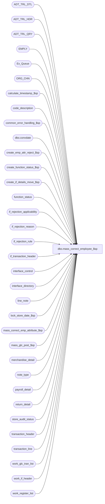

# dbo.mass_correct_employee_$sp

**Database:** auditworks_external  
**Server:** bedrockdb01  

## Architecture Diagram



## Table Dependencies

| Referenced Table |
|---|
| ADT_TRL_DTL |
| ADT_TRL_HDR |
| ADT_TRL_QRY |
| EMPLY |
| Ex_Queue |
| ORG_CHN |
| calculate_timestamp_$sp |
| code_description |
| common_error_handling_$sp |
| dbo.convdate |
| create_emp_attr_reject_$sp |
| create_function_status_$sp |
| create_if_details_move_$sp |
| function_status |
| if_rejection_applicability |
| if_rejection_reason |
| if_rejection_rule |
| if_transaction_header |
| interface_control |
| interface_directory |
| line_note |
| lock_store_date_$sp |
| mass_correct_emp_attribute_$sp |
| mass_glc_post_$sp |
| merchandise_detail |
| note_type |
| payroll_detail |
| return_detail |
| store_audit_status |
| transaction_header |
| transaction_line |
| work_glc_tran_list |
| work_if_header |
| work_register_list |

## Stored Procedure Code

```sql
create proc dbo.mass_correct_employee_$sp 
(@process_id               binary(16),
 @user_id                  int,
 @revalidate_spid          binary(16) = NULL,
 @replace_employee_flag    tinyint = 0
)
AS

/*
Proc Name : mass_correct_employee_$sp
Desc : To re-evaluate type 
		 3  --  Invalid Salesperson number
		 4  --  Invalid Employee number
		80  --  Invalid/Missing Cashier number
		81  --  Invalid Salesperson number on Return detail
		82  --  Invalid Payroll employee
		83  --  Invalid Cashier number
	  21 to 41  --  Invalid Employee Attributes
	interface rejections for all rejected transactions. 
    If all employees in a transaction are now on file and there are no other reject
    reasons, then update any applicable interfaces.
    Called by mass_auto_revalidate_$sp.
    Also called by front end to do employee reassignment by passing a 
    "replace_employee_flag" set to 1 (the front-end first updates the replacement_employee_no, 
    replacement_employee_no2 and replace_employee_flag in if_rejection_reason for the 
    desired rows).
    Note that employee reassignment is not supported for cashier due to the possible
    media reconciliation implications.

History:
Date     Name           Def# Action
Jan12,15 Vicci     TFS-99599 Handle I/F Rejection Rule 83 (invalid cashier) same as rule 80 (invalid/missing cashier) except that
                             absent cashier (i.e. cashier 0) is OK.
Nov14,14 Vicci     TFS-92326 Take into account the fact that the value of the output parameter of a proc called with a TRY/CATCH is not returned 
                             to the calling proc when a raise-error occurs, when calling lock_store_date_$sp.  Do not report individual 201571 errors
                             since individual pre-verified 201550 errors have already been reported by the lock_store_date_$sp proc.
Nov07,12 Vicci        139467 Set @post_audit_fixed recognizing that it is a flag not a count (was blowing tinyint datatype).
Jan18,12 Vicci        132439 Remove references to CRDM user-defined string datatypes from S/A since CRDM is not changing them to support unicode.
Apr19,11 Vicci        105917 Don't use return_from_date since ECP doesn't.  Remove treatment of interfaces 7,8,9,10,11,25 as GLC since they no longer are.
Jan21,11 Vicci        124247 Correct error handling following call to lock_store_date_$sp to recognize the fact that it
                             is normal to receive an @@error of 266 along with a return code of 201550 given the common
                             error handling rollback with will already have occurred and the proc is being called within
                             a begin tran.
Jan21,11 Paul         113408 move begin tran and insert to Ex_Queue down to reduce contention 
Aug13,08 Paul          87777 drop temp tables when no longer needed, code review, corrected exec
May14,08 Vicci        101197 Support effective date in commission code assigment.
Oct09,07 PaulS         91395 updated comments. 90857 is na to SA5.
Aug23,07 Phu           88860 Apply 87595, 88169 to SA5.
May01,07 Phu         DV-1364 Apply 85598, 87372 to SA5.
Apr20,07 PaulS       DV-1356 uplift 73592 to SA5
Oct20,05 Paul        DV-1325 don't log audit trail or create temp tables unless there is some work to do
Jul05,05 Paul        DV-1239 Use tran_id_datatype
Mar22,05 Paul        DV-1218 changed audit trail seperator, comments
Nov17,04 Maryam      DV-1167 Check for EMPLY active flag.
Sep17,04 Maryam      DV-1146 Receive user_id.
Aug30,04 Maryam      DV-1120 Modify the audit trail logic to always insert to HDR.
Aug02,04 Brett       DV-1071 Replace references to employee table with EMPLY table.
Jul27,04 Maryam      DV-1071 insert into new audit trail, receive @process_id
Aug31,07 Vicci         90857 AW-7551 fix:  since @all_rejects_fixed is tinyint use sign of rows fixed not rows fixed.
Aug16,07 Vicci         90857 Fix datatype of entry-date-time variable to match that of audit_trail_header table (otherwise
                             join fails and audit-trail detail doesn't get inserted).
Jul05,07 Phu           88169 Create Employee Attribute I/F rejects after correcting invalid employee.
Jun15,07 Phu           87372 Validate Employee Attribute I/F rejects 38-41.
Jun06,07 Vicci         87595 Support employee reassignment
Apr11,07 Phu           85598 Validate Employee Attribute I/F rejects 21-37.

Jun15,06 Vicci         73592 Skip store/dates locked by the Edit since lock will be held all day
Jan24,06 Vicci	       66476 Treat inactive employees as invalid.
Feb16,04 Phu           21459 Remove unnecessary transaction id ranges in the where clause
Feb02,04 Maryam        21723 Properly validate if_reject_reason of 3 and 81 when both sales_person
                             and sales_person2 are provided. Rejects not fixed when called directly from FE
Nov27,03 Phu      15801 Validate all or specific transactions
Nov26,03 David 19417/1-R0FQ1 Make sure interface_status_flag is set.
Apr24,03 Paul        1-KO2HY populate till_no
Jul26,02 Paul        1-E7L7M populate key_11 in Ex_Queue with entry_date_time
Jun11,02 ShuZ        1-9LWE6 Allow only some interface rejections for revalidateion
Nov22,01 Henry		8973 Retrofit Def 8743 for Build 2.46.25+.
Nov22,01 Henry		8743 To properly revalidate trxns where the employee number has been created,
			     for interfaces using applicability_method 2. 
Sep12,01 David C        8720 R3 C/L - Include interface_id 28 in work_glc_tran_list
Jul25,01 David C        8413 Add transaction_id to if_transaction_header
Jul18,01 Paul		8361 add distinct on audit trail insert
Apr30,01 Phu		7551 Properly validate employee if rejects.
Aug01,00 Phu		6561 Correct MS error 3902: commit tran without begin tran
                             Improve DELETE #tran_interface_list
Jun01,00 John G  	5678 Break down employee_no_check into component parts.
Mar01,00 Phu		5900 Change @@fetch_status > 0 to @@fetch_status <> 0 for MS SQL compatibility
Feb18,00 Sab		5251 Prevent error #emp_verify_reject table does not exist
Jul20,99 Matthew C	4755 Added logic for type 4 and combined all the mass_correct_employee_* 
Nov25,97 Paul S		n/a  Creation

*/

DECLARE @all_rejects_fixed	tinyint,
	@cursor_open		tinyint,
	@date_reject_id		tinyint,
	@edit_timestamp		float,
	@entry_date_time	datetime,
	@errmsg			nvarchar(255),
	@errno			int,
	@function_no		tinyint,
	@glc_rows		int,
	@if_rejection_flag	tinyint,
	@message_id		int,
	@post_audit_fixed	tinyint,
	@ret			int,
	@rows			int,
	@rows_deleted		int,
	@sep			nchar(1),
	@store_no		int,
	@transaction_date	smalldatetime,
	@operation_name		nvarchar(100),
	@object_name		nvarchar(255),
	@process_name		nvarchar(100),
	@ENTRY_ID               binary(16),
	@all_selected_descr     nvarchar(255),
	@all_selected_flag      tinyint,
	@if_rejection_reason    smallint,
	@count                  tinyint,
        @if_reject_descr        nvarchar(255),
        @ORG_CHN_NAME           nvarchar(50),
        @column_name		nvarchar(255),
        @CLMN_NAME		nvarchar(255),
	@replace_merch_rows	int,
	@replace_hdr_rows	int,
	@replace_rtn_rows	int,
	@replace_pay_rows	int,
	@replace_note_rows	int,
	@some_skipped           int

SELECT 	@function_no = 81,
	@cursor_open = 0,
	@count = 0,
	@ENTRY_ID = newid(),
	@entry_date_time = getdate(),
	@process_name = 'mass_correct_employee_$sp',
	@message_id = 201068,
	@all_selected_flag = 0, -- selected transactions
	@sep = NCHAR(12), -- audit trail seperator
	@replace_merch_rows = 0,
	@replace_hdr_rows = 0,
	@replace_rtn_rows = 0,
	@replace_pay_rows = 0,
	@replace_note_rows = 0,
	@some_skipped = 0

IF NOT EXISTS(
 SELECT 1
 FROM if_rejection_reason
 WHERE if_reject_reason IN (3, 4, 80, 81, 82, 83)
 AND (process_id = @revalidate_spid OR @revalidate_spid IS NULL)
 AND (if_reject_reason <> 80 OR @replace_employee_flag = 0))
   GOTO mass_correct_emp_attribute

/* Create temp table of rejected lines to be verified */
CREATE TABLE #emp_trans_verified (
	if_reject_reason		smallint not null,
	transaction_id			numeric(14,0) not null, -- tran_id_datatype
	line_id				numeric(5,0) null,
	employee_no			int null,
	cashier_no			int null,
	salesperson_no			int null,
	salesperson2_no			int null,
	orig_salesperson_no		int null,
	orig_salesperson2_no		int null,
	if_rejection_flag		tinyint not null,
	store_no			int null,
	transaction_date		smalldatetime null,
	register_no			smallint null,
	date_reject_id			tinyint null,
	transaction_no			int null,
	transaction_series		nchar(1) null,
	entry_date_time			datetime null,
	interface_id			tinyint null,
	interface_status_flag		smallint null,
	all_rejects_fixed		tinyint null,
	till_no                         smallint null,
	replacement_employee_no		int null,
	replacement_employee_no2	int null,
	replace_employee_flag		tinyint default 0 not null,

-- Following columns are populated by mass_correct_employee_$sp, and then used in create_emp_attr_reject_$sp for retrieval only.
-- They are no longer needed after calling create_emp_attr_reject_$sp.
	note_type			smallint null,
	PRMY_ORG_CHN_NUM		int null ) -- T_LONG_INTEGER 

SELECT @errno = @@error
IF @errno != 0
  BEGIN
   SELECT @errmsg = 'Failed to create temp table #emp_trans_verified',
	  @object_name = '#emp_trans_verified',
	  @operation_name = 'CREATE TABLE'
   GOTO error
  END

/* fill temp table with type 3 rejected lines */

IF @replace_employee_flag = 0
BEGIN
INSERT #emp_trans_verified (
	if_reject_reason,
	transaction_id,
	line_id,
	salesperson_no,
	salesperson2_no,
	if_rejection_flag,
	PRMY_ORG_CHN_NUM,
	transaction_date )
SELECT  ir.if_reject_reason,
	ir.transaction_id,
	ir.line_id,
	md.salesperson,
	md.salesperson2,
	0,
	e.PRMY_ORG_CHN_NUM,
	th.transaction_date
  FROM if_rejection_reason ir, transaction_header th,
        merchandise_detail md, EMPLY e
  WHERE if_reject_reason = 3
    AND ir.transaction_id = th.transaction_id
    AND ir.transaction_id = md.transaction_id
    AND ir.line_id = md.line_id
    AND (ir.process_id = @revalidate_spid OR @revalidate_spid IS NULL)
    AND md.salesperson IS NOT NULL
    AND md.salesperson = e.EMPLY_NUM
    AND e.ACTV = 1
    AND (md.salesperson2 IS NULL
         OR (md.salesperson2 IS NOT NULL
      AND EXISTS (SELECT 1
			 FROM EMPLY e1
            		 WHERE md.salesperson2 = e1.EMPLY_NUM
            		 AND e1.ACTV = 1)))

SELECT @errno = @@error,
	@rows = @@rowcount
IF @errno != 0
  BEGIN
   SELECT @errmsg = 'Failed to insert type 3 rejection lines into #emp_trans_verified',
	  @object_name = '#emp_trans_verified',
	  @operation_name = 'INSERT'
   GOTO error
  END

/* fill temp table with type 4, 80 and 83 rejected lines */
INSERT #emp_trans_verified (
	if_reject_reason,
	transaction_id,
	line_id,
	employee_no,
	cashier_no,
	if_rejection_flag,
	PRMY_ORG_CHN_NUM,
	transaction_date )
SELECT  ir.if_reject_reason,
	ir.transaction_id,
	ir.line_id,
	th.employee_no,
	th.cashier_no,
	0,
	e.PRMY_ORG_CHN_NUM,
	th.transaction_date
  FROM if_rejection_reason ir,
       transaction_header th, EMPLY e
 WHERE ir.transaction_id = th.transaction_id
   AND (ir.process_id = @revalidate_spid OR @revalidate_spid IS NULL) 
   AND (   (ir.if_reject_reason = 4 AND th.employee_no = e.EMPLY_NUM )
	OR (ir.if_reject_reason IN (80, 83) AND th.cashier_no = e.EMPLY_NUM ))
   AND e.ACTV = 1
   
SELECT @errno = @@error,
	@rows = @rows + @@rowcount
IF @errno != 0
  BEGIN
   SELECT @errmsg = 'Failed to insert type 4 rejection lines into #emp_trans_verified',
	  @object_name = '#emp_trans_verified',
	  @operation_name = 'INSERT'
   GOTO error
  END

/* fill temp table with type 81 rejected lines. don't check for actv original_salesperson since returned trans may be old */
INSERT #emp_trans_verified (
	if_reject_reason,
	transaction_id,
	line_id,
	orig_salesperson_no,
	orig_salesperson2_no,
	if_rejection_flag,
	PRMY_ORG_CHN_NUM,
	transaction_date )
SELECT  ir.if_reject_reason,
	ir.transaction_id,
	ir.line_id,
	original_salesperson,
	original_salesperson2,
	0,
	e.PRMY_ORG_CHN_NUM,
	th.transaction_date
 FROM if_rejection_reason ir, transaction_header th, return_detail rd, EMPLY e
WHERE if_reject_reason = 81
  AND ir.transaction_id = th.transaction_id
  AND ir.transaction_id = rd.transaction_id
  AND ir.line_id = rd.line_id
  AND (ir.process_id = @revalidate_spid OR @revalidate_spid IS NULL) 
  AND rd.original_salesperson IS NOT NULL  
  AND rd.original_salesperson = e.EMPLY_NUM
  AND (rd.original_salesperson2 IS NULL 
       OR (rd.original_salesperson2 IS NOT NULL
           AND EXISTS (SELECT 1
                         FROM EMPLY e1                
                        WHERE rd.original_salesperson2 = e1.EMPLY_NUM)
          ))

SELECT @errno = @@error,
	@rows = @rows + @@rowcount
IF @errno != 0
  BEGIN
   SELECT @errmsg = 'Failed to insert type 81 rejection lines into #emp_trans_verified',
	  @object_name = '#emp_trans_verified',
	  @operation_name = 'INSERT'
   GOTO error
  END

/* fill temp table with type 82 rejected lines */
INSERT #emp_trans_verified (
	if_reject_reason,
	transaction_id,
	line_id,
	employee_no,
	if_rejection_flag,
	PRMY_ORG_CHN_NUM,
	transaction_date )
SELECT  ir.if_reject_reason,
	ir.transaction_id,
	ir.line_id,
	pd.employee_no,
	0,
	e.PRMY_ORG_CHN_NUM,
	IsNull(pd.payroll_date, th.transaction_date)
FROM if_rejection_reason ir, transaction_header th,
      payroll_detail pd, EMPLY e
WHERE ir.if_reject_reason = 82
  AND ir.transaction_id = th.transaction_id
  AND ir.transaction_id = pd.transaction_id
  AND ir.line_id = pd.line_id
  AND (ir.process_id = @revalidate_spid OR @revalidate_spid IS NULL) 
  AND pd.employee_no = e.EMPLY_NUM
  AND e.ACTV = 1

SELECT @errno = @@error,
	@rows = @rows + @@rowcount
IF @errno != 0
  BEGIN
   SELECT @errmsg = 'Failed to insert type 82 rejection lines into #emp_trans_verified',
	  @object_name = '#emp_trans_verified',
	  @operation_name = 'INSERT'
   GOTO error
  END
END  --IF @replace_employee_flag = 0
ELSE
BEGIN
INSERT #emp_trans_verified (
	if_reject_reason,
	transaction_id,
	line_id,
	salesperson_no,
	salesperson2_no,
	if_rejection_flag,
	replacement_employee_no,
        replacement_employee_no2,
	replace_employee_flag,
	PRMY_ORG_CHN_NUM,
	transaction_date )
SELECT  ir.if_reject_reason,
	ir.transaction_id,
	ir.line_id,
	md.salesperson,
	md.salesperson2,
	0,
	ir.replacement_employee_no,
	ir.replacement_employee_no2,
	1,
	e.PRMY_ORG_CHN_NUM,
	th.transaction_date
  FROM if_rejection_reason ir, transaction_header th,
        merchandise_detail md, EMPLY e
  WHERE if_reject_reason = 3
    AND ir.replace_employee_flag = 1
    AND ir.transaction_id = th.transaction_id
    AND ir.transaction_id = md.transaction_id
    AND ir.line_id = md.line_id
    AND (ir.process_id = @revalidate_spid OR @revalidate_spid IS NULL)
    AND ir.replacement_employee_no IS NOT NULL
    AND ir.replacement_employee_no = e.EMPLY_NUM
    AND e.ACTV = 1
    AND (ir.replacement_employee_no2 IS NULL
         OR (ir.replacement_employee_no2 IS NOT NULL
             AND EXISTS (SELECT 1
                         FROM EMPLY e1
                         WHERE ir.replacement_employee_no2 = e1.EMPLY_NUM
                           AND e1.ACTV = 1)))

SELECT @errno = @@error,
	@rows = @@rowcount,
	@replace_merch_rows = @@rowcount
IF @errno != 0
  BEGIN
   SELECT @errmsg = 'Failed to insert type 3 rejection line replacements into #emp_trans_verified',
	  @object_name = '#emp_trans_verified',
	  @operation_name = 'INSERT'
   GOTO error
  END

/* fill temp table with type 4, not 80/83 cashier due to media_reconciliation implications */
INSERT #emp_trans_verified (
	if_reject_reason,
	transaction_id,
	line_id,
	employee_no,
	cashier_no,
	if_rejection_flag,
	replacement_employee_no,
	replace_employee_flag,
	PRMY_ORG_CHN_NUM,
	transaction_date )
SELECT  ir.if_reject_reason,
	ir.transaction_id,
	ir.line_id,
	th.employee_no,
	th.cashier_no,
	0,
	ir.replacement_employee_no,
	1,
	e.PRMY_ORG_CHN_NUM,
	th.transaction_date
  FROM if_rejection_reason ir,
       transaction_header th, EMPLY e
 WHERE ir.replace_employee_flag = 1
   AND ir.transaction_id = th.transaction_id
   AND (ir.process_id = @revalidate_spid OR @revalidate_spid IS NULL) 
   AND e.ACTV = 1
   AND (ir.if_reject_reason = 4 AND ir.replacement_employee_no = e.EMPLY_NUM )
   
SELECT @errno = @@error,
	@rows = @rows + @@rowcount,
	@replace_hdr_rows = @@rowcount
IF @errno != 0
  BEGIN
   SELECT @errmsg = 'Failed to insert type 4 rejection line replacements into #emp_trans_verified',
	  @object_name = '#emp_trans_verified',
	  @operation_name = 'INSERT'
   GOTO error
  END

/* fill temp table with type 81 rejected lines. don't check for actv original_salesperson since returned trans may be old */
INSERT #emp_trans_verified (
	if_reject_reason,
	transaction_id,
	line_id,
	orig_salesperson_no,
	orig_salesperson2_no,
	if_rejection_flag,
	replacement_employee_no,
        replacement_employee_no2,
	replace_employee_flag,
	PRMY_ORG_CHN_NUM,
	transaction_date )
SELECT  ir.if_reject_reason,
	ir.transaction_id,
	ir.line_id,
	original_salesperson,
	original_salesperson2,
	0,
	ir.replacement_employee_no,
	ir.replacement_employee_no2,
	1,
	e.PRMY_ORG_CHN_NUM,
	th.transaction_date
 FROM if_rejection_reason ir, transaction_header th, return_detail rd, EMPLY e
WHERE if_reject_reason = 81
  AND ir.replace_employee_flag = 1
  AND ir.transaction_id = th.transaction_id
  AND ir.transaction_id = rd.transaction_id
  AND ir.line_id = rd.line_id
  AND (ir.process_id = @revalidate_spid OR @revalidate_spid IS NULL) 
  AND ir.replacement_employee_no IS NOT NULL  
  AND ir.replacement_employee_no = e.EMPLY_NUM
  AND (ir.replacement_employee_no2 IS NULL 
       OR (ir.replacement_employee_no2 IS NOT NULL
           AND EXISTS (SELECT 1
                       FROM EMPLY e1                
                       WHERE ir.replacement_employee_no2 = e1.EMPLY_NUM)
          ))

SELECT @errno = @@error,
	@rows = @rows + @@rowcount,
	@replace_rtn_rows = @@rowcount

IF @errno != 0
  BEGIN
   SELECT @errmsg = 'Failed to insert type 81 rejection line replacements into #emp_trans_verified',
	  @object_name = '#emp_trans_verified',
	  @operation_name = 'INSERT'
   GOTO error
  END

/* fill temp table with type 82 rejected lines */
INSERT #emp_trans_verified (
	if_reject_reason,
	transaction_id,
	line_id,
	employee_no,
	if_rejection_flag,
	replacement_employee_no,
	replace_employee_flag,
	PRMY_ORG_CHN_NUM,
	transaction_date )
SELECT  ir.if_reject_reason,
	ir.transaction_id,
	ir.line_id,
	pd.employee_no,
	0,
	ir.replacement_employee_no,
	1,
	e.PRMY_ORG_CHN_NUM,
	IsNull(pd.payroll_date, th.transaction_date)
FROM if_rejection_reason ir, transaction_header th,
      payroll_detail pd, EMPLY e
WHERE ir.if_reject_reason = 82
  AND ir.replace_employee_flag = 1
  AND ir.transaction_id = th.transaction_id
  AND ir.transaction_id = pd.transaction_id
  AND ir.line_id = pd.line_id
  AND (ir.process_id = @revalidate_spid OR @revalidate_spid IS NULL) 
  AND ir.replacement_employee_no = e.EMPLY_NUM
  AND e.ACTV = 1

SELECT @errno = @@error,
	@rows = @rows + @@rowcount,
	@replace_pay_rows = @@rowcount
IF @errno != 0
  BEGIN
   SELECT @errmsg = 'Failed to insert type 82 rejection line replacements into #emp_trans_verified',
	  @object_name = '#emp_trans_verified',
	  @operation_name = 'INSERT'
   GOTO error
  END

/* fill temp table with type 21 rejected lines */
INSERT #emp_trans_verified (
	if_reject_reason,
	transaction_id,
	line_id,
	employee_no,
	if_rejection_flag,
	replacement_employee_no,
	replace_employee_flag,
	note_type,
	PRMY_ORG_CHN_NUM,
	transaction_date )
SELECT  ir.if_reject_reason,
	ir.transaction_id,
	ir.line_id,
	CASE WHEN IsNumeric(ln.line_note) = 1 THEN convert(int, ln.line_note) ELSE NULL END,
	0,
	ir.replacement_employee_no,
	1,
	ln.note_type,
	e.PRMY_ORG_CHN_NUM,
	th.transaction_date
FROM if_rejection_reason ir, transaction_header th,
     line_note ln, note_type nt, EMPLY e
WHERE ir.if_reject_reason = 21
  AND ir.replace_employee_flag = 1
  AND ir.transaction_id = th.transaction_id
  AND ir.transaction_id = ln.transaction_id
  AND ir.line_id = ln.line_id
  AND ln.note_type = nt.note_type AND nt.employee_validation = 1
  AND (ir.process_id = @revalidate_spid OR @revalidate_spid IS NULL) 
  AND ir.replacement_employee_no = e.EMPLY_NUM
  AND e.ACTV = 1

SELECT @errno = @@error,
	@rows = @rows + @@rowcount,
	@replace_note_rows = @@rowcount

IF @errno != 0
  BEGIN
   SELECT @errmsg = 'Failed to insert type 21 rejection line replacements into #emp_trans_verified',
	  @object_name = '#emp_trans_verified',
	  @operation_name = 'INSERT'
   GOTO error
  END

END  -- else of IF @replace_employee_flag = 0

IF @rows = 0
  BEGIN
    IF @replace_employee_flag = 1  
    BEGIN
      UPDATE if_rejection_reason
      SET replacement_employee_no = NULL,             
          replacement_employee_no2 = NULL,           
          replace_employee_flag = NULL
      WHERE transaction_id >= 1
      AND transaction_id <= 99999999999999
      AND line_id >= 0
      AND line_id <= 99999
      AND if_reject_reason IN (3, 4, 80, 81, 82, 83, 21)
      AND (process_id = @revalidate_spid OR @revalidate_spid IS NULL)
      AND (replacement_employee_no IS NOT NULL
        OR replacement_employee_no2 IS NOT NULL 
           OR replace_employee_flag = 1)
      SELECT @errno = @@error
      IF @errno != 0
      BEGIN
  SELECT @errmsg = 'Unable to set replacements to null in if_rejection_reason (1)',
               @object_name = 'if_rejection_reason',
               @operation_name = 'UPDATE'
        GOTO error
      END    
    END

    IF @revalidate_spid IS NOT NULL --
    BEGIN
      UPDATE if_rejection_reason
      SET process_id = NULL --
      WHERE transaction_id >= 1
      AND transaction_id <= 99999999999999
      AND line_id >= 0
      AND line_id <= 99999
      AND if_reject_reason IN (3, 4, 80, 81, 82, 83, 21 * @replace_employee_flag)
      AND process_id = @revalidate_spid

      SELECT @errno = @@error
      IF @errno != 0
      BEGIN
        SELECT @errmsg = 'Unable to set process_id to null in if_rejection_reason (1)',
               @object_name = 'if_rejection_reason',
               @operation_name = 'UPDATE'
        GOTO error
      END
    END

    DROP TABLE #emp_trans_verified
    GOTO mass_correct_emp_attribute
  END -- If @rows = 0

EXEC create_emp_attr_reject_$sp @process_id, @user_id

SELECT @errno = @@error
IF @errno != 0
  BEGIN
    SELECT @errmsg = 'Failed to execute stored procedure create_emp_attr_reject_$sp',
	   @object_name = 'create_emp_attr_reject_$sp',
	   @operation_name = 'EXEC'
    GOTO error
  END

CREATE TABLE #emp_verify_reject (
	if_reject_reason		smallint not null,
	transaction_id			numeric(14,0) not null, -- tran_id_datatype
	line_id				numeric(5,0) null,
	employee_no			int null,
	cashier_no			int null,
	salesperson_no			int null,
	salesperson2_no			int null,
	orig_salesperson_no		int null,
	orig_salesperson2_no		int null,
	if_rejection_flag		tinyint not null,
	store_no			int null,
	transaction_date		smalldatetime null,
	register_no			smallint null,
	date_reject_id			tinyint null,
	transaction_no			int null,
	transaction_series		nchar(1) null,
	entry_date_time			datetime null,
	interface_id			tinyint null,
	interface_status_flag		smallint null,
	all_rejects_fixed		tinyint null,
	replacement_employee_no		int null,
	replacement_employee_no2	int null,
	replace_employee_flag		tinyint default 0 not null )

SELECT @errno = @@error
IF @errno != 0
  BEGIN
   SELECT @errmsg = 'Failed to create temp table #emp_verify_reject',
	  @object_name = '#emp_verify_reject',
	  @operation_name = 'CREATE TABLE'
   GOTO error
  END

CREATE TABLE #emp_count_ver_reject (
	interface_id			tinyint not null,
	transaction_id			numeric(14,0) not null, -- tran_id_datatype
	count_reject_reason		int not null,
	all_rejects_fixed		tinyint not null)

SELECT @errno = @@error
IF @errno != 0
  BEGIN
   SELECT @errmsg = 'Unable to create temp table #emp_count_ver_reject',
	  @object_name = '#emp_count_ver_reject',
	  @operation_name = 'CREATE TABLE'
   GOTO error
  END

CREATE TABLE #emp_count_reject (
	interface_id			tinyint not null,
	transaction_id			numeric(14,0) not null, -- tran_id_datatype
	count_reject_reason		int not null )

SELECT @errno = @@error
IF @errno != 0
  BEGIN
   SELECT @errmsg = 'Unable to create temp table #emp_count_reject',
	  @object_name = '#emp_count_reject',
	  @operation_name = 'CREATE TABLE'
   GOTO error
  END

EXEC calculate_timestamp_$sp @edit_timestamp OUTPUT

SELECT @errno = @@error
IF @errno != 0
  BEGIN
    SELECT @errmsg = 'Failed to execute stored procedure calculate_timestamp_$sp',
	   @object_name = 'calculate_timestamp_$sp',
	   @operation_name = 'EXEC'
 GOTO error
  END

DECLARE if_reject_desc_crsr CURSOR FAST_FORWARD
    FOR
 SELECT if_rejection_reason
   FROM if_rejection_rule
  WHERE if_rejection_reason IN (3,4,80,81,82,83)
ORDER BY if_rejection_reason

OPEN if_reject_desc_crsr

SELECT @errno = @@error
IF @errno <> 0
BEGIN
   SELECT @errmsg = 'Unable to open a cursor on if_rejection_rule',
          @object_name = 'if_reject_desc_crsr',
          @operation_name = 'OPEN CURSOR'
   GOTO error
END

SELECT  @cursor_open = 2

WHILE 1 = 1
BEGIN
  FETCH if_reject_desc_crsr 
   INTO @if_rejection_reason

  IF @@fetch_status <> 0
    BREAK
  SELECT @count = @count + 1
  
  IF @count = 1
    BEGIN

    SELECT @if_reject_descr = if_rejection_description
      FROM if_rejection_rule
     WHERE if_rejection_reason = @if_rejection_reason
    
    SELECT @errno = @@error
    IF @errno <> 0
      BEGIN
        SELECT @errmsg = 'Unable to select the description of the if_reject',
               @object_name = 'if_rejection_rule',
               @operation_name = 'SELECT'
        GOTO error
      END
  
 END
  ELSE
  BEGIN    
    SELECT @if_reject_descr = @if_reject_descr + ', ' + if_rejection_description
      FROM if_rejection_rule
     WHERE if_rejection_reason = @if_rejection_reason
    
    SELECT @errno = @@error
    IF @errno <> 0
      BEGIN
        SELECT @errmsg = 'Failed to select the description of the if_reject',
               @object_name = 'if_rejection_rule',
               @operation_name = 'SELECT'
        GOTO error
      END
  END

END -- While 1=1

CLOSE if_reject_desc_crsr
DEALLOCATE if_reject_desc_crsr
SELECT @cursor_open = 0

IF @revalidate_spid IS NULL
  SELECT @all_selected_flag = 1  --all transactions

SELECT @all_selected_descr = code_display_descr
  FROM code_description
 WHERE code_type = 203
   AND code = @all_selected_flag

SELECT @errno = @@error
IF @errno != 0
  BEGIN
   SELECT @errmsg = 'Failed to select the description for code_type = 203',
	  @object_name = 'code_description',
	  @operation_name = 'SELECT'
   GOTO error
  END
  
INSERT INTO ADT_TRL_HDR(
       ENTRY_ID,
       ENTRY_DATE_TIME,
       USER_ID,
       APP_ID,
       ROOT_TBL_NAME,
       ROOT_TBL_KEY,
       ROOT_TBL_KEY_RSRC_NAME,
       ROOT_TBL_KEY_RSRC_PRMS,
       FNCTN_NUM)
VALUES (@ENTRY_ID,
        getdate(),
        @user_id,
        300,
        'TRANSACTION',
        '3, 4, 80, 81, 82, 83' +@sep+ CONVERT(nvarchar, @all_selected_flag),
        'TK_IF_REJE_REAS_ALL_SELE_FLAG',
        @if_reject_descr +@sep+@all_selected_descr,
        81)

SELECT @errno = @@error
IF @errno != 0
  BEGIN
   SELECT @errmsg = 'Failed to insert into ADT_TRL_HDR',
	  @object_name = 'ADT_TRL_HDR',
	  @operation_name = 'INSERT'
   GOTO error
  END
  
SELECT @column_name = 'SALESPERSON_NO                EMPLOYEE_NO                   CASHIER_NO                    '
SELECT @column_name = @column_name + 'ORIG_SALESPERSON_NO           EMPLOYEE_NO(Payroll)          EMPLOYEE_NO(user-defined role)',
       @CLMN_NAME = 'SALESPERSON2_NO               ORIG_SALESPERSON2_NO'

-- for those I/F rejects using applicability_method IN (0,1)

INSERT #emp_verify_reject (
	if_reject_reason,
	transaction_id,
	line_id,
	employee_no,
	cashier_no,
	salesperson_no,
	salesperson2_no,
	orig_salesperson_no,
	orig_salesperson2_no,
	if_rejection_flag,
	store_no,
	transaction_date,
	register_no,
	date_reject_id,
	transaction_no,
	transaction_series,
	entry_date_time,
	interface_id,
	interface_status_flag,
	all_rejects_fixed,
	replacement_employee_no,
	replacement_employee_no2,
	replace_employee_flag )
SELECT
	t.if_reject_reason,
	t.transaction_id,
	t.line_id,
	t.employee_no,
	t.cashier_no,
	t.salesperson_no,
	t.salesperson2_no,
	t.orig_salesperson_no,
	t.orig_salesperson2_no,
	th.if_rejection_flag,
	th.store_no,
	th.transaction_date,
	th.register_no,
	th.date_reject_id,
	th.transaction_no,
	th.transaction_series,
	th.entry_date_time,
	ic.interface_id,
	id.update_timing,  -- interface_status_flag
	0,                 -- all_rejects_fixed
	t.replacement_employee_no,
	t.replacement_employee_no2,
	t.replace_employee_flag
FROM #emp_trans_verified t, transaction_header th WITH (NOLOCK), if_rejection_applicability ir,
        interface_control ic, interface_directory id
WHERE t.transaction_id = th.transaction_id
AND t.transaction_id = ic.transaction_id
AND t.if_reject_reason = ir.if_reject_reason
AND ic.interface_id = ir.interface_id
AND ic.interface_id = id.interface_id
AND ic.interface_status_flag = 99
AND id.update_timing >= 1
AND id.applicability_method < 2

SELECT @errno = @@error
IF @errno != 0
  BEGIN
   SELECT @errmsg = 'Unable to insert #emp_verify_reject from #emp_trans_verified, applicability method 0 or 1',
	  @object_name = '#emp_verify_reject',
	  @operation_name = 'INSERT'
   GOTO error
  END

-- { Def 8743. For those I/F rejects using applicability_method = 2, will not necessarily be any 
-- entries in interface_control. Therefore, do not use interface_control in the join.

INSERT #emp_verify_reject (
	if_reject_reason,
	transaction_id,
	line_id,
	employee_no,
	cashier_no,
	salesperson_no,
	salesperson2_no,
	orig_salesperson_no,
	orig_salesperson2_no,
	if_rejection_flag,
	store_no,
	transaction_date,
	register_no,
	date_reject_id,
	transaction_no,
	transaction_series,
	entry_date_time,
	interface_id,
	interface_status_flag,
	all_rejects_fixed,
	replacement_employee_no,
	replacement_employee_no2,
	replace_employee_flag )
SELECT
	t.if_reject_reason,
	t.transaction_id,
	t.line_id,
	t.employee_no,
	t.cashier_no,
	t.salesperson_no,
	t.salesperson2_no,
	t.orig_salesperson_no,
	t.orig_salesperson2_no,
	th.if_rejection_flag,
	th.store_no,
	th.transaction_date,
	th.register_no,
	th.date_reject_id,
	th.transaction_no,
	th.transaction_series,
	th.entry_date_time,
	id.interface_id,
	id.update_timing,  -- interface_status_flag
	0,                 -- all_rejects_fixed
	t.replacement_employee_no,
	t.replacement_employee_no2,
	t.replace_employee_flag
FROM #emp_trans_verified t, transaction_header th WITH (NOLOCK), if_rejection_applicability ir,
      interface_directory id
WHERE t.transaction_id = th.transaction_id
AND t.if_reject_reason = ir.if_reject_reason
AND ir.interface_id = id.interface_id
AND id.update_timing >= 1
AND id.applicability_method = 2

SELECT @errno = @@error
IF @errno != 0
  BEGIN
   SELECT @errmsg = 'Unable to insert #emp_verify_reject from #emp_trans_verified, applicability method 2',
	  @object_name = '#emp_verify_reject',
	  @operation_name = 'INSERT'
   GOTO error
  END

-- } Def 8743.

INSERT #emp_count_ver_reject (
	interface_id,
	transaction_id,
	all_rejects_fixed,
	count_reject_reason )
SELECT  interface_id,
	transaction_id,
	all_rejects_fixed,
	COUNT(if_reject_reason)
FROM #emp_verify_reject
GROUP BY interface_id, transaction_id, all_rejects_fixed

SELECT @errno = @@error
IF @errno != 0
  BEGIN
   SELECT @errmsg = 'Unable to insert #emp_count_ver_reject from #emp_verify_reject',
	  @object_name = '#emp_count_ver_reject',
	  @operation_name = 'INSERT'
   GOTO error
  END

INSERT #emp_count_reject (
	interface_id,
	transaction_id,
	count_reject_reason )
SELECT t.interface_id,
	t.transaction_id,
	COUNT(ir.if_reject_reason)
FROM #emp_count_ver_reject t, if_rejection_reason ir WITH (NOLOCK), if_rejection_applicability ia
WHERE t.transaction_id = ir.transaction_id
AND t.interface_id = ia.interface_id
and ir.if_reject_reason = ia.if_reject_reason
GROUP BY t.interface_id, t.transaction_id

SELECT @errno = @@error
IF @errno != 0
BEGIN
   SELECT @errmsg = 'Unable to insert #emp_count_reject from #emp_count_ver_reject',
	  @object_name = '#emp_count_reject',
	  @operation_name = 'INSERT'
   GOTO error
END

UPDATE #emp_count_ver_reject
  SET all_rejects_fixed = 1
  FROM #emp_count_ver_reject t1, #emp_count_reject t2
 WHERE t1.interface_id = t2.interface_id
   AND t1.transaction_id = t2.transaction_id
   AND t1.count_reject_reason = t2.count_reject_reason

SELECT @errno = @@error
IF @errno != 0
  BEGIN
   SELECT @errmsg = 'Unable to set all_rejects_fixed = 1 in #emp_count_ver_reject',
	  @object_name = '#emp_count_ver_reject',
	  @operation_name = 'UPDATE'
   GOTO error
  END

UPDATE #emp_verify_reject
  SET all_rejects_fixed = 1
  FROM #emp_verify_reject t1, #emp_count_ver_reject t2 
 WHERE t1.interface_id = t2.interface_id
   AND t1.transaction_id = t2.transaction_id
   AND t2.all_rejects_fixed = 1

SELECT @errno = @@error
IF @errno != 0
  BEGIN
   SELECT @errmsg = 'Unable to set all_rejects_fixed = 1 in #emp_verify_reject',
	  @object_name = '#emp_verify_reject',
	  @operation_name = 'UPDATE'
   GOTO error
  END

/* re-evaluate if_rejections for one store-date at a time */

DECLARE mass_correct_crsr CURSOR FAST_FORWARD
FOR
SELECT DISTINCT
	e.store_no,
	e.transaction_date
FROM #emp_verify_reject e, store_audit_status s  --73592
WHERE e.store_no = s.store_no
  AND e.transaction_date = s.sales_date
  AND s.date_reject_id = 0
  AND s.update_in_progress NOT IN (1,4)  --don't revalidate if trickle-edit has date locked
ORDER BY e.transaction_date, e.store_no

OPEN mass_correct_crsr

SELECT @errno = @@error
IF @errno != 0
  BEGIN
   SELECT @errmsg = 'Failed to open cursor mass_correct_crsr',
	  @object_name = 'mass_correct_crsr',
	  @operation_name = 'OPEN CURSOR'
   GOTO error
  END

SELECT @cursor_open = 1

WHILE 1=1
BEGIN

FETCH mass_correct_crsr INTO
	@store_no,
	@transaction_date

IF @@fetch_status <> 0
  BREAK

DELETE work_glc_tran_list
 WHERE process_id = @process_id

SELECT @errno = @@error
IF @errno != 0
  BEGIN
   SELECT @errmsg = 'Failed to delete work_glc_tran_list',
	  @object_name = 'work_glc_tran_list',
	  @operation_name = 'DELETE'
   GOTO error
  END

DELETE work_register_list
  WHERE process_id = @process_id

SELECT @errno = @@error
IF @errno != 0
  BEGIN
   SELECT @errmsg = 'Failed to delete work_register_list',
	  @object_name = 'work_register_list',
	  @operation_name = 'DELETE'
   GOTO error
  END

DELETE work_if_header
  WHERE process_id = @process_id

SELECT @errno = @@error
IF @errno != 0
  BEGIN
   SELECT @errmsg = 'Failed to delete rows from table work_if_header',
	  @object_name = 'work_if_header',
	  @operation_name = 'DELETE'
   GOTO error
  END

TRUNCATE TABLE #emp_trans_verified
SELECT @errno = @@error
IF @errno != 0
  BEGIN
   SELECT @errmsg = 'Failed to truncate table #emp_trans_verified',
	  @object_name = '#emp_trans_verified',
	  @operation_name = 'DELETE'
   GOTO error
  END

/* Lock store-date */

BEGIN TRAN
SELECT @ret = NULL;
BEGIN TRY 
  EXEC lock_store_date_$sp @process_id, @user_id, @store_no, @transaction_date, 0, @function_no, @ret OUTPUT;
END TRY
BEGIN CATCH
SELECT @errno = ERROR_NUMBER();
IF @ret IS NULL OR @ret = 0
  SELECT @ret = @errno;
END CATCH;          
IF @errno != 0 AND @ret <> 201550 AND @errno <> 201550
BEGIN
  SELECT @errmsg = 'Failed to execute lock_store_date_$sp',
         @object_name = 'lock_store_date_$sp',
         @operation_name = 'EXEC'
  GOTO error
END

IF @ret = 0
BEGIN
   EXEC create_function_status_$sp @process_id, @user_id, @function_no, 0,
	@errmsg OUTPUT, @store_no, @transaction_date, 0
   SELECT @errno = @@error
   IF @errno != 0
     BEGIN
      IF @errmsg IS NULL /* then */
      SELECT @errmsg = 'Failed to execute stored proc create_function_status_$sp'
      SELECT @object_name = 'create_function_status_$sp',
	     @operation_name = 'EXEC'
     GOTO error
     END
   COMMIT TRANSACTION
  END
ELSE /* unable to lock, skip all transactions for store-date */
BEGIN
  SELECT @some_skipped = 1	        
  IF @@trancount > 0
    COMMIT TRANSACTION
  CONTINUE
END

INSERT #emp_trans_verified (
	if_reject_reason,
	transaction_id,
	line_id,
	employee_no,
	cashier_no,
	salesperson_no,
	salesperson2_no,
	orig_salesperson_no,
	orig_salesperson2_no,
	if_rejection_flag,
	store_no,
	transaction_date,
	register_no,
	date_reject_id,
	transaction_no,
	transaction_series,
	entry_date_time,
	interface_id,
	interface_status_flag,
	all_rejects_fixed,
	till_no,
	replacement_employee_no,
	replacement_employee_no2,
	replace_employee_flag )
SELECT
	vr.if_reject_reason,
	vr.transaction_id,
	vr.line_id,
	vr.employee_no,
	vr.cashier_no,
	vr.salesperson_no,
	vr.salesperson2_no,
	vr.orig_salesperson_no,
	vr.orig_salesperson2_no,
	th.if_rejection_flag,
	vr.store_no,
	vr.transaction_date,
	vr.register_no,
	vr.date_reject_id,
	vr.transaction_no,
	vr.transaction_series,
	vr.entry_date_time,
	vr.interface_id,
	vr.interface_status_flag,
	vr.all_rejects_fixed,
	th.till_no,
	vr.replacement_employee_no,
	vr.replacement_employee_no2,
	vr.replace_employee_flag
  FROM #emp_verify_reject vr, transaction_header th WITH (NOLOCK)
 WHERE vr.store_no = @store_no
   AND vr.transaction_date = @transaction_date
   AND vr.transaction_id = th.transaction_id
   AND th.if_rejection_flag = 1  -- ensure hasn't changed since populating work table

SELECT @errno = @@error
IF @errno != 0
  BEGIN
   SELECT @errmsg = 'Unable to insert #emp_trans_verified from #emp_verify_reject',
	  @object_name = '#emp_trans_verified',
	  @operation_name = 'INSERT'
   GOTO error
  END

/* save list of store-reg-dates affected */   -- OK  trans has at least one reject fixed
INSERT work_register_list (
	process_id,
	store_no,
	transaction_date,
	date_reject_id,
	register_no,
	function_no )
SELECT DISTINCT
	@process_id,
	store_no,
	transaction_date,
	date_reject_id,
	register_no,
	@function_no
  FROM #emp_trans_verified

SELECT @errno = @@error
IF @errno != 0
  BEGIN
   SELECT @errmsg = 'Failed to insert work_register_list',
	  @object_name = 'work_register_list',
	  @operation_name = 'INSERT'
   GOTO error
  END

/* get list of corrected tran which apply to glc */

INSERT work_glc_tran_list (
	process_id,
	transaction_id )
SELECT DISTINCT @process_id, transaction_id
  FROM #emp_trans_verified
 WHERE interface_id = 28

SELECT @glc_rows = @@rowcount,
	@errno = @@error
IF @errno != 0
  BEGIN
   SELECT @errmsg = 'Failed to insert work_glc_tran_list',
	  @object_name = 'work_glc_tran_list',
	  @operation_name = 'INSERT'
   GOTO error
  END

UPDATE function_status
  SET status = 2
 WHERE user_id = @user_id
  AND process_id = @process_id
AND function_no = @function_no

SELECT @errno = @@error
IF @errno != 0
  BEGIN
   SELECT @errmsg = 'Failed to update function_status (status=2)',
	  @object_name = 'function_status',
	  @operation_name = 'UPDATE'
   GOTO error
  END

IF @replace_merch_rows >= 1
BEGIN
  UPDATE merchandise_detail
  SET salesperson = t.replacement_employee_no,
      salesperson2 = t.replacement_employee_no2,
      salesperson_on_file_flag = 1,
      salesperson2_on_file_flag = 1
  FROM #emp_trans_verified t, merchandise_detail m
  WHERE t.transaction_id = m.transaction_id
  AND t.line_id = m.line_id
  AND t.if_reject_reason = 3

  SELECT @errno = @@error
  IF @errno != 0
  BEGIN
    SELECT @errmsg = 'Unable to set salesperson in merchandise detail',
	   @object_name = 'merchandise_detail',
	   @operation_name = 'UPDATE'
    GOTO error
  END
END  -- if @replace_merch_rows >= 1

IF @replace_hdr_rows >= 1
BEGIN
  UPDATE transaction_header
  SET employee_no = t.replacement_employee_no
  FROM #emp_trans_verified t, transaction_header h
  WHERE t.transaction_id = h.transaction_id
  AND t.if_reject_reason = 4

  SELECT @errno = @@error
  IF @errno != 0
  BEGIN
    SELECT @errmsg = 'Unable to set purchasing employee in transaction header',
	   @object_name = 'transaction_header',
	   @operation_name = 'UPDATE'
  GOTO error
  END
END  -- if @replace_hdr_rows >= 1

IF @replace_rtn_rows >= 1
BEGIN
  UPDATE return_detail
  SET original_salesperson = t.replacement_employee_no,
      original_salesperson2 = t.replacement_employee_no2
  FROM #emp_trans_verified t, return_detail r
  WHERE t.transaction_id = r.transaction_id
  AND t.line_id = r.line_id
  AND t.if_reject_reason = 81

  SELECT @errno = @@error
  IF @errno != 0
  BEGIN
    SELECT @errmsg = 'Unable to set salespeople in return detail',
	   @object_name = 'return_detail',
	   @operation_name = 'UPDATE'
    GOTO error
  END
END  -- if @replace_rtn_rows >= 1

IF @replace_pay_rows >= 1
BEGIN
  UPDATE payroll_detail
  SET employee_no = t.replacement_employee_no
  FROM #emp_trans_verified t, payroll_detail p
  WHERE t.transaction_id = p.transaction_id
  AND t.line_id = p.line_id
  AND t.if_reject_reason = 82

  SELECT @errno = @@error
  IF @errno != 0
  BEGIN
    SELECT @errmsg = 'Unable to set employee in payroll detail',
	   @object_name = 'payroll_detail',
	   @operation_name = 'UPDATE'
    GOTO error
  END
END  -- if @replace_pay_rows >= 1

IF @replace_note_rows >= 1
BEGIN
  UPDATE line_note
  SET line_note = convert(nvarchar, t.replacement_employee_no)
  FROM #emp_trans_verified t, line_note ln, note_type nt
  WHERE t.if_reject_reason = 21
  AND t.transaction_id = ln.transaction_id
  AND t.line_id = ln.line_id
  AND ln.note_type = nt.note_type
  AND nt.employee_validation = 1

  SELECT @errno = @@error
  IF @errno != 0
  BEGIN
    SELECT @errmsg = 'Unable to set employee in line note',
	   @object_name = 'line_note',
	   @operation_name = 'UPDATE'
    GOTO error
  END
END  -- if @replace_note_rows >= 1

INSERT work_if_header (
	process_id,
	transaction_id,
	effective_date,
	entry_date_time)
SELECT DISTINCT @process_id,
	transaction_id,
	transaction_date,
	entry_date_time
  FROM #emp_trans_verified
 WHERE all_rejects_fixed = 1
   AND interface_status_flag = 1

SELECT @errno = @@error,
	@all_rejects_fixed = SIGN(@@rowcount)
IF @errno != 0
  BEGIN
   SELECT @errmsg = 'Failed to insert work_if_header',
	  @object_name = 'work_if_header',
	  @operation_name = 'INSERT'
   GOTO error
  END

BEGIN TRANSACTION

IF @all_rejects_fixed >= 1  -- (1)
BEGIN
INSERT if_transaction_header (
	store_no,
	register_no,
	transaction_date,
	date_reject_id,
	transaction_series,
	transaction_no,
	entry_date_time,
	cashier_no,
	transaction_category,
	tender_total,
	transaction_void_flag,
	customer_info_exists,
	exception_flag,
	deposit_declaration_flag,
	closeout_flag,
	media_count_flag,
	customer_modified_flag,
	tax_override_flag,
	pos_tax_jurisdiction,
	edit_timestamp,
	employee_no,
	transaction_remark,
	source_process_no,
	last_modified_date_time,
	in_use_timestamp,
	updated_by_user_id,
	transaction_id,
	till_no )
SELECT
	store_no,
	register_no,
	transaction_date,
	date_reject_id,
	transaction_series,
	transaction_no,
	th.entry_date_time,
	cashier_no,
	transaction_category,
	tender_total,
	transaction_void_flag,
	customer_info_exists,
	exception_flag,
	deposit_declaration_flag,
	closeout_flag,
	media_count_flag,
	customer_modified_flag,
	tax_override_flag,
	pos_tax_jurisdiction,
	@edit_timestamp,
	employee_no,
	transaction_remark,
	@function_no,
	last_modified_date_time,
	in_use_timestamp,
	updated_by_user_id,
	th.transaction_id,
	th.till_no
  FROM work_if_header wh WITH (NOLOCK), transaction_header th WITH (NOLOCK)
  WHERE process_id = @process_id
  AND wh.transaction_id = th.transaction_id

SELECT @errno = @@error
IF @errno != 0
  BEGIN
   SELECT @errmsg = 'Failed to insert if_transaction_header',
	  @object_name = 'if_transaction_header',
	  @operation_name = 'INSERT'
   GOTO error
  END

UPDATE work_if_header
  SET if_entry_no = ih.if_entry_no
  FROM work_if_header wh, transaction_header th WITH (NOLOCK), if_transaction_header ih WITH (NOLOCK)
  WHERE wh.process_id = @process_id
  AND wh.transaction_id = th.transaction_id
  AND ih.store_no = th.store_no
  AND ih.transaction_date = th.transaction_date
  AND ih.entry_date_time = th.entry_date_time
  AND ih.register_no = th.register_no
  AND ih.transaction_no = th.transaction_no
  AND ih.transaction_series = th.transaction_series
  AND ih.edit_timestamp = @edit_timestamp

SELECT @errno = @@error
IF @errno != 0
  BEGIN
   SELECT @errmsg = 'Failed to update work_if_header',
	  @object_name = 'work_if_header',
	  @operation_name = 'UPDATE'
   GOTO error
  END
END  -- if @all_rejects_fixed >= 1  (1)

COMMIT TRANSACTION

/* Call sub-procedure to create entries in the if detail tables */
 
EXEC create_if_details_move_$sp @process_id, @user_id, 1, @errmsg OUTPUT

SELECT @errno = @@error
IF @errno != 0
  BEGIN
   SELECT @errmsg = 'Failed to execute stored procedure create_if_details_move_$sp',
	  @object_name = 'create_if_details_move_$sp',
	  @operation_name = 'EXEC'
   GOTO error
  END

IF @replace_employee_flag = 1
BEGIN
  UPDATE transaction_header
     SET last_modified_date_time = @entry_date_time
    FROM #emp_trans_verified t, transaction_header h
   WHERE t.transaction_id = h.transaction_id

  SELECT @errno = @@error
  IF @errno != 0
  BEGIN
    SELECT @errmsg = 'Unable to set last_modified_date_time in transaction_header',
  	   @object_name = 'transaction_header',
  	   @operation_name = 'UPDATE'
    GOTO error
  END
END

IF EXISTS (SELECT 1
             FROM #emp_trans_verified
	    WHERE all_rejects_fixed = 1
	      AND interface_status_flag = 2)
  SELECT @post_audit_fixed = 1
ELSE
  SELECT @post_audit_fixed = 0

-- Log to audit trail
SELECT @ORG_CHN_NAME = ORG_CHN_NAME
  FROM ORG_CHN
 WHERE ORG_CHN_NUM = @store_no
  
SELECT @errno = @@error
IF @errno != 0
  BEGIN
   SELECT @errmsg = 'Failed to select ORG_CHN name.',
	  @object_name = 'ORG_CHN',
	  @operation_name = 'SELECT'
   GOTO error
  END  

INSERT INTO ADT_TRL_DTL(
       ENTRY_ID,
       TBL_NAME,
       TBL_KEY,
       TBL_KEY_RSRC_NAME,
       TBL_KEY_RSRC_PRMS,
       ACTN_CODE,
       CLMN_NAME,
       OLD_VAL)
SELECT DISTINCT
       @ENTRY_ID,
       'IF_REJECTION_REASON',
        CONVERT(nvarchar, if_reject_reason)
        +@sep+ CONVERT(nvarchar, transaction_id)
        +@sep+ CONVERT(nvarchar, line_id)        ,
       'TK_IF_REJE_REAS_STOR_TRAN_DATE_REGI_DATE_REJE_ID_TRAN_NO_TRAN_SERI_ENTR_DATE_TIME_LINE_ID',
        if_rejection_description
        +@sep+ CONVERT(nvarchar, store_no)+ '-' + @ORG_CHN_NAME
      +@sep+ dbo.convdate(transaction_date)
        +@sep+ CONVERT(nvarchar, register_no)
        +@sep+ CONVERT(nvarchar, date_reject_id)
        +@sep+ CONVERT(nvarchar, transaction_no)
        +@sep+ CONVERT(nvarchar, transaction_series)
        +@sep+ dbo.convdate(entry_date_time)
        +@sep+ CONVERT(nvarchar, line_id),
        'D',
        SUBSTRING(@column_name,
                  1 * (1 - SIGN(ABS(v.if_reject_reason - 3)))+
                 31 * (1 - SIGN(ABS(v.if_reject_reason - 4)))+
                 61 * (1 - SIGN(ABS(v.if_reject_reason - 80)))+
                 61 * (1 - SIGN(ABS(v.if_reject_reason - 83)))+
                 91 * (1 - SIGN(ABS(v.if_reject_reason - 81)))+
                121 * (1 - SIGN(ABS(v.if_reject_reason - 82)))+
                151 * (1 - SIGN(ABS(v.if_reject_reason - 21))), 30),
        CONVERT(nvarchar, ISNULL(salesperson_no , 0) * (1 - SIGN(ABS(if_reject_reason - 3))) + 
		         ISNULL(employee_no, 0) * (1 - SIGN(ABS(if_reject_reason - 4))) + 
			 ISNULL(cashier_no, 0) * (1 - SIGN(ABS(if_reject_reason - 80))) + 
			 ISNULL(cashier_no, 0) * (1 - SIGN(ABS(if_reject_reason - 83))) + 
			 ISNULL(orig_salesperson_no, 0) * (1 - SIGN(ABS(if_reject_reason - 81))) + 
			 ISNULL(employee_no, 0) * (1 - SIGN(ABS(if_reject_reason - 82))) +
			 ISNULL(employee_no, 0) * (1 - SIGN(ABS(if_reject_reason - 21))))
    FROM #emp_trans_verified v, if_rejection_rule i
   WHERE v.if_reject_reason = i.if_rejection_reason

SELECT @errno = @@error
IF @errno != 0
  BEGIN
   SELECT @errmsg = 'Failed to insert into ADT_TRL_DTL',
	  @object_name = 'ADT_TRL_DTL',
	  @operation_name = 'INSERT'
   GOTO error
  END

INSERT INTO ADT_TRL_DTL(
       ENTRY_ID,
       TBL_NAME,
       TBL_KEY,
       TBL_KEY_RSRC_NAME,
       TBL_KEY_RSRC_PRMS,
       ACTN_CODE,
       CLMN_NAME,
       OLD_VAL)
SELECT DISTINCT
       @ENTRY_ID,
       'IF_REJECTION_REASON',
        CONVERT(nvarchar, if_reject_reason)
        +@sep+ CONVERT(nvarchar, transaction_id)
        +@sep+ CONVERT(nvarchar, line_id),
       'TK_IF_REJE_REAS_STOR_TRAN_DATE_REGI_DATE_REJE_ID_TRAN_NO_TRAN_SERI_ENTR_DATE_TIME_LINE_ID',
        if_rejection_description
        +@sep+ CONVERT(nvarchar, store_no)+ '-' + @ORG_CHN_NAME
        +@sep+ dbo.convdate(transaction_date)
        +@sep+ CONVERT(nvarchar, register_no)
        +@sep+ CONVERT(nvarchar, date_reject_id)
        +@sep+ CONVERT(nvarchar, transaction_no)
        +@sep+ CONVERT(nvarchar, transaction_series)
        +@sep+ dbo.convdate(entry_date_time)
        +@sep+ CONVERT(nvarchar, line_id),
        'D',
        substring(@CLMN_NAME,
                  1 * (1 - SIGN(ABS(v.if_reject_reason - 3)))+
                 31 * (1 - SIGN(ABS(v.if_reject_reason - 81))), 30),
  CONVERT(nvarchar, ISNULL(salesperson2_no, 0) * (1 - SIGN(ABS(if_reject_reason - 3))) + 
		         ISNULL(orig_salesperson2_no, 0) * (1 - SIGN(ABS(if_reject_reason - 81))) )
    FROM #emp_trans_verified v, if_rejection_rule i
   WHERE v.if_reject_reason = i.if_rejection_reason
     AND (salesperson2_no IS NOT NULL 
          OR orig_salesperson2_no IS NOT NULL)
SELECT @errno = @@error
IF @errno != 0
  BEGIN
   SELECT @errmsg = 'Failed to insert into ADT_TRL_DTL for salesperson2_no or oig_salesperson2_no',
	  @object_name = 'ADT_TRL_DTL',
	  @operation_name = 'INSERT'
   GOTO error
  END

INSERT INTO ADT_TRL_QRY(
       ENTRY_ID,
       QRY_KEY_NUM,
       KEY_PART_VAL_1,
       KEY_PART_VAL_2,
       KEY_PART_VAL_3,
       KEY_PART_VAL_4,
       KEY_PART_VAL_5,
       KEY_PART_VAL_6,
       KEY_PART_VAL_7,
       KEY_PART_VAL_8,
       KEY_PART_VAL_9,
       KEY_PART_VAL_10)
SELECT DISTINCT
       @ENTRY_ID,
       301,
       CONVERT(nvarchar,store_no),
       CONVERT(nvarchar,register_no),
       dbo.convdate(transaction_date),
CONVERT(nvarchar, till_no),
CONVERT(nvarchar,transaction_no),
       CONVERT(nvarchar,transaction_series),
   CONVERT(nvarchar,cashier_no),
       CONVERT(nvarchar,transaction_id),
       NULL,
       NULL
  FROM #emp_trans_verified 
       
SELECT @errno = @@error
IF @errno != 0
  BEGIN
    SELECT @errmsg = 'Failed to insert into ADT_TRL_QRY',
    	   @object_name = 'ADT_TRL_QRY',
	   @operation_name = 'INSERT'
    GOTO error
  END

BEGIN TRANSACTION
-- Delete rejections where all employees are now on file

DELETE if_rejection_reason
  FROM #emp_trans_verified tr, if_rejection_reason ir
 WHERE tr.transaction_id = ir.transaction_id
   AND tr.line_id = ir.line_id
   AND tr.if_reject_reason = ir.if_reject_reason

SELECT @errno = @@error
IF @errno != 0
  BEGIN
   SELECT @errmsg = 'Failed to delete if_rejection_reason',
	  @object_name = 'if_rejection_reason',
	  @operation_name = 'DELETE'
   GOTO error
  END


-- Exclude trans that still have other if rejects for the same line_id

DELETE #emp_trans_verified
  FROM #emp_trans_verified tr, if_rejection_reason ir
 WHERE tr.transaction_id = ir.transaction_id
 AND tr.line_id = ir.line_id

SELECT @errno = @@error
IF @errno != 0
  BEGIN
   SELECT @errmsg = 'Failed to delete #emp_trans_verified from if_rejection_reason (1)',
	  @object_name = '#emp_trans_verified',
	  @operation_name = 'DELETE'
   GOTO error
  END

-- Reset replacements to null for remaining unvalidate trans
IF @replace_employee_flag = 1  
BEGIN
  UPDATE if_rejection_reason
  SET replacement_employee_no = NULL,            
      replacement_employee_no2 = NULL,            
      replace_employee_flag = NULL               
  FROM transaction_header h, if_rejection_reason ir
  WHERE h.store_no = @store_no
  AND h.transaction_date = @transaction_date
  AND h.transaction_id = ir.transaction_id
  AND ir.if_reject_reason IN (3, 4, 80, 81, 82, 83, 21)
  AND (ir.process_id = @revalidate_spid OR @revalidate_spid IS NULL)
  AND (ir.replacement_employee_no IS NOT NULL
       OR ir.replacement_employee_no2 IS NOT NULL 
       OR ir.replace_employee_flag = 1)
  SELECT @errno = @@error
  IF @errno != 0
  BEGIN
    SELECT @errmsg = 'Unable to set replacements to null in if_rejection_reason (2)',
           @object_name = 'if_rejection_reason',
           @operation_name = 'UPDATE'
    GOTO error
  END
END

IF @revalidate_spid IS NOT NULL --
BEGIN
  UPDATE if_rejection_reason
  SET process_id = NULL --
  FROM transaction_header h WITH (NOLOCK), if_rejection_reason ir
  WHERE h.store_no = @store_no
  AND h.transaction_date = @transaction_date
  AND h.transaction_id = ir.transaction_id
  AND ir.if_reject_reason IN (3, 4, 80, 81, 82, 83, @replace_employee_flag * 21)
  AND ir.process_id = @revalidate_spid

  SELECT @errno = @@error
  IF @errno != 0
  BEGIN
    SELECT @errmsg = 'Unable to set process_id to null in if_rejection_reason (2)',
           @object_name = 'if_rejection_reason',
           @operation_name = 'UPDATE'
    GOTO error
  END
END

-- Clean up transaction lines with no more i/f rejections for the same line_id
UPDATE transaction_line
  SET interface_rejection_flag = 0
  FROM #emp_trans_verified tr, transaction_line tl
 WHERE tr.transaction_id = tl.transaction_id
   AND tr.line_id = tl.line_id

SELECT @errno = @@error
IF @errno != 0
  BEGIN
   SELECT @errmsg = 'Failed to update transaction_line',
	  @object_name = 'transaction_line',
	  @operation_name = 'UPDATE'
   GOTO error
  END

-- Exclude trans that still have other if rejects

DELETE #emp_trans_verified
  FROM #emp_trans_verified tr, if_rejection_reason ir WITH (NOLOCK)
 WHERE tr.transaction_id = ir.transaction_id

SELECT @errno = @@error
IF @errno != 0
  BEGIN
   SELECT @errmsg = 'Failed to delete #emp_trans_verified from if_rejection_reason (2)',
	  @object_name = '#emp_trans_verified',
	  @operation_name = 'DELETE'
 GOTO error
  END

--Clean up transaction headers where no more i/f rejections exist
UPDATE transaction_header
  SET if_rejection_flag = 0
  FROM #emp_trans_verified tr, transaction_header th
 WHERE tr.transaction_id = th.transaction_id

SELECT @errno = @@error
IF @errno != 0
  BEGIN
   SELECT @errmsg = 'Failed to update transaction_header',
	  @object_name = 'transaction_header',
	  @operation_name = 'UPDATE'
   GOTO error
  END

IF @all_rejects_fixed >= 1 OR @post_audit_fixed > 0 -- (2)
BEGIN
  UPDATE interface_control
     SET interface_status_flag = tr.interface_status_flag
    FROM #emp_trans_verified tr, interface_control ic
   WHERE tr.all_rejects_fixed = 1
     AND tr.transaction_id = ic.transaction_id
     AND tr.interface_id = ic.interface_id
  SELECT @errno = @@error
  IF @errno != 0
  BEGIN
    SELECT @errmsg = 'Failed to update interface_control',
	   @object_name = 'interface_control',
	   @operation_name = 'UPDATE'
    GOTO error
  END

  INSERT Ex_Queue (
		queue_id, -- interface_id
    		key_1, -- if_entry_no
		key_2, -- interface_control_flag
		key_9, -- effective_date
		key_10, -- interface_posting_date
		key_11) -- entry_date_time
  SELECT DISTINCT tr.interface_id,
	wh.if_entry_no,
	10,
	tr.transaction_date,
	getdate(),
	wh.entry_date_time
  FROM #emp_trans_verified tr, work_if_header wh WITH (NOLOCK)
 WHERE tr.all_rejects_fixed = 1
   AND tr.transaction_id = wh.transaction_id
   AND wh.process_id = @process_id
   AND tr.interface_status_flag = 1

  SELECT @errno = @@error
  IF @errno != 0
   BEGIN
     SELECT @errmsg = 'Failed to insert Ex_Queue',
	    @object_name = 'Ex_Queue',
	    @operation_name = 'INSERT'
     GOTO error
    END

END  -- if @all_rejects_fixed >= 1  (2)

UPDATE function_status
   SET status = 3
 WHERE user_id = @user_id
   AND process_id = @process_id
   AND function_no = @function_no

SELECT @errno = @@error
IF @errno != 0
  BEGIN
   SELECT @errmsg = 'Failed to update function_status (status=3)',
	  @object_name = 'function_status',
	  @operation_name = 'UPDATE'
   GOTO error
  END

COMMIT TRANSACTION /* interfaces and tran details */

EXEC mass_glc_post_$sp @function_no, @process_id, @user_id,
	@glc_rows, @errmsg OUTPUT

SELECT @errno = @@error
IF @errno != 0
  BEGIN
   IF @errmsg IS NULL /* then */
     SELECT @errmsg = 'Failed to execute stored procedure mass_glc_post_$sp'
   SELECT @object_name = 'mass_glc_post_$sp',
	  @operation_name = 'EXEC'
   GOTO error
  END

UPDATE store_audit_status
  SET update_in_progress = 0
 WHERE store_no = @store_no
   AND sales_date = @transaction_date
   AND date_reject_id = 0

SELECT @errno = @@error
IF @errno !=0
  BEGIN
   SELECT @errmsg = 'Failed to unlock (update) store_audit_status',
	  @object_name = 'store_audit_status',
	  @operation_name = 'UPDATE'
   GOTO error
  END

DELETE function_status
 WHERE user_id = @user_id
   AND function_no = @function_no
   AND process_id = @process_id

SELECT @errno = @@error
IF @errno !=0
  BEGIN
   SELECT @errmsg = 'Failed to delete function_status',
	  @object_name = 'function_status',
	  @operation_name = 'DELETE'
   GOTO error
  END

END -- while 1=1

CLOSE mass_correct_crsr
DEALLOCATE mass_correct_crsr

IF @some_skipped = 1
BEGIN
  SELECT @errno = 201571,
	 @errmsg = 'Could not process all data. Some store-dates were in use.',
	 @object_name = 'lock_store_date_$sp',
	 @operation_name = 'EXEC',
	 @message_id = 201571
  EXEC common_error_handling_$sp @function_no, @errno, @errmsg, 3, @message_id, @process_name, @object_name, @operation_name, 
                                 0, 1, 0, null, 0, null, null, null, null, null, null, 0, @process_id, @user_id
END

-- drop temp tables to release space

DROP TABLE #emp_verify_reject
DROP TABLE #emp_count_ver_reject
DROP TABLE #emp_count_reject

mass_correct_emp_attribute:

IF EXISTS (SELECT 1
           FROM if_rejection_reason
           WHERE if_reject_reason >= 21 AND if_reject_reason <= 41
           AND (process_id = @revalidate_spid OR @revalidate_spid IS NULL))
BEGIN
  -- switch to function_no = 113 before calling mass_correct_emp_attribute_$sp
  UPDATE function_status
  SET function_no = 113
  WHERE user_id = @user_id
  AND function_no IN (81, 83)
  AND process_id = @process_id

  SELECT @errno = @@error
  IF @errno !=0
  BEGIN
    SELECT @errmsg = 'Failed to set function_no = 113 in function_status.',
           @object_name = 'function_status',
           @operation_name = 'UPDATE'
   GOTO error
  END

  EXEC mass_correct_emp_attribute_$sp @process_id, @user_id, @revalidate_spid
  SELECT @errno = @@error
  IF @errno !=0
  BEGIN
    SELECT @errmsg = 'Failed to execute mass_correct_emp_attribute_$sp.',
           @object_name = 'mass_correct_emp_attribute_$sp',
           @operation_name = 'EXECUTE'
    GOTO error
  END
END -- IF EXISTS (SELECT 1


-- remove rollforward flag previously inserted by Powerbuilder
DELETE function_status
WHERE user_id = @user_id
   AND function_no IN (81, 83)
   AND process_id = @process_id

SELECT @errno = @@error
IF @errno !=0
  BEGIN
  SELECT @errmsg = 'Failed to delete function_status where function_no = 81 or 83',
	  @object_name = 'function_status',
	  @operation_name = 'DELETE'
   GOTO error
  END

RETURN

error:
	IF @cursor_open = 2
	  BEGIN
	   CLOSE if_reject_desc_crsr
	   DEALLOCATE if_reject_desc_crsr
	  END
	
	IF @cursor_open = 1
	  BEGIN
	   CLOSE mass_correct_crsr
	   DEALLOCATE mass_correct_crsr
	  END

	EXEC common_error_handling_$sp @function_no, @errno, @errmsg, 0, @message_id, 
	@process_name, @object_name, @operation_name, 0, 1, 0, null, 0, null, null, null,
	null, null, null, 0, @process_id, @user_id

	RETURN
```

