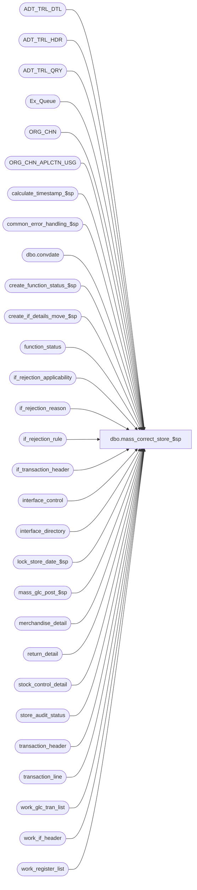

# dbo.mass_correct_store_$sp

**Database:** auditworks_external  
**Server:** bedrockdb01  

## Architecture Diagram



## Table Dependencies

| Referenced Table |
|---|
| ADT_TRL_DTL |
| ADT_TRL_HDR |
| ADT_TRL_QRY |
| Ex_Queue |
| ORG_CHN |
| ORG_CHN_APLCTN_USG |
| calculate_timestamp_$sp |
| common_error_handling_$sp |
| dbo.convdate |
| create_function_status_$sp |
| create_if_details_move_$sp |
| function_status |
| if_rejection_applicability |
| if_rejection_reason |
| if_rejection_rule |
| if_transaction_header |
| interface_control |
| interface_directory |
| lock_store_date_$sp |
| mass_glc_post_$sp |
| merchandise_detail |
| return_detail |
| stock_control_detail |
| store_audit_status |
| transaction_header |
| transaction_line |
| work_glc_tran_list |
| work_if_header |
| work_register_list |

## Stored Procedure Code

```sql
create proc dbo.mass_correct_store_$sp 
(
 @process_id               binary(16),
 @user_id                  int
)

AS

/*
Proc Name : mass_correct_store_$sp
Desc : To re-evaluate I/F rejects involving store number:
	9   - Invalid original (return-from) store num
	10  - Invalid stock control store number
	110 - Merch Originating Store not on file
	111 - Stock Originating Store not on file
	114 - Merch Source Store not on file
	115 - Merch Fulfillment Store not on file

  Based on mass_correct_employee_$sp. Called by fix_invalid_store_$sp.

History:
Date     Name            Defect# Description
Nov14,14 Vicci         TFS-92326 Take into account the fact that the value of the output parameter of a proc called with a TRY/CATCH is not returned 
                                 to the calling proc when a raise-error occurs, when calling lock_store_date_$sp.  Do not report individual 201571 errors
                                 since individual pre-verified 201550 errors have already been reported by the lock_store_date_$sp proc.
Jan18,12 Vicci            132439 Remove references to CRDM user-defined string datatypes from S/A since CRDM is not changing them to support unicode.
Jan21,11 Vicci            124247 Correct error handling following call to lock_store_date_$sp to recognize the fact that it
                                 is normal to receive an @@error of 266 along with a return code of 201550 given the common
                                 error handling rollback with will already have occurred and the proc is being called within
                                 a begin tran.
Apr29,05 David          DV-1202  Handle I/F reject 114, 115 - Invalid source/fulfillment store no.
					expand transaction_id to use tran_id_datatype (Paul)
Mar22,05 Paul		DV-1218  changed audit trail seperator
Nov29,04 David          DV-1181  New.

*/

DECLARE @all_rejects_fixed	tinyint,
	@count                  tinyint,
	@cursor_open		tinyint,
	@date_reject_id		tinyint,
	@edit_timestamp		float,
	@entry_date_time	datetime,
	@ENTRY_ID               binary(16),
	@errmsg			nvarchar(255),
	@errno			int,
	@function_no		tinyint,
	@glc_rows		int,
	@if_rejection_reason    smallint,
	@if_reject_descr	nvarchar(255),
	@message_id		int,
	@operation_name		nvarchar(100),
	@object_name		nvarchar(255),
	@ORG_CHN_NAME		nvarchar(50),
	@post_audit_fixed	tinyint,
	@process_name		nvarchar(100),
	@ret			int,
	@rows			int,
	@sep			nchar(1),
	@store_no		int,
	@transaction_date	smalldatetime,
	@some_skipped           int

SELECT 	@function_no = 95,
	@cursor_open = 0,
	@count = 0,
	@entry_date_time = getdate(),
	@process_name = 'mass_correct_store_$sp',
	@message_id = 201068,
	@sep = NCHAR(12), -- audit trail seperator
	@some_skipped = 0

IF NOT EXISTS (SELECT 1
                 FROM if_rejection_reason
                WHERE if_reject_reason IN (9, 10, 110, 111, 114, 115) )
  RETURN


-- Create list of valid and active stores to be used for validations.
SELECT u.ORG_CHN_NUM
  INTO #valid_stores
  FROM ORG_CHN_APLCTN_USG u, ORG_CHN c 
 WHERE u.ORG_CHN_NUM = c.ORG_CHN_NUM
   AND u.APLCTN_ID = 300
   AND u.VLDTY = 1
   AND c.ACTV = 1

SELECT @errno = @@error
IF @errno != 0
BEGIN
  SELECT @errmsg = 'Failed to create #valid_stores',
          @object_name = '#valid_stores',
          @operation_name = 'SELECT'
  GOTO error
END

-- Create temp table of rejected lines to be verified 
CREATE TABLE #store_trans_verified (
	if_reject_reason		smallint not null,
	transaction_id			numeric(14,0) not null, -- tran_id_datatype
	line_id				numeric(5,0) null,
	return_from_store		int null,
	stock_control_store		int null,
	merch_originating_store		int null,
	source_store_no			int null,
	fulfillment_store_no		int null,
	stock_originating_store		int null,
	if_rejection_flag		tinyint not null,
	store_no			int null,
	transaction_date		smalldatetime null,
	register_no			smallint null,
	date_reject_id			tinyint null,
	transaction_no			int null,
	transaction_series		nchar(1) null,
	entry_date_time			datetime null,
	interface_id			tinyint null,
	interface_status_flag		smallint null,
	all_rejects_fixed		tinyint null,
	till_no                         smallint null)

SELECT @errno = @@error
IF @errno != 0
  BEGIN
   SELECT @errmsg = 'Failed to create temp table #store_trans_verified',
	  @object_name = '#store_trans_verified',
	  @operation_name = 'CREATE TABLE'
   GOTO error
  END

CREATE TABLE #store_verify_reject (
	if_reject_reason		smallint not null,
	transaction_id			numeric(14,0) not null, -- tran_id_datatype
	line_id				numeric(5,0) null,
	return_from_store		int null,
	stock_control_store		int null,
	merch_originating_store		int null,
	source_store_no			int null,
	fulfillment_store_no		int null,
	stock_originating_store		int null,
	if_rejection_flag		tinyint not null,
	store_no			int null,
	transaction_date		smalldatetime null,
	register_no			smallint null,
	date_reject_id			tinyint null,
	transaction_no			int null,
	transaction_series		nchar(1) null,
	entry_date_time			datetime null,
	interface_id			tinyint null,
	interface_status_flag		smallint null,
	all_rejects_fixed		tinyint null )

SELECT @errno = @@error
IF @errno != 0
  BEGIN
   SELECT @errmsg = 'Failed to create temp table #store_verify_reject',
	  @object_name = '#store_verify_reject',
	  @operation_name = 'CREATE TABLE'
   GOTO error
  END

CREATE TABLE #store_count_ver_reject (
	interface_id			tinyint not null,
	transaction_id			numeric(14,0) not null, -- tran_id_datatype
	count_reject_reason		int not null,
	all_rejects_fixed		tinyint not null)

SELECT @errno = @@error
IF @errno != 0
  BEGIN
   SELECT @errmsg = 'Unable to create temp table #store_count_ver_reject',
	  @object_name = '#store_count_ver_reject',
	  @operation_name = 'CREATE TABLE'
   GOTO error
  END

CREATE TABLE #store_count_reject (
	interface_id			tinyint not null,
	transaction_id			numeric(14,0) not null, -- tran_id_datatype
	count_reject_reason		int not null )

SELECT @errno = @@error
IF @errno != 0
  BEGIN
   SELECT @errmsg = 'Unable to create temp table #store_count_reject',
	  @object_name = '#store_count_reject',
	  @operation_name = 'CREATE TABLE'
   GOTO error
END


-- fill temp table with type 9 rejected lines 
INSERT #store_trans_verified (
	if_reject_reason,
	transaction_id,
	line_id,
	return_from_store,
	if_rejection_flag )
SELECT  ir.if_reject_reason,
	ir.transaction_id,
	ir.line_id,
	rd.return_from_store,
	0
  FROM if_rejection_reason ir,
       return_detail rd, 
       #valid_stores vs
 WHERE ir.if_reject_reason = 9
   AND ir.transaction_id = rd.transaction_id
   AND ir.line_id = rd.line_id
   AND rd.return_from_store = vs.ORG_CHN_NUM
                        
SELECT @errno = @@error,
	@rows = @@rowcount
IF @errno != 0
  BEGIN
   SELECT @errmsg = 'Failed to insert type 9 rejection lines into #store_trans_verified',
	  @object_name = '#store_trans_verified',
	  @operation_name = 'INSERT'
   GOTO error
  END

-- fill temp table with type 10 and 111 rejected lines 
INSERT #store_trans_verified (
	if_reject_reason,
	transaction_id,
	line_id,
	stock_control_store,
	stock_originating_store,
	if_rejection_flag )
SELECT  ir.if_reject_reason,
	ir.transaction_id,
	ir.line_id,
	sc.other_store_no,
	sc.originating_store_no,
	0
  FROM if_rejection_reason ir,
       stock_control_detail sc, 
       #valid_stores vs
 WHERE ir.transaction_id = sc.transaction_id
   AND ir.line_id = sc.line_id
   AND (   (ir.if_reject_reason = 10  AND sc.other_store_no = vs.ORG_CHN_NUM )
	OR (ir.if_reject_reason = 111 AND sc.originating_store_no = vs.ORG_CHN_NUM ))

SELECT @errno = @@error,
	@rows = @rows + @@rowcount
IF @errno != 0
  BEGIN
   SELECT @errmsg = 'Failed to insert type 10 and 111 rejection lines into #store_trans_verified',
	  @object_name = '#store_trans_verified',
	  @operation_name = 'INSERT'
   GOTO error
  END

-- fill temp table with type 110 rejected lines 
INSERT #store_trans_verified (
	if_reject_reason,
	transaction_id,
	line_id,
	merch_originating_store,
	if_rejection_flag )
SELECT  ir.if_reject_reason,
	ir.transaction_id,
	ir.line_id,
	md.originating_store_no,
	0
  FROM if_rejection_reason ir,
       merchandise_detail md, 
       #valid_stores vs
 WHERE ir.if_reject_reason = 110 
   AND ir.transaction_id = md.transaction_id
   AND ir.line_id = md.line_id
   AND md.originating_store_no = vs.ORG_CHN_NUM

SELECT @errno = @@error,
	@rows = @rows + @@rowcount
IF @errno != 0
  BEGIN
   SELECT @errmsg = 'Failed to insert type 110 rejection lines into #store_trans_verified',
	  @object_name = '#store_trans_verified',
	  @operation_name = 'INSERT'
   GOTO error
  END

INSERT #store_trans_verified (
	if_reject_reason,
	transaction_id,
	line_id,
	source_store_no,
	if_rejection_flag )
SELECT  ir.if_reject_reason,
	ir.transaction_id,
	ir.line_id,
	md.source_store_no,
	0
  FROM if_rejection_reason ir,
       merchandise_detail md, 
       #valid_stores vs
 WHERE ir.if_reject_reason = 114
   AND ir.transaction_id = md.transaction_id
   AND ir.line_id = md.line_id
   AND md.source_store_no = vs.ORG_CHN_NUM

  SELECT @errno = @@error, @rows = @rows + @@rowcount
  IF @errno != 0
  BEGIN
    SELECT @errmsg = 'Failed to insert type 114 rejection lines into #store_trans_verified',
           @object_name = '#store_trans_verified',
           @operation_name = 'INSERT'
    GOTO error
  END

INSERT #store_trans_verified (
	if_reject_reason,
	transaction_id,
	line_id,
	fulfillment_store_no,
	if_rejection_flag )
SELECT  ir.if_reject_reason,
	ir.transaction_id,
	ir.line_id,
	md.fulfillment_store_no,
	0
  FROM if_rejection_reason ir,
       merchandise_detail md, 
       #valid_stores vs
 WHERE ir.if_reject_reason = 115
   AND ir.transaction_id = md.transaction_id
   AND ir.line_id = md.line_id
   AND md.fulfillment_store_no = vs.ORG_CHN_NUM

  SELECT @errno = @@error, @rows = @rows + @@rowcount
  IF @errno != 0
  BEGIN
    SELECT @errmsg = 'Failed to insert type 115 rejection lines into #store_trans_verified',
           @object_name = '#store_trans_verified',
           @operation_name = 'INSERT'
    GOTO error
  END


IF @rows = 0
  RETURN -- No I/F rejects have been fixed.
  

DECLARE if_reject_desc_crsr CURSOR
    FOR
 SELECT if_rejection_reason
   FROM if_rejection_rule
  WHERE if_rejection_reason IN (9, 10, 110, 111, 114, 115)
  ORDER BY if_rejection_reason

SELECT @errno = @@error
IF @errno <> 0
BEGIN
   SELECT @errmsg = 'Unable to declare a cursor on if_rejection_reason',
          @object_name = 'if_reject_desc_crsr',
          @operation_name = 'DECLARE CURSOR'
   GOTO error
END

OPEN if_reject_desc_crsr
SELECT @cursor_open = 2

WHILE 1=1
BEGIN

  FETCH if_reject_desc_crsr 
   INTO @if_rejection_reason

  IF @@fetch_status <> 0
    BREAK

  SELECT @count = @count + 1
  
  IF @count = 1
  BEGIN
    SELECT @if_reject_descr = if_rejection_description
      FROM if_rejection_rule
     WHERE if_rejection_reason = @if_rejection_reason
    
    SELECT @errno = @@error
    IF @errno <> 0
      BEGIN
        SELECT @errmsg = 'Unable to select the description of the if_reject',
               @object_name = 'if_rejection_rule',
               @operation_name = 'SELECT'
        GOTO error
      END
  END
  ELSE
  BEGIN    
    SELECT @if_reject_descr = @if_reject_descr + ', ' + if_rejection_description
      FROM if_rejection_rule
     WHERE if_rejection_reason = @if_rejection_reason
    
    SELECT @errno = @@error
    IF @errno <> 0
      BEGIN
        SELECT @errmsg = 'Failed to select the description of the if_reject',
               @object_name = 'if_rejection_rule',
               @operation_name = 'SELECT'
        GOTO error
      END
 END

END -- WHILE 1=1

CLOSE if_reject_desc_crsr
DEALLOCATE if_reject_desc_crsr
SELECT @cursor_open = 0

SELECT @ENTRY_ID = newid()
 
INSERT INTO ADT_TRL_HDR(
       ENTRY_ID,
       ENTRY_DATE_TIME,
       USER_ID,
       APP_ID,
       ROOT_TBL_NAME,
       ROOT_TBL_KEY,
       ROOT_TBL_KEY_RSRC_NAME,
       ROOT_TBL_KEY_RSRC_PRMS,
       FNCTN_NUM)
VALUES (@ENTRY_ID,
        getdate(),
        @user_id,
        300,
        'TRANSACTION',
        '9, 10, 110, 111, 114, 115',
        'TK_IF_REJE_REAS',
        @if_reject_descr,
        95)
          
SELECT @errno = @@error
IF @errno != 0
  BEGIN
   SELECT @errmsg = 'Failed to insert into ADT_TRL_HDR',
	  @object_name = 'ADT_TRL_HDR',
	  @operation_name = 'INSERT'
   GOTO error
  END 


EXEC calculate_timestamp_$sp @edit_timestamp OUTPUT

SELECT @errno = @@error
IF @errno != 0
  BEGIN
    SELECT @errmsg = 'Failed to execute stored procedure calculate_timestamp_$sp',
	   @object_name = 'calculate_timestamp_$sp',
	   @operation_name = 'EXEC'
    GOTO error
  END

-- for those I/F rejects using applicability_method IN (0,1)
INSERT #store_verify_reject (
	if_reject_reason,
	transaction_id,
	line_id,
	return_from_store,
	stock_control_store,
	merch_originating_store,
	source_store_no,
	fulfillment_store_no,
	stock_originating_store,
	if_rejection_flag,
	store_no,
	transaction_date,
	register_no,
	date_reject_id,
	transaction_no,
	transaction_series,
	entry_date_time,
	interface_id,
	interface_status_flag,
	all_rejects_fixed )
SELECT
	t.if_reject_reason,
	t.transaction_id,
	t.line_id,
	t.return_from_store,
	t.stock_control_store,
	t.merch_originating_store,
	t.source_store_no,
	t.fulfillment_store_no,
	t.stock_originating_store,
	th.if_rejection_flag,
	th.store_no,
	th.transaction_date,
	th.register_no,
	th.date_reject_id,
	th.transaction_no,
	th.transaction_series,
	th.entry_date_time,
	ic.interface_id,
	id.update_timing,  -- interface_status_flag
	0                  -- all_rejects_fixed
  FROM #store_trans_verified t, 
       transaction_header th, 
       if_rejection_applicability ir,
       interface_control ic, 
       interface_directory id
 WHERE t.transaction_id = th.transaction_id
   AND t.transaction_id = ic.transaction_id
   AND t.if_reject_reason = ir.if_reject_reason
   AND ic.interface_id = ir.interface_id
   AND ic.interface_id = id.interface_id
   AND ic.interface_status_flag = 99
   AND id.update_timing >= 1
   AND id.applicability_method < 2

SELECT @errno = @@error
IF @errno != 0
  BEGIN
   SELECT @errmsg = 'Unable to insert #store_verify_reject from #store_trans_verified, applicability method 0 or 1',
	  @object_name = '#store_verify_reject',
	  @operation_name = 'INSERT'
   GOTO error
  END

-- { Def 8743. For those I/F rejects using applicability_method = 2, will not necessarily be any 
-- entries in interface_control. Therefore, do not use interface_control in the join.

INSERT #store_verify_reject (
	if_reject_reason,
	transaction_id,
	line_id,
	return_from_store,
	stock_control_store,
	merch_originating_store,
	source_store_no,
	fulfillment_store_no,
	stock_originating_store,
	if_rejection_flag,
	store_no,
	transaction_date,
	register_no,
	date_reject_id,
	transaction_no,
	transaction_series,
	entry_date_time,
	interface_id,
	interface_status_flag,
	all_rejects_fixed )
SELECT
	t.if_reject_reason,
	t.transaction_id,
	t.line_id,
	t.return_from_store,
	t.stock_control_store,
	t.merch_originating_store,
	t.source_store_no,
	t.fulfillment_store_no,
	t.stock_originating_store,
	th.if_rejection_flag,
	th.store_no,
	th.transaction_date,
	th.register_no,
	th.date_reject_id,
	th.transaction_no,
	th.transaction_series,
	th.entry_date_time,
	id.interface_id,
	id.update_timing,  -- interface_status_flag
	0                  -- all_rejects_fixed
  FROM #store_trans_verified t, 
       transaction_header th, 
       if_rejection_applicability ir,
       interface_directory id
 WHERE t.transaction_id = th.transaction_id
   AND t.if_reject_reason = ir.if_reject_reason
   AND ir.interface_id = id.interface_id
   AND id.update_timing >= 1
   AND id.applicability_method = 2

SELECT @errno = @@error
IF @errno != 0
  BEGIN
   SELECT @errmsg = 'Unable to insert #store_verify_reject from #store_trans_verified, applicability method 2',
	  @object_name = '#store_verify_reject',
	  @operation_name = 'INSERT'
   GOTO error
  END

-- } Def 8743.

INSERT #store_count_ver_reject (
	interface_id,
	transaction_id,
	all_rejects_fixed,
	count_reject_reason )
 SELECT interface_id,
	transaction_id,
	all_rejects_fixed,
	COUNT(if_reject_reason)
  FROM #store_verify_reject
 GROUP BY interface_id, transaction_id, all_rejects_fixed

SELECT @errno = @@error
IF @errno != 0
  BEGIN
   SELECT @errmsg = 'Unable to insert #store_count_ver_reject from #store_verify_reject',
	  @object_name = '#store_count_ver_reject',
	  @operation_name = 'INSERT'
   GOTO error
  END

INSERT #store_count_reject (
	interface_id,
	transaction_id,
	count_reject_reason )
 SELECT t.interface_id,
	t.transaction_id,
	COUNT(ir.if_reject_reason)
  FROM #store_count_ver_reject t, 
       if_rejection_reason ir, 
       if_rejection_applicability ia
 WHERE t.transaction_id = ir.transaction_id
   AND t.interface_id = ia.interface_id
   AND ir.if_reject_reason = ia.if_reject_reason
 GROUP BY t.interface_id, t.transaction_id

SELECT @errno = @@error
IF @errno != 0
BEGIN
   SELECT @errmsg = 'Unable to insert #store_count_reject from #store_count_ver_reject',
	  @object_name = '#store_count_reject',
	  @operation_name = 'INSERT'
   GOTO error
END

UPDATE #store_count_ver_reject
   SET all_rejects_fixed = 1
  FROM #store_count_ver_reject t1, #store_count_reject t2
 WHERE t1.interface_id = t2.interface_id
   AND t1.transaction_id = t2.transaction_id
   AND t1.count_reject_reason = t2.count_reject_reason

SELECT @errno = @@error
IF @errno != 0
  BEGIN
   SELECT @errmsg = 'Unable to set all_rejects_fixed = 1 in #store_count_ver_reject',
	  @object_name = '#store_count_ver_reject',
	  @operation_name = 'UPDATE'
   GOTO error
  END

UPDATE #store_verify_reject
   SET all_rejects_fixed = 1
  FROM #store_verify_reject t1, #store_count_ver_reject t2 
 WHERE t1.interface_id = t2.interface_id
   AND t1.transaction_id = t2.transaction_id
   AND t2.all_rejects_fixed = 1

SELECT @errno = @@error
IF @errno != 0
  BEGIN
   SELECT @errmsg = 'Unable to set all_rejects_fixed = 1 in #store_verify_reject',
	  @object_name = '#store_verify_reject',
	  @operation_name = 'UPDATE'
   GOTO error
  END


-- re-evaluate if_rejections for one store-date at a time 

DECLARE mass_correct_crsr cursor
FOR
SELECT DISTINCT
	store_no,
	transaction_date
  FROM #store_verify_reject
 ORDER BY transaction_date, store_no
FOR READ ONLY

OPEN mass_correct_crsr

SELECT @errno = @@error
IF @errno != 0
  BEGIN
   SELECT @errmsg = 'Failed to open cursor mass_correct_crsr',
	  @object_name = 'mass_correct_crsr',
	  @operation_name = 'OPEN CURSOR'
   GOTO error
  END

SELECT @cursor_open = 1

WHILE 2=2
BEGIN

  FETCH mass_correct_crsr 
   INTO	@store_no,
	@transaction_date

  IF @@fetch_status <> 0
    BREAK

  DELETE work_glc_tran_list
   WHERE process_id = @process_id

  SELECT @errno = @@error
  IF @errno != 0
  BEGIN
    SELECT @errmsg = 'Failed to delete work_glc_tran_list',
	   @object_name = 'work_glc_tran_list',
	   @operation_name = 'DELETE'
    GOTO error
  END

  DELETE work_register_list
   WHERE process_id = @process_id

  SELECT @errno = @@error
  IF @errno != 0
  BEGIN
    SELECT @errmsg = 'Failed to delete work_register_list',
	   @object_name = 'work_register_list',
	   @operation_name = 'DELETE'
    GOTO error
  END

  DELETE work_if_header
   WHERE process_id = @process_id

  SELECT @errno = @@error
  IF @errno != 0
  BEGIN
    SELECT @errmsg = 'Failed to delete rows from table work_if_header',
	   @object_name = 'work_if_header',
	   @operation_name = 'DELETE'
    GOTO error
  END

  TRUNCATE TABLE #store_trans_verified

  SELECT @errno = @@error
  IF @errno != 0
  BEGIN
    SELECT @errmsg = 'Failed to truncate table #store_trans_verified',
	   @object_name = '#store_trans_verified',
	   @operation_name = 'DELETE'
    GOTO error
  END

  -- Lock store-date 
  BEGIN TRAN
  
  SELECT @ret = NULL;
  BEGIN TRY 
    EXEC lock_store_date_$sp @process_id, @user_id, @store_no, @transaction_date, 0, @function_no, @ret OUTPUT;
  END TRY
  BEGIN CATCH
  SELECT @errno = ERROR_NUMBER();
  IF @ret IS NULL OR @ret = 0
    SELECT @ret = @errno;
  END CATCH;          
  IF @errno != 0 AND @ret <> 201550 AND @errno <> 201550
  BEGIN
    SELECT @errmsg = 'Failed to execute lock_store_date_$sp',
           @object_name = 'lock_store_date_$sp',
           @operation_name = 'EXEC'
    GOTO error
  END

  IF @ret = 0
  BEGIN
    EXEC create_function_status_$sp @process_id, @user_id, @function_no, 0,
         @errmsg OUTPUT, @store_no, @transaction_date, 0
    SELECT @errno = @@error
    IF @errno != 0
    BEGIN
      IF @errmsg IS NULL 
        SELECT @errmsg = 'Failed to execute stored proc create_function_status_$sp'
      SELECT @object_name = 'create_function_status_$sp',
	     @operation_name = 'EXEC'
      GOTO error
    END
    COMMIT TRANSACTION
  END
  ELSE -- unable to lock, skip all transactions for store-date 
  BEGIN
    SELECT @some_skipped = 1

    IF @@trancount > 0
      COMMIT TRANSACTION
      
    CONTINUE
  END

  INSERT #store_trans_verified (
	if_reject_reason,
	transaction_id,
	line_id,
	return_from_store,
	stock_control_store,
	merch_originating_store,
	source_store_no,
	fulfillment_store_no,
	stock_originating_store,
	if_rejection_flag,
	store_no,
	transaction_date,
	register_no,
	date_reject_id,
	transaction_no,
	transaction_series,
	entry_date_time,
	interface_id,
	interface_status_flag,
	all_rejects_fixed,
	till_no)
  SELECT
	vr.if_reject_reason,
	vr.transaction_id,
	vr.line_id,
	vr.return_from_store,
	vr.stock_control_store,
	vr.merch_originating_store,
	vr.source_store_no,
	vr.fulfillment_store_no,
	vr.stock_originating_store,
	th.if_rejection_flag,
	vr.store_no,
	vr.transaction_date,
	vr.register_no,
	vr.date_reject_id,
	vr.transaction_no,
	vr.transaction_series,
	vr.entry_date_time,
	vr.interface_id,
	vr.interface_status_flag,
	vr.all_rejects_fixed,
	th.till_no
    FROM #store_verify_reject vr, transaction_header th
   WHERE vr.store_no = @store_no
     AND vr.transaction_date = @transaction_date
     AND vr.transaction_id = th.transaction_id
     AND th.if_rejection_flag = 1  -- ensure hasn't changed since populating work table

  SELECT @errno = @@error
  IF @errno != 0
  BEGIN
    SELECT @errmsg = 'Unable to insert #store_trans_verified from #store_verify_reject',
	   @object_name = '#store_trans_verified',
	   @operation_name = 'INSERT'
    GOTO error
  END

  -- save list of store-reg-dates affected    -- OK  trans has at least one reject fixed
  INSERT work_register_list (
	process_id,
	store_no,
	transaction_date,
	date_reject_id,
	register_no,
	function_no )
  SELECT DISTINCT
	@process_id,
	store_no,
	transaction_date,
	date_reject_id,
	register_no,
	@function_no
    FROM #store_trans_verified

  SELECT @errno = @@error
  IF @errno != 0
  BEGIN
    SELECT @errmsg = 'Failed to insert work_register_list',
	   @object_name = 'work_register_list',
	   @operation_name = 'INSERT'
    GOTO error
  END

  -- get list of corrected tran which apply to glc 
  INSERT work_glc_tran_list (
	process_id,
	transaction_id )
  SELECT DISTINCT @process_id, transaction_id
    FROM #store_trans_verified
   WHERE interface_id = 28

  SELECT @glc_rows = @@rowcount,
 	 @errno = @@error
  IF @errno != 0
  BEGIN
    SELECT @errmsg = 'Failed to insert work_glc_tran_list',
	   @object_name = 'work_glc_tran_list',
	   @operation_name = 'INSERT'
    GOTO error
  END

  UPDATE function_status
 SET status = 2
   WHERE process_id = @process_id
     AND function_no = @function_no

  SELECT @errno = @@error
  IF @errno != 0
  BEGIN
    SELECT @errmsg = 'Failed to set status=2.',
	   @object_name = 'function_status',
	   @operation_name = 'UPDATE'
    GOTO error
  END

  INSERT work_if_header (
	process_id,
	transaction_id,
	effective_date,
	entry_date_time)
  SELECT DISTINCT @process_id,
	transaction_id,
	transaction_date,
	entry_date_time
 FROM #store_trans_verified
   WHERE all_rejects_fixed = 1
     AND interface_status_flag = 1

  SELECT @errno = @@error,
	 @all_rejects_fixed = @@rowcount
  IF @errno != 0
  BEGIN
    SELECT @errmsg = 'Failed to insert work_if_header',
	   @object_name = 'work_if_header',
	   @operation_name = 'INSERT'
    GOTO error
  END


  BEGIN TRANSACTION

  IF @all_rejects_fixed >= 1  -- (1)
  BEGIN
    INSERT if_transaction_header (
	store_no,
	register_no,
	transaction_date,
	date_reject_id,
	transaction_series,
	transaction_no,
	entry_date_time,
	cashier_no,
	transaction_category,
	tender_total,
	transaction_void_flag,
	customer_info_exists,
	exception_flag,
	deposit_declaration_flag,
	closeout_flag,
	media_count_flag,
	customer_modified_flag,
	tax_override_flag,
	pos_tax_jurisdiction,
	edit_timestamp,
	employee_no,
	transaction_remark,
	source_process_no,
	last_modified_date_time,
	in_use_timestamp,
	updated_by_user_id,
	transaction_id,
	till_no )
    SELECT
	store_no,
	register_no,
	transaction_date,
	date_reject_id,
	transaction_series,
	transaction_no,
	th.entry_date_time,
	cashier_no,
	transaction_category,
	tender_total,
	transaction_void_flag,
	customer_info_exists,
	exception_flag,
	deposit_declaration_flag,
	closeout_flag,
	media_count_flag,
	customer_modified_flag,
	tax_override_flag,
	pos_tax_jurisdiction,
	@edit_timestamp,
	employee_no,
	transaction_remark,
	@function_no,
	last_modified_date_time,
	in_use_timestamp,
	updated_by_user_id,
	th.transaction_id,
	th.till_no
    FROM work_if_header wh, transaction_header th
   WHERE process_id = @process_id
     AND wh.transaction_id = th.transaction_id

    SELECT @errno = @@error
    IF @errno != 0
    BEGIN
      SELECT @errmsg = 'Failed to insert if_transaction_header',
	     @object_name = 'if_transaction_header',
	     @operation_name = 'INSERT'
      GOTO error
    END

    UPDATE work_if_header
       SET if_entry_no = ih.if_entry_no
      FROM work_if_header wh, transaction_header th, if_transaction_header ih
     WHERE wh.process_id = @process_id
       AND wh.transaction_id = th.transaction_id
       AND ih.store_no = th.store_no
       AND ih.transaction_date = th.transaction_date
       AND ih.entry_date_time = th.entry_date_time
       AND ih.register_no = th.register_no
    AND ih.transaction_no = th.transaction_no
       AND ih.transaction_series = th.transaction_series
       AND ih.edit_timestamp = @edit_timestamp

    SELECT @errno = @@error
    IF @errno != 0
    BEGIN
      SELECT @errmsg = 'Failed to update work_if_header',
	     @object_name = 'work_if_header',
	     @operation_name = 'UPDATE'
      GOTO error
    END
  END  -- if @all_rejects_fixed >= 1  (1)

  COMMIT TRANSACTION

  -- Call sub-procedure to create entries in the if detail tables 
  EXEC create_if_details_move_$sp @process_id, @user_id, 1, @errmsg OUTPUT

  SELECT @errno = @@error
  IF @errno != 0
  BEGIN
    SELECT @errmsg = 'Failed to execute stored procedure create_if_details_move_$sp',
	   @object_name = 'create_if_details_move_$sp',
	   @operation_name = 'EXEC'
    GOTO error
  END

  BEGIN TRANSACTION

  SELECT @post_audit_fixed = 0

 SELECT @post_audit_fixed = COUNT(transaction_id)
    FROM #store_trans_verified
   WHERE all_rejects_fixed = 1
     AND interface_status_flag = 2

  SELECT @errno = @@error
  IF @errno != 0
  BEGIN
    SELECT @errmsg = 'Failed to get count for @post_audit_fixed',
           @object_name = '#store_trans_verified',
           @operation_name = 'SELECT'
    GOTO error
  END

  IF @all_rejects_fixed >= 1 OR @post_audit_fixed > 0 -- (2)
  BEGIN
    UPDATE interface_control
       SET interface_status_flag = tr.interface_status_flag
      FROM #store_trans_verified tr, interface_control ic
     WHERE tr.all_rejects_fixed = 1
       AND tr.transaction_id = ic.transaction_id
       AND tr.interface_id = ic.interface_id

    SELECT @errno = @@error
    IF @errno != 0
    BEGIN
      SELECT @errmsg = 'Failed to update interface_control',
	     @object_name = 'interface_control',
	     @operation_name = 'UPDATE'
      GOTO error
    END

    INSERT Ex_Queue (
		queue_id, -- interface_id
    		key_1, -- if_entry_no
		key_2, -- interface_control_flag
		key_9, -- effective_date
		key_10, -- interface_posting_date
		key_11) -- entry_date_time
    SELECT DISTINCT tr.interface_id,
	wh.if_entry_no,
	10,
	tr.transaction_date,
	getdate(),
	wh.entry_date_time
      FROM #store_trans_verified tr, work_if_header wh
     WHERE tr.all_rejects_fixed = 1
       AND tr.transaction_id = wh.transaction_id
       AND wh.process_id = @process_id
       AND tr.interface_status_flag = 1

    SELECT @errno = @@error
    IF @errno != 0
    BEGIN
      SELECT @errmsg = 'Failed to insert Ex_Queue',
	     @object_name = 'Ex_Queue',
	     @operation_name = 'INSERT'
      GOTO error
    END
  END  -- if @all_rejects_fixed >= 1  (2)

  -- Log to audit trail
  SELECT @ORG_CHN_NAME = ORG_CHN_NAME
    FROM ORG_CHN
   WHERE ORG_CHN_NUM = @store_no
  
  SELECT @errno = @@error
  IF @errno != 0
  BEGIN
    SELECT @errmsg = 'Failed to select ORG_CHN name.',
	   @object_name = 'ORG_CHN',
	   @operation_name = 'SELECT'
    GOTO error
  END  

  INSERT INTO ADT_TRL_DTL(
       ENTRY_ID,
       TBL_NAME,
       TBL_KEY,
       TBL_KEY_RSRC_NAME,
       TBL_KEY_RSRC_PRMS,
       ACTN_CODE,
       CLMN_NAME,
       OLD_VAL)
  SELECT DISTINCT
        @ENTRY_ID,
       'IF_REJECTION_REASON',
        CONVERT(nvarchar, if_reject_reason)
        +@sep+ CONVERT(nvarchar, transaction_id)
        +@sep+ CONVERT(nvarchar, line_id)        ,
       'TK_IF_REJE_REAS_STOR_TRAN_DATE_REGI_DATE_REJE_ID_TRAN_NO_TRAN_SERI_ENTR_DATE_TIME_LINE_ID',
        if_rejection_description
        +@sep+ CONVERT(nvarchar, store_no)+ '-' + @ORG_CHN_NAME
        +@sep+ dbo.convdate(transaction_date)
        +@sep+ CONVERT(nvarchar, register_no)
        +@sep+ CONVERT(nvarchar, date_reject_id)
        +@sep+ CONVERT(nvarchar, transaction_no)
        +@sep+ CONVERT(nvarchar, transaction_series)
        +@sep+ dbo.convdate(entry_date_time)
        +@sep+ CONVERT(nvarchar, line_id),
        'D',
        CASE v.if_reject_reason
          WHEN 9 THEN 'RETURN_FROM_STORE'
          WHEN 10  THEN 'STOCK_CONTROL_STORE'
          WHEN 110 THEN 'MERCH ORIGINATING STORE'
          WHEN 111 THEN 'STOCK ORIGINATING STORE'
          WHEN 114 THEN 'MERCH SOURCE STORE'
          ELSE 'MERCH FULFILLMENT STORE' -- 115
        END, 
        CASE v.if_reject_reason
          WHEN 9   THEN CONVERT(nvarchar, return_from_store)
          WHEN 10  THEN CONVERT(nvarchar, stock_control_store)
          WHEN 110 THEN CONVERT(nvarchar, merch_originating_store)
          WHEN 111 THEN CONVERT(nvarchar, stock_originating_store)
          WHEN 114 THEN CONVERT(nvarchar, source_store_no)
          ELSE CONVERT(nvarchar, fulfillment_store_no) -- 115
        END 
    FROM #store_trans_verified v, if_rejection_rule i
   WHERE v.if_reject_reason = i.if_rejection_reason

  SELECT @errno = @@error
  IF @errno != 0
  BEGIN
    SELECT @errmsg = 'Failed to insert into ADT_TRL_DTL',
	   @object_name = 'ADT_TRL_DTL',
	   @operation_name = 'INSERT'
 GOTO error
  END

  INSERT INTO ADT_TRL_QRY(
       ENTRY_ID,
       QRY_KEY_NUM,
       KEY_PART_VAL_1,
       KEY_PART_VAL_2,
       KEY_PART_VAL_3,
       KEY_PART_VAL_4,
       KEY_PART_VAL_5,
       KEY_PART_VAL_6,
       KEY_PART_VAL_7,
       KEY_PART_VAL_8,
       KEY_PART_VAL_9,
       KEY_PART_VAL_10)
  SELECT DISTINCT
       @ENTRY_ID,
       301,
       CONVERT(nvarchar,store_no),
       CONVERT(nvarchar,register_no),
       dbo.convdate(transaction_date),
       CONVERT(nvarchar, till_no),
       CONVERT(nvarchar,transaction_no),
       CONVERT(nvarchar,transaction_series),
       NULL,
       CONVERT(nvarchar,transaction_id),
       NULL,
       NULL
    FROM #store_trans_verified 
       
  SELECT @errno = @@error
  IF @errno != 0
  BEGIN
    SELECT @errmsg = 'Failed to insert into ADT_TRL_QRY',
    	   @object_name = 'ADT_TRL_QRY',
	   @operation_name = 'INSERT'
    GOTO error
  END


  -- Delete rejections where all stores are now on file
  DELETE if_rejection_reason
    FROM #store_trans_verified tr, if_rejection_reason ir
   WHERE tr.transaction_id = ir.transaction_id
     AND tr.line_id = ir.line_id
     AND tr.if_reject_reason = ir.if_reject_reason

  SELECT @errno = @@error
  IF @errno != 0
  BEGIN
    SELECT @errmsg = 'Failed to delete if_rejection_reason',
	   @object_name = 'if_rejection_reason',
	   @operation_name = 'DELETE'
    GOTO error
  END

  -- Exclude trans that still have other if rejects for the same line_id
  DELETE #store_trans_verified
    FROM #store_trans_verified tr, if_rejection_reason ir
   WHERE tr.transaction_id = ir.transaction_id
     AND tr.line_id = ir.line_id

  SELECT @errno = @@error
  IF @errno != 0
  BEGIN
    SELECT @errmsg = 'Failed to delete #store_trans_verified from if_rejection_reason (1)',
	   @object_name = '#store_trans_verified',
	   @operation_name = 'DELETE'
    GOTO error
  END

  -- Clean up transaction lines with no more i/f rejections for the same line_id
  UPDATE transaction_line
     SET interface_rejection_flag = 0
    FROM #store_trans_verified tr, transaction_line tl
   WHERE tr.transaction_id = tl.transaction_id
     AND tr.line_id = tl.line_id

  SELECT @errno = @@error
  IF @errno != 0
  BEGIN
    SELECT @errmsg = 'Failed to update transaction_line',
	   @object_name = 'transaction_line',
	   @operation_name = 'UPDATE'
    GOTO error
  END

  -- Exclude trans that still have other if rejects
  DELETE #store_trans_verified
    FROM #store_trans_verified tr, if_rejection_reason ir
   WHERE tr.transaction_id = ir.transaction_id

  SELECT @errno = @@error
  IF @errno != 0
  BEGIN
    SELECT @errmsg = 'Failed to delete #store_trans_verified from if_rejection_reason (2)',
	   @object_name = '#store_trans_verified',
	   @operation_name = 'DELETE'
    GOTO error
  END

  --Clean up transaction headers where no more i/f rejections exist
  UPDATE transaction_header
     SET if_rejection_flag = 0
    FROM #store_trans_verified tr, transaction_header th
   WHERE tr.transaction_id = th.transaction_id

  SELECT @errno = @@error
  IF @errno != 0
  BEGIN
    SELECT @errmsg = 'Failed to update transaction_header',
	   @object_name = 'transaction_header',
	   @operation_name = 'UPDATE'
    GOTO error
  END

  UPDATE function_status
     SET status = 3
   WHERE process_id = @process_id
     AND function_no = @function_no

  SELECT @errno = @@error
  IF @errno != 0
  BEGIN
    SELECT @errmsg = 'Failed to set status=3.',
	   @object_name = 'function_status',
	   @operation_name = 'UPDATE'
    GOTO error
  END

  COMMIT TRANSACTION 

  EXEC mass_glc_post_$sp @function_no, @process_id, @user_id, @glc_rows, @errmsg OUTPUT

  SELECT @errno = @@error
  IF @errno != 0
  BEGIN
    IF @errmsg IS NULL 
      SELECT @errmsg = 'Failed to execute stored procedure mass_glc_post_$sp'
    SELECT @object_name = 'mass_glc_post_$sp',
           @operation_name = 'EXEC'
    GOTO error
  END

  UPDATE store_audit_status
     SET update_in_progress = 0
   WHERE store_no = @store_no
     AND sales_date = @transaction_date
     AND date_reject_id = 0

  SELECT @errno = @@error
  IF @errno !=0
  BEGIN
    SELECT @errmsg = 'Failed to unlock (update) store_audit_status',
	   @object_name = 'store_audit_status',
	   @operation_name = 'UPDATE'
    GOTO error
  END

  DELETE function_status
   WHERE function_no = @function_no
     AND process_id = @process_id

  SELECT @errno = @@error
  IF @errno !=0
  BEGIN
    SELECT @errmsg = 'Failed to delete function_status',
	   @object_name = 'function_status',
	   @operation_name = 'DELETE'
    GOTO error
  END
 
END -- while 2=2

CLOSE mass_correct_crsr
DEALLOCATE mass_correct_crsr
SELECT @cursor_open = 0

IF @some_skipped = 1
BEGIN
  SELECT @errno = 201571,
	 @errmsg = 'Could not process all data. Some store-dates were in use.',
	 @object_name = 'lock_store_date_$sp',
	 @operation_name = 'EXEC',
	 @message_id = 201571
  EXEC common_error_handling_$sp @function_no, @errno, @errmsg, 3, @message_id, @process_name, @object_name, @operation_name, 
                                 0, 1, 0, null, 0, null, null, null, null, null, null, 0, @process_id, @user_id
END

RETURN

error:
	IF @cursor_open = 2
	  BEGIN
	   CLOSE if_reject_desc_crsr
	   DEALLOCATE if_reject_desc_crsr
	   
	  END
	
	IF @cursor_open = 1
	  BEGIN
	   CLOSE mass_correct_crsr
	   DEALLOCATE mass_correct_crsr
	  END

	EXEC common_error_handling_$sp @function_no, @errno, @errmsg, 0, @message_id, 
	@process_name, @object_name, @operation_name, 0, 1, 0, null, 0, null, null, null,
	                         null, null, null, 0, @process_id, @user_id

	RETURN
```

