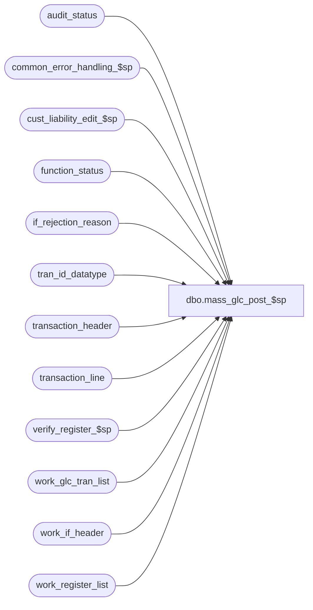

# dbo.mass_glc_post_$sp

**Database:** auditworks_external  
**Server:** bedrockdb01  

## Architecture Diagram



## Table Dependencies

| Referenced Table |
|---|
| audit_status |
| common_error_handling_$sp |
| cust_liability_edit_$sp |
| function_status |
| if_rejection_reason |
| tran_id_datatype |
| transaction_header |
| transaction_line |
| verify_register_$sp |
| work_glc_tran_list |
| work_if_header |
| work_register_list |

## Stored Procedure Code

```sql
create proc [dbo].[mass_glc_post_$sp] @function_no	tinyint,
@process_id	binary(16),
@user_id	int,
@glc_rows	int,
@errmsg		nvarchar(255) OUTPUT

AS

/*
PROC NAME:	mass_glc_post_$sp

DESCRIPTION:
To call glc posting and to calculate if_reject counts.
Called from mass_correct_* programs.
 
HISTORY
DATE     NAME	 DEF#  	DESC
Nov08,05 Paul   DV-1321 drop temp table, added nolock hints
Apr28,05 Paul   DV-1234 expand transaction_id to use tran_id_datatype
Sep17,04 Maryam DV-1146 Change user_name to user_id.
Apr29,04 Maryam DV-1071 Change @process_id to binary(16) and pass @process_id and @user_name
			to the sub procs.
Apr08,04 Sab	DV-1068 Remove old customer liability code
May16,02 Henry	1-CD0IX Add R3.5 standardized common error handling
Aug03,01 David C 8462  	Call cust_liability_edit_$sp for R3 customer liability
Mar29,01 Bayani	 7376  	Remove lines that accesses 'HO' table and proc.
Jun08,00 Vicci	 6410  	Replaced call to glc_$sp with call to Glc_$sp
Mar01,00 Phu     5900  	Change @@fetch_status > 0 to @@fetch_status <> 0 for MS SQL compatibility
Feb08,00 JimC    5955  	Bumped version number to force re-save in B10 upgrade. 
                       	(Also fixes 5032 and 4935)
May05,97 Paul          	Last modified
Mar15,97
*/
 
DECLARE @cursor_open	tinyint,
	@date_reject_id tinyint,
	@errno		int,
	@if_reject_qty	smallint,
	@register_no	smallint,
	@rows		int,
	@store_no	int,
	@transaction_date smalldatetime,
	@transaction_id	tran_id_datatype,
-- used for common error handling.
	@object_name		nvarchar(255),
	@process_name		nvarchar(100),
	@operation_name		nvarchar(100),
	@message_id		int

SELECT @process_name = 'mass_glc_post_$sp',
       @message_id = 201068

/* release space ( don't care about errors ) */

DELETE work_if_header
  WHERE process_id = @process_id

/* post any corrected transactions that affect glc */

IF @glc_rows >= 1
  BEGIN
   DECLARE glc_crsr CURSOR FAST_FORWARD
     FOR
   SELECT transaction_id
     FROM work_glc_tran_list WITH (NOLOCK)
     WHERE process_id = @process_id

   OPEN glc_crsr
   SELECT @errno = @@error
   IF @errno != 0
     BEGIN
      SELECT @errmsg = 'Failed to open glc_cursor',
	     @object_name = 'glc_cursor',
	     @operation_name = 'OPEN'
      GOTO error
     END

   SELECT @cursor_open = 1

   WHILE 1=1
    BEGIN
     FETCH glc_crsr INTO 
	@transaction_id

     IF @@fetch_status <> 0
       BREAK

     /* R3 customer liability */  
     EXEC cust_liability_edit_$sp @process_id = @process_id,
     				  @current_user_id = @user_id,
                                  @function_no = @function_no, 
                                  @transaction_id = @transaction_id,
                                  @store_no = null, 
                                  @transaction_date = null,
                                  @errmsg = @errmsg OUTPUT

	SELECT @errno = @@error
	IF @errno != 0
	BEGIN
	  IF @errmsg IS NULL -- 
	     SELECT @errmsg = 'Failed to execute cust_liability_edit_$sp'
	  SELECT @object_name = 'cust_liability_edit_$sp',
	         @operation_name = 'EXEC'
	  GOTO error
	END


     DELETE work_glc_tran_list
       WHERE process_id = @process_id
       AND transaction_id = @transaction_id

     SELECT @errno = @@error
     IF @errno != 0
       BEGIN
        SELECT @errmsg = 'Failed to delete work_glc_tran_list',
	       @object_name = 'work_glc_tran_list',
	       @operation_name = 'DELETE'
	GOTO error
       END

    END /* While 1=1 */

   CLOSE glc_crsr
   DEALLOCATE glc_crsr
   SELECT @cursor_open = 0

  END /* @glc_rows >= 1 */

/* get list of affected store/reg/dates in temp table to avoid locking problems. */

SELECT store_no, register_no, transaction_date, date_reject_id
 INTO #store_list
  FROM work_register_list WITH (NOLOCK)
  WHERE process_id = @process_id
  AND function_no = @function_no

SELECT @rows = @@rowcount,
	@errno = @@error
IF @errno != 0
  BEGIN
   SELECT @errmsg = 'Failed to build temp table #store_list',
	  @object_name = '#store_list',
	  @operation_name = 'SELECT'
   GOTO error
  END

IF @rows = 0
  BEGIN
   /* delete cleanup flag */
   DELETE function_status
     WHERE user_id = @user_id
     AND process_id = @process_id
     AND function_no = @function_no

   SELECT @errno = @@error
   IF @errno != 0
     BEGIN
      SELECT @errmsg = 'Failed to delete function_status',
	     @object_name = 'function_status',
	     @operation_name = 'DELETE'
      GOTO error
     END

   DROP TABLE #store_list
   RETURN
  END


DECLARE status_crsr CURSOR FAST_FORWARD
FOR
SELECT store_no,
	register_no,
	transaction_date,
	date_reject_id
 FROM #store_list WITH (NOLOCK)

OPEN status_crsr

SELECT @errno = @@error
IF @errno != 0
  BEGIN
   SELECT @errmsg = 'Failed to open status_cursor on temp table #store_list',
	  @object_name = 'status_crsr',
	  @operation_name = 'OPEN'
   GOTO error
  END

SELECT @cursor_open = 2

WHILE 2=2
 BEGIN
  FETCH status_crsr INTO 
	@store_no,
	@register_no,
	@transaction_date,
	@date_reject_id

  IF @@fetch_status <> 0
    BREAK

  SELECT @if_reject_qty = COUNT(DISTINCT ir.transaction_id)
			FROM transaction_header th WITH (NOLOCK), if_rejection_reason ir WITH (NOLOCK)
			WHERE store_no = @store_no
			AND register_no = @register_no
 			AND transaction_date = @transaction_date
			AND date_reject_id = @date_reject_id
			AND if_rejection_flag = 1
			AND th.transaction_id = ir.transaction_id
			AND deferred = 0

  UPDATE audit_status
    SET if_reject_qty = @if_reject_qty
    WHERE store_no = @store_no
    AND register_no = @register_no
    AND sales_date = @transaction_date
    AND date_reject_id = @date_reject_id

  SELECT @errno = @@error
  IF @errno != 0
    BEGIN
     SELECT @errmsg = 'Failed to update audit_status ( i/f rejects )',
	    @object_name = 'audit_status',
	    @operation_name = 'UPDATE'
     GOTO error
    END

  /* Look for transaction_lines which have been corrected
     within transactions that are still if_rejects */

  IF @if_reject_qty >= 1
    BEGIN
     SELECT tl.transaction_id, tl.line_id
       INTO #work_lines
       FROM transaction_header th WITH (NOLOCK), transaction_line tl WITH (NOLOCK)
       WHERE store_no = @store_no
       AND transaction_date = @transaction_date
       AND register_no = @register_no
       AND date_reject_id = @date_reject_id
       AND if_rejection_flag = 1
       AND th.transaction_id = tl.transaction_id
       AND interface_rejection_flag = 1 

     SELECT @errno = @@error
     IF @errno != 0
       BEGIN
        SELECT @errmsg = 'Failed to build temp table #work_lines',
	       @object_name = '#work_lines',
	       @operation_name = 'SELECT'
        GOTO error
       END

     DELETE #work_lines
       FROM #work_lines wl, if_rejection_reason ir WITH (NOLOCK)
       WHERE wl.transaction_id = ir.transaction_id
       AND wl.line_id = ir.line_id

     SELECT @errno = @@error
     IF @errno != 0
       BEGIN
        SELECT @errmsg = 'Failed to delete rows from table #work_lines',
	       @object_name = '#work_lines',
	       @operation_name = 'DELETE'
        GOTO error
       END

     UPDATE transaction_line
      SET interface_rejection_flag = 0
       FROM #work_lines wl, transaction_line tl
       WHERE wl.transaction_id = tl.transaction_id
       AND wl.line_id = tl.line_id

     SELECT @errno = @@error
     IF @errno != 0
       BEGIN
        SELECT @errmsg = 'Failed to update transaction_line',
	       @object_name = 'transaction_line',
	       @operation_name = 'UPDATE'
        GOTO error
       END

     DROP TABLE #work_lines
     IF @errno != 0
       BEGIN
        SELECT @errmsg = 'Failed to drop temp table #work_lines',
	       @object_name = '#work_lines',
	       @operation_name = 'DROP'
        GOTO error
       END
    END /* @if_reject_qty >= 1 */

  EXEC verify_register_$sp @process_id, @user_id, @store_no, @register_no, @transaction_date, 0, @errmsg OUTPUT

  SELECT @errno = @@error
  IF @errno != 0
    BEGIN
     IF @errmsg IS NULL -- 
	SELECT @errmsg = 'Failed to execute stored procedure verify_register_$sp.'
     SELECT @object_name = 'verify_register_$sp',
	    @operation_name = 'EXEC'
     GOTO error
    END

  DELETE work_register_list
  WHERE process_id = @process_id
  AND function_no = @function_no
  AND store_no = @store_no
  AND register_no = @register_no
  AND transaction_date = @transaction_date

  IF @errno != 0
   BEGIN
     SELECT @errmsg = 'Failed to DELETE from work_register_list',
	    @object_name = 'work_register_list',
	    @operation_name = 'DELETE'
     GOTO error
   END

 END /* While 2=2 */

CLOSE status_crsr
DEALLOCATE status_crsr

DROP TABLE #store_list

RETURN

error:

	IF @cursor_open = 1
	  BEGIN
	   CLOSE glc_crsr
	   DEALLOCATE glc_crsr
	  END

	IF @cursor_open = 2
	  BEGIN
	   CLOSE status_crsr
	   DEALLOCATE status_crsr
	  END

	EXEC common_error_handling_$sp @function_no, @errno, @errmsg, 0, @message_id, 
		@process_name, @object_name, @operation_name, 0, 1, 0, null, 0, null,
		null, null, null, null, null, 0, @process_id, @user_id

	RETURN
```

