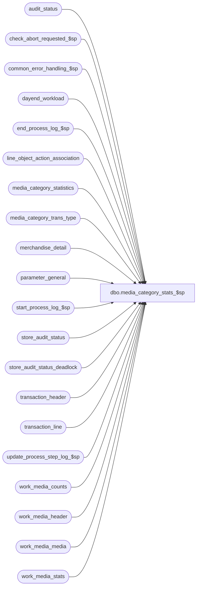

# dbo.media_category_stats_$sp

**Database:** auditworks_external  
**Server:** bedrockdb01  

## Architecture Diagram



## Table Dependencies

| Referenced Table |
|---|
| audit_status |
| check_abort_requested_$sp |
| common_error_handling_$sp |
| dayend_workload |
| end_process_log_$sp |
| line_object_action_association |
| media_category_statistics |
| media_category_trans_type |
| merchandise_detail |
| parameter_general |
| start_process_log_$sp |
| store_audit_status |
| store_audit_status_deadlock |
| transaction_header |
| transaction_line |
| update_process_step_log_$sp |
| work_media_counts |
| work_media_header |
| work_media_media |
| work_media_stats |

## Stored Procedure Code

```sql
create proc [dbo].[media_category_stats_$sp] 
  @process_id				 binary(16),
  @truncate_flag 			tinyint = 1,
  @dayend_process_id 			tinyint = NULL,
  @errmsg 				nvarchar(255) OUTPUT,
  @excluded_dayend_from_time            int = 0,
  @excluded_dayend_to_time              int = 0

AS

/*
  Proc Name: media_category_stats_$sp
  Desc : Multi-stream
   Post media (tender) totals to media_category_statistics table.
  Called from day_end_posting_$sp
 
HISTORY
DATE     NAME		DEF# DESCRIPTION
Aug14,07 Paul        DV-1363 apply 81895 to SA5
Oct25,06 Phu           77931 Fix outer join for SQL 2005 Mode 90.
Dec14,04 David       DV-1191 Improve performance by adding hints.
Oct07,04 David       DV-1146 Remove user name.
Jul09,04 Maryam      DV-1071 Receive @process_id and pass it to check_abort_requested_$sp.
Jan12,07 Vicci         81895 Support sale following loan, sale following rental, repair pickup, alteration pickup
Sep18,03 Maryam        13686 Pass two new parameters for excluded dayend time and call check_abort_requested_$sp
                             to check whether abort has been requested either by the system or user. 
Nov25,02 Sab	     1-GVN05 Performance enhancements
May08,02 Winnie	     1-C2Q5L Add abort logic to dayend.
Nov30,01 Phu		8931 Progress monitor and error handling
Jul16,01 Vicci		8281 Treat new order line-actions in the same manner as layaways.	
Sep12,00 Shapoor        6663 Facilitate Multi Stream Dayend.
Aug25,00 Phu		6644 Correct MS SQL bug where float negative times zero is not equal to zero
Jul17,00 Maryam         4743 Change data type of @start_time from smalldatetime to datetime.
Jul11,00 Paul S		6450 Round units to 4 decimal places to avoid truncation error
May25,00 John G		5864 Change '= NULL' to 'IS NULL' where applicable to mirror Oracle.
Apr03,00 John G		6164 Missing line_void_flag = 0 in work table population queries.	
Mar17,00 Sab		6082 Missing transaction_category column in SQL FLOW 1 part 1
Mar01,00 Phu		5900 Change @@fetch_status > 0 to @@fetch_status <> 0 for MS SQL compatibility
Feb29,00 John G		5985 tighten insert criteria for exchange transaction media totals
Jan28,00 John G		5740 added grouping condition for inserts to work_media_stats
Nov15,99 Paul		5604 improve performance and batching
Sep29,99 JohnG		5401 correct for division by 0 
Jul27,99 JohnG		5036 Corrections to data flow
Nov17,97 Paul
Jun30,97 David		Author

*/

DECLARE
	@cursor_open 			tinyint,
	@date_reject_id 		tinyint,
	@errno 				int,
	@media_category_stat_days	smallint,
	@message_id			int,
	@object_name			nvarchar(255),
	@operation_name			nvarchar(100),
	@process_name			nvarchar(100),
	@process_log_entry 		tinyint,
	@process_no 			smallint,
	@process_timestamp 		float,
	@rows				int,
	@sales_date 			smalldatetime,
	@start_time                     datetime,
	@store_audit_status 		smallint,
	@store_no 			int,
	@transaction_count 		int,
	@abort_flag			tinyint


IF @dayend_process_id IS NULL  
  RETURN

SELECT
	@start_time = getdate(),
	@cursor_open = 0,
	@errmsg = NULL,
	@process_log_entry = 0,
	@process_no = 24,
	@process_timestamp = 0,
	@message_id = 201068,
	@process_name = 'media_category_stats_$sp',
	@abort_flag = 0

SELECT @media_category_stat_days = media_category_statistics_days
  FROM parameter_general

IF @media_category_stat_days = 0
  BEGIN
	BEGIN TRAN

	UPDATE store_audit_status_deadlock
	SET function_no = 18,
		status_date = getdate()

	SELECT @errno = @@error
	IF @errno <> 0
	  BEGIN
		SELECT @errmsg = 'Unable to update store_audit_status_deadlock',
		       @object_name = 'store_audit_status_deadlock',
		       @operation_name = 'UPDATE'
		GOTO error
	  END
	
	UPDATE audit_status
	  SET audit_status = 335
	  FROM audit_status WITH (INDEX = audit_status_x2)
	 WHERE audit_status = 330

	SELECT @errno = @@error
	IF @errno <> 0
	  BEGIN
		SELECT @errmsg = 'Failed to update audit_status with status 335',
		       @object_name = 'audit_status',
		       @operation_name = 'UPDATE'
		GOTO error
	  END

	UPDATE store_audit_status 
	  SET store_audit_status = 335
	 WHERE store_audit_status = 330

	SELECT @errno = @@error
	IF @errno <> 0
	  BEGIN
		SELECT @errmsg = 'Failed to update store_audit_status with status 335',
		       @object_name = 'store_audit_status',
		       @operation_name = 'UPDATE'
		GOTO error
	  END

	UPDATE dayend_workload
	   SET store_audit_status = 335
	 WHERE dayend_process_id = @dayend_process_id
	   AND store_audit_status = 330

	SELECT @errno = @@error
	IF @errno <> 0
	  BEGIN
		SELECT @errmsg = 'Failed to update dayend_workload with status 335',
		       @object_name = 'dayend_workload',
		       @operation_name = 'UPDATE'
		GOTO error
	  END

	COMMIT TRAN
	RETURN
  END


CREATE TABLE #all_stores (
	store_no 			int 		not null,
	sales_date 			smalldatetime 	not null,
	date_reject_id 			tinyint 	not null,
	store_audit_status 		smallint 	not null )

SELECT @errno = @@error
IF @errno <> 0 
BEGIN
  SELECT @errmsg = 'Failed to create temp table.',
         @object_name = '#all_stores',
         @operation_name = 'CREATE'
  GOTO error  
END

/* save a snapshot of store_audit_status to avoid keeping rows locked */

INSERT INTO #all_stores
 SELECT store_no,
	sales_date,
	date_reject_id,
	store_audit_status
   FROM dayend_workload WITH (NOLOCK)
  WHERE dayend_process_id = @dayend_process_id
    AND store_audit_status = 330

SELECT @errno = @@error,
	@transaction_count = @@rowcount

IF @errno <> 0
  BEGIN
	SELECT @errmsg = 'Unable to select into #all_stores',
	       @object_name = '#all_stores',
	       @operation_name = 'INSERT'
	GOTO error
  END

IF @transaction_count = 0
  RETURN

EXEC start_process_log_$sp @process_no, @process_timestamp OUTPUT,
	@errmsg OUTPUT, @dayend_process_id, @start_time

SELECT @errno = @@error
IF @errno <> 0
  BEGIN
	SELECT @object_name = 'start_process_log_$sp',
	       @operation_name = 'EXECUTE'
	IF @errmsg IS NULL  
	  SELECT @errmsg = 'Unable to execute start_process_log_$sp'
	GOTO error
  END

SELECT @process_log_entry = 1,
	@transaction_count = 0

DECLARE store_date_crsr CURSOR FAST_FORWARD
    FOR
 SELECT	store_no,
	sales_date,
	date_reject_id,
	store_audit_status
   FROM #all_stores WITH (NOLOCK)

OPEN store_date_crsr

SELECT @errno = @@error
IF @errno <> 0
  BEGIN
	SELECT @errmsg = 'Unable to open cursor store_date_crsr',
	       @object_name = 'store_date_crsr',
	       @operation_name = 'OPEN'
	GOTO error
  END

SELECT @cursor_open = 1

WHILE 1=1
BEGIN
  FETCH store_date_crsr INTO
	@store_no,
	@sales_date,
	@date_reject_id,
	@store_audit_status

  IF @@fetch_status <> 0
	BREAK

  EXEC check_abort_requested_$sp @dayend_process_id, @process_id, @process_no,
                        @excluded_dayend_from_time, @excluded_dayend_to_time, @errmsg OUTPUT
        
  SELECT @errno = @@error
  IF @errno != 0 
    BEGIN
      IF @errmsg IS NULL
        SELECT @errmsg = 'Failed to execute stored procedure check_abort_requested_$sp'
      SELECT @object_name = 'check_abort_requested_$sp',
             @operation_name = 'EXECUTE'
      GOTO error
    END

  TRUNCATE TABLE work_media_stats

  SELECT @errno = @@error
  IF @errno <> 0
    BEGIN
	SELECT @errmsg = 'Unable to truncate table work_media_stats',
	       @object_name = 'work_media_stats',
	       @operation_name = 'TRUNCATE'
	GOTO error
    END

  TRUNCATE TABLE work_media_counts

  SELECT @errno = @@error
  IF @errno <> 0
    BEGIN
	SELECT @errmsg = 'Unable to truncate table work_media_counts',
	       @object_name = 'work_media_counts',
	       @operation_name = 'TRUNCATE'
	GOTO error
    END

  TRUNCATE TABLE work_media_header

  SELECT @errno = @@error
  IF @errno <> 0
    BEGIN
	SELECT @errmsg = 'Unable to truncate table work_media_header',
	       @object_name = 'work_media_header',
	       @operation_name = 'TRUNCATE'
	GOTO error
    END
	  
  TRUNCATE TABLE work_media_media

  SELECT @errno = @@error
  IF @errno <> 0
    BEGIN
	SELECT @errmsg = 'Unable to truncate table work_media_media',
	       @object_name = 'work_media_media',
	       @operation_name = 'TRUNCATE'
	GOTO error
    END

  /*  Populate work_media_header from table transaction_header  */

  BEGIN TRAN
  INSERT  work_media_header (
		transaction_id,
		tender_total,
		denominator,
		transaction_category,
		avoid_zero)
  SELECT
		transaction_id,
		tender_total,
		tender_total,
		transaction_category,
		avoid_zero = 0
    FROM transaction_header WITH (NOLOCK)
   WHERE  transaction_date = @sales_date
     AND  store_no = @store_no 
     AND  date_reject_id = @date_reject_id
     AND  transaction_void_flag * (transaction_void_flag - 8) = 0

  SELECT @errno = @@error
  IF @errno <> 0
    BEGIN
	SELECT @errmsg = 'Failed to populate work_media_header from table transaction_header',
	       @object_name = 'work_media_header',
	       @operation_name = 'INSERT'
	GOTO error
    END   
	  	  
  /*  FLOW 1: insert root exchange transactions */

  /* Insert root exchange transactions  */
  -- part 2
 INSERT  work_media_stats(
		transaction_id,
		line_id,
		transaction_type,
		media_category,
		media_amount,
		units)
  SELECT  
	 	tl.transaction_id,
	  	0,
	  	255,
		251,
		SUM((gross_line_amount - pos_discount_amount) * tl.db_cr_none * voiding_reversal_flag),
		COUNT(tl.line_id)
    FROM work_media_header mh WITH (NOLOCK), transaction_line tl WITH (NOLOCK), line_object_action_association loaa
   WHERE mh.transaction_id = tl.transaction_id
     AND ((tender_total = 0 AND
           CONVERT(NUMERIC(12,4), SIGN((gross_line_amount - pos_discount_amount) * tl.db_cr_none * voiding_reversal_flag)) = 1)
          OR
          (tl.line_object_type NOT IN (6,20) AND
           CONVERT(NUMERIC(12,4), SIGN((gross_line_amount - pos_discount_amount) * tl.db_cr_none * voiding_reversal_flag)) = CONVERT(NUMERIC(12,4), SIGN(tender_total))))
     AND tl.line_object = loaa.line_object
     AND tl.line_action = loaa.line_action
     AND loaa.media_category <> 0
     AND tl.line_void_flag = 0
   GROUP BY tl.transaction_id
           	    
  SELECT @errno = @@error, @rows = @@rowcount
  IF @errno <> 0
    BEGIN
	SELECT @errmsg = 'Failed to insert root exchange transactions(FLOW 1: part 2)',
	       @object_name = 'work_media_stats',
	       @operation_name = 'INSERT'
	GOTO error
    END   

  /*  FLOW 2: process pro_rating calculations into work_media_header  */
  IF @rows > 0 
  BEGIN
     UPDATE work_media_header
	SET denominator = denominator + ISNULL(
				(SELECT SUM(media_amount)
				   FROM	work_media_stats ms WITH (INDEX = work_media_stats_x1 NOLOCK)
				  WHERE mh.transaction_id = ms.transaction_id
				    AND media_category = 251), 0)
       FROM work_media_header mh

    SELECT @errno = @@error
    IF @errno <> 0
     BEGIN
	SELECT @errmsg = 'Failed to process pro_rating calculations into work_media_header (FLOW 2)',
		@object_name = 'work_media_header',
		@operation_name = 'UPDATE'
	GOTO error
     END   
  END

  --Part 1
  INSERT  work_media_stats(
		transaction_id,
		line_id,
		transaction_type,
		media_category,
		media_amount,
		units)
  SELECT  tl.transaction_id,
	  	0,
	  	255,
		loaa.media_category,
		SUM ((gross_line_amount - pos_discount_amount) * tl.db_cr_none * voiding_reversal_flag), 
		COUNT(tl.line_id)
    FROM work_media_header mh WITH (NOLOCK), transaction_line tl WITH (NOLOCK), line_object_action_association loaa
   WHERE mh.transaction_id = tl.transaction_id
     AND tl.line_object_type IN (6, 20)
     AND mh.transaction_category = loaa.transaction_category
     AND tl.line_object = loaa.line_object
     AND tl.line_action = loaa.line_action
     AND loaa.media_category <> 0
     AND tl.line_void_flag = 0
 GROUP BY tl.transaction_id, loaa.media_category
  	   
  SELECT @errno = @@error
  IF @errno <> 0
    BEGIN
	SELECT @errmsg = 'Failed to insert root exchange transactions (FLOW 1: part 1)',
	       @object_name = 'work_media_stats',
	       @operation_name = 'INSERT'
	GOTO error
    END   

  /* Cross-populate each tender total with detail lines.
   Prorate the amount AND units according to detail line amount vs total trans amount   
   (FLOW 3).  */

 INSERT  work_media_stats (
		transaction_id,
		line_id,
		transaction_type,
		media_category,
		media_amount,
		units )
  SELECT  mh.transaction_id,
		tl.line_id,
		mt.transaction_type,
	        ms.media_category,
	        ((gross_line_amount - pos_discount_amount) * db_cr_none * -1
	           * voiding_reversal_flag * (media_amount/denominator)),
	        ROUND((ISNULL(md.units,1) * db_cr_none * -1 * voiding_reversal_flag
	          * (media_amount/denominator)),4)
-- Don't change the order of the FROM clause without running the query plan
    FROM work_media_header mh WITH (NOLOCK)
	   INNER JOIN transaction_line tl WITH (NOLOCK) ON (mh.transaction_id = tl.transaction_id AND CONVERT(NUMERIC(12,4), SIGN((gross_line_amount - pos_discount_amount) * db_cr_none * voiding_reversal_flag)) <> CONVERT(NUMERIC(12,4), SIGN(mh.tender_total)))
 	   INNER JOIN media_category_trans_type mt WITH (INDEX = media_category_trans_type_x1) ON (mt.transaction_category = mh.transaction_category
                                                                                                 AND mt.line_action = tl.line_action
                                                                                                 AND mt.line_object = tl.line_object)
	   LEFT JOIN merchandise_detail md WITH (NOLOCK) ON (tl.transaction_id = md.transaction_id AND tl.line_id = md.line_id)
	   INNER JOIN work_media_stats ms WITH (INDEX = work_media_stats_x1 NOLOCK) ON (mh.transaction_id = ms.transaction_id)
   WHERE  denominator <> 0
     AND  tl.line_object_type NOT IN (6,20)
     AND  (tl.line_action < 101 OR tl.line_action > 121)
     AND  tl.line_action not in (7, 8, 95, 96, 91, 92, 3, 4, 9, 10, 78, 79, 200, 204, 210, 213, 214, 215, 223, 224, 225, 226, 227, 228, 191, 192, 193, 194, 198, 196)
     AND  CONVERT(NUMERIC(12,4), SIGN((gross_line_amount - pos_discount_amount) * db_cr_none * voiding_reversal_flag)) <> CONVERT(NUMERIC(12,4), SIGN(mh.tender_total))
     AND  CONVERT(NUMERIC(12,4), (gross_line_amount - pos_discount_amount) * db_cr_none * voiding_reversal_flag) <> 0
     AND  ms.media_category <> 250
     AND  tl.line_void_flag = 0
    OPTION(FORCE ORDER)
     
  SELECT @errno = @@error
  IF @errno <> 0
    BEGIN
	SELECT @errmsg = 'Failed to cross-populate each tender total with detail lines (FLOW 3)',
	       @object_name = 'work_media_stats',
	       @operation_name = 'INSERT'
	GOTO error
    END  		

  COMMIT TRAN

  /*  FLOW 4: process EXCHANGE detail rows into work_media_stats  */

 BEGIN TRAN
 INSERT work_media_stats (
		transaction_id,
		line_id,
		transaction_type,
		media_category,
		media_amount,
		units )
  SELECT
		mh.transaction_id,
		tl.line_id,
		mt.transaction_type,
		251,
	        ((gross_line_amount - pos_discount_amount) * db_cr_none * -1
	           * voiding_reversal_flag),
		ISNULL(md.units,1) * db_cr_none * voiding_reversal_flag * -1
-- Don't change the order of the FROM clause without running the query plan
    FROM work_media_header mh WITH (NOLOCK)
	 INNER JOIN transaction_line tl WITH (NOLOCK) ON (mh.transaction_id = tl.transaction_id AND (CONVERT(NUMERIC(12,4), SIGN((tl.gross_line_amount - tl.pos_discount_amount) * tl.db_cr_none * tl.voiding_reversal_flag)) = CONVERT(NUMERIC(12,4), SIGN(mh.tender_total)) OR mh.denominator = 0))
	 INNER JOIN media_category_trans_type mt WITH (INDEX = media_category_trans_type_x1) ON (mh.transaction_category = mt.transaction_category
                                      AND tl.line_action = mt.line_action 
                                                                                               AND tl.line_object = mt.line_object)
	 LEFT JOIN merchandise_detail md WITH (NOLOCK) ON (tl.transaction_id = md.transaction_id AND tl.line_id = md.line_id)
   WHERE tl.line_void_flag = 0
     AND line_object_type NOT IN (6,20)
     AND (tl.line_action < 101 or tl.line_action > 121)
     AND  tl.line_action not in (7, 8, 95, 96, 91, 92, 3, 4, 9, 10, 78, 79, 200, 204, 210, 213, 214, 215, 223, 224, 225, 226, 227, 228, 191, 192, 193, 194, 198, 196)
     AND (CONVERT(NUMERIC(12,4), SIGN((gross_line_amount - pos_discount_amount) * db_cr_none * voiding_reversal_flag)) = CONVERT(NUMERIC(12,4), SIGN(tender_total))
                 OR denominator = 0)
    OPTION(FORCE ORDER)
     
  SELECT @errno = @@error
  IF @errno <> 0
    BEGIN
	SELECT @errmsg = 'Failed to process EXCHANGE detail rows into work_media_stats (FLOW 4)',
	       @object_name = 'work_media_stats',
	       @operation_name = 'INSERT'
	GOTO error
    END   

  /*  FLOW 5: process LAYAWAY detail rows into work_media_stats  */

  INSERT  work_media_stats(
		transaction_id,
		line_id,
		transaction_type, 
		media_category,
		media_amount,
		units)
  SELECT
		mh.transaction_id,
		tl.line_id,
		mt.transaction_type,		
		250,
		((gross_line_amount - pos_discount_amount) * tl.db_cr_none * voiding_reversal_flag * -1),
		ISNULL(md.units,1) * tl.db_cr_none * voiding_reversal_flag * -1
-- Don't change the order of the FROM clause without running the query plan
    FROM work_media_header mh WITH (NOLOCK)
         INNER JOIN transaction_line tl WITH (NOLOCK) ON (mh.transaction_id = tl.transaction_id)
         INNER JOIN media_category_trans_type mt WITH (INDEX = media_category_trans_type_x1) ON (mh.transaction_category = mt.transaction_category 
                                                                                                 AND  tl.line_object = mt.line_object
                                                                                                 AND  tl.line_action = mt.line_action)
         LEFT JOIN merchandise_detail md WITH (NOLOCK) ON (tl.transaction_id = md.transaction_id AND  tl.line_id = md.line_id)
   WHERE  tl.line_void_flag = 0
     AND  tl.line_object_type NOT IN (6,20)
     AND  ((tl.line_action >= 101 AND tl.line_action <= 121)
            OR  tl.line_action in (7, 8, 95, 96, 91, 92, 3, 4, 9, 10, 78, 79, 200, 204, 210, 213, 214, 215, 223, 224, 225, 226, 227, 228, 191, 192, 193, 194, 198, 196) )
    OPTION(FORCE ORDER)
        
  SELECT @errno = @@error
  IF @errno <> 0
    BEGIN
	SELECT @errmsg = 'Failed to process LAYAWAY detail rows into work_media_stats (FLOW 5)',
	       @object_name = 'work_media_stats',
	       @operation_name = 'INSERT'
	GOTO error
    END   
	  
  /*  FLOW 6: populate work_media_counts  */ 

  INSERT  work_media_media(
		transaction_id,
		media_category,
		media_amount)
  SELECT 	transaction_id,
		media_category,
		SUM(media_amount)
    FROM  work_media_stats WITH (NOLOCK) 
   WHERE  transaction_type = 255	
   GROUP BY  transaction_id, media_category

  SELECT @errno = @@error
  IF @errno <> 0
    BEGIN
	SELECT @errmsg = 'Unable to insert into temp table work_media_media (FLOW 6)',
	       @object_name = 'work_media_media',
	       @operation_name = 'INSERT'
	GOTO error
    END

  COMMIT TRAN

  -- Part 1

  BEGIN TRAN
  INSERT work_media_counts (
	transaction_id,
	transaction_type,
	media_category,
	media_amount,
	units,
	transaction_qty,
	transaction_qty_for_avg)
  SELECT ms.transaction_id,
	ms.transaction_type,
	ms.media_category,
	SUM(ms.media_amount),
	SUM(ms.units),
	1,
	1
    FROM  work_media_stats ms WITH (NOLOCK)
   WHERE  ms.media_category = 250
   GROUP BY  ms.transaction_id, ms.transaction_type, ms.media_category
		
  SELECT @errno = @@error
  IF @errno <> 0
    BEGIN
	SELECT @errmsg = 'Failed to populate work_media_counts (FLOW 6 Part 1)',
	       @object_name = 'work_media_counts',
	       @operation_name = 'INSERT'
	GOTO error
    END   

  -- Part 2
  INSERT work_media_counts (
	transaction_id,
	transaction_type,
	media_category,
	media_amount,
	units,
	transaction_qty,
	transaction_qty_for_avg)
  SELECT  ms.transaction_id,
	ms.transaction_type,
	ms.media_category,
	SUM(ms.media_amount),
	SUM(ms.units),
	1,
	1
    FROM work_media_stats ms WITH (INDEX = work_media_stats_x1 NOLOCK),
	 work_media_media mm WITH (NOLOCK)
   WHERE  ms.media_category <> 250
     AND  ms.transaction_id = mm.transaction_id
     AND  ms.media_category = mm.media_category
   GROUP BY  ms.transaction_id,	ms.transaction_type, ms.media_category

  SELECT @errno = @@error
  IF @errno <> 0
    BEGIN
  	SELECT @errmsg = 'Failed to populate work_media_counts (FLOW 6 Part 3)',
	       @object_name = 'work_media_counts',
	       @operation_name = 'INSERT'
	GOTO error
    END   

  UPDATE  work_media_counts
    SET  transaction_qty = 1
    FROM work_media_counts mc,
         work_media_header mh WITH (INDEX = work_media_header_x0 NOLOCK)
   WHERE  media_category = 251
     AND  mc.transaction_id = mh.transaction_id
     AND  SIGN(media_amount) <> SIGN(denominator)
		
  SELECT @errno = @@error
  IF @errno <> 0
    BEGIN
	SELECT @errmsg = 'Failed to update work_media_counts (FLOW 6 Part 4)',
	       @object_name = 'work_media_counts',
	       @operation_name = 'UPDATE'
	GOTO error
    END    
  COMMIT TRAN

  /*  FLOW 7: insert into media_category_statistics  */

  BEGIN TRAN
  INSERT media_category_statistics(
	store_no,
    	transaction_date,
    	transaction_type,
    	media_category,
    	amount,
    	units,
    	transaction_qty,
    	transaction_qty_adj)
  SELECT 
	@store_no,
	@sales_date,
	transaction_type,
	media_category,
	SUM(media_amount),
	SUM(units),
	SUM(transaction_qty),
	SUM(transaction_qty)
    FROM work_media_counts WITH (NOLOCK)
   GROUP BY  transaction_type, media_category

  SELECT @errno = @@error,
	@transaction_count = @transaction_count + @@rowcount
  IF @errno <> 0
    BEGIN
	SELECT @errmsg = 'Failed to insert into media_category_statistics (FLOW 8)',
	       @object_name = 'media_category_statistics',
	       @operation_name = 'INSERT'
	GOTO error
    END   

  UPDATE store_audit_status_deadlock
    SET function_no = 18,
	status_date = getdate()

  SELECT @errno = @@error
  IF @errno <> 0
    BEGIN
	SELECT @errmsg = 'Unable to update store_audit_status_deadlock',
	       @object_name = 'store_audit_status_deadlock',
	       @operation_name = 'UPDATE'
	GOTO error
    END

  UPDATE audit_status 
    SET audit_status = 335
   WHERE store_no = @store_no
     AND sales_date = @sales_date
     AND date_reject_id = @date_reject_id
     AND audit_status = 330

  SELECT @errno = @@error
  IF @errno <> 0
    BEGIN
	SELECT @errmsg = 'Failed to update audit_status with status 335',
	       @object_name = 'audit_status',
	       @operation_name = 'UPDATE'
	GOTO error
    END

  UPDATE store_audit_status 
    SET store_audit_status = 335
   WHERE store_no = @store_no
     AND sales_date = @sales_date
     AND date_reject_id = @date_reject_id
     AND store_audit_status = 330

  SELECT @errno = @@error
  IF @errno <> 0
    BEGIN
	SELECT @errmsg = 'Failed to update store_audit_status with status 335',
	       @object_name = 'store_audit_status',
	       @operation_name = 'UPDATE'
	GOTO error
    END

  UPDATE dayend_workload
    SET store_audit_status = 335
   WHERE dayend_process_id = @dayend_process_id
     AND store_no = @store_no
     AND sales_date = @sales_date
     AND date_reject_id = @date_reject_id
     AND store_audit_status = 330

  SELECT @errno = @@error
  IF @errno <> 0
    BEGIN
	SELECT @errmsg = 'Unable to update dayend_workload with status 335',
	       @object_name = 'dayend_workload',
	       @operation_name = 'UPDATE'
	GOTO error
    END

  EXEC update_process_step_log_$sp 18, @dayend_process_id, 39, NULL, NULL, NULL  
  SELECT @errno = @@error
  IF @errno != 0
    BEGIN
      IF @errmsg IS NULL    
        SELECT @errmsg = 'Failed to execute stored proc update_process_step_log_$sp for step 39'
      SELECT @object_name = 'update_process_step_log_$sp',
	     @operation_name = 'EXECUTE'
      GOTO error
    END

  COMMIT TRAN

END /* while 1=1 */

CLOSE store_date_crsr
DEALLOCATE store_date_crsr
SELECT @cursor_open = 0

IF @process_log_entry = 1
  BEGIN
    EXEC end_process_log_$sp @process_no, @process_timestamp, @transaction_count
    SELECT @errno = @@error
    IF @errno != 0
      BEGIN
       SELECT @errmsg = 'Unable to execute stored procedure end_process_log_$sp',
              @object_name = 'end_process_log_$sp',
	      @operation_name = 'EXECUTE'
        GOTO error
      END
  END

RETURN

error:
	IF @cursor_open = 1
	  BEGIN
		CLOSE store_date_crsr
		DEALLOCATE store_date_crsr
		SELECT @cursor_open = 0
	  END

	EXEC common_error_handling_$sp @process_no, @errno, @errmsg, @abort_flag, @message_id, 
	@process_name, @object_name, @operation_name, 1, @dayend_process_id, @process_log_entry,
	@process_timestamp, @transaction_count
	RETURN
```

