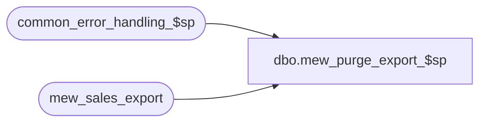

# dbo.mew_purge_export_$sp

**Database:** auditworks_external  
**Server:** bedrockdb01  

## Architecture Diagram



## Table Dependencies

| Referenced Table |
|---|
| common_error_handling_$sp |
| mew_sales_export |

## Stored Procedure Code

```sql
create proc dbo.mew_purge_export_$sp 	(@nb_days_keep_trans INT) 
AS

/* 
PROCNAME: mew_purge_export_$sp
DESC: This procedure is called for a new Pipeline segment (12100 - SA cleanup mew_sales_export). 
	In parameter : Number of days to keep the transactions in mew_sales_export.
 	  Called by Merch pipeline.

  *** WARNING: If running on SQL2000, then comment out the error routine and try .. catch OR 
      install SQL2000 compatible hotfix 130228_merch_sql2000.sp for SA 4.1.001.090 .

  HISTORY:
Date     Name             Defect Desc
Aug14,13 Paul             145958 call common_error_handling_$sp
Oct28,11 Paul S           130228 added SA error routine and comments
Oct05,11 Pierrette        130228 author

*/

DECLARE @error_flag			BIT,
	@errmsg				nvarchar(1024), 
	@errno				int,
	@batch_size			INT,
	@crs_trans_per_day_flag		BIT,
	@floor_date			DATETIME,
	@curr_transaction_date		DATETIME,
	@curr_transaction_count		INT,
	@crs_trans_per_loc_day_flag	BIT,
	@location_id			NUMERIC(5,0),
	@loc_count			INT, 
	@batch_counter			INT, 
	@batch_start			NUMERIC(5,0), 
	@batch_end			NUMERIC(5,0),
	@operation_name			nvarchar(100),
	@object_name			nvarchar(255),
	@process_name			nvarchar(32),
	@process_no			int,
	@message_id			int
	
	SELECT @error_flag = 0,
		@batch_size = 50000,
		@crs_trans_per_day_flag = 0,
		@process_name = 'mew_purge_export_$sp',
		@process_no = 280,
		@message_id = 201068,
		@object_name = 'mew purge',
		@operation_name = 'purge'
		
	BEGIN TRY
		-- Find the floor date that will be used as the minimum date to keep in the table
		SELECT @floor_date = DATEADD(day, -@nb_days_keep_trans, GETDATE()) ;
		
		-- In order to control the transaction size process by day unless the count is greater than the batch size.
		DECLARE crs_trans_per_day CURSOR FAST_FORWARD
		FOR
		SELECT transaction_date, COUNT(1)
		  FROM mew_sales_export
		 WHERE transaction_date < @floor_date
		GROUP BY transaction_date
		ORDER BY transaction_date;

		OPEN crs_trans_per_day;
		SELECT @crs_trans_per_day_flag = 1;

		FETCH NEXT FROM crs_trans_per_day
		 INTO @curr_transaction_date, @curr_transaction_count;

		WHILE @@FETCH_STATUS = 0
		BEGIN -- loop1
			IF (@curr_transaction_count <= @batch_size)
			BEGIN
				DELETE mew_sales_export
				 WHERE transaction_date = @curr_transaction_date;
			END
			ELSE
			BEGIN
				SELECT @batch_counter = 0;
				
				-- Another cursor is required in order to reduce the size of the transaction
				DECLARE crs_trans_per_loc_day CURSOR FAST_FORWARD
				FOR
				SELECT location_id, COUNT(1)
				  FROM mew_sales_export
				 WHERE transaction_date = @curr_transaction_date
				GROUP BY location_id
				ORDER BY location_id;
				
				OPEN crs_trans_per_loc_day;
				SELECT @crs_trans_per_loc_day_flag = 1;

				FETCH NEXT FROM crs_trans_per_loc_day
				 INTO @location_id, @loc_count

				WHILE @@FETCH_STATUS = 0 -- loop2
				BEGIN
					IF @batch_counter = 0
						SELECT @batch_start = @location_id;

					SELECT @batch_counter = @batch_counter + @loc_count,
						   @batch_end = @location_id;

					IF (@batch_counter > @batch_size)
					BEGIN
						DELETE mew_sales_export
						 WHERE transaction_date = @curr_transaction_date
						   AND location_id BETWEEN @batch_start AND @batch_end;
					END

					FETCH NEXT FROM crs_trans_per_loc_day INTO @location_id, @loc_count
				END -- loop2
				
				IF (@batch_counter <> 0) 
				BEGIN 
					
					DELETE mew_sales_export
					 WHERE transaction_date = @curr_transaction_date
					   AND location_id BETWEEN @batch_start AND @batch_end;
				END
			
				CLOSE crs_trans_per_loc_day;
				DEALLOCATE crs_trans_per_loc_day;
				SELECT @crs_trans_per_loc_day_flag = 0;
				
			END -- else of If @curr_transaction_count <= @batch_size
			
			FETCH NEXT FROM crs_trans_per_day INTO @curr_transaction_date, @curr_transaction_count;
		END -- loop 1
		
		CLOSE crs_trans_per_day;
		DEALLOCATE crs_trans_per_day;
		SELECT @crs_trans_per_day_flag = 0;
		
RETURN 0;

END TRY

BEGIN CATCH;
	SELECT @errno = ERROR_NUMBER(),
			@errmsg = 'Error when executing mew_purge_export_$sp: ' + CAST(ERROR_NUMBER() AS nvarchar) + ' ' + ERROR_MESSAGE();

	IF @@trancount > 0 ROLLBACK;

	IF (@crs_trans_per_loc_day_flag = 1)
	BEGIN
		CLOSE crs_trans_per_loc_day;
		DEALLOCATE crs_trans_per_loc_day;
	END;

	IF @crs_trans_per_day_flag = 1
	BEGIN
		CLOSE crs_trans_per_day;
		CLOSE crs_trans_per_day;
	END

	EXEC common_error_handling_$sp 
		@process_no = @process_no,
		@error_code = @errno,
		@error_msg = @errmsg,
		@abort_flag = 0,
		@message_id = @message_id,
		@process_name = @process_name,
		@object_name = @object_name,
		@operation_name = @operation_name;

	RETURN 1;
END CATCH;
```

