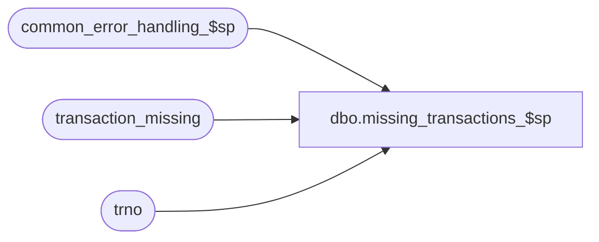

# dbo.missing_transactions_$sp

**Database:** auditworks_external  
**Server:** bedrockdb01  

## Architecture Diagram



## Table Dependencies

| Referenced Table |
|---|
| common_error_handling_$sp |
| transaction_missing |
| trno |

## Stored Procedure Code

```sql
create proc dbo.missing_transactions_$sp 
@process_id	        binary(16),
@user_id                int,
@store_no		int,
@transaction_date	smalldatetime,
@register_no		smallint,
@date_reject_id		tinyint,
@transaction_series	nchar(1),
@lower_transaction_limit trno,
@upper_transaction_limit trno,
@prior_txn_no		 trno, 
@next_txn_no		 trno,
@missing_logged		tinyint OUTPUT,
@errmsg			nvarchar(2000) OUTPUT,
@log_error_flag		tinyint = 0,  -- for call to common_error_handler, 1 = CALLED BY SMARTLOAD
@process_no		int,     -- for call to common_error_handler
@edit_process_no 	tinyint = 1  --  for call to common_error_handler

AS

/* 
PROC NAME: missing_transactions_$sp 
     DESC: Based on the txn_no and next_txn_no passed in, determines whether any missing
           transactions exist and logs them to transaction_missing.
           Called from missing_transactions_exec_$sp.

  HISTORY:
Date     Name		   Def#  Desc
Aug18,14 Paul          TFS-75489 avoid reporting dup error if from and to range already exists (likely a multiple rollover or bad data scenario)
Jan15,07 Paul              81764 apply 76394 to SA5 (removes DV-1234, DV-1203, DV-1071)
May02,05 Paul            DV-1234 remove logic to limit size of missing_qty
Jan20,05 Sab		 DV-1203 Added logic for scaleout table transaction_range.
Sep17,04 Maryam          DV-1146 Use user_id.
Sep10,04 Maryam          DV-1120 apply 1-YEVMT to SA5
May31,04 Maryam          DV-1071 superceded by 81764
Aug31,06 Vicci            76394  Redesign approach;
				 don't delete transaction_missing for good date when bad date passed in;
Aug05,04 Daphna   1-YEVMT/39453  do not update audit_status to edited when it was invalid reg   
Jan20,04 David            22170  Check for date_reject_id when selecting from transaction_range.
Dec16,03 Paul S           19908  improve performance with locking hints
Dec12,02 Winnie		1-G4RBY  using transaction_date when searching for prior transaction date,
				 performance issue, do not look at header or av header for prior tran date.
Dec03,02 Winnie     	   5132  Do not delete from transaction_missing if log_to_date <> transaction_date.
AUG19,02 Daphna         1-BMAEV  Use work table to ensure all registers in assigned group are 
                                 included to determine prev date and txn sequencing
SEP27,02 Daphna         1-FMGUG  set audit_status = 100 where missing_qty <> 0                                 
AUG15,02 Daphna		AW-6136  Get transaction_zero_flag from register_type table
SEP27,02 Daphna         1-FE0G1  RETROFIT 1-FMGUG to R3.0
MAY02,02 Daphna         1-CR53D  Do not lookup prior date in transaction_range when called by 
                                 Mass Delete (@process_no = 40)
APR26,02 Daphna         1-CFIND  Check for repeated txn no (count distinct tran_no), but 
                                 do not log rollover on repeat
                                 Ensure than audit_status.missing_qty does not exceed 32767
                                 which is limit for datatype smallint. 
APR10,02 Daphna         1-C3WWH  check tran range for prior date (in case it has already been 
 		  	         dayended), and check tran header if not found
FEB12,02 Daphna         1-AZ2OP  remove clause checking for first missing txn from rollover to
                                 prevent only recording 2nd portion (min-first) of missings
JAN28,02 Daphna         1-AHU31  Add 'transaction_no' to ORDER BY clause in cursor declaration
                                 in order to get more predictable results when several txns with
                                 same entry_date_time
DEC20,01 Daphna         1-9PZOX  assume a rollover when next_tran_no < prev_tran_no
                                 add input variable @edit_process_no for R3 Error Handling
DEC10,01 Daphna   	1-9HA9N  change name of input parameter to @register_no
NOV21,01 Daphna   	   8952  Common Error Handler changes  
Oct24,01 Daphna   	   8629  For Gap between yesterday and today in Rollover Situation the 
        transaction_missing is from_txn = prior_day_txn +1, to_txn = max
Jul09,01 Paul		   8151  Do not report missing for invalid store/reg
Jun22,01 Henry		   8195  Moved the cursor declaration to just before it is opened. 
Apr25,01 David M	   7589  Missing transactions by transaction series Version 1.0.
		     To prevent declaring the missing_crsr when not required.
Apr20,01 Paul	  	   7653  Add no data found trap to handle invalid registers
Apr04,01 David M	   7447  Change statement where @prior_day_transaction is set 
			         to check that last_transaction_no is not null otherwise could get
			         extra rows in transaction_missing table.
Feb13,01 Maryam	   	   7326  when checking for gap between today's first and yesterday's last
			         txn, log to_transaction_no = min(transaction_no) - 1.
Jan30,01 Henry		   6765  Create missing trxns, for the assigned register grouping (consolidated registers)
Jan22,01 Maryam	   	   7211  report rollover only when transaction 0 or 1 is found in the date/Reg.
Aug30,00 Paul		   6666  remove delete of transaction_missing since index ignores duplicates
Jun05,00 Maryam	   	   6244  Add logic to log missing trans when deleting a valid store/date/reg.
Mar01,00 Phu		   5900  Change @@fetch_status > 0 to @@fetch_status <> 0 for MS SQL compatibility
Feb04,00 Daphna F	   5944  ensure that count of existing txns excludes those with 
			         edit_progress_flag = 150 (incomplete txns from missing-tran-add)	
Sep01,99 Daphna F	   5332  correct calculation of missing txns between prev last and 
			         max on rollover day --> correct 4907 assign prev_txn_no to last_txn_no 
Aug04,99 Paul		   5034  speed improvement
Jul05,99 Daphna F	   4907  Add logic to book missing txns between prev day's last and max txn 
			         on rollover day add 'date_reject_id = @date_reject_id' to WHERE 
			         clause on update to audit_status to set missing_qty = 0
Mar03,99 Andrew V	         last modified
Aug13,96 Sebastiano V            author version 1.06

*/

DECLARE	@errline				int,
	@errmsg2				nvarchar(2000),
	@errno				int,
	@exists				int,
	@prior_date			smalldatetime,
	@message_id			int,
	@operation_name		        nvarchar(100),
	@object_name		        nvarchar(255),
	@process_name			nvarchar(100),
	@missing_from_txn_no		trno,
	@missing_to_txn_no		trno,
	@missing_from_txn_no2		trno,
	@missing_to_txn_no2		trno;

SELECT @process_name = 'missing_transactions_$sp',
       @message_id   = 201068,
       @missing_from_txn_no = NULL, @missing_to_txn_no = NULL,
       @missing_from_txn_no2 = NULL, @missing_to_txn_no2 = NULL,
       @missing_logged = 0,
       @exists = 0;

BEGIN TRY

IF @next_txn_no IS NULL OR @prior_txn_no IS NULL
  RETURN; 

IF @upper_transaction_limit IS NULL
  SELECT @upper_transaction_limit = 9999;

IF @lower_transaction_limit IS NULL
  SELECT @lower_transaction_limit = 0;
  
IF @next_txn_no > @upper_transaction_limit
  SELECT @upper_transaction_limit = @next_txn_no;

IF @prior_txn_no > @upper_transaction_limit
  SELECT @upper_transaction_limit = @prior_txn_no;

IF @next_txn_no < @lower_transaction_limit
  SELECT @lower_transaction_limit = @next_txn_no;
  
IF @prior_txn_no < @lower_transaction_limit
  SELECT @lower_transaction_limit = @prior_txn_no;

IF @next_txn_no >= @prior_txn_no
BEGIN 
  IF @next_txn_no <> @prior_txn_no + 1 AND @next_txn_no <> @prior_txn_no
    SELECT @missing_from_txn_no = @prior_txn_no + 1, 
           @missing_to_txn_no = @next_txn_no - 1;
END; --IF @next_date_txn_no >= @last_txn_no
ELSE
BEGIN
  IF (@prior_txn_no <> @upper_transaction_limit OR @next_txn_no <> @lower_transaction_limit)
  BEGIN
    IF @prior_txn_no <> @upper_transaction_limit
      SELECT @missing_from_txn_no = @prior_txn_no + 1, 
             @missing_to_txn_no = @upper_transaction_limit;
    IF @next_txn_no <> @lower_transaction_limit
      SELECT @missing_from_txn_no2 = @lower_transaction_limit, 
             @missing_to_txn_no2 = @next_txn_no - 1;
  END;  --IF (@prior_txn_no <> @upper_transaction_limit OR @next_txn_no <> @lower_transaction_limit)
        
END;  --ELSE of IF @next_date_txn_no >= @last_txn_no

SELECT @errmsg = 'Failed to insert on transaction_missing',
 	   @object_name = 'transaction_missing',
           @operation_name = 'INSERT';

IF @missing_from_txn_no IS NOT NULL /* then */
BEGIN
  SELECT @exists = COUNT(1)
    FROM transaction_missing
   WHERE store_no = @store_no
     AND register_no = @register_no
     AND sales_date = @transaction_date
     AND from_transaction_no = @missing_from_txn_no
     AND to_transaction_no = @missing_to_txn_no
     AND transaction_series = @transaction_series;

  IF @exists = 0
    INSERT transaction_missing (
  	          store_no,
       	          register_no,
	          sales_date,
	          from_transaction_no,
	          to_transaction_no,
	          verified,
	          transaction_series )
    VALUES (@store_no,
 	  @register_no,
          @transaction_date,
          @missing_from_txn_no,
	  @missing_to_txn_no,
	 0,
          @transaction_series);

  SELECT @missing_logged = 1;
END;  /* @missing_from_txn_no IS NOT NULL */

IF @missing_from_txn_no2 IS NOT NULL /* then */
BEGIN
  SELECT @errmsg = 'Failed to insert 2nd range of missing transactions in case of rollover';

  SELECT @exists = COUNT(1)
    FROM transaction_missing
   WHERE store_no = @store_no
     AND register_no = @register_no
     AND sales_date = @transaction_date
     AND from_transaction_no = @missing_from_txn_no2
     AND to_transaction_no = @missing_to_txn_no2
     AND transaction_series = @transaction_series;

  IF @exists = 0
  INSERT transaction_missing (
  	          store_no,
       	          register_no,
	          sales_date,
	          from_transaction_no,
	          to_transaction_no,
	          verified,
	          transaction_series )
  VALUES (@store_no,
 	  @register_no,
          @transaction_date,
          @missing_from_txn_no2,
	  @missing_to_txn_no2,
	  0,
	  @transaction_series);

  SELECT @missing_logged = 1;
END;  /* @missing_from_txn_no2 IS NOT NULL */
  
RETURN;

business_error:   /* Business Rule handler. */

	SELECT @errmsg2 = @errmsg;

	EXEC common_error_handling_$sp @process_no, @errno, @errmsg, 0, @message_id, @process_name, @object_name, @operation_name, @log_error_flag,
	     @edit_process_no, 0, null, 0, null, null, null, null, null, null, 0, @process_id, @user_id;
	  /* Note: when the exec above raises an error, that action also fires the system error trap (below) */
	RETURN;
END TRY

BEGIN CATCH; -- trap system errors
    /* common error handling. Appending proc name here because a rollback could occur if called within a transaction. */

        SELECT @errno = ERROR_NUMBER(),
		@errline = ERROR_LINE();

        SELECT @errmsg = CONVERT(nvarchar, @errno) + ':' + @process_name + ':' + CONVERT(nvarchar, @errline) + ':'
               + COALESCE(@errmsg, ' ') + ':' + ERROR_MESSAGE();

	 /* this condition will only be true when raise error in traps above fire this general catch */
	IF @errmsg2 IS NOT NULL
	  SELECT @errmsg = @errmsg2;

	EXEC common_error_handling_$sp @process_no, @errno, @errmsg, 0, @message_id, @process_name, @object_name, @operation_name, @log_error_flag,
	     @edit_process_no, 0, null, 0, null, null, null, null, null, null, 0, @process_id, @user_id;

	RETURN;
END CATCH;
```

