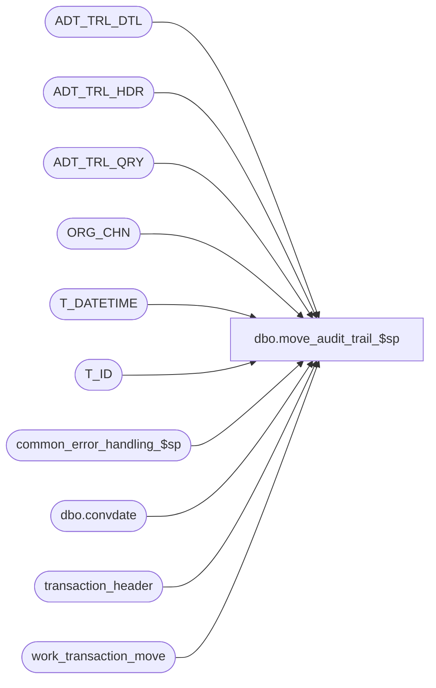

# dbo.move_audit_trail_$sp

**Database:** auditworks_external  
**Server:** bedrockdb01  

## Architecture Diagram



## Table Dependencies

| Referenced Table |
|---|
| ADT_TRL_DTL |
| ADT_TRL_HDR |
| ADT_TRL_QRY |
| ORG_CHN |
| T_DATETIME |
| T_ID |
| common_error_handling_$sp |
| dbo.convdate |
| transaction_header |
| work_transaction_move |

## Stored Procedure Code

```sql
create proc [dbo].[move_audit_trail_$sp] 
@from_store_no		int,
@from_register_no	smallint,
@from_sales_date	smalldatetime,
@from_transaction_no	int,
@to_store_no		int,
@to_register_no		smallint,
@to_sales_date		smalldatetime,
@to_transaction_no	int,
@errmsg			nvarchar(255) OUTPUT,
@process_id	        binary(16),
@user_id		int,
@function_no		smallint

AS

/* Proc Name: move_audit_trail_$sp
 Description:	log the move values to the audit trail.
		Called by move_register_$sp.  

HISTORY
Date     Name		Def#  Desc
Jan18,12 Vicci        132439  Remove references to CRDM user-defined string datatypes from S/A since CRDM is not changing them to support unicode.
Oct12,10 Paul         121130  populate a list of trans in ADT_TRL_DTL when frontend populates the list of transactions
Jun09,05 Paul        DV-1273  corrected audit trail
Dec01,04 Maryam      DV-1181  Use convdate for @to_sales_date
Sep17,04 Maryam      DV-1146  Use user_id.
Aug30,04 Maryam      DV-1120  Use convdate function for dates when logging the audit trail, change audit trail query key
Jul29,04 Maryam      DV-1071  Modify the insert into ADT_TRL_HDR to include APP_ID, FNCTTN_NUM
May29,04 Maryam      DV-1071  Use ORG_CHN_WRKSTN instead of register table, Changed @process_id from int to binary(16)
May19,04 David       DV-1071  Use ORG_CHN table as new the Store table.
Jan17,03 ShuZ        1-HZ3U2  Change double quote to single quote
Mar05,02 ShuZ        1-AXYK9  Use correct transaction no when populating audit trail header within cursor. 
			      R3 common error handling.
Dec21,00 Winnie		6791  Audit trail enhancements.
Mar01,00 Phu		5900  Change @@fetch_status > 0 to @@fetch_status <> 0 for MS SQL compatibility
         Seb                  author

*/

DECLARE
  @entry_date_time	T_DATETIME,
  @errno		int,
  @field_name_list	nvarchar(100),
  @store_name_to	nvarchar(30),
  @new_value_list	nvarchar(100),
  @old_value_list	nvarchar(100),
  @object_name		nvarchar(255),
  @process_name		nvarchar(100),
  @operation_name	nvarchar(100),
  @message_id		int,
  @sep			nchar(1),

  -- new audit trail tables
  @TBL_NAME		nvarchar(255),
  @TBL_KEY		nvarchar(255),
  @TBL_KEY_RSRC_NAME	nvarchar(255),
  @TBL_KEY_RSRC_PRMS	nvarchar(255),
  @ADT_CMNT		nvarchar(255),
  @bitval		nvarchar(10),
  @ENTRY_ID		T_ID


SELECT @entry_date_time = getdate(),
       @process_name = 'move_audit_trail_$sp',
       @message_id = 201068,
       @sep = nchar(12), -- audit trail seperator
       @ENTRY_ID = NEWID() 

SELECT @store_name_to = ORG_CHN_NAME
  FROM ORG_CHN
 WHERE ORG_CHN_NUM = @to_store_no

SELECT @TBL_NAME = 'TRANSACTION',
       @ADT_CMNT = NULL 

IF @from_transaction_no = -1 -- all transactions
BEGIN
  SELECT @TBL_KEY = convert(nvarchar, @to_store_no) + @sep + 
                    dbo.convdate(@to_sales_date) + @sep + 
                    convert(nvarchar, @to_register_no),
         @TBL_KEY_RSRC_NAME = 'TK_STOR_TRAN_DATE_REGI',
         @TBL_KEY_RSRC_PRMS = convert(nvarchar, @to_store_no) + ' - ' + @store_name_to + @sep + 
                              dbo.convdate(@to_sales_date) + @sep + 
                              convert(nvarchar, @to_register_no) 
END
ELSE
BEGIN
  SELECT @TBL_KEY = convert(nvarchar, @to_store_no) + @sep + 
                    dbo.convdate(@to_sales_date) + @sep + 
                    convert(nvarchar, @to_register_no) + @sep,
         @TBL_KEY_RSRC_NAME = 'TK_STOR_TRAN_DATE_REGI_TRAN_NO',
         @TBL_KEY_RSRC_PRMS = convert(nvarchar, @to_store_no) + ' - ' + @store_name_to + @sep + 
                              dbo.convdate(@to_sales_date) + @sep + 
                              convert(nvarchar, @to_register_no) + @sep
	-- will append transaction_no later
END -- IF @from_transaction_no = -1 

INSERT ADT_TRL_HDR (
	ENTRY_ID,
	ENTRY_DATE_TIME,
	USER_ID,
	APP_ID,
	ROOT_TBL_NAME,
	ROOT_TBL_KEY,
	ROOT_TBL_KEY_RSRC_NAME,
	ROOT_TBL_KEY_RSRC_PRMS,
	FNCTN_NUM,
	ADT_CMNT)
 SELECT
	@ENTRY_ID,
	@entry_date_time,
	@user_id,
	300,
	@TBL_NAME,
	@TBL_KEY,
	@TBL_KEY_RSRC_NAME,
	@TBL_KEY_RSRC_PRMS,
	@function_no,
	@ADT_CMNT

 SELECT @errno = @@error
    IF @errno <> 0
    BEGIN
      SELECT @errmsg = 'Unable to insert audit trail header.',
             @object_name = 'ADT_TRL_HDR',
             @operation_name = 'INSERT'
      GOTO error
    END

SELECT @TBL_NAME = 'TRANSACTION_HEADER'

/* determine which from/to column values are different */

IF @from_store_no <> @to_store_no
	SELECT @bitval = '1'
ELSE
	SELECT @bitval = '0'

IF @from_register_no <> @to_register_no
	SELECT @bitval = @bitval + '1'
ELSE
	SELECT @bitval = @bitval + '0'

IF @from_sales_date <> @to_sales_date
	SELECT @bitval = @bitval + '1'
ELSE
	SELECT @bitval = @bitval + '0'

IF @from_transaction_no <> @to_transaction_no AND @to_transaction_no >= 0
	SELECT @bitval = @bitval + '1'
ELSE
	SELECT @bitval = @bitval + '0'

-- strip any leading zeros
SET @bitval = FLOOR(RIGHT(@bitval ,LEN(@bitval )))

SELECT @old_value_list = N' ',
	@new_value_list = N' ',
	@field_name_list = N' '

WHILE FLOOR(@bitval ) > 0
BEGIN
	SELECT  @field_name_list = @field_name_list + ';' +
		CASE LEN(@bitval )
			WHEN 4 THEN N'store_no'
			WHEN 3 THEN N'register_no'
			WHEN 2 THEN N'sales_date'
			WHEN 1 THEN N'transaction_no'
		END

	SELECT @old_value_list = @old_value_list + ';' +
		CASE LEN(@bitval )
			WHEN 4 THEN CONVERT(NVARCHAR,@from_store_no)
			WHEN 3 THEN CONVERT(NVARCHAR,@from_register_no)
			WHEN 2 THEN dbo.convdate(@from_sales_date)
			WHEN 1 THEN CONVERT(NVARCHAR,@from_transaction_no)
		END

	SELECT @new_value_list = @new_value_list + ';' +
		CASE LEN(@bitval )
			WHEN 4 THEN CONVERT(NVARCHAR,@to_store_no)
			WHEN 3 THEN CONVERT(NVARCHAR,@to_register_no)
			WHEN 2 THEN dbo.convdate(@to_sales_date)
			WHEN 1 THEN CONVERT(NVARCHAR,@to_transaction_no)
		END

	--strip out the previous bit and any leading zeros
	SET @bitval = FLOOR(RIGHT(@bitval ,LEN(@bitval )-1))

END -- WHILE FLOOR(@bitcount) > 0	

-- strip out the leading blank and semicolon

SELECT @field_name_list = REPLACE(@field_name_list,' ;',''),
	@old_value_list = REPLACE(@old_value_list,' ;',''),
	@new_value_list = REPLACE(@new_value_list,' ;','')

/* If moving all transactions, then log only one detail to list the fields that were changed by the move */

IF @from_transaction_no = -1 AND @to_transaction_no = -1 -- all trans
	BEGIN
	  INSERT ADT_TRL_DTL (
		ENTRY_ID,
		TBL_NAME,
		TBL_KEY,
		TBL_KEY_RSRC_NAME,
		TBL_KEY_RSRC_PRMS,
		ACTN_CODE,
		CLMN_NAME,
		OLD_VAL,
		NEW_VAL)
	   SELECT
		@ENTRY_ID,
		@TBL_NAME,
		@TBL_KEY,
		@TBL_KEY_RSRC_NAME,
		@TBL_KEY_RSRC_PRMS,
		'M',
		@field_name_list,
		@old_value_list,
		@new_value_list

	   SELECT @errno = @@error
	   IF @errno <> 0
	    BEGIN
	      SELECT @errmsg = 'Unable to insert audit trail detail.',
	             @object_name = 'ADT_TRL_DTL',
	             @operation_name = 'INSERT'
	      GOTO error
	    END
	END -- If @to_transaction_no = -1 (all trans)
ELSE
	BEGIN -- frontend populated the work table
	/* Not moving an entire store or register so need to log a detail row for each transaction that was moved.
	   #move_temp is populated by calling proc */

	  INSERT ADT_TRL_DTL (
		ENTRY_ID,
		TBL_NAME,
		TBL_KEY,
		TBL_KEY_RSRC_NAME,
		TBL_KEY_RSRC_PRMS,
		ACTN_CODE,
		CLMN_NAME,
		OLD_VAL,
		NEW_VAL)
	   SELECT
		@ENTRY_ID,
		@TBL_NAME,
		@TBL_KEY + convert(nvarchar, transaction_no),
		@TBL_KEY_RSRC_NAME,
		@TBL_KEY_RSRC_PRMS + convert(nvarchar, transaction_no),
		'M',
		@field_name_list,
		@old_value_list,
		@new_value_list
	   FROM #move_temp

	   SELECT @errno = @@error
	   IF @errno <> 0
	    BEGIN
	      SELECT @errmsg = 'Unable to insert trans to audit trail detail.',
	             @object_name = 'ADT_TRL_DTL',
	             @operation_name = 'INSERT'
	      GOTO error
	    END

	END -- else of If @from_transaction_no = -1 (frontend populated)

-- log some search pointers

INSERT ADT_TRL_QRY (
	ENTRY_ID,
	QRY_KEY_NUM,
	KEY_PART_VAL_1,
	KEY_PART_VAL_2,
	KEY_PART_VAL_3,
	KEY_PART_VAL_4,
	KEY_PART_VAL_5,
	KEY_PART_VAL_6,
	KEY_PART_VAL_7,
	KEY_PART_VAL_8)
SELECT 
	@ENTRY_ID,
	301,
	convert(nvarchar, @from_store_no),
	convert(nvarchar, @from_register_no),	
	dbo.convdate(@from_sales_date),
	convert(nvarchar, wt.till_no),
	convert(nvarchar, th.transaction_no),
	th.transaction_series,
	convert(nvarchar, wt.cashier_no),
	convert(nvarchar, th.transaction_id)
   FROM work_transaction_move wt WITH (NOLOCK), transaction_header th WITH (NOLOCK)
  WHERE wt.process_id = @process_id
    AND wt.transaction_id = th.transaction_id

SELECT @errno = @@error
IF @errno <> 0
    BEGIN
      SELECT @errmsg = 'Unable to insert audit trail query (1).',
             @object_name = 'ADT_TRL_QRY',
             @operation_name = 'INSERT'
      GOTO error
    END

INSERT ADT_TRL_QRY (
	ENTRY_ID,
	QRY_KEY_NUM,
	KEY_PART_VAL_1,
	KEY_PART_VAL_2,
	KEY_PART_VAL_3,
	KEY_PART_VAL_4,
	KEY_PART_VAL_5,
	KEY_PART_VAL_6,
	KEY_PART_VAL_7,
	KEY_PART_VAL_8)
SELECT 
	@ENTRY_ID,
	301,
	convert(nvarchar, @to_store_no),
	convert(nvarchar, @to_register_no),	
	dbo.convdate(@to_sales_date),
	convert(nvarchar, th.till_no),
	convert(nvarchar, th.transaction_no),
	th.transaction_series,
	convert(nvarchar, th.cashier_no),
	convert(nvarchar, th.transaction_id)
   FROM work_transaction_move wt WITH (NOLOCK), transaction_header th WITH (NOLOCK)
  WHERE wt.process_id = @process_id
    AND wt.transaction_id = th.transaction_id

SELECT @errno = @@error
IF @errno <> 0
    BEGIN
      SELECT @errmsg = 'Unable to insert audit trail query (2).',
             @object_name = 'ADT_TRL_QRY',
             @operation_name = 'INSERT'
      GOTO error
    END


RETURN

error:   /* Common error handler. */

	EXEC common_error_handling_$sp 9, @errno, @errmsg, 0, @message_id, 
	@process_name, @object_name, @operation_name, 0, 1, 0, null, 0, null, null,
	null, null, null, null, 0, @process_id, @user_id

	RETURN
```

