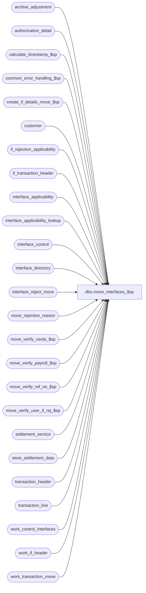

# dbo.move_interfaces_$sp

**Database:** auditworks_external  
**Server:** bedrockdb01  

## Architecture Diagram



## Table Dependencies

| Referenced Table |
|---|
| archive_adjustment |
| authorization_detail |
| calculate_timestamp_$sp |
| common_error_handling_$sp |
| create_if_details_move_$sp |
| customer |
| if_rejection_applicability |
| if_transaction_header |
| interface_applicability |
| interface_applicability_lookup |
| interface_control |
| interface_directory |
| interface_reject_move |
| move_rejection_reason |
| move_verify_cards_$sp |
| move_verify_payroll_$sp |
| move_verify_ref_no_$sp |
| move_verify_user_if_rej_$sp |
| settlement_service |
| store_settlement_data |
| transaction_header |
| transaction_line |
| work_control_interfaces |
| work_if_header |
| work_transaction_move |

## Stored Procedure Code

```sql
create proc dbo.move_interfaces_$sp 
@process_id                     binary(16),
@user_id                        int,
@store_no			int,
@register_no			smallint,
@transaction_date		smalldatetime,
@errmsg				nvarchar(255) OUTPUT,
@function_no			tinyint

AS

/*
PROC NAME: move_interfaces_$sp
DESC: (MOVE) to update preaudit interfaces and to create interface 
      	   rejections when necessary.
      Called by move_register_$sp.

HISTORY:
Date     Name           Defect# Desc
May06,15 Vicci       TFS-119009 Exclude host capture (settlement from POS) lines from being treated as applicable to S/A settlement interfaces.
Mar03,11 Vicci 		 125554 Ensure that interfaces to which an I/F rejection reason applies are listed in interface_control
                                even when their applicability_method is > 1 (i.e. controlled by program).
Oct18,10 Vicci           121820 Avoid losing interface_control entries for interfaces with I/F rejects (broken on defect DV-1286).
Aug26,10 Vicci           120504 Avoid error 2601 (dup key on insert) when logging customer insufficiency rejects to 
			        interface_reject_move and multiple insufficient customers under different roles are 
			        present.
Oct05,07 Paul             91395 apply 87372 to SA5
May01,07 Phu            DV-1364 85598 does not affect this proc in SA5.
Oct25,06 Phu              77931 Fix outer join for SQL 2005 Mode 90.
Oct20,06 Tim            DV-1346 apply 77740 to SA5
Oct04,06 Paul             77922 apply 77650 to SA5
Jul27,06 Tim   		  69753 Apply defect 70769 to SA5
Apr12,06 Vicci            70769 For the CRM interfaces based on interface applicability, 
                                if the transaction category is not defined in interface 
                                applicability then don't feed the transaction to CRM.
Oct19,05 Paul             62028 correctly set @applicability_method, added comments
Sep06,05 Paul           DV-1312 apply 41740 to SA5
Jun28,05 Paul           DV-1286 ignore interface_status_flag = 98
Apr29,05 Maryam         DV-1202 Rename from_line_id to line_id, expand transaction_id to use tran_id_datatype,
				new i/f reject type 112 (Paul)
Feb08,05 David          DV-1206 Treat I/F reject reason 113 same as reason 2.
Jan06,05 David          DV-1191 Improve performance by removing references to check variables and simplifying cursor logic.
Sep17,04 Maryam         DV-1146 Change user_name to user_id.
Apr28,04 Maryam         DV-1071 Receive @process_id and @user_name and pass it to the sub procs.
Jun01,07 Phu              87372 Validate Employee Attribute I/F rejects 38-41.
Apr11,07 Phu              85598 Validate Employee Attribute I/F rejects 21-37.
Oct17,06 Daphna           77740 Include voided transaction lines if I/F wants voided transactions
Sep26,06 Daphna           77650 Parameterize exporting all transactions with customer number to CRM 26 
Apr12,06 Vicci            70769 For the CRM interfaces based on interface applicability, 
                                if the transaction category is not defined in interface 
                                applicability then don't feed the transaction to CRM.
Mar24,06 Daphna           69730 Use MAX(if_entry_no) in insert to work_if_header to ensure that 
                                "in" copy is inserted from if_transaction_header ( TO store/reg/date not sufficient
                                when reassigning till or cashier)
Jul08,05 David          DV-1298 Treat I/F reject reason 113 same as reason 2.
Dec02,04 Daphna           41740 Log additional txns for CIM (IF26), same as for CPS(IF3)
Oct01,03 ShuZ             15765 Hard code interface_affected_flag to 0 when inserting interface_reject_move
Sep15,03 ShuZ           1-G7A5F Remove all references to the interface_directory '... _check' 
                                fields from stored procedures/triggers and replace with usage 
                                of if_rejection_applicability table.
Jul16,03 Paul           1-KX549 pass @legacy_media_rec_active_to to move_verify_cards_$sp
Apr24,03 Paul           1-KO2HY populate till_no
Jan24,03 Winnie         5752    create i/f reject if customer row does not exist
Mar06,02 Henry		1-BG8Z5 Only verifies applicable I/F rejects setup in if_rejection_applicability.
Jan30,02 David C	1-9DI2T Lay foundation for archive transaction modification.
Dec26,01 Henry		1-9VP66	Add missing code for validation of I/F rejects 3,4,80,81,82 when applicability_method = 2.
			     Corrected IF statements from Def 5678, affects validation of I/F rejects 3,4,80.
Oct05,01 Maryam         8816 Delete interface_reject_move when sa_rejection_flag = 1.
Sep17,01 Henry		8703 To correctly handle interface entries when moving trxns, 
			     and the live_date is null in interface_directory.
Sep17,01 Henry		8740 retrofitted 8703 to 2.46.25
Aug10,01 Maryam         8283 Populate memo fields in move_rejection_reason table. Also combined
        if_reject_reason 7 and 8.
Jul25,01 David C        8413 Add transaction_id to if_transaction_header
Jun06,01 Phu		7214 Verify if_reject_reason 87,88,89,90 for Merch/Stock POS Identifier/Pos Deptclass not on file
May29,01 Paul		8031 remove hold logic
May04,01 Henry		7369 Allows user-defined IF rejection reasons.
Jan08,01 Paul		7182 Avoid error when calling move_verify_ref_no_$sp
Jun22,00 Paul		3045 Correctly set interface_control_flag by joining to interface_control
Jun08,00 Daphna		4857 add new reference_no_check logic
Jun01,00 John G		5678 Break down employee_no_check into component parts.
Mar14,00 Shapoor	5878 Update last_modified_date_time in if_transaction_header with current date/time.
Feb17,00 Daphna		5904 Pass function_no (9 or 109) in call to update_error_log_$sp and 
                               	insert to if and ho tran header for source_process_no
Sep08,99 Sab		5281 Set interface_control_flag correctly 10(NEW)/30(IN)
Nov09,99 Daphna F	5600 Add OUTPUT param @errmsg in call to create_ho_details_move_$sp
Jun22,99 Daphna F	4878 Go to next cursor fetch only for appli-meth = 2
				Allow applic-meth = 1 or 0  to post rejects.
				Added logic for tax_default_check, exception_jurisdiction_check,
				employee_check2 and 3, store_check2
May12,99 Paul		4678 post if_rejects for interfaces where applic_method = 1
Apr07,99 Daphna F	4416 corrected join btw #cps_list, customer and work_tran._move on
				insert to #work_interfaces
Mar26,99 Daphna F	4416 corrected join btw work_tran._move and tran._header on insert to
				#work_interfaces
Nov06,98 Erin N
Jan23,97 Sebastiano	Author

*/


DECLARE
	@applicability_method		tinyint,
	@cursor_open			tinyint,
	@edit_timestamp			float,
	@errno				int,
	@include_all_trans_with_cust    tinyint,
	@if_id                          tinyint,
	@interface_id			tinyint,
	@interface_voided_transactions	tinyint,
	@live_date			smalldatetime,
	@message_id			int,
	@object_name			nvarchar(255),
	@operation_name			nvarchar(100),
	@process_name			nvarchar(100),
	@rows				int,
	@update_timing			smallint

SELECT 	@cursor_open = 0,
	@process_name = 'move_interfaces_$sp',
	@message_id = 201068


EXEC calculate_timestamp_$sp @edit_timestamp OUTPUT

SELECT @errno = @@error
IF @errno != 0
BEGIN
  SELECT @errmsg = 'Failed to execute stored procedure calaculate_timestamp_$sp 2',
         @object_name = 'calculate_timestamp_$sp',
         @operation_name = 'EXECUTE'
  GOTO error
END

create table #tran_list (transaction_id	numeric(14,0)	not null) -- tran_id_datatype

SELECT @errno = @@error
IF @errno != 0
BEGIN
  SELECT @errmsg = 'Failed to create temp table #tran_list.',
         @object_name = '#tran_list',
         @operation_name = 'CREATE'
  GOTO error
END

create table #work_interfaces (
   transaction_id		numeric(14,0)	not null, -- tran_id_datatype
   interface_id			tinyint		not null,
   interface_status_flag	tinyint		not null,
   orig_sa_reject_flag		tinyint		not null,
   applicability_method		tinyint		not null )

SELECT @errno = @@error
IF @errno != 0
BEGIN
  SELECT @errmsg = 'Failed to create temp table #work_interfaces.',
         @object_name = '#work_interfaces',
         @operation_name = 'CREATE'
  GOTO error
END

IF EXISTS ( SELECT 1
            FROM if_rejection_applicability
            WHERE if_reject_reason IN (2,113))
BEGIN
  EXEC move_verify_cards_$sp @process_id, @user_id, @store_no, @errmsg OUTPUT

  SELECT @errno = @@error
  IF @errno != 0
  BEGIN
    IF @errmsg IS NULL 
      SELECT @errmsg = 'Failed to execute stored procedure move_verify_cards_$sp'
       
    SELECT  @object_name = 'move_verify_cards_$sp',
            @operation_name = 'EXECUTE'
    GOTO error
  END
END

IF EXISTS ( SELECT 1
            FROM if_rejection_applicability
            WHERE if_reject_reason = 82)
BEGIN
  EXEC move_verify_payroll_$sp @process_id, @user_id, @errmsg OUTPUT

  SELECT @errno = @@error
  IF @errno != 0
  BEGIN
    IF @errmsg IS NULL 
      SELECT @errmsg = 'Failed to execute stored procedure move_verify_payroll_$sp'
      
    SELECT @object_name = 'move_verify_payroll_$sp',
           @operation_name = 'EXECUTE'
    GOTO error
  END
END

IF EXISTS ( SELECT 1
            FROM if_rejection_applicability
            WHERE if_reject_reason = 86)
BEGIN
  EXEC move_verify_ref_no_$sp  @process_id, @user_id

  SELECT @errno = @@error
  IF @errno != 0
  BEGIN
    SELECT @errmsg = 'Failed to execute stored procedure move_verify_ref_no_$sp',   
           @object_name = 'move_verify_ref_no_$sp',
           @operation_name = 'EXECUTE'
    GOTO error
  END
END

/* Don't create if rejects for void transactions */
DELETE interface_reject_move
  FROM interface_reject_move ir, transaction_header th WITH (NOLOCK)
  WHERE process_id = @process_id
    AND ir.transaction_id = th.transaction_id
    AND ((transaction_void_flag >= 1 AND transaction_void_flag != 8 )  
          OR sa_rejection_flag = 1)

SELECT @errno = @@error
IF @errno != 0
BEGIN
  SELECT @errmsg = 'Failed to delete interface_reject_move (void transactions)',
         @object_name = 'interface_reject_move',
         @operation_name = 'DELETE'
  GOTO error
END

/* Don't create if rejects for void lines */
DELETE interface_reject_move
  FROM interface_reject_move ir, transaction_line tl WITH (NOLOCK)
  WHERE process_id = @process_id
    AND ir.transaction_id = tl.transaction_id
    AND ir.line_id = tl.line_id
    AND line_void_flag >= 1

SELECT @errno = @@error
IF @errno != 0
BEGIN
  SELECT @errmsg = 'Failed to delete interface_reject_move (void lines)',
         @object_name = 'interface_reject_move',
         @operation_name = 'DELETE'
  GOTO error
END

/*{ Defect 7369. Part of the User defined IF rejects. Insert into the Edit work tables. */

DELETE interface_reject_move -- remove rows from previous abort of this proc
 WHERE (if_reject_reason IN (6,112) OR if_reject_reason >= 200)
   AND process_id = @process_id

SELECT @errno = @@error
IF @errno != 0
  BEGIN
     SELECT @errmsg = 'Failed to delete reject type 112',
            @object_name = 'interface_reject_move',
            @operation_name = 'DELETE'                
     GOTO error
  END

-- this will populate the table interface_reject_move

EXEC move_verify_user_if_rej_$sp @process_id, @user_id, @errmsg OUTPUT

SELECT @errno = @@error
IF @errno != 0
BEGIN
  IF @errmsg IS NULL -- then
    SELECT @errmsg = 'Failed to execute stored procedure move_verify_if_rej_$sp'

  SELECT @object_name = 'move_verify_user_if_rej_$sp',
         @operation_name = 'EXECUTE'
  GOTO error
END

/* Note: assumes one purchasing customer per transaction */
IF EXISTS(SELECT 1
           FROM if_rejection_applicability
          WHERE if_reject_reason = 6)
BEGIN           
     UPDATE customer
	SET customer_sufficient = 1
       FROM work_transaction_move wt WITH (NOLOCK), customer c
      WHERE wt.process_id = @process_id
        AND wt.transaction_id = c.transaction_id
	AND customer_sufficient = 0
	AND last_name IS NOT NULL --
	AND ( address_1 IS NOT NULL OR address_2 IS NOT NULL )
	AND (( city IS NOT NULL AND state IS NOT NULL ) OR post_code IS NOT NULL )

     SELECT @errno = @@error
     IF @errno != 0
     BEGIN
       SELECT @errmsg = 'Failed to update customer',
              @object_name = 'customer',
              @operation_name = 'UPDATE'
	GOTO error
     END   

     INSERT interface_reject_move (
		process_id,
		transaction_id,
		line_id,
		if_reject_reason,
		interface_affected_flag)
     SELECT DISTINCT @process_id,
		wt.transaction_id,
		ISNULL(line_id, 0),
		6,
		0
       FROM work_transaction_move wt WITH (NOLOCK)
            LEFT JOIN customer c WITH (NOLOCK) ON (wt.transaction_id = c.transaction_id AND ((line_id IS NOT NULL AND ISNULL(customer_sufficient,0) = 0) OR line_id IS NULL))
      WHERE wt.process_id = @process_id

     SELECT @errno = @@error
     IF @errno != 0
        BEGIN
          SELECT @errmsg = 'Failed to insert on interface_reject_move (type 6)',
                 @object_name = 'interface_reject_move',
                 @operation_name = 'UPDATE'
	 GOTO error
        END
END -- if_reject_reason = 6    

UPDATE work_transaction_move
   SET sa_rejection_flag     = th.sa_rejection_flag,
       transaction_void_flag = th.transaction_void_flag,
       transaction_date      = th.transaction_date,
       transaction_category  = th.transaction_category,
       customer_info_exists  = th.customer_info_exists
  FROM work_transaction_move wt, transaction_header th WITH (NOLOCK)
 WHERE wt.transaction_id = th.transaction_id
   AND wt.process_id = @process_id

  SELECT @errno = @@error
  IF @errno != 0
  BEGIN
    SELECT @errmsg = 'Failed to set current sa_rejection_flag.',
           @object_name = 'work_transaction_move',
           @operation_name = 'UPDATE'
    GOTO error
  END

/* mass insert interfaces with applicability_method > 0. Always insert for interfaces with applicability_method = 1 but
   applicability_method > 1 interfaces are only needed if they require i/f reject validation. */

INSERT #work_interfaces (
	transaction_id,
	interface_id,
	interface_status_flag,
	orig_sa_reject_flag,
	applicability_method )
 SELECT	wt.transaction_id,
	id.interface_id,
	id.update_timing,
	wt.orig_sa_reject_flag,
	id.applicability_method
   FROM work_transaction_move wt WITH (NOLOCK), interface_directory id
  WHERE wt.process_id = @process_id
    AND id.update_timing >= 1
    AND id.applicability_method >= 1
    AND (wt.transaction_date >= id.live_date OR id.live_date IS NULL)
    AND wt.sa_rejection_flag = 0
    AND wt.transaction_void_flag * (wt.transaction_void_flag - 8) * (1 - id.interface_voided_transactions) = 0
    AND ( id.applicability_method = 1 
          OR id.interface_id IN (SELECT DISTINCT interface_id FROM if_rejection_applicability) )
  SELECT @errno = @@error
  IF @errno != 0
  BEGIN
    SELECT @errmsg = 'Failed to insert #work_interfaces (all transactions)',
           @object_name = '#work_interfaces',
           @operation_name = 'INSERT'
    GOTO error
  END

/* insert interfaces with applicability_method = 0 */

DECLARE interface_directory_crsr CURSOR FAST_FORWARD
    FOR
SELECT interface_id,
	update_timing,
	live_date,
	interface_voided_transactions
  FROM interface_directory WITH (NOLOCK)
 WHERE applicability_method = 0
  AND update_timing >= 1

SELECT @errno = @@error
IF @errno != 0
BEGIN
  SELECT @errmsg = 'Failed to declare cursor for interface_directory_crsr',
         @object_name = 'interface_directory_crsr',
         @operation_name = 'DECLARE'
  GOTO error
END

OPEN interface_directory_crsr

SELECT @errno = @@error
IF @errno != 0
BEGIN
  SELECT @errmsg = 'Failed to open cursor for expected_media_crsr',
         @object_name = 'interface_directory_crsr',
         @operation_name = 'OPEN'
  GOTO error
END

SELECT @cursor_open = 1

WHILE 1=1
BEGIN

  FETCH interface_directory_crsr INTO
	@interface_id,
	@update_timing,
	@live_date,
	@interface_voided_transactions

  IF @@fetch_status <> 0
	BREAK

  INSERT #work_interfaces (
	   transaction_id,
	   interface_id,
	   interface_status_flag,
	   orig_sa_reject_flag,
	   applicability_method )
  SELECT DISTINCT tl.transaction_id,
	   @interface_id,
 	   @update_timing,
	   orig_sa_reject_flag,
	   0
      FROM work_transaction_move wt WITH (NOLOCK)
           INNER JOIN transaction_line tl WITH (NOLOCK)
              ON wt.transaction_id = tl.transaction_id
             AND (tl.line_void_flag = 0 OR @interface_voided_transactions = 1)
   	   INNER JOIN interface_applicability_lookup ia
   	      ON ia.interface_id = @interface_id
             AND tl.line_object = ia.line_object
             AND tl.line_action = ia.line_action
             AND wt.transaction_category = ia.transaction_category
   	    LEFT OUTER JOIN settlement_service ss
   	      ON ia.interface_id = ss.interface_id
   	    LEFT OUTER JOIN authorization_detail ad
   	      ON tl.transaction_id = ad.transaction_id
   	     AND tl.line_id = ad.line_id
     WHERE (wt.transaction_date >= @live_date OR @live_date IS NULL) -- Def 8703
       AND wt.sa_rejection_flag = 0
       AND wt.transaction_void_flag * (wt.transaction_void_flag - 8) * (1 - @interface_voided_transactions) = 0
       AND wt.process_id = @process_id
       AND (ss.interface_id IS NULL OR COALESCE(ad.other_id, '-') <> 'HostCapture');
    SELECT @errno = @@error
    IF @errno != 0
    BEGIN
	SELECT @errmsg = 'Failed to insert on #work_interfaces cursor',
               @object_name = '#work_interfaces',
               @operation_name = 'INSERT'
	GOTO error
     END
    
END /* While 1=1 */

CLOSE interface_directory_crsr
DEALLOCATE interface_directory_crsr

SELECT @cursor_open = 0

/*{ look for transactions applicable to CPS or CIM
    which are not already flagged */

SELECT @if_id = 3

SELECT @update_timing = update_timing,
	@live_date = live_date,
	@interface_voided_transactions = interface_voided_transactions,
	@include_all_trans_with_cust = IsNull(include_all_trans_with_cust, 0),
	@applicability_method = applicability_method
  FROM interface_directory
  WHERE interface_id = 3

IF @@rowcount = 0 OR  @update_timing = 0
BEGIN
  SELECT @update_timing = update_timing,
         @live_date = live_date,
         @interface_voided_transactions = interface_voided_transactions,
         @include_all_trans_with_cust = IsNull(include_all_trans_with_cust, 0),
         @if_id = 26,
       	 @applicability_method = applicability_method
    FROM interface_directory
   WHERE interface_id = 26
END

IF @update_timing >= 1 AND @applicability_method = 0 AND @include_all_trans_with_cust = 1
BEGIN

  INSERT INTO #tran_list
  SELECT wt.transaction_id
    FROM work_transaction_move wt WITH (NOLOCK)
   WHERE process_id = @process_id
     AND customer_info_exists = 1
     AND (transaction_date >= @live_date OR @live_date IS NULL) -- Def 8703
     AND sa_rejection_flag = 0
     AND transaction_void_flag * (transaction_void_flag - 8) * (1 - @interface_voided_transactions) = 0
     AND transaction_category IN (SELECT transaction_category --defect 69753
                                       FROM interface_applicability
                                      WHERE interface_id = @if_id)


  SELECT @errno = @@error
  IF @errno != 0
  BEGIN
    SELECT @errmsg = 'Failed to insert into #tran_list.',
           @object_name = '#tran_list',
           @operation_name = 'INSERT'
    GOTO error
  END

  /* ignore transactions already flagged by line_object */
  DELETE #tran_list
    FROM #work_interfaces iw WITH (NOLOCK), #tran_list cl
   WHERE iw.transaction_id = cl.transaction_id
     AND iw.interface_id = @if_id

  SELECT @errno = @@error
  IF @errno != 0
  BEGIN
    SELECT @errmsg = 'Failed to delete on #tran_list duplicates',
           @object_name = '#tran_list',
           @operation_name = 'DELETE'
    GOTO error
  END

  INSERT #work_interfaces (
	transaction_id,
	interface_id,
	interface_status_flag,
	orig_sa_reject_flag,
	applicability_method )
  SELECT DISTINCT cl.transaction_id,
	@if_id,
	@update_timing,
	orig_sa_reject_flag,
	@applicability_method
   FROM #tran_list cl WITH (NOLOCK), customer c WITH (NOLOCK), work_transaction_move wt WITH (NOLOCK)
  WHERE cl.transaction_id = c.transaction_id
    AND cl.transaction_id = wt.transaction_id
    AND wt.process_id = @process_id
    AND ( telephone_no1 IS NOT NULL OR telephone_no2 IS NOT NULL OR last_name IS NOT NULL OR customer_no IS NOT NULL )

  SELECT @errno = @@error
  IF @errno != 0
  BEGIN
    SELECT @errmsg = 'Failed to insert on #tran_list cust info',
           @object_name = '#work_interfaces',
           @operation_name = 'INSERT'
    GOTO error
  END
END --IF @update_timing >= 1

/* check for invalid merchant id's when i/f rejection rule 112 is active */

IF EXISTS (SELECT 1 FROM if_rejection_applicability ia WITH (NOLOCK), interface_directory id WITH (NOLOCK)
   WHERE ia.if_reject_reason = 112
              AND ia.interface_id = id.interface_id
              AND id.update_timing > 0)
BEGIN
  CREATE TABLE #settlement_list (
  transaction_date    smalldatetime not null,
  interface_id        smallint not null,
  reject_flag  tinyint not null)

  SELECT @errno = @@error
  IF @errno != 0
  BEGIN
     SELECT @errmsg = 'Failed to create table #settlement_list',
            @object_name = '#settlement_list',
            @operation_name = 'CREATE'                
     GOTO error
  END

  INSERT #settlement_list (transaction_date, interface_id, reject_flag)
  SELECT DISTINCT wt.transaction_date, we.interface_id, 1
    FROM work_transaction_move wt WITH (NOLOCK), #work_interfaces we WITH (NOLOCK)
   WHERE wt.process_id = @process_id
     AND wt.transaction_id = we.transaction_id
     AND we.interface_id IN (SELECT interface_id FROM if_rejection_applicability WITH (NOLOCK)
                              WHERE if_reject_reason = 112)
  SELECT @errno = @@error
  IF @errno != 0
  BEGIN
     SELECT @errmsg = 'Failed to insert #settlement_list',
            @object_name = '#settlement_list',
            @operation_name = 'INSERT'                
     GOTO error
  END

  UPDATE #settlement_list
    SET reject_flag = 0
    FROM #settlement_list sl, store_settlement_data sd WITH (NOLOCK)
   WHERE sd.store_no = @store_no
     AND sl.interface_id = sd.interface_id
     AND (sd.store_live_flag = 0 -- settlement will ignore this store
       OR (sd.store_live_flag > 0
         AND sd.store_merchant_id != '0'
         AND (sd.store_live_date IS NULL OR sl.transaction_date >= sd.store_live_date)))

  SELECT @errno = @@error
  IF @errno != 0
  BEGIN
     SELECT @errmsg = 'Failed to set reject_flag',
            @object_name = '#settlement_list',
            @operation_name = 'UPDATE'                
   GOTO error
  END

  /* flag all transactions for this store as possible rejects when the settlement data is invalid */

  INSERT interface_reject_move (process_id,if_reject_reason, transaction_id, line_id, interface_affected_flag)
  SELECT DISTINCT @process_id, 112, wt.transaction_id, 0, 0
    FROM #settlement_list sl, work_transaction_move wt WITH (NOLOCK)
   WHERE sl.reject_flag = 1
     AND sl.transaction_date = wt.transaction_date
     AND wt.process_id = @process_id

  SELECT @errno = @@error
  IF @errno != 0
  BEGIN
     SELECT @errmsg = 'Failed to insert reject type 112',
            @object_name = 'interface_reject_move',
            @operation_name = 'INSERT'                
     GOTO error
  END
  
  DROP TABLE #settlement_list

END -- If exists ... 112

/* flag those rejects which actually feed an interface that cares about them */

UPDATE interface_reject_move
   SET interface_affected_flag = 1
  FROM interface_reject_move rm,
       #work_interfaces wi WITH (NOLOCK),
       if_rejection_applicability ir
 WHERE rm.transaction_id = wi.transaction_id
   AND wi.interface_id = ir.interface_id
   AND rm.if_reject_reason = ir.if_reject_reason

  SELECT @errno = @@error,
         @rows = @@rowcount 
  IF @errno != 0
  BEGIN
  SELECT @errmsg = 'Failed to set interface_affected_flag.',
           @object_name = 'interface_reject_move',
           @operation_name = 'UPDATE'
    GOTO error
  END

IF @rows > 0
BEGIN
  UPDATE #work_interfaces
     SET interface_status_flag = 99
    FROM #work_interfaces wi,
         interface_reject_move rm WITH (NOLOCK),
         if_rejection_applicability ir
   WHERE rm.transaction_id = wi.transaction_id
     AND wi.interface_id = ir.interface_id
     AND rm.if_reject_reason = ir.if_reject_reason
     AND rm.interface_affected_flag = 1
     AND wi.interface_status_flag != 99

  SELECT @errno = @@error
  IF @errno != 0
  BEGIN
    SELECT @errmsg = 'Failed to set interface_status_flag.',
           @object_name = '#work_interfaces',
           @operation_name = 'UPDATE'
    GOTO error
  END
END -- if @rows > 0

/* Remove entries for applicability_method > 1 since they were only needed to calculate i/f rejections
   and must not be inserted to the interface tables */

DELETE #work_interfaces
 WHERE applicability_method > 1
   AND interface_status_flag <> 99
SELECT @errno = @@error
IF @errno != 0
BEGIN
  SELECT @errmsg = 'Failed to minimize size of temp table.',
         @object_name = '#work_interfaces',
         @operation_name = 'DELETE'
  GOTO error
END

DELETE FROM move_rejection_reason
 WHERE process_id = @process_id

SELECT @errno = @@error
IF @errno != 0
BEGIN
  SELECT @errmsg = 'Failed to delete on move_rejection_reason',
         @object_name = 'move_rejection_reason',
         @operation_name = 'DELETE'
  GOTO error
END

INSERT move_rejection_reason (
	transaction_id,
	line_id,
	if_reject_reason,
	process_id,
	memo1,
	memo2,
	memo3)
SELECT DISTINCT
       transaction_id,
       line_id,
       if_reject_reason,
       @process_id,
       memo1,
       memo2,
       memo3
  FROM interface_reject_move WITH (NOLOCK)
 WHERE interface_affected_flag = 1
   AND process_id = @process_id

SELECT @errno = @@error
IF @errno != 0
BEGIN
  SELECT @errmsg = 'Failed to insert on move_rejection_reason',
         @object_name = 'move_rejection_reason',
         @operation_name = 'INSERT'
  GOTO error
END

/*{ update preaudit interfaces */
INSERT work_control_interfaces (
	process_id,
	type,
	entry_no,
	interface_id,
	interface_control_flag,
	effective_date )
SELECT	@process_id,
	'c',
	transaction_id,
	interface_id,
	interface_status_flag,
	av_transaction_date
  FROM #work_interfaces w WITH (NOLOCK)
       LEFT JOIN archive_adjustment a WITH (NOLOCK) ON (w.transaction_id = a.adjustment_transaction_id)
 WHERE interface_status_flag <> 98

SELECT @errno = @@error
IF @errno != 0
BEGIN
  SELECT @errmsg = 'Failed to insert on work_control_interfaces type=c',
         @object_name = 'work_control_interfaces',
         @operation_name = 'INSERT'
  GOTO error
END

TRUNCATE TABLE #tran_list

SELECT @errno = @@error
IF @errno != 0
BEGIN
  SELECT @errmsg = 'Failed to truncate #tran_list',
    @object_name = '#tran_list',
         @operation_name = 'TRUNCATE'
  GOTO error
END

/* get list of transactions to be interfaced */
INSERT INTO #tran_list
SELECT DISTINCT transaction_id
  FROM #work_interfaces iw WITH (NOLOCK)
 WHERE interface_status_flag = 1

SELECT @errno = @@error
IF @errno != 0
BEGIN
  SELECT @errmsg = 'Failed to insert on #tran_list',
    @object_name = '#tran_list',
         @operation_name = 'CREATE'
  GOTO error
END

INSERT if_transaction_header (
	store_no,
	register_no,
	transaction_date,
	date_reject_id,
	transaction_series,
	transaction_no,
	entry_date_time,
	cashier_no,
	transaction_category,
	tender_total,
	transaction_void_flag,
	customer_info_exists,
	exception_flag,
	deposit_declaration_flag,
	closeout_flag,
	media_count_flag,
	customer_modified_flag,
	tax_override_flag,
	pos_tax_jurisdiction,
	edit_timestamp,
	employee_no,
	transaction_remark,
	source_process_no,
	last_modified_date_time,
	in_use_timestamp,
	updated_by_user_id,
	transaction_id,
	till_no )
SELECT
	@store_no,
	@register_no,
	@transaction_date,
	date_reject_id,
	transaction_series,
	transaction_no,
	entry_date_time,
	cashier_no,
	transaction_category,
	tender_total,
	transaction_void_flag,
	customer_info_exists,
	exception_flag,
	deposit_declaration_flag,
	closeout_flag,
	media_count_flag,
	customer_modified_flag,
	tax_override_flag,
	pos_tax_jurisdiction,
	@edit_timestamp,
	employee_no,
	transaction_remark,
	@function_no,
	getdate(),  --last_modified_date_time,
	in_use_timestamp,
	updated_by_user_id,
	th.transaction_id,
	th.till_no
   FROM #tran_list tl WITH (NOLOCK), transaction_header th WITH (NOLOCK)
  WHERE tl.transaction_id = th.transaction_id

SELECT @errno = @@error
IF @errno != 0
BEGIN
  SELECT @errmsg = 'Failed to insert on if_transaction_header from #tran_list',
         @object_name = 'if_transaction_header',
         @operation_name = 'INSERT'
  GOTO error
END

DELETE FROM work_if_header
 WHERE process_id = @process_id

SELECT @errno = @@error
IF @errno != 0
BEGIN
  SELECT @errmsg = 'Failed to delete on work_if_header proc_id',
         @object_name = 'work_if_header',
         @operation_name = 'DELETE'
  GOTO error
END

/* Determine if_entry_no for interface headers previously inserted */
INSERT work_if_header (
	process_id,
	transaction_id,
	if_entry_no,
	effective_date)
SELECT @process_id,
	tl.transaction_id,
	if_entry_no,
	th.transaction_date
  FROM #tran_list tl WITH (NOLOCK), transaction_header th WITH (NOLOCK), if_transaction_header ith WITH (NOLOCK)
 WHERE tl.transaction_id = th.transaction_id
   AND th.store_no = @store_no
   AND th.register_no = @register_no
   AND th.transaction_date = @transaction_date
   AND th.transaction_no = ith.transaction_no
   AND th.transaction_series = ith.transaction_series
   AND th.entry_date_time = ith.entry_date_time
   AND ith.edit_timestamp = @edit_timestamp
   AND ith.store_no = th.store_no
   AND ith.register_no = th.register_no
   AND ith.transaction_date = th.transaction_date

SELECT @errno = @@error
IF @errno != 0
BEGIN
  SELECT @errmsg = 'Failed to insert on work_if_header interfaces',
         @object_name = 'work_if_header',
         @operation_name = 'INSERT'
  GOTO error
END

/* create interface details */
EXEC create_if_details_move_$sp @process_id, @user_id, 1, @errmsg OUTPUT

SELECT @errno = @@error
IF @errno != 0
BEGIN
  IF @errmsg IS NULL 
    SELECT @errmsg = 'Failed to execute stored procedure create_if_details_move_$sp'

  SELECT @object_name = 'create_if_details_move_$sp',
         @operation_name = 'EXECUTE'
  GOTO error
END

INSERT work_control_interfaces (
	process_id,
	type,
	entry_no,
	interface_id,
	interface_control_flag,
	effective_date )
SELECT	@process_id,
	'i',
	if_entry_no,
	iw.interface_id,
	10 + (20 * (SIGN(99 - ISNULL(ic.interface_status_flag,99)))),
	av_transaction_date
  FROM #work_interfaces iw WITH (NOLOCK)
       INNER JOIN work_if_header wh WITH (NOLOCK) ON (iw.transaction_id = wh.transaction_id)
       INNER JOIN interface_directory ifd ON (iw.interface_id = ifd.interface_id)
       LEFT JOIN interface_control ic WITH (NOLOCK) ON (iw.transaction_id = ic.transaction_id AND iw.interface_id = ic.interface_id)
       LEFT JOIN archive_adjustment a WITH (NOLOCK) ON (iw.transaction_id = a.adjustment_transaction_id)
 WHERE iw.interface_status_flag = 1
   AND wh.process_id = @process_id
   AND (ifd.move_updates = 1 OR iw.orig_sa_reject_flag = 1)

SELECT @errno = @@error
IF @errno != 0
BEGIN
  SELECT @errmsg = 'Failed to insert on work_control_interfaces type=i',
         @object_name = 'work_control_interfaces',
         @operation_name = 'INSERT'
  GOTO error
END

/*} update preaudit interfaces */

DELETE FROM interface_reject_move
 WHERE process_id = @process_id

SELECT @errno = @@error
IF @errno != 0
BEGIN
  SELECT @errmsg = 'Failed to delete on interface_reject_move',
         @object_name = 'interface_reject_move',
         @operation_name = 'DELETE'
  GOTO error
END

DELETE FROM work_if_header
 WHERE process_id = @process_id

SELECT @errno = @@error
IF @errno != 0
BEGIN
  SELECT @errmsg = 'Failed to delete on work_if_header',
@object_name = 'work_if_header',
         @operation_name = 'DELETE'
  GOTO error
END

RETURN

error:   /* Common error handler. */

	IF @cursor_open = 1
	BEGIN
	  CLOSE interface_directory_crsr
	  DEALLOCATE interface_directory_crsr
	END

	EXEC common_error_handling_$sp @function_no, @errno, @errmsg, 0, @message_id, 
	@process_name, @object_name, @operation_name, 0, 1, 0, null, 0, null, null, 
	null, null, null, null, 0, @process_id, @user_id

	RETURN
```

