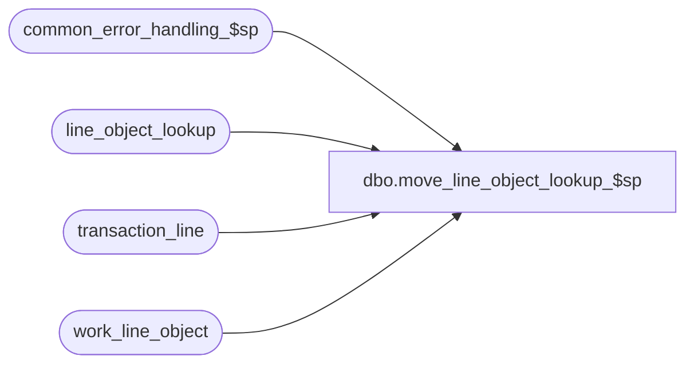

# dbo.move_line_object_lookup_$sp

**Database:** auditworks_external  
**Server:** bedrockdb01  

## Architecture Diagram



## Table Dependencies

| Referenced Table |
|---|
| common_error_handling_$sp |
| line_object_lookup |
| transaction_line |
| work_line_object |

## Stored Procedure Code

```sql
create proc [dbo].[move_line_object_lookup_$sp] 
@process_id	                binary(16),
@user_id                        int,
@from_store_no 		        int,
@move_flag			bit,  -- 0 = fix invalid reg, 1 = real move
@to_store_no 			int,
@errmsg				nvarchar(255) OUTPUT,
@function_no			tinyint

AS


/* 
PROCNAME: move_line_object_lookup_$sp
DESC: (MOVE) will lookup and reassign line_object based on line_object_lookup table.
 	  Called by move_register_$sp.

NOTE: This proc shares the temp table #move_temp from the calling proc.

Before saving this proc, run the create table #move_temp syntax:

CREATE TABLE #move_temp (
	transaction_id		numeric(14,0) not null, -- tran_id_datatype
	transaction_category	tinyint not null,
	old_sa_rejection_flag	bit default 0 not null,
	new_sa_rejection_flag	bit default 0 not null,
	new_if_rejection_flag	bit default 0 not null,
	new_exception_flag	bit default 0 not null,
	employee_no		int null,
	cashier_no		int not null,
	transaction_no		int not null)

  HISTORY:
Date     Name        Defect  Desc
Sep06,11 Vicci        129574 Don't randomly select a source line-object when multiple exist and attempting to reverse a theoretical edit lookup.
                             Perform lookup for new store regardless of whether or not a reversal fro the original store occurred.
Apr29,05 Paul        DV-1234 expand transaction_id to use tran_id_datatype
Sep17,04 Maryam      DV-1146 Change user_name to user_id.
Apr28,04 Maryam      DV-1071 Changed @process_id from int to binary(16). Receive @user_name and
                             pass both variables to common_error_handling_$sp.
Jan23,02 Daphna      1-AFR5T author
*/

DECLARE
	@errno				int,
	@message_id		     int,		
	@object_name			nvarchar(255),
	@operation_name			nvarchar(100),
	@process_name		     nvarchar(100)

SELECT @process_name = 'move_line_object_lookup_$sp',
       @message_id = 201068

DELETE work_line_object
 WHERE process_id = @process_id
SELECT @errno = @@error
IF @errno <> 0
BEGIN
  SELECT @errmsg = 'before insert',
         @operation_name = 'DELETE',
         @object_name = 'work_line_object'
  GOTO error       
END


INSERT work_line_object 
       (process_id, transaction_id, line_id, line_object)
SELECT @process_id, m.transaction_id, line_id, line_object
FROM #move_temp m, transaction_line l
WHERE m.transaction_id = l.transaction_id
SELECT @errno = @@error
IF @errno <> 0
BEGIN
  SELECT @errmsg = 'pre-move line_objects',
         @operation_name = 'INSERT',
         @object_name = 'work_line_object'
  GOTO error       
END

IF @from_store_no <> @to_store_no
BEGIN   
  -- reversal of line_object lookup 
  UPDATE work_line_object
     SET lookup_line_object = l.lookup_line_object
    FROM work_line_object t, line_object_lookup l
   WHERE store_no = @from_store_no
     AND t.line_object = l.line_object
     AND process_id = @process_id
     AND (SELECT COUNT(1)		--129574:  do not randomly select if more than one possibility exists
            FROM line_object_lookup l
           WHERE l.store_no = @from_store_no
             AND l.line_object = t.line_object) = 1
  SELECT @errno = @@error
  IF @errno <> 0
  BEGIN
    SELECT @errmsg = 'reverse lookup',
           @operation_name = 'UPDATE',
           @object_name = 'work_line_object'
    GOTO error       
  END  
     
END

-- lookup with to_store_no
UPDATE work_line_object
   SET new_line_object = l.line_object
  FROM work_line_object t, line_object_lookup l
 WHERE l.store_no = @to_store_no
   AND process_id = @process_id
   AND CASE WHEN t.lookup_line_object = 0 THEN t.line_object ELSE t.lookup_line_object END =  l.lookup_line_object  --even if no lookup was reversed, lookup for new store should be performed.
SELECT @errno = @@error
IF @errno <> 0
BEGIN
  SELECT @errmsg = 'set net line_object',
         @operation_name = 'UPDATE',
         @object_name = 'work_line_object'
  GOTO error      
END

-- delete where lookups will not change line_object
DELETE work_line_object
WHERE process_id = @process_id
  AND (new_line_object = 0
       OR line_object = new_line_object)
SELECT @errno = @@error
IF @errno <> 0
BEGIN
  SELECT @errmsg = 'no lookup values found OR line_object unchanged',
         @operation_name = 'DELETE',
         @object_name = 'work_line_object'
  GOTO error       
END
  
UPDATE transaction_line
   SET line_object = new_line_object
  FROM transaction_line l, work_line_object t
 WHERE l.transaction_id = t.transaction_id
   AND l.line_id = t.line_id
   AND l.line_object = t.line_object
   AND process_id = @process_id
SELECT @errno = @@error
IF @errno <> 0
BEGIN
  SELECT @errmsg = 'SET line_object = new_line_object',
         @operation_name = 'UPDATE',
         @object_name = 'transaction_line'
  GOTO error       
END

DELETE work_line_object
 WHERE process_id = @process_id
SELECT @errno = @@error
IF @errno <> 0
BEGIN
  SELECT @errmsg = 'cleanup',
         @operation_name = 'DELETE',
         @object_name = 'work_line_object'
  GOTO error       
END

   
RETURN

error:   /* Common error handler. */

	EXEC common_error_handling_$sp @function_no, @errno, @errmsg, 0, @message_id, 
	@process_name, @object_name, @operation_name, 0, 1, 0, null, 0, null, null, 
	null, null, null, null, 0, @process_id, @user_id
	
	RETURN
```

