# dbo.move_register_$sp

**Database:** auditworks_external  
**Server:** bedrockdb01  

## Architecture Diagram

```mermaid
flowchart LR
    SP["dbo.move_register_$sp"]
    Ex_Queue(["Ex_Queue"]) --> SP
    ORG_CHN_WRKSTN(["ORG_CHN_WRKSTN"]) --> SP
    ORG_CHN_WRKSTN_CNFG(["ORG_CHN_WRKSTN_CNFG"]) --> SP
    ORG_CHN_WRKSTN_CNFG_A(["ORG_CHN_WRKSTN_CNFG_A"]) --> SP
    archive_adjustment(["archive_adjustment"]) --> SP
    audit_status(["audit_status"]) --> SP
    auditworks_parameter(["auditworks_parameter"]) --> SP
    calculate_timestamp__sp(["calculate_timestamp_$sp"]) --> SP
    common_error_handling__sp(["common_error_handling_$sp"]) --> SP
    create_if_details_move__sp(["create_if_details_move_$sp"]) --> SP
    create_register_status__sp(["create_register_status_$sp"]) --> SP
    cust_liab_auto_compl_line(["cust_liab_auto_compl_line"]) --> SP
    cust_liability_edit__sp(["cust_liability_edit_$sp"]) --> SP
    exception_post__sp(["exception_post_$sp"]) --> SP
    exception_reason(["exception_reason"]) --> SP
    exception_rule(["exception_rule"]) --> SP
    function_status(["function_status"]) --> SP
    if_entry_datatype(["if_entry_datatype"]) --> SP
    if_rejection_reason(["if_rejection_reason"]) --> SP
    if_transaction_header(["if_transaction_header"]) --> SP
    interface_control(["interface_control"]) --> SP
    interface_directory(["interface_directory"]) --> SP
    interface_reject_move(["interface_reject_move"]) --> SP
    interface_status(["interface_status"]) --> SP
    line_object_action_association(["line_object_action_association"]) --> SP
    line_object_lookup(["line_object_lookup"]) --> SP
    move_audit_trail__sp(["move_audit_trail_$sp"]) --> SP
    move_authorization__sp(["move_authorization_$sp"]) --> SP
    move_interfaces__sp(["move_interfaces_$sp"]) --> SP
    move_line_object_lookup__sp(["move_line_object_lookup_$sp"]) --> SP
    move_merchandise__sp(["move_merchandise_$sp"]) --> SP
    move_reg_media_rec__sp(["move_reg_media_rec_$sp"]) --> SP
    move_rejection_reason(["move_rejection_reason"]) --> SP
    move_verify_emp_attribute__sp(["move_verify_emp_attribute_$sp"]) --> SP
    sa_rejection_reason(["sa_rejection_reason"]) --> SP
    tran_id_datatype(["tran_id_datatype"]) --> SP
    transaction_header(["transaction_header"]) --> SP
    transaction_line(["transaction_line"]) --> SP
    translate_error(["translate_error"]) --> SP
    update_if_reject_memo__sp(["update_if_reject_memo_$sp"]) --> SP
    verify_register__sp(["verify_register_$sp"]) --> SP
    verify_store_status__sp(["verify_store_status_$sp"]) --> SP
    work_control_interfaces(["work_control_interfaces"]) --> SP
    work_exceptions(["work_exceptions"]) --> SP
    work_if_header(["work_if_header"]) --> SP
    work_transaction_list(["work_transaction_list"]) --> SP
    work_transaction_move(["work_transaction_move"]) --> SP
```



## Table Dependencies

| Referenced Table |
|---|
| Ex_Queue |
| ORG_CHN_WRKSTN |
| ORG_CHN_WRKSTN_CNFG |
| ORG_CHN_WRKSTN_CNFG_A |
| archive_adjustment |
| audit_status |
| auditworks_parameter |
| calculate_timestamp_$sp |
| common_error_handling_$sp |
| create_if_details_move_$sp |
| create_register_status_$sp |
| cust_liab_auto_compl_line |
| cust_liability_edit_$sp |
| exception_post_$sp |
| exception_reason |
| exception_rule |
| function_status |
| if_entry_datatype |
| if_rejection_reason |
| if_transaction_header |
| interface_control |
| interface_directory |
| interface_reject_move |
| interface_status |
| line_object_action_association |
| line_object_lookup |
| move_audit_trail_$sp |
| move_authorization_$sp |
| move_interfaces_$sp |
| move_line_object_lookup_$sp |
| move_merchandise_$sp |
| move_reg_media_rec_$sp |
| move_rejection_reason |
| move_verify_emp_attribute_$sp |
| sa_rejection_reason |
| tran_id_datatype |
| transaction_header |
| transaction_line |
| translate_error |
| update_if_reject_memo_$sp |
| verify_register_$sp |
| verify_store_status_$sp |
| work_control_interfaces |
| work_exceptions |
| work_if_header |
| work_transaction_list |
| work_transaction_move |

## Stored Procedure Code

```sql
create proc dbo.move_register_$sp 
@process_id		binary(16),
@user_id		int,
@from_store_no		int,
@from_register_no	smallint,
@from_sales_date	smalldatetime,
@date_reject_id		tinyint, 
@from_transaction_no	int,
@to_store_no		int,
@to_register_no		smallint,
@to_sales_date		smalldatetime,
@to_transaction_no	int,
@move_flag		tinyint, /* 0 = fixing invalid register */
@store_flag		tinyint, /* 0 = 1 reg, 1 = multiple registers */
@errmsg			nvarchar(255) OUTPUT,
@frontend_populated	tinyint,
@transaction_series	nchar(1),
@to_till_no		smallint,
@to_cashier_no		int,
@function_no		tinyint,  -- 9 = Move, 109 = move to fix pos time
@function_status	tinyint = 0,
@rec_process_id		numeric(12,0),
@all_server_reg         tinyint

AS

/*
PROC NAME: move_register_$sp
     DESC: To move transactions from one store/reg/date to another.
           This function will use a temporary work table to capture 
           all transactions affected by the move.
           Called by move_store_$sp. 

HISTORY:
Date     Name       Defect# Desc
Aug17,12 Vicci       137407 Ensure validations run agains new cashier number (not old ones left in work_transaction_move.cashier_no to support move_audit_trail).
May16,12 Vicci       134811 Correct date in cust_liab_auto_compl_line too.
Sep06,11 Vicci       129574 If the move_line_object_lookup_$sp is to be called at all (debatable) then it needs to be be called if
                            either store involved in the move had line-object lookups defined (since the lookup of the source store may
                            require reversing even if no further lookups exist for the destination);  don't bother calling it if the 
                            from/to store hasn't changed or if it not a fix-invalid-store scenario since otherwise it won't do anything anyhow.
Jun28,10 Vicci       118310 Set the status_set_by_user_id to NULL if it is -1 (system/edit).
Mar12,09 Vicci       106158 Removed the erroneous "SELECT @txns_remaining = 0"; fixed code not to mark as 903=moved a 
                            audit status record that still has transactions left.
Feb25,09 Vicci     1-3ZI08Y Compensate for front-end defect:  UI is populating the employee_no field of work_transaction_move
                            with a zero instead of a NULL.
Feb20,09 Vicci       105395 Uplift 1-3YR5DH
Feb20,09 Vicci     1-3YR5DH The use of the date difference between from and to date in order to adjust the entry_datetime
                            is insufficient since prior moves without entry_datetime adjustment may have take place so use move_source_date.
May14,08 Vicci       101197 Pass @to_sales_date to move_verify_emp_attribute_$sp
Jan22,08 Paul         93924 Apply 96617 to SA5
May01,07 Phu        DV-1364 Apply 85598 to SA5.
Jan19,07 Tim        DV-1351 Apply 78843 to SA5
Jan18,07 Paul         81764 port 76394 to SA5. pass @store_flag to move_reg_media_rec proc.
Oct25,06 Phu          77931 Fix outer join for SQL 2005 Mode 90.
Mar15,06 Paul       DV-1331 apply 67999 to SA5
Sep06,05 Paul       DV-1312 apply 51057 to SA5
Aug15,05 Paul         58816 handle workstation without rows in ORG_CHN_WRKSTN_CNFG.
Jul04,05 Paul       DV-1239 use @rdbms_process_id to match dynamic sql
Apr28,05 Paul       DV-1234 expand transaction_id to use tran_id_datatype
Dec20,04 David      DV-1191 Use aliases to avoid ambiguous column name error.
Dec02,04 Paul       DV-1181 look at ACTV in exception_rule
Nov19,04 Maryam     DV-1167 Check the active flag for ORG_CHN_WRKSTN.
Oct28,04 Maryam     DV-1159 Handle the 4 values for RPRT_UNSD_WRKSTNS.
Sep17,04 Maryam     DV-1146 Change user name to user_id.
Jul29,04 David      DV-1071 Include rollforward logic, populate till_no
May27,04 Maryam     DV-1071 Receive @process_id, @user_id, @all_server_reg and pass it to the move_reg_media_rec_$sp.
Apr08,04 Sab	    DV-1068 Remove code for old customer liability and old media rec code
Jan11,08 Vicci        96617 Log translate error quantity properly.
Apr11,07 Phu          85598 Validate Employee Attribute I/F rejects.
Oct23.06 Daphna       78843 update function_status for @function_no only
Mar24,06 Daphna       52604 ensure if_transaction_header.till_no is populated 
Mar14,06 Daphna       67999 set completion_date_time = NULL in audit_status and store_audit_status
Apr08,05 David        51057 Properly set @register_poll_id, and missing/unused status.
Jan30,04 Winnie       22277 Correctly set front_end_populated when fixing invalid registers (move_flag = 0)
Nov10,03 Winnie       17882 Correctly set the audit_status to 906 when the move_flag = 1
Jul16,03 Paul       1-KX549 call new media rec, remove username from call to verify_store_status_$sp,
				update till_no and/or cashier_no
Feb04,03 Winnie        5843 Do not prevent moving if reversals generate i/f rejects, pass 
                            @allow_saving_if_rejects = 9 when calling cust_liability_edit for the from store.
Dec12,02 Winnie     1-G4RBY pass @move_flag when calling move_reg_media_rec_$sp
Oct29,02 Winnie	    1-FGESD When an invalid register is moved, the status should set to 906
Jul23,02 Paul       1-E7L7M populate entry_date_time in work_control_interfaces
Jun14,02 Winnie    1-DLBCZ Need to re-evaluate the exceptions_verified flag in audit_status after move.
Mar14,02 Henry	    1-A8XPT Zero out translate_error_qty, translate_error_verified in audit_status.
			    Reset transaction_date in translate_error for moved trxns.
			    Recalculate translate_error_qty and translate_error_verified as needed.
Feb13,02 Paul S     1-AZQ7X move line object lookup logic to function_status 2.
Jan30,02 David C    1-9DI2T Lay foundation for archive transaction modification.
JAN23,02 Daphna     1-AFR5T call proc move_line_object_lookup_$sp to lookup and reassign 
         line_objects where applicable
Jan02,02 David C    1-9XDW9 audit_status stays 8 if there is bad register and bad date
                             AND new error handling.
Aug29,01 Henry	    8607 To correct fixes to def 8460 and 8569, and for problems where 
			 store/reg/dates are getting verified when there are still audit concerns.
Sep17,01 Henry      8583 retrofit of 8607 to 2.46.25
Aug10,01 Maryam     8283 Populate memo fields in if_rejection_reason table,
                          add delete of interface_reject_move
Aug24,01 Paul       8569 call verify_register_$sp after calling move_reg_media_rec_$sp
Aug09,01 Henry	    8460 To calculate missing trxns properly when moving all trxns for a store/reg/date.
Aug03,01 David C  8462 Call cust_liability_edit_$sp for R3 customer liability
Aug02,01 Daphna  8420 remove unneccesary update to exception_flag in tran line and
                         tran header,  this is being done in exception_post_$sp
Jul18,01 Winnie	    8332 set the audit_status to Missing if no more transactions exist for the S/D/R. 
AUG09,01 Henry      8465 8460 RETROFIT version for 2.46.25
AUG06,01 Daphna 8468 8420 RETROFIT
JUL16,01 Winnie	    8284 7587 RETROFIT to 2.46.25 to support pre-coalition sites.
May28,01 Paul       8027 remove hold logic
May11,01 David C    7811 Add transaction_id to if_transaction_header
Apr20,01 David M   7587 Missing transactions by transaction Series version 1.0, removing
                           code for last_transaction_no.
Apr04,01 Phu        7501 Use system function to retrieve user name
Mar13,01 Winnie	    7305 reject transactions whose transaction number already exist for the same
			 store/register/date combination. 
Jan11,01 Shapoor    7209 Avoid deleting entries from media_reconciliation when the from
				 SRD has a date_reject_id > 0.
Jan09,01 DavidM     7096 Added 2 extra calls to verify_store_status_$sp.
			 One call added after END of IF @store_flag = 0 (moving one reg only).
			 The other call added before END of IF @move_flag = 1 .
Jul24,00 Maryam     6521 Properly move manually added transactions from S/R/D to the same
                             S/R with different date.
Jun08,00 Maryam     6244 pass 2 in call to verify_register_$sp.
Jun08,00 Vicci      6410 Replaced call to glc_$sp with call to Glc_$sp
Apr13,00 Daphna     6100 Refix: Ensure that amounts in store_audit_status FROM are 
                              cleared out when last remaining register 
Apr05,00 Louise     6163 To properly reverse (*-1) the tender total in transaction_header
                              in the correction out transaction (interface_control_flag=20)
Apr04,00 Daphna     6090 pass @date_reject_id in call to verify_store_status_$sp FROM
Mar14,00 Shapoor    5878 Update last_modified_date_time in if_transaction_header with current date/time.
Mar13,00 Daphna     6100 Ensure that media_rec deleted for register = 0 when moving last register.	  
Feb11,00 Daphna     5904 Allow change of entry_date_time when moving to fix incorrect POS date time
                              ensure FROM S-D status verified when moving last register
Jan01,00 Paul       5676 Insert directly to Ex_Queue instead of to if_interface_control
Oct01,99 Daphna     5299 Remove exec verify_store_status_$sp for TO, FROM s-d
                           delete from media_rec when no txns remaining in FROM s-r-d
                           exec media_rec(FROM s-r-d) if txns remaining in FROM s-r-d
                           exec media_rec(FROM s-r-d) if move only one reg, at least one reg 
                           remaining and bal-meth 2,4 OR bal-meth 1,3 and dep-bal-meth != bal-meth   
                      exec  media_rec(TO s-r-d) if move one reg only    
                         unlock TO and FROM s-d now done in move_store_$sp
                           delete function_status now done in move_store_$sp
         all calls to media_rec to pass function_no (9)
Sep17,99 Sab        5398 Prevent sa_rejects from feeding interfaces
Jun25,99 Daphna     4881 Pass @store_flag in call to move_reg_media_rec_$sp to avoid repetitive
               execution of move_count_cashier_$sp for bal_meth = 2 and move_count_store_$sp 
                               for bal_meth 4  
Apr07,99 Daphna     4425 Included edited_date in update on audit_status for TO store/date/reg
Apr01,99 Daphna     4421 Added call to media_reconciliation_$sp passing 'from' store/date/reg
          to ensure 'from' store/date gets unlocked  
Feb25,99 Paul S
Jan07,97 Seb V      Author

*/

DECLARE
 @audit_status			smallint,
 @audit_status1                 smallint,
 @tinyint_flag			tinyint,
 @date_reject_id_to		tinyint,
 @edit_timestamp		float,
 @edited_date			smalldatetime,
 @error_code			int,
 @errno				int,
 @exceptions_verified		tinyint,
 @exception_qty			smallint,
 @exception_qty_to		smallint,
 @if_reject_qty			smallint,
 @if_reject_qty_to		smallint,
 @if_entry_no			if_entry_datatype,
 @message_id			int,
 @object_name			nvarchar(255),
 @operation_name		nvarchar(100),
 @process_name			nvarchar(100),
 @rdbms_process_id		binary(16),
 @recovery_flag			tinyint,
 @reject_recur_tran		smallint,
 @reg_remaining			smallint,
 @register_function		smallint,
 @register_no			smallint,
 @rows				int,
 @sa_reject_qty			smallint,
 @sa_reject_qty_to		smallint,
 @status_reject_reason		tinyint,
 @store_audit_status		smallint,
 @store_no			int,
 @trans_count 			int,
 @transaction_date		smalldatetime,
 @translate_error_qty		smallint,
 @translate_error_verified	tinyint,
 @transaction_id		tran_id_datatype,
 @txns_remaining		smallint,
 @update_in_progress		smallint,
 @valid_qty			smallint,
 @valid_qty_to			smallint,
 @allow_saving_if_rejects 	tinyint

SELECT 	@tinyint_flag = 0,
	@date_reject_id_to = 0,
	@status_reject_reason = 0,
	@update_in_progress = 0,
	@exception_qty = 0,
	@if_reject_qty = 0,
	@sa_reject_qty = 0,
	@valid_qty = 0,
	@txns_remaining = 0,
	@process_name = 'move_register_$sp',
	@message_id = 201068,
	@translate_error_qty = 0,
	@allow_saving_if_rejects = 9,
	@trans_count = 0,
	@recovery_flag = 0,
	@rdbms_process_id = @@spid

--1-3ZI08Y
UPDATE work_transaction_move
   SET employee_no = NULL
  FROM transaction_header h
 WHERE work_transaction_move.employee_no = 0 
   AND work_transaction_move.transaction_id = h.transaction_id
   AND h.employee_no IS NULL
SELECT @errno = @@error
IF @errno != 0
BEGIN
  SELECT @errmsg = 'Failed to undo UI defect impact',
         @object_name = 'work_transaction_move',
         @operation_name = 'UPDATE'
  GOTO error
END

IF @function_status > 0 
BEGIN
  SELECT @recovery_flag = 1
  SELECT @txns_remaining = COUNT(transaction_id)
    FROM transaction_header
   WHERE store_no = @from_store_no
     AND register_no = @from_register_no
     AND transaction_date = @from_sales_date
     AND date_reject_id = @date_reject_id
  SELECT @errno = @@error
  IF @errno != 0
  BEGIN
    SELECT @errmsg = 'Failed to determine if any transactions remain for old store/reg/date in recovery mode',
           @object_name = 'transaction_header',
           @operation_name = 'SELECT'
    GOTO error
  END
END
/* Creation of all temp tables */
CREATE TABLE #move_temp (
	transaction_id		numeric(14,0) not null, -- tran_id_datatype
	transaction_category	tinyint not null,
	old_sa_rejection_flag	tinyint default 0 not null,
	new_sa_rejection_flag	tinyint default 0 not null,
	new_if_rejection_flag	tinyint default 0 not null,
	new_exception_flag	tinyint default 0 not null,
	employee_no		int null,
	cashier_no		int not null,
	till_no			smallint null,
	transaction_no		int not null,
	transaction_date	smalldatetime not null )

SELECT @errno = @@error
IF @errno != 0
BEGIN
  SELECT @errmsg = 'Failed to create temporary table #move_temp',
         @object_name = '#move_temp',
         @operation_name = 'CREATE'
  GOTO error
END


SELECT @reject_recur_tran = CONVERT(smallint, par_value)
  FROM auditworks_parameter WITH (NOLOCK)
 WHERE par_name = 'reject_recurring_trans_number'
           
SELECT @errno = @@error
IF @errno != 0
    BEGIN
      SELECT @errmsg = 'unable to select @reject_recur_tran from auditworks_parameter',
             @object_name = 'auditworks_parameter',
             @operation_name = 'SELECT'  
      GOTO error
    END 

IF @reject_recur_tran = 1 AND @function_status < 4
BEGIN
  CREATE TABLE #work_recurring_transaction (
 	store_no int NOT NULL,
	register_no smallint NOT NULL,
	transaction_date smalldatetime NOT NULL,
	transaction_no int NOT NULL,
	transaction_id numeric(14,0) not null) -- tran_id_datatype

 SELECT @errno = @@error
  IF @errno != 0
  BEGIN
    SELECT @errmsg = 'Failed to create temporary table #work_recurring_transaction',
           @object_name = '#work_recurring_transaction',
           @operation_name = 'CREATE'
    GOTO error
  END

  CREATE TABLE #work_min_transaction (
 	transaction_no int NOT NULL,
	transaction_id numeric(14,0) not null) -- tran_id_datatype

  SELECT @errno = @@error
  IF @errno != 0
  BEGIN
    SELECT @errmsg = 'Failed to create temporary table #work_min_transaction',
           @object_name = '#work_min_transaction',
           @operation_name = 'CREATE'
    GOTO error
  END
END -- IF @reject_recur_tran = 1


IF @from_transaction_no = -1 AND @frontend_populated = 1
  SELECT @from_transaction_no = 0

/* This section will insert all tran_id's to #move_temp */
IF @function_status < 4
BEGIN
  IF @from_transaction_no = -1 
  BEGIN
    INSERT #move_temp (
	  transaction_id,
	  transaction_category,
	  old_sa_rejection_flag,
	  new_sa_rejection_flag,
	  new_if_rejection_flag,
	  new_exception_flag,
	  employee_no,
	  cashier_no,
	  till_no,
	  transaction_no,
	  transaction_date)
    SELECT transaction_id,
	  transaction_category,
	  sa_rejection_flag,
	  0,
	  0,
	  0,
	  employee_no,
	  cashier_no,
	  till_no,
	  transaction_no,
	  transaction_date
     FROM transaction_header WITH (NOLOCK)
    WHERE transaction_date = @from_sales_date
      AND date_reject_id = @date_reject_id
      AND store_no = @from_store_no
      AND register_no = @from_register_no

   SELECT @errno = @@error
   IF @errno != 0
    BEGIN
	SELECT @errmsg = 'Failed to insert on #move_temp all transactions',
	       @object_name = '#move_temp',
	       @operation_name = 'INSERT'
	GOTO error
    END
  END
  ELSE /* @from_transaction_no <> -1 */
  BEGIN
    IF @frontend_populated <> 1
    BEGIN
      IF (@to_transaction_no >= @from_transaction_no)
      BEGIN
 	INSERT #move_temp (
		transaction_id,
		transaction_category,
		old_sa_rejection_flag,
		new_sa_rejection_flag,
		new_if_rejection_flag,
		new_exception_flag,
		employee_no,
		cashier_no,
		till_no,
		transaction_no,
		transaction_date)
        SELECT transaction_id,
		transaction_category,
		sa_rejection_flag,
		0,
		0,
		0,
		employee_no,
		cashier_no,
		till_no,
		transaction_no,
		transaction_date
	  FROM transaction_header WITH (NOLOCK)
	 WHERE transaction_date = @from_sales_date
	   AND date_reject_id = @date_reject_id
	   AND store_no = @from_store_no
	   AND register_no = @from_register_no
	   AND transaction_series = @transaction_series
	   AND transaction_no BETWEEN @from_transaction_no AND @to_transaction_no

	SELECT @errno = @@error
	IF @errno != 0
	BEGIN
	  SELECT @errmsg = 'Failed to insert on #move_temp all to > from',
	         @object_name = '#move_temp',
	         @operation_name = 'INSERT'
	  GOTO error
	END
      END
      ELSE  /* @to_transaction_no < @from_transaction_no */
      BEGIN
	INSERT #move_temp (
		transaction_id,
		transaction_category,
		old_sa_rejection_flag,
		new_sa_rejection_flag,
		new_if_rejection_flag,
		new_exception_flag,
		employee_no,
		cashier_no,
		till_no,
		transaction_no,
		transaction_date)
	SELECT transaction_id,
		transaction_category,
		sa_rejection_flag,
		0,
		0,
		0,
		employee_no,
		cashier_no,
		till_no,
		transaction_no,
		transaction_date
	  FROM transaction_header WITH (NOLOCK)
	 WHERE transaction_date = @from_sales_date
	   AND date_reject_id = @date_reject_id
	   AND store_no = @from_store_no
	   AND register_no = @from_register_no
	   AND transaction_series = @transaction_series
	   AND (transaction_no >= @from_transaction_no
	   OR transaction_no <= @to_transaction_no)

	SELECT @errno = @@error
	IF @errno != 0
	BEGIN
	  SELECT @errmsg = 'Failed to insert on #move_temp all to < from',
	         @object_name = '#move_temp',
	         @operation_name = 'INSERT'
	  GOTO error
	END
      END /* End of @to_transaction_no < @from_transaction_no */
    END /* End of @frontend_populated <> 1 */
    ELSE  /* @front_end_populated = 1 */
    BEGIN
      INSERT #move_temp (
		transaction_id,
		transaction_category,
		old_sa_rejection_flag,
		new_sa_rejection_flag,
		new_if_rejection_flag,
		new_exception_flag,
		employee_no,
		cashier_no,
		till_no,
		transaction_no,
		transaction_date)
        SELECT th.transaction_id,
		th.transaction_category,
		th.sa_rejection_flag,
		0,
		0,
		0,
		th.employee_no,
		wt.cashier_no,
		th.till_no,
		th.transaction_no,
		th.transaction_date
	  FROM transaction_header th WITH (NOLOCK), work_transaction_move wt WITH (NOLOCK)
	 WHERE process_id = @process_id
	   AND th.transaction_id = wt.transaction_id

	SELECT @errno = @@error
	IF @errno != 0
	BEGIN
	  SELECT @errmsg = 'Failed to insert on #move_temp all to < from',
	         @object_name = '#move_temp',
	         @operation_name = 'INSERT'
	  GOTO error
	END
    END /* End of @frontend_populated = 1 */
  END --IF @from_transaction_no = -1 
END 
ELSE -- @function_status >= 4   
BEGIN
  IF @from_transaction_no = -1 
  BEGIN
    INSERT #move_temp (
		transaction_id,
		transaction_category,
		old_sa_rejection_flag,
		new_sa_rejection_flag,
		new_if_rejection_flag,
		new_exception_flag,
		employee_no,
		cashier_no,
		till_no,
		transaction_no,
		transaction_date)
    SELECT transaction_id,
		transaction_category,
		sa_rejection_flag,
		0,
		0,
		0,
		employee_no,
		cashier_no,
		till_no,
		transaction_no,
		transaction_date
      FROM transaction_header WITH (NOLOCK)
     WHERE transaction_date = @to_sales_date
       AND date_reject_id = 0
       AND store_no = @to_store_no
       AND register_no = @to_register_no
       AND edit_progress_flag IN (9,109)

	SELECT @errno = @@error
	IF @errno != 0
	 BEGIN
		SELECT @errmsg = 'Failed to insert on #move_temp all transactions (recover).',
                       @object_name = '#move_temp',
                       @operation_name = 'INSERT'  
		GOTO error
	 END
  END
  ELSE -- @from_transaction_no <> -1 
  BEGIN
    IF @frontend_populated = 1 
    BEGIN
      INSERT #move_temp (
		transaction_id,
		transaction_category,
		old_sa_rejection_flag,
		new_sa_rejection_flag,
		new_if_rejection_flag,
		new_exception_flag,
		employee_no,
		cashier_no,
		till_no,
		transaction_no,
		transaction_date)
      SELECT th.transaction_id,
		th.transaction_category,
		th.sa_rejection_flag,
		0,
		0,
		0,
		th.employee_no,
		th.cashier_no,
		th.till_no,
		th.transaction_no,
		th.transaction_date
        FROM transaction_header th WITH (NOLOCK), work_transaction_move wt WITH (NOLOCK)
       WHERE wt.process_id = @process_id
         AND th.transaction_id = wt.transaction_id
         AND th.edit_progress_flag IN (9,109)

	SELECT @errno = @@error
	IF @errno != 0
	BEGIN
	  SELECT @errmsg = 'Failed to insert on #move_temp from work_transaction_move',
                 @object_name = '#move_temp',
                 @operation_name = 'INSERT'  
	  GOTO error
	END
    END 
    ELSE --@frontend_populated <> 1 
    BEGIN
      IF (@to_transaction_no >= @from_transaction_no)
      BEGIN
        INSERT #move_temp (
		  transaction_id,
		  transaction_category,
		  old_sa_rejection_flag,
		  new_sa_rejection_flag,
		  new_if_rejection_flag,
		  new_exception_flag,
		  employee_no,
		  cashier_no,
		  till_no,
		  transaction_no,
		  transaction_date)
        SELECT transaction_id,
		  transaction_category,
		  sa_rejection_flag,
		  0,
		  0,
		  0,
		  employee_no,
		  cashier_no,
		  till_no,
		  transaction_no,
		  transaction_date
          FROM transaction_header WITH (NOLOCK)
         WHERE transaction_date = @to_sales_date
           AND date_reject_id = 0
           AND store_no = @to_store_no
           AND register_no = @to_register_no
           AND edit_progress_flag IN (9,109)
           AND transaction_no BETWEEN @from_transaction_no AND @to_transaction_no

           SELECT @errno = @@error
           IF @errno != 0
           BEGIN
             SELECT @errmsg = 'Failed to insert on #move_temp all to > from',
                    @object_name = '#move_temp',
                    @operation_name = 'INSERT'  
             GOTO error
           END
      END 
      ELSE -- @to_transaction_no < @from_transaction_no
      BEGIN
        INSERT #move_temp (
		 transaction_id,
		 transaction_category,
		 old_sa_rejection_flag,
		 new_sa_rejection_flag,
		 new_if_rejection_flag,
		 new_exception_flag,
		 employee_no,
		 cashier_no,
		 till_no,
		 transaction_no,
		 transaction_date)
        SELECT transaction_id,
		 transaction_category,
		 sa_rejection_flag,
		 0,
		 0,
		 0,
		 employee_no,
		 cashier_no,
		 till_no,
		 transaction_no,
		 transaction_date
	    FROM transaction_header WITH (NOLOCK)
	   WHERE transaction_date = @to_sales_date
	     AND date_reject_id = 0
	     AND store_no = @to_store_no
             AND register_no = @to_register_no
	     AND edit_progress_flag IN (9,109)
	     AND (transaction_no >= @from_transaction_no
	     OR transaction_no <= @to_transaction_no)

	  SELECT @errno = @@error
	  IF @errno != 0
	   BEGIN
		SELECT @errmsg = 'Failed to insert on #move_temp all to < from',
                       @object_name = '#move_temp',
                       @operation_name = 'INSERT'  
		GOTO error
	   END
   END --IF @to_transaction_no >= @from_transaction_no
    END --IF @frontend_populated = 1 
 END --IF @from_transaction_no = -1 
END --IF @function_status < 4

--------------------------------------------------------------------------------------------------------------------
IF NOT EXISTS (SELECT 1 FROM #move_temp WITH (NOLOCK)) /* no tran to move */ AND @function_status < 6
BEGIN
  IF @move_flag = 0 /* fixing invalid reg */
  BEGIN

    BEGIN TRANSACTION

    UPDATE audit_status
       SET audit_status = 100
     WHERE store_no = @to_store_no
       AND sales_date = @to_sales_date
      AND date_reject_id = 0
       AND register_no = @to_register_no
       AND audit_status = 8  -- Invalid Reg
       AND valid_qty + sa_reject_qty = 0

    SELECT @errno = @@error,
	@rows = @@rowcount
    IF @errno != 0
    BEGIN
       SELECT @errmsg = 'Failed to update audit_status (to date)',
              @object_name = 'audit_status',
              @operation_name = 'UPDATE'
       GOTO error
    END

    IF @rows > 0  -- There were some Invalid Reg - 
    BEGIN
      EXEC verify_register_$sp @process_id, @user_id, @to_store_no, @to_register_no, @to_sales_date,
         0, @errmsg OUTPUT, 2	
 
      SELECT @errno = @@error
      IF @errno != 0
      BEGIN
         IF @errmsg IS NULL /* then */
           SELECT @errmsg = 'Failed to execute stored procedure verify_register_$sp (1)'
           
         SELECT @object_name = 'verify_register_$sp',
                @operation_name = 'EXECUTE'
         GOTO error
      END
    END /* @rows > 0 */  

    COMMIT TRANSACTION

  END /* @move_flag = 0 : fix_invalid_register */

  IF @move_flag = 1 
  BEGIN
      UPDATE audit_status
         SET audit_status = 906  -- for invalid register
       WHERE store_no = @from_store_no
         AND sales_date = @from_sales_date
         AND register_no = @from_register_no
         AND date_reject_id = @date_reject_id
         AND audit_status = 8
         
      SELECT @errno = @@error
      IF @errno != 0
       BEGIN
         SELECT @errmsg = 'Failed to set audit_status = 906',
                @object_name = 'audit_status',
                @operation_name = 'UPDATE'
         GOTO error
       END

      BEGIN
        UPDATE audit_status
           SET audit_status = 903
         WHERE store_no = @from_store_no
           AND sales_date = @from_sales_date
           AND register_no = @from_register_no
           AND date_reject_id = @date_reject_id
           AND audit_status <> 906
           AND valid_qty = 0		--ensure that it only goes to 903 if no transactions are left
           AND sa_reject_qty = 0
         SELECT @errno = @@error
         IF @errno != 0
         BEGIN
           SELECT @errmsg = 'Failed to set audit_status = 903',
                  @object_name = 'audit_status',
                  @operation_name = 'UPDATE'
           GOTO error
         END
       END

    EXEC verify_register_$sp @process_id, @user_id, @from_store_no, @from_register_no, @from_sales_date,
    			@date_reject_id, @errmsg OUTPUT, 1
 
     SELECT @errno = @@error
     IF @errno != 0
     BEGIN
       IF @errmsg IS NULL /* then */
         SELECT @errmsg = 'Failed to execute stored procedure verify_register_$sp (2)'
       
       SELECT @object_name = 'verify_register_$sp',
              @operation_name = 'EXECUTE'
       GOTO error
     END
  END -- IF @move_flag =1 
  /* Unlocking of TO and FROM stores done in move_store_$sp */
  /* Delete function_status done in move_store_$sp */
  
 RETURN  
END   /* no transactions to move */
--------------------------------------------------------------------------------------------------------------------

SELECT DISTINCT transaction_id
INTO #trans_id_temp
  FROM #move_temp WITH (NOLOCK)

SELECT @errno = @@error
IF @errno != 0
BEGIN
  SELECT @errmsg = 'Failed to insert into #trans_id_temp',
      @object_name = '#trans_id_temp',
         @operation_name = 'CREATE'
  GOTO error
END

DELETE FROM work_control_interfaces
 WHERE process_id = @process_id

SELECT @errno = @@error
IF @errno != 0
BEGIN
  SELECT @errmsg = 'Failed to delete work_control_interfaces',
         @object_name = 'work_control_interfaces',
         @operation_name = 'DELETE'
  GOTO error
END

IF @function_status < 4 OR @recovery_flag = 0
BEGIN
 EXEC calculate_timestamp_$sp @edit_timestamp OUTPUT

  SELECT @errno = @@error
  IF @errno != 0
   BEGIN
     SELECT @errmsg = 'Failed to execute stored procedure calculate_timestamp_$sp',
	@object_name = 'calculate_timestamp_$sp',
	@operation_name = 'EXECUTE'  	
     GOTO error
   END
END
ELSE
BEGIN
  SELECT @edit_timestamp = MAX(edit_timestamp)
    FROM transaction_header th WITH (NOLOCK), #trans_id_temp ti WITH (NOLOCK)
   WHERE th.transaction_id = ti.transaction_id

  SELECT @errno = @@error
  IF @errno != 0
  BEGIN
    SELECT @errmsg = 'Failed to select from transaction_header',
           @object_name = 'transaction_header',
           @operation_name = 'SELECT'  
    GOTO error
  END
END --IF @function_status < 4 

IF @frontend_populated <> 1 
BEGIN 
  DELETE FROM work_transaction_move
   WHERE process_id = @process_id

  SELECT @errno = @@error
  IF @errno != 0
  BEGIN
    SELECT @errmsg = 'Failed to delete on work_transaction_move',
           @object_name = 'work_transaction_move',
           @operation_name = 'DELETE' 
    GOTO error
  END

  INSERT work_transaction_move (
	process_id,
	transaction_id,
	from_store_flag,
	other_store_flag,
	employee_flag,
	employee_no,
	cashier_no,
	till_no,
	orig_sa_reject_flag,
	transaction_date )
  SELECT @process_id,
	transaction_id,
	0,
	0,
	0,
	employee_no,
	cashier_no,
	till_no,
	old_sa_rejection_flag,
	transaction_date
  FROM #move_temp WITH (NOLOCK)

  SELECT @errno = @@error
  IF @errno != 0
  BEGIN
    SELECT @errmsg = 'Failed to insert on work_transaction_move',
           @object_name = 'work_transaction_move',
           @operation_name = 'INSERT'
    GOTO error
  END
END /* FRONT END NOT POPULATED */

IF @function_status = 0
  SELECT @function_status = 1

/* Will reverse any transactions to the interface */
IF @function_status = 1
BEGIN
  SELECT ic.transaction_id,  
         interface_id,
         mt.old_sa_rejection_flag
    INTO #interface_temp
    FROM #move_temp mt WITH (NOLOCK), interface_control ic WITH (NOLOCK)
   WHERE mt.transaction_id = ic.transaction_id
     AND interface_status_flag = 1

  SELECT @errno = @@error, @rows = @@rowcount
  IF @errno != 0
  BEGIN
    SELECT @errmsg = 'Failed to insert INTO on #interface_temp',
           @object_name = '#interface_temp',
           @operation_name = 'CREATE'
    GOTO error
  END

  IF (@rows > 0)
  BEGIN

    IF EXISTS (SELECT 1 FROM #interface_temp WITH (NOLOCK))
    BEGIN
      SELECT DISTINCT transaction_id
        INTO #trans_id
        FROM #interface_temp WITH (NOLOCK)

      SELECT @errno = @@error
      IF @errno != 0
      BEGIN
  	SELECT @errmsg = 'Failed to insert on #trans_id reverse interface',
	       @object_name = '#trans_id',
	       @operation_name = 'CREATE'
	GOTO error
      END

      INSERT if_transaction_header (
	store_no,
	register_no,
	transaction_date,
	date_reject_id,
	transaction_series,
	transaction_no,
	entry_date_time,
	cashier_no,
	transaction_category,
	tender_total,
	transaction_void_flag,
	customer_info_exists,
	exception_flag,
	deposit_declaration_flag,
	closeout_flag,
	media_count_flag,
	customer_modified_flag,
	tax_override_flag,
	pos_tax_jurisdiction,
	edit_timestamp,
	employee_no,
	transaction_remark,
	source_process_no,
	last_modified_date_time,
	in_use_timestamp,
	updated_by_user_id,
        transaction_id,
        till_no )
      SELECT
	store_no,
	register_no,
	transaction_date,
	date_reject_id,
	transaction_series,
	transaction_no,
	entry_date_time,
	cashier_no,
	transaction_category,
	tender_total * -1,    --reversing the tender total on the corr.out 
	transaction_void_flag,
	customer_info_exists,
	exception_flag,
	deposit_declaration_flag,
	closeout_flag,
	media_count_flag,
	customer_modified_flag,
	tax_override_flag,
	pos_tax_jurisdiction,
	@edit_timestamp,
	employee_no,
	transaction_remark,
	@function_no,
	getdate(), --last_modified_date_time,
	in_use_timestamp,
	updated_by_user_id,
        th.transaction_id,
        till_no
     FROM #trans_id ti WITH (NOLOCK), transaction_header th WITH (NOLOCK)
     WHERE ti.transaction_id = th.transaction_id

      SELECT @errno = @@error
      IF @errno != 0
      BEGIN
	SELECT @errmsg = 'Failed to insert on if_transaction_header',
		@object_name = 'if_transaction_header',
		@operation_name = 'INSERT'
	GOTO error
      END

      DELETE FROM work_if_header
       WHERE process_id = @process_id

      SELECT @errno = @@error
      IF @errno != 0
      BEGIN
	SELECT @errmsg = 'Failed to delete from work_if_header',
		@object_name = 'work_if_header',
		@operation_name = 'DELETE'
	GOTO error
      END

      INSERT work_if_header (
	     process_id,
	     transaction_id,
	     if_entry_no,
	     effective_date,
	     entry_date_time)
      SELECT @process_id,
	     th.transaction_id,
	     if_entry_no,
	     th.transaction_date,
	     th.entry_date_time
	FROM #trans_id ti WITH (NOLOCK), transaction_header th WITH (NOLOCK), if_transaction_header ith WITH (NOLOCK)
    WHERE ti.transaction_id = th.transaction_id
	 AND th.store_no = ith.store_no
	 AND th.register_no = ith.register_no 
	 AND th.transaction_date = ith.transaction_date
	 AND th.transaction_no = ith.transaction_no
	 AND th.transaction_series = ith.transaction_series
	 AND th.entry_date_time = ith.entry_date_time
	 AND ith.edit_timestamp = @edit_timestamp

      SELECT @errno = @@error
      IF @errno != 0
      BEGIN
	SELECT @errmsg = 'Failed to insert on work_if_header',
		@object_name = 'work_if_header',
		@operation_name = 'INSERT'
	GOTO error
      END

      EXEC create_if_details_move_$sp @process_id, @user_id, -1, @errmsg OUTPUT

      SELECT @errno = @@error
      IF @errno != 0
      BEGIN
	IF @errmsg IS NULL /* then */
	  SELECT @errmsg = 'Failed to execute stored procedure create_if_details_move_$sp'
	SELECT @object_name = 'create_if_details_move_$sp',
	      @operation_name = 'EXECUTE'
	GOTO error
      END

 INSERT work_control_interfaces (
	   process_id,
	   type,
           entry_no,
	   interface_id,
	   interface_control_flag,
	   effective_date,
	   entry_date_time )
      SELECT @process_id,
	   'i',
	   if_entry_no,
	   it.interface_id,
	   20,
	   av_transaction_date,
	   wh.entry_date_time
      FROM #interface_temp it WITH (NOLOCK)
           INNER JOIN work_if_header wh WITH (NOLOCK) ON (it.transaction_id = wh.transaction_id)
           INNER JOIN interface_directory ifd WITH (NOLOCK) ON (it.interface_id = ifd.interface_id)
           LEFT JOIN archive_adjustment aa WITH (NOLOCK) ON (it.transaction_id = aa.adjustment_transaction_id)
     WHERE process_id = @process_id
	AND ( ifd.move_updates = 1 OR it.old_sa_rejection_flag = 1 )

      SELECT @errno = @@error
      IF @errno != 0
      BEGIN
	SELECT @errmsg = 'Failed to insert work_control_interfaces',
		@object_name = 'work_control_interfaces',
		@operation_name = 'INSERT'
	GOTO error
      END

     DELETE FROM work_if_header
      WHERE process_id = @process_id

    END /* End of interface posting - reversals */
  END /* Reversal's to interface END */

  BEGIN TRANSACTION

  INSERT Ex_Queue (
		queue_id, -- interface_id
    		key_1, --if_entry_no
		key_2, --interface_control_flag
		key_9, -- effective_date
		key_10, -- interface_posting_date
		key_11) -- entry_date_time
  SELECT interface_id,
	entry_no,
	interface_control_flag,
	ISNULL(effective_date, @from_sales_date),
	getdate(),
	entry_date_time
    FROM work_control_interfaces WITH (NOLOCK)
   WHERE process_id = @process_id
     AND type = 'i'

  SELECT @errno = @@error
  IF @errno != 0
   BEGIN
    SELECT @errmsg = 'Failed to insert Ex_Queue (status 2)',
	    @object_name = 'Ex_Queue',
	    @operation_name = 'INSERT'
     GOTO error
   END

  SELECT @function_status = 2

  UPDATE function_status
     SET status = @function_status
   WHERE process_id = @process_id
     AND user_id = @user_id
    AND function_no = @function_no


  SELECT @errno = @@error
  IF @errno != 0
  BEGIN
    SELECT @errmsg = 'Failed to set function_status = ' + CONVERT(nvarchar, @function_status),
	   @object_name = 'function_status',
	   @operation_name = 'UPDATE'
    GOTO error
  END

  COMMIT TRANSACTION

  DELETE FROM work_control_interfaces
   WHERE process_id = @process_id

  SELECT @errno = @@error
  IF @errno != 0
  BEGIN
    SELECT @errmsg = 'Failed to delete on work_control_interfaces',
	   @object_name = 'work_control_interfaces',
	   @operation_name = 'DELETE'
    GOTO error
  END

END --IF @function_status = 1


IF @function_status = 2
BEGIN
  /* R3 customer liability */  
  EXEC cust_liability_edit_$sp @process_id = @process_id,
 			     @current_user_id = @user_id,
                             @function_no = @function_no, 
                             @store_no = @from_store_no, 
               @transaction_date = @from_sales_date,
                 @allow_saving_if_rejects = @allow_saving_if_rejects,
                             @errmsg = @errmsg OUTPUT

  SELECT @errno = @@error
  IF @errno != 0
  BEGIN
    IF @errmsg IS NULL /* then */
      SELECT @errmsg = 'Failed to execute cust_liability_edit_$sp from'
    SELECT @object_name = 'cust_liability_edit_$sp',
           @operation_name = 'EXECUTE'
    GOTO error
  END

  /*  DEFECT 1-AFR5T/1-AZQ7X : LOOKUP AND REASSIGN LINE OBJECTS */
  IF EXISTS (SELECT 1 FROM line_object_lookup
              WHERE store_no =  @to_store_no OR store_no = @from_store_no)
     AND (@from_store_no <> @to_store_no OR @move_flag = 0)
  BEGIN
    EXEC move_line_object_lookup_$sp @process_id, @user_id, @from_store_no, @move_flag, @to_store_no, @errmsg OUTPUT,
                                 @function_no
    SELECT @errno = @@error
    IF @errno <> 0
    BEGIN
      SELECT @object_name = 'move_line_object_lookup_$sp',
             @operation_name = 'EXECUTE',
    @errmsg = 'to reassign line objects'
      GOTO error      
    END
  END

  SELECT @function_status = 3

  UPDATE function_status
     SET status = @function_status
   WHERE process_id = @process_id
     AND user_id = @user_id
     AND function_no = @function_no


  SELECT @errno = @@error
  IF @errno != 0
  BEGIN
    SELECT @errmsg = 'Failed to set function_status = ' + CONVERT(nvarchar, @function_status),
	   @object_name = 'function_status',
	   @operation_name = 'UPDATE'
    GOTO error
  END

END --IF @function_status = 2


IF @function_status = 3
BEGIN

  IF @reject_recur_tran =1
  BEGIN
    INSERT INTO #work_recurring_transaction
                  (store_no,
                   register_no,
                   transaction_date,
                   transaction_no,
                   transaction_id)
    SELECT DISTINCT @to_store_no,
                   @to_register_no,
             @to_sales_date,
                   wt.transaction_no,
                   wt.transaction_id
              FROM #move_temp wt WITH (NOLOCK), transaction_header th WITH (NOLOCK)
             WHERE th.store_no = @to_store_no
       AND th.register_no =@to_register_no
               AND th.transaction_date = @to_sales_date
             AND wt.transaction_no = th.transaction_no
               AND wt.transaction_id <> th.transaction_id

      SELECT @trans_count = @@rowcount,
     @errno = @@error
      IF @errno != 0
        BEGIN
          SELECT @errmsg = 'Failed to insert #work_recurring_transaction',
	         @object_name = '#work_recurring_transaction',
	         @operation_name = 'INSERT'
          GOTO error
        END
   
    INSERT INTO #work_min_transaction
        (transaction_no,
   	        transaction_id)
   	SELECT mt.transaction_no,
   	       MIN(mt.transaction_id)
   	  FROM #move_temp mt WITH (NOLOCK)
   	 WHERE mt.transaction_id NOT IN (SELECT transaction_id FROM #work_recurring_transaction WITH (NOLOCK))
      GROUP BY mt.transaction_no
        HAVING COUNT(mt.transaction_no) >1
    
    SELECT @errno = @@error
      IF @errno != 0
        BEGIN
          SELECT @errmsg = 'Failed to insert #work_min_transaction',
                 @object_name = '#work_min_transaction',
	         @operation_name = 'INSERT'
          GOTO error
        END

           INSERT INTO #work_recurring_transaction
                 (store_no,
                  register_no,
                  transaction_date,
                  transaction_no,
                  transaction_id)
           SELECT @to_store_no,
                  @to_register_no,
                  @to_sales_date,
                  mt.transaction_no,
                  mt.transaction_id
             FROM #move_temp mt WITH (NOLOCK), #work_min_transaction wt WITH (NOLOCK)
            WHERE mt.transaction_id <> wt.transaction_id
              AND mt.transaction_no = wt.transaction_no
                
     SELECT @trans_count = @trans_count+@@rowcount,
            @errno = @@error
     IF @errno != 0
     BEGIN
       SELECT @errmsg = 'Failed to insert work_recurring_transaction',
              @object_name = '#work_recurring_transaction',
              @operation_name = 'INSERT'
       GOTO error
     END         
  END --IF @reject_recur_tran =1

  BEGIN TRANSACTION

  /* { Def 1-A8XPT. Reset transaction_date in the translate_error table */
  UPDATE translate_error
     SET transaction_date = @to_sales_date
    FROM translate_error te, #trans_id_temp ti WITH (NOLOCK)
   WHERE te.transaction_id = ti.transaction_id
  SELECT @errno = @@error
  IF @errno != 0
  BEGIN
    SELECT @errmsg = 'Failed to SET destination date',
           @object_name = 'translate_error',
           @operation_name = 'UPDATE'
    GOTO error
  END
  /* } Def 1-A8XPT. */

  UPDATE cust_liab_auto_compl_line
     SET transaction_date = @to_sales_date
    FROM #trans_id_temp ti WITH (NOLOCK)
   WHERE cust_liab_auto_compl_line.transaction_id = ti.transaction_id
  SELECT @errno = @@error
  IF @errno != 0
  BEGIN
    SELECT @errmsg = 'Failed to correct date in cust_liab_auto_compl_line to be new destination date',
           @object_name = 'cust_liab_auto_compl_line',
           @operation_name = 'UPDATE'
    GOTO error
  END
  
  /* Reset S/A flags, insert new to move values */
  UPDATE transaction_header
     SET sa_rejection_flag = 0,
	if_rejection_flag = 0,
	exception_flag = 0,
	edit_timestamp = @edit_timestamp,
	store_no = @to_store_no,
	register_no = @to_register_no,
	date_reject_id = 0,
	transaction_date = @to_sales_date,
	move_source_date = CASE WHEN @function_no = 109 THEN move_source_date ELSE COALESCE(move_source_date, transaction_date) END, --	1-3YR5DH
	edit_progress_flag = 9,
	till_no = ISNULL(@to_till_no, till_no),
	cashier_no = ISNULL(@to_cashier_no, cashier_no)
    FROM #trans_id_temp ti WITH (NOLOCK), transaction_header th
   WHERE ti.transaction_id = th.transaction_id

  SELECT @errno = @@error
  IF @errno != 0
  BEGIN
    SELECT @errmsg = 'Failed to update on transaction_header',
           @object_name = 'transaction_header',
      @operation_name = 'UPDATE'
    GOTO error
  END

SELECT @txns_remaining = COUNT(transaction_id)
  FROM transaction_header
 WHERE store_no = @from_store_no
   AND register_no = @from_register_no
   AND transaction_date = @from_sales_date
   AND date_reject_id = @date_reject_id
SELECT @errno = @@error
IF @errno != 0
BEGIN
  SELECT @errmsg = 'Failed to determine if any transactions remain for old store/reg/date',
         @object_name = 'transaction_header',
         @operation_name = 'SELECT'
  GOTO error
END

IF @txns_remaining = 0 
BEGIN
  IF @date_reject_id = 0 OR NOT EXISTS (SELECT 1
                                          FROM audit_status
                                         WHERE store_no = @from_store_no
                   AND register_no = @from_register_no
                                           AND sales_date = @from_sales_date
                                           AND date_reject_id = 0
          AND audit_status > 5
                                           AND audit_status < 900)
  BEGIN
    UPDATE translate_error
       SET transaction_date = @to_sales_date
     WHERE store_no = @from_store_no
       AND register_no = @from_register_no
       AND transaction_date = @from_sales_date
    SELECT @errno = @@error
    IF @errno != 0
    BEGIN
      SELECT @errmsg = 'Failed to SET destination date for translate rejects not associated with specific transactions',
             @object_name = 'translate_error',
             @operation_name = 'UPDATE'
      GOTO error
    END
  END --no transactions left
END


IF @function_no = 109  -- Move to fix incorrect POS date time
BEGIN
    IF @from_sales_date != @to_sales_date  
    BEGIN
      UPDATE transaction_header
         SET entry_date_time = DATEADD(dd, DATEDIFF(dd, COALESCE(move_source_date, @from_sales_date), @to_sales_date), entry_date_time),
             edit_progress_flag = 109,
             move_source_date = NULL 
        FROM transaction_header th, #trans_id_temp ti WITH (NOLOCK)
       WHERE th.transaction_id = ti.transaction_id

      SELECT @errno = @@error
   IF @errno != 0
   BEGIN
        SELECT @errmsg = 'Failed to update on transaction_header: entry_date_time',
               @object_name = 'transaction_header',
               @operation_name = 'UPDATE'
        GOTO error
      END    
    END --@from_sales_date != @to_sales_date  
END --@function_no = 109

  DELETE sa_rejection_reason
    FROM #trans_id_temp ti WITH (NOLOCK), sa_rejection_reason sr
   WHERE sr.transaction_id = ti.transaction_id
  AND violated_sareject_rule IN (1,2,3,4,7,10,11,12,14)

  SELECT @errno = @@error
  IF @errno != 0
  BEGIN
    SELECT @errmsg = 'Failed to delete on sa_rejection_reason ',
           @object_name = 'sa_rejection_reason',
           @operation_name = 'DELETE'
    GOTO error
  END
 
  IF @trans_count > 0 
  BEGIN    
    INSERT INTO sa_rejection_reason
                (transaction_id,
                 line_id,
                 violated_sareject_rule)
    SELECT DISTINCT transaction_id,
                 0,
                 14
    FROM #work_recurring_transaction WITH (NOLOCK)

    SELECT @errno = @@error
    IF @errno != 0
   BEGIN
        SELECT @errmsg = 'Failed to insert on sa_rejection_reason',
	   @object_name = 'sa_rejection_reason',
	       @operation_name = 'INSERT'
  GOTO error
      END  	  
  END  -- IF @trans_count > 0                            
  
  UPDATE transaction_header
     SET sa_rejection_flag = 1
    FROM #trans_id_temp ti WITH (NOLOCK), sa_rejection_reason sa WITH (NOLOCK), transaction_header th
   WHERE ti.transaction_id = sa.transaction_id
     AND sa.transaction_id = th.transaction_id

  SELECT @errno = @@error
  IF @errno != 0
  BEGIN
    SELECT @errmsg = 'Failed to update on transaction_header sa_rejects',
           @object_name = 'transaction_header',
           @operation_name = 'UPDATE'
    GOTO error
  END

  SELECT @function_status = 4
  
  UPDATE function_status
 SET status = @function_status
   WHERE process_id = @process_id
     AND user_id = @user_id
     AND function_no = @function_no


  SELECT @errno = @@error
  IF @errno != 0
  BEGIN
    SELECT @errmsg = 'Failed to set function_status = ' + CONVERT(nvarchar, @function_status),
	   @object_name = 'function_status',
	   @operation_name = 'UPDATE'
    GOTO error
  END

  COMMIT TRANSACTION

END --IF @function_status = 3


IF @function_status = 4
BEGIN
  /* Will insert new interface values */
  DELETE FROM interface_reject_move
   WHERE process_id = @process_id

  SELECT @errno = @@error
  IF @errno != 0
  BEGIN
    SELECT @errmsg = 'Failed to delete on interface_reject_move',
           @object_name = 'interface_reject_move',
           @operation_name = 'DELETE'
    GOTO error
  END

  EXEC move_merchandise_$sp @process_id, @user_id, @to_store_no, @errmsg OUTPUT, @function_no, @to_cashier_no  --137407 Note:  also validates cashier/employee/etc
  SELECT @errno = @@error
  IF @errno != 0
  BEGIN
    IF @errmsg IS NULL /* then */
      SELECT @errmsg = 'Failed to execute stored procedure move_merchandise_$sp'

    SELECT @object_name = 'move_merchandise_$sp',
           @operation_name = 'EXECUTE'
    GOTO error
  END

  EXEC move_verify_emp_attribute_$sp @process_id, @user_id, @function_no, @to_sales_date, @to_cashier_no  --137407

  SELECT @errno = @@error
  IF @errno != 0
  BEGIN
    SELECT @errmsg = 'Failed to execute stored procedure move_verify_emp_attribute_$sp',
           @object_name = 'move_verify_emp_attribute_$sp',
           @operation_name = 'EXECUTE'
    GOTO error
  END

  EXEC move_authorization_$sp @process_id, @user_id, @errmsg OUTPUT, @function_no

  SELECT @errno = @@error
  IF @errno != 0
  BEGIN
    IF @errmsg IS NULL /* then */
      SELECT @errmsg = 'Failed to execute stored procedure move_authorization_$sp' 
    
    SELECT @object_name = 'move_authorization_$sp',
           @operation_name = 'EXECUTE'
    GOTO error
  END

  EXEC move_interfaces_$sp @process_id, @user_id, @to_store_no, @to_register_no, @to_sales_date, @errmsg OUTPUT,
                           @function_no

  SELECT @errno = @@error
  IF @errno != 0
  BEGIN
    IF @errmsg IS NULL /* then */
      SELECT @errmsg = 'Failed to execute stored procedure move_interfaces_$sp'
    
    SELECT @object_name = 'move_interfaces_$sp',
        @operation_name = 'EXECUTE'
    GOTO error
  END

  BEGIN TRANSACTION 

  DELETE if_rejection_reason
  FROM if_rejection_reason ir, #trans_id_temp tt WITH (NOLOCK)
   WHERE ir.transaction_id = tt.transaction_id

  SELECT @errno = @@error
  IF @errno != 0
  BEGIN
    SELECT @errmsg = 'Failed to delete on if_rejection_reason',
           @object_name = 'if_rejection_reason',
           @operation_name = 'DELETE'
    GOTO error
  END

  INSERT if_rejection_reason (
       transaction_id,
       line_id,
       if_reject_reason,
       memo1,
       memo2,
       memo3)
  SELECT transaction_id,
       line_id,
       if_reject_reason,
       memo1,
       memo2,
       memo3
    FROM move_rejection_reason WITH (NOLOCK)
   WHERE process_id = @process_id

  SELECT @errno = @@error
  IF @errno != 0
  BEGIN
    SELECT @errmsg = 'Failed to insert on if_rejection_reason',
           @object_name = 'if_rejection_reason',
           @operation_name = 'INSERT'
GOTO error
  END

  DELETE FROM interface_control
    FROM work_control_interfaces wc, interface_control ic
   WHERE process_id = @process_id
     AND entry_no = transaction_id
     AND type = 'c'

  SELECT @errno = @@error
  IF @errno != 0
  BEGIN
    SELECT @errmsg = 'Failed to delete on interface_control',
           @object_name = 'interface_control',
           @operation_name = 'DELETE'
    GOTO error
  END

  INSERT interface_control (
	transaction_id,
	interface_id,
	interface_status_flag)
  SELECT entry_no,
	interface_id,
	interface_control_flag
    FROM work_control_interfaces WITH (NOLOCK)
   WHERE process_id = @process_id
     AND type = 'c'

  SELECT @errno = @@error
  IF @errno != 0
  BEGIN
    SELECT @errmsg = 'Failed to insert on interface_control',
           @object_name = 'interface_control',
           @operation_name = 'INSERT'
    GOTO error
  END

  INSERT Ex_Queue (
	queue_id, -- interface_id
    	key_1, -- if_entry_no
	key_2, -- interface_control_flag
	key_9, -- effective_date
	key_10, -- interface_posting_date
	key_11) -- entry_date_time 
  SELECT interface_id,
	entry_no,
	interface_control_flag,
	ISNULL(effective_date, @to_sales_date),
	getdate(),
	entry_date_time
    FROM work_control_interfaces WITH (NOLOCK)
   WHERE process_id = @process_id
     AND type = 'i'

  SELECT @errno = @@error
  IF @errno != 0
  BEGIN
    SELECT @errmsg = 'Failed to insert on Ex_Queue (type i)',
           @object_name = 'Ex_Queue',
      @operation_name = 'INSERT'
    GOTO error
  END

  SELECT @function_status = 5
  
  UPDATE function_status
    SET status = @function_status
   WHERE process_id = @process_id
     AND user_id = @user_id
     AND function_no = @function_no


  SELECT @errno = @@error
  IF @errno != 0
  BEGIN
    SELECT @errmsg = 'Failed to set function_status = ' + CONVERT(nvarchar, @function_status),
	   @object_name = 'function_status',
	   @operation_name = 'UPDATE'
    GOTO error
  END

  COMMIT TRANSACTION

  DELETE FROM move_rejection_reason
   WHERE process_id = @process_id

  SELECT @errno = @@error
  IF @errno != 0
   BEGIN
	SELECT @errmsg = 'Failed to delete from move_rejection_reason',
               @object_name = 'move_rejection_reason',
               @operation_name = 'DELETE'   	
	GOTO error
   END

END --IF @function_status = 4


IF @function_status = 5
BEGIN
  /* R3 customer liability */  
  EXEC cust_liability_edit_$sp @process_id = @process_id,
  			     @current_user_id = @user_id,
                             @function_no = @function_no, 
                             @store_no = @to_store_no, 
                             @transaction_date = @to_sales_date,
                             @errmsg = @errmsg OUTPUT

  SELECT @errno = @@error
  IF @errno != 0
  BEGIN
 IF @errmsg IS NULL /* then */
      SELECT @errmsg = 'Failed to execute cust_liability_edit_$sp to'
      
    SELECT @object_name = 'cust_liability_edit_$sp',
     @operation_name = 'EXECUTE'
    GOTO error
  END

  --Needed by rec_manual_$sp 
  INSERT work_transaction_list (rec_process_id, transaction_id)
  SELECT @rec_process_id, transaction_id
    FROM #trans_id_temp WITH (NOLOCK)

  SELECT @errno = @@error
  IF @errno != 0
  BEGIN
    SELECT @errmsg = 'Failed to insert work_transaction_list',
	   @object_name = 'work_transaction_list',
	   @operation_name = 'INSERT'
    GOTO error
  END

  SELECT @function_status = 6
  
  UPDATE function_status
     SET status = @function_status
   WHERE process_id = @process_id
     AND user_id = @user_id
     AND function_no = @function_no


  SELECT @errno = @@error
  IF @errno != 0
  BEGIN
    SELECT @errmsg = 'Failed to set function_status = ' + CONVERT(nvarchar, @function_status),
	   @object_name = 'function_status',
	   @operation_name = 'UPDATE'
    GOTO error
  END

END --IF @function_status = 5


IF @function_status = 6
BEGIN

  UPDATE interface_status
     SET last_posting_datetime = getdate()
    FROM interface_directory id, interface_status st
   WHERE update_timing = 1
     AND st.interface_id = id.interface_id

  SELECT @errno = @@error
  IF @errno != 0
  BEGIN
    SELECT @errmsg = 'Failed to update interface_status',
           @object_name = 'interface_status',
           @operation_name = 'UPDATE'
    GOTO error
  END

  -- { Def 1-A8XPT. Check if need to recalculate the translate_error_qty for the SOURCE/DESTINATION.
  IF @txns_remaining > 0 AND (@date_reject_id = 0 OR NOT EXISTS (SELECT 1
                                                                 FROM audit_status
                                                                WHERE store_no = @from_store_no
                                                AND register_no = @from_register_no
                                                                  AND sales_date = @from_sales_date
                                                                  AND date_reject_id = 0
                                                                  AND audit_status > 5
                                                                  AND audit_status < 900) )
  BEGIN
    SELECT @translate_error_qty = COUNT(translate_error_id), 
         @translate_error_verified = IsNull(MIN(verified), 0)
    FROM translate_error
    WHERE store_no = @from_store_no
     AND register_no = @from_register_no
     AND transaction_date = @from_sales_date

    SELECT @errno = @@error
    IF @errno != 0
    BEGIN
     SELECT @errmsg = 'Failed to count remaining translate errors',
           @object_name = 'translate_error',
           @operation_name = 'SELECT'
     GOTO error
    END

    UPDATE audit_status
     SET translate_error_qty = @translate_error_qty,
         translate_error_verified = @translate_error_verified
     WHERE store_no = @from_store_no
     AND register_no = @from_register_no
     AND sales_date = @from_sales_date
     AND date_reject_id = @date_reject_id
     AND translate_error_qty <> @translate_error_qty

    SELECT @errno = @@error
    IF @errno != 0
    BEGIN
     SELECT @errmsg = 'Failed to SET translate_error_qty for SOURCE',
	   @object_name = 'audit_status',
  	   @operation_name = 'UPDATE'
     GOTO error
    END
  END --IF @txns_remaining > 0 AND @date_reject_id = 0 or no @date_reject_id = 0 exists

  SELECT @translate_error_qty = COUNT(translate_error_id), 
       @translate_error_verified = IsNull(MIN(verified), 0)
  FROM translate_error
  WHERE store_no = @to_store_no
   AND register_no = @to_register_no
   AND transaction_date = @to_sales_date

  SELECT @errno = @@error
  IF @errno != 0
  BEGIN
   SELECT @errmsg = 'Failed to count resulting translate reject in destination',
	 @object_name = 'translate_error',
	 @operation_name = 'SELECT'
   GOTO error
  END

  UPDATE audit_status
   SET translate_error_qty = @translate_error_qty,
       translate_error_verified = @translate_error_verified  
  WHERE store_no = @to_store_no
   AND register_no = @to_register_no
   AND sales_date = @to_sales_date
   AND date_reject_id = 0
   AND translate_error_qty <> @translate_error_qty

  SELECT @errno = @@error
  IF @errno != 0
  BEGIN
   SELECT @errmsg = 'Failed to SET translate_error_qty for DESTINATION',
	 @object_name = 'audit_status',
	 @operation_name = 'UPDATE'
   GOTO error
  END
  -- } Def 1-A8XPT.

  -- { Def 8607. Need to properly set audit_status before calling move_reg_media_rec_$sp.
  -- 	 Moved code to set audit_status here.
  IF @move_flag = 1
  BEGIN

    SELECT @audit_status = audit_status
      FROM audit_status
     WHERE store_no = @from_store_no
       AND register_no = @from_register_no
       AND sales_date = @from_sales_date
       AND date_reject_id = @date_reject_id

    IF @txns_remaining != 0 -- there remain transactions in the store-reg-date 
    BEGIN  
      IF @audit_status NOT IN (7,8)
        SELECT @audit_status = 100

      UPDATE audit_status
         SET audit_status = @audit_status
       WHERE store_no = @from_store_no
         AND register_no = @from_register_no
         AND sales_date = @from_sales_date
         AND date_reject_id = @date_reject_id

      SELECT @errno = @@error
      IF @errno != 0
      BEGIN
        SELECT @errmsg = 'Failed to update on audit_status = 100',
               @object_name = 'audit_status',
               @operation_name = 'UPDATE'
    GOTO error
      END
    END  -- there are transactions remaining in the store-reg-date
    ELSE  -- @txns_remaining = 0: there are no transactions remaining in the store-reg-date
    BEGIN
    --If status was invalid date, make status Moved invalid date
    --If status was invalid register, make status Moved invalid register
    --If status was invalid store, make status Moved invalid store
    --If there are any other registers with the same poll_id that have transactions OR have a status of Missing, make status Unused
    --If none of the above, make status Missing.
    --Note: if none of the registers with the same poll_id have any transactions, only 1 reg should have status of Missing, the rest should be Unused.

      IF @date_reject_id != 0 
        SELECT @audit_status = 903 -- Moved invalid date
      ELSE 
        IF @audit_status = 8
             SELECT @audit_status = 906 -- Moved invalid register
      ELSE
      BEGIN
  -- Values for rprt_unsd_wrkstns:
  -- 0: Do not log missing transactions. 
  -- 1: Log server-workstation as missing (if no trnx is polled for that loop), and workstations as unused. 
  -- 2: Log server-workstation and workstations as unused. 
  -- 3: Log server-workstation and workstations as missing.

        SELECT @audit_status1 = NULL
        SELECT @audit_status1 = CASE ISNULL(c.RPRT_UNSD_WRKSTNS,1)
                WHEN 1 THEN
                        CASE WHEN ISNULL(rg.PRNT_WRKSTN_ID, rg.WRKSTN_ID) = rg.WRKSTN_ID THEN 5
                                               ELSE 900
                                             END
                                           WHEN 2 THEN 900
                                           WHEN 3 THEN 5
                                           ELSE 903
       END
          FROM ORG_CHN_WRKSTN rg WITH (NOLOCK), 
               ORG_CHN_WRKSTN_CNFG_A ca WITH (NOLOCK), 
               ORG_CHN_WRKSTN_CNFG c WITH (NOLOCK)
         WHERE ORG_CHN_NUM = @from_store_no
           AND WRKSTN_NUM = @from_register_no
           AND rg.ACTV = 1
           AND ISNULL(rg.PRNT_WRKSTN_ID, rg.WRKSTN_ID)  = ca.WRKSTN_ID
           AND @from_sales_date >= ca.EFCTV_DATE
           AND (@from_sales_date < ca.EXPRTN_DATE OR ca.EXPRTN_DATE IS NULL)
           AND ca.WRKSTN_CNFG_CODE = c.WRKSTN_CNFG_CODE
           AND IsNull(c.TRAN_TRNSLT_VRSN_NUM,0) <> 0  -- exclude not live
           AND c.PLNG_FILE_NAME IS NOT NULL

        SELECT @errno = @@error
        IF @errno != 0
          BEGIN
	   SELECT @errmsg = 'Failed to set audit_status1 to missing or unused ',
	           @object_name = 'ORG_CHN_WRKSTN',
	           @operation_name = 'SELECT'
	    GOTO error
          END
                     
        IF  @audit_status = 7 
          SELECT @audit_status = 905 -- Moved invalid store
        ELSE
          SELECT @audit_status = ISNULL(@audit_status1,903)

      END -- else of if @date_reject_id != 0

 
      UPDATE audit_status
         SET audit_status = @audit_status, 
             status_set_by_user_id = CASE WHEN @user_id = -1 THEN NULL ELSE @user_id END,
             status_date = getdate(),
             opening_drawer_discrepancy = 0,
             short_by_tender_over_limit = 0,
             sa_reject_qty = 0,
             if_reject_qty = 0,
             missing_qty = 0,
    translate_error_qty = 0,
             translate_error_verified = 0,
             exception_qty = 0,
             duplicate_qty = 0,
             media_short = 0,
             valid_qty = 0,
             completion_date_time = NULL
       WHERE store_no = @from_store_no
         AND register_no = @from_register_no
         AND sales_date = @from_sales_date
         AND date_reject_id = @date_reject_id

      SELECT @errno = @@error
      IF @errno != 0
      BEGIN
	SELECT @errmsg = 'Failed to update on audit_status (903/905/906)',
	       @object_name = 'audit_status',
	       @operation_name = 'UPDATE'
	GOTO error
      END

    END -- no transactions remaining in store-reg-date
  END /* If @move_flag = 1 */


  -- } Def 8607.

  EXEC move_reg_media_rec_$sp @process_id, @user_id, @from_store_no, @from_register_no, @from_sales_date,
	@date_reject_id, @from_transaction_no, @to_store_no, @to_register_no,
	@to_sales_date, @to_transaction_no, @errmsg OUTPUT,
	@transaction_series, @frontend_populated,@store_flag,@function_no,
        @move_flag, @all_server_reg

  SELECT @errno = @@error
  IF @errno != 0
  BEGIN
    IF @errmsg IS NULL /* then */
      SELECT @errmsg = 'Failed to execute stored procedure move_reg_media_rec_$sp'
    
    SELECT @object_name = 'move_reg_media_rec_$sp',
           @operation_name = 'EXECUTE'
    GOTO error
  END

  SELECT @function_status = 7
  
  UPDATE function_status
     SET status = @function_status
   WHERE process_id = @process_id
     AND user_id = @user_id
     AND function_no = @function_no


  SELECT @errno = @@error
  IF @errno != 0
  BEGIN
    SELECT @errmsg = 'Failed to set function_status = ' + CONVERT(nvarchar, @function_status),
	   @object_name = 'function_status',
	   @operation_name = 'UPDATE'
    GOTO error
  END

END --IF @function_status = 6


IF @function_status = 7
BEGIN
  DELETE sa_rejection_reason
    FROM sa_rejection_reason sr, #trans_id_temp ti WITH (NOLOCK)
   WHERE sr.transaction_id = ti.transaction_id
     AND violated_sareject_rule >= 1
     AND violated_sareject_rule <= 4

  SELECT @errno = @@error
  IF @errno != 0
  BEGIN
    SELECT @errmsg = 'Failed to delete on sa_rejection_reason rule between 1 and 4',
           @object_name = 'sa_rejection_reason',
           @operation_name = 'DELETE' 
 GOTO error
  END

  DELETE sa_rejection_reason
    FROM sa_rejection_reason sr, #trans_id_temp ti WITH (NOLOCK)
   WHERE sr.transaction_id = ti.transaction_id
     AND violated_sareject_rule IN (7,10)

  SELECT @errno = @@error
  IF @errno != 0
  BEGIN
    SELECT @errmsg = 'Failed to delete on sa_rejection_reason rule=7',
           @object_name = 'sa_rejection_reason',
           @operation_name = 'DELETE' 
    GOTO error
  END

  DELETE exception_reason
    FROM #move_temp mt WITH (NOLOCK), exception_reason er
   WHERE er.transaction_id = mt.transaction_id

  SELECT @errno = @@error
  IF @errno != 0
  BEGIN
    SELECT @errmsg = 'Failed to delete on exception_reason',
           @object_name = 'exception_reason',
           @operation_name = 'DELETE' 
    GOTO error
  END

  INSERT exception_reason (
	transaction_id, line_id, violated_exception_rule, verified, exception_type )
  SELECT mt.transaction_id, line_id, exception_reason, 0, er.exception_type 
    FROM #move_temp mt WITH (NOLOCK), transaction_line tl WITH (NOLOCK), line_object_action_association lo, exception_rule er 
   WHERE mt.transaction_id = tl.transaction_id
     AND new_sa_rejection_flag = 0
     AND mt.transaction_category = lo.transaction_category
     AND tl.line_object = lo.line_object
     AND tl.line_action = lo.line_action
     AND lo.exception_reason IS NOT NULL --
     AND lo.exception_reason = er.exception_rule
     AND er.exception_type >= 1
     AND er.ACTV = 1 

  SELECT @errno = @@error
  IF @errno != 0
  BEGIN
    SELECT @errmsg = 'Failed to insert on exception_reason',
           @object_name = 'exception_reason',
           @operation_name = 'INSERT' 
    GOTO error
  END

  DELETE FROM work_exceptions 
   WHERE process_id = @rdbms_process_id

  SELECT @errno = @@error
  IF @errno != 0
  BEGIN
    SELECT @errmsg = 'Failed to DELETE work_exceptions',
           @object_name = 'work_exceptions',
           @operation_name = 'DELETE'
    GOTO error
  END

  INSERT work_exceptions (
	 process_id,
	 transaction_id)
  SELECT @rdbms_process_id,
	 transaction_id
    FROM #move_temp WITH (NOLOCK)

  SELECT @errno = @@error
  IF @errno != 0
  BEGIN
    SELECT @errmsg = 'Failed to INSERT work_exceptions',
           @object_name = 'work_exceptions',
           @operation_name = 'INSERT'
    GOTO error
  END

  EXEC exception_post_$sp @rdbms_process_id,@user_id,@errmsg OUTPUT

  SELECT @errno = @@error
  IF @errno != 0
  BEGIN
    IF @errmsg IS NULL /* then */
      SELECT @errmsg = 'Failed to execute stored procedure exception_post_$sp'
    SELECT @object_name = 'work_exceptions',
           @operation_name = 'INSERT' 

    GOTO error
  END

  DELETE FROM work_exceptions 
  WHERE process_id = @rdbms_process_id

  SELECT @errno = @@error
  IF @errno != 0
  BEGIN
    SELECT @errmsg = 'Failed to DELETE work_exceptions 2',
           @object_name = 'work_exceptions',
           @operation_name = 'DELETE' 
    GOTO error
  END

  SELECT tl.transaction_id,
	 line_id,
	 interface_rejection_flag = @tinyint_flag,
	 exception_flag = @tinyint_flag
    INTO #transaction_line
    FROM #trans_id_temp ti WITH (NOLOCK), transaction_line tl WITH (NOLOCK)
   WHERE ti.transaction_id = tl.transaction_id

  SELECT @errno = @@error
  IF @errno != 0
  BEGIN
    SELECT @errmsg = 'Failed to INSERT into #transaction_line',
           @object_name = '#transaction_line',
           @operation_name = 'CREATE' 
    GOTO error
  END

  UPDATE #transaction_line
     SET interface_rejection_flag = 1
    FROM #transaction_line ti, if_rejection_reason ir WITH (NOLOCK)
   WHERE ti.transaction_id = ir.transaction_id
     AND ti.line_id = ir.line_id

 SELECT @errno = @@error
  IF @errno != 0
  BEGIN
    SELECT @errmsg = 'Failed to UPDATE #transaction_line for if_reject',
           @object_name = '#transaction_line',
          @operation_name = 'UPDATE' 
    GOTO error
  END

  UPDATE #transaction_line
     SET exception_flag = 1
    FROM #transaction_line tl, exception_reason er WITH (NOLOCK)
   WHERE tl.transaction_id = er.transaction_id
     AND tl.line_id = er.line_id

  SELECT @errno = @@error
  IF @errno != 0
  BEGIN
    SELECT @errmsg = 'Failed to update on transaction_header exception_flag',
           @object_name = '#transaction_line',
           @operation_name = 'UPDATE' 
    GOTO error
  END

  UPDATE #move_temp
     SET new_sa_rejection_flag = 1
    FROM #move_temp mt, sa_rejection_reason sr WITH (NOLOCK)
   WHERE mt.transaction_id = sr.transaction_id

  SELECT @errno = @@error
  IF @errno != 0
  BEGIN
    SELECT @errmsg = 'Failed to update on #move_temp sa_rejections',
           @object_name = '#move_temp',
           @operation_name = 'UPDATE' 
    GOTO error
  END

  UPDATE #move_temp
    SET new_if_rejection_flag = 1
    FROM #move_temp mt, if_rejection_reason ir WITH (NOLOCK)
   WHERE mt.transaction_id = ir.transaction_id

  SELECT @errno = @@error
  IF @errno != 0
  BEGIN
    SELECT @errmsg = 'Failed to update on #move_temp if_rejections',
           @object_name = '#move_temp',
           @operation_name = 'UPDATE' 
    GOTO error
  END

  UPDATE #move_temp
     SET new_exception_flag = 1
  FROM #move_temp mt, exception_reason sr WITH (NOLOCK)
 WHERE mt.transaction_id = sr.transaction_id

  SELECT @errno = @@error
  IF @errno != 0
  BEGIN
    SELECT @errmsg = 'Failed to update on #move_temp exceptions',
           @object_name = '#move_temp',
       @operation_name = 'UPDATE' 
    GOTO error
  END

  BEGIN TRANSACTION

  UPDATE transaction_line
     SET interface_rejection_flag = tt.interface_rejection_flag,
	 exception_flag = tt.exception_flag
    FROM #transaction_line tt WITH (NOLOCK), transaction_line tl
   WHERE tt.transaction_id = tl.transaction_id
     AND tt.line_id = tl.line_id

  SELECT @errno = @@error
  IF @errno != 0
  BEGIN
    SELECT @errmsg = 'Failed to update on transaction_header exception_flag',
           @object_name = 'transaction_line',
           @operation_name = 'UPDATE' 
    GOTO error
  END

  UPDATE transaction_header
     SET sa_rejection_flag = new_sa_rejection_flag,
	 if_rejection_flag = new_if_rejection_flag,
	 exception_flag = new_exception_flag,
	 edit_progress_flag = 0
    FROM #move_temp mt WITH (NOLOCK), transaction_header th
   WHERE mt.transaction_id = th.transaction_id

  SELECT @errno = @@error
  IF @errno != 0
  BEGIN
    SELECT @errmsg = 'Failed to update on transaction_header flags',
           @object_name = 'transaction_header',
           @operation_name = 'UPDATE' 
    GOTO error
  END

  SELECT @function_status = 8
  
  UPDATE function_status
     SET status = @function_status
   WHERE process_id = @process_id
     AND user_id = @user_id
     AND function_no = @function_no

  SELECT @errno = @@error
  IF @errno != 0
  BEGIN
    SELECT @errmsg = 'Failed to set function_status = ' + CONVERT(nvarchar, @function_status),
	   @object_name = 'function_status',
	   @operation_name = 'UPDATE'
    GOTO error
  END
	
  COMMIT TRANSACTION
END --IF @function_status = 7


IF @function_status = 8
BEGIN

  IF (@move_flag = 1 AND @from_transaction_no > -1 )
  BEGIN
    SELECT @sa_reject_qty = ISNULL(SUM(CONVERT(tinyint,sa_rejection_flag)),0),
           @valid_qty = ISNULL(SUM(1 - CONVERT(tinyint,sa_rejection_flag)),0),
           @if_reject_qty = ISNULL(SUM(CONVERT(tinyint,if_rejection_flag)),0),
           @exception_qty = ISNULL(SUM(CONVERT(tinyint,exception_flag)),0)
      FROM transaction_header WITH (NOLOCK)
     WHERE transaction_date = @from_sales_date
       AND store_no = @from_store_no
       AND register_no = @from_register_no
      AND date_reject_id = @date_reject_id

    SELECT @errno = @@error
    IF @errno != 0
    BEGIN
      SELECT @errmsg = 'Failed to SELECT from transaction_header',
             @object_name = 'transaction_header',
             @operation_name = 'SELECT' 
      GOTO error
    END

    IF @date_reject_id > 0
      SELECT @valid_qty = 0

    IF @if_reject_qty > 0
    BEGIN -- do not count deferred if_rejects
      SELECT @if_reject_qty = COUNT(DISTINCT ir.transaction_id)
        FROM if_rejection_reason ir WITH (NOLOCK), transaction_header th WITH (NOLOCK)
       WHERE transaction_date = @from_sales_date
         AND store_no = @from_store_no
         AND register_no = @from_register_no
         AND date_reject_id = @date_reject_id
         AND th.if_rejection_flag = 1
         AND th.transaction_id = ir.transaction_id
         AND deferred = 0
    END --If i_if_reject_qty > 0
  END -- (@move_flag = 1 AND @from_transaction_no > -1 )

  --Calculate quantities for to_store
  SELECT @sa_reject_qty_to = ISNULL(SUM(CONVERT(tinyint,sa_rejection_flag)),0),
         @valid_qty_to = ISNULL(SUM(1 - CONVERT(tinyint,sa_rejection_flag)),0),
         @if_reject_qty_to = ISNULL(SUM(CONVERT(tinyint,if_rejection_flag)),0),
         @exception_qty_to = ISNULL(SUM(CONVERT(tinyint,exception_flag)),0)
  FROM transaction_header WITH (NOLOCK)
   WHERE transaction_date = @to_sales_date
     AND store_no = @to_store_no
     AND register_no = @to_register_no
     AND date_reject_id = 0

   SELECT @errno = @@error
   IF @errno != 0
   BEGIN
     SELECT @errmsg = 'Failed to SELECT @sa_reject_qty_to.',
              @object_name = 'transaction_header',
              @operation_name = 'SELECT' 
       GOTO error
   END

  IF @if_reject_qty_to > 0
  BEGIN -- do not count deferred if_rejects
    SELECT @if_reject_qty_to = COUNT(DISTINCT ir.transaction_id)
   FROM if_rejection_reason ir WITH (NOLOCK), transaction_header th WITH (NOLOCK)
     WHERE transaction_date = @to_sales_date
       AND store_no = @to_store_no
       AND register_no = @to_register_no
       AND date_reject_id = 0
       AND th.if_rejection_flag = 1
       AND th.transaction_id = ir.transaction_id
       AND deferred = 0

      SELECT @errno = @@error
      IF @errno != 0
        BEGIN
          SELECT @errmsg = 'Failed to SELECT @if_reject_qty_to.',
  @object_name = 'if_rejection_reason',
                 @operation_name = 'SELECT' 
          GOTO error
        END
  END --If i_if_reject_qty_to > 0

  -- { Def 8607. Moved part of the code to set audit_status, to just before calling move_reg_media_rec_$sp.
  IF @move_flag = 1
  BEGIN
    IF @txns_remaining != 0 -- there remain transactions in the store-reg-date 
    BEGIN  
      UPDATE audit_status
         SET status_date = getdate(),
             sa_reject_qty = @sa_reject_qty,
             if_reject_qty = @if_reject_qty,
             exception_qty = @exception_qty,
             valid_qty = @valid_qty
       WHERE store_no = @from_store_no
         AND register_no = @from_register_no
         AND sales_date = @from_sales_date
 AND date_reject_id = @date_reject_id

      SELECT @errno = @@error
      IF @errno != 0
      BEGIN
	SELECT @errmsg = 'Failed to update on audit_status for remaining audit concerns',
	    @object_name = 'audit_status',
	       @operation_name = 'UPDATE'
	GOTO error
      END
    
      EXEC verify_register_$sp @process_id, @user_id, @from_store_no, @from_register_no, @from_sales_date, @date_reject_id, @errmsg OUTPUT, 3

      SELECT @errno = @@error
      IF @errno != 0
      BEGIN
        IF (@errmsg IS NULL OR @errmsg = '')
          SELECT @errmsg = 'Failed to execute stored procedure verify_register_$sp'
        SELECT @object_name = 'verify_register_$sp',
		@operation_name = 'EXECUTE'
        GOTO error
      END
 END  -- there are transactions remaining in the store-reg-date
  END /* If @move_flag = 1 */

  -- } Def 8607.

  SELECT @edited_date = edited_date
    FROM audit_status
   WHERE store_no = @from_store_no
     AND register_no = @from_register_no
     AND sales_date = @from_sales_date
     AND date_reject_id = @date_reject_id

  UPDATE audit_status
     SET audit_status = 100,
	status_date = getdate(),
	valid_qty = @valid_qty_to,
	sa_reject_qty = @sa_reject_qty_to,
	if_reject_qty = @if_reject_qty_to,
	exception_qty = @exception_qty_to,
	edited_date = @edited_date
   WHERE store_no = @to_store_no
     AND register_no = @to_register_no
     AND sales_date = @to_sales_date
     AND date_reject_id = 0

  SELECT @errno = @@error, @rows = @@rowcount
  IF @errno != 0
  BEGIN
    SELECT @errmsg = 'Failed to update on audit_status (100)',
           @object_name = 'audit_status',
           @operation_name = 'UPDATE'
    GOTO error
  END

  IF @rows = 0
  BEGIN
    EXEC create_register_status_$sp @process_id, @user_id, @to_store_no, @to_register_no,
      @to_sales_date, 0, @date_reject_id_to OUTPUT, @status_reject_reason OUTPUT, 
      @errmsg OUTPUT, @function_no, 100, @valid_qty_to, @sa_reject_qty_to,
      @if_reject_qty_to, @exception_qty_to

    SELECT @errno = @@error
    IF @errno != 0
    BEGIN
      IF @errmsg IS NULL /* then */
        SELECT @errmsg = 'Failed to execute stored proc create_register_status_$sp'

      SELECT @object_name = 'create_register_status_$sp',
             @operation_name = 'EXECUTE'
      GOTO error
    END
    
    UPDATE audit_status
       SET edited_date = @edited_date
     WHERE store_no = @to_store_no
       AND register_no = @to_register_no
       AND sales_date = @to_sales_date
       AND date_reject_id = 0

    SELECT @errno = @@error, @rows = @@rowcount
    IF @errno != 0
    BEGIN
      SELECT @errmsg = 'Failed to update edited_date on audit_status',
             @object_name = 'audit_status',
             @operation_name = 'UPDATE'
      GOTO error
    END
  END --IF @rows = 0

  EXEC verify_store_status_$sp @process_id, NULL, @to_store_no, @to_sales_date, 0, @errmsg OUTPUT, 1

  SELECT @errno = @@error
  IF @errno != 0
  BEGIN
    IF @errmsg IS NULL /* then */
      SELECT @errmsg = 'Failed to execute stored procedure verify_store_status_$sp'
    SELECT @object_name = 'verify_store_status_$sp',
           @operation_name = 'EXECUTE'
    GOTO error
  END

  SELECT @function_status = 9
  
  UPDATE function_status
     SET status = @function_status
   WHERE process_id = @process_id
     AND user_id = @user_id
     AND function_no = @function_no

  SELECT @errno = @@error
  IF @errno != 0
  BEGIN
    SELECT @errmsg = 'Failed to set function_status = ' + CONVERT(nvarchar, @function_status),
	   @object_name = 'function_status',
	   @operation_name = 'UPDATE'
    GOTO error
  END

END --IF @function_status = 8


IF @function_status = 9
BEGIN
  EXEC update_if_reject_memo_$sp @process_id, @user_id, @to_store_no, @to_register_no, @to_sales_date,
				0, NULL, @errmsg = @errmsg OUTPUT
  SELECT @errno = @@error
  IF @errno != 0
  BEGIN
    IF @errmsg IS NULL /* then */ 
      SELECT @errmsg = 'Failed to execute stored procedure update_if_reject_memo_$sp'
    
    SELECT @object_name = 'update_if_reject_memo_$sp',
           @operation_name = 'EXECUTE'
 GOTO error
  END

  EXEC move_audit_trail_$sp 
	@from_store_no       = @from_store_no, 
	@from_register_no    = @from_register_no, 
	@from_sales_date     = @from_sales_date, 
	@from_transaction_no = @from_transaction_no, 
	@to_store_no         = @to_store_no, 
	@to_register_no      = @to_register_no, 
	@to_sales_date       = @to_sales_date, 
	@to_transaction_no   = @to_transaction_no, 
	@errmsg              = @errmsg OUTPUT, 
	@process_id          = @process_id, 
	@user_id            = @user_id, 
	@function_no         = @function_no
	
  SELECT @errno = @@error
  IF @errno != 0
  BEGIN
    IF @errmsg IS NULL /* then */
      SELECT @errmsg = 'Failed to execute stored procedure move_audit_trail_$sp'
    
    SELECT @object_name = 'move_audit_trail_$sp',
           @operation_name = 'EXECUTE'
    GOTO error
  END

  IF @store_flag != 0  -- moving all reg
  BEGIN
    UPDATE function_status
       SET status = 10
     WHERE process_id = @process_id
       AND user_id = @user_id
       AND function_no = @function_no
   
    SELECT @errno = @@error
    IF @errno != 0
    BEGIN
	SELECT @errmsg = 'Failed to update function_status (status = 10)',
	       @object_name = 'function_status',
	       @operation_name = 'UPDATE'
	GOTO error
    END
  END  --moving all reg

  SELECT verified_flag = CONVERT(tinyint,verified)
    INTO #exceptions
    FROM transaction_header th WITH (NOLOCK), 
         exception_reason er WITH (NOLOCK)
   WHERE th.transaction_date = @to_sales_date
     AND th.store_no         = @to_store_no
     AND th.register_no      = @to_register_no
     AND th.date_reject_id   = 0
     AND th.transaction_id   = er.transaction_id

  SELECT @errno = @@error
  IF @errno != 0
  BEGIN
    SELECT @errmsg = 'Failed to create table #exceptions',
           @object_name = '#exceptions',
           @operation_name = 'CREATE'
    GOTO error
  END

  SELECT @exceptions_verified = ISNULL(MIN(verified_flag),0)
    FROM #exceptions WITH (NOLOCK)

  SELECT @errno = @@error
  IF @errno != 0
  BEGIN
    SELECT @errmsg = 'Failed to select from #exceptions for to_store_no',
           @object_name = '#exceptions',
           @operation_name = 'SELECT'
    GOTO error
  END

  UPDATE audit_status
     SET exceptions_verified = @exceptions_verified
   WHERE sales_date     = @to_sales_date
     AND store_no       = @to_store_no
  AND register_no    = @to_register_no
     AND date_reject_id = 0

  SELECT @errno = @@error
  IF @errno != 0
  BEGIN
    SELECT @errmsg         = 'Failed to update audit_status (exceptions_verified) for to_store',
           @object_name    = 'audit_status',
           @operation_name = 'UPDATE'
    GOTO error
  END

  IF @from_transaction_no IN (0, -1)
  BEGIN
    TRUNCATE TABLE #exceptions

    SELECT @errno = @@error
    IF @errno != 0
    BEGIN
      SELECT @errmsg         = 'Failed to truncate table #exceptions',
             @object_name    = '#exceptions',
   @operation_name = 'TRUNCATE'
 GOTO error
    END

    INSERT #exceptions
         (verified_flag)
    SELECT CONVERT(tinyint,verified)
      FROM transaction_header th WITH (NOLOCK), 
           exception_reason er WITH (NOLOCK)
   WHERE th.transaction_date = @from_sales_date
       AND th.store_no        = @from_store_no
       AND th.register_no      = @from_register_no
       AND th.date_reject_id   = 0
       AND th.transaction_id   = er.transaction_id

    SELECT @errno = @@error
    IF @errno != 0
    BEGIN
      SELECT @errmsg = 'Failed to insert table #exceptions',
             @object_name = '#exceptions',
             @operation_name = 'INSERT'
      GOTO error
    END
 	  
    SELECT @exceptions_verified = ISNULL(MIN(verified_flag),0)
      FROM #exceptions WITH (NOLOCK)

    SELECT @errno = @@error
    IF @errno != 0
    BEGIN
      SELECT @errmsg = 'Failed to select from #exceptions for from_store_no',
             @object_name = '#exceptions',
             @operation_name = 'SELECT'
      GOTO error
    END

    UPDATE audit_status
       SET exceptions_verified = @exceptions_verified
     WHERE sales_date     = @from_sales_date
       AND store_no       = @from_store_no
       AND register_no    = @from_register_no
       AND date_reject_id = 0

    SELECT @errno = @@error
    IF @errno != 0
    BEGIN
      SELECT @errmsg         = 'Failed to update audit_status (exceptions_verified) for from_store',
 @object_name    = 'audit_status',
        @operation_name = 'UPDATE'
    GOTO error
    END
  END --IF @from_transaction_no IN (0, -1)

  DROP TABLE #exceptions
  SELECT @errno = @@error
  IF @errno != 0
  BEGIN
    SELECT @errmsg         = 'Failed to drop table #exceptions',
       @object_name    = '#exceptions',
           @operation_name = 'DROP'
    GOTO error
  END

  DELETE FROM work_control_interfaces
   WHERE process_id = @process_id

  SELECT @errno = @@error
  IF @errno != 0
  BEGIN
    SELECT @errmsg         = 'Failed to delete from work_control_interfaces',
           @object_name    = 'work_control_interfaces',
           @operation_name = 'DELETE'
    GOTO error
  END

  DELETE FROM work_transaction_move             
   WHERE process_id = @process_id

  SELECT @errno = @@error
  IF @errno != 0
  BEGIN
    SELECT @errmsg         = 'Failed to delete from work_transaction_move',
           @object_name    = 'work_transaction_move',    
           @operation_name = 'DELETE'
    GOTO error
  END

END --IF @function_status = 9


/*  unlocking TO and FROM store-date now done in move_store_$sp */
/*  delete from function status now done in move_store_$sp    */

RETURN

error:   /* Common error handler. */

      
	EXEC common_error_handling_$sp @function_no, @errno, @errmsg, 0, @message_id, 
	@process_name, @object_name, @operation_name, 0, 1, 0, null, 0, null, null, null,
	null, null, null, 0, @process_id, @user_id

	RETURN
```

