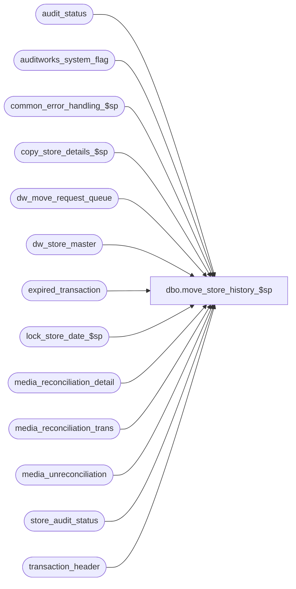

# dbo.move_store_history_$sp

**Database:** auditworks_external  
**Server:** bedrockdb01  

## Architecture Diagram



## Table Dependencies

| Referenced Table |
|---|
| audit_status |
| auditworks_system_flag |
| common_error_handling_$sp |
| copy_store_details_$sp |
| dw_move_request_queue |
| dw_store_master |
| expired_transaction |
| lock_store_date_$sp |
| media_reconciliation_detail |
| media_reconciliation_trans |
| media_unreconciliation |
| store_audit_status |
| transaction_header |

## Stored Procedure Code

```sql
create proc dbo.move_store_history_$sp 

AS

/* 
PROC NAME: move_store_history_$sp
     DESC: Scaleout back end job executes user requests to move a store to another Scaleout peripheral.
           Will move current transaction data, media rec data and some history data from current peripheral to
           a destination peripheral. Will move data for one store-transaction_date at a time, using a loop.
           The Edit and Dayend must not be processing the same store that is being moved, in order to maintain
           data integrity. 
  	  Called by Job Scheduler (susm) as a background job, one per peripheral db.

  HISTORY:
Date     Name            Def# Desc
Apr08,15 Paul        T-110734 author


*/


DECLARE
 @abort_flag             tinyint,
 @all_dates_locked       tinyint,
 @batch_no               int,
 @continue               tinyint,
 @copy_media_rec_detail  tinyint,
 @current_instance_id    int,
 @current_move_status    smallint,
 @cursor_open            tinyint,
 @date_reject_id         tinyint,
 @dates_populated        tinyint,
 @error_code             int,
 @errmsg                 nvarchar(2000),
 @errmsg2                nvarchar(2000),
 @errno                  int,
 @from_instance_id       smallint,
 @function_no            tinyint,
 @scaleout_flag          int,
 @message_id             int,
 @move_ended             datetime,
 @move_started           datetime,
 @move_status            smallint,
 @object_name            nvarchar(255),	
 @operation_name         nvarchar(100),
 @parent_request_id      numeric(12,0),
 @process_id             binary(16),
 @process_name           nvarchar(100),
 @request_date           datetime,
 @request_id             numeric(12,0),
 @rows                   int,
 @row_count              int, 	
 @store_no               int,
 @to_instance_id         smallint,
 @transaction_date       smalldatetime, 
 @user_id                int;

SET NOCOUNT ON;
 
SELECT 	@process_name = 'move_store_history_$sp',
        @message_id = 201068,
        @abort_flag = 0,
        @operation_name = 'SELECT',
        @function_no = 49,
        @process_id = newid(),
        @user_id = 0,
        @cursor_open = 0;

BEGIN TRY

CREATE TABLE #work_move_store_list (
  request_id             numeric(12,0) not null,
  from_store_no          int not null,
  date_reject_id         tinyint not null, 
  from_instance_id       smallint not null, 
  to_instance_id         smallint not null,
  move_status            smallint not null,
  request_date           date not null,
  user_id                int null);

/* Read instance_id of current peripheral */

    SELECT @errmsg = 'Failed to select instance_id from auditworks_system_flag',
           @object_name = 'auditworks_system_flag';
SELECT @current_instance_id = CONVERT(int,flag_numeric_value)
  FROM auditworks_system_flag
 WHERE flag_name = 'instance_id';
SELECT @rows = @@rowcount;

IF @rows = 0
  BEGIN
    SELECT @errmsg = 'Invalid setup. Missing instance_id.',
	   @object_name = 'auditworks_system_flag';
    GOTO business_error;
  END;
 
/* take a snapshot of the outstanding list of stores to be moved, looking only for the store level request rows that are not yet completed.
   This will also pick up any previously failed attempts. */

    SELECT @errmsg = 'Failed to insert #work_move_store_list',
           @object_name = '#work_move_store_list',
           @operation_name = 'INSERT'; 
INSERT INTO #work_move_store_list (request_id, from_store_no, date_reject_id, from_instance_id, to_instance_id, move_status, user_id)
SELECT DISTINCT request_id, from_store_no, date_reject_id, from_instance_id, to_instance_id, move_status, user_id
  FROM dw_move_request_queue
 WHERE move_status >= 1
   AND from_instance_id = @current_instance_id
   AND move_status < 70
   AND move_status NOT IN (15,19,30) -- exclude successful and tran move
   AND from_transaction_date IS NULL
   AND to_transaction_date IS NULL; -- exclude rows logged by tran move (invalid transactions)

SELECT @rows = @@rowcount;
IF @rows = 0
  RETURN;

CREATE TABLE #work_move_date_list (
  from_transaction_date  smalldatetime not null,
  date_reject_id         tinyint not null,
  request_id             numeric(12,0) not null);

    SELECT @errmsg = 'Failed to open move_store_date_crsr',
           @object_name = 'move_store_date_crsr',
           @operation_name = 'OPEN';  
DECLARE move_store_crsr CURSOR FAST_FORWARD
  FOR
    SELECT request_id, from_store_no, from_instance_id, to_instance_id, move_status, request_date, user_id
      FROM #work_move_store_list WITH (NOLOCK)
     ORDER BY request_id, from_store_no, from_instance_id; -- process requests in order in case of multiple requests for a store
     
OPEN move_store_crsr;

SELECT @cursor_open = 1,
       @continue = 1;

WHILE @continue = 1
  BEGIN
    FETCH move_store_crsr 
     INTO @request_id, @store_no, @from_instance_id, @to_instance_id, @move_status, @request_date, @user_id;
        		
    IF @@fetch_status <> 0  /* end of list or error on fetch */
      BREAK;

    SELECT @parent_request_id = @request_id;

    -- check whether any rows already exist for this request with from_transaction_date is not null (store-date level)
    SELECT @dates_populated = 0,
           @errmsg = 'Failed to select dates_populated',
           @object_name = 'dw_move_request_queue',
           @operation_name = 'SELECT';
    IF EXISTS(SELECT 1 FROM dw_move_request_queue WITH (NOLOCK)
              WHERE parent_request_id = @parent_request_id
                AND from_store_no = @store_no
                AND from_transaction_date IS NOT NULL
                AND to_transaction_date IS NULL) -- exclude move trans
      SELECT @dates_populated = 1;

    /* Check to see whether the move_status has changed since cursor opening, possibly due to a cancellation request */
      SELECT @errmsg = 'Failed to select current_move_status',
           @object_name = 'dw_move_request_queue';
    SELECT @current_move_status = move_status
      FROM dw_move_request_queue WITH (NOLOCK)
     WHERE request_id = @request_id -- parent_request_id
       AND from_store_no = @store_no
       AND from_transaction_date IS NULL -- store level
       AND to_transaction_date IS NULL; -- exclude move trans

    IF @current_move_status = 70 AND @dates_populated = 0
      CONTINUE; -- skip cancelled request

        SELECT @errmsg = 'Failed to set move_status = 2',
           @object_name = 'dw_move_request_queue',
           @operation_name = 'UPDATE';
    UPDATE dw_move_request_queue
      SET move_status = 2, -- attempting to lock store-dates
          last_processed_date = getdate()
    WHERE request_id = @request_id
      AND from_store_no = @store_no
      AND from_transaction_date IS NULL
      AND move_status = 1
      AND to_transaction_date IS NULL; -- exclude move trans

    /* set locking flags in order to stop any subsequent edit jobs from processing the store while the move is in progress */

       SELECT @errmsg = 'Failed to set scaleout_move_requested',
           @object_name = 'store_audit_status',
           @operation_name = 'UPDATE';
    UPDATE store_audit_status
      SET scaleout_move_requested = getdate()
      FROM store_audit_status st
     WHERE store_no = @store_no
       AND scaleout_move_requested IS NULL;

       SELECT @errmsg = 'Failed to set scaleout_move_requested',
           @object_name = 'dw_store_master',
           @operation_name = 'UPDATE';
    UPDATE dw_store_master
      SET scaleout_move_requested = getdate(),
          scaleout_move_request_instance = @current_instance_id
     WHERE store_no = @store_no
       AND scaleout_move_requested IS NULL;


    /* Now try to lock each store-date in a cursor, excluding those that may already be locked by process 49.
       If can't lock some, then will need to try again later.
       This locking will prevent auditors from working on this store while the move is in progress. */

      SELECT @all_dates_locked = 1,
           @errmsg = 'Failed to open move_store_lock_crsr',
           @object_name = 'move_store_lock_crsr',
           @operation_name = 'OPEN';
    DECLARE move_store_lock_crsr CURSOR FAST_FORWARD
    FOR
    SELECT sales_date, date_reject_id
      FROM store_audit_status WITH (NOLOCK)
     WHERE store_no = @store_no
       AND update_in_progress != 49
       AND store_audit_status NOT IN (5, 900)
       AND (store_audit_status < 400 OR store_audit_status > 900);

    OPEN move_store_lock_crsr;
    SELECT @cursor_open = 2;

    WHILE 2=2
    BEGIN
      FETCH move_store_lock_crsr
       INTO @transaction_date, @date_reject_id;

      IF @@fetch_status <> 0
        BREAK;

        SELECT @errmsg = 'Failed to lock store/date for TO store_no',
          @object_name = 'lock_store_date_$sp';				
      EXEC lock_store_date_$sp @process_id, @user_id, @store_no, @transaction_date, @date_reject_id, @function_no, @error_code OUTPUT;

      IF @error_code != 0
	BEGIN
	 SELECT @errno = @error_code, @message_id = @error_code,
	   @all_dates_locked = 0;
	END;

    END; -- While 2=2

    CLOSE move_store_lock_crsr;
    DEALLOCATE move_store_lock_crsr;
    SELECT @cursor_open = 1;

    IF @all_dates_locked = 0
      CONTINUE; -- Could not lock all dates, try next store request

      SELECT @move_started = getdate(),
           @errmsg = 'Failed to set move_status = 3',
           @object_name = 'dw_move_request_queue',
           @operation_name = 'UPDATE';
    UPDATE dw_move_request_queue
      SET move_status = 3, -- in progress
          last_processed_date = @move_started,
          move_started = @move_started
    WHERE request_id = @request_id
      AND from_store_no = @store_no
      AND from_transaction_date IS NULL -- store level
      AND move_status IN (1,2)
      AND to_transaction_date IS NULL; -- exclude move trans

    IF @dates_populated = 0
      BEGIN
         SELECT @errmsg = 'Failed to populate store-dates into dw_move_request_queue',
                @object_name = 'dw_move_request_queue',
                @operation_name = 'INSERT';
       INSERT INTO dw_move_request_queue (
          from_store_no, date_reject_id, to_store_no, request_date, from_instance_id, to_instance_id, move_status, all_trans_flag, parent_request_id, user_id)
       SELECT  @store_no, date_reject_id, @store_no,   @request_date, @from_instance_id, @to_instance_id, 1, 2, @parent_request_id, @user_id
         FROM store_audit_status
        WHERE store_no = @store_no
          AND store_audit_status NOT IN (900, 901); 
      END;


    /* Now copy history for each transaction_date for the store, starting with the latest transaction_date.
       Might need to use a temp table here to reduce cross-peripheral overhead when using cursor.
       Will copy all media_reconciliation_detail and media_reconciliation_status rows for the store when the first date is copied. */

    SELECT @copy_media_rec_detail = 1;

    TRUNCATE TABLE #work_move_date_list;

      SELECT @errmsg = 'Failed to insert #work_move_date_list',
           @object_name = '#work_move_date_list',
           @operation_name = 'INSERT';    
    INSERT INTO #work_move_date_list
    SELECT from_transaction_date, date_reject_id, request_id
      FROM dw_move_request_queue WITH (NOLOCK)
     WHERE parent_request_id = @parent_request_id
       AND from_store_no = @store_no
       AND move_status = 1
       AND move_status < 30 -- exclude successful
       AND from_transaction_date IS NOT NULL
       AND to_transaction_date IS NULL; -- exclude move trans

      SELECT @errmsg = 'Failed to open move_store_date_crsr',
           @object_name = 'move_store_date_crsr',
           @operation_name = 'OPEN';
    DECLARE move_store_date_crsr CURSOR FAST_FORWARD
    FOR
    SELECT from_transaction_date, date_reject_id, request_id
      FROM #work_move_date_list WITH (NOLOCK)
     ORDER BY from_transaction_date, date_reject_id, request_id DESC; -- process newest dates first

    OPEN move_store_date_crsr;
    SELECT @cursor_open = 3;

    WHILE 3=3
    BEGIN
      FETCH move_store_date_crsr
       INTO @transaction_date, @date_reject_id, @request_id;
        		
      IF @@fetch_status <> 0  /* end of list or error on fetch */
        BREAK;

        SELECT @errmsg = 'Failed to set move_status = 3',
           @object_name = 'dw_move_request_queue',
           @operation_name = 'UPDATE';
      UPDATE dw_move_request_queue
        SET move_status = 10, -- in progress
            last_processed_date = getdate()
      WHERE request_id = @request_id
        AND from_store_no = @store_no
        AND from_transaction_date = @transaction_date
        AND move_status IN (1,2,3)
        AND to_transaction_date IS NULL; -- exclude move trans

        SELECT @errmsg = 'Failed to exec copy_store_details_$sp',
           @object_name = 'copy_store_details_$sp',
           @operation_name = 'EXECUTE';
      EXECUTE copy_store_details_$sp @store_no, @transaction_date, @from_instance_id, @request_id, @copy_media_rec_detail, @to_instance_id, @store_no, null;

      SELECT @batch_no = MAX(batch_no)
        FROM expired_transaction WITH (NOLOCK);

      IF @batch_no IS NULL /* then */
        SELECT @batch_no = 0;

      SELECT @batch_no = @batch_no + 1, -- for expired transaction
             @errmsg = 'Unable to insert expired_transaction',
	          @object_name = 'expired_transaction',
	          @operation_name = 'INSERT';

       -- Since the copy was successful, flag transactions for later purging by dayend housekeeping
      INSERT expired_transaction (
   		   batch_no,
		   transaction_id,
		   dayend_process_id )
      SELECT @batch_no,
		   transaction_id,
		   1
        FROM transaction_header h WITH (NOLOCK)
       WHERE store_no = @store_no
         AND transaction_date = @transaction_date
         AND date_reject_id = @date_reject_id
         AND NOT EXISTS (SELECT 1 FROM expired_transaction e
                         WHERE e.transaction_id = h.transaction_id);

        SELECT @copy_media_rec_detail = 0,
           @errmsg = 'Failed to set move_status = 20',
           @object_name = 'dw_move_request_queue',
           @operation_name = 'UPDATE';
      UPDATE dw_move_request_queue
        SET move_status = 20,
            last_processed_date = getdate()
      WHERE request_id = @request_id
        AND from_store_no = @store_no
        AND from_transaction_date = @transaction_date
        AND move_status < 30 -- safety check
        AND from_transaction_date IS NOT NULL
        AND to_transaction_date IS NULL; -- exclude move trans

      /* Now remove media rec details from source db that have just been copied to destination db */

        SELECT @errmsg = 'Failed to delete from media_reconciliation_detail.',
 	     @object_name = 'media_reconciliation_detail',
	     @operation_name = 'DELETE';
      DELETE FROM media_reconciliation_detail
       WHERE transaction_date = @transaction_date
         AND store_no = @store_no;

        SELECT @errmsg = 'Failed to delete from media_unreconciliation.',
 	    @object_name = 'media_unreconciliation',
	    @operation_name = 'DELETE';
      DELETE FROM media_unreconciliation
       WHERE transaction_date = @transaction_date
         AND store_no = @store_no;

      SELECT @errmsg = 'Failed to delete from media_reconciliation_trans.',
 	   @object_name = 'media_reconciliation_trans',
	   @operation_name = 'DELETE';

      WHILE 5 = 5
      BEGIN
        DELETE TOP (80000) media_reconciliation_trans
         WHERE transaction_date = @transaction_date
           AND store_no = @store_no;

        SELECT @row_count = @@rowcount;

        IF @row_count < 80000
          BREAK;

      END; -- While 5=5

        SELECT @errmsg = 'Failed to delete from audit_status.',
 	     @object_name = 'audit_status',
	     @operation_name = 'DELETE';
      DELETE FROM audit_status
       WHERE sales_date = @transaction_date
         AND store_no = @store_no
         AND date_reject_id = @date_reject_id;

        SELECT @errmsg = 'Failed to delete from store_audit_status.',
 	     @object_name = 'store_audit_status',
	     @operation_name = 'DELETE';
      DELETE FROM store_audit_status
       WHERE sales_date = @transaction_date
         AND store_no = @store_no
         AND date_reject_id = @date_reject_id;

    END; -- While 3=3

    CLOSE move_store_date_crsr;
    DEALLOCATE move_store_date_crsr;
    SELECT @cursor_open = 1;

  

  /* Since all dates were successfully copied, then :
  
   delete media rec status
    
    reset ownership of the store to the destination instance_id */

        SELECT @errmsg = 'Failed to set instance_id in dw_store_master',
           @object_name = 'dw_store_master',
           @operation_name = 'UPDATE';
    UPDATE dw_store_master
      SET instance_id = @to_instance_id,
          scaleout_move_requested = NULL
    WHERE store_no = @store_no; -- exclude move trans

    /* Can now delete the store-date level request rows for the successful store */

        SELECT @errmsg = 'Failed to remove date detail rows for successfully moved store',
           @object_name = 'dw_move_request_queue',
           @operation_name = 'DELETE';
    DELETE FROM dw_move_request_queue
    WHERE request_id = @parent_request_id
      AND from_store_no = @store_no
      AND move_status = 30
      AND from_transaction_date IS NOT NULL
      AND to_transaction_date IS NULL; -- exclude move trans

        SELECT @move_ended = getdate(),
           @errmsg = 'Failed to set move_status = 30',
           @object_name = 'dw_move_request_queue',
           @operation_name = 'UPDATE';
    UPDATE dw_move_request_queue
      SET move_status = 30, -- successful
          last_processed_date = @move_ended,
          move_ended = @move_ended
    WHERE request_id = @parent_request_id
      AND from_store_no = @store_no
      AND from_transaction_date IS NULL -- store level
      AND to_transaction_date IS NULL; -- exclude move trans

    /* exit loop now so that susm loop will get control before the next move request is processed for another store */ 
    SELECT @continue = 0;

  END; -- While @continue = 1

  CLOSE move_store_crsr;
  DEALLOCATE move_store_crsr;

  SELECT @cursor_open = 0;


/* 

move_status values :
 2= attempting to lock store-dates on source db
 3= move in progress on source db
 8= move completed on source db
10= move in progress on destination db
14= media rec copy completed on destination db
15= available for edit processing on destination db
16= history copy in progress on destination db
19= edit is in progress on destination db
20= history copy completed on destination db 
30= move request is complete
70= move request was cancelled by the user 
71= move request could not be cancelled (not a status value in table, display when cancellation_requested = 2 and move_status != 70 ?)
80= move request was refused - duplicate request
81= move request was refused - request conflicts with a previous request
82= move request was refused - the source store was not found (already moved or deleted).
83= move request was refused - multiple stores share the same bank reconciliation. Would need to move all of those stores.
*/


DROP TABLE #work_move_store_list;
DROP TABLE #work_move_date_list;

RETURN;


business_error:   /* Business Rule handler. */

	SELECT @errmsg2 = @errmsg
	SET NOCOUNT OFF;	  

	EXEC common_error_handling_$sp @function_no, @errno, @errmsg, @abort_flag, @message_id, 
	@process_name, @object_name, @operation_name, 0, 1, 0, null, 0, null, null, null,
	  null, null, null, 0, @process_id, @user_id;

	RETURN;
END TRY

BEGIN CATCH;

        /* Common error handler. */

        SELECT @errno = ERROR_NUMBER(),
		@errmsg = COALESCE(@errmsg, ' ') + ':' + ERROR_MESSAGE();

	 /* this condition will only be true when raise error in trap above fires this general catch */
	IF @errmsg2 IS NOT NULL
	  SELECT @errmsg = @errmsg2;

	IF @cursor_open IN (1,2,3)
	BEGIN
	  CLOSE move_store_crsr;
	  DEALLOCATE move_store_crsr;
	END;

	IF @cursor_open = 2
	BEGIN
	  CLOSE move_store_lock_crsr;
	  DEALLOCATE move_store_lock_crsr;
	END;

	IF @cursor_open = 3
	BEGIN
	  CLOSE move_store_date_crsr;
	  DEALLOCATE move_store_date_crsr;
	END;

	EXEC common_error_handling_$sp @function_no, @errno, @errmsg, @abort_flag, @message_id, 
	@process_name, @object_name, @operation_name, 0, 1, 0, null, 0, null, null, null,
	  null, null, null, 0, @process_id, @user_id;

	RETURN;

END CATCH;
```

