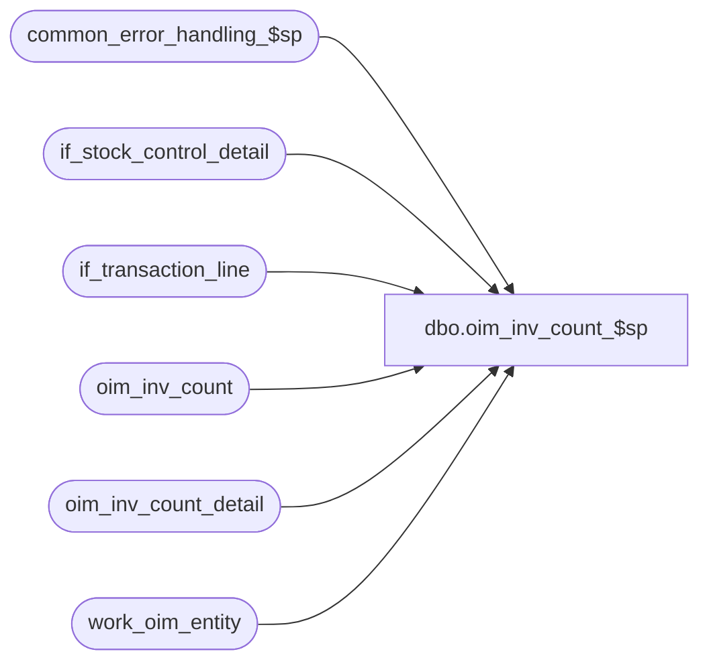

# dbo.oim_inv_count_$sp

**Database:** auditworks_external  
**Server:** bedrockdb01  

## Architecture Diagram



## Table Dependencies

| Referenced Table |
|---|
| common_error_handling_$sp |
| if_stock_control_detail |
| if_transaction_line |
| oim_inv_count |
| oim_inv_count_detail |
| work_oim_entity |

## Stored Procedure Code

```sql
create proc [dbo].[oim_inv_count_$sp] 

AS

/*
Proc name: oim_inv_count_$sp
     Desc: To post Inventory Count details.
           Called by mew_stock_export_$sp
 
HISTORY:
Date     Name             Defect  Desc
Sep08,05 ShuZ          1-34YHBK   Only allow line_sequence > 0 to be populated
Jan12,04 Phu              21459   Populate zone_label column
Oct02,03 Phu              15801   Initial development

*/

DECLARE
  @errmsg                       nvarchar(255),
  @errno                        int,
  @exit_loop                    tinyint,
  @message_id                   int,
  @object_name                  nvarchar(255),
  @operation_name               nvarchar(100),
  @process_name                 nvarchar(100),
  @process_no                   int,
  @rows                         int

SELECT @message_id = 201068,
       @process_name = 'oim_inv_count_$sp',
       @process_no = 209,
       @exit_loop = 0

WHILE @exit_loop = 0
BEGIN
  INSERT INTO oim_inv_count (
    oim_inv_count_id, inventory_control_no, location_id, line_id)
  SELECT
    transaction_id, reference_no, ISNULL(other_location_id, location_id), min_line_id
  FROM work_oim_entity
  WHERE entity_code = 120

  SELECT @errno = @@error
  IF @errno = 2601  -- duplicate error on insert
  BEGIN 
    DELETE oim_inv_count
    FROM oim_inv_count oim, work_oim_entity w
    WHERE w.entity_code = 120
    AND w.transaction_id = oim.oim_inv_count_id

    SELECT @errno = @@error
    IF @errno <> 0
    BEGIN
      SELECT @errmsg = 'Unable to delete duplicate key in oim_inv_count',
             @object_name = 'oim_inv_count',
             @operation_name = 'DELETE'
      GOTO error
    END

    DELETE oim_inv_count_detail
    FROM oim_inv_count_detail oim, work_oim_entity w
    WHERE w.entity_code = 120
    AND w.transaction_id = oim.oim_inv_count_id

    SELECT @errno = @@error
    IF @errno <> 0
    BEGIN
      SELECT @errmsg = 'Unable to delete duplicate key in oim_inv_count_detail',
             @object_name = 'oim_inv_count_detail',
             @operation_name = 'DELETE'
      GOTO error
    END
  END -- @errno = 2601 duplicate
  ELSE
  IF @errno <> 0
  BEGIN
    SELECT @errmsg = 'Unable to insert oim_inv_count',
           @object_name = 'oim_inv_count',
           @operation_name = 'INSERT'
    GOTO error
  END
  ELSE
    SELECT @exit_loop = 1
END -- while @exit_loop = 0

INSERT INTO oim_inv_count_detail (
  oim_inv_count_id, sku_id, zone_label, units_counted, line_id)
SELECT
  w.transaction_id, s.sku_id, SUBSTRING(l.reference_no, 1, 15), CONVERT(INT, s.units * l.voiding_reversal_flag), l.line_id
FROM work_oim_entity w, if_stock_control_detail s, if_transaction_line l
WHERE w.entity_code = 120
AND w.if_entry_no = s.if_entry_no
AND s.display_def_id = 36 -- item detail
AND s.if_entry_no = l.if_entry_no
AND s.line_id = l.line_id
AND l.line_void_flag = 0
AND l.line_sequence > 0

SELECT @errno = @@error
IF @errno <> 0
BEGIN
  SELECT @errmsg = 'Unable to insert into oim_inv_count_detail',
         @object_name = 'oim_inv_count_detail',
         @operation_name = 'INSERT'
  GOTO error
END


RETURN


error:

  EXEC common_error_handling_$sp @process_no, @errno, @errmsg, 0, @message_id, @process_name, @object_name, @operation_name, 1
  RETURN
```

