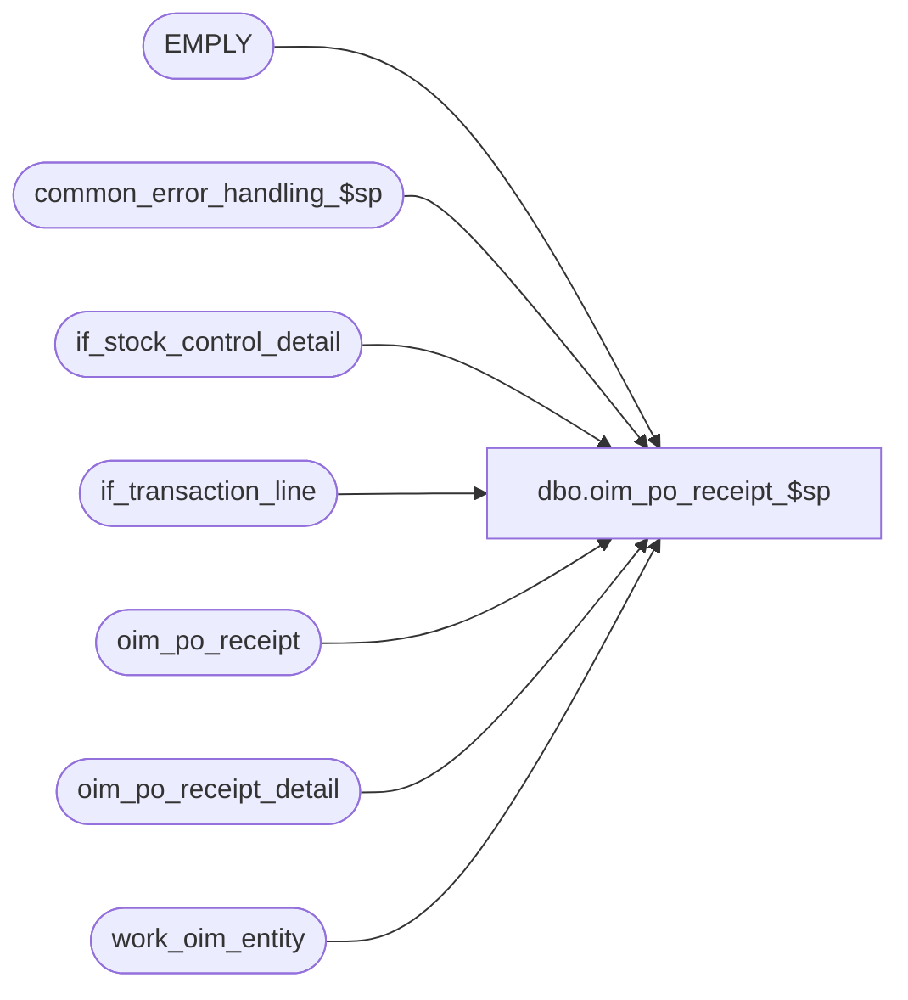

# dbo.oim_po_receipt_$sp

**Database:** auditworks_external  
**Server:** bedrockdb01  

## Architecture Diagram



## Table Dependencies

| Referenced Table |
|---|
| EMPLY |
| common_error_handling_$sp |
| if_stock_control_detail |
| if_transaction_line |
| oim_po_receipt |
| oim_po_receipt_detail |
| work_oim_entity |

## Stored Procedure Code

```sql
create proc [dbo].[oim_po_receipt_$sp] 

AS

/*
Proc name: oim_po_receipt_$sp
     Desc: To post Purchase Order Receipt details.
           Called by mew_stock_export_$sp
 
HISTORY:
Date     Name             Defect  Desc
Oct25,06 Phu              77931   Fix outer join for SQL 2005 Mode 90.
Sep21,06 Paul             76719   apply 75320,1-34YHBK to SA5
Apr28.04 Brett C        DV-1071   change employee table to EMPLY
Sep21,06 Paul             75320   avoid possible concat null problem
Sep08,05 ShuZ          1-34YHBK   Only allow line_sequence > 0 to be populated
Sep09,03 Phu              15801   Initial development

*/

DECLARE
  @errmsg                       nvarchar(255),
  @errno                        int,
  @exit_loop                    tinyint,
  @message_id                   int,
  @object_name                  nvarchar(255),
  @operation_name               nvarchar(100),
  @process_name                 nvarchar(100),
  @process_no                   int,
  @rows                         int

SELECT @message_id = 201068,
       @process_name = 'oim_po_receipt_$sp',
       @process_no = 209,
       @exit_loop = 0

WHILE @exit_loop = 0
BEGIN
  INSERT INTO oim_po_receipt (
    oim_po_receipt_id, document_no, po_no, advance_shipping_notice_no,
    location_id, receive_date, performed_by, weight,
    unit_weight_code, no_of_containers, container_type_code, carrier_code,
    pro_bill_no, freight_amount, document_source, line_id)
  SELECT
    w.transaction_id, w.reference_no, w.pos_identifier, w.imrd,
    w.location_id, ISNULL(w.count_date, w.transaction_date), convert(nvarchar, w.cashier_no)
    + ' ' + ISNULL(LTRIM(e.FRST_NAME + ' ' + e.LAST_NAME),' '), null,
    null, null, null, null,
    null, null, 8, w.min_line_id
  FROM work_oim_entity w LEFT JOIN EMPLY e ON (w.cashier_no = e.EMPLY_NUM)
  WHERE w.entity_code = 10

  SELECT @errno = @@error
  IF @errno = 2601  -- duplicate error on insert
  BEGIN 
    DELETE oim_po_receipt
    FROM oim_po_receipt oim, work_oim_entity w
    WHERE w.entity_code = 10
    AND w.transaction_id = oim.oim_po_receipt_id

    SELECT @errno = @@error
    IF @errno <> 0
    BEGIN
      SELECT @errmsg = 'Unable to delete duplicate key in oim_po_receipt',
             @object_name = 'oim_po_receipt',
             @operation_name = 'DELETE'
      GOTO error
    END

    DELETE oim_po_receipt_detail
    FROM oim_po_receipt_detail oim, work_oim_entity w
    WHERE w.entity_code = 10
    AND w.transaction_id = oim.oim_po_receipt_id

    SELECT @errno = @@error
    IF @errno <> 0
    BEGIN
      SELECT @errmsg = 'Unable to delete duplicate key in oim_po_receipt_detail',
             @object_name = 'oim_po_receipt_detail',
             @operation_name = 'DELETE'
      GOTO error
    END
  END -- @errno = 2601 duplicate
  ELSE
  IF @errno <> 0
  BEGIN
    SELECT @errmsg = 'Unable to insert oim_po_receipt',
           @object_name = 'oim_po_receipt',
           @operation_name = 'INSERT'
    GOTO error
  END
  ELSE
    SELECT @exit_loop = 1
END -- while @exit_loop = 0

UPDATE oim_po_receipt
SET no_of_containers = s.location_no,
    container_type_code = convert(nvarchar, SIGN(2 - ABS(SIGN(s.location_no)))), 
    weight = s.units,
    unit_weight_code = SUBSTRING(s.imrd, 1, 10),
    carrier_code = SUBSTRING(s.reason, 1, 4), 
    pro_bill_no = SUBSTRING(s.vendor_no, 1, 30),
    freight_amount = l.gross_line_amount * l.voiding_reversal_flag
FROM oim_po_receipt oim, work_oim_entity w, if_stock_control_detail s, if_transaction_line l
WHERE w.entity_code = 10
AND w.if_entry_no = s.if_entry_no
AND s.display_def_id = 37 -- shipment info
AND s.if_entry_no = l.if_entry_no
AND s.line_id = l.line_id
AND l.line_void_flag = 0
AND l.line_sequence > 0
AND w.transaction_id = oim.oim_po_receipt_id

SELECT @errno = @@error
IF @errno <> 0
BEGIN
  SELECT @errmsg = 'Unable to update oim_po_receipt',
         @object_name = 'oim_po_receipt',
         @operation_name = 'UPDATE'
  GOTO error
END

INSERT INTO oim_po_receipt_detail (
  oim_po_receipt_id, sku_id, carton_no, units_received,
  units_damaged, line_id)
SELECT
  w.transaction_id, s.sku_id, l.reference_no, SUM((1-ISNULL(SIGN(w.location_no), 0)) * CONVERT(INT, s.units * l.voiding_reversal_flag)),
  SUM(ISNULL(SIGN(w.location_no), 0) * CONVERT(INT, s.units * l.voiding_reversal_flag)), MIN(l.line_id)
FROM work_oim_entity w, if_stock_control_detail s, if_transaction_line l
WHERE w.entity_code = 10
AND w.if_entry_no = s.if_entry_no
AND s.display_def_id = 36 -- item detail
AND s.if_entry_no = l.if_entry_no
AND s.line_id = l.line_id
AND l.line_void_flag = 0
AND l.line_sequence > 0
GROUP BY w.transaction_id, s.sku_id, l.reference_no
HAVING SUM((1-ISNULL(SIGN(w.location_no), 0)) * CONVERT(INT, s.units * l.voiding_reversal_flag)) <> 0
OR SUM(ISNULL(SIGN(w.location_no), 0) * CONVERT(INT, s.units * l.voiding_reversal_flag)) <> 0

SELECT @errno = @@error
IF @errno <> 0
BEGIN
  SELECT @errmsg = 'Unable to insert oim_po_receipt_detail',
         @object_name = 'oim_po_receipt_detail',
         @operation_name = 'INSERT'
  GOTO error
END


RETURN


error:

  EXEC common_error_handling_$sp @process_no, @errno, @errmsg, 0, @message_id, @process_name, @object_name, @operation_name, 1
  RETURN
```

