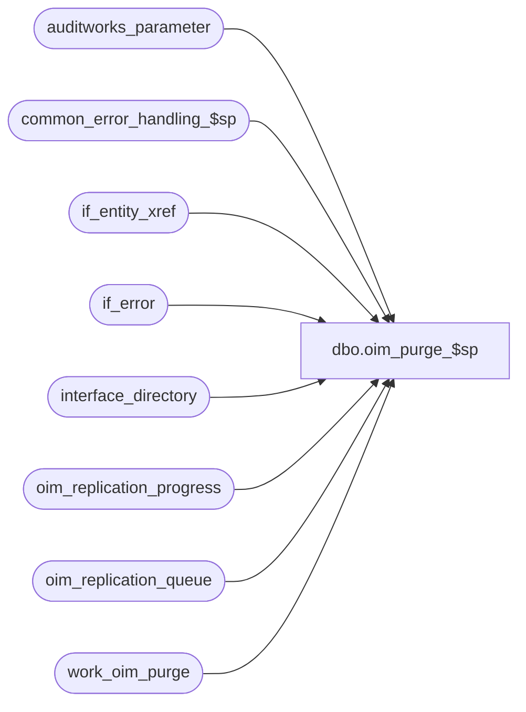

# dbo.oim_purge_$sp

**Database:** auditworks_external  
**Server:** bedrockdb01  

## Architecture Diagram



## Table Dependencies

| Referenced Table |
|---|
| auditworks_parameter |
| common_error_handling_$sp |
| if_entity_xref |
| if_error |
| interface_directory |
| oim_replication_progress |
| oim_replication_queue |
| work_oim_purge |

## Stored Procedure Code

```sql
create proc dbo.oim_purge_$sp AS

/*
Proc name: oim_purge_$sp
     Desc: To purge past history of offline stock details.
           Called by day_end_purge_$sp
 
HISTORY:
Date     Name             Defect  Desc
Jan04,11 Paul            105313   Use unicode datatypes
Nov08.06 Daphna           79686   correct total_table = 15 to include uda tables
Aug04,06 Vicci            75680   Don't clean up oim tables if outstanding if_errors exist
Feb17,05 Daphna           48946   Include entity 160 (User Defined Adjustments)
Feb26,04 Phu              24432   Log specific table instead of all tables to process error log
Jan12,04 Phu              21459   Clean up oim_message table
Sep09,03 Phu              15801   Initial development

*/

DECLARE
  @column_name                  nvarchar(500),
  @common_clause                nvarchar(200),
  @entity_code                  nvarchar(200),
  @errmsg                       nvarchar(255),
  @errno                        int,
  @history_days                 tinyint,
  @index_entity                 smallint,
  @index_tb                     smallint,
  @interface_id                 tinyint,
  @max_retry                    tinyint,
  @message_id                   int,
  @object_name                  nvarchar(255),
  @operation_name               nvarchar(100),
  @process_name                 nvarchar(100),
  @process_no                   int,
  @rows                         int,
  @sql_command                  nvarchar(2000),
  @table_count                  tinyint,
  @table_name                   nvarchar(500),
  @total_table                  tinyint,
  @transactions_per_batch       int

IF EXISTS (SELECT 1 FROM if_error WHERE interface_id = 43) RETURN

SELECT @entity_code = '10  10  50  50  60  60  120 120 130 130 140 140 150 160 160 ',
       @message_id = 201068,
       @process_name = 'oim_purge_$sp',
       @process_no = 16,
       @total_table = 15,
       @common_clause = ' IN (SELECT entity_id FROM work_oim_purge WHERE entity_code = '

SELECT @table_name = 'oim_po_receipt                oim_po_receipt_detail         oim_out_xfer                  '
SELECT @table_name = @table_name + 'oim_out_xfer_detail           oim_rtv                       oim_rtv_detail                '
SELECT @table_name = @table_name + 'oim_inv_count                 oim_inv_count_detail          oim_in_xfer                   '
SELECT @table_name = @table_name + 'oim_in_xfer_detail            oim_store_ship_rcpt           oim_store_ship_rcpt_dtl       '
SELECT @table_name = @table_name + 'oim_message                   '
SELECT @table_name = @table_name + 'oim_uda                       oim_uda_detail                '


SELECT @column_name = 'oim_po_receipt_id             oim_po_receipt_id             oim_out_xfer_id               '
SELECT @column_name = @column_name + 'oim_out_xfer_id               oim_rtv_id                    oim_rtv_id                    '
SELECT @column_name = @column_name + 'oim_inv_count_id              oim_inv_count_id              oim_in_xfer_id                '
SELECT @column_name = @column_name + 'oim_in_xfer_id                oim_store_ship_rcpt_id        oim_store_ship_rcpt_id        '
SELECT @column_name = @column_name + 'entity_id                     '
SELECT @column_name = @column_name + 'oim_uda_id                    oim_uda_id                    '

SELECT @history_days = history_days
FROM interface_directory
WHERE interface_id = 43

SELECT @errno = @@error
IF @errno != 0
BEGIN
  SELECT @errmsg = 'Unable to select history_days from interface_directory',
         @object_name = 'interface_directory',
         @operation_name = 'SELECT'
  GOTO error
END

SELECT @history_days = ISNULL(@history_days, 2)

SELECT @transactions_per_batch = CONVERT(INT, ISNULL(par_value,'1000'))
FROM auditworks_parameter
WHERE par_name = 'transactions_per_batch'

SELECT @errno = @@error
IF @errno <> 0
BEGIN
  SELECT @errmsg = 'Unable to select transactions_per_batch from auditworks_parameter',
         @object_name = 'auditworks_parameter',
         @operation_name = 'SELECT'
  GOTO error
END

SELECT @transactions_per_batch = ISNULL(@transactions_per_batch, 1000)

WHILE 1 = 1
BEGIN
  TRUNCATE TABLE work_oim_purge
  SELECT @errno = @@error
  IF @errno != 0
  BEGIN
    SELECT @errmsg = 'Unable to truncate table work_oim_purge',
           @object_name = 'work_oim_purge',
           @operation_name = 'TRUNCATE'
    GOTO error
  END
    
  SET ROWCOUNT @transactions_per_batch

  INSERT INTO work_oim_purge (entity_code, entity_id, oim_replication_queue_id)
  SELECT q.entity_code, q.entity_id, q.oim_replication_queue_id
  FROM oim_replication_progress p, if_entity_xref x, oim_replication_queue q
  WHERE p.base_segment_id = x.segment_id
  AND p.oim_replication_queue_id >= q.oim_replication_queue_id
  AND x.entity_code = q.entity_code
  AND q.action_date <= dateadd(dd, -1 * @history_days , getdate())

  SELECT @errno = @@error, @rows = @@rowcount
  IF @errno != 0
  BEGIN
    SELECT @errmsg = 'Unable to insert work_oim_purge',
           @object_name = 'work_oim_purge',
           @operation_name = 'INSERT'
    GOTO error
  END

  SET ROWCOUNT 0

  IF @rows = 0 RETURN

  SELECT @table_count = 1
  WHILE @table_count <= @total_table
  BEGIN
    SELECT @index_tb = ((@table_count - 1) * 30) + 1,
           @index_entity = ((@table_count - 1) * 4) + 1
    SELECT @sql_command = 'DELETE ' + RTRIM(SUBSTRING(@table_name, @index_tb, 30)) +
                          ' WHERE ' + RTRIM(SUBSTRING(@column_name, @index_tb, 30)) +
                          @common_clause + RTRIM(SUBSTRING(@entity_code, @index_entity, 4)) + ')'

    IF @table_count IN (3, 4)
      SELECT @sql_command = 'DELETE ' + RTRIM(SUBSTRING(@table_name, @index_tb, 30)) +
                            ' WHERE ' + RTRIM(SUBSTRING(@column_name, @index_tb, 30)) +
                            SUBSTRING(@common_clause, 1, 60) + 'IN (50, 150))'
    ELSE
    IF @table_count = 13
      SELECT @sql_command = 'DELETE ' + RTRIM(SUBSTRING(@table_name, @index_tb, 30)) +
                            ' WHERE ' + RTRIM(SUBSTRING(@column_name, @index_tb, 30)) +
                            SUBSTRING(@common_clause, 1, 60) + 'IN (50, 60, 130, 150, 160))'

    EXEC sp_executesql @sql_command

    SELECT @errno = @@error
    IF @errno != 0
    BEGIN
      SELECT @errmsg = 'Unable to delete ' + RTRIM(SUBSTRING(@table_name, @index_tb, 30)),
             @object_name = RTRIM(SUBSTRING(@table_name, @index_tb, 30)),
             @operation_name = 'DELETE'
      GOTO error
    END
    
    SELECT @table_count = @table_count + 1
  END -- while @table_count < @total_table

  DELETE oim_replication_queue
  WHERE oim_replication_queue_id
  IN (SELECT oim_replication_queue_id FROM work_oim_purge)

  SELECT @errno = @@error
  IF @errno != 0
  BEGIN
    SELECT @errmsg = 'Unable to delete oim_replication_queue',
           @object_name = 'oim_replication_queue',
           @operation_name = 'DELETE'
    GOTO error
  END
END -- while 1 = 1

RETURN

error:

  EXEC common_error_handling_$sp @process_no, @errno, @errmsg, 0, @message_id, @process_name, @object_name, @operation_name, 1
  RETURN
```

