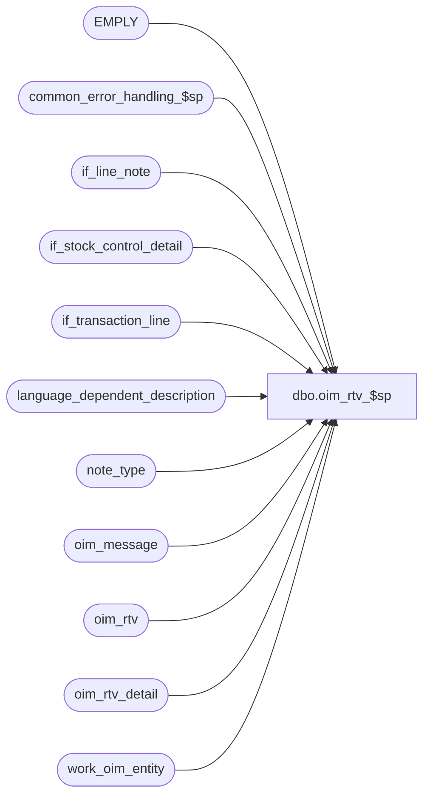

# dbo.oim_rtv_$sp

**Database:** auditworks_external  
**Server:** bedrockdb01  

## Architecture Diagram



## Table Dependencies

| Referenced Table |
|---|
| EMPLY |
| common_error_handling_$sp |
| if_line_note |
| if_stock_control_detail |
| if_transaction_line |
| language_dependent_description |
| note_type |
| oim_message |
| oim_rtv |
| oim_rtv_detail |
| work_oim_entity |

## Stored Procedure Code

```sql
create proc dbo.oim_rtv_$sp 

AS

/*
Proc name: oim_rtv_$sp
     Desc: To post Return To Vendor details.
           Called by mew_stock_export_$sp
 
HISTORY:
Date     Name             Defect  Desc
Feb20,12 Paul            133115   avoid error by extracting first 255 char from line_note column
Oct25,06 Phu              77931   Fix outer join for SQL 2005 Mode 90.
Sep21,06 Paul             76719   apply 75320,1-34YHBK to SA5
Apr28.04 Brett C        DV-1071   change employee table to EMPLY
Sep21,06 Paul             75320   avoid possible concat null problem
Sep08,05 ShuZ          1-34YHBK   Only allow line_sequence > 0 to be populated
Jan12,04 Phu              21459   Clean up oim_message table
Sep09,03 Phu              15801   Initial development

*/

DECLARE
  @errmsg                       varchar(255),
  @errno                        int,
  @exit_loop                    tinyint,
  @message_id                   int,
  @object_name                  varchar(255),
  @operation_name               varchar(100),
  @process_name                 varchar(100),
  @process_no                   int,
  @rows                         int

SELECT @message_id = 201068,
       @process_name = 'oim_rtv_$sp',
       @process_no = 209,
       @exit_loop = 0

WHILE @exit_loop = 0
BEGIN
  INSERT INTO oim_rtv (
    oim_rtv_id, document_no, inventory_move_request_no, location_id,
    vendor_code, returned_date, packed_by, weight,
    unit_weight_code, no_of_containers, container_type_code, carrier_code,
    return_authorization_no, freight_amount_1, reason_code, document_source, line_id)
  SELECT
    w.transaction_id, w.reference_no, w.imrd, w.location_id,
    SUBSTRING(w.vendor_no, 1, 20), ISNULL(w.count_date, w.transaction_date), CONVERT(VARCHAR, w.cashier_no) + ' '
    + ISNULL(LTRIM(e.FRST_NAME + ' ' + e.LAST_NAME),' '), null,
    null, null, null, null,
    w.pos_identifier, null, w.reason, 8, w.min_line_id
  FROM work_oim_entity w LEFT JOIN EMPLY e ON (w.cashier_no = e.EMPLY_NUM)
  WHERE w.entity_code = 60

  SELECT @errno = @@error
  IF @errno = 2601  -- duplicate error on insert
  BEGIN 
    DELETE oim_rtv
    FROM oim_rtv oim, work_oim_entity w
    WHERE w.entity_code = 60
    AND w.transaction_id = oim.oim_rtv_id

    SELECT @errno = @@error
    IF @errno <> 0
    BEGIN
      SELECT @errmsg = 'Unable to delete duplicate key in oim_rtv',
             @object_name = 'oim_rtv',
             @operation_name = 'DELETE'
      GOTO error
    END

    DELETE oim_rtv_detail
    FROM oim_rtv_detail oim, work_oim_entity w
    WHERE w.entity_code = 60
    AND w.transaction_id = oim.oim_rtv_id

    SELECT @errno = @@error
    IF @errno <> 0
    BEGIN
      SELECT @errmsg = 'Unable to delete duplicate key in oim_rtv_detail',
             @object_name = 'oim_rtv_detail',
             @operation_name = 'DELETE'
      GOTO error
    END

    DELETE oim_message
    FROM oim_message oim, work_oim_entity w
    WHERE w.entity_code = 60
    AND w.transaction_id = oim.entity_id

    SELECT @errno = @@error
    IF @errno <> 0
    BEGIN
      SELECT @errmsg = 'Unable to delete duplicate key in oim_message',
             @object_name = 'oim_message',
             @operation_name = 'DELETE'
      GOTO error
    END
  END -- @errno = 2601 duplicate
  ELSE
  IF @errno <> 0
  BEGIN
    SELECT @errmsg = 'Unable to insert oim_rtv',
           @object_name = 'oim_rtv',
           @operation_name = 'INSERT'
    GOTO error
  END
  ELSE
    SELECT @exit_loop = 1
END -- while @exit_loop = 0

UPDATE oim_rtv
SET no_of_containers = s.location_no,
    container_type_code = CONVERT(VARCHAR, SIGN(2 - ABS(SIGN(s.location_no)))),
    weight = s.units,
    unit_weight_code = SUBSTRING(s.imrd, 1, 10),
    carrier_code = SUBSTRING(s.reason, 1, 4),
    freight_amount_1 = CONVERT(numeric(14,2), l.gross_line_amount * l.voiding_reversal_flag)
FROM oim_rtv oim, work_oim_entity w, if_transaction_line l, if_stock_control_detail s
WHERE  w.entity_code = 60
AND w.if_entry_no = s.if_entry_no
AND s.display_def_id = 37 -- shipment info
AND s.if_entry_no = l.if_entry_no
AND s.line_id = l.line_id
AND l.line_void_flag = 0
AND l.line_sequence > 0
AND w.transaction_id = oim.oim_rtv_id

SELECT @errno = @@error
IF @errno <> 0
BEGIN
  SELECT @errmsg = 'Unable to update oim_rtv',
         @object_name = 'oim_rtv',
         @operation_name = 'UPDATE'
  GOTO error
END

INSERT INTO oim_rtv_detail (
  oim_rtv_id, sku_id, carton_no, units_sent, line_id)
SELECT
  w.transaction_id, s.sku_id, l.reference_no, SUM(CONVERT(INT, s.units * l.voiding_reversal_flag)), MIN(l.line_id)
FROM work_oim_entity w, if_transaction_line l, if_stock_control_detail s
WHERE w.entity_code = 60 
AND w.if_entry_no = s.if_entry_no
AND s.display_def_id = 36 -- stock item detail
AND s.if_entry_no = l.if_entry_no
AND s.line_id = l.line_id
AND l.line_void_flag = 0
AND l.line_sequence > 0
GROUP BY w.transaction_id, s.sku_id, l.reference_no
HAVING SUM(CONVERT(INT, s.units * l.voiding_reversal_flag)) <> 0

SELECT @errno = @@error
IF @errno <> 0
BEGIN
  SELECT @errmsg = 'Unable to insert oim_rtv_detail',
         @object_name = 'oim_rtv_detail',
         @operation_name = 'INSERT'
  GOTO error
END

INSERT INTO oim_message (
  entity_id, entity_code, message_type_description, message_text, line_id)
SELECT
  w.transaction_id,
  w.entity_code,
  ISNULL(l.display_description, n.note_type_description),
  SUBSTRING(ln.line_note,1,255),
  ln.line_id
FROM work_oim_entity w
     INNER JOIN if_line_note ln ON (w.if_entry_no = ln.if_entry_no)
     INNER JOIN note_type n ON (ln.note_type = n.note_type)
     LEFT JOIN language_dependent_description l ON (n.resource_id = l.resource_id AND l.language_id = 1033)
WHERE w.entity_code = 60

SELECT @errno = @@error
IF @errno <> 0
BEGIN
  SELECT @errmsg = 'Unable to insert oim_message',
         @object_name = 'oim_message',
         @operation_name = 'INSERT'
  GOTO error
END

RETURN


error:

  EXEC common_error_handling_$sp @process_no, @errno, @errmsg, 0, @message_id, @process_name, @object_name, @operation_name, 1
  RETURN
```

