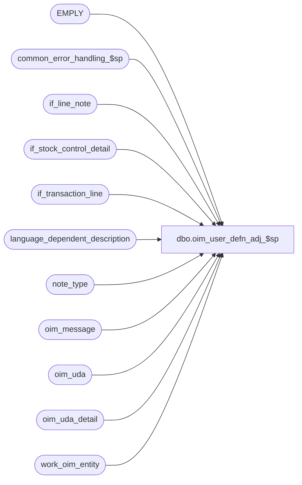

# dbo.oim_user_defn_adj_$sp

**Database:** auditworks_external  
**Server:** bedrockdb01  

## Architecture Diagram



## Table Dependencies

| Referenced Table |
|---|
| EMPLY |
| common_error_handling_$sp |
| if_line_note |
| if_stock_control_detail |
| if_transaction_line |
| language_dependent_description |
| note_type |
| oim_message |
| oim_uda |
| oim_uda_detail |
| work_oim_entity |

## Stored Procedure Code

```sql
create proc dbo.oim_user_defn_adj_$sp AS

/*
Proc name: oim_user_defn_adj_$sp
     Desc: To post User Defined Adjustments.
           Called by mew_stock_export_$sp
 
HISTORY:
Date     Name             Defect  Desc
Feb20,12 Paul            133115   avoid error by extracting first 255 char from line_note column
Oct25,06 Phu              77931   Fix outer join for SQL 2005 Mode 90.
Sep21,06 Paul             76719   apply 75320,1-34YHBK to SA5
Aug23,05 Paul             57266   apply 57118 to SA5
May27,05 Paul/Daphna    DV-1254   apply 53998 to SA5
Sep21,06 Paul             75320   avoid possible concat null problem
Sep08,05 ShuZ          1-34YHBK   Only allow line_sequence > 0 to be populated
Jul11,05 Daphna           57118   oim_uda.submit date = effective date (count_date)
May16,05 Daphna           53998	  populate oim_uda_detail.reason_code from stock_control_detail 	
                                  populate oim_uda.submit_date from transaction_date
Feb08,05 Daphna           48946   Author

*/

DECLARE
  @errmsg                       varchar(255),
  @errno                        int,
  @exit_loop                    tinyint,
  @message_id                   int,
  @object_name                  varchar(255),
  @operation_name               varchar(100),
  @process_name                 varchar(100),
  @process_no                   int,
  @rows                         int

SELECT @message_id = 201068,
       @process_name = 'oim_user_defn_adj_$sp',
       @process_no = 209,
       @exit_loop = 0

WHILE @exit_loop = 0
BEGIN
  INSERT INTO oim_uda (
    oim_uda_id, document_no, location_id, reason_code,performed_by,
    line_id, submit_date)
  SELECT
    w.transaction_id, w.reference_no, w.location_id, SUBSTRING(w.reason,1,5),
    CONVERT(VARCHAR, w.cashier_no) + ' ' + ISNULL(LTRIM(e.FRST_NAME + ' ' + e.LAST_NAME),' '), 
    w.min_line_id, ISNULL(w.count_date,w.transaction_date)
  FROM work_oim_entity w LEFT JOIN EMPLY e ON (w.cashier_no = e.EMPLY_NUM)
  WHERE w.entity_code = 160

  SELECT @errno = @@error
  IF @errno = 2601  -- duplicate error on insert
  BEGIN 
    DELETE oim_uda
    FROM oim_uda oim, work_oim_entity w
    WHERE w.entity_code = 160
    AND w.transaction_id = oim.oim_uda_id

    SELECT @errno = @@error
    IF @errno <> 0
    BEGIN
      SELECT @errmsg = 'Unable to delete duplicate key in oim_uda',
             @object_name = 'oim_uda',
             @operation_name = 'DELETE'
      GOTO error
    END

    DELETE oim_uda_detail
    FROM oim_uda_detail oim, work_oim_entity w
    WHERE w.entity_code = 160
    AND w.transaction_id = oim.oim_uda_id

    SELECT @errno = @@error
    IF @errno <> 0
    BEGIN
      SELECT @errmsg = 'Unable to delete duplicate key in oim_uda_detail',
             @object_name = 'oim_uda_detail',
             @operation_name = 'DELETE'
      GOTO error
    END
    
    DELETE oim_message
    FROM oim_message oim, work_oim_entity w
    WHERE w.entity_code = 160
    AND w.transaction_id = oim.entity_id

    SELECT @errno = @@error
    IF @errno <> 0
    BEGIN
      SELECT @errmsg = 'Unable to delete duplicate key in oim_message',
             @object_name = 'oim_message',
             @operation_name = 'DELETE'
      GOTO error
    END
  END -- @errno = 2601 duplicate
  ELSE
  IF @errno <> 0
  BEGIN
    SELECT @errmsg = 'Unable to insert oim_uda',
           @object_name = 'oim_uda',
           @operation_name = 'INSERT'
    GOTO error
  END
  ELSE
    SELECT @exit_loop = 1
END -- while @exit_loop = 0

INSERT INTO oim_uda_detail 
  (oim_uda_id, reason_code, sku_id, 
  units_to_adjust, 
  line_id)
SELECT
  w.transaction_id, MIN(SUBSTRING(s.reason,1,5)), s.sku_id, 
  SUM(SIGN(line_action -74) * CONVERT(INT, s.units * l.voiding_reversal_flag)), 
  MIN(l.line_id)
FROM work_oim_entity w, if_stock_control_detail s, if_transaction_line l
WHERE w.entity_code = 160
AND w.if_entry_no = s.if_entry_no
AND s.display_def_id = 36 -- item detail
AND s.if_entry_no = l.if_entry_no
AND s.line_id = l.line_id
AND l.line_void_flag = 0
AND l.line_sequence > 0
GROUP BY w.transaction_id, s.sku_id

SELECT @errno = @@error
IF @errno <> 0
BEGIN
  SELECT @errmsg = 'Unable to insert oim_uda_detail',
         @object_name = 'oim_uda_detail',
         @operation_name = 'INSERT'
  GOTO error
END

INSERT INTO oim_message (
  entity_id, entity_code, 
  message_type_description, 
  message_text, line_id)
SELECT
  w.transaction_id,
  w.entity_code,
  ISNULL(ISNULL(l.display_description, n.note_type_description),'POS Message'),
  SUBSTRING(ln.line_note,1,255),
  ln.line_id
FROM work_oim_entity w
     INNER JOIN if_line_note ln ON (w.if_entry_no = ln.if_entry_no)
     INNER JOIN note_type n ON (ln.note_type = n.note_type)
     LEFT JOIN language_dependent_description l ON (n.resource_id = l.resource_id AND l.language_id = 1033)
WHERE w.entity_code = 160
AND ln.line_note IS NOT NULL

SELECT @errno = @@error
IF @errno <> 0
BEGIN
  SELECT @errmsg = 'Unable to insert oim_message',
         @object_name = 'oim_message',
         @operation_name = 'INSERT'
  GOTO error
END

RETURN


error:

  EXEC common_error_handling_$sp @process_no, @errno, @errmsg, 0, @message_id, @process_name, @object_name, @operation_name, 1
  RETURN
```

