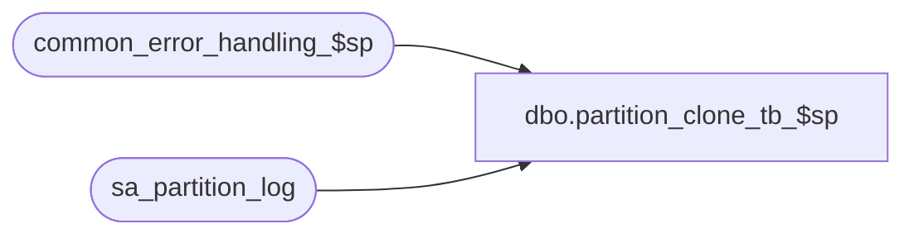

# dbo.partition_clone_tb_$sp

**Database:** auditworks_external  
**Server:** bedrockdb01  

## Architecture Diagram



## Table Dependencies

| Referenced Table |
|---|
| common_error_handling_$sp |
| sa_partition_log |

## Stored Procedure Code

```sql
create proc dbo.partition_clone_tb_$sp @partition_scheme  sysname 	= 'ArchiveTransactionPS',
@source_table_name sysname 	= NULL,		--source table  (if NULL the hard-coded list of tables associated with the @partition_scheme specified is used)
@clone_suffix 	  nvarchar(30) 	= NULL,		--suffix for destination table  (if NULL, implies that indexes on existing table should be dropped and recreated as partitionned instead of a new table being created)
@partition_col 	  nvarchar(30)	= NULL, 	--optional override for use if this proc is being run to partition tables other than the archive tables.
@process_no	  smallint	= 29,		--29=Day End -Archive purge, 11=Conversion/Upgrade
@preview_only	  tinyint	= 0		--1=display dynamic SQL without running it, 0=execute dynamic SQL generated

AS

DECLARE @object_id 	int, 
        @table_name 	sysname, 
        @last_col 	int, 
        @first_col 	int, 
        @tb_sql 	nvarchar(4000), 
        @ndx_sql 	nvarchar(4000), 
        @ndx_drop_sql 	nvarchar(4000),
        @skip_create_tb tinyint,
        @prior_partition_col nvarchar(30),
	@errno			int,
	@errmsg 		nvarchar(2000),	
	@object_name            nvarchar(255),
	@process_name           nvarchar(100),
	@operation_name         nvarchar(100),
	@message_id		int

/* 
PROC NAME: exec partition_clone_tb_$sp
     DESC: Clones or Partitions existing table(s).
           Called by partition_purge_archive_$sp to create a new table with the same layout and indexes as @table_name (but with no IDENTITY nor DEFAULT) 
           on specified partition schema, appending the specified clone suffix to form the new table name.
           Called by initial installation of partitioning (partition_activation_archive_tb_$sp) without specifying @table_name and @clone_suffix to drop/re-create indexes on archive tables to partition them.

  HISTORY:
Date     Name     Def# Desc
May08,12 Vicci  134811 Created because old methodology of putting scripts inside a table kept becoming obsolete (updates forgotten), there weren't enough
                       script columns to support all the indexes, and the column lengths for each script (create tb, ndx1, ndx2, etc) were too short.
*/

SET NOCOUNT ON 

SELECT @process_name = 'partition_clone_tb_$sp',
       @message_id = 201068

IF LTRIM(@source_table_name) = '' 
  SELECT @source_table_name = NULL

IF LTRIM(@clone_suffix) = '' OR @clone_suffix IS NULL
  SELECT @skip_create_tb = 1
ELSE 
  SELECT @skip_create_tb = 0

IF @clone_suffix IS NULL 
  SELECT @clone_suffix = ''
  
IF @partition_scheme = 'ArchiveTransactionPS' 
   OR @source_table_name = 'av_transaction_header' 
   OR @partition_scheme IN (SELECT ps.name
		 	      FROM sys.tables t
		             INNER JOIN sys.indexes i
			        ON i.object_id = t.object_id
			       AND i.type <= 1
		             INNER JOIN sys.partition_schemes ps
          			ON ps.data_space_id = i.data_space_id
			     WHERE t.name = 'av_transaction_header')
BEGIN
  SELECT @partition_col = COALESCE(@partition_col, 'transaction_date') --will be changed to sales_date for av_transaction_missing below
  
  DECLARE table_list_cursor CURSOR FAST_FORWARD
      FOR
   SELECT id, name
     FROM sysobjects
    WHERE type = 'U'
      AND ((@source_table_name IS NULL
            AND name IN ('av_authorization_detail', 'av_customer', 'av_customer_detail', 'av_discount_detail', 'av_exception_reason', 'av_if_rejection_reason', 'av_interface_control', 'av_line_note', 'av_merchandise_detail', 'av_payroll_detail', 'av_post_void_detail', 'av_return_detail', 'av_special_order_detail', 'av_stock_control_detail', 'av_tax_detail', 'av_tax_override_detail', 'av_transaction_header', 'av_transaction_line', 'av_transaction_line_link', 'av_transaction_missing', 'cust_liab_auto_compl_line', 'tax_exception_transaction'))
           OR
           name = @source_table_name)
    ORDER BY name
   SELECT @errno = @@error
   IF @errno != 0
   BEGIN
     SELECT @errmsg = 'Failed to determine list of valid archive tables to clone/partition',
	    @object_name    = 'sysobjects',
	    @operation_name = 'SELECT'
     GOTO error
   END	   

END
ELSE
BEGIN
  DECLARE table_list_cursor CURSOR FAST_FORWARD
      FOR
   SELECT id, name
     FROM sysobjects
    WHERE type = 'U'
      AND name = @source_table_name
    ORDER BY name
   SELECT @errno = @@error
   IF @errno != 0
   BEGIN
     SELECT @errmsg = 'Failed to validate table name provided',
	    @object_name    = 'sysobjects',
	    @operation_name = 'SELECT'
     GOTO error
   END	   
END

OPEN table_list_cursor
SELECT @errno = @@error
IF @errno != 0
BEGIN
  SELECT @errmsg = 'Failed to open table list cursor',
	 @object_name = 'table_list_cursor',
	 @operation_name = 'OPEN'
  GOTO error
END	   

FETCH table_list_cursor
 INTO @object_id, @table_name
SELECT @errno = @@error
IF @errno != 0
BEGIN
  SELECT @errmsg = 'Failed to fetch table list cursor',
	 @object_name = 'table_list_cursor',
	 @operation_name = 'FETCH'
  GOTO error
END	   

WHILE @@fetch_status = 0 
BEGIN
  SELECT @tb_sql = '', @ndx_sql = '
', @ndx_drop_sql = ''
  
  IF @table_name = 'av_transaction_missing' 
    SELECT @prior_partition_col = @partition_col, @partition_col = 'sales_date'
  ELSE
  BEGIN
    IF @prior_partition_col IS NOT NULL
      SELECT @partition_col = @prior_partition_col, @prior_partition_col = NULL
  END
      
  SELECT @last_col = max(colorder), @first_col = min(colorder)
    FROM syscolumns c
   WHERE c.id = @object_id
  SELECT @errno = @@error
  IF @errno != 0
  BEGIN
    SELECT @errmsg = 'Failed to determine first and last columns of table',
	   @object_name    = 'syscolumns',
	   @operation_name = 'SELECT'
    GOTO error
  END	   

  SELECT @tb_sql = @tb_sql + substring('CREATE TABLE dbo.' + @table_name + @clone_suffix + '(
           ', 1, 255 * (1-(sign(colorder - @first_col))))
	    +
        substring(substring('       ', 1, 13 + len(@table_name)), 1, 255 * sign(colorder - @first_col)) +
        c.name + ' ' + 
        convert(nvarchar(45), CASE WHEN type_name(c.xtype) like '%char%' OR type_name(c.xtype) like '%binary%' 
                              THEN type_name(c.xtype) + '(' + convert(nvarchar,c.prec) + ')'
                              ELSE CASE WHEN type_name(c.xtype) in ('numeric', 'decimal') 
                                        THEN type_name(c.xtype) + '(' + convert(nvarchar,c.prec) + ',' + convert(nvarchar,c.scale) + ')'
                                        ELSE type_name(c.xtype) END END )
    + CASE WHEN c.isnullable = 1 THEN ' NULL' ELSE ' NOT NULL' END
    + CASE WHEN colorder = @last_col THEN ') ON [' + @partition_scheme + '](' + @partition_col + ')
    ' ELSE ',
    ' END
   FROM syscolumns c
  WHERE c.id = @object_id
  ORDER BY colorder
  SELECT @errno = @@error
  IF @errno != 0
  BEGIN
    SELECT @errmsg = 'Failed to determine structure of table',
	   @object_name    = 'syscolumns',
	   @operation_name = 'SELECT'
    GOTO error
  END	   

  IF @skip_create_tb = 1 AND @preview_only = 1
  BEGIN
    PRINT  'The following table create command would NOT be run'
    PRINT @tb_sql
  END
  
  IF @skip_create_tb = 0
  BEGIN
    --PRINT @tb_sql
    IF @preview_only = 0
    BEGIN
      BEGIN TRY
        EXEC sp_executesql @tb_sql
      END TRY
      BEGIN CATCH
        SELECT @errno = @@error, 
               @errmsg = 'Failed to clone table ' + @table_name + ' ' + ERROR_MESSAGE(),
               @object_name = @table_name + @clone_suffix,
               @operation_name = 'CREATE TABLE'
        GOTO error
      END CATCH
    END  --IF @preview_only = 0
  END --IF @skip_create_tb = 0

  --Assumes indexes were originally created without clone suffix in their name
  SELECT @ndx_drop_sql = @ndx_drop_sql + 
  'IF EXISTS (SELECT 1 FROM sysobjects t, sys.indexes i WHERE t.type = ''U'' and t.name = ''' + @table_name + @clone_suffix + ''' AND t.id = i.object_id AND i.name = ''' + i.name + ''')
  BEGIN
    DROP INDEX ' + @table_name + @clone_suffix + '.' + i.name + '
  END
'
  FROM sys.indexes i
  WHERE object_id = @object_id
  ORDER BY i.name DESC
  SELECT @errno = @@error
  IF @errno != 0
  BEGIN
    SELECT @errmsg = 'Failed to determine indexes to be dropped',
	   @object_name    = 'sys.indexes',
	   @operation_name = 'SELECT'
    GOTO error
  END	   

  IF @skip_create_tb = 0 AND @preview_only = 1
  BEGIN
    PRINT  'The following drop index command would NOT be run'
    PRINT @ndx_drop_sql
  END

  --Don't execute @ndx_drop_sql yet since otherwise the @ndx_sql can't be built!


  --Assumes no primary key, no special index settings and that index is on specifed partition scheme and that all indexes include the partition column specified
  --For simplicity, index will be created without adding the suffix to its name since standards don't matter given that the table will just be dropped again.
  --If transaction_date/sales_date not already part of the index, make it part.
  SELECT @ndx_sql= @ndx_sql + CASE WHEN c.index_column_id = h.min_index_col_id 
              THEN 'CREATE ' 
                   + CASE WHEN is_unique = 1 THEN 'UNIQUE ' ELSE '' END 
                   + CASE WHEN i.TYPE = 1 THEN 'CLUSTERED INDEX ' ELSE 'INDEX ' END 
                   + i.name + ' ON dbo.' + @table_name + @clone_suffix + '(' + tc.name
              ELSE ', ' + tc.name
              END + 
         CASE WHEN c.index_column_id = max_index_col_id 
              THEN CASE WHEN h.transaction_date_exists = 0 THEN ', transaction_date' ELSE '' END + ') ON [' + @partition_scheme + '](' + @partition_col + ')
  '
              ELSE '' END
    FROM sys.indexes i
         INNER JOIN sys.index_columns c
            ON c.object_id = @object_id
           AND i.index_id = c.index_id
         INNER JOIN (SELECT object_id, index_id, MAX(CASE WHEN htc.name = @partition_col THEN 1 ELSE 0 END)transaction_date_exists, MIN(index_column_id) min_index_col_id, MAX(index_column_id) max_index_col_id
                       FROM sys.index_columns hc
                            INNER JOIN syscolumns htc
                               ON htc.id = @object_id
			  				  AND htc.colid = hc.column_id
                      WHERE object_id = @object_id
                      GROUP by object_id, index_id) h
            ON i.index_id = h.index_id
         INNER JOIN syscolumns tc
            ON tc.id = @object_id
           AND tc.colid = c.column_id
   WHERE i.object_id = @object_id
   ORDER BY i.name, i.index_id, c.index_column_id
  SELECT @errno = @@error
  IF @errno != 0
  BEGIN
    SELECT @errmsg = 'Failed to determine indexes to be created',
	   @object_name    = 'sys.indexes',
	   @operation_name = 'SELECT'
    GOTO error
  END	   

  IF @skip_create_tb = 1
  BEGIN
    --PRINT @ndx_drop_sql
    IF @preview_only = 0
    BEGIN
      BEGIN TRY
        EXEC sp_executesql @ndx_drop_sql
      END TRY
      BEGIN CATCH
        SELECT @errno = @@error, 
               @errmsg = 'Failed to drop table ' + @table_name + ' indexes. ' + ERROR_MESSAGE(),
               @object_name = @table_name,
               @operation_name = 'DROP INDEX'
        GOTO error
      END CATCH
      IF @process_no = 11
      BEGIN
        INSERT INTO sa_partition_log (
               entry_date,
               table_name,
               log_message)
        SELECT getdate(),
               @table_name,
               'Table indexes dropped in preparation for partitioning.'
        SELECT @errno = @@error
        IF @errno != 0
        BEGIN
          SELECT @errmsg = 'Failed to insert sa_partition_log for index drop',
                 @object_name = 'sa_partition_log',
                 @operation_name = 'INSERT'
          GOTO error
        END
      END --IF @process_no = 11
    END
  END

  --PRINT @ndx_sql
  IF @preview_only = 0
  BEGIN
    BEGIN TRY
      EXEC sp_executesql @ndx_sql
    END TRY
    BEGIN CATCH
      SELECT @errno = @@error, 
             @errmsg = 'Failed to create indexes for  ' + @table_name + @clone_suffix + '. ' + ERROR_MESSAGE(),
             @object_name = @table_name + @clone_suffix,
	     @operation_name = 'CREATE INDEX'
      GOTO error
    END CATCH
    IF @process_no = 11
    BEGIN
      INSERT INTO sa_partition_log (
             entry_date,
             table_name,
             log_message)
      SELECT getdate(),
             @table_name,
             'Table indexes recreated as partitioned.'
      SELECT @errno = @@error
      IF @errno != 0
      BEGIN
        SELECT @errmsg = 'Failed to insert sa_partition_log for table partitioning',
               @object_name = 'sa_partition_log',
               @operation_name = 'INSERT'
        GOTO error
      END
    END --IF @process_no = 11
  END
  
  FETCH table_list_cursor
   INTO @object_id, @table_name
  SELECT @errno = @@error
  IF @errno != 0
  BEGIN
    SELECT @errmsg = 'Failed to fetch table list cursor again',
  	   @object_name = 'table_list_cursor',
	   @operation_name = 'FETCH'
    GOTO error
  END	   

END /* while not end of table_list_cursor */

CLOSE table_list_cursor
DEALLOCATE table_list_cursor
	
RETURN
error:

  EXEC common_error_handling_$sp @process_no, @errno, @errmsg, 0, @message_id, 
                                 @process_name, @object_name, @operation_name,1
RETURN
```

