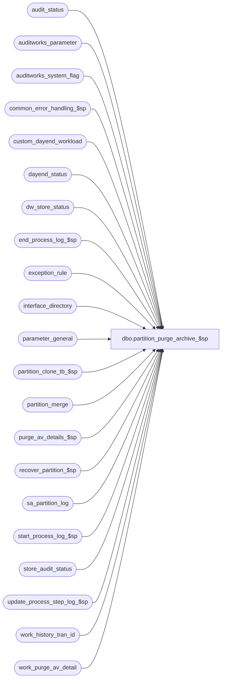

# dbo.partition_purge_archive_$sp

**Database:** auditworks_external  
**Server:** bedrockdb01  

## Architecture Diagram



## Table Dependencies

| Referenced Table |
|---|
| audit_status |
| auditworks_parameter |
| auditworks_system_flag |
| common_error_handling_$sp |
| custom_dayend_workload |
| dayend_status |
| dw_store_status |
| end_process_log_$sp |
| exception_rule |
| interface_directory |
| parameter_general |
| partition_clone_tb_$sp |
| partition_merge |
| purge_av_details_$sp |
| recover_partition_$sp |
| sa_partition_log |
| start_process_log_$sp |
| store_audit_status |
| update_process_step_log_$sp |
| work_history_tran_id |
| work_purge_av_detail |

## Stored Procedure Code

```sql
create proc dbo.partition_purge_archive_$sp AS

/*
Proc name: partition_purge_archive_$sp (SA_PART)
     Desc: Cleans up partitioned archive tables (defined as those partitioned using the same partition scheme 
           as av_transaction_header and starting with av_ or tax_exception_transaction) by:
	   
	   Looping through partitions whose dates are ALL earlier than the archive retention period, and for each:
           
           Method 1 (applied to partitions with possibility of still containing regular transactions and for which 
                     we therefore expect to delete more transactions than will be retained):
            -switch out header partition
            -return to header partition only those exception transactions flagged to be retained for an extended period
            -switch out corresponding line/attachment partitions
            -return to such line/attachment partitions transactions still found in corresponding header partition.
	   
	   OR
           
           Method 0, 2, 3 (applied to partitions which only contain extended archive exception transactions):
            -find list of expired exception transactions to be deleted
            -either Method 0 (applied if there are more transactions to be retained than deleted)
              -delete av_transaction_header rows and corresponding line/attachment table rows based on list of expired transactions.
            -or Method 3 (applied if there are more transactions to be deleted than to be retained)
              -delete av_transaction_header based on list of expired transactions.
              -switch out corresponding line/attachment partitions
              -return to such line/attachment partitions transactions still found in corresponding header partition.
            -or Method 2 (applied if there are no more transactions to be retained)
              -swith out av_transaction_header partition and corresponding line/attachment partitions
            -merge empty or small partitions for dates older than last-date-closed and archive retention period if 
             resulting partition would be small too (impacts all partitioned archive tables simultaneously).

            
           Deletes store_audit_status.
           Called by dayend_housekeeping_$sp.
           
           PREREQUISITES:
           -requires that the partition function defined be our standard RIGHT RANGE type on transaction_date/sales_date
           -requires that all partitioned archive tables bear a CLUSTERED index
           -requires that all indexes of partitioned archive tables be partitioned using the same partition scheme as av_transaction_header.
           -partition sizes should be kept at a reasonable number of days, since this proc has no other form of batching for its exception insert statements
           -partition size in days and min partition size in transactions that warrants keeping a separate partition parameters must be set.

	  Notes:  
	  -the names generally used when partitionning archive transaction tables are ArchiveTransactionPS and ArchiveTransactionPF
	  -there are currently 22 transaction archive tables to be cleaned, namely:
	   ('av_transaction_missing', 'cust_liab_auto_compl_line', 'av_authorization_detail', 'av_customer', 
	    'av_customer_detail', 'av_discount_detail', 'av_line_note', 'av_merchandise_detail', 'av_payroll_detail', 
	    'av_post_void_detail', 'av_return_detail', 'av_special_order_detail', 'av_stock_control_detail', 
	    'av_tax_override_detail', 'tax_exception_transaction', 'av_tax_detail', 'av_transaction_line_link', 
	    'av_transaction_line', 'av_interface_control', 'av_exception_reason', 'av_if_rejection_reason', 
	    'av_transaction_header')

*** Uses dynamic sql so that proc can complile on SQL2005 or higher if not using partitioning ***

HISTORY:
Date     Name            Defect# Description
Jan26,15 Paul              94760 use ext_archive_days_retained from auditworks_parameter for retention period of external archive,
                                   use try .. catch
Oct31,12 Vicci            139398 Refix 134811. 
                                 Audit status days should be limited to being no older than the older of archive days or 61 days before last date closed, so that extended arch days can be 7 years without audit status being 7 years!
Jun05,12 Vicci            134811 Audit status days should be limited to being no older than 61 days before last date closed, so that extended arch days can be 7 years without audit status being 7 years!
				 Correct @process_no:  should have been 29='Archive Purge' not 39='Tax transaction export to 3rd party'.
				 Handle merging of small extended archive partitions.
				 Remove usage of table and index create scripts stored in a manually maintained table too small to hold all index scripts and not matching actual table/index definitions.
				 Add safety checks ensure all av tables are partitioned using the same function.
				 Avoid re-inserting several years worth of extended archive transactions twice a night.
				 Support 2 different cleanup methods and select the one most likely to provide optimal performance for each partition:
				 For av_transaction_header:
				 1) For expired partitions which might still contain standard archive retention period transactions, swap out the whole
				    partition, then reinsert the exception transactions to keep.
				 2) For expired partitions which contain only extended retention period exception transactions, delete transactions which are
				    now older than the extended archive retention period. 
				 For av_ lines and attachments:
				 1) If header cleanup resulted in more transactions being deleted than retained, then swap out the whole
				    partition, then reinsert the exception transactions to keep.
				 2) If header cleanup resulted in more transactions being retained than deleted, then delete transactions which are
				    now older than the extended archive retention period. 
                                 Add cust_liab_auto_compl_line to tables being cleaned up.
                                 Handle tax_override_flag 2.
Dec05,11 Vicci            131496 Remove the "all transactions more recent than extended archive days" from list of those to keep.
				 Remove ACTV flag check (if exception exists its cleanup conditions must continue to be evaluated).
				 Do not retain all exceptions in extended archive (i.e. put back extended archive days criteria for exceptions which had been commented out).
				 Clean up Custom DayEnd Workload based on the history days for the user-defined interface in question (should not have had anything to do with extended archive days).
                        
Nov21,11 Paul                    Avoid install error when not using partitioning.
Jul26,11 Paul             114682 SA5.1: Use ACTV flag, commented out extended_archive_days (may be a future enhancement to allow different
					retention period for each rule)
Jun17,10 Paul             114682 Added prints to smartload log, update sa_partition_log
Aug04,08 Phu               95126 Initial development

*/

DECLARE
  @archive_days_retained                 int,
  @cursor_open                           tinyint,
  @employee_purchase_days                smallint,  
  @employee_purchase_date                smalldatetime,
  @errmsg                                nvarchar(2000),
  @errmsg2                               nvarchar(2000),
  @errline                               int,
  @errno                                 int,
  @exception_count                       numeric(14,0),
  @exec_sql                              nvarchar(max),
  @extend_archive_days_retained          int,
  @external_archive_flag                 int,
  @external_archive_in_use               numeric,
  @ext_archive_days_retained             smallint,
  @gl_ascii_export_type                  tinyint,
  @last_date_closed                      smalldatetime,
  @log_table_name                        nvarchar(30),
  @max_date                              smalldatetime,
  @max_tran_date                         smalldatetime,
  @message_id                            int,
  @min_date                              smalldatetime,
  @min_tran_date                         smalldatetime,
  @object_name                           nvarchar(255),
  @oldest_date                           smalldatetime,
  @oldest_date_audit_status              smalldatetime,
  @oldest_date_extended                  smalldatetime,
  @operation_name                        nvarchar(100),
  @param_definition                      nvarchar(200),
  @part_table_name                       sysname,
  @partition_name                        nvarchar(30),
  @partition_no                          int,
  @process_log_entry                     tinyint,
  @process_name                          nvarchar(100),  
  @process_no                            smallint,
  @process_start_time                    datetime,
  @process_timestamp                     float,
  @purge_tran_count                      numeric(14,0),
  @rdbms_sid                             smallint,
  @rows                                  int,
  @scaleout_flag                         int,
  @status                                smallint,
  @table_name                            sysname,
  @temp_table_name                       sysname,
  @tax_date                              smalldatetime,
  @tax_days                         	 smallint,
  @trace_msg                             nvarchar(255),
  @tran_count                            int,
  @recover_partition_no 		 int, 
  @recover_trans_count 			 int,
  @clone_suffix 	  		 nvarchar(30),
  @partition_scheme			 sysname,
  @partition_function			 sysname,
  @partition_function_id		 int,
  @partition_min_trans_qty 		 int,
  @av_tran_hdr_index_id			 int,
  @av_tran_hdr_object_id		 int,
  @partition_trans_qty			 bigint,
  @extended_part_cutoff_date		 smalldatetime,
  @transactions_to_be_deleted		 bigint,
  @oldest_date_exception		 smalldatetime,
  @use_switch_method			 tinyint;

SET CONCAT_NULL_YIELDS_NULL OFF;
SET DATEFORMAT mdy;

SELECT
  @cursor_open = 0,
  @process_log_entry = 0,
  @process_no = 29,  --134811:  29=Archive Purge
  @process_timestamp = 0,
  @purge_tran_count = 0,
  @process_start_time = getdate(),
  @gl_ascii_export_type = 0,
  @message_id = 201068,
  @process_name = 'partition_purge_archive_$sp',
  @log_table_name = 'Transaction Archive tables',
  @rdbms_sid = @@spid,
  @external_archive_flag = NULL;

BEGIN TRY
  SELECT @errmsg = 'Failed to execute stored proc update_process_step_log_$sp for step 62',
         @object_name = 'update_process_step_log_$sp',
         @operation_name = 'EXECUTE';
EXEC update_process_step_log_$sp 18, 1, 62, 1, 0, @process_start_time;

  SELECT @errmsg = 'Failed to determine date for or prior to which all partitions contain only extended archive transactions',
         @object_name = 'auditworks_system_flag',
         @operation_name = 'SELECT';
SELECT @extended_part_cutoff_date = flag_datetime_value
  FROM auditworks_system_flag
 WHERE flag_name = 'extended_partition_cutoff_date';

SELECT @rows = @@rowcount;
IF @rows = 0
BEGIN
    SELECT @errmsg = 'Failed to create flag to indicate the date for or prior to which all partitions contain only extended archive transactions',
           @object_name = 'auditworks_system_flag',
           @operation_name = 'INSERT';
  INSERT into auditworks_system_flag(
         flag_name,
         flag_datetime_value,
         flag_comment,
         flag_datetime_initialize_value)
  VALUES('extended_partition_cutoff_date', null, 'Partitions for this date and older contain only extended archive transactions.  Transactions for regular retention period have already been removed from them and since period is closed, no new trans will be posted to them.', null);
END;

--Determine how archive tables are partitioned and av_transaction_header identification
  SELECT @errmsg = 'Failed to determine how transaction archive was partitioned',
         @object_name = 'sys.partition_schemes',
         @operation_name = 'SELECT';
SELECT @av_tran_hdr_object_id = t.object_id,
       @av_tran_hdr_index_id = i.index_id,
       @partition_scheme = ps.name, 
       @partition_function = pf.name,
       @partition_function_id = pf.function_id
  FROM sys.tables t
       INNER JOIN sys.indexes i
          ON i.object_id = t.object_id
         AND i.type <= 1
  INNER JOIN sys.partition_schemes ps
          ON ps.data_space_id = i.data_space_id
       INNER JOIN sys.partition_functions pf
         ON ps.function_id = pf.function_id
 WHERE t.name = 'av_transaction_header';

IF @partition_function IS NULL
BEGIN
  SELECT @errno = 201500,
         @errmsg = 'ABORT: Transaction archive has not yet been partitioned.  Please deactivate partitioning or partition the archive tables prior to continuing.',
         @object_name = 'sys.partition_functions',
         @operation_name = 'SELECT';
   GOTO business_error;
END;

  SELECT @errmsg = 'Unable to select from parameter_general',
         @object_name = 'parameter_general',
         @operation_name = 'SELECT';
SELECT @archive_days_retained = archive_days_retained,
       @extend_archive_days_retained = extended_archive_days_retained,
       @last_date_closed = last_date_closed,
       @employee_purchase_days = employee_purchase_days,
       @tax_days = tax_days
  FROM parameter_general;

/* Check to see if external database is in use */
  SELECT @errmsg = 'Unable to select external_archive_in_use',
	 @object_name = 'auditworks_system_flag';
SELECT @external_archive_in_use = flag_numeric_value
  FROM auditworks_system_flag
 WHERE flag_name = 'external_archive_in_use';

IF @external_archive_in_use IS NULL
  SELECT @external_archive_in_use = 0;

  SELECT @errmsg = 'Unable to select external_archive_flag';
SELECT @external_archive_flag = flag_numeric_value
  FROM auditworks_system_flag
 WHERE flag_name = 'external_archive_flag';
 
IF @external_archive_flag IS NULL
  SELECT @external_archive_flag = 0;

  SELECT @errmsg = 'Failed to select scaleout_flag from auditworks_system_flag';
SELECT @scaleout_flag = CONVERT(int, flag_numeric_value)
  FROM auditworks_system_flag
 WHERE flag_name = 'scaleout_flag';
SELECT @rows = @@rowcount;
IF @rows = 0
  GOTO business_error;

   SELECT @errmsg = 'Unable to select ext_archive_days_retained',
	 @object_name = 'auditworks_parameter';
SELECT @ext_archive_days_retained = CONVERT(smallint,par_value)
  FROM auditworks_parameter
  WHERE par_name = 'ext_archive_days_retained';

IF @ext_archive_days_retained IS NULL
  SELECT @ext_archive_days_retained = @archive_days_retained;

IF @extend_archive_days_retained < @archive_days_retained
  SELECT @extend_archive_days_retained = @archive_days_retained;

IF @tax_days > @extend_archive_days_retained
  SELECT @tax_days = @extend_archive_days_retained;	--i.e. allow tax exception transactions to be limited to extended days even though tax summary is retained longer
ELSE
BEGIN
  IF @tax_days < @archive_days_retained
    SELECT @tax_days = @archive_days_retained;
END;

IF @employee_purchase_days > @extend_archive_days_retained
  SELECT @employee_purchase_days = @extend_archive_days_retained;  --i.e. allow employee purchase transactions to be limited to extended days even though Employee Purchase summary is retained longer
ELSE
BEGIN
  IF @employee_purchase_days < @archive_days_retained
    SELECT @employee_purchase_days = @archive_days_retained;
END;

/* If running in external archive db, then use @ext_archive_days_retained for all retention conditions */
IF @external_archive_flag = 1
  SELECT @archive_days_retained = @ext_archive_days_retained,
	@extend_archive_days_retained = @ext_archive_days_retained,
	@tax_days = @ext_archive_days_retained,
	@employee_purchase_days = @ext_archive_days_retained;

SELECT @oldest_date = DATEADD(dd, @archive_days_retained * -1, getdate()),
       @oldest_date_extended = DATEADD(dd, @extend_archive_days_retained * -1, getdate()),
       @employee_purchase_date = DATEADD(dd, @employee_purchase_days * -1, getdate()),
       @tax_date = DATEADD(dd, @tax_days * -1, getdate());

SELECT @oldest_date_audit_status = @oldest_date_extended;

IF @oldest_date_audit_status > @last_date_closed	-- Do not delete any dates in audit_status which are not in closed periods
  SELECT @oldest_date_audit_status = @last_date_closed;
ELSE
BEGIN
  --134811 Audit status days should instead be arbitrarily set to 61 days before last date closed if this would be more recent, so that extended arch days can be 7 years without audit status being 7 years!
  IF DATEADD(dd, -61, @last_date_closed) > @oldest_date_audit_status
    SELECT @oldest_date_audit_status = DATEADD(dd, -61, @last_date_closed);
END;

IF @oldest_date_audit_status > @oldest_date
  SELECT @oldest_date_audit_status = @oldest_date;

  SELECT @errmsg = 'Unable to determine if any exception rules are configured to be retained in the extended archive',
         @object_name = 'exception_rule',
         @operation_name = 'SELECT';
SELECT @oldest_date_exception = DATEADD(dd, -1 * MAX(extended_archive_days), getdate())
  FROM exception_rule
 WHERE extended_archive_days <> 0
   AND (exception_rule <> -1 OR ACTV = 1);  --Loss Prevention will force the ACTV flag to 1 if it wants any CASE supporting transactions to be kept;  User does not have access to rules < 1

  SELECT @errmsg = 'Unable to determine if subledger export to G/L is active.',
	 @object_name = 'interface_directory';
SELECT @gl_ascii_export_type = ascii_export
FROM interface_directory
 WHERE interface_id = 19;

  SELECT @errmsg = 'Unable to determine the minimum transaction qty which warrants keeping a separate extended archive partition.',
	 @object_name = 'auditworks_parameter';
SELECT @partition_min_trans_qty = CONVERT(int, par_value)
  FROM auditworks_parameter
 WHERE par_name = 'partition_min_trans_qty'
   AND IsNumeric(par_value) = 1;

IF @partition_min_trans_qty IS NULL OR @partition_min_trans_qty = 0
  SELECT @partition_min_trans_qty = 1;

    SELECT @errmsg = 'Failed to insert sa_partition_log',
         @object_name = 'sa_partition_log',
         @operation_name = 'INSERT';
INSERT INTO sa_partition_log (
       entry_date,
       table_name,
       log_message)
SELECT getdate(),
       @log_table_name,
       'Archive Purge starts on sid ' + CONVERT(nvarchar,@rdbms_sid);

  SELECT @errmsg = 'Unable to execute start_process_log_$sp',
         @object_name = 'start_process_log_$sp',
         @operation_name = 'EXECUTE';
EXEC start_process_log_$sp @process_no, @process_timestamp OUTPUT, @errmsg OUTPUT, 1, @process_start_time;

SELECT @process_log_entry = 1;

-- To cleanup/recover the temporary tables that are left from the last run.  
-- Drops _temp tables (obsolete code), switches non-empty _part tables back into av unless av already has exceptions in it in which it av is left alone, 
-- drops part tables (even if non-empty) except header which is kept since its presence signals that the prior purge run had not completed 
-- all 21 av tables (need because it might take more than 1 attempt to recover).
  SELECT @errmsg = 'Unable to execute stored procedure',
         @object_name = 'recover_partition_$sp',
         @operation_name = 'EXECUTE';
EXEC recover_partition_$sp @recover_partition_no OUTPUT , @recover_trans_count OUTPUT;
-- @recover_trans_count is the count of transactions that were originally in the av table partition before it was switched out
-- and replaced with just the remaining exceptions to be retained.


-- To complete/recover any previously failed archive table cleanup
  SELECT @errmsg = 'Failed to clean up work_purge_av_detail',
	 @object_name = 'work_purge_av_detail',
	 @operation_name = 'TRUNCATE';
TRUNCATE TABLE work_purge_av_detail;

  SELECT @errmsg = 'Failed to insert batch to recover into work_purge_av_detail',
	 @object_name = 'work_purge_av_detail',
	 @operation_name = 'INSERT';
INSERT work_purge_av_detail (av_transaction_id)
SELECT transaction_id
  FROM work_history_tran_id WITH (NOLOCK);
SELECT @rows = @@rowcount;

IF @rows > 0  --then there are some tables that were not yet cleaned up on the last run, so finish them now.
BEGIN
    SELECT @errmsg = 'Failed to insert sa_partition_log (1)',
         @object_name = 'sa_partition_log',
         @operation_name = 'INSERT';
  INSERT INTO sa_partition_log (
	 entry_date,
	 table_name,
	 log_message,
	 partition_name)
  SELECT getdate(),
	 'transaction archive',
	 'Completing deletion of ' + convert(nvarchar, @rows) + ' transactions to recover from previously failed attempt.',
	 'N/A';

    SELECT @errmsg = 'Unable to execute purge_av_details_$sp',
	   @object_name = 'purge_av_details_$sp',
	   @operation_name = 'EXECUTE';
  EXEC purge_av_details_$sp;  

    SELECT @errmsg = 'Failed to clean up work_history_tran_id',
  	   @object_name = 'work_history_tran_id',
	   @operation_name = 'TRUNCATE';
  TRUNCATE TABLE work_history_tran_id;

END;  --IF @rows > 0, i.e. there were incomplete transaction line/attachment tables deletions to finish up

--There should be 22 date-partitioned archive tables
IF (SELECT COUNT(DISTINCT t.name)
      FROM sys.partition_schemes ps
           INNER JOIN sys.indexes i
              ON ps.data_space_id = i.data_space_id
             AND i.type <= 1
           INNER JOIN sys.tables t
              ON i.object_id = t.object_id
             AND t.name NOT LIKE '%_part%'
             AND (t.name IN ('tax_exception_transaction', 'cust_liab_auto_compl_line') OR t.name LIKE 'av_%')  --precaution in case the same partition scheme was used to partition some table(s) other than the transaction archive
      WHERE ps.name = @partition_scheme) <> 22
BEGIN
  SELECT @errno = 201500,
         @errmsg = 'ABORT: There were NOT 22 archive transaction tables partitioned using ' + @partition_scheme + '.  Please deactivate partitioning or correct archive table partitioning prior to continuing.',
         @object_name = 'sys.indexes',
         @operation_name = 'SELECT';
  GOTO business_error;
END;

--Since this list will be rebuilt, delete any left behind entries from prior failed merges.
  SELECT @errmsg = 'Unable to clean up list of previously failed partition merges',
         @object_name = 'partition_merge',
         @operation_name = 'DELETE';
DELETE partition_merge
 WHERE partition_function_name = @partition_function;

SELECT @trace_msg = ':LOG ***> Starting Purge of Archive partitions : ' + CONVERT(CHAR, getdate(), 8);
PRINT @trace_msg;

  SELECT @errmsg = 'Unable to open cursor',
         @object_name = 'part_func_sum_crsr',
         @operation_name = 'OPEN';
DECLARE part_func_sum_crsr CURSOR FAST_FORWARD
    FOR
 --Note:  Requires that partition function defined be our standard RIGHT RANGE type
 --       Produces list of partitions which are cleanup candidates
 SELECT CONVERT(datetime, b.value) AS min_tran_date, 
        DATEADD(dd, -1, convert(datetime, r.value)) AS max_tran_date, 
        p.rows AS tran_count,  --note, will be corrected below in the case of a recovery scenario
        p.partition_number
   FROM sys.partitions AS p		
	JOIN sys.partition_range_values AS r 
	  ON r.function_id = @partition_function_id
	 AND r.boundary_id = p.partition_number
	 AND dateadd(dd, -1, CONVERT(datetime, r.value)) < @oldest_date --this means that a partition with ANY dates that are within the archive retention period
	                                                                --will NOT be evaluated for cleanup.  Although this produces an according effect 
	                                                                --(a 30 day archive would swell to 40 days then shrink back to 30 days if 10-day partitions 
	                                                                --were configured, this is important to avoid having to re-insert ALL transactions 
	                                                                --for dates within the retention period, along with the exceptions for dates within the extended retention period.
	JOIN sys.partition_range_values AS b 	--this inner (as opposed to outer) join avoids picking up the first partition which should always remain empty
	  ON b.function_id = @partition_function_id
	 AND b.boundary_id = p.partition_number - 1
  WHERE p.object_id = @av_tran_hdr_object_id
    AND p.index_id = @av_tran_hdr_index_id
    AND (p.rows > 0 OR DATEADD(dd, -1, CONVERT(datetime, r.value)) <= @last_date_closed) --empty partitions are picked up too, since they are merge
  	 										 --candidates, but only if the date-range they cover is not 
											 --for a period which is still open to receive more data
  ORDER BY p.partition_number;

/* Loop through the oldest partitions.
     Start with the oldest partition in the non-extended part of the achive. */

OPEN part_func_sum_crsr;
SELECT @cursor_open = 1;

WHILE 1 = 1  --loop through list of partition numbers
BEGIN
  FETCH part_func_sum_crsr 
  INTO @min_tran_date,
       @max_tran_date,
       @tran_count,
       @partition_no;

  IF @@fetch_status != 0
    BREAK;

  SELECT @partition_name = CONVERT(nvarchar, COALESCE(@partition_no,0)) + ': ' + CONVERT(nvarchar, @min_tran_date, 101) + '-' + CONVERT(nvarchar, @max_tran_date, 101),
         @use_switch_method = 1,  --by default, assume partition switching will be used as archive cleanup method,
         @transactions_to_be_deleted = 0,
         @exception_count = 0;

    SELECT @errmsg = 'Failed to insert sa_partition_log (1)',
         @object_name = 'sa_partition_log',
         @operation_name = 'INSERT';
  INSERT INTO sa_partition_log (
	 entry_date,
	 table_name,
	 log_message,
	 partition_name)
  SELECT getdate(),
	 'av_transaction_header',
	 'Evaluating header for partition_no = ' + CONVERT(nvarchar,COALESCE(@partition_no,0)),
	 @partition_name;

  SELECT @clone_suffix = '_part' + RIGHT('0000' + CONVERT(nvarchar, @partition_no), 4);
  SELECT @part_table_name = 'av_transaction_header' + @clone_suffix;
  
  IF @recover_partition_no IS NULL OR @recover_partition_no <> @partition_no --i.e. _part table does not already exist from prior failed run
  BEGIN
    IF @tran_count <> 0 --i.e. if there are any transactions in the partition to look at
    BEGIN
      IF @max_tran_date <= @extended_part_cutoff_date -- i.e. this partition is an "extended retention period exception transactions only" partition
						       --      and we therefore expect to be retaining more transactions than we delete.
      BEGIN
        --use old 'delete' methodology since we expect to retain more than we keep in the case of an extended archive partition'
        SELECT @exec_sql = N'
               INSERT INTO work_history_tran_id(transaction_id, transaction_date)  --list of transactions to be deleted
               SELECT DISTINCT h.av_transaction_id, h.transaction_date 
                 FROM av_transaction_header h WITH (NOLOCK)
                      LEFT OUTER JOIN av_exception_reason x WITH (NOLOCK)  --find the ones to keep
                        ON ''' + convert(nvarchar, @max_tran_date, 101) + ''' > ''' + convert(nvarchar, @oldest_date_exception, 101) + ' ' + convert(nvarchar, @oldest_date_exception, 108) + '''	--Note, this will avoid the join altogether if extended arch exceptions not used since @oldest_date_exception would then be NULL
                       AND $partition.' + @partition_function + '(x.transaction_date) = ' + CONVERT(nvarchar, @partition_no) + '
                       AND h.av_transaction_id = x.av_transaction_id
                       AND x.transaction_date > ''' + convert(nvarchar, @oldest_date_exception, 101) + ' ' + convert(nvarchar, @oldest_date_exception, 108) + '''
                      LEFT OUTER JOIN exception_rule xr WITH (NOLOCK)
                        ON x.violated_exception_rule = xr.exception_rule
                       AND xr.extended_archive_days <> 0 --do not look at active flag, if the exception exists in the archive then it is active for the purpose of purging   
                       AND x.transaction_date > dateadd(dd, -1 * xr.extended_archive_days, getdate())
                      LEFT OUTER JOIN cust_liability_history c WITH (NOLOCK)  --find the ones to keep
                        ON h.av_transaction_id = c.process_key
                      LEFT OUTER JOIN cust_liability_reference_type r
                        ON c.reference_type = r.reference_type
		       AND (COALESCE(r.history_cleanup_criteria, 1) <> 5  --5: do not retain transactions beyond history days even if still referenced by C/L
                            OR c.transaction_date > dateadd(dd, -1 * r.history_days, getdate()) )  --always keep those within C/L history days despite their config being 5
                WHERE $partition.' + @partition_function + '(h.transaction_date) = ' + CONVERT(nvarchar, @partition_no) + '--Note:  MSSQL will go to the correct partition when this function is applied.
                  AND ((tax_override_flag = 0) OR h.transaction_date <= ''' + convert(nvarchar, @tax_date, 101) + ' ' + convert(nvarchar, @tax_date, 108) + ''')
                  AND ((employee_no IS NULL) OR h.transaction_date <= ''' + convert(nvarchar, @employee_purchase_date, 101) + ' ' + convert(nvarchar,@employee_purchase_date, 108) + ''')
                  AND r.reference_type IS NULL  --i.e. the transaction is not found in C/L or is found but with a config allowing it to be deleted.
                  AND xr.exception_rule IS NULL --i.e. the transaction is not an exception flagged to be retained for an extended period
               SELECT @transactions_to_be_deleted = @@rowcount';
        BEGIN TRY
          EXEC sp_executesql @exec_sql, N'@transactions_to_be_deleted bigint OUT', @transactions_to_be_deleted OUT;
        END TRY
        BEGIN CATCH;
          SELECT @errno = @@error, 
                 @errmsg = 'Unable to build list of transactions older than the extended archive retention period or older than the archive retention period and not an extended archive candidate. ' + ERROR_MESSAGE(),
                 @object_name = 'work_history_tran_id',
                 @operation_name = 'INSERT';
          GOTO business_error;
        END CATCH;
        
        SELECT @exception_count = @tran_count - @transactions_to_be_deleted;

        IF @exception_count > @transactions_to_be_deleted  --i.e. if keeping more than deleting, then deleting is more efficient than switching out the partition and re-inserting it
        BEGIN
          SELECT @use_switch_method = 0;  --i.e. delete method will be used to clean this partition instead of partition switching method.
        END
        ELSE  
        BEGIN
          IF @transactions_to_be_deleted < @tran_count  --i.e. most but not all transactions are being deleted
          BEGIN
            --Even though there are more transactions to delete than to keep, since we have already assessed the C/L, Exceptions, Tax, Empl Purch retention
            --to build the work_purge_av_detail we will use it for header cleanup, then let the switching hande the other tables.

            SELECT @use_switch_method = 3;  --implies transaction header is cleaned up using delete method while line/attachment tables are cleaned up using switch method
            
              SELECT @errmsg = 'Failed to insert sa_partition_log (del hdr)',
  	             @object_name = 'sa_partition_log',
	      @operation_name = 'INSERT';
            INSERT INTO sa_partition_log (
	           entry_date,
	           table_name,
	           log_message,
	           partition_name)
            SELECT getdate(),
                   'av_transaction_header',
  	           'Deleting expired exceptions from partition_no = ' + CONVERT(nvarchar,COALESCE(@partition_no,0)),
	           @partition_name;
            
            SELECT @exec_sql = N'
          	 DELETE av_transaction_header d
                   FROM av_transaction_header d, work_history_tran_id w WITH (NOLOCK)
                  WHERE $partition.' + @partition_function + '(d.transaction_date) = ' + CONVERT(nvarchar, @partition_no) + '
                    AND d.av_transaction_id = w.av_transaction_id';
            BEGIN TRY
              EXEC sp_executesql @exec_sql;
            END TRY
            BEGIN CATCH;
              SELECT @errno = @@error, 
                     @errmsg = 'Unable to delete expired extended archive transactions from av_transaction_header. ' + ERROR_MESSAGE(),
                     @object_name = 'av_transaction_header',
                     @operation_name = 'DELETE';
              GOTO business_error;
            END CATCH   

          END;  --IF @transactions_to_be_deleted < @tran_count
          ELSE  --i.e. ALL transactions are being deleted
          BEGIN
              SELECT @errmsg = 'Unable to truncate table work_history_tran_id',
                     @object_name = 'work_history_tran_id',
                     @operation_name = 'TRUNCATE';
    	    TRUNCATE TABLE work_history_tran_id;

            SELECT @use_switch_method = 2;  --i.e.  partition switching will be used for this partition for all archive tables but exceptions to be retained need not be reassessed, we know there are none
          END;     

        END; --IF @tran_count - @transactions_to_be_deleted > @transactions_to_be_deleted

      END;  --IF @max_tran_date <= @extended_part_cutoff_date,  i.e. this partition is an "extended retention period exception transactions only" partition
      
      IF @use_switch_method IN (1, 2)  --1=pure switching method, 2=delete method has already determined there are no exceptions
      BEGIN
        --Since this partition contains regular transactions which have expired based on regular archive retention period, 
        --we expect to delete more than we retain.  Therefore, we will use the partition switch-out/merge methodology to clean up av_transaction_header.
        
        --Create table to receive av_transaction_header partition being evaluated
        BEGIN TRY
          EXEC partition_clone_tb_$sp @partition_scheme, 'av_transaction_header', @clone_suffix;
        END TRY
        BEGIN CATCH;
          SELECT @errno = @@error, 
                 @errmsg = 'Failed to clone av_transaction_header table and its indexes. ' + ERROR_MESSAGE(),
                 @object_name = 'partition_clone_tb_$sp',
                 @operation_name = 'EXEC';
          GOTO business_error;
        END CATCH;

          SELECT @errmsg = 'Failed to insert sa_partition_log (switch hdr)',
  	         @object_name = 'sa_partition_log',
	         @operation_name = 'INSERT';
        INSERT INTO sa_partition_log (
	       entry_date,
	       table_name,
	       log_message,
	       partition_name)
        SELECT getdate(),
               'av_transaction_header',
  	       'Switching out partition_no = ' + CONVERT(nvarchar,COALESCE(@partition_no,0)),
	       @partition_name;

        --Move the av_transaction_header partition being evaluated out into the _part table
        SELECT @exec_sql = N'ALTER TABLE av_transaction_header SWITCH PARTITION ' + CONVERT(nvarchar, @partition_no) + N' TO ' + @part_table_name + N' PARTITION ' + CONVERT(nvarchar, @partition_no);
        BEGIN TRY
          EXEC sp_executesql @exec_sql;
        END TRY
        BEGIN CATCH;
          SELECT @errno = @@error, 
             @errmsg = 'Failed to switch av_transaction_header partition out into the _part table. ' + ERROR_MESSAGE(),
                 @object_name = 'av_transaction_header',
                 @operation_name = 'SWITCH PARTITION';
          GOTO business_error;
        END CATCH;

          SELECT @errmsg = 'Failed to insert sa_partition_log (retain extended hdr)',
	         @object_name = 'sa_partition_log',
	         @operation_name = 'INSERT';    
        INSERT INTO sa_partition_log (
	       entry_date,
	       table_name,
	       log_message,
	       partition_name)
        SELECT getdate(),
               'av_transaction_header',
	       'Retaining transactions for partition_no = ' + CONVERT(nvarchar,COALESCE(@partition_no,0)) + ' for extended period',
	       @partition_name;

        IF @use_switch_method = 1  --(i.e. standard partition purge for partitions which might still have regular archive retention period transactions in them)
        BEGIN
          --Put transactions marked to be retained for an extended period back into emptied av_transaction_header partition
          --Note:  only partitions whose full date range is older than @oldest_date are evaluated
          --Note:  for @switch_method 2, it was already determine above that all transactions in the partition are to be deleted and @exception_count was already set.
          SELECT @exec_sql = N'  INSERT INTO av_transaction_header
          SELECT h.*
            FROM ' + @part_table_name + ' h
           WHERE $partition.' + @partition_function + '(h.transaction_date) = ' + CONVERT(nvarchar, @partition_no) + '--Note:  MSSQL will go to the correct partition when this function is applied.
             AND (   (h.transaction_date >= ''' + CONVERT(nvarchar, @employee_purchase_date, 101) + ' ' + CONVERT(nvarchar, @employee_purchase_date, 108) + ''' AND h.employee_no IS NOT NULL)
                  OR (h.transaction_date >= ''' + CONVERT(nvarchar, @tax_date, 101) + ' ' + CONVERT(nvarchar, @tax_date, 108)  + ''' AND h.tax_override_flag > 0))  --Note:  sales tax exception updates this flag to 0 (not an exception), 1 (expected vs collected variance) or 2 (send-sale, return from another jurisdiction, etc) correctly.
           UNION  --note:  if a transactions is being retained for more than 1 reason, UNION will eliminate duplicates
          SELECT h.*
            FROM exception_rule r, av_exception_reason aer, ' + @part_table_name + ' h
           WHERE r.extended_archive_days > 0
             AND (r.exception_rule <> -1 OR r.ACTV = 1)  --Loss Prevention will force the ACTV flag to 1 if it wants any CASE supporting transactions to be kept (users does not have access to rules < 1);  since LP rule -1 is system-defined and always exist but LP may not be installed, ignore it if not active.
             AND $partition.' + @partition_function + '(aer.transaction_date) = ' + CONVERT(nvarchar, @partition_no) + '  --Note:  MSSQL will go straight to the right partition.
             AND r.exception_rule = aer.violated_exception_rule
             AND aer.transaction_date >= DATEADD (dd, r.extended_archive_days * -1, getdate())
             AND $partition.' + @partition_function + '(h.transaction_date) = ' + CONVERT(nvarchar, @partition_no) + '
             AND aer.av_transaction_id = h.av_transaction_id
           UNION
          SELECT h.*
            FROM cust_liability_history c WITH (NOLOCK)
                 LEFT OUTER JOIN cust_liability_reference_type r
                 ON c.reference_type = r.reference_type
                 INNER JOIN  ' + @part_table_name + ' h
                 ON $partition.' + @partition_function + '(h.transaction_date) = ' + CONVERT(nvarchar, @partition_no) + '
                 AND c.process_key = h.av_transaction_id
           WHERE c.transaction_date BETWEEN ''' + CONVERT(nvarchar, @min_tran_date, 101) + ''' AND ''' + CONVERT(nvarchar, @max_tran_date, 101) + '''
             AND c.process_no != 11
   AND (COALESCE(r.history_cleanup_criteria, 1) <> 5  --5: do not retain transactions beyond history days even if still referenced by C/L
                 OR c.transaction_date > dateadd(dd, -1 * r.history_days, getdate()) )  --always keep those within C/L history days 
          SELECT @exception_count = @@rowcount';
 
          BEGIN TRY
            EXEC sp_executesql @exec_sql, N'@exception_count int OUT', @exception_count OUT;
          END TRY
          BEGIN CATCH;
            SELECT @errno = @@error, 
                   @errmsg = 'Failed to return transactions that are to be retained for an extended period to empty av_transaction_header partition. ' + ERROR_MESSAGE(),
                   @object_name = 'av_transaction_header',
                   @operation_name = 'INSERT';
            GOTO business_error;
          END CATCH;
        END; --IF @use_switch_method = 1
    
        --Note, av_transaction_header_partXXXX table is not dropped yet since it serves as a "header done but purge of line/attachments not done yet" indicator picked by by the recovery logic
    
      END;  --IF @use_switch_method in (1, 2)
    END;  --IF @tran_count <> 0  --i.e. if there are any transactions in the partition to look at
    ELSE
      SELECT @exception_count = 0;

  END; --IF @recover_partition_no IS NULL or @recover_partition_no <> @partition_no

  ELSE  --i.e. in recovery-of-prior-failed-cleanup-via-partition-switch/merge-methodology
  BEGIN
       SELECT @errmsg = 'Failed to insert sa_partition_log (recovery)',
	     @object_name = 'sa_partition_log',
	     @operation_name = 'INSERT';
    INSERT INTO sa_partition_log (
	   entry_date,
	   table_name,
	   log_message,
	   partition_name)
    SELECT getdate(),
           'av_transaction_header',
	   'Recovering previously aborted purge for partition_no = ' + CONVERT(nvarchar,COALESCE(@partition_no,0)),
	   @partition_name;
    
    SELECT @exception_count = @tran_count,  --transactions left behind in av_transaction_header from last failed run are the exceptions that were returned there after switch the partition out into the left-behind _part table.
           @tran_count = @recover_trans_count;  --transactions in the left behind _part table from last failed run are the ones that were originally in av_transaction_header partition before it was switched out.
  END;  --ELSE of IF @recover_partition_no IS NULL or @recover_partition_no <> @partition_no

  IF @exception_count <> @tran_count  --i.e. if transactions were cleaned up from av_transaction_header
  BEGIN
    --Issue:  A process error log warning should be logged if the ratio of exceptions to transactions is high for a partition which is being cleaned up for the first time, but how could this be identified?

    SELECT @purge_tran_count = @purge_tran_count + @tran_count - @exception_count;
    
    --Get list of archive transaction tables to clean up that were partitioned using the same partition scheme as av_transaction_header 
        SELECT @errmsg = 'Unable to open cursor',
             @object_name = 'sa_part_data_crsr',
             @operation_name = 'OPEN';
    DECLARE sa_part_data_crsr CURSOR FAST_FORWARD
        FOR
     SELECT DISTINCT t.name table_name
       FROM sys.partition_schemes ps
            INNER JOIN sys.indexes i
               ON ps.data_space_id = i.data_space_id
              AND i.type <= 1
            INNER JOIN sys.partitions AS p		
               ON i.object_id = p.object_id 
              AND i.index_id = p.index_id
              AND p.partition_number = @partition_no
              AND p.rows <> 0		--empty partitions are skipped since there is nothing to remove from them and the merge request will be issued outside the loop based on the header partition being empty
            INNER JOIN sys.tables t
            ON i.object_id = t.object_id
              AND t.name not like '%_part%'
              AND (t.name <> 'av_transaction_header' OR @use_switch_method = 0)  --it has already been cleaned up above exception when using pure delete method
              AND (t.name IN ('tax_exception_transaction', 'cust_liab_auto_compl_line') OR t.name like 'av_%')  --precaution in case the same partition scheme was used to partition some table(s) other than the transaction archive
      WHERE ps.name = @partition_scheme
      ORDER BY t.name;

    OPEN sa_part_data_crsr;
    SELECT @cursor_open = 2;

    WHILE 2 = 2  --Loop through list of av line/attachment table names
    BEGIN
      FETCH sa_part_data_crsr INTO
            @table_name;

     IF @@fetch_status != 0
        BREAK;

         SELECT @errmsg = 'Failed to insert transaction line/attachment process message to sa_partition_log',
               @object_name = 'sa_partition_log',
               @operation_name = 'INSERT';
      INSERT INTO sa_partition_log (
	     entry_date,
	     table_name,
	     log_message,
	     partition_name)
      SELECT getdate(),
      	     @table_name,
      	     'Processing transaction line/attachment partition_no = ' + CONVERT(nvarchar,COALESCE(@partition_no,0)),
      	     @partition_name;

      IF @use_switch_method > 0
      BEGIN
        SELECT @part_table_name = @table_name + @clone_suffix;

        --Create table to receive line/attachment partition to be cleaned
        BEGIN TRY
          EXEC partition_clone_tb_$sp @partition_scheme, @table_name, @clone_suffix;
        END TRY
        BEGIN CATCH;
          SELECT @errno = @@error, 
                 @errmsg = 'Failed to clone ' + @table_name + ' table and its indexes. ' + ERROR_MESSAGE(),
                 @object_name = 'partition_clone_tb_$sp',
                 @operation_name = 'EXEC'
          GOTO business_error;
        END CATCH;

          SELECT @errmsg = 'Failed to insert sa_partition_log (switch hdr)',
	         @object_name = 'sa_partition_log',
	         @operation_name = 'INSERT';
        INSERT INTO sa_partition_log (
  	       entry_date,
	       table_name,
	       log_message,
	       partition_name)
        SELECT getdate(),
               @table_name,
	       'Switching out partition_no = ' + CONVERT(nvarchar,COALESCE(@partition_no,0)),
	       @partition_name;

        --Move the line/attachment partition being evaluated out into the _part table
        SELECT @exec_sql = N'ALTER TABLE '+ @table_name + ' SWITCH PARTITION ' + CONVERT(nvarchar, @partition_no) + N' TO ' + @part_table_name + N' PARTITION ' + CONVERT(nvarchar, @partition_no);
        BEGIN TRY
          EXEC sp_executesql @exec_sql;
        END TRY
        BEGIN CATCH;
          SELECT @errno = @@error, 
                 @errmsg = 'Failed to switch '+ @table_name + ' partition out into the _part table. ' + ERROR_MESSAGE(),
                 @object_name = @table_name,
                 @operation_name = 'SWITCH PARTITION';
          GOTO business_error;
        END CATCH;

        --Put transactions marked to be retained for an extended period back into emptied archive line/attachment partition
        IF @exception_count > 0  --i.e. there are transactions to be retained in the extended archive
           AND @table_name <> 'av_transaction_missing' --since this is not a transaction table and extended archiving therefore does not apply to it
        BEGIN 
            SELECT @errmsg = 'Failed to insert sa_partition_log (retain '+ @table_name + ' trans)',
	           @object_name = 'sa_partition_log',
	           @operation_name = 'INSERT';
          INSERT INTO sa_partition_log (
	         entry_date,
	         table_name,
	         log_message,
	         partition_name)
	  SELECT getdate(),
	         @table_name,
	         'Retaining transactions for partition_no = ' + CONVERT(nvarchar,COALESCE(@partition_no,0)) + ' for extended period',
	         @partition_name;

          --Put transactions marked to be retained for an extended period back into emptied archive line/attachment partition
          SELECT @exec_sql = N'INSERT INTO ' + @table_name + ' 
	    SELECT p.*
              FROM av_transaction_header h	--the partition for this table only contains extended archive transactions at this point, the rest were switched out above
                   INNER JOIN ' + @part_table_name + ' p
		  ON $partition.' + @partition_function + '(p.transaction_date) = ' + CONVERT(nvarchar, @partition_no) + '--Note:  MSSQL will go to the correct partition when this function is applied.
		     AND h.av_transaction_id = p.av_transaction_id
             WHERE $partition.' + @partition_function + '(h.transaction_date) = ' + CONVERT(nvarchar, @partition_no);

          BEGIN TRY
            EXEC sp_executesql @exec_sql;
	  END TRY
	  BEGIN CATCH;
	    SELECT @errno = @@error, 
                   @errmsg = 'Failed to return transactions that are to be retained for an extended period to empty av_transaction_header partition. ' + ERROR_MESSAGE(),
                   @object_name = 'av_transaction_header',
                   @operation_name = 'INSERT';
            GOTO business_error;
          END CATCH;
        END;  --IF @exception_count > 0
      
        SELECT @exec_sql = N'DROP TABLE ' + @part_table_name;
        BEGIN TRY
          EXEC sp_executesql @exec_sql;
        END TRY
        BEGIN CATCH
	  SELECT @errno = @@error, 
                 @errmsg = 'Failed to drop temporary table which had held partition to be cleaned up' + ERROR_MESSAGE(),
                 @object_name = @part_table_name,
                 @operation_name = 'DROP';
          GOTO business_error;
        END CATCH;
      END;  --IF @use_switch_method > 0
      ELSE
      BEGIN
        IF @table_name <> 'transaction_missing'  --Note:  since this is the "clean EXTENDED archive" logic, there already aren't any rows left in transaction_missing, 
        BEGIN
            SELECT @errmsg = 'Failed to insert sa_partition_log (retain '+ @table_name + ' trans)',
	           @object_name = 'sa_partition_log',
	           @operation_name = 'INSERT';
          INSERT INTO sa_partition_log (
	         entry_date,
	         table_name,
	         log_message,
	         partition_name)
	  SELECT getdate(),
	         @table_name,
	         'Deleting transactions for partition_no = ' + CONVERT(nvarchar,COALESCE(@partition_no,0)) + ' for extended period',
	         @partition_name;

          SELECT @exec_sql = N'
                 DELETE ' + @table_name + ' 
                   FROM ' + @table_name + ' d, work_history_tran_id w WITH (NOLOCK)
                  WHERE $partition.' + @partition_function + '(d.transaction_date) = ' + CONVERT(nvarchar, @partition_no) + '
                    AND d.av_transaction_id = w.transaction_id';
          BEGIN TRY
            EXEC sp_executesql @exec_sql;
          END TRY
          BEGIN CATCH;  
            SELECT @errno = @@error, 
                   @errmsg = 'Unable to delete expired extended archive transactions from line/attachment tables. ' + ERROR_MESSAGE(),
                   @object_name = @table_name,
                   @operation_name = 'DELETE';
            GOTO business_error;
          END CATCH;   
        END;  --IF @table_name <> 'transaction_missing'        
      END;

    END; --WHILE 2 = 2  --Loop through list of av line/attachment table names
  
    CLOSE sa_part_data_crsr;
    DEALLOCATE sa_part_data_crsr;
    SELECT @cursor_open = 1;


  END;  --IF @exception_count <> @tran_count  --i.e. if transactions were cleaned up from av_transaction_header
  --  ELSE would have meant the partition was either empty or it only contained extended-archive transactions which have not yet expired
  
  -- drop temporary av_transaction_header_partXXXX table which was serving as the signal that header had been cleaned but not line/attachments 
  -- since we are now done cleaning this partition for all archive tables.
  IF @use_switch_method IN (1, 2)
  BEGIN 
    SELECT @exec_sql = N'DROP TABLE av_transaction_header' + @clone_suffix;
    BEGIN TRY
      EXEC sp_executesql @exec_sql;
    END TRY
    BEGIN CATCH;
      SELECT @errno = @@error, 
             @errmsg = 'Failed to drop temporary table which had held header partition to be cleaned up' + ERROR_MESSAGE(),
             @object_name = 'av_transaction_header' + @clone_suffix,
             @operation_name = 'DROP';
      GOTO business_error;
    END CATCH;
  END;  --IF @use_switch_method IN (1, 2)
  ELSE  --i.e.expired extended archive transactions were inserted into work_history_tran_id
  BEGIN
      SELECT @errmsg = 'Unable to truncate table work_history_tran_id',
             @object_name = 'work_history_tran_id',
             @operation_name = 'TRUNCATE';
    TRUNCATE TABLE work_history_tran_id;
  END;  --ELSE of IF @use_switch_method IN (1, 2)

  IF @exception_count = 0 OR @exception_count < @partition_min_trans_qty  --i.e. the partition is now empty or very small
  BEGIN
    --Put partition on merge request list, but do not merge it yet since that would affect the tables partition numbers and consequently the partition# cursor would no longer be valid
    --Note that a partition the max date of which is more recent than the last date closed should in principle never be merged even if currently empty,
    --since more data may be posted to it the next day given that its date-range is for a period which is still open.
    --This implies that an implementation with an archive period of less that 30 days would be expected to retain potentially empty partitions until the period is closed.
    --Note that when a partition is merged this impacts all 21 archive tables that use the partition function in question.
    IF @max_tran_date <= @last_date_closed --i.e. if period covered by partition is closed
    BEGIN
        SELECT @errmsg = 'Unable to list partition as being ready to be dropped',
               @object_name = 'partition_merge',
               @operation_name = 'INSERT';
      INSERT INTO partition_merge (
             partition_function_name, 
             partition_no, 
             min_tran_date, 
             trans_qty)
      VALUES (@partition_function, 
              @partition_no, 
              @min_tran_date,
              @exception_count);  --Note:  it will be the size of the partition on the right of the boundary being removed that controls performance:  
                               --       if it is small, the merge is fast, if it is big the merge is slow, therefore we will want to remove the boundary
                               --       to the left of the empty/small partition.
    END; --IF @max_tran_date <= @last_date_closed
  END; -- IF @exception_count = 0

  IF @exception_count = @tran_count --i.e. all remaining transactions for the partition are extended archive exceptions
     AND @max_tran_date <= @last_date_closed   --i.e. no new transactions will be posted to this partition
     AND (@max_tran_date > @extended_part_cutoff_date OR @extended_part_cutoff_date IS NULL)  --i.e. this partition's date is more recent than the last cutoff date we could vouch for as having been cleaned.
  BEGIN
    SELECT @extended_part_cutoff_date = @max_tran_date,
           @errmsg = 'Unable to indicate the date for or prior to which all partitions contain only extended archive exception transactions.',
           @object_name = 'auditworks_system_flag',
           @operation_name = 'UPDATE';
    UPDATE auditworks_system_flag
       SET flag_datetime_value = @max_tran_date
     WHERE flag_name = 'extended_partition_cutoff_date';

  END;
END; --WHILE 1 = 1  --loop through list of partition numbers

CLOSE part_func_sum_crsr;
DEALLOCATE part_func_sum_crsr;
SELECT @cursor_open = 0;

  SELECT @errmsg = 'Failed to set sales_date to @last_date_purged',
         @object_name = 'dayend_status',
  @operation_name = 'UPDATE';
UPDATE dayend_status
   SET sales_date = @oldest_date
 WHERE process_no = @process_no;

IF @external_archive_flag = 0 -- not running in external db
  BEGIN

IF @gl_ascii_export_type = 0
  SELECT @status = 400;
ELSE
  SELECT @status = 500;

  SELECT @errmsg = 'Unable to delete custom_dayend_workload',
         @object_name = 'custom_dayend_workload',
         @operation_name = 'DELETE';
DELETE custom_dayend_workload
  FROM custom_dayend_workload w
       LEFT OUTER JOIN interface_directory i
         ON w.interface_id = i.interface_id
 WHERE w.dayend_date <= dateadd(dd, history_days * -1, getdate())  --i.e. posted more that X days ago
    OR i.interface_id IS NULL;  --i.e. interface has since been deleted and is now obsolete.

  SELECT @errmsg = 'Unable to delete audit_status',
         @object_name = 'audit_status';
DELETE audit_status
 WHERE sales_date <= @oldest_date_audit_status
   AND audit_status >= @status;

  SELECT @errmsg = 'Unable to delete store_audit_status',
         @object_name = 'store_audit_status';
DELETE store_audit_status
 WHERE sales_date <= @oldest_date_audit_status
   AND store_audit_status >= @status;

IF @scaleout_flag IN (0,2)
BEGIN
    SELECT @errmsg = 'Unable to delete dw_store_status',
           @object_name = 'dw_store_status';
  DELETE dw_store_status
   WHERE sales_date <= @oldest_date_audit_status
     AND store_status != 1;
END;

  SELECT @errmsg = 'Unable to set update store_audit_status',
         @object_name = 'store_audit_status',
         @operation_name = 'UPDATE';
UPDATE store_audit_status
   SET archived_flag = 0
 WHERE archived_flag = 1
   AND sales_date <= @oldest_date;

  SELECT @errmsg = 'Unable to update audit_status',
         @object_name = 'audit_status';
UPDATE audit_status
  SET archived_flag = 0
 WHERE archived_flag = 1
   AND sales_date <= @oldest_date;

-- Merge empty/small partitions
-- Want to merge small partitions too (not just empty ones) with the rest of the extended archive since otherwise too many 
-- tiny partitions (7 years worth in the case of a typical tax config) would be retained, 
-- BUT, MS warns that merging a populated partition is inefficient, consumes log space and causes sever locking!!!
-- Testing showed that this doesn't seem to small partitions (tested with 10000) though...
-- Note: the merge merges to the left of the boundary value specified (in the case of a RIGHT RANGE function) so it isn't really
-- the empty partition's boundary that we would want to merge but the prior one's, causing the empty partition to move back into the prior one.   
IF EXISTS (SELECT 1 FROM partition_merge
            WHERE partition_function_name = @partition_function)
BEGIN
    SELECT @errmsg = 'Unable to open merge_partition_crsr cursor',
           @object_name = 'merge_partition_crsr',
           @operation_name = 'OPEN';
  DECLARE merge_partition_crsr CURSOR FAST_FORWARD
      FOR
   SELECT partition_no, min_tran_date, COALESCE(trans_qty, 0)
     FROM partition_merge
    WHERE partition_function_name = @partition_function
    ORDER BY partition_no;

  OPEN merge_partition_crsr;
  SELECT @cursor_open = 3;

  WHILE 3 = 3  --Loop on list of partitions to be merged.
  BEGIN
    FETCH merge_partition_crsr INTO
          @partition_no,
          @min_tran_date,
          @partition_trans_qty;

    IF @@fetch_status != 0
      BREAK;

    IF EXISTS (SELECT 1
		 FROM sys.partitions AS p		
		      INNER JOIN sys.partition_range_values AS r 
			 ON r.function_id = @partition_function_id
			AND r.boundary_id = p.partition_number
			AND @min_tran_date = CONVERT(datetime, r.value)  --the prior partition exists
	        WHERE p.object_id = @av_tran_hdr_object_id
	          AND p.index_id = @av_tran_hdr_index_id
	          AND (@partition_trans_qty = 0  --the partition about to be merged in is empty
	               OR 
	               (p.partition_number > 1  --ensure the bottom partition always remains empty
	                AND @partition_trans_qty + p.rows < @partition_min_trans_qty))) --the size of the resulting partition may not exceed the partition
	          							               --size configured as warranting the retention of separate partitions
    BEGIN
        SELECT @errmsg = 'Failed to insert sa_partition_log (merge)',
	       @object_name = 'sa_partition_log',
	       @operation_name = 'INSERT';
      INSERT INTO sa_partition_log (
	     entry_date,
	     table_name,
	     log_message,
	     partition_name)
      SELECT getdate(),
	     @log_table_name,
	     'Merging partition_no ' + CONVERT(nvarchar,COALESCE(@partition_no,0)),
	     CONVERT(nvarchar, @min_tran_date, 101);
	
      SELECT @exec_sql = N'ALTER PARTITION FUNCTION ' + @partition_function + '() MERGE RANGE (''' + CONVERT(nvarchar, @min_tran_date, 101) + N''')';
      --Note:  a partition function range with @min_tran_date specified as its boundary must exist for this to work.
      --       This merges the partition bearing the specified boundary with the next one up, moving the data from the next one up down into this one.
      BEGIN TRY
        EXEC sp_executesql @exec_sql;
      END TRY
      BEGIN CATCH;
        SELECT @errno = @@error, 
               @errmsg = 'Unable to merge small partition ' + convert(nvarchar, @min_tran_date , 101) + ERROR_MESSAGE(),
               @object_name = @partition_function,
               @operation_name = 'MERGE';
        GOTO business_error;
      END CATCH;
    END; --- IF there is a prior partition into which the current can be merge and the resulting partition size would be acceptable.

    ELSE
    BEGIN
        SELECT @errmsg = 'Failed to insert sa_partition_log (merge)',
	       @object_name = 'sa_partition_log',
	       @operation_name = 'INSERT';
      INSERT INTO sa_partition_log (
	     entry_date,
	     table_name,
	     log_message,
	     partition_name)
      SELECT getdate(),
	     @log_table_name,
	     'NOT merging partition_no ' + CONVERT(nvarchar,COALESCE(@partition_no,0)),
	     CONVERT(nvarchar, @min_tran_date, 101);

    END;
  END; -- WHILE 3 = 3  --Loop on list of partitions to be merged.

  CLOSE merge_partition_crsr;
  DEALLOCATE merge_partition_crsr;
  SELECT @cursor_open = 0;

    SELECT @errmsg = 'Unable to delete row',
           @object_name = 'partition_merge',
           @operation_name = 'DELETE';
  DELETE FROM partition_merge
   WHERE partition_function_name = @partition_function;

END; -- IF EXISTS (SELECT 1 FROM partition_merge WHERE partition_function_name = @partition_function)

END; -- IF @external_archive_flag = 0


  SELECT @errmsg = 'Failed to insert sa_partition_log (end)',
         @object_name = 'sa_partition_log',
         @operation_name = 'INSERT';
INSERT INTO sa_partition_log (
       entry_date,
       table_name,
       log_message)
SELECT getdate(),
	@log_table_name,
	'Archive Purge ends on sid ' + CONVERT(nvarchar,@rdbms_sid);

IF @process_log_entry = 1
BEGIN
    SELECT @errmsg = 'Unable to execute stored procedure',
           @object_name = 'end_process_log_$sp',
           @operation_name = 'EXECUTE';
  EXEC end_process_log_$sp @process_no, @process_timestamp, @purge_tran_count;
END;

RETURN;

 
business_error:   /* Business Rule handler. */

	SELECT @errmsg2 = @errmsg;

	/* Could include similar cleanup code to system error trap when needed (example is from move_store_$sp).
	   However, could also exclude the cleanup code here since the outer system error catch should fire again after the exec below. */

	EXEC common_error_handling_$sp @process_no, @errno, @errmsg, 0, @message_id, 
	       @process_name, @object_name, @operation_name, 1;
	  /* Note: when the exec above raises an error, that action also fires the system error trap (below) */
	RETURN;
END TRY

BEGIN CATCH; -- trap system errors
    /* common error handling. Appending proc name here because a rollback could occur if called within a transaction. */

        SELECT @errno = ERROR_NUMBER(),
		@errline = ERROR_LINE();

        SELECT @errmsg = CONVERT(nvarchar, @errno) + ':' + @process_name + ':' + CONVERT(nvarchar, @errline) + ':'
               + COALESCE(@errmsg, ' ') + ':' + ERROR_MESSAGE();

	 /* this condition will only be true when raise error in traps above fire this general catch */
	IF @errmsg2 IS NOT NULL
	  SELECT @errmsg = @errmsg2;

	IF @cursor_open = 3
	  BEGIN
	    CLOSE merge_partition_crsr;
	    DEALLOCATE merge_partition_crsr;
	    SELECT @cursor_open = 0;
	  END;

	IF @cursor_open = 2
	  BEGIN
	    CLOSE sa_part_data_crsr;
	    DEALLOCATE sa_part_data_crsr;
	    SELECT @cursor_open = 1;
	  END;

	IF @cursor_open = 1
	  BEGIN
	    CLOSE part_func_sum_crsr;
	    DEALLOCATE part_func_sum_crsr;
	    SELECT @cursor_open = 0;
	  END;	  

	EXEC common_error_handling_$sp @process_no, @errno, @errmsg, 0, @message_id, 
	       @process_name, @object_name, @operation_name, 1;

	RETURN;
END CATCH;
```

