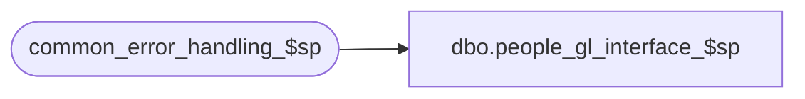

# dbo.people_gl_interface_$sp

**Database:** auditworks_external  
**Server:** bedrockdb01  

## Architecture Diagram



## Table Dependencies

| Referenced Table |
|---|
| common_error_handling_$sp |

## Stored Procedure Code

```sql
create proc [dbo].[people_gl_interface_$sp]
  @period_ending_date		smalldatetime,
@last_date_closed		smalldatetime


AS
/* Proc name:   people_gl_interface_$sp
** Description: 
** 	Called from period_end_$sp.

    *** NOTE : CURRENTLY NOT SUPPORTED IN SYBASE. NEEDS TO BE PORTED FROM ORACLE ***

** HISTORY:
** Date 	Name	Def#	Desc

** Apr19,02 	Winnie	1-CD0IX	R3 error handling
** Mar23,01	Winnie	7450	Check gl_interface_timing for daily GL, move out all the recurring logic of all the GL interface and put it in period end. 
*/
		
DECLARE
	@errmsg 				nvarchar(255),
	@errno 					int,
	@process_no				smallint,
	@message_id		       		int,	
  	@object_name				nvarchar(255),
  	@operation_name				nvarchar(100),
  	@process_name		       		nvarchar(100)
 

SELECT @process_no = 86,
       @errno = 202502,
       @errmsg = 'PeopleSoft Interface is currently not supported in Sybase. Verify gl interface set up.',
       @process_name = 'people_gl_interface_$sp',
       @message_id = 202502
       
GOTO error

RETURN


error:   /* Common error handler */

	EXEC common_error_handling_$sp @process_no, @errno, @errmsg, 0, @message_id, 
	@process_name, @object_name, @operation_name
	RETURN
```

