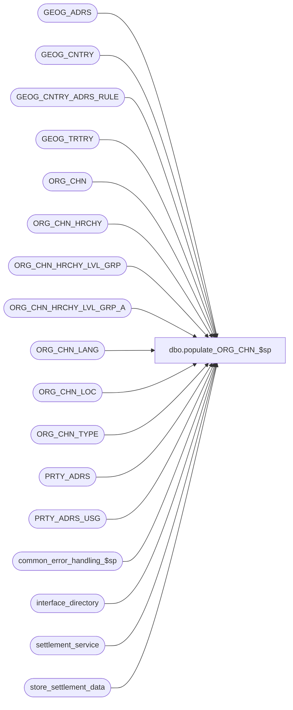

# dbo.populate_ORG_CHN_$sp

**Database:** auditworks_external  
**Server:** bedrockdb01  

## Architecture Diagram



## Table Dependencies

| Referenced Table |
|---|
| GEOG_ADRS |
| GEOG_CNTRY |
| GEOG_CNTRY_ADRS_RULE |
| GEOG_TRTRY |
| ORG_CHN |
| ORG_CHN_HRCHY |
| ORG_CHN_HRCHY_LVL_GRP |
| ORG_CHN_HRCHY_LVL_GRP_A |
| ORG_CHN_LANG |
| ORG_CHN_LOC |
| ORG_CHN_TYPE |
| PRTY_ADRS |
| PRTY_ADRS_USG |
| common_error_handling_$sp |
| interface_directory |
| settlement_service |
| store_settlement_data |

## Stored Procedure Code

```sql
create proc dbo.populate_ORG_CHN_$sp 
@ORG_CHN_NUM		 int,
@ORG_CHN_NAME		 nvarchar(50),
@ORG_CHN_SHRT_NAME	 nvarchar(25),
@ORG_CHN_TYPE_CODE	 nvarchar(4),
@COMP_DATE		 datetime,
@CLS_DATE		 datetime,
@OPEN_DATE		 datetime,
@RPLNSHBL		 numeric(1,0),
@DFLT_CRNCY_CODE		 nchar(3),
@EXTRNL_RFRNC_NUM		 int,
@ADRS_LINE_1		 nvarchar(50),
@ADRS_LINE_2		 nvarchar(50),
@CITY			 nvarchar(50),
@POST_CODE		 nvarchar(15),
@CNTRY_CODE_ISO3		 nchar(3),
@TRTRY_CODE		 nchar(3),
@OPEN_TO_RCV_DATE		 datetime = NULL

AS

/* 
PROC NAME: populate_ORG_CHN_$sp
       DESC: Create/Modify a store in table ORG_CHN.
             Called by Merchandising pipeline segment.

HISTORY:
Date     Name        Def# Desc
Sep04,14 Vicci  TFS-75508 Ensure newly created stores are added to Hierarchies marked as mandatory.
Sep04,14 Vicci  TFS-75678 Correct effective date of address not to include a timestamp, since otherwise the CRDM UI does not see it if the store
                          is viewed today and creates a duplicate primary address for the store with an overlapping effective date.  This integrity
                          issue results in the store_salesaudit view seeing duplicate stores and causes subsequent Coalition Store DCN exports to 
                          fail (among other issues).  Note that this PRTY_ADRS.EFCTV_STRT_DATE is the effective date of the RULE assignment not of the 
                          address.
                          Ensure address changes originating from Merch pipeline are only applied to the primary address, not to all addresses.
Sep04,14 Vicci  TFS-74942, 
                    74930, 
                    74931, 
                    74932 Ensure store name changes are only applied to store areas bearing the store name, not all store areas.
Oct25,13 Ian K   1-4B4W0Z Only update the name in ORG_CHN if there is only one row to prevent duplicate error on index
Sep16,13 Vicci     146692 When the location type of warehouses imported from Merchandising has subsequently been modified in CRDM to support order
                          fulfillment and/or sale transaction processing, avoid overlaying the Location Type upon subsequent imports, i.e. support
                          ORG_CHN_TYPE.SYS_CODE = 'WSTR'.
Sep04,13 Paul    1-4B4W0Z Prevent error due to unique constraint when updating ORG_CHN_LOC when more than one row exists for the store.
Jan17,12 Paul S.   132439 Remove references to CRDM user-defined string datatypes from S/A since CRDM is not changing them to support unicode.
May26,11 Vicci   1-46ZAQ5 In the case of an update request, if the @ORG_CHN_TYPE_CODE code passed in is just a generic system-defined one (such as STR) 
                          and the store is already configured with an ORG_CHN_TYPE of that system-type, do not update the store's ORG_CHN_TYPE since multiple
                          user-defined types with the same system-type may exist and the store's setting may have been overridden in CRDM.
Nov30,10 Paul      122895 add OPEN_TO_RCV_DATE as an optional input parameter (availability depends on release of merch)
Nov24,10 Vicci     122895 Base the default store settlement live flag setting on the settlement interface update timing in Interface Directory.
Jun10,10 Vicci     116790 Change @USER_DEFINED_TYPE_CODE to a LOCAL variable (not input parameter).
Mar29,10 Vicci     116790 Set ORG_CHN_TYPE correctly (needs to be user-defined code where applicable in order to update CRM correctly)
			  Also, insert store_settlement_data where necessary.
May16,07 Paul S.    85471 lookup CNTRY_CODE_ISO3 if a 2 character country code is passed in, validate TRTRY.
Feb09,07 Paul S.    83000 author

*/

DECLARE
        @action			nvarchar(1),
        @errmsg                 nvarchar(2000),
	@errno			int,
        @log_flag               tinyint,
        @message_id             int,
        @object_name            nvarchar(255),
        @old_location_id		int,
        @operation_name         nvarchar(100),
        @process_name           nvarchar(100),
        @process_no             smallint,
        @rows			int,
        @ADRS_RULE_ID		binary(16),
        @LANG_ID			smallint,
        @PRTY_ID			binary(16),
        @ADRS_ID			binary(16),
        @CNTRY_CODE_LOOKUP		nchar(3),
        @TRTRY_valid		tinyint,
        @USER_DEFINED_TYPE_CODE	 nvarchar(4),
        @update_ORG_CHN_TYPE_CODE tinyint,
        @old_ORG_CHN_NAME	nvarchar(50),
        @pass 			int
        
SELECT  @process_name = 'populate_ORG_CHN_$sp',
        @message_id   = 201068,
        @log_flag     = 0,
        @process_no   = 0,
        @action       = 'A',
        @errno        = 0,
        @TRTRY_valid  = 0,
        @ADRS_RULE_ID = NULL,
        @update_ORG_CHN_TYPE_CODE = 1

--use code passed in if it is a user-defined one
SELECT @USER_DEFINED_TYPE_CODE = t.ORG_CHN_TYPE_CODE
  FROM ORG_CHN_TYPE t
 WHERE t.SYS_CODE <> t.ORG_CHN_TYPE_CODE  --user-defined
   AND t.ORG_CHN_TYPE_CODE = @ORG_CHN_TYPE_CODE
SELECT @errno = @@error
IF @errno != 0
BEGIN
  SELECT @errmsg         = 'Failed to determine if ORG_CHN_TYPE_CODE passed in is user-defined or not',
	 @object_name    = 'ORG_CHN_TYPE',
	 @operation_name = 'SELECT'
  GOTO error
END

IF @USER_DEFINED_TYPE_CODE IS NULL  --if code passed in is a system-defined one
BEGIN
  --if code passed in is a system-defined one, check if the store is already configured with an ORG_CHN_TYPE of this system type (or the WSTR hybrid)
  --and if so, don't overlay it with the setting from Merch, since it may have been overriden in CRDM.
  IF EXISTS (SELECT 1
	       FROM ORG_CHN s
                    INNER JOIN ORG_CHN_TYPE t
                       ON s.ORG_CHN_TYPE_CODE = t.ORG_CHN_TYPE_CODE 
              WHERE s.ORG_CHN_NUM = @ORG_CHN_NUM
                AND (t.SYS_CODE = @ORG_CHN_TYPE_CODE 
                     OR (t.SYS_CODE = 'WSTR' AND @ORG_CHN_TYPE_CODE IN ('DC', 'WH'))))
    SELECT @update_ORG_CHN_TYPE_CODE = 0
  ELSE
  BEGIN
  --if code passed in is a system-defined one, check if there is a CRM-standard user-defined which should take precedence   
    SELECT @USER_DEFINED_TYPE_CODE = MAX(t.ORG_CHN_TYPE_CODE)
      FROM ORG_CHN_TYPE t
     WHERE t.SYS_CODE = @ORG_CHN_TYPE_CODE
       AND t.ORG_CHN_TYPE_CODE <> t.SYS_CODE
       AND t.ORG_CHN_TYPE_CODE in ('C', 'E', 'K', 'R')  --CRM standard codes
    SELECT @errno = @@error
    IF @errno != 0
    BEGIN
      SELECT @errmsg         = 'Failed to determine if ORG_CHN_TYPE_CODE has a corresponding CRM user-defined one or not',
     	     @object_name    = 'ORG_CHN_TYPE',
	     @operation_name = 'SELECT'
      GOTO error
    END

    IF @USER_DEFINED_TYPE_CODE IS NULL
    BEGIN
    --if code passed in is a system-defined one, check if there is another single user-defined one which should take precedence   
      SELECT @USER_DEFINED_TYPE_CODE = q.ORG_CHN_TYPE_CODE
        FROM (SELECT t.SYS_CODE, MAX(t.ORG_CHN_TYPE_CODE) ORG_CHN_TYPE_CODE
                FROM ORG_CHN_TYPE t
	       WHERE t.SYS_CODE = @ORG_CHN_TYPE_CODE
	         AND t.ORG_CHN_TYPE_CODE <> t.SYS_CODE
	       GROUP BY t.SYS_CODE
  	      HAVING count(t.ORG_CHN_TYPE_CODE) = 1) q  --i.e. only ONE defined
      SELECT @errno = @@error
      IF @errno != 0
      BEGIN
        SELECT @errmsg         = 'Failed to determine if ORG_CHN_TYPE_CODE has a corresponding SINGLE user-defined one or not',
    	       @object_name    = 'ORG_CHN_TYPE',
	       @operation_name = 'SELECT'
        GOTO error
      END
    END  --IF @USER_DEFINED_TYPE_CODE IS NULL, still NULL after looking for standard CRM codes
  END --ELSE of IF the store is already defined with a an ORG_CHN_TYPE of the same type as that in the update request.
END  --IF @USER_DEFINED_TYPE_CODE IS NULL


SELECT @PRTY_ID = PRTY_ID,
       @old_location_id = EXTRNL_RFRNC_NUM,
       @old_ORG_CHN_NAME = ORG_CHN_NAME
  FROM ORG_CHN
 WHERE ORG_CHN_NUM = @ORG_CHN_NUM

SELECT @errno = @@error,
	@rows = @@rowcount

IF @old_location_id != @EXTRNL_RFRNC_NUM AND @rows > 0
     AND @errno = 0 AND @old_location_id IS NOT NULL -- not allowed to change primary key (should already be prevented by calling object)
       SELECT @errno = 201068

IF @errno != 0
   BEGIN
     SELECT @errmsg         = 'Failed to find store',
           @object_name    = 'ORG_CHN',
           @operation_name = 'SELECT'
     IF @errno = 201068
       SELECT @errmsg = 'Unable to change primary key ORG_CHN_NUM which depends on merch location id key'
     GOTO error
   END	

IF @rows > 0
   SELECT @action = 'M' -- modify existing store

IF LEN(@CNTRY_CODE_ISO3) = 2 -- lookup CNTRY_CODE_ISO3 using CNTRY_CODE_ISO2
BEGIN
  SELECT @CNTRY_CODE_LOOKUP = CNTRY_CODE_ISO3
  FROM GEOG_CNTRY
  WHERE CNTRY_CODE_ISO2 = @CNTRY_CODE_ISO3
  
  SELECT @errno = @@error,
	@rows = @@rowcount
  IF @errno != 0
    BEGIN
     SELECT @errmsg         = 'Failed to find country code',
           @object_name    = 'GEOG_CNTRY',
           @operation_name = 'SELECT'
     GOTO error
    END	

  IF @rows > 0
    SELECT @CNTRY_CODE_ISO3 = @CNTRY_CODE_LOOKUP
END

IF @TRTRY_CODE IS NOT NULL
BEGIN
  IF EXISTS(SELECT 1 FROM GEOG_TRTRY
     WHERE TRTRY_CODE = @TRTRY_CODE AND CNTRY_CODE_ISO3 = @CNTRY_CODE_ISO3)
    SELECT @TRTRY_valid = 1

  IF @TRTRY_valid = 0
    SELECT @TRTRY_CODE = '  ' -- set to default territory code if territory is not valid
END

-- Look up ADRS_RULE_ID using CNTRY_CODE_ISO3
SELECT @ADRS_RULE_ID = ADRS_RULE_ID
  FROM GEOG_CNTRY_ADRS_RULE
 WHERE CNTRY_CODE_ISO3 = @CNTRY_CODE_ISO3


IF @action = 'A' -- add a new store
BEGIN
   SELECT @PRTY_ID = NEWID()
   SELECT @ADRS_ID = NEWID()  

   SELECT @LANG_ID = MIN(LANG_ID) -- default to lowest lang id since do not know lang from merch
     FROM ORG_CHN_LANG 
    
   IF @LANG_ID IS NULL
   SELECT @LANG_ID = 1033

   BEGIN TRAN

   INSERT GEOG_ADRS
     (ADRS_ID, ADRS_LINE_1, ADRS_LINE_2, ADRS_LINE_3, ADRS_LINE_4, CITY,
      POST_CODE, ADRS_MTCH_KEY, CNTRY_CODE_ISO3, TRTRY_CODE, ADRS_RULE_ID)
   VALUES
     (@ADRS_ID, @ADRS_LINE_1, @ADRS_LINE_2, NULL, NULL, @CITY,
      @POST_CODE, NULL, @CNTRY_CODE_ISO3, @TRTRY_CODE, @ADRS_RULE_ID)

   SELECT @errno = @@error
   IF @errno != 0
   BEGIN
     SELECT @errmsg         = 'Failed to create store',
	 @object_name    = 'GEOG_ADRS',
	   @operation_name = 'INSERT'
     GOTO error
   END

   INSERT PRTY_ADRS_USG
     (PRTY_ID, PRTY_ADRS_SEQ, PRTY_ADRS_DESC, ADRS_FNCTN_CODE)
   VALUES
     (@PRTY_ID, 1, @ORG_CHN_NAME, 'PRMY')

   SELECT @errno = @@error
   IF @errno != 0
   BEGIN
     SELECT @errmsg         = 'Failed to create store',
	    @object_name    = 'PRTY_ADRS_USG',
	    @operation_name = 'INSERT'
     GOTO error
   END
   
   INSERT PRTY_ADRS
         (PRTY_ADRS_ID, PRTY_ID, ADRS_ID, PRTY_ADRS_SEQ, EFCTV_STRT_DATE, 
          PRTY_ADRS_DESC, ADRS_FNCTN_CODE)
   SELECT NEWID(), @PRTY_ID, @ADRS_ID, PRTY_ADRS_SEQ, convert(smalldatetime, convert(nvarchar, getdate(), 101)),
          PRTY_ADRS_DESC, ADRS_FNCTN_CODE
   FROM   PRTY_ADRS_USG PAU
   WHERE  PAU.PRTY_ID = @PRTY_ID

   SELECT @errno = @@error
   IF @errno != 0
   BEGIN
     SELECT @errmsg         = 'Failed to create store',
	   @object_name    = 'PRTY_ADRS',
	   @operation_name = 'INSERT'
     GOTO error
   END

   INSERT ORG_CHN
         (ORG_CHN_NUM, PRTY_ID, ORG_CHN_TYPE_CODE, ORG_CHN_NAME, ORG_CHN_SHRT_NAME,
          ACTV, GMT_OFST, COMP_DATE, CLS_DATE, OPEN_DATE, RPLNSHBL,
          DFLT_CRNCY_CODE, DFLT_ADRS_SEQ, VCHR_CNFG_TYPE, EXTRNL_RFRNC_NUM, OPEN_TO_RCV_DATE)
   SELECT @ORG_CHN_NUM, PRTY_ID, COALESCE(@USER_DEFINED_TYPE_CODE, @ORG_CHN_TYPE_CODE), @ORG_CHN_NAME, @ORG_CHN_SHRT_NAME,
          1, 0, @COMP_DATE, @CLS_DATE, @OPEN_DATE, @RPLNSHBL,
          @DFLT_CRNCY_CODE, PRTY_ADRS_SEQ, 'N/A', @EXTRNL_RFRNC_NUM, @OPEN_TO_RCV_DATE
   FROM   PRTY_ADRS_USG PAU
   WHERE  PAU.PRTY_ID = @PRTY_ID
   SELECT @errno = @@error
   IF @errno != 0
   BEGIN
     SELECT @errmsg         = 'Failed to create store',
	   @object_name    = 'ORG_CHN',
	   @operation_name = 'INSERT'
     GOTO error
   END	

   SELECT @pass = 1
   SELECT g.HRCHY_LVL_GRP_ID, g.HRCHY_LVL_ID, g.HRCHY_ID, g.PRNT_HRCHY_LVL_GRP_ID, 0 VRTL, @pass pass_no
     INTO #mandatory_hierarchy_group
     FROM ORG_CHN_HRCHY h
          INNER JOIN ORG_CHN_HRCHY_LVL_GRP g
             ON g.HRCHY_LVL_GRP_ID = h.DFLT_GRP_ID
    WHERE h.MNDTRY_ASGNMNT = 1 AND h.ACTV = 1
   SELECT @rows = @@rowcount,
          @errno = @@error
   IF @errno != 0
   BEGIN
     SELECT @errmsg         = 'Failed to determine if mandatory hierarchies exist',
	    @object_name    = 'ORG_CHN_HRCHY',
	    @operation_name = 'SELECT'
     GOTO error
   END	
    
   IF @rows = 0
     SELECT @pass = 0
   WHILE @rows > 0
   BEGIN
     SELECT @pass = @pass + 1 
   
     INSERT INTO #mandatory_hierarchy_group
     SELECT g.HRCHY_LVL_GRP_ID, g.HRCHY_LVL_ID, g.HRCHY_ID, g.PRNT_HRCHY_LVL_GRP_ID, 1 VRTL, @pass
       FROM #mandatory_hierarchy_group h
            INNER JOIN ORG_CHN_HRCHY_LVL_GRP g
               ON g.HRCHY_LVL_GRP_ID = h.PRNT_HRCHY_LVL_GRP_ID
      WHERE h.pass_no = @pass - 1
     SELECT @rows = @@rowcount,
            @errno = @@error
     IF @errno != 0
     BEGIN
       SELECT @errmsg         = 'Failed to populate list of mandatory hierarchy groups. ',
              @object_name    = '#mandatory_hierarchy_group',
	      @operation_name = 'INSERT'
       GOTO error
     END	
   END  --WHILE @rows > 0, i.e. while parent hierarchy levels exist
    
   IF @pass > 0
   BEGIN
     INSERT INTO ORG_CHN_HRCHY_LVL_GRP_A(HRCHY_LVL_GRP_ID, ORG_CHN_NUM, HRCHY_LVL_ID, HRCHY_ID, VRTL)
     SELECT HRCHY_LVL_GRP_ID, @ORG_CHN_NUM, HRCHY_LVL_ID, HRCHY_ID, VRTL
       FROM #mandatory_hierarchy_group
     SELECT @errno = @@error
     IF @errno != 0
     BEGIN
       SELECT @errmsg         = 'Failed to add new store tomandatory hierarchy groups. ',
              @object_name    = 'ORG_CHN_HRCHY_LVL_GRP_A',
	      @operation_name = 'INSERT'
       GOTO error
     END	
     
     DROP TABLE #mandatory_hierarchy_group
     SELECT @errno = @@error
     IF @errno != 0
     BEGIN
       SELECT @errmsg         = 'Failed to drop list of mandatory hierarchy groups. ',
              @object_name    = '#mandatory_hierarchy_group',
	      @operation_name = 'DROP'
       GOTO error
     END	

   END  --IF @pass > 0

  -- need to insert lang table to avoid gui error
   INSERT ORG_CHN_LANG (ORG_CHN_NUM, LANG_ID, ORG_CHN_NAME, ORG_CHN_SHRT_NAME, STLMNT_BLNG_NAME, TMPLT_DESC)
   SELECT @ORG_CHN_NUM, @LANG_ID, ORG_CHN_NAME, ORG_CHN_SHRT_NAME, STLMNT_BLNG_NAME, TMPLT_DESC
     FROM ORG_CHN oc
    WHERE ORG_CHN_NUM = @ORG_CHN_NUM
   SELECT @errno = @@error
   IF @errno != 0
   BEGIN
     SELECT @errmsg         = 'Failed to create store',
	   @object_name    = 'ORG_CHN_LANG',
	   @operation_name = 'INSERT'
     GOTO error
   END

   INSERT ORG_CHN_LOC(
	LOC_ID,
	ORG_CHN_NUM,
	LOC_DESC,
	SLNG_AREA,
	ACTV)
   VALUES (
	NEWID(),
	@ORG_CHN_NUM,
	@ORG_CHN_NAME,
	0,
	1)

   SELECT @errno = @@error
   IF @errno != 0
   BEGIN
     SELECT @errmsg         = 'Failed to create store',
	   @object_name    = 'ORG_CHN_LOC',
	   @operation_name = 'INSERT'
     GOTO error
   END

   /*  Populate store_settlement_data with default values for new store */
   INSERT store_settlement_data (store_no, interface_id, deposit_source_id, 
                                 store_merchant_id, auth_format, 
                                 store_live_flag, store_live_date) 
   SELECT @ORG_CHN_NUM, ss.interface_id, 0,
          '0',  ss.auth_format_default,
          sign(i.update_timing), ss.store_live_date_default
  FROM settlement_service ss, interface_directory i
    WHERE ss.interface_id = i.interface_id
   AND NOT EXISTS (SELECT 1
    			FROM store_settlement_data
    		       WHERE store_no = @ORG_CHN_NUM) 
   SELECT @errno = @@error
   IF @errno !=0 
   BEGIN
     SELECT @errmsg='Failed to populate store_settlement_data',
	    @object_name    = 'store_settlement_data',
	    @operation_name = 'INSERT'
     GOTO error
   END

   COMMIT
END -- add a new store


IF @action = 'M' -- modify a store
BEGIN

-- ORG_CHN_NUM cannot be modified since it is the primary key
   
   UPDATE ORG_CHN
   SET    ORG_CHN_NAME = @ORG_CHN_NAME, 
          ORG_CHN_SHRT_NAME = @ORG_CHN_SHRT_NAME,
          ORG_CHN_TYPE_CODE = CASE WHEN @update_ORG_CHN_TYPE_CODE = 1 THEN COALESCE(@USER_DEFINED_TYPE_CODE, @ORG_CHN_TYPE_CODE) ELSE ORG_CHN_TYPE_CODE END,
          COMP_DATE = @COMP_DATE, 
          CLS_DATE = @CLS_DATE, 
          OPEN_DATE = @OPEN_DATE, 
          RPLNSHBL = @RPLNSHBL,
          DFLT_CRNCY_CODE = @DFLT_CRNCY_CODE,
          EXTRNL_RFRNC_NUM = @EXTRNL_RFRNC_NUM, -- primary key in merch
          OPEN_TO_RCV_DATE = @OPEN_TO_RCV_DATE
   WHERE ORG_CHN_NUM = @ORG_CHN_NUM

   SELECT @errno = @@error
   IF @errno != 0
   BEGIN
     SELECT @errmsg         = 'Failed to modify store',
	   @object_name    = 'ORG_CHN',
	   @operation_name = 'UPDATE'
     GOTO error
   END

   IF @ORG_CHN_NAME <> @old_ORG_CHN_NAME
   BEGIN 
   
     UPDATE PRTY_ADRS_USG
        SET PRTY_ADRS_DESC = @ORG_CHN_NAME
      WHERE PRTY_ID = @PRTY_ID
     SELECT @errno = @@error
     IF @errno != 0
     BEGIN
       SELECT @errmsg         = 'Failed to modify store name',
  	     @object_name    = 'PRTY_ADRS_USG',
	     @operation_name = 'UPDATE'
       GOTO error
     END

     UPDATE PRTY_ADRS
        SET PRTY_ADRS_DESC = @ORG_CHN_NAME
      WHERE PRTY_ID = @PRTY_ID
     SELECT @errno = @@error
     IF @errno != 0
     BEGIN
       SELECT @errmsg         = 'Failed to modify store name',
  	      @object_name    = 'PRTY_ADRS',
	      @operation_name = 'UPDATE'
       GOTO error
     END

   /* CRDM allows more than one location per store but enforces uniqueness on the combination of ORG_CHN_NUM and LOC_DESC.
      Epicor Merch only has one location per store.
      If more than one location exists for the store (means that locations were created/modified using CRDM tm),
       then do not overlay the LOC_DESC here (descriptions would need to be changed using CRDM tm in that case)
       unless only one location is active. */

     SELECT @rows = COUNT(1)
       FROM ORG_CHN_LOC
      WHERE ORG_CHN_NUM = @ORG_CHN_NUM
        AND ACTV = 1
        AND LOC_DESC = @old_ORG_CHN_NAME

     IF @rows = 1
     BEGIN
        /* don't expect to find an inactive row like this, but change LOC_DESC just in case (to prevent unique constraint error).
           This is a workaround to a flaw in the CRDM constraint. */
       UPDATE ORG_CHN_LOC
          SET LOC_DESC = LOC_DESC + CONVERT(nvarchar, DATEPART(dd,getdate()))
        WHERE ORG_CHN_NUM = @ORG_CHN_NUM
          AND ACTV = 0
          AND LOC_DESC = @ORG_CHN_NAME
       SELECT @errno = @@error
       IF @errno != 0
       BEGIN
         SELECT @errmsg         = 'Failed to update inactive location with same name',
	        @object_name    = 'ORG_CHN_LOC',
	       @operation_name = 'UPDATE'
         GOTO error
       END 

       UPDATE ORG_CHN_LOC
          SET LOC_DESC = @ORG_CHN_NAME
        WHERE ORG_CHN_NUM = @ORG_CHN_NUM
          AND ACTV = 1
          AND LOC_DESC = @old_ORG_CHN_NAME
          AND NOT EXISTS (SELECT 1 FROM ORG_CHN_LOC WHERE ORG_CHN_NUM = @ORG_CHN_NUM AND ACTV = 1 AND LOC_DESC = @ORG_CHN_NAME)
       SELECT @errno = @@error
       IF @errno != 0
       BEGIN
         SELECT @errmsg         = 'Failed to modify store name',
	        @object_name    = 'ORG_CHN_LOC',
	        @operation_name = 'UPDATE'
         GOTO error
       END 
     END -- If @rows = 1
   END --IF @ORG_CHN_NAME <> @old_ORG_CHN_NAME
   
   UPDATE GEOG_ADRS
      SET ADRS_LINE_1 = @ADRS_LINE_1,
          ADRS_LINE_2 = @ADRS_LINE_2,
          CITY = @CITY,
          POST_CODE = @POST_CODE,
          CNTRY_CODE_ISO3 = @CNTRY_CODE_ISO3,
          TRTRY_CODE = @TRTRY_CODE,
          ADRS_RULE_ID = @ADRS_RULE_ID
     FROM GEOG_ADRS ga, PRTY_ADRS pa
    WHERE  ga.ADRS_ID = pa.ADRS_ID
      AND  pa.PRTY_ID = @PRTY_ID
      AND  pa.ADRS_FNCTN_CODE = 'PRMY'
   SELECT @errno = @@error
   IF @errno != 0
   BEGIN
     SELECT @errmsg         = 'Failed to modify store address',
 	    @object_name    = 'GEOG_ADRS',
	    @operation_name = 'UPDATE'
     GOTO error
   END
END -- modify a store

RETURN 0

error:
  
  EXEC common_error_handling_$sp @process_no, @errno, @errmsg, 0, @message_id,
                                 @process_name, @object_name, @operation_name, @log_flag
  RETURN 1
```

