# dbo.populate_external_archive_$sp

**Database:** auditworks_external  
**Server:** bedrockdb01  

## Architecture Diagram

```mermaid
flowchart LR
    SP["dbo.populate_external_archive_$sp"]
    auditworks_parameter(["auditworks_parameter"]) --> SP
    av_authorization_detail(["av_authorization_detail"]) --> SP
    av_customer(["av_customer"]) --> SP
    av_customer_detail(["av_customer_detail"]) --> SP
    av_discount_detail(["av_discount_detail"]) --> SP
    av_exception_reason(["av_exception_reason"]) --> SP
    av_if_rejection_reason(["av_if_rejection_reason"]) --> SP
    av_interface_control(["av_interface_control"]) --> SP
    av_payroll_detail(["av_payroll_detail"]) --> SP
    av_post_void_detail(["av_post_void_detail"]) --> SP
    av_return_detail(["av_return_detail"]) --> SP
    av_special_order_detail(["av_special_order_detail"]) --> SP
    av_stock_control_detail(["av_stock_control_detail"]) --> SP
    av_tax_detail(["av_tax_detail"]) --> SP
    av_tax_override_detail(["av_tax_override_detail"]) --> SP
    av_transaction_header(["av_transaction_header"]) --> SP
    av_transaction_line(["av_transaction_line"]) --> SP
    av_transaction_line_link(["av_transaction_line_link"]) --> SP
    common_error_handling__sp(["common_error_handling_$sp"]) --> SP
    ex_authorization_detail(["ex_authorization_detail"]) --> SP
    ex_customer(["ex_customer"]) --> SP
    ex_customer_detail(["ex_customer_detail"]) --> SP
    ex_discount_detail(["ex_discount_detail"]) --> SP
    ex_exception_reason(["ex_exception_reason"]) --> SP
    ex_if_rejection_reason(["ex_if_rejection_reason"]) --> SP
    ex_interface_control(["ex_interface_control"]) --> SP
    ex_line_note(["ex_line_note"]) --> SP
    ex_payroll_detail(["ex_payroll_detail"]) --> SP
    ex_post_void_detail(["ex_post_void_detail"]) --> SP
    ex_return_detail(["ex_return_detail"]) --> SP
    ex_special_order_detail(["ex_special_order_detail"]) --> SP
    ex_stock_control_detail(["ex_stock_control_detail"]) --> SP
    ex_tax_detail(["ex_tax_detail"]) --> SP
    ex_tax_override_detail(["ex_tax_override_detail"]) --> SP
    ex_transaction_header(["ex_transaction_header"]) --> SP
    ex_transaction_line(["ex_transaction_line"]) --> SP
    ex_transaction_line_link(["ex_transaction_line_link"]) --> SP
    tran_id_datatype(["tran_id_datatype"]) --> SP
    work_ext_copy(["work_ext_copy"]) --> SP
    work_ext_copy_trans(["work_ext_copy_trans"]) --> SP
    work_purge_av_detail(["work_purge_av_detail"]) --> SP
```



## Table Dependencies

| Referenced Table |
|---|
| auditworks_parameter |
| av_authorization_detail |
| av_customer |
| av_customer_detail |
| av_discount_detail |
| av_exception_reason |
| av_if_rejection_reason |
| av_interface_control |
| av_payroll_detail |
| av_post_void_detail |
| av_return_detail |
| av_special_order_detail |
| av_stock_control_detail |
| av_tax_detail |
| av_tax_override_detail |
| av_transaction_header |
| av_transaction_line |
| av_transaction_line_link |
| common_error_handling_$sp |
| ex_authorization_detail |
| ex_customer |
| ex_customer_detail |
| ex_discount_detail |
| ex_exception_reason |
| ex_if_rejection_reason |
| ex_interface_control |
| ex_line_note |
| ex_payroll_detail |
| ex_post_void_detail |
| ex_return_detail |
| ex_special_order_detail |
| ex_stock_control_detail |
| ex_tax_detail |
| ex_tax_override_detail |
| ex_transaction_header |
| ex_transaction_line |
| ex_transaction_line_link |
| tran_id_datatype |
| work_ext_copy |
| work_ext_copy_trans |
| work_purge_av_detail |

## Stored Procedure Code

```sql
create proc dbo.populate_external_archive_$sp @min_transaction_date   smalldatetime,
@max_transaction_date   smalldatetime
       
AS

  /*
      Proc Name : populate_external_archive_$sp
      Description : Copy pending purge transactions to external archive database prior to purge.
                    Called from purge_archive_details_$sp.

HISTORY :
Date     Name         Defect# Description
Apr13,15 Phu           115270 Performance tuning in recovery mode
Feb17,15 Paul           94760 improve performance, improved error recovery, use try catch, use top command for compatability with SQL 2014,
                               added date range variables for partitioned performance.
Jun01,14 Ian K                Initial Creation

*/

DECLARE 
  @abort_flag        int,
  @errmsg            nvarchar(2000),
  @errmsg2           nvarchar(2000),
  @errline           int,
  @errno             int,
  @message_id        int,
  @object_name       nvarchar(255),
  @operation_name    nvarchar(100),
  @process_name      nvarchar(100),
  @process_no        int,
  @process_timestamp int,
  @recovery_qty      int,
  @table_name        nvarchar(100),
  @rows_per_batch    int,
  @rows              int,
  @max_tran_id       tran_id_datatype,
  @min_tran_id       tran_id_datatype,
  @rows_inserted     int;

  SELECT @process_name = 'populate_external_archive_$sp',
      @process_timestamp = 0,
      @abort_flag = 0,
      @message_id = 201068;
      
BEGIN TRY

  /* Get number of rows to process each time */
      SELECT @errmsg = 'Unable to select from auditworks_parameter (rows_per_batch)',
	     @object_name = 'auditworks_parameter',
	     @operation_name = 'SELECT';  
  SELECT @rows_per_batch = CONVERT(integer,ISNULL(par_value,'10000'))
    FROM auditworks_parameter
   WHERE par_name = 'rows_per_batch';

      SELECT @errmsg = 'Unable to select in and max tran id from work_purge_av_detail',
	     @object_name = 'work_purge_av_detail',
	     @operation_name = 'SELECT';  
  SELECT @min_tran_id = MIN(av_transaction_id),
         @max_tran_id = MAX(av_transaction_id)
    FROM work_purge_av_detail WITH (NOLOCK);

  SET XACT_ABORT ON;
     
  /*
     Look for a list of transactions that may already exist in external table, in the event of error recovery.
     This should normally find no rows. If no rows for the range exist in ex_transaction_header, then no
     rows can yet exist in the ex* detail tables either since header is inserted first.
     Using transaction_date in query for efficient partition search.
  */

     SELECT @errmsg = 'Unable to truncate table work_ext_copy_trans',
           @object_name = 'work_ext_copy_trans',
           @operation_name = 'TRUNCATE'; 
  TRUNCATE TABLE work_ext_copy_trans;

     SELECT @errmsg = 'Unable to test ex_transaction_header for duplicates',
           @object_name = 'ex_transaction_header',
           @operation_name = 'SELECT'; 
  INSERT INTO work_ext_copy_trans
    SELECT w.av_transaction_id
	    FROM ex_transaction_header h, work_purge_av_detail w
     WHERE h.av_transaction_id >= @min_tran_id -- use range query to improve query plan for cross-server joins
       AND h.av_transaction_id <= @max_tran_id
       AND h.av_transaction_id = w.av_transaction_id
       AND h.transaction_date >= @min_transaction_date
       AND h.transaction_date <= @max_transaction_date;

  SELECT @recovery_qty = @@rowcount;
   /* If no existing rows were found in ex header, then there will be no need to search for existing rows in ex details */

  /* Now insert the next batch of ex_header records */

  SELECT @rows_inserted = @rows_per_batch;

  WHILE @rows_inserted = @rows_per_batch
    BEGIN
        TRUNCATE TABLE work_ext_copy;

       /* get a list of tran to insert, excluding those that already exist in external archive */
          SELECT @errmsg = 'Unable to get next batch from work_purge_av_detail for av_transaction_header',
                 @object_name = 'av_transaction_header',
                 @operation_name = 'DELETE'  
      INSERT INTO work_ext_copy
      SELECT TOP (@rows_per_batch) av_transaction_id
      FROM work_purge_av_detail
       WHERE av_transaction_id NOT IN (SELECT av_transaction_id
                                         FROM work_ext_copy_trans)
         AND av_transaction_id >= @min_tran_id -- use range query to improve query plan
         AND av_transaction_id <= @max_tran_id;
     
      SELECT @rows_inserted = @@rowcount;

      /* Post transaction details across to external database */
         SELECT @errmsg = 'Unable to insert into ex_transaction_header ',
               @object_name = 'ex_transaction_header',
               @operation_name = 'INSERT';      
      INSERT INTO ex_transaction_header 
        SELECT ah.* 
          FROM work_ext_copy w, av_transaction_header ah
         WHERE w.av_transaction_id = ah.av_transaction_id
           AND ah.transaction_date >= @min_transaction_date
           AND ah.transaction_date <= @max_transaction_date;
          
  /* Update transactions processed table with current records */
         SELECT @errmsg = 'Unable to update transactions processed table with current records ',
               @object_name = 'work_ext_copy_trans',
               @operation_name = 'INSERT';      

      BEGIN TRANSACTION;
      INSERT INTO work_ext_copy_trans
      SELECT av_transaction_id
        FROM work_ext_copy;
      COMMIT;

  END; -- @rows_inserted for header
 

  /* av_authorization_detail */

  /* Get list of any transactions already in external table so we do not reprocess them */

  TRUNCATE TABLE work_ext_copy_trans;

  IF @recovery_qty > 0
  BEGIN
     SELECT @errmsg = 'Unable to test ex_authorization_detail for duplicates',
           @object_name = 'ex_authorization_detail',
           @operation_name = 'SELECT';
  INSERT INTO work_ext_copy_trans
    SELECT DISTINCT w.av_transaction_id
      FROM work_purge_av_detail w, ex_authorization_detail h
     WHERE h.av_transaction_id = w.av_transaction_id
       AND h.av_transaction_id >= @min_tran_id -- use range query to improve query plan for cross-server joins
       AND h.av_transaction_id <= @max_tran_id
       AND h.transaction_date >= @min_transaction_date
       AND h.transaction_date <= @max_transaction_date;
     SELECT @recovery_qty = @@rowcount;
  END; -- recovery

  /* Now insert the next batch of ex_header records */

  SELECT @rows_inserted = @rows_per_batch;

  WHILE @rows_inserted = @rows_per_batch
    BEGIN
  
      TRUNCATE TABLE work_ext_copy;

           SELECT @errmsg = 'Unable to get next batch from work_purge_av_detail for av_authorization_detail',
                 @object_name = 'av_authorization_detail',
                 @operation_name = 'DELETE';
      INSERT INTO work_ext_copy
      SELECT TOP (@rows_per_batch) av_transaction_id
        FROM work_purge_av_detail wp
       WHERE NOT EXISTS (SELECT 1 FROM work_ext_copy_trans we
                         WHERE wp.av_transaction_id = we.av_transaction_id)
         AND av_transaction_id >= @min_tran_id -- use range query to improve query plan
         AND av_transaction_id <= @max_tran_id;
         
      SELECT @rows_inserted = @@rowcount;
  
      /* Post transaction details across to external database */
        SELECT @errmsg = 'Unable to insert into ex_authorization_detail ',
               @object_name = 'ex_authorization_detail',
               @operation_name = 'INSERT';      
      INSERT INTO ex_authorization_detail 
        SELECT ad.* 
          FROM work_ext_copy we, av_authorization_detail ad
         WHERE we.av_transaction_id = ad.av_transaction_id
           AND ad.transaction_date >= @min_transaction_date
           AND ad.transaction_date <= @max_transaction_date;
           
      /* Update transactions processed table with current records */
        SELECT @errmsg = 'Unable to update transactions processed table with current records ',
               @object_name = 'work_ext_copy_trans',
               @operation_name = 'INSERT';      

      BEGIN TRANSACTION;
      INSERT INTO work_ext_copy_trans
      SELECT av_transaction_id
        FROM work_ext_copy;
      COMMIT;

  END;

  /* av_customer */

  /* Get list of transactions already in external  table so we do not reprocess them */
  
  TRUNCATE TABLE work_ext_copy_trans;

  IF @recovery_qty > 0
  BEGIN
     SELECT @errmsg = 'Unable to test ex_transaction_header for duplicates',
           @object_name = 'ex_customer',
           @operation_name = 'SELECT'; 
  INSERT INTO work_ext_copy_trans
    SELECT DISTINCT w.av_transaction_id
	    FROM ex_customer h, work_purge_av_detail w
     WHERE h.av_transaction_id >= @min_tran_id -- use range query to improve query plan for cross-server joins
       AND h.av_transaction_id <= @max_tran_id
       AND h.av_transaction_id = w.av_transaction_id
       AND h.transaction_date >= @min_transaction_date
       AND h.transaction_date <= @max_transaction_date;
     SELECT @recovery_qty = @@rowcount;
  END;
  /* Now insert the next batch of ex_header records */

  SELECT @rows_inserted = @rows_per_batch;

  WHILE @rows_inserted = @rows_per_batch
    BEGIN    
  
        TRUNCATE TABLE work_ext_copy;

          SELECT @errmsg = 'Unable to get next batch from work_purge_av_detail for av_customer',
                 @object_name = 'av_customer',
                 @operation_name = 'DELETE';  
      INSERT INTO work_ext_copy
      SELECT TOP (@rows_per_batch) av_transaction_id
        FROM work_purge_av_detail
       WHERE av_transaction_id NOT IN (SELECT av_transaction_id
                                         FROM work_ext_copy_trans)
         AND av_transaction_id >= @min_tran_id -- use range query to improve query plan
         AND av_transaction_id <= @max_tran_id;
         
      SELECT @rows_inserted = @@rowcount;
  
      /* Post transaction details across to external database */
        SELECT @errmsg = 'Unable to insert into ex_customer ',
               @object_name = 'ex_transaction_header',
               @operation_name = 'INSERT';      
      INSERT INTO ex_customer 
        SELECT ac.* 
          FROM work_ext_copy w, av_customer ac
         WHERE w.av_transaction_id = ac.av_transaction_id
           AND ac.transaction_date >= @min_transaction_date
           AND ac.transaction_date <= @max_transaction_date;
           
      /* Update transactions processed table with current records */
        SELECT @errmsg = 'Unable to update transactions processed table with current records ',
               @object_name = 'work_ext_copy_trans',
               @operation_name = 'INSERT';      

      BEGIN TRANSACTION;
      INSERT INTO work_ext_copy_trans
      SELECT av_transaction_id
        FROM work_ext_copy;
        
      COMMIT;
   
  END; -- While

  
  /* av_customer_detail */

   /* Get list of transactions already in external  table so we do not reprocess them */
  
  TRUNCATE TABLE work_ext_copy_trans;

  IF @recovery_qty > 0
  BEGIN
     SELECT @errmsg = 'Unable to test ex_transaction_header for duplicates',
           @object_name = 'ex_customer',
           @operation_name = 'SELECT'; 
  INSERT INTO work_ext_copy_trans
    SELECT DISTINCT w.av_transaction_id
	    FROM ex_customer_detail h, work_purge_av_detail w
     WHERE h.av_transaction_id >= @min_tran_id -- use range query to improve query plan for cross-server joins
       AND h.av_transaction_id <= @max_tran_id
       AND h.av_transaction_id = w.av_transaction_id
       AND h.transaction_date >= @min_transaction_date
       AND h.transaction_date <= @max_transaction_date;
     SELECT @recovery_qty = @@rowcount;
  END;
  /* Now insert the next batch of ex_header records */

  SELECT @rows_inserted = @rows_per_batch;

  WHILE @rows_inserted = @rows_per_batch
    BEGIN
  
      TRUNCATE TABLE work_ext_copy;

          SELECT @errmsg = 'Unable to get next batch from work_purge_av_detail for av_customer_detail',
                 @object_name = 'av_customer_detail',
                 @operation_name = 'DELETE';  
      INSERT INTO work_ext_copy
      SELECT TOP (@rows_per_batch) av_transaction_id
        FROM work_purge_av_detail
       WHERE av_transaction_id NOT IN (SELECT av_transaction_id
                                         FROM work_ext_copy_trans)
         AND av_transaction_id >= @min_tran_id -- use range query to improve query plan
         AND av_transaction_id <= @max_tran_id;
         
      SELECT @rows_inserted = @@rowcount;
  
      /* Post transaction details across to external database */
        SELECT @errmsg = 'Unable to insert into ex_customer_detail ',
               @object_name = 'ex_customer_detail',
               @operation_name = 'INSERT';     
      INSERT INTO ex_customer_detail 
        SELECT ac.* 
          FROM work_ext_copy w, av_customer_detail ac
         WHERE w.av_transaction_id = ac.av_transaction_id
           AND ac.transaction_date >= @min_transaction_date
           AND ac.transaction_date <= @max_transaction_date;
            
      /* Update transactions processed table with current records */
        SELECT @errmsg = 'Unable to update transactions processed table with current records ',
         @object_name = 'work_ext_copy_trans',
               @operation_name = 'INSERT';      

      BEGIN TRANSACTION;
      INSERT INTO work_ext_copy_trans
      SELECT av_transaction_id
        FROM work_ext_copy;
      
      COMMIT;
  
  END; -- While

  /* av_discount_detail */

   /* Get list of transactions already in external  table so we do not reprocess them */
  
    TRUNCATE TABLE work_ext_copy_trans;

  IF @recovery_qty > 0
  BEGIN  
      SELECT @errmsg = 'Unable to test ex_discount_detail for duplicates',
           @object_name = 'ex_discount_detail',
           @operation_name = 'SELECT';
    INSERT INTO work_ext_copy_trans
    SELECT DISTINCT w.av_transaction_id
	    FROM ex_discount_detail h, work_purge_av_detail w
     WHERE h.av_transaction_id >= @min_tran_id -- use range query to improve query plan for cross-server joins
       AND h.av_transaction_id <= @max_tran_id
       AND h.av_transaction_id = w.av_transaction_id
       AND h.transaction_date >= @min_transaction_date
       AND h.transaction_date <= @max_transaction_date;
     SELECT @recovery_qty = @@rowcount;
  END;
  /* Now insert the next batch of ex_header records */

  SELECT @rows_inserted = @rows_per_batch;

  WHILE @rows_inserted = @rows_per_batch
    BEGIN

          SELECT @errmsg = 'Unable to get next batch from work_purge_av_detail for av_discount_detail',
                 @object_name = 'av_discount_detail',
                 @operation_name = 'DELETE';  
      TRUNCATE TABLE work_ext_copy;
    
      INSERT INTO work_ext_copy
      SELECT TOP (@rows_per_batch) av_transaction_id
        FROM work_purge_av_detail
       WHERE av_transaction_id NOT IN (SELECT av_transaction_id
                                         FROM work_ext_copy_trans)
         AND av_transaction_id >= @min_tran_id -- use range query to improve query plan
         AND av_transaction_id <= @max_tran_id;
         
      SELECT @rows_inserted = @@rowcount;
  
      /* Post transaction details across to external database */
        SELECT @errmsg = 'Unable to insert into ex_discount_detail ',
               @object_name = 'ex_discount_detail',
               @operation_name = 'INSERT';     
      INSERT INTO ex_discount_detail 
        SELECT ad.* 
          FROM work_ext_copy w, av_discount_detail ad
         WHERE w.av_transaction_id = ad.av_transaction_id
           AND ad.transaction_date >= @min_transaction_date
           AND ad.transaction_date <= @max_transaction_date;;
             
      /* Update transactions processed table with current records */
        SELECT @errmsg = 'Unable to update transactions processed table with current records ',
               @object_name = 'work_ext_copy_trans',
               @operation_name = 'INSERT';     

      BEGIN TRANSACTION;
      INSERT INTO work_ext_copy_trans
      SELECT av_transaction_id
        FROM work_ext_copy;
      
      COMMIT;
  
  END; -- While
  
  /* av_line_note */

   /* Get list of transactions already in external  table so we do not reprocess them */

  
  TRUNCATE TABLE work_ext_copy_trans;

  IF @recovery_qty > 0
  BEGIN
    SELECT @errmsg = 'Unable to test ex_discount_detail for duplicates',
           @object_name = 'ex_discount_detail',
           @operation_name = 'SELECT'; 
    INSERT INTO work_ext_copy_trans
    SELECT DISTINCT w.av_transaction_id
	    FROM ex_line_note h, work_purge_av_detail w
     WHERE h.av_transaction_id >= @min_tran_id -- use range query to improve query plan for cross-server joins
       AND h.av_transaction_id <= @max_tran_id
       AND h.av_transaction_id = w.av_transaction_id
       AND h.transaction_date >= @min_transaction_date
       AND h.transaction_date <= @max_transaction_date;
     SELECT @recovery_qty = @@rowcount;
  END;
  /* Now insert the next batch of ex_line_note records */

  SELECT @rows_inserted = @rows_per_batch;

  WHILE @rows_inserted = @rows_per_batch
    BEGIN
  
      TRUNCATE TABLE work_ext_copy;

          SELECT @errmsg = 'Unable to get next batch from work_purge_av_detail for av_line_note',
                 @object_name = 'av_line_note',
                 @operation_name = 'DELETE';   
      INSERT INTO work_ext_copy
      SELECT TOP (@rows_per_batch) av_transaction_id
        FROM work_purge_av_detail
       WHERE av_transaction_id NOT IN (SELECT av_transaction_id
                                   FROM work_ext_copy_trans)
         AND av_transaction_id >= @min_tran_id -- use range query to improve query plan
         AND av_transaction_id <= @max_tran_id;

      SELECT @rows_inserted = @@rowcount;
 
      /* Post transaction details across to external database */
        SELECT @errmsg = 'Unable to insert into ex_line_note ',
               @object_name = 'ex_line_note',
               @operation_name = 'INSERT';      
      INSERT INTO ex_line_note 
        SELECT ln.* 
          FROM work_ext_copy w, ex_line_note ln
         WHERE w.av_transaction_id = ln.av_transaction_id
           AND ln.transaction_date >= @min_transaction_date
           AND ln.transaction_date <= @max_transaction_date;
             
      /* Update transactions processed table with current records */
        SELECT @errmsg = 'Unable to update transactions processed table with current records ',
               @object_name = 'work_ext_copy_trans',
               @operation_name = 'INSERT';     

      BEGIN TRANSACTION;
      INSERT INTO work_ext_copy_trans
      SELECT av_transaction_id
        FROM work_ext_copy;
     
      COMMIT;
  
  END; -- While
  
  /* av_payroll_detail */

   /* Get list of transactions already in external  table so we do not reprocess them */
  
  TRUNCATE TABLE work_ext_copy_trans;

  IF @recovery_qty > 0
  BEGIN
      SELECT @errmsg = 'Unable to test ex_discount_detail for duplicates',
           @object_name = 'ex_payroll_detail',
           @operation_name = 'SELECT';  
    INSERT INTO work_ext_copy_trans
    SELECT DISTINCT w.av_transaction_id
	    FROM ex_payroll_detail h, work_purge_av_detail w
     WHERE h.av_transaction_id >= @min_tran_id -- use range query to improve query plan for cross-server joins
       AND h.av_transaction_id <= @max_tran_id
       AND h.av_transaction_id = w.av_transaction_id
       AND h.transaction_date >= @min_transaction_date
       AND h.transaction_date <= @max_transaction_date;
     SELECT @recovery_qty = @@rowcount;
  END;
  /* Now insert the next batch of ex_payroll_detail records */

  SELECT @rows_inserted = @rows_per_batch;

  WHILE @rows_inserted = @rows_per_batch
    BEGIN
  
      TRUNCATE TABLE work_ext_copy;

          SELECT @errmsg = 'Unable to get next batch from work_purge_av_detail for av_payroll_detail',
                 @object_name = 'av_payroll_detail',
                 @operation_name = 'DELETE';    
      INSERT INTO work_ext_copy
      SELECT TOP (@rows_per_batch) av_transaction_id
        FROM work_purge_av_detail
       WHERE av_transaction_id NOT IN (SELECT av_transaction_id
                                         FROM work_ext_copy_trans)
         AND av_transaction_id >= @min_tran_id -- use range query to improve query plan
         AND av_transaction_id <= @max_tran_id;
         
      SELECT @rows_inserted = @@rowcount;
 
      /* Post transaction details across to external database */
        SELECT @errmsg = 'Unable to insert into ex_payroll_detail ',
               @object_name = 'ex_payroll_detail',
               @operation_name = 'INSERT';     
      INSERT INTO ex_payroll_detail 
        SELECT pd.* 
          FROM work_ext_copy w, av_payroll_detail pd
         WHERE w.av_transaction_id = pd.av_transaction_id
           AND pd.transaction_date >= @min_transaction_date
           AND pd.transaction_date <= @max_transaction_date;
             
      /* Update transactions processed table with current records */
        SELECT @errmsg = 'Unable to update transactions processed table with current records ',
               @object_name = 'work_ext_copy_trans',
               @operation_name = 'INSERT';      

      BEGIN TRANSACTION;
      INSERT INTO work_ext_copy_trans
      SELECT av_transaction_id
        FROM work_ext_copy;
     
      COMMIT;
  
  END; -- While
  

  /* av_post_void_detail */

   /* Get list of transactions already in external  table so we do not reprocess them */

  TRUNCATE TABLE work_ext_copy_trans;

  IF @recovery_qty > 0
  BEGIN
    SELECT @errmsg = 'Unable to test ex_discount_detail for duplicates',
           @object_name = 'ex_post_void_detail',
           @operation_name = 'SELECT'; 
    INSERT INTO work_ext_copy_trans
    SELECT DISTINCT w.av_transaction_id
	    FROM ex_post_void_detail h, work_purge_av_detail w
     WHERE h.av_transaction_id >= @min_tran_id -- use range query to improve query plan for cross-server joins
       AND h.av_transaction_id <= @max_tran_id
       AND h.av_transaction_id = w.av_transaction_id
       AND h.transaction_date >= @min_transaction_date
       AND h.transaction_date <= @max_transaction_date;
     SELECT @recovery_qty = @@rowcount;
  END;
  /* Now insert the next batch of ex_post_void_detail records */

  SELECT @rows_inserted = @rows_per_batch;

  WHILE @rows_inserted = @rows_per_batch
    BEGIN
  
      TRUNCATE TABLE work_ext_copy;
    
          SELECT @errmsg = 'Unable to get next batch from work_purge_av_detail for av_post_void_detail',
                 @object_name = 'av_post_void_detail',
                 @operation_name = 'DELETE';
      INSERT INTO work_ext_copy
      SELECT TOP (@rows_per_batch) av_transaction_id
        FROM work_purge_av_detail
       WHERE av_transaction_id NOT IN (SELECT av_transaction_id
                                         FROM work_ext_copy_trans)
         AND av_transaction_id >= @min_tran_id -- use range query to improve query plan
         AND av_transaction_id <= @max_tran_id;
         
      SELECT @rows_inserted = @@rowcount;
  
      /* Post transaction details across to external database */
        SELECT @errmsg = 'Unable to insert into ex_post_void_detail ',
               @object_name = 'ex_post_void_detail',
               @operation_name = 'INSERT';     
      INSERT INTO ex_post_void_detail 
        SELECT pv.* 
          FROM work_ext_copy w, av_post_void_detail pv
         WHERE w.av_transaction_id = pv.av_transaction_id
           AND pv.transaction_date >= @min_transaction_date
           AND pv.transaction_date <= @max_transaction_date;
            
      /* Update transactions processed table with current records */
        SELECT @errmsg = 'Unable to update transactions processed table with current records ',
               @object_name = 'work_ext_copy_trans',
               @operation_name = 'INSERT';      

      BEGIN TRANSACTION;
      INSERT INTO work_ext_copy_trans
      SELECT av_transaction_id
        FROM work_ext_copy;
     
      COMMIT;
  
  END; -- While
  
 
  /* av_return_detail */

   /* Get list of transactions already in external  table so we do not reprocess them */

  TRUNCATE TABLE work_ext_copy_trans;

  IF @recovery_qty > 0
  BEGIN
    SELECT @errmsg = 'Unable to test ex_return_detail for duplicates',
           @object_name = 'ex_return_detail',
           @operation_name = 'SELECT'; 
    INSERT INTO work_ext_copy_trans
    SELECT DISTINCT w.av_transaction_id
	    FROM ex_return_detail h, work_purge_av_detail w
     WHERE h.av_transaction_id >= @min_tran_id -- use range query to improve query plan for cross-server joins
       AND h.av_transaction_id <= @max_tran_id
       AND h.av_transaction_id = w.av_transaction_id
       AND h.transaction_date >= @min_transaction_date
       AND h.transaction_date <= @max_transaction_date;
     SELECT @recovery_qty = @@rowcount;
  END;
  /* Now insert the next batch of ex_return_detail records */

  SELECT @rows_inserted = @rows_per_batch;

  WHILE @rows_inserted = @rows_per_batch
  BEGIN
  
      TRUNCATE TABLE work_ext_copy;

          SELECT @errmsg = 'Unable to get next batch from work_purge_av_detail for av_return_detail',
                 @object_name = 'av_return_detail',
                 @operation_name = 'DELETE';   
      INSERT INTO work_ext_copy
      SELECT TOP (@rows_per_batch) av_transaction_id
        FROM work_purge_av_detail
       WHERE av_transaction_id NOT IN (SELECT av_transaction_id
                                         FROM work_ext_copy_trans)
         AND av_transaction_id >= @min_tran_id -- use range query to improve query plan
         AND av_transaction_id <= @max_tran_id;
         
      SELECT @rows_inserted = @@rowcount;
  
      /* Post transaction details across to external database */
        SELECT @errmsg = 'Unable to insert into ex_return_detail ',
               @object_name = 'ex_return_detail',
               @operation_name = 'INSERT';      
      INSERT INTO ex_return_detail 
        SELECT rd.* 
          FROM work_ext_copy w, av_return_detail rd 
         WHERE w.av_transaction_id = rd.av_transaction_id
           AND rd.transaction_date >= @min_transaction_date
           AND rd.transaction_date <= @max_transaction_date;
           
      /* Update transactions processed table with current records */
        SELECT @errmsg = 'Unable to update transactions processed table with current records ',
               @object_name = 'work_ext_copy_trans',
               @operation_name = 'INSERT';     

      BEGIN TRANSACTION;
      INSERT INTO work_ext_copy_trans
      SELECT av_transaction_id
        FROM work_ext_copy;

      COMMIT;
  
  END; -- While
 

  /* av_special_order_detail */

   /* Get list of transactions already in external  table so we do not reprocess them */

  TRUNCATE TABLE work_ext_copy_trans;

  IF @recovery_qty > 0
  BEGIN
       SELECT @errmsg = 'Unable to test ex_special_order_detail for duplicates',
           @object_name = 'ex_special_order_detail',
           @operation_name = 'SELECT';  
    INSERT INTO work_ext_copy_trans
    SELECT DISTINCT w.av_transaction_id
	    FROM ex_special_order_detail h, work_purge_av_detail w
     WHERE h.av_transaction_id >= @min_tran_id -- use range query to improve query plan for cross-server joins
       AND h.av_transaction_id <= @max_tran_id
       AND h.av_transaction_id = w.av_transaction_id
       AND h.transaction_date >= @min_transaction_date
       AND h.transaction_date <= @max_transaction_date;
     SELECT @recovery_qty = @@rowcount;
  END;
  /* Now insert the next batch of ex_special_order_detail records */

  SELECT @rows_inserted = @rows_per_batch;

  WHILE @rows_inserted = @rows_per_batch
    BEGIN
  
      TRUNCATE TABLE work_ext_copy;

          SELECT @errmsg = 'Unable to get next batch from work_purge_av_detail for av_special_order_detail',
                 @object_name = 'av_special_order_detail',
                 @operation_name = 'DELETE';    
      INSERT INTO work_ext_copy
      SELECT TOP (@rows_per_batch) av_transaction_id
        FROM work_purge_av_detail
       WHERE av_transaction_id NOT IN (SELECT av_transaction_id
                         FROM work_ext_copy_trans)
         AND av_transaction_id >= @min_tran_id -- use range query to improve query plan
         AND av_transaction_id <= @max_tran_id;
         
      SELECT @rows_inserted = @@rowcount;
  
      /* Post transaction details across to external database */
         SELECT @errmsg = 'Unable to insert into ex_special_order_detail ',
               @object_name = 'ex_special_order_detail',
               @operation_name = 'INSERT';     
      INSERT INTO ex_special_order_detail 
        SELECT so.* 
          FROM work_ext_copy w, av_special_order_detail so
         WHERE w.av_transaction_id = so.av_transaction_id
           AND so.transaction_date >= @min_transaction_date
           AND so.transaction_date <= @max_transaction_date;
           
      /* Update transactions processed table with current records */
        SELECT @errmsg = 'Unable to update transactions processed table with current records ',
               @object_name = 'work_ext_copy_trans',
               @operation_name = 'INSERT';      

      BEGIN TRANSACTION;
      INSERT INTO work_ext_copy_trans
      SELECT av_transaction_id
        FROM work_ext_copy;
       
      COMMIT;
  
  END; -- While
  
  /* av_stock_control_detail */

   /* Get list of transactions already in external  table so we do not reprocess them */

  TRUNCATE TABLE work_ext_copy_trans;

  IF @recovery_qty > 0
  BEGIN
    SELECT @errmsg = 'Unable to test ex_stock_control_detail for duplicates',
           @object_name = 'ex_stock_control_detail',
           @operation_name = 'SELECT';  
    INSERT INTO work_ext_copy_trans
    SELECT DISTINCT w.av_transaction_id
	    FROM ex_stock_control_detail h, work_purge_av_detail w
     WHERE h.av_transaction_id >= @min_tran_id -- use range query to improve query plan for cross-server joins
       AND h.av_transaction_id <= @max_tran_id
       AND h.av_transaction_id = w.av_transaction_id
       AND h.transaction_date >= @min_transaction_date
       AND h.transaction_date <= @max_transaction_date;
     SELECT @recovery_qty = @@rowcount;
  END;
  /* Now insert the next batch of ex_stock_control_detail records */

  SELECT @rows_inserted = @rows_per_batch;

  WHILE @rows_inserted = @rows_per_batch
    BEGIN
  
      TRUNCATE TABLE work_ext_copy;

          SELECT @errmsg = 'Unable to get next batch from work_purge_av_detail for av_stock_control_detail',
                 @object_name = 'av_stock_control_detail',
                 @operation_name = 'DELETE';   
      INSERT INTO work_ext_copy
      SELECT TOP (@rows_per_batch) av_transaction_id
        FROM work_purge_av_detail
       WHERE av_transaction_id NOT IN (SELECT av_transaction_id
                                         FROM work_ext_copy_trans)
         AND av_transaction_id >= @min_tran_id -- use range query to improve query plan
         AND av_transaction_id <= @max_tran_id;
         
      SELECT @rows_inserted = @@rowcount;
  
      /* Post transaction details across to external database */
        SELECT @errmsg = 'Unable to insert into ex_stock_control_detail ',
               @object_name = 'ex_stock_control_detail',
               @operation_name = 'INSERT';      
      INSERT INTO ex_stock_control_detail 
        SELECT sc.* 
          FROM work_ext_copy w, av_stock_control_detail sc
         WHERE w.av_transaction_id = sc.av_transaction_id
           AND sc.transaction_date >= @min_transaction_date
           AND sc.transaction_date <= @max_transaction_date;
          
      /* Update transactions processed table with current records */
        SELECT @errmsg = 'Unable to update transactions processed table with current records ',
               @object_name = 'work_ext_copy_trans',
               @operation_name = 'INSERT';     

      BEGIN TRANSACTION;
      INSERT INTO work_ext_copy_trans
      SELECT av_transaction_id
        FROM work_ext_copy;
     
      COMMIT;
  
  END; -- While

  /* av_tax_override_detail */

   /* Get list of transactions already in external  table so we do not reprocess them */

  TRUNCATE TABLE work_ext_copy_trans;

  IF @recovery_qty > 0
  BEGIN
      SELECT @errmsg = 'Unable to test ex_tax_override_detail for duplicates',
           @object_name = 'ex_tax_override_detail',
           @operation_name = 'SELECT';
    INSERT INTO work_ext_copy_trans
    SELECT DISTINCT w.av_transaction_id
	    FROM ex_tax_override_detail h, work_purge_av_detail w
     WHERE h.av_transaction_id >= @min_tran_id -- use range query to improve query plan for cross-server joins
       AND h.av_transaction_id <= @max_tran_id
       AND h.av_transaction_id = w.av_transaction_id
       AND h.transaction_date >= @min_transaction_date
       AND h.transaction_date <= @max_transaction_date;
     SELECT @recovery_qty = @@rowcount;
  END;
  /* Now insert the next batch of ex_tax_override_detail records */

  SELECT @rows_inserted = @rows_per_batch;

  WHILE @rows_inserted = @rows_per_batch
    BEGIN
  
      TRUNCATE TABLE work_ext_copy;

          SELECT @errmsg = 'Unable to get next batch from work_purge_av_detail for av_tax_override_detail',
                 @object_name = 'av_tax_override_detail',
            @operation_name = 'DELETE'; 
      INSERT INTO work_ext_copy
      SELECT TOP (@rows_per_batch) av_transaction_id
        FROM work_purge_av_detail
       WHERE av_transaction_id NOT IN (SELECT av_transaction_id
                                         FROM work_ext_copy_trans)
         AND av_transaction_id >= @min_tran_id -- use range query to improve query plan
         AND av_transaction_id <= @max_tran_id;
         
      SELECT @rows_inserted = @@rowcount;
 
      /* Post transaction details across to external database */
        SELECT @errmsg = 'Unable to insert into ex_tax_override_detail ',
               @object_name = 'ex_tax_override_detail',
               @operation_name = 'INSERT';     
      INSERT INTO ex_tax_override_detail 
        SELECT td.* 
          FROM work_ext_copy w, av_tax_override_detail td
         WHERE w.av_transaction_id = td.av_transaction_id
           AND td.transaction_date >= @min_transaction_date
           AND td.transaction_date <= @max_transaction_date;
            
      /* Update transactions processed table with current records */
        SELECT @errmsg = 'Unable to update transactions processed table with current records ',
               @object_name = 'work_ext_copy_trans',
               @operation_name = 'INSERT';      

      BEGIN TRANSACTION;
      INSERT INTO work_ext_copy_trans
      SELECT av_transaction_id
        FROM work_ext_copy;
      
      COMMIT;
  
  END; -- While


  /* av_tax_detail */

   /* Get list of transactions already in external  table so we do not reprocess them */

  TRUNCATE TABLE work_ext_copy_trans;

  IF @recovery_qty > 0
  BEGIN
      SELECT @errmsg = 'Unable to test ex_tax_detail for duplicates',
           @object_name = 'ex_tax_detail',
           @operation_name = 'SELECT';
    INSERT INTO work_ext_copy_trans
    SELECT DISTINCT w.av_transaction_id
	    FROM ex_tax_detail h, work_purge_av_detail w
     WHERE h.av_transaction_id >= @min_tran_id -- use range query to improve query plan for cross-server joins
       AND h.av_transaction_id <= @max_tran_id
       AND h.av_transaction_id = w.av_transaction_id
       AND h.transaction_date >= @min_transaction_date
       AND h.transaction_date <= @max_transaction_date;
     SELECT @recovery_qty = @@rowcount;
  END;
  /* Now insert the next batch of ex_tax_detail records */

  SELECT @rows_inserted = @rows_per_batch;

  WHILE @rows_inserted = @rows_per_batch
    BEGIN
  
      TRUNCATE TABLE work_ext_copy;

          SELECT @errmsg = 'Unable to get next batch from work_purge_av_detail for av_tax_detail',
                 @object_name = 'av_tax_detail',
                 @operation_name = 'DELETE';    
      INSERT INTO work_ext_copy
      SELECT TOP (@rows_per_batch) av_transaction_id
        FROM work_purge_av_detail
       WHERE av_transaction_id NOT IN (SELECT av_transaction_id
                                         FROM work_ext_copy_trans)
         AND av_transaction_id >= @min_tran_id -- use range query to improve query plan
         AND av_transaction_id <= @max_tran_id;
         
      SELECT @rows_inserted = @@rowcount;

      /* Post transaction details across to external database */
         SELECT @errmsg = 'Unable to insert into ex_tax_detail ',
               @object_name = 'ex_tax_detail',
               @operation_name = 'INSERT';      
      INSERT INTO ex_tax_detail 
        SELECT td.* 
          FROM work_ext_copy w, av_tax_detail td
         WHERE w.av_transaction_id = td.av_transaction_id
           AND td.transaction_date >= @min_transaction_date
           AND td.transaction_date <= @max_transaction_date;

      /* Update transactions processed table with current records */
         SELECT @errmsg = 'Unable to update transactions processed table with current records ',
               @object_name = 'work_ext_copy_trans',
               @operation_name = 'INSERT';      

      BEGIN TRANSACTION;
      INSERT INTO work_ext_copy_trans
      SELECT av_transaction_id
        FROM work_ext_copy;

      COMMIT;
  
  END; -- While

  
 /* av_transaction_line_link */

   /* Get list of transactions already in external  table so we do not reprocess them */

  TRUNCATE TABLE work_ext_copy_trans;

  IF @recovery_qty > 0
  BEGIN
      SELECT @errmsg = 'Unable to test ex_transaction_line_link for duplicates',
           @object_name = 'ex_transaction_line_link',
           @operation_name = 'SELECT';  
    INSERT INTO work_ext_copy_trans
    SELECT DISTINCT w.av_transaction_id
	    FROM ex_transaction_line_link h, work_purge_av_detail w
     WHERE h.av_transaction_id >= @min_tran_id -- use range query to improve query plan for cross-server joins
       AND h.av_transaction_id <= @max_tran_id
       AND h.av_transaction_id = w.av_transaction_id
       AND h.transaction_date >= @min_transaction_date
       AND h.transaction_date <= @max_transaction_date;
     SELECT @recovery_qty = @@rowcount;
  END;
  /* Now insert the next batch of ex_transaction_line_link records */

  SELECT @rows_inserted = @rows_per_batch;

  WHILE @rows_inserted = @rows_per_batch
    BEGIN
  
      TRUNCATE TABLE work_ext_copy;

          SELECT @errmsg = 'Unable to get next batch from work_purge_av_detail for av_transaction_line_link',
                 @object_name = 'av_transaction_line_link',
                 @operation_name = 'DELETE';    
      INSERT INTO work_ext_copy
      SELECT TOP (@rows_per_batch) av_transaction_id
        FROM work_purge_av_detail
       WHERE av_transaction_id NOT IN (SELECT av_transaction_id
                                         FROM work_ext_copy_trans)
         AND av_transaction_id >= @min_tran_id -- use range query to improve query plan
         AND av_transaction_id <= @max_tran_id;
 
      SELECT @rows_inserted = @@rowcount;
  
      /* Post transaction details across to external database */
         SELECT @errmsg = 'Unable to insert into ex_transaction_line_link ',
               @object_name = 'ex_transaction_line_link',
               @operation_name = 'INSERT';      
      INSERT INTO ex_transaction_line_link 
        SELECT tll.* 
          FROM work_ext_copy w, av_transaction_line_link tll
         WHERE w.av_transaction_id = tll.av_transaction_id
           AND tll.transaction_date >= @min_transaction_date
           AND tll.transaction_date <= @max_transaction_date;
            
      /* Update transactions processed table with current records */
         SELECT @errmsg = 'Unable to update transactions processed table with current records ',
               @object_name = 'work_ext_copy_trans',
               @operation_name = 'INSERT';     

      BEGIN TRANSACTION;
      INSERT INTO work_ext_copy_trans
      SELECT av_transaction_id
        FROM work_ext_copy;

      COMMIT;
  
  END; -- While


 /* av_transaction_line */

   /* Get list of transactions already in external  table so we do not reprocess them */

  TRUNCATE TABLE work_ext_copy_trans;

  IF @recovery_qty > 0
  BEGIN
      SELECT @errmsg = 'Unable to test ex_transaction_line for duplicates',
           @object_name = 'ex_transaction_line',
           @operation_name = 'SELECT'; 
    INSERT INTO work_ext_copy_trans
    SELECT DISTINCT w.av_transaction_id
	    FROM ex_transaction_line h, work_purge_av_detail w
     WHERE h.av_transaction_id >= @min_tran_id -- use range query to improve query plan for cross-server joins
       AND h.av_transaction_id <= @max_tran_id
       AND h.av_transaction_id = w.av_transaction_id
       AND h.transaction_date >= @min_transaction_date
       AND h.transaction_date <= @max_transaction_date;
     SELECT @recovery_qty = @@rowcount;
  END;
  /* Now insert the next batch of ex_transaction_line records */

  SELECT @rows_inserted = @rows_per_batch;

  WHILE @rows_inserted = @rows_per_batch
    BEGIN
  
      TRUNCATE TABLE work_ext_copy;

          SELECT @errmsg = 'Unable to get next batch from work_purge_av_detail for av_transaction_line',
                 @object_name = 'av_transaction_line',
                 @operation_name = 'DELETE';    
      INSERT INTO work_ext_copy
      SELECT TOP (@rows_per_batch) av_transaction_id
        FROM work_purge_av_detail
       WHERE av_transaction_id NOT IN (SELECT av_transaction_id
                                         FROM work_ext_copy_trans)
         AND av_transaction_id >= @min_tran_id -- use range query to improve query plan
         AND av_transaction_id <= @max_tran_id;
         
      SELECT @rows_inserted = @@rowcount;
  
      /* Post transaction details across to external database */
         SELECT @errmsg = 'Unable to insert into ex_transaction_line ',
               @object_name = 'ex_transaction_line',
        @operation_name = 'INSERT';     
      INSERT INTO ex_transaction_line 
      SELECT tl.* 
        FROM work_ext_copy w, av_transaction_line tl
       WHERE w.av_transaction_id = tl.av_transaction_id
         AND tl.transaction_date >= @min_transaction_date
         AND tl.transaction_date <= @max_transaction_date;
             
      /* Update transactions processed table with current records */
         SELECT @errmsg = 'Unable to update transactions processed table with current records ',
               @object_name = 'work_ext_copy_trans',
               @operation_name = 'INSERT';     

      BEGIN TRANSACTION;
      INSERT INTO work_ext_copy_trans
      SELECT av_transaction_id
        FROM work_ext_copy;

      COMMIT;
  
  END; -- While

 /* av_interface_control */

   /* Get list of transactions already in external table so we do not reprocess them */

  TRUNCATE TABLE work_ext_copy_trans;

  IF @recovery_qty > 0
  BEGIN
    SELECT @errmsg = 'Unable to test ex_interface_control for duplicates',
           @object_name = 'ex_interface_control',
           @operation_name = 'SELECT';  
    INSERT INTO work_ext_copy_trans
    SELECT DISTINCT w.av_transaction_id
	    FROM ex_interface_control h, work_purge_av_detail w
     WHERE h.av_transaction_id >= @min_tran_id -- use range query to improve query plan for cross-server joins
       AND h.av_transaction_id <= @max_tran_id
       AND h.av_transaction_id = w.av_transaction_id
       AND h.transaction_date >= @min_transaction_date
       AND h.transaction_date <= @max_transaction_date;
     SELECT @recovery_qty = @@rowcount;
  END;
  /* Now insert the next batch of ex_interface_control records */

  SELECT @rows_inserted = @rows_per_batch;

  WHILE @rows_inserted = @rows_per_batch
    BEGIN
  
      TRUNCATE TABLE work_ext_copy;

           SELECT @errmsg = 'Unable to get next batch from work_purge_av_detail for av_interface_control',
                 @object_name = 'av_interface_control',
                 @operation_name = 'DELETE';   
      INSERT INTO work_ext_copy
      SELECT TOP (@rows_per_batch) av_transaction_id
        FROM work_purge_av_detail
       WHERE av_transaction_id NOT IN (SELECT av_transaction_id
                                         FROM work_ext_copy_trans)
         AND av_transaction_id >= @min_tran_id -- use range query to improve query plan
         AND av_transaction_id <= @max_tran_id;
         
      SELECT @rows_inserted = @@rowcount;
  
      /* Post transaction details across to external database */
         SELECT @errmsg = 'Unable to insert into ex_interface_control ',
               @object_name = 'ex_interface_control',
               @operation_name = 'INSERT';     
      INSERT INTO ex_interface_control 
        SELECT ic.* 
          FROM work_ext_copy w, av_interface_control ic
         WHERE w.av_transaction_id = ic.av_transaction_id
           AND ic.transaction_date >= @min_transaction_date
           AND ic.transaction_date <= @max_transaction_date;
           
      /* Update transactions processed table with current records */
         SELECT @errmsg = 'Unable to update transactions processed table with current records ',
               @object_name = 'work_ext_copy_trans',
               @operation_name = 'INSERT';     

      BEGIN TRANSACTION;
      INSERT INTO work_ext_copy_trans
      SELECT av_transaction_id
        FROM work_ext_copy;
     
      COMMIT;
  
  END; -- While
  

 /* av_exception_reason */

   /* Get list of transactions already in external  table so we do not reprocess them */

  TRUNCATE TABLE work_ext_copy_trans;

  IF @recovery_qty > 0
  BEGIN
    SELECT @errmsg = 'Unable to test ex_exception_reason for duplicates',
           @object_name = 'ex_exception_reason',
           @operation_name = 'SELECT';  
    INSERT INTO work_ext_copy_trans
    SELECT DISTINCT w.av_transaction_id
	    FROM ex_exception_reason h, work_purge_av_detail w
     WHERE h.av_transaction_id >= @min_tran_id -- use range query to improve query plan for cross-server joins
       AND h.av_transaction_id <= @max_tran_id
       AND h.av_transaction_id = w.av_transaction_id
       AND h.transaction_date >= @min_transaction_date
       AND h.transaction_date <= @max_transaction_date;
     SELECT @recovery_qty = @@rowcount;
  END;
 /* Now insert the next batch of ex_exception_reason records */

  SELECT @rows_inserted = @rows_per_batch;

  WHILE @rows_inserted = @rows_per_batch
    BEGIN
  
      TRUNCATE TABLE work_ext_copy;

           SELECT @errmsg = 'Unable to get next batch from work_purge_av_detail for av_exception_reason',
                 @object_name = 'av_exception_reason',
                 @operation_name = 'DELETE';   
      INSERT INTO work_ext_copy
      SELECT TOP (@rows_per_batch) av_transaction_id
        FROM work_purge_av_detail
       WHERE av_transaction_id NOT IN (SELECT av_transaction_id
                                         FROM work_ext_copy_trans)
         AND av_transaction_id >= @min_tran_id -- use range query to improve query plan
         AND av_transaction_id <= @max_tran_id;
         
      SELECT @rows_inserted = @@rowcount;
  
      /* Post transaction details across to external database */
         SELECT @errmsg = 'Unable to insert into ex_exception_reason ',
               @object_name = 'ex_exception_reason',
               @operation_name = 'INSERT';     
      INSERT INTO ex_exception_reason 
        SELECT er.* 
          FROM work_ext_copy w, av_exception_reason er
         WHERE w.av_transaction_id = er.av_transaction_id
           AND er.transaction_date >= @min_transaction_date
           AND er.transaction_date <= @max_transaction_date;
              
      /* Update transactions processed table with current records */
         SELECT @errmsg = 'Unable to update transactions processed table with current records ',
               @object_name = 'work_ext_copy_trans',
               @operation_name = 'INSERT';     

      BEGIN TRANSACTION;
      INSERT INTO work_ext_copy_trans
      SELECT av_transaction_id
        FROM work_ext_copy;
    
      COMMIT;
  
  END; -- While

 /* av_if_rejection_reason */

   /* Get list of transactions already in external  table so we do not reprocess them */

  TRUNCATE TABLE work_ext_copy_trans;

  IF @recovery_qty > 0
  BEGIN
      SELECT @errmsg = 'Unable to test ex_if_rejection_reason for duplicates',
           @object_name = 'ex_if_rejection_reason',
           @operation_name = 'SELECT'; 
    INSERT INTO work_ext_copy_trans
    SELECT DISTINCT w.av_transaction_id
	    FROM ex_if_rejection_reason h, work_purge_av_detail w
     WHERE h.av_transaction_id >= @min_tran_id -- use range query to improve query plan for cross-server joins
       AND h.av_transaction_id <= @max_tran_id
       AND h.av_transaction_id = w.av_transaction_id
       AND h.transaction_date >= @min_transaction_date
       AND h.transaction_date <= @max_transaction_date;
     SELECT @recovery_qty = @@rowcount;
  END;
  /* Now insert the next batch of ex_if_rejection_reason records */

  SELECT @rows_inserted = @rows_per_batch;

  WHILE @rows_inserted = @rows_per_batch
    BEGIN
  
      TRUNCATE TABLE work_ext_copy;

            SELECT @errmsg = 'Unable to get next batch from work_purge_av_detail for av_if_rejection_reason',
                 @object_name = 'av_if_rejection_reason',
                 @operation_name = 'DELETE';  
      INSERT INTO work_ext_copy
      SELECT TOP (@rows_per_batch) av_transaction_id
        FROM work_purge_av_detail
       WHERE av_transaction_id NOT IN (SELECT av_transaction_id
                                         FROM work_ext_copy_trans)
         AND av_transaction_id >= @min_tran_id -- use range query to improve query plan
         AND av_transaction_id <= @max_tran_id;
         
      SELECT @rows_inserted = @@rowcount;
  
      /* Post transaction details across to external database */
         SELECT @errmsg = 'Unable to insert into ex_if_rejection_reason ',
               @object_name = 'ex_if_rejection_reason',
               @operation_name = 'INSERT';     
      INSERT INTO ex_if_rejection_reason 
        SELECT ir.* 
          FROM work_ext_copy w, av_if_rejection_reason ir
         WHERE w.av_transaction_id = ir.av_transaction_id
           AND ir.transaction_date >= @min_transaction_date
           AND ir.transaction_date <= @max_transaction_date;
          
      /* Update transactions processed table with current records */
         SELECT @errmsg = 'Unable to update transactions processed table with current records ',
               @object_name = 'work_ext_copy_trans',
               @operation_name = 'INSERT';     

      BEGIN TRANSACTION;
      INSERT INTO work_ext_copy_trans
      SELECT av_transaction_id
        FROM work_ext_copy;

      COMMIT;
  
  END; -- While

  SET XACT_ABORT OFF;
 
  RETURN;
 

business_error:   /* Business Rule handler. */

	SELECT @errmsg2 = @errmsg;

	/* Could include similar cleanup code to system error trap when needed (example is from move_store_$sp).
	   However, could also exclude the cleanup code here since the outer system error catch should fire again after the exec below. */

	EXEC common_error_handling_$sp @process_no, @errno, @errmsg, 0, @message_id, 
	    @process_name, @object_name, @operation_name, 1;
	  /* Note: when the exec above raises an error, that action also fires the system error trap (below) */
	RETURN;
END TRY

BEGIN CATCH; -- trap system errors
    /* common error handling. Appending proc name here because a rollback could occur if called within a transaction. */

        SELECT @errno = ERROR_NUMBER(),
		@errline = ERROR_LINE();

        SELECT @errmsg = CONVERT(nvarchar, @errno) + ':' + @process_name + ':' + CONVERT(nvarchar, @errline) + ':'
               + COALESCE(@errmsg, ' ') + ':' + ERROR_MESSAGE();

	 /* this condition will only be true when raise error in traps above fire this general catch */
	IF @errmsg2 IS NOT NULL
	  SELECT @errmsg = @errmsg2;

	EXEC common_error_handling_$sp @process_no, @errno, @errmsg, 0, @message_id, 
	    @process_name, @object_name, @operation_name, 1;

	RETURN;
END CATCH;
```

