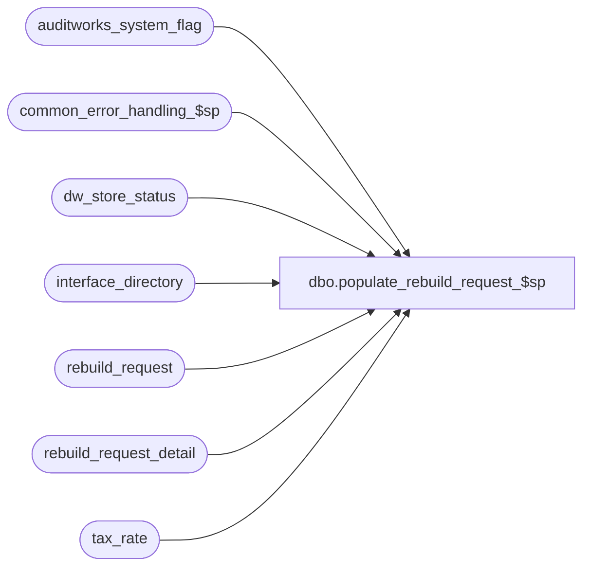

# dbo.populate_rebuild_request_$sp

**Database:** auditworks_external  
**Server:** bedrockdb01  

## Architecture Diagram



## Table Dependencies

| Referenced Table |
|---|
| auditworks_system_flag |
| common_error_handling_$sp |
| dw_store_status |
| interface_directory |
| rebuild_request |
| rebuild_request_detail |
| tax_rate |

## Stored Procedure Code

```sql
create proc [dbo].[populate_rebuild_request_$sp]  @process_id                            binary(16),
 @user_id                               int,
 @rebuild_from_store			int = NULL,	      --@select_store_list may be provided instead
 @rebuild_to_store                      int = NULL,	      --@select_store_list may be provided instead
 @rebuild_from_date                     smalldatetime,
 @rebuild_to_date                       smalldatetime,
 @rebuild_type				smallint,	       --for list see SELECT convert(nvarchar, code) + '=' + code_display_descr FROM code_description WHERE code_type = 210
 @select_store_list			nvarchar(4000) = NULL, --comma delimited store or store-store range list
 @hold					tinyint = 0

AS

/* Proc name: populate_rebuild_request_$sp
        Desc: This procedure will insert into rebuild_request and rebuild_request_detail
              It is called by FRONT END.
              For a list of request_status values, SELECT convert(nvarchar, code) + '=' + code_display_descr FROM code_description WHERE code_type = 211
              	 1=Held
              	 2=Held pending execution of prerequisite tax rebuild
              	10=Pending
              	20=Complete
              	30=Rejected
              For a list of rebuild_type values, SELECT convert(nvarchar, code) + '=' + code_display_descr FROM code_description WHERE code_type = 210
		1=Tax
		2=Subledger Tax
		3=Subledger Media Reconciliation
		4=Current Transaction Tax
           
History: 
Date     Name       Def  Desc
Jan16,12 Vicci  1-47GP4M Add option to issue a request on hold (in order to allow for it to be previewed and released gradually).
Jan10,12 Vicci  1-47GP4M Correct scaleout logic (rebuild-requests must be issued on each peripheral in order 
                         to get the tax-tracking tables on the peripherals updated correctly too and since that is where DayEnd runs.
                         Support receipt of @select_store_list (before UI was creating one request per store/date which made maintenance unmanageable).
                         Ensure associated tax subledger rebuild requests are logged as on hold until release by execution of tax rebuild.
                         If @rebuild_type = 1 (Tax) then also issue current-transaction-tax-detail rebuild requests (rebuild-type 4) for 
                         pre-audit-tax for store/dates within range specified.
May25,10 Vicci    117359 Recognize dw_store_status.store_status of 3 since some clients have daily G/L exports.
Apr27,05 Sab	 DV-1234 Change the insert to select from table dw_store_status instead of store_audit_status
Sep24,04 Maryam  DV-1146 replace user_name with user_id.
Jul09,04 ShuZ    DV-1071 Expand user_name to nvarchar(50)
Apr21,04 Maryam  DV-1071 Receive @process_id and @user_name and pass it to common_error_handling_$sp
Jan31,02 Winnie  1-ALE95 Set the correct rebuild status in rebuild_request_detail table. 
Sep19,01 Maryam     8756 author
*/

DECLARE
        @associated_rebuild_request_id 	numeric(12,0),
        @associated_rebuild_type 	tinyint,
	@errno				int,
        @errmsg				nvarchar(255),
	@instance_id			int,
        @message_id		        int,	
	@object_name			nvarchar(255),
	@operation_name			nvarchar(100),
	@process_name		        nvarchar(100),
        @rebuild_request_id 	        numeric(12,0),
        @rows				int,
	@scaleout_flag			int,
	@sql_command 			nvarchar(4000), 
        @prior_dash_pos 		smallint, 
        @dash_pos 			smallint,
        @prior_comma_pos 		smallint, 
        @comma_pos 			smallint,
        @from_store_no 			int, 	
        @to_store_no 			int,
        @tax_update_timing		smallint
        
SELECT @prior_dash_pos = 0, @dash_pos = 0, @prior_comma_pos = 0, @comma_pos = 0, @errno = 0

SELECT @process_name = 'populate_rebuild_request_$sp',
       @message_id = 201068

SELECT @scaleout_flag = CONVERT(int,flag_numeric_value)
  FROM auditworks_system_flag
 WHERE flag_name = 'scaleout_flag'
SELECT @rows = @@rowcount, @errno = @@error
IF @errno != 0 or @rows = 0
BEGIN
  SELECT @errmsg = 'Failed to select scaleout_flag from auditworks_system_flag',
         @object_name = 'auditworks_system_flag',
         @operation_name = 'SELECT'
  GOTO error
END

SELECT @instance_id = CONVERT(int,flag_numeric_value)
  FROM auditworks_system_flag
 WHERE flag_name = 'instance_id'
SELECT @rows = @@rowcount, @errno = @@error
IF @errno != 0 or @rows = 0
BEGIN
  SELECT @errmsg = 'Failed to select instance_id from auditworks_system_flag',
         @object_name = 'auditworks_system_flag',
         @operation_name = 'SELECT'
  GOTO error
END

IF @scaleout_flag = 2  --consolidated;  rebuild requests must be issued on each peripheral, not on consolidated.
  RETURN

--Determine if Tax Tracking is being updated  pre-audit (update_timing 6), since if so the tax_detail table entries will have to be rebuilt.
SELECT @tax_update_timing = update_timing
  FROM interface_directory
 WHERE interface_id = 12
SELECT @errno = @@error
IF @errno != 0
BEGIN
  SELECT @errmsg = 'Failed to read update_timing from interface_directory',
         @object_name = 'interface_directory',
         @operation_name ='SELECT'                
  GOTO error
END
IF @tax_update_timing IS NULL 
  SELECT @tax_update_timing = 0
IF @tax_update_timing NOT IN (0,3,6)
  SELECT @tax_update_timing = 3

CREATE TABLE #select_store(store_no int not null)
SELECT @errno = @@error
IF @errno <> 0
BEGIN
  SELECT @errmsg = 'Failed to create temp table to hold list of selected stores',
         @object_name = '#select_store',
      @operation_name = 'CREATE'
GOTO error
END

IF @select_store_list IS NOT NULL
BEGIN
  SELECT @sql_command = '
  INSERT #select_store(store_no)
  SELECT ORG_CHN_NUM
    FROM ORG_CHN
   WHERE ORG_CHN_NUM IN (' + replace (@select_store_list, '-', ',') + ')
   SELECT @errno = @@error'

  EXEC sp_executesql @sql_command, N'@errno int OUT', @errno OUT
  IF @errno !=0 
  BEGIN
    SELECT @errmsg='Failed to insert store list in #select_store.',
           @object_name = '#select_store',
           @operation_name = 'INSERT'          
    GOTO error
  END       
  
  SELECT @dash_pos = CHARINDEX('-', @select_store_list, @dash_pos + 1)
  
  WHILE @dash_pos > 0 
  BEGIN

    SELECT @comma_pos = CHARINDEX(',', @select_store_list, @prior_comma_pos + 1)
  
    IF @comma_pos = 0
      SELECT @comma_pos = len(@select_store_list) + 1
  
    IF @comma_pos > @dash_pos
    BEGIN
      SELECT @from_store_no = CONVERT(int, SUBSTRING(@select_store_list, @prior_comma_pos + 1, @dash_pos - (@prior_comma_pos + 1))),
             @to_store_no = CONVERT(int, SUBSTRING(@select_store_list, @dash_pos + 1, @comma_pos - (@dash_pos + 1)))
      
      SELECT @sql_command = '
             INSERT #select_store(store_no)
             SELECT ORG_CHN_NUM
               FROM ORG_CHN
              WHERE ORG_CHN_NUM > ' + convert(nvarchar, @from_store_no) + '   
                AND ORG_CHN_NUM < ' + convert(nvarchar, @to_store_no) + ' 
             SELECT @errno = @@error'  --note:  the actual from/to store numbers themselves were already inserted as part of the list insert above

      EXEC sp_executesql @sql_command, N'@errno int OUT', @errno OUT   
      IF @errno !=0 
      BEGIN
        SELECT @errmsg='Failed to insert store ranges in #select_store.',
               @object_name = '#select_store',
               @operation_name = 'INSERT'          
        GOTO error
      END       
    
      SELECT @prior_dash_pos = @dash_pos,
             @dash_pos = CHARINDEX('-', @select_store_list, @dash_pos + 1)
    END --IF @comma_pos > @dash_pos
  
    SELECT @prior_comma_pos = @comma_pos
  END  --WHILE @dash_pos > 0 
  
  SELECT @rebuild_from_store = MIN(store_no),
         @rebuild_to_store = MAX(store_no)
    FROM #select_store
  SELECT @errno = @@error
  IF @errno !=0 
  BEGIN
    SELECT @errmsg='Failed to determine store_range associated with rebuild_request.',
           @object_name = '#select_store',
           @operation_name = 'SELECT'          
    GOTO error
  END
  
  IF @rebuild_from_store IS NULL
  BEGIN
    SELECT @message_id = 201684,
           @errno = 201684, 
           @errmsg = 'Invalid store list passed',
           @object_name = 'ORG_CHN',
           @operation_name = 'SELECT'
    GOTO error
  END
END


IF @rebuild_type = 1
BEGIN
  IF EXISTS (SELECT 1
               FROM tax_rate
              WHERE item_tax_strip_flag = 1)
    SELECT @associated_rebuild_type = 2
END

IF @rebuild_type = 1 AND @tax_update_timing = 6 --pre-audit tax
BEGIN

  BEGIN TRANSACTION --to avoid rebuild requests being cleaned up because they don't have details yet  

  INSERT rebuild_request(
         rebuild_type,
         rebuild_from_store,
         rebuild_to_store,
         rebuild_from_date,
         rebuild_to_date,
         request_datetime,
         user_id)
  VALUES (4,  --rebuild current transaction tax_detail 
         @rebuild_from_store,
         @rebuild_to_store,
         @rebuild_from_date,
         @rebuild_to_date,
         getdate(),
         @user_id)               
  SELECT @errno = @@error, @rebuild_request_id = @@identity
  IF @errno !=0 
  BEGIN
    SELECT @errmsg='Failed to insert rebuild_request for current transaction tax-detail rebuild.',
           @object_name = 'rebuild_request',
           @operation_name = 'INSERT'          
    GOTO error
  END

  INSERT rebuild_request_detail(
         request_id,
         rebuild_type,
         store_no,
         transaction_date,
         request_status)
  SELECT @rebuild_request_id,
         4,  --rebuild current transaction tax_detail 
         store_no,
         sales_date,
         CASE WHEN @hold = 1 THEN 1 ELSE 10 END
    FROM dw_store_status 
   WHERE sales_date >= @rebuild_from_date
     AND sales_date <= @rebuild_to_date 
     AND store_no >= @rebuild_from_store
     AND store_no <= @rebuild_to_store
     AND store_status = 1
     AND instance_id = @instance_id
     AND (@select_store_list IS NULL OR store_no IN (SELECT store_no FROM #select_store))
  SELECT @errno = @@error,
         @rows = @@rowcount
  IF @errno !=0 
  BEGIN
    SELECT @errmsg='Failed to insert rebuild_request_detail for current transaction tax-detail rebuild.',
           @object_name = 'rebuild_request_detail',
           @operation_name = 'INSERT'          
    GOTO error
  END
  
  COMMIT
  
  IF @rows = 0 
  BEGIN 
    DELETE rebuild_request
     WHERE request_id = @rebuild_request_id   
    SELECT @errno = @@error
    IF @errno !=0 
    BEGIN
      SELECT @errmsg='Failed to delete from rebuild_request for current transaction tax-detail rebuild.',
             @object_name = 'rebuild_request',
             @operation_name = 'DELETE'          
      GOTO error
    END
  END

END  --IF @rebuild_type = 1 AND @tax_update_timing = 6

BEGIN TRANSACTION --to avoid rebuild requests being cleaned up because they don't have details yet  

INSERT rebuild_request(
       rebuild_type,
       rebuild_from_store,
       rebuild_to_store,
       rebuild_from_date,
       rebuild_to_date,
       request_datetime,
       user_id)
VALUES (
       @rebuild_type,
       @rebuild_from_store,
       @rebuild_to_store,
       @rebuild_from_date,
       @rebuild_to_date,
       getdate(),
       @user_id)               
SELECT @errno = @@error, @rebuild_request_id = @@identity
IF @errno !=0 
BEGIN
  SELECT @errmsg='Failed to insert rebuild_request.',
         @object_name = 'rebuild_request',
         @operation_name = 'INSERT'          
  GOTO error
END

INSERT rebuild_request_detail(
       request_id,
       rebuild_type,
       store_no,
       transaction_date,
       request_status)
SELECT @rebuild_request_id,
       @rebuild_type,
      store_no,
       sales_date,
       CASE WHEN @hold = 1 THEN 1 ELSE 10 END 
  FROM dw_store_status 
 WHERE sales_date >= @rebuild_from_date
   AND sales_date <= @rebuild_to_date 
   AND store_no >= @rebuild_from_store
   AND store_no <= @rebuild_to_store
   AND store_status >= 2
   AND instance_id = @instance_id
   AND (@select_store_list IS NULL OR store_no IN (SELECT store_no FROM #select_store))
SELECT @errno = @@error,
       @rows = @@rowcount
IF @errno !=0 
BEGIN
  SELECT @errmsg='Failed to insert rebuild_request_detail.',
         @object_name = 'rebuild_request_detail',
         @operation_name = 'INSERT'          
  GOTO error
END

IF @rows = 0 
  BEGIN 
    DELETE rebuild_request
     WHERE request_id = @rebuild_request_id     
    SELECT @errno = @@error
    IF @errno !=0 
      BEGIN
        SELECT @errmsg='Failed to delete from rebuild_request.',
               @object_name = 'rebuild_request',
               @operation_name = 'DELETE'          
        GOTO error
      END
  END
ELSE 
  BEGIN 
  IF @associated_rebuild_type IS NOT NULL
    BEGIN       
        INSERT rebuild_request(
               rebuild_type,
               rebuild_from_date,
               rebuild_to_date,
               rebuild_from_store,
               rebuild_to_store,
               request_datetime,
               user_id)
        VALUES(@associated_rebuild_type,
               @rebuild_from_date,
               @rebuild_to_date,
               @rebuild_from_store,
               @rebuild_to_store,
               getdate(),
               @user_id)
        SELECT @errno = @@error,
               @associated_rebuild_request_id = @@identity   	
        IF @errno !=0 
        BEGIN
          SELECT @errmsg='Unabled to insert rebuild_request.',
                 @object_name = 'rebuild_request',
                 @operation_name = 'INSERT'          
          GOTO error
        END
        
        INSERT rebuild_request_detail(
               request_id,
               rebuild_type,
               store_no,
               transaction_date,
               request_status)
        SELECT @associated_rebuild_request_id,
               @associated_rebuild_type,
               store_no,
               transaction_date,
               2  --on hold pending execution of corresponding tax rebuild request
          FROM rebuild_request_detail 
         WHERE request_id = @rebuild_request_id
           AND rebuild_type = @rebuild_type
        SELECT @errno = @@error
        IF @errno !=0 
        BEGIN
          SELECT @errmsg='Unabled to insert rebuild_request_detail.',
                 @object_name = 'rebuild_request_detail',
                 @operation_name = 'INSERT'          
          GOTO error
        END        
      END -- @associated_rebuild_type IS NOT NULL
  END -- @rows > 0                              

COMMIT TRANSACTION

DROP TABLE #select_store

RETURN  

error:   /* Common error handler */
        
        DROP TABLE #select_store
        
	EXEC common_error_handling_$sp 36, @errno, @errmsg, 0, @message_id, 
	@process_name, @object_name, @operation_name, 0, 1, 0, null, 0, null, null, null,
	  null, null, null, 0, @process_id, @user_id
	RETURN
```

