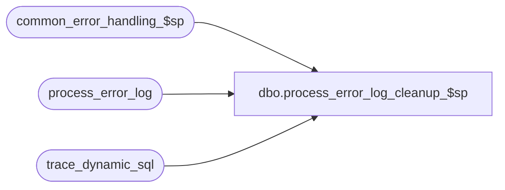

# dbo.process_error_log_cleanup_$sp

**Database:** auditworks_external  
**Server:** bedrockdb01  

## Architecture Diagram



## Table Dependencies

| Referenced Table |
|---|
| common_error_handling_$sp |
| process_error_log |
| trace_dynamic_sql |

## Stored Procedure Code

```sql
create proc dbo.process_error_log_cleanup_$sp     
    @backup_days		smallint,
    @errmsg			nvarchar(2000) OUTPUT
AS

/* Proc Name: process_error_log_cleanup_$sp
   Description:  This will clean up entries in the process_error_log table that are more than 60 days old.
		Called from dayend_housekeeping_$sp.
                 
  HISTORY:
Date     Name		Def# Desc
Dec09,14 Vicci     TFS-96392 Clean up trace_dynamic_sql table which holds trace of the commands resulting in dynamic sql execution errors.
Oct22,08 Paul       1-3XVF0J SA5: Delete entries that are older than 60 days
Apr19,02 Winnie	     1-CD0IX R3 error handling
Jan04,96 Henry W             author                 
                 
*/

DECLARE
    @lastdate			smalldatetime,
    @errno			int,
    @message_id		       	int,	
    @object_name		nvarchar(255),
    @operation_name		nvarchar(100),
    @process_name	       	nvarchar(100)

 /* keep errors for ## days back from current date. The verified flag is no longer set by the gui as of SA5. */

 SELECT @backup_days = -60 -- hardcode for SA5 purposes

 SELECT @lastdate = DATEADD( day, @backup_days, getdate() ),
        @process_name = 'process_error_log_cleanup_$sp',
        @message_id = 201068
 
 DELETE process_error_log
  WHERE error_timestamp < @lastdate
 SELECT @errno = @@error
 IF @errno != 0
 BEGIN
   SELECT @errmsg = 'Failed to delete from process_error_log',
          @object_name = 'process_error_log',
          @operation_name = 'DELETE'   
     GOTO error
 END


 IF EXISTS (SELECT t.name
	      FROM sysobjects t
	     WHERE t.type = 'U' AND t.name = 'trace_dynamic_sql')
 BEGIN
   DELETE trace_dynamic_sql
    WHERE trace_entry_datetime < @lastdate
   SELECT @errno = @@error
   IF @errno != 0
   BEGIN
     SELECT @errmsg = 'Failed to delete from trace_dynamic_sql',
            @object_name = 'trace_dynamic_sql',
            @operation_name = 'DELETE'   
       GOTO error
   END
 END

RETURN


error:  /* common error handler */


	EXEC common_error_handling_$sp 36, @errno, @errmsg, 0, @message_id, 
	@process_name, @object_name, @operation_name
	RETURN
```

