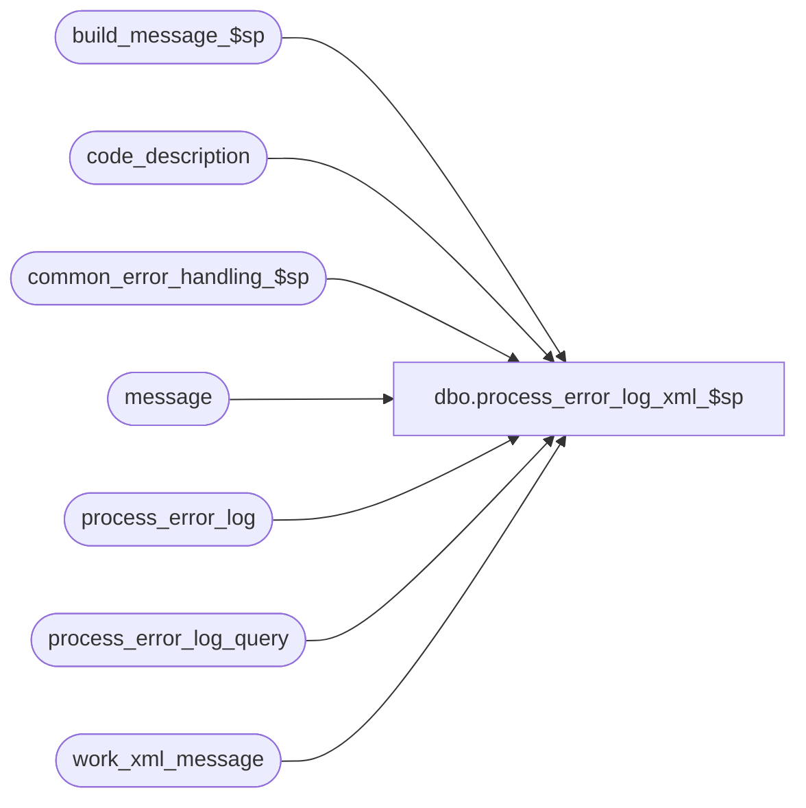

# dbo.process_error_log_xml_$sp

**Database:** auditworks_external  
**Server:** bedrockdb01  

## Architecture Diagram



## Table Dependencies

| Referenced Table |
|---|
| build_message_$sp |
| code_description |
| common_error_handling_$sp |
| message |
| process_error_log |
| process_error_log_query |
| work_xml_message |

## Stored Procedure Code

```sql
create proc [dbo].[process_error_log_xml_$sp] 

      
  
@user_name nvarchar(255) = '-',
@message_category_from smallint = 1,
@message_category_until smallint = 100,
@count_only smallint = 0,
@since_last_query smallint = 1,
@from_date datetime = null,
@to_date datetime = null,
@process_no smallint = null   AS

/*
  Proc Name: process_error_log_xml_$sp
  Desc: Build xml statements from the process_error_log.

***** SET CONVERSION FLAG IN SPREADSHEET = 0 *****

HISTORY :
 Date    Name           Def  Desc
May13,11 Paul        127064  replaced double quotes with nchar(34) to avoid dependency on quoted_identifier setting
Oct25,06 Phu          77931  Fix outer join for SQL 2005 Mode 90.
Sep01,06 Phu          76719  Want a non-null string when it's concatenated with null string.
May11,04 Maryam     DV-1071  Change @process_id to binary(16)
Apr12,01 Winnie	    1-CBKTT  Correctly generate XML file for error messages.  
Nov26,01 Winnie	       8846  Log stream_no to xml_message, should take care of double quote
                             and needs a seperate version for MSSQL.  DEV will have to submit 
                             a Sybase and MSSQL version everytime the procedure changes 
                             since this procedure is NOT be convertible from the Sybase 
                             version.
Nov14,01 Winnie		8932 Author

*/

DECLARE @count_entry_id			numeric,
	@counter			numeric,
	@error_timestamp		datetime,
	@error_code			int,
	@error_msg			nvarchar(255),
	@entry_id			numeric (18,0),
	@max_entry_id			numeric (18,0),
	@memo1				nvarchar(50),
	@memo2				nvarchar(50),
	@memo3				nvarchar(50),
	@memo_date			smalldatetime,
	@memo_date2			smalldatetime,
	@memo_date3			smalldatetime,
	@process_name			nvarchar(100),
	@object_name			nvarchar(255),
	@operation_name			nvarchar(100),
	@rows_count			int,
	@cursor_open			tinyint,
	@message_id			int,
	@errno				int,
	@code_display_descr		nvarchar(255),
	@message_description		nvarchar(255),
	@message_text			nvarchar(255),
	@database			nvarchar(50),
	@last_entry_id			numeric(18,0),
	@errmsg				nvarchar(255),
	@process_no1			smallint,
	@process_id			binary(16),
	@message_category		tinyint,
	@xml_message			nvarchar(255),
	@stream_no			tinyint

SET CONCAT_NULL_YIELDS_NULL OFF
	
SELECT  @process_name = 'process_error_log_xml_$sp',
        @message_id = 201068,
        @process_id = @@spid,
        @counter = 0

IF @to_date IS NOT NULL  
  SELECT @to_date = dateadd(day,1,@to_date)

CREATE TABLE #process_query (
 	entry_id		numeric(18,0) not null, 
 	process_no		smallint not null, 
 	error_code		int not null,
 	error_timestamp		datetime not null, 
 	error_msg		nvarchar(255) null,
 	memo1			nvarchar(50) null, 
 	memo2			nvarchar(50) null, 
 	memo3			nvarchar(50) null, 
 	memo_date		smalldatetime null,
 	memo_date2		smalldatetime null, 
 	memo_date3		smalldatetime null,
        process_name		nvarchar(100) null,
        object_name		nvarchar(255) null, 
        operation_name		nvarchar(255) null, 
        message_id		int null, 
        message_text		nvarchar(255) null,
        message_category	smallint null,
        stream_no		tinyint null)

SELECT @errno = @@error
IF @errno <> 0
  BEGIN
    SELECT @errmsg = 'Unable to create temp table #process_query',
           @object_name = '#process_query',
           @operation_name = 'CREATE'
    GOTO error
  END

SELECT @max_entry_id = ISNULL(MAX(last_entry_id),0)
  FROM process_error_log_query
 WHERE user_name = @user_name
   AND message_category_from = @message_category_from
   AND message_category_until = @message_category_until
   AND ISNULL(process_no,0) = ISNULL(@process_no,0)

SELECT @errno = @@error
IF @errno <> 0
  BEGIN
    SELECT @errmsg = 'Unable to select from #process_query',
           @object_name = 'process_error_log_query',
           @operation_name = 'SELECT'
    GOTO error
  END   

SELECT @max_entry_id = ISNULL(@max_entry_id,0)

INSERT #process_query
       (entry_id, 
 	process_no, 
 	error_code,
 	error_timestamp,
 	error_msg,
 	memo1, 
 	memo2, 
 	memo3, 
 	memo_date,
 	memo_date2, 
 	memo_date3,
        process_name,
        object_name, 
      operation_name, 
        message_id, 
        message_text,
        message_category,
        stream_no)
SELECT  entry_id, 
 	process_no, 
 	error_code,
 	error_timestamp,
 	error_msg,
 	memo1, 
 	memo2, 
 	memo3, 
 	memo_date,
 	memo_date2, 
 	memo_date3,
        process_name,
        object_name, 
        operation_name, 
        message_id, 
        text,
        message_category,
        stream_no  
  FROM  process_error_log p LEFT JOIN message m ON (p.message_id = m.id)
 WHERE  p.verified = 0
   AND  (((p.error_timestamp >= @from_date OR @from_date IS NULL) AND (@to_date IS NULL OR p.error_timestamp < @to_date) AND @since_last_query = 0) 
          OR (p.entry_id > @max_entry_id AND @since_last_query = 1 ))
   AND  (p.process_no = @process_no OR @process_no IS NULL)

SELECT @errno = @@error,
       @count_entry_id = @@rowcount
IF @errno <> 0
  BEGIN
    SELECT @errmsg = 'Unable to insert #process_query',
           @object_name = '#process_query',
           @operation_name = 'INSERT'
    GOTO error
  END

DELETE FROM #process_query
 WHERE message_id IS NOT NULL  
   AND (message_category < @message_category_from  
        OR message_category > @message_category_until)

SELECT @errno = @@error,
       @count_entry_id = @count_entry_id - @@rowcount
IF @errno <> 0
  BEGIN
    SELECT @errmsg = 'Unable to delete from #process_query',
           @object_name = '#process_query',
           @operation_name = 'DELETE'
    GOTO error
  END   

DELETE work_xml_message
 WHERE process_id = @process_id

SELECT @errno = @@error
IF @errno != 0
  BEGIN
    SELECT @errmsg = 'Failed to delete from work_xml_message',
           @object_name = 'work_xml_message',
           @operation_name = 'DELETE'
    GOTO error
  END

SELECT @database = db_name()

INSERT INTO work_xml_message
      (process_id, process_no, process_stream, xml_message)
SELECT @process_id,0,-1,'<?xml version=' + nchar(34) + '1.0' + nchar(34) + '?>'

SELECT @errno = @@error
IF @errno != 0
  BEGIN
    SELECT @errmsg = 'Failed to insert into work_xml_message for heading',
           @object_name = 'work_xml_message',
           @operation_name = 'INSERT'
    GOTO error
  END

INSERT INTO work_xml_message
      (process_id, process_no, process_stream, xml_message)
SELECT @process_id,0,0,'<awmsglist count=' + nchar(34) + convert(nvarchar,@count_entry_id) + nchar(34)
   + ' db=' + nchar(34) + @database + nchar(34) +'>'

SELECT @last_entry_id = ISNULL(MAX(entry_id),0)
  FROM #process_query

SELECT @errno = @@error
IF @errno <> 0
  BEGIN
    SELECT @errmsg = 'Unable to select max entry_id from #process_query',
           @object_name = 'process_error_log_query',
           @operation_name = 'SELECT'
    GOTO error
  END   

SELECT @last_entry_id = ISNULL(@last_entry_id,0)

IF @count_entry_id > 0 AND @count_only = 0
  BEGIN
    DECLARE process_error_crsr CURSOR
    FOR
    SELECT entry_id, process_no, error_code, error_timestamp, error_msg, memo1, memo2, memo3, memo_date, memo_date2, memo_date3,
           process_name, object_name, operation_name, message_id, message_text, message_category, stream_no
      FROM #process_query
    ORDER BY entry_id
    FOR READ ONLY  

    OPEN process_error_crsr

    SELECT @errno = @@error
    IF @errno != 0
      BEGIN
        SELECT @errmsg = 'Unable to open cursor process_error_crsr',
               @object_name = 'process_error_crsr',
               @operation_name = 'OPEN'
        GOTO error
      END

    SELECT @cursor_open = 1

    WHILE 1=1
      BEGIN

        FETCH process_error_crsr INTO
              @entry_id, @process_no1, @error_code, @error_timestamp, @error_msg, @memo1, @memo2, @memo3, @memo_date, @memo_date2, @memo_date3,
              @process_name, @object_name, @operation_name, @message_id, @message_text, @message_category, @stream_no

         IF @@fetch_status <> 0
         BREAK

         SELECT @counter = @counter + 1
         
         SELECT @code_display_descr = code_display_descr
           FROM code_description
          WHERE code = @process_no1
            AND code_type = 31
  
         SELECT @errno = @@error
	 IF @errno <> 0
	  BEGIN
	    SELECT @errmsg = 'Unable to select from code_description for process_no',
	           @object_name = 'code_description',
        	   @operation_name = 'SELECT'
	    GOTO error
	  END     

         SELECT @code_display_descr = ISNULL(@code_display_descr, convert(nvarchar,@process_no1))

         SELECT @message_description = code_display_descr
           FROM code_description
          WHERE code = @message_category
            AND code_type = 215

	 SELECT @errno = @@error
	 IF @errno <> 0
	  BEGIN
	    SELECT @errmsg = 'Unable to select from code_description for message_id',
	           @object_name = 'code_description',
        	   @operation_name = 'SELECT'
	    GOTO error
	  END      
               
         SELECT @message_description = ISNULL(@message_description, convert(nvarchar,@message_category)) 
         SELECT @message_description = ISNULL(@message_description, ' ')

         IF @message_id = 201068
           SELECT @message_text = ISNULL(@error_msg, @message_text)

         IF @message_text IS NULL    
           SELECT @message_text = convert(nvarchar, @message_id)
         ELSE IF @message_id <> 201068
           BEGIN
             EXEC build_message_$sp  @entry_id, @message_text OUTPUT
             SELECT @errno = @@error
	     IF @errno <> 0
	  	BEGIN
	    	  SELECT @errmsg = 'Unable to execute build_message_$sp',
	               @object_name = 'build_message_$sp',
        	       @operation_name = 'EXECUTE'
	    	  GOTO error
	  	END      
           END -- ELSE          

         INSERT work_xml_message
              (process_id, process_no, process_stream, xml_message)  
         SELECT @process_id, @counter, 0,
       	      '<awmsg id=' + nchar(34) + convert(nvarchar,@entry_id) + nchar(34) + '><awshortmsg type=' + nchar(34)
       	         + @message_description + nchar(34) + ' error-code=' + nchar(34) 
              + convert(nvarchar,@error_code) + nchar(34) + ' process=' + nchar(34) + @code_display_descr + nchar(34) + ' />'
               
         SELECT @errno = @@error
         IF @errno != 0
           BEGIN
             SELECT @errmsg = 'Failed to insert into work_xml_message (1)',
                    @object_name = 'work_xml_message',
                    @operation_name = 'INSERT'
             GOTO error
           END
            
         INSERT work_xml_message
              (process_id, process_no, process_stream, xml_message)  
         SELECT @process_id, @counter, 1,
              '<awlongmsg text=' + nchar(34) + SUBSTRING(@message_text, 1,237) + nchar(34)

         SELECT @errno = @@error
         IF @errno != 0
           BEGIN
             SELECT @errmsg = 'Failed to insert into work_xml_message (2)',
                    @object_name = 'work_xml_message',
                    @operation_name = 'INSERT'
             GOTO error
           END

         INSERT work_xml_message
              (process_id, process_no, process_stream, xml_message)  
         SELECT @process_id, @counter, 2,
                ' procedure=' + nchar(34) + @process_name + nchar(34) + ' object=' + nchar(34) + @object_name + nchar(34)
                  + ' operation=' + nchar(34) + @operation_name + nchar(34) + ' time=' + nchar(34) 
                + convert(nvarchar,getdate(),109) + nchar(34) +
                ' stream=' + nchar(34) + convert(nvarchar, ISNULL(@stream_no,1)) + nchar(34) + '/></awmsg>'

        SELECT @errno = @@error
         IF @errno != 0
         BEGIN
             SELECT @errmsg = 'Failed to insert into work_xml_message (3)',
                    @object_name = 'work_xml_message',
                    @operation_name = 'INSERT'
             GOTO error
           END

      END -- While 1 = 1

      CLOSE process_error_crsr
      DEALLOCATE process_error_crsr

      SELECT @cursor_open = 0

  END -- IF @count_entry_id > 0 AND @count_only = 0

  INSERT INTO work_xml_message
         (process_id, process_no, process_stream, xml_message)   
  VALUES (@process_id, 9999, 9999,'</awmsglist>')

  SELECT @errno = @@error
  IF @errno != 0
    BEGIN
      SELECT @errmsg = 'Failed to insert into work_xml_message for awmsglist end',
             @object_name = 'work_xml_message',
             @operation_name = 'INSERT'
      GOTO error
    END

  SET nocount ON

  SELECT xml_message
    FROM work_xml_message
   WHERE process_id = @process_id
  ORDER BY process_no, process_stream

  SELECT @errno = @@error
    IF @errno != 0
      BEGIN
        SELECT @errmsg = 'Failed to select from work_xml_message',
               @object_name = 'work_xml_message',
               @operation_name = 'SELECT'
        GOTO error
      END
  SET nocount OFF

  DELETE work_xml_message
   WHERE process_id = @process_id

  SELECT @errno = @@error
  IF @errno != 0
    BEGIN
      SELECT @errmsg = 'Failed to delete from work_xml_message',
             @object_name = 'work_xml_message',
             @operation_name = 'DELETE'
      GOTO error
    END

  IF @since_last_query = 1 AND @count_entry_id > 0
    BEGIN
      UPDATE process_error_log_query
         SET last_entry_id = @last_entry_id
       WHERE user_name = @user_name
         AND message_category_from = @message_category_from
         AND message_category_until = @message_category_until    
         AND ISNULL(process_no,0) = ISNULL(@process_no,0)
         AND @last_entry_id <> 0
 
      SELECT @errno = @@error,
             @rows_count = @@rowcount
      IF @errno <> 0
        BEGIN
          SELECT @errmsg = 'Unable to update process_error_log_query',
                 @object_name = 'process_error_log_query',
                 @operation_name = 'UPDATE'
          GOTO error
        END      

        IF @rows_count = 0 
          BEGIN
            INSERT process_error_log_query
                  (user_name, message_category_from, message_category_until, last_entry_id, process_no)
            VALUES (@user_name, @message_category_from, @message_category_until, @last_entry_id, @process_no)

             SELECT @errno = @@error
             IF @errno <> 0
               BEGIN
    	         SELECT @errmsg = 'Unable to insert process_error_log_query',
                        @object_name = 'process_error_log_query',
       	                @operation_name = 'INSERT'
                  GOTO error
     	       END      
          END -- IF @rows_count = 0 
    END -- IF @since_last_query = 1  

RETURN

error:
	IF @cursor_open = 1
	  BEGIN
	  CLOSE process_error_crsr
	  DEALLOCATE process_error_crsr
	  END

	EXEC common_error_handling_$sp 0, @errno, @errmsg, 0, @message_id, 
	@process_name, @object_name, @operation_name, 0	
	RETURN
```

