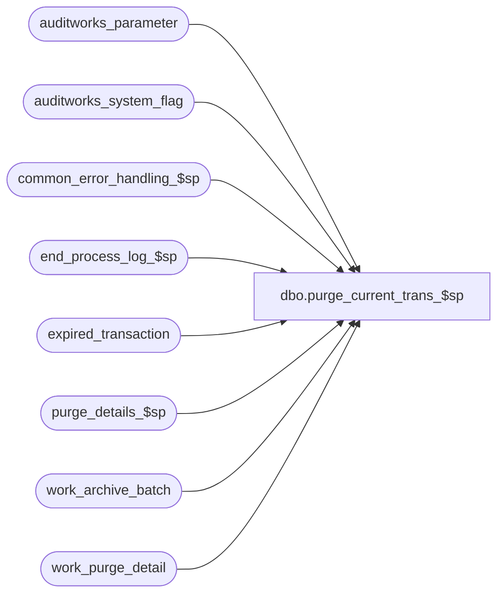

# dbo.purge_current_trans_$sp

**Database:** auditworks_external  
**Server:** bedrockdb01  

## Architecture Diagram



## Table Dependencies

| Referenced Table |
|---|
| auditworks_parameter |
| auditworks_system_flag |
| common_error_handling_$sp |
| end_process_log_$sp |
| expired_transaction |
| purge_details_$sp |
| work_archive_batch |
| work_purge_detail |

## Stored Procedure Code

```sql
create proc dbo.purge_current_trans_$sp 
@dayend_process_id     tinyint,
@process_timestamp     float
 
AS

 /* 
PROC NAME: purge_current_trans_$sp
     DESC: Purges ( deletes ) current transactions for passed in dayend stream number
           or for stream 1 if i_dayend_process_id is null.
	   This procedure is called from day_end_purge_$sp (dayend stream 1) and from day_end_post_$sp (when i_dayend_process_id >= 2).

HISTORY:
Date     Name          Def#  Desc
Feb25,15 Paul      T-107891  only truncate shared work table when running on stream 1, 
                              prevent expired_transaction being deleted prematurely when using multi-steam dayend
Jan24,14 Paul        147019  author (moved logic from day_end_purge_$sp). Using TOP command for batching.
                              supports multistream Purge, improve performance of purge of translate_error.

*/

DECLARE
  @batch_count			int,
  @batch_no 			int,
  @batches_left			tinyint,
  @errno				int,
  @errline			int,
  @errmsg			nvarchar(2000),
  @errmsg2			nvarchar(2000),
  @last_batch_processed		int,
  @max_batch_no 			int,
  @message_id			int,
  @object_name			nvarchar(255),
  @operation_name			nvarchar(100),
  @process_name			nvarchar(100),
  @process_no 			smallint,
  @rows				int,
  @trace_msg			nvarchar(255),
  @transaction_count		int,
  @transactions_per_batch		int;


SELECT 	@process_no = 16,
	@batch_no = -1,
	@batch_count = 0,
	@transaction_count = 0,
	@message_id = 201068,
	@process_name = 'purge_curent_trans_$sp';

BEGIN TRY

  /* Calling proc has executed start_process_log_$sp. This proc calls end_process_log_$sp.
     Batch numbers were assigned by archive_posting_$sp.
     No need to redo the batch assignments here. Will delete from the current trans tables for
     one batch_no at a time.
     In the event of deadlock when deleting expired_transaction, the next purge will resume */

  SELECT @trace_msg = ':LOG => Purge : cleanup expired_transaction starts: ' + CONVERT(char, getdate(), 8);
  PRINT @trace_msg;

  SELECT @errmsg = 'Unable to select from auditworks_parameter (transactions_per_batch)',
	     @object_name = 'auditworks_parameter',
	     @operation_name = 'SELECT';
  SELECT @transactions_per_batch = CONVERT(integer,COALESCE(par_value,'2000'))
    FROM auditworks_parameter
   WHERE par_name = 'transactions_per_batch';

  IF @transactions_per_batch IS NULL
    SELECT @transactions_per_batch = 2000;

  SELECT @trace_msg = ':LOG => Purge: cleanup expired_transaction: ' + CONVERT(char, getdate(), 8);
  PRINT @trace_msg;

   -- get a snapshot of the max in case more rows are inserted simultaneously by other dayend streams
    SELECT @errmsg = 'Failed to select from expired_transaction',
	       @object_name = 'expired_transaction',
	       @operation_name = 'SELECT';
  SELECT @max_batch_no = MAX(batch_no)
    FROM expired_transaction WITH (NOLOCK);

        SELECT @errmsg = 'Unable to truncate table work_purge_detail',
	       @object_name = 'work_purge_detail',
	       @operation_name = 'TRUNCATE';
  TRUNCATE TABLE work_purge_detail;


  WHILE 1 = 1
    BEGIN

         /* look for next batch in expired_transaction. Avoiding using an 'or' clause for performance reasons. */
     IF @dayend_process_id IS NULL -- single stream
        SELECT @batch_no = MIN(batch_no)
          FROM expired_transaction
         WHERE batch_no > @batch_no;
     ELSE /* search current stream */
        SELECT @batch_no = MIN(batch_no)
          FROM expired_transaction WITH (NOLOCK)
         WHERE batch_no > @batch_no
           AND dayend_process_id = @dayend_process_id;

    IF @batch_no IS NOT NULL AND @batch_no <= @max_batch_no
      SELECT @last_batch_processed = @batch_no;

    IF (@batch_no IS NULL OR @batch_count > @transactions_per_batch OR @batch_no > @max_batch_no)
      BEGIN
       SELECT @errmsg = 'Failed to execute purge_details_$sp',
	     @object_name = 'purge_details_$sp',
	       @operation_name = 'EXECUTE';             
       EXEC purge_details_$sp;

       IF (@batch_no IS NULL OR @batch_no > @max_batch_no)
          BREAK;

       SELECT @batch_count = 0,
	       @errmsg = 'Unable to truncate table work_purge_detail (in loop)',
	       @object_name = 'work_purge_detail',
	       @operation_name = 'TRUNCATE';
       TRUNCATE TABLE work_purge_detail;

      END; -- If @batch_no IS NULL OR @batch_count > @transactions_per_batch

    SELECT @errmsg = 'Unable to insert work_purge_detail',
	       @object_name = 'work_purge_detail',
	       @operation_name = 'INSERT';
    INSERT work_purge_detail (transaction_id)             
    SELECT transaction_id 
      FROM expired_transaction
     WHERE batch_no = @batch_no;

    SELECT @rows = @@rowcount;
    SELECT @batch_count = @batch_count + @rows,
		@transaction_count = @transaction_count + @rows;

  END; /* While 1=1 */


  /* Update log now in case any deadlocks occur afterwards */
	SELECT @errmsg = 'Failed to execute end_process_log_$sp',
	       @object_name = 'end_process_log_$sp',
	       @operation_name = 'EXECUTE';
    EXEC end_process_log_$sp @process_no, @process_timestamp, @transaction_count, @dayend_process_id;


    IF @last_batch_processed >= 0
      BEGIN
       WHILE 3=3
        BEGIN
	/* Use a lock row to prevent multiple simultaneous deletes, in order to avoid deadlocks. */
        BEGIN TRANSACTION;

	    SELECT @errmsg         = 'Failed to update auditworks_system_flag',
	           @object_name    = 'auditworks_system_flag',
	           @operation_name = 'UPDATE';
	  UPDATE auditworks_system_flag
	    SET flag_datetime_value = getdate()
	   WHERE flag_name = 'last_purge_tran_date';

	/* translate_errors that are associated with expired (dayended) transactions are
	   purged by purge_details_$sp to avoid possible clutter on translate_error screen. Handles force accept scenarios. */

	SELECT @errmsg = 'Failed to delete expired_transaction',
	       @object_name = 'expired_transaction',
	       @operation_name = 'DELETE'; 


	IF @dayend_process_id IS NULL --THEN
	     /* Remove processed rows for all dayend streams (single stream purge) */
            BEGIN
	      DELETE TOP(80000) FROM expired_transaction
	       WHERE batch_no <= @last_batch_processed;
	      SELECT @rows = @@rowcount;
            END;
	  ELSE
            BEGIN
	     /* Remove processed rows for the current dayend stream */
	      DELETE TOP(80000) FROM expired_transaction
	       WHERE batch_no <= @last_batch_processed
	         AND dayend_process_id = @dayend_process_id;
	      SELECT @rows = @@rowcount;
            END; -- else of If @dayend_process_id IS NULL

        COMMIT TRANSACTION;

        IF @rows < 80000
          BREAK;

       END; -- While 3=3
      END; -- If @last_batch_processed >= 0


-- the identity value (used to generate batch_no) in shared work table work_archive_batch is periodically reset by truncating the table
IF EXISTS (SELECT 1 FROM work_archive_batch)
AND NOT EXISTS (SELECT 1 FROM expired_transaction) -- no outstanding transactions
AND (@dayend_process_id = 1 OR @dayend_process_id IS NULL) -- stream 1 or single stream dayend
  BEGIN
    SELECT @errmsg = 'Failed to reset the seed of the identity column batch_no',
           @object_name = 'work_archive_batch',
           @operation_name = 'TRUNCATE';
    TRUNCATE TABLE work_archive_batch;

  END; -- If exists


/* TRUNCATE shared work table to reduce fragmentation when using single stream purge.
     Safety check to ensure that table is still empty. */

SELECT @batches_left = 0,
    @errmsg = 'Unable to truncate expired_transaction',
    @object_name = 'expired_transaction',
    @operation_name = 'TRUNCATE';

IF EXISTS( SELECT 1
	    FROM expired_transaction WITH (NOLOCK))
  SELECT @batches_left = 1;

IF @batches_left = 0 AND @dayend_process_id IS NULL -- single stream dayend
  BEGIN
     TRUNCATE TABLE expired_transaction;
  END;

SELECT @trace_msg = ':LOG => Purge : cleanup expired_transaction ends: ' + CONVERT(char, getdate(), 8);
PRINT @trace_msg;

RETURN;

error:

business_error:   /* Business Rule handler. */

	SELECT @errmsg2 = @errmsg;

	/* Could include similar cleanup code to system error trap when needed (example is from move_store_$sp).
	   However, could also exclude the cleanup code here since the outer system error catch should fire again after the exec below. */

	EXEC common_error_handling_$sp @process_no, @errno, @errmsg, 0, @message_id, 
	  @process_name, @object_name, @operation_name, 1;
	  /* Note: when the exec above raises an error, that action also fires the system error trap (below) */
	RETURN;
END TRY

BEGIN CATCH; -- trap system errors
    /* common error handling. Appending proc name here because a rollback could occur if called within a transaction. */

        SELECT @errno = ERROR_NUMBER(),
		@errline = ERROR_LINE();

        SELECT @errmsg = CONVERT(nvarchar, @errno) + ':' + @process_name + ':' + CONVERT(nvarchar, @errline) + ':'
               + COALESCE(@errmsg, ' ') + ':' + ERROR_MESSAGE();

	 /* this condition will only be true when raise error in traps above fire this general catch */
	IF @errmsg2 IS NOT NULL
	  SELECT @errmsg = @errmsg2;

	EXEC common_error_handling_$sp @process_no, @errno, @errmsg, 0, @message_id, 
	  @process_name, @object_name, @operation_name, 1;

	RETURN;
END CATCH;
```

