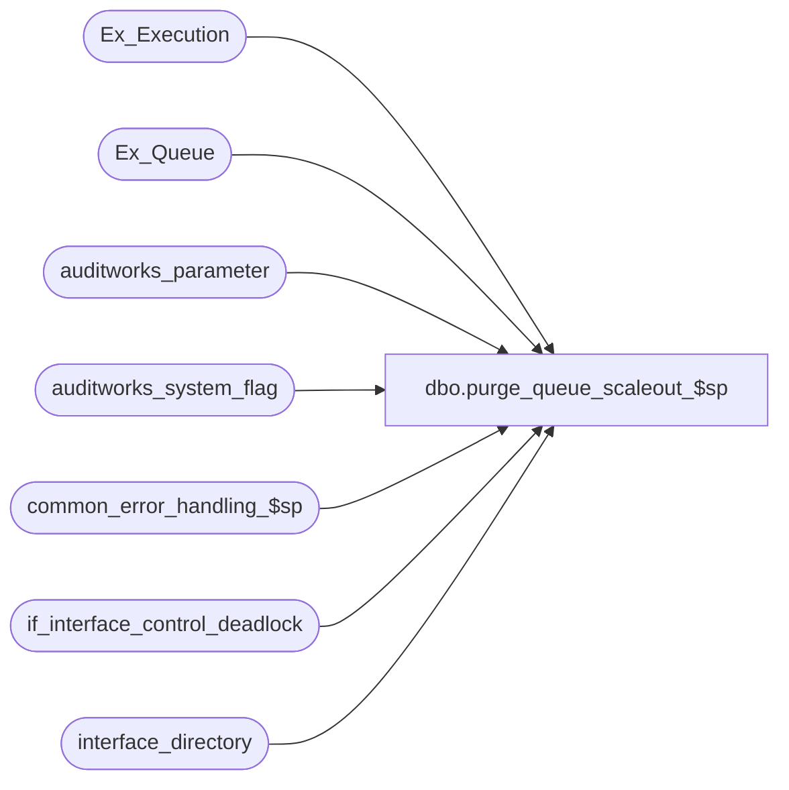

# dbo.purge_queue_scaleout_$sp

**Database:** auditworks_external  
**Server:** bedrockdb01  

## Architecture Diagram



## Table Dependencies

| Referenced Table |
|---|
| Ex_Execution |
| Ex_Queue |
| auditworks_parameter |
| auditworks_system_flag |
| common_error_handling_$sp |
| if_interface_control_deadlock |
| interface_directory |

## Stored Procedure Code

```sql
create proc [dbo].[purge_queue_scaleout_$sp] 
AS

/* Proc_name: purge_queue_scaleout_$sp
   Desc: To delete transactions from Ex_Queue on the peripheral servers for interfaces that have been copied to the
	consolidated server. Those interfaces will be posted on the consolidated server but must also be cleaned up
	on the peripheral servers.
	Called by purge_queue_$sp or purge_queue_and_execution_$sp depending on setup of interface cleanup.

HISTORY
Date     Name	   Def# Desc
Nov29,05 Paul   DV-1324 Author. Handle purge on peripheral server in a scaleout environment.
         
*/

DECLARE @abort_flag		tinyint,
	@cursor_open		tinyint,
	@errmsg			nvarchar(255),
	@errno			int,
	@message_id		int,
	@object_id		int,
	@object_name		nvarchar(255),
	@operation_name		nvarchar(100),
	@process_name		nvarchar(100),
	@queue_id		int,
	@process_no 		smallint,
	@rows 			int,
	@scaleout_flag		int,
	@scaleout_interface_id	int,
	@to_serial_no		numeric(14,0),
	@process_id 		binary(16),
        @rows_per_batch         integer	

SELECT @process_no = 41,
	@cursor_open = 0,
	@process_id = @@spid,
	@message_id = 201068,
	@process_name = 'purge_queue_scaleout_$sp',
	@abort_flag = 0,
	@scaleout_flag = 0

SELECT @scaleout_flag = CONVERT(int,flag_numeric_value)
  FROM auditworks_system_flag
 WHERE flag_name = 'scaleout_flag'

SELECT @errno = @@error
IF @errno != 0
  BEGIN
    SELECT @errmsg = 'Failed to select scaleout_flag from auditworks_system_flag',
           @object_name = 'auditworks_system_flag',
          @operation_name = 'SELECT'
    GOTO error
  END

IF @scaleout_flag != 1 -- not running on a peripheral server
  RETURN

--Get the batch size for each of the DELETE's
SELECT @rows_per_batch = CONVERT(integer,ISNULL(par_value,'10000'))
  FROM auditworks_parameter
 WHERE par_name = 'rows_per_batch'

SELECT @errno = @@error
IF @errno <> 0
  BEGIN
    SELECT @errmsg = 'Unable to select from auditworks_parameter (rows_per_batch)',
           @object_name = 'auditworks_parameter',
           @operation_name = 'SELECT'
    GOTO error
  END

SELECT @scaleout_interface_id = CONVERT(integer,par_value)
  FROM auditworks_parameter
 WHERE par_name = 'scaleout_interface_id'

/* Preaudit interfaces where scaleout_posting_method != 1 are copied to the consolidated server at the same time as
   the preaudit scaleout interface (interface_id = @scaleout_interface_id).

   When this proc is called by purge_queue_$sp (Foundation cleanup), there should normally be no remaining rows in
   Ex_Execution or Ex_Queue for the scaleout interface because Foundation cleanup would already have removed
   all posted entries.

   The following logic determines the highest serial_no that can be cleaned up for the scaleout interface and therefore
   also for the other preaudit interfaces on the peripheral server where scaleout_posting_method != 1.
*/

SELECT @to_serial_no = MAX(to_serial_no)
  FROM Ex_Execution
 WHERE queue_id = @scaleout_interface_id

SELECT @errno = @@error
IF @errno <> 0
  BEGIN
    SELECT @errmsg = 'Unable to select from Ex_Execution',
           @object_name = 'Ex_Execution',
           @operation_name = 'SELECT'
    GOTO error
  END

IF @to_serial_no IS NULL -- scaleout interface was already purged from Ex_Execution and Ex_Queue
  BEGIN
   SELECT @to_serial_no = MIN(serial_no) - 1 -- find min remaining transaction (unposted)
     FROM Ex_Queue
    WHERE queue_id = @scaleout_interface_id

   SELECT @errno = @@error
   IF @errno <> 0
     BEGIN
      SELECT @errmsg = 'Unable to select from Ex_Queue',
           @object_name = 'Ex_Queue',
           @operation_name = 'SELECT'
      GOTO error
     END

   IF @to_serial_no IS NULL
     SELECT @to_serial_no = 99999999999999 -- all transactions have already been posted for the scaleout interface
  END -- If @to_serial_no IS NULL

DECLARE int_directory_crsr CURSOR FAST_FORWARD
 FOR
 SELECT	interface_id, object_id
   FROM interface_directory WITH (NOLOCK)
  WHERE update_timing = 1
    AND ISNULL(scaleout_posting_method,0) != 1

OPEN int_directory_crsr

SELECT @errno = @@error
IF @errno <> 0
BEGIN
  SELECT @errmsg = 'Unable to open cursor int_directory_crsr',
         @object_name = 'int_directory_crsr',
         @operation_name = 'OPEN'
  GOTO error
END

SELECT @cursor_open = 1


WHILE 1=1
  BEGIN
    FETCH int_directory_crsr INTO
	  @queue_id, @object_id

    IF @@fetch_status <> 0
      BREAK

    SELECT @rows = @rows_per_batch

    WHILE @rows = @rows_per_batch
      BEGIN
	BEGIN TRANSACTION

	UPDATE if_interface_control_deadlock -- reduce deadlocking by simulating a table lock
	 SET function_no = @process_no,
	     status_date = getdate()

        SELECT @errno = @@error
        IF @errno <> 0
        BEGIN
          SELECT @errmsg = 'Failed to update if_interface_control_deadlock',
               @object_name = 'if_interface_control_deadlock',
             @operation_name = 'UPDATE'
          GOTO error
        END

	SET ROWCOUNT @rows_per_batch -- DELETE  a max of @rows_per_batch records from Ex_Queue  

	DELETE Ex_Queue
	 WHERE queue_id = @queue_id
	   AND serial_no <= @to_serial_no

	SELECT @errno = @@error, @rows = @@rowcount
        IF @errno <> 0
        BEGIN
          SELECT @errmsg = 'Unable to delete from Ex_Queue',
               @object_name = 'Ex_Queue',
             @operation_name = 'DELETE'
          GOTO error
        END
	SET ROWCOUNT 0 -- reset 

	COMMIT TRANSACTION
      END -- WHILE @rows = @rows_per_batch
  END -- WHILE 1=1

CLOSE int_directory_crsr
DEALLOCATE int_directory_crsr
SELECT @cursor_open = 0


RETURN

error:
	SET ROWCOUNT 0

	IF @cursor_open = 1
	BEGIN
	  CLOSE int_directory_crsr
	  DEALLOCATE int_directory_crsr
	END

	EXEC common_error_handling_$sp @process_no, @errno, @errmsg, @abort_flag, @message_id, 
	@process_name, @object_name, @operation_name, 1, 1, 0, 0, 0
	RETURN
```

