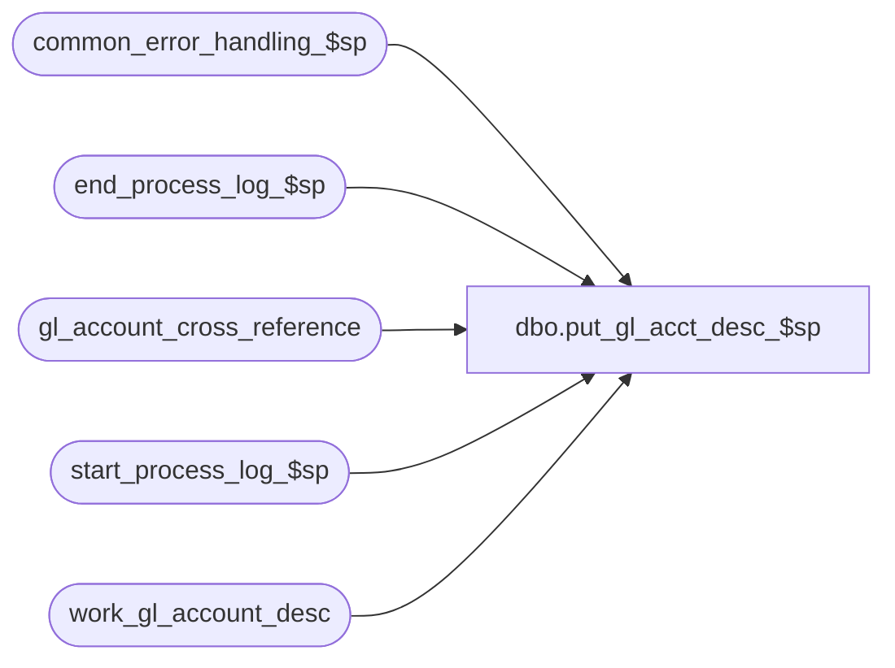

# dbo.put_gl_acct_desc_$sp

**Database:** auditworks_external  
**Server:** bedrockdb01  

## Architecture Diagram



## Table Dependencies

| Referenced Table |
|---|
| common_error_handling_$sp |
| end_process_log_$sp |
| gl_account_cross_reference |
| start_process_log_$sp |
| work_gl_account_desc |

## Stored Procedure Code

```sql
create proc [dbo].[put_gl_acct_desc_$sp] as

/* Author : Yin
** Proc name : put_gl_acct_desc_$sp
** Version : 1.00
** Description : update account description of the GL account cross 
** 	refernece file from the work file, which include description 
**	bulkcopy from the GL. 

  HISTORY:
Date     Name		Def# Desc
Jan17,03 ShuZ        1-HZ3U2 Change double quote to single quote
Apr19,02 Winnie      1-CD0IX R3 error handling
*/

DECLARE 
	@errmsg				nvarchar(255),
	@errno				int,
	@transaction_count		numeric(12,0),
	@process_log_entry		bit,
	@process_no			smallint,
	@process_timestamp		float,
        @message_id		       	int,	
        @object_name			nvarchar(255),
        @operation_name			nvarchar(100),
        @process_name		       	nvarchar(100)

SELECT @errmsg = NULL,
	@transaction_count = 0,
	@process_log_entry = 0,
	@process_no = 90,
	@process_timestamp = 0,
	@process_name = 'put_gl_acct_desc_$sp',
        @message_id = 201068

IF @process_log_entry = 0
	BEGIN
	EXEC start_process_log_$sp @process_no, @process_timestamp OUTPUT, @errmsg OUTPUT

	SELECT @errno = @@error

	IF @errno <> 0
	BEGIN
	IF @errmsg IS NULL /* then */
	  SELECT @errmsg = 'Unable to execute start_process_log_$sp'
        SELECT @object_name = 'start_process_log_$sp',
               @operation_name = 'EXECUTE'   
	GOTO error
	END

	SELECT @process_log_entry = 1
     END

UPDATE gl_account_cross_reference
   SET gl_account_description = w.gl_acct_description
  FROM work_gl_account_desc w, gl_account_cross_reference rf
 WHERE w.gl_acct_no = rf.gl_account_no
   AND w.gl_acct_description IS NOT NULL --
   AND rtrim(w.gl_acct_description) != ' '

SELECT @errno = @@error,
	@transaction_count = @transaction_count + @@rowcount

IF @errno <> 0
	BEGIN
	SELECT @errmsg = 'Unable to update table gl_account_cross_reference',
               @object_name = 'gl_account_cross_reference',
               @operation_name = 'UPDATE'   
	GOTO error
	END

IF @process_log_entry = 1
	EXEC end_process_log_$sp @process_no, @process_timestamp, @transaction_count

	SELECT @errno = @@error

	IF @errno <> 0
	BEGIN
	IF @errmsg IS NULL /* then */
	  SELECT @errmsg = 'Unable to execute end_process_log_$sp'
        SELECT @object_name = 'end_process_log_$sp',
               @operation_name = 'EXECUTE'   
	GOTO error
	END


RETURN

error:   /* Common error handler */
	

	EXEC common_error_handling_$sp @process_no, @errno, @errmsg, 0, @message_id, 
  	@process_name, @object_name, @operation_name, 0,1,
  	@process_log_entry, @process_timestamp, @transaction_count
	RETURN
```

