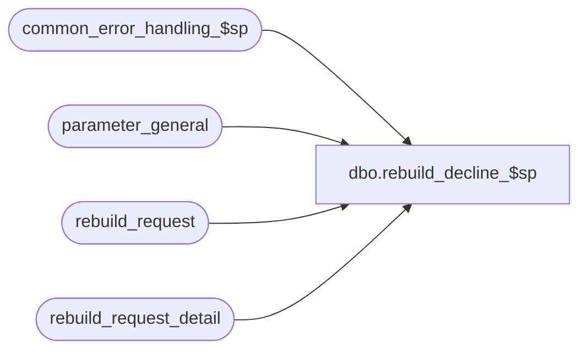

# dbo.rebuild_decline_$sp

**Database:** auditworks_external  
**Server:** bedrockdb01  

## Architecture Diagram



## Table Dependencies

| Referenced Table |
|---|
| common_error_handling_$sp |
| parameter_general |
| rebuild_request |
| rebuild_request_detail |

## Stored Procedure Code

```sql
create proc [dbo].[rebuild_decline_$sp] 
@process_id binary(16),
@user_id int,
@rebuild_type smallint = 1,
@store_no int = NULL,
@transaction_date smalldatetime = NULL,
@request_id numeric(12,0) = NULL       

 AS

/* Proc Name: rebuild_decline_$sp
   Desc: decline the tax tracking data rebuild_request or delete particular store/date 
         combinations from rebuild request.
         Called from PB tm frontend and from n-tier batch processes. 

HISTORY:
Date     Name        Def#  Desc
Jan06,12 Vicci   1-47GP4M  recognized request_status 2 (Held pending execution of tax-rebuild);  
                           since subledger tax rebuild request cannot be executed without the corresponding tax-rebuild,
                           delete the subledger tax rebuild request for which the tax-rebuilds have been deleted (otherwise
                           they are left on hold forever).
May30,06 Paul     DV-1335  remove user name
Feb16,06 Paul     DV-1328  add @user_id to where clause
Sep23,04 Maryam   DV-1146  Add user_id.
Apr21,04 Maryam   DV-1071  Receive @process_id and pass it to common_error_handling_$sp.
Mar01,02 Vicci    1-BA3LL  For use in rebuild monitor case only, allow request_id to be passed in
Sep19,01 Maryam      8756  Author

*/

DECLARE @errno				int,
        @errmsg				nvarchar(255),
        @associated_rebuild_type 	smallint,
        @current_date 			smalldatetime,
        @dayend_in_progress 		tinyint,
        @message_id		        int,	
	@object_name			nvarchar(255),
	@operation_name			nvarchar(100),
	@process_name		        nvarchar(100),
	@decline_datetime		datetime

SELECT @process_name = 'rebuild_decline_$sp',
       @message_id = 201068,
       @decline_datetime = getdate()

SELECT @dayend_in_progress = dayend_in_progress
  FROM parameter_general     
SELECT @errno = @@error
  IF @errno != 0
    BEGIN
      SELECT @errmsg = 'Failed to determine whether dayend is in progresss',
             @object_name = 'parameter_general',
             @operation_name = 'SELECT'      
      GOTO error
    END

IF @rebuild_type = 1
  SELECT @associated_rebuild_type= 2

SELECT @current_date = CONVERT(smalldatetime, CONVERT(nchar(8),getdate(),112)) --only applies when called from TM which displays all current-date requests to user.
     
DELETE rebuild_request_detail
  FROM rebuild_request_detail rd, rebuild_request r
 WHERE rd.request_id = r.request_id
   AND r.request_datetime <= @decline_datetime
   AND (rd.rebuild_type = @rebuild_type OR rd.rebuild_type = @associated_rebuild_type) 
   AND (request_status in (1, 2) OR (request_status = 10 AND @dayend_in_progress = 0))
   AND (store_no = @store_no OR @store_no IS NULL)
   AND (transaction_date = @transaction_date OR @transaction_date IS NULL)
   AND ((r.user_id = @user_id AND CONVERT(smalldatetime, CONVERT(nchar(8), request_datetime, 112)) = @current_date AND @request_id IS NULL)
        OR r.request_id = @request_id) 
SELECT @errno = @@error
IF @errno != 0
BEGIN
  SELECT @errmsg = 'Failed to delete rebuild_request_detail',
         @object_name = 'rebuild_request_detail',
         @operation_name = 'DELETE'      
  GOTO error
END

DELETE rebuild_request_detail
  FROM (SELECT sub.store_no, sub.transaction_date, MAX(COALESCE(tax.rebuild_type, 0)) tax_rebuild_exists
          FROM rebuild_request_detail sub
               LEFT OUTER JOIN rebuild_request_detail tax
                 ON tax.rebuild_type = @rebuild_type  --tax
                AND tax.request_status < 20  --not yet run
                AND sub.store_no = tax.store_no
                AND sub.transaction_date = tax.transaction_date
         WHERE sub.rebuild_type = @associated_rebuild_type --subledger tax
           AND sub.request_status  < 10
         GROUP BY sub.store_no, sub.transaction_date
        HAVING MAX(COALESCE(tax.rebuild_type, 0)) = 0) del
 WHERE rebuild_request_detail.rebuild_type = @associated_rebuild_type --subledger tax
   AND rebuild_request_detail.request_status  < 10  --held
   AND rebuild_request_detail.store_no = del.store_no
   AND rebuild_request_detail.transaction_date = del.transaction_date
SELECT @errno = @@error
IF @errno != 0
BEGIN
  SELECT @errmsg = 'Failed to delete rebuild_request_detail subledger tax rebuild entries not supported by a corresponding tax rebuild entry',
         @object_name = 'rebuild_request_detail',
         @operation_name = 'DELETE'      
  GOTO error
END

DELETE rebuild_request
 WHERE (rebuild_request.rebuild_type = @rebuild_type OR rebuild_request.rebuild_type = @associated_rebuild_type) 
   AND rebuild_request.request_datetime <= @decline_datetime
   AND rebuild_request.request_id NOT IN (SELECT DISTINCT rd.request_id
                            		   FROM rebuild_request_detail rd)
SELECT @errno = @@error
  IF @errno != 0
    BEGIN
      SELECT @errmsg = 'Failed to delete rebuild_request',
             @object_name = 'rebuild_request',
             @operation_name = 'DELETE'      
      GOTO error
    END

RETURN

error:   /* Common error handler */

	EXEC common_error_handling_$sp 0, @errno, @errmsg, 0, @message_id, 
	@process_name, @object_name, @operation_name, 0, 1, 0, null, 0, null, null, null,
	  null, null, null, 0, @process_id, @user_id

	RETURN
```

