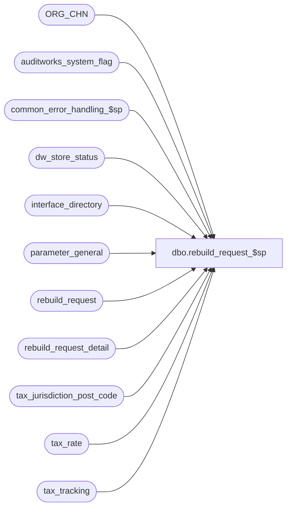

# dbo.rebuild_request_$sp

**Database:** auditworks_external  
**Server:** bedrockdb01  

## Architecture Diagram



## Table Dependencies

| Referenced Table |
|---|
| ORG_CHN |
| auditworks_system_flag |
| common_error_handling_$sp |
| dw_store_status |
| interface_directory |
| parameter_general |
| rebuild_request |
| rebuild_request_detail |
| tax_jurisdiction_post_code |
| tax_rate |
| tax_tracking |

## Stored Procedure Code

```sql
create proc dbo.rebuild_request_$sp   @new_effective_from_date 		smalldatetime,
  @new_effective_until_date		smalldatetime,
  @old_effective_from_date		smalldatetime,
  @old_effective_until_date		smalldatetime,
  @tax_fields_changed			tinyint,
  @new_tax_jurisdiction			nvarchar(255),
  @errmsg 				nvarchar(255) OUTPUT,
  @tax_strip_flag			tinyint = NULL,
  @tax_level				tinyint = NULL,
  @new_tax_rate_code 			tinyint = NULL,
  @old_tax_rate_code			tinyint = NULL
  
 AS

/* Proc name:   rebuild_request_$sp

Description:This procedure will insert into rebuild_request and rebuild_request_detail on hold 
            and user will be given option to release/delete the Tax (rebuild-type 1) requests.
            Subledger Tax (rebuild-type 2) will remain on hold until tax-rebuild runs.
            It is called by tax triggers.
Note:  this proc does not issue rebuild requests for current transactions in a pre-audit environment quite properly (missing stores which
       did send-sales / returns for the jurisdiction in question) because it would take too long to scan tax_detail to determine 
       which store/dates are impacted by the exact tax config change that was made, and because in a scaleout environment the consolidated server 
       where the TM is occurring only receives its copy of tax_detail on a delayed basis.  The user can manually request such rebuilds if desired.

           
HISTORY: 
Date     Name       Def  Desc
Feb12,14 Vicci    149810 Don't issue rebuild request if tax jurisdiction in question not referenced or if effective from dates were and still are future
                         or if no tax fields have been changed and expiry dates were changed from one future date to another.
Jan11,12 Vicci  1-47GP4M Set request_status to 2=held pending execution of tax rebuild for tax subledger rebuild type. 
                         Issue rebuild request for current store/date impacted as well if in a pre-audit-tax environment.
May25,10 Vicci    117359 Recognize dw_store_status.store_status of 3 since some clients have daily G/L exports.
Mar09,09 Vicci  1-38MDAZ Do not issue rebuild request if updates are initiated by upgrade.
May30,06 Paul    DV-1335 insert rebuild_request using null user_id
Apr29,05 Sab	 DV-1234 Scaleout changes for inserting into rebuild_request and rebuild_request_detail
Dec02,02 Paul    1-H16B4 expanded @rows to int
Apr19,02 Winnie  1-CD0IX R3 error handling
Jul12,01 Winnie     8303 Remove ROLLBACK to prevent error when called by trigger.					
Mar31,01 Maryam     8028 author
*/


/*
NOTE: when this procedure is called by changes to effective_until_date which is done
      by system not the user, we only take in to account the rebuilding of subledger 
      portion when tax_strip_flag is set for the row. The rebuilding of the tax portion
      was done due to the changes of effective_from_date, as was the rebuilding of the subledger
      but the latter only happens if the tax_strip_flag was 1 for the row affected by the 
      effective_from_date change.
*/

IF EXISTS (SELECT 1 
             FROM parameter_general
            WHERE upgrade_in_progress > 0)
RETURN

DECLARE
        @current_date			datetime,
	@errno 				int,
	@instance_id			int,
        @message_id		       	int,	
  	@object_name			nvarchar(255),
  	@operation_name			nvarchar(100),
  	@process_name		       	nvarchar(100),
        @rebuild_from_date		smalldatetime,
	@rebuild_to_date		smalldatetime,
        @rebuild_type			tinyint,
        @rows				int,
	@scaleout_flag			int,
        @subledger_rebuild_request_id 	numeric(12,0),
        @tax_rebuild_request_id 	numeric(12,0),
        @tax_update_timing		smallint 

SELECT @current_date = getdate(),
       @process_name = 'rebuild_request_$sp',
       @message_id = 201068

IF    (    (@old_effective_from_date > @current_date OR @old_effective_from_date IS NULL) 
       AND (@new_effective_from_date > @current_date OR (@new_effective_from_date IS NULL AND @old_effective_from_date > @current_date))
      )
    OR 
      (    @tax_fields_changed = 0
       AND (@old_effective_until_date > @current_date OR @old_effective_until_date IS NULL) 
       AND (@new_effective_until_date > @current_date OR @new_effective_until_date IS NULL)
      )
    OR 
      (    NOT EXISTS (SELECT 1 FROM ORG_CHN WHERE TAX_JRSDCTN_CODE = @new_tax_jurisdiction)
       AND NOT EXISTS (SELECT 1 FROM tax_jurisdiction_post_code WHERE tax_jurisdiction = @new_tax_jurisdiction)
      )
  RETURN


SELECT @scaleout_flag = CONVERT(int,flag_numeric_value)
  FROM auditworks_system_flag
 WHERE flag_name = 'scaleout_flag'
SELECT @rows = @@rowcount, @errno = @@error
IF @errno != 0 or @rows = 0
BEGIN
  SELECT @errmsg = 'Failed to select scaleout_flag from auditworks_system_flag',
         @object_name = 'auditworks_system_flag',
         @operation_name = 'SELECT'
  GOTO error
END

SELECT @instance_id = CONVERT(int,flag_numeric_value)
  FROM auditworks_system_flag
 WHERE flag_name = 'instance_id'
SELECT @rows = @@rowcount, @errno = @@error
IF @errno != 0 or @rows = 0
BEGIN
  SELECT @errmsg = 'Failed to select instance_id from auditworks_system_flag',
         @object_name = 'auditworks_system_flag',
         @operation_name = 'SELECT'
  GOTO error
END

--Determine if Tax Tracking is being updated  pre-audit (update_timing 6), since if so the tax_detail table entries will have to be rebuilt.
SELECT @tax_update_timing = update_timing
  FROM interface_directory
 WHERE interface_id = 12
SELECT @errno = @@error
IF @errno != 0
BEGIN
  SELECT @errmsg = 'Failed to read update_timing from interface_directory',
         @object_name = 'interface_directory',
         @operation_name ='SELECT'                
  GOTO error
END
IF @tax_update_timing IS NULL 
  SELECT @tax_update_timing = 0
IF @tax_update_timing NOT IN (0,3,6)
  SELECT @tax_update_timing = 3

 
IF (@new_effective_from_date <> @old_effective_from_date) OR @tax_fields_changed = 1
  BEGIN 
    SELECT @rebuild_type = 1
    
    IF @old_effective_from_date < @new_effective_from_date
      SELECT @rebuild_from_date = @old_effective_from_date
    ELSE 
      SELECT @rebuild_from_date = @new_effective_from_date
  
  IF @tax_fields_changed = 1
    BEGIN  
      
      IF ISNULL(@old_effective_until_date, @current_date) > ISNULL(@new_effective_until_date, @current_date)
        SELECT @rebuild_to_date = ISNULL(@old_effective_until_date, CONVERT(smalldatetime, CONVERT(nchar(8),@current_date,112)))
      ELSE 
        SELECT @rebuild_to_date = ISNULL(@new_effective_until_date,CONVERT(smalldatetime, CONVERT(nchar(8),@current_date,112)))
    END 
  ELSE -- @tax_fields_changed = 0
    BEGIN 
      IF @old_effective_from_date > @new_effective_from_date
        SELECT @rebuild_to_date =  DATEADD(dd,-1, @old_effective_from_date)
      ELSE 
        SELECT @rebuild_to_date =  DATEADD(dd,-1, @new_effective_from_date)
  END -- @tax_fields_changed = 0 
  END --IF (@new_effective_from_date <> @old_effective_from_date) OR @tax_fields_changed = 1
ELSE -- effective_until_date has changed
  BEGIN
    IF @tax_strip_flag = 1
      BEGIN
        IF ISNULL(@old_effective_until_date, @current_date) < ISNULL(@new_effective_until_date, @current_date)
          BEGIN 
            SELECT @rebuild_from_date = DATEADD(dd, 1, ISNULL(@old_effective_until_date, CONVERT(smalldatetime, CONVERT(nchar(8),@current_date,112))))
            SELECT @rebuild_to_date =  ISNULL(@new_effective_until_date, CONVERT(smalldatetime, CONVERT(nchar(8),@current_date,112)))
          END  
        ELSE 
          BEGIN 
            SELECT @rebuild_from_date = DATEADD(dd, 1, ISNULL(@new_effective_until_date, CONVERT(smalldatetime, CONVERT(nchar(8),@current_date,112))))
            SELECT @rebuild_to_date =  ISNULL(@old_effective_until_date, CONVERT(smalldatetime, CONVERT(nchar(8),@current_date,112)))
       END 
        
        IF NOT EXISTS (SELECT request_id
                         FROM rebuild_request
                        WHERE rebuild_type = 2
                          AND tax_jurisdiction = @new_tax_jurisdiction
                          AND rebuild_from_date = @rebuild_from_date
                          AND rebuild_to_date = @rebuild_to_date)
          
          SELECT @rebuild_type = 2
       ELSE                   
         RETURN                    
      
      END -- IF @tax_strip_flag = 1
    ELSE 
      RETURN
  END -- effective_until_date has changed

IF @tax_strip_flag IS NULL
BEGIN
  IF EXISTS (SELECT 1
               FROM tax_rate
              WHERE tax_jurisdiction = @new_tax_jurisdiction
                AND tax_level = @tax_level
                AND (tax_rate_code = @old_tax_rate_code OR tax_rate_code = @new_tax_rate_code)
                AND ((effective_from_date <= @rebuild_from_date AND ISNULL(effective_until_date, @current_date) >= @rebuild_from_date)
                     OR (effective_from_date <= @rebuild_to_date AND ISNULL(effective_until_date, @current_date) >= @rebuild_to_date)
                     OR (effective_from_date >= @rebuild_from_date AND ISNULL(effective_until_date, @current_date) <= @rebuild_to_date))
                AND item_tax_strip_flag = 1)
    SELECT @tax_strip_flag = 1
END

IF @scaleout_flag = 0 OR (@scaleout_flag = 2) OR (@scaleout_flag = 1 AND @instance_id = 0) --non-scaleout or consolidated or scaleout TM database
--Note:  manually requested rebuilds are made directly on the peripherals by the UI,
--       but in a scaleout environment, since the tax TM that calls this proc is done on consolidated that is where these requests will end up,
--       but the mass_auto_revalidate_$sp proc will copy them back to the peripherals using their dw_rebuild_request and dw_rebuild_request_detail views.
BEGIN
  --already part of an implicit begin transaction since called by the triggers.
  INSERT rebuild_request(
	 user_id,
	 rebuild_type,
	 tax_jurisdiction,
	 rebuild_from_date,
	 rebuild_to_date,
	 request_datetime)
  VALUES (null,
	 @rebuild_type,
	 @new_tax_jurisdiction,
	 @rebuild_from_date,
	 @rebuild_to_date,
	 getdate())
  SELECT @errno = @@error
  IF @errno !=0
   BEGIN
     SELECT @errmsg='Failed to insert rebuild_request for Tax.',
	    @object_name = 'rebuild_request',
	    @operation_name = 'INSERT'
     GOTO error
   END

  SELECT @tax_rebuild_request_id = @@identity

  INSERT rebuild_request_detail(
	 request_id,
	 rebuild_type,
	 store_no,
	 transaction_date,
	 request_status)
  SELECT DISTINCT @tax_rebuild_request_id,
	 @rebuild_type,
	 t.store_no,
	 t.transaction_date,
	 1
    FROM rebuild_request r, tax_tracking t, dw_store_status s     
   WHERE r.rebuild_type = @rebuild_type
     AND r.tax_jurisdiction = t.tax_jurisdiction
     AND r.rebuild_from_date <= t.transaction_date
     AND r.rebuild_to_date >= t.transaction_date
     AND t.store_no = s.store_no
     AND t.transaction_date = s.sales_date
     AND t.tax_level = @tax_level
     AND (t.tax_rate_code = @old_tax_rate_code OR @old_tax_rate_code IS NULL)
     AND s.store_status >= 2
     AND r.request_id = @tax_rebuild_request_id
  SELECT @errno = @@error, @rows = @@rowcount
  IF @errno !=0 
   BEGIN
     SELECT @errmsg='Failed to insert rebuild_request_detail for Tax.',
	    @object_name = 'rebuild_request_detail',
	    @operation_name = 'INSERT' 
     GOTO error
   END

  IF @rows = 0 
   BEGIN
     DELETE rebuild_request
      WHERE request_id = @tax_rebuild_request_id

     SELECT @errno = @@error
     IF @errno !=0 
      BEGIN
        SELECT @errmsg='Failed to delete from rebuild_request.',
		@object_name = 'rebuild_request',
		@operation_name = 'DELETE' 
        GOTO error
      END
   END
  ELSE 
   BEGIN 
     IF @tax_strip_flag = 1 AND @rebuild_type = 1
      BEGIN
	INSERT rebuild_request(
		user_id,
		rebuild_type,
		tax_jurisdiction,
		rebuild_from_date,
		rebuild_to_date,
		rebuild_from_store,
		rebuild_to_store,
		request_datetime)
	 SELECT null,
		2,
		null,
		MIN(transaction_date),
		MAX(transaction_date),
		MIN(store_no),
		MAX(store_no),
		getdate()
	   FROM rebuild_request_detail
	  WHERE request_id = @tax_rebuild_request_id

	SELECT @errno = @@error, @rows = @@rowcount,
		@subledger_rebuild_request_id = @@identity   	

	IF @errno !=0 
	 BEGIN
	   SELECT @errmsg='Failed to insert rebuild_request for Subledger Tax.',
		  @object_name = 'rebuild_request',
		  @operation_name = 'INSERT' 
	   GOTO error
	 END

	IF @rows > 0
	 BEGIN
	   INSERT rebuild_request_detail(
		  request_id,
		  rebuild_type,
		  store_no,
		  transaction_date,
		  request_status)
	   SELECT @subledger_rebuild_request_id,
		  2,
		  store_no,
		  transaction_date,
		  2  --held pending execution of tax rebuild
	     FROM rebuild_request_detail
	  WHERE request_id = @tax_rebuild_request_id
	   SELECT @errno = @@error
	  IF @errno !=0
	    BEGIN
	      SELECT @errmsg='Failed to insert rebuild_request_detail for Subledger Tax.',
		     @object_name = 'rebuild_request_detail',
		     @operation_name = 'INSERT'
	      GOTO error
	    END
	 END -- IF @rows > 0
     END -- IF @tax_strip_flag = 1 AND @rebuild_type = 1
  END -- @rows > 0

  IF @rebuild_type = 1 AND @tax_update_timing = 6 --pre-audit tax
  BEGIN
    INSERT rebuild_request(
  	   user_id,
  	   rebuild_type,
  	   tax_jurisdiction,
  	   rebuild_from_date,
  	   rebuild_to_date,
  	   request_datetime)
    VALUES (null,
  	   4,  --current transaction tax-detail rebuild
	   @new_tax_jurisdiction,
	   @rebuild_from_date,
	   @rebuild_to_date,
	   getdate())
    SELECT @errno = @@error, @tax_rebuild_request_id = @@identity
    IF @errno !=0
    BEGIN
      SELECT @errmsg='Failed to insert rebuild_request for current transaction tax-detail.',
 	     @object_name = 'rebuild_request',
	     @operation_name = 'INSERT'
      GOTO error
    END

    INSERT rebuild_request_detail(
	   request_id,
	   rebuild_type,
	   store_no,
	   transaction_date,
	   request_status)
    SELECT DISTINCT @tax_rebuild_request_id,
	   4,  --current transaction tax-detail rebuild
	   s.store_no,
	   s.sales_date,
	   1
      FROM ORG_CHN o, dw_store_status s     
     WHERE o.TAX_JRSDCTN_CODE = @new_tax_jurisdiction
       AND o.ORG_CHN_NUM = s.store_no
       AND s.sales_date >= @rebuild_from_date
       AND s.sales_date <= @rebuild_to_date 
       AND s.store_status = 1  --edited
    SELECT @errno = @@error, @rows = @@rowcount
    IF @errno !=0 
    BEGIN
      SELECT @errmsg='Failed to insert rebuild_request_detail for current transaction tax-detail.',
 	     @object_name = 'rebuild_request_detail',
	     @operation_name = 'INSERT' 
      GOTO error
    END

    IF @rows = 0 
    BEGIN
      DELETE rebuild_request
       WHERE request_id = @tax_rebuild_request_id
      SELECT @errno = @@error
      IF @errno !=0 
      BEGIN
        SELECT @errmsg='Failed to delete from rebuild_request.',
	       @object_name = 'rebuild_request',
	       @operation_name = 'DELETE' 
        GOTO error
      END
    END
  END  --IF @rebuild_type = 1 AND @tax_update_timing = 6 --pre-audit tax
END
ELSE -- scaleout with instance_id > 0
BEGIN
  SELECT @errmsg = 'Cannot execute rebuild_request by a peripheral server since was already done by triggers on consolidated',
	 @object_name = 'auditworks_system_flag',
	 @operation_name = 'SELECT'
  GOTO error
END

RETURN  

error:   /* Common error handler */

	EXEC common_error_handling_$sp 36, @errno, @errmsg, 0, @message_id, 
	@process_name, @object_name, @operation_name
	RETURN
```

