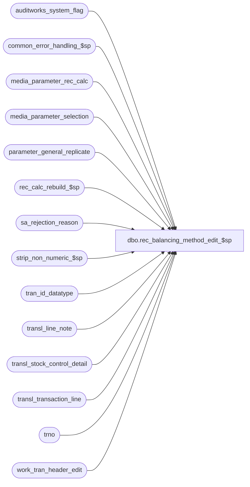

# dbo.rec_balancing_method_edit_$sp

**Database:** auditworks_external  
**Server:** bedrockdb01  

## Architecture Diagram



## Table Dependencies

| Referenced Table |
|---|
| auditworks_system_flag |
| common_error_handling_$sp |
| media_parameter_rec_calc |
| media_parameter_selection |
| parameter_general_replicate |
| rec_calc_rebuild_$sp |
| sa_rejection_reason |
| strip_non_numeric_$sp |
| tran_id_datatype |
| transl_line_note |
| transl_stock_control_detail |
| transl_transaction_line |
| trno |
| work_tran_header_edit |

## Stored Procedure Code

```sql
create proc dbo.rec_balancing_method_edit_$sp 
@process_id binary(16),
@user_id    int,
@errmsg	    nvarchar(255)	OUTPUT

AS

/* 
PROC NAME: rec_balancing_method_edit_$sp
     DESC: Process balancing_method_changes. Create sa reject type 16 if media_parameter_set_no config is invalid.
           Called by edit_post_$sp.

 HISTORY: 
Date     Name       Def#    Desc
Nov27,14 Paul     TFS-94103 Use try .. catch to capture errors, removed index hints since edit streams can't use them
Nov19,10 Paul        120413 scaleout: compare media_rec_rebuild_request date with rec_calc_rebuild_date
Jun04,07 Paul       DV-1363 added nolock hints
Oct25,06 Phu          77931 Fix outer join for SQL 2005 Mode 90.
Apr28,05 Paul       DV-1234 expand transaction_id to use tran_id_datatype
Sep24,04 Maryam     DV-1146 Use user_id
May05,04 Maryam     DV-1071 Receive @process_id and pass it to the sub procs
Mar16,04 Vicci	      25745 Call rec_calc_rebuild_$sp when rebuild-indicator system flag is
			    missing since otherwise flag will never get created and 
			    media_parameter_rec_calc will never get populated.
Jan14,03 Maryam       20059 Moved the call to rec_calc_rebuild_$sp to this proc from rec_edit_$sp.
Dec29,03 Maryam     DV-1007 Handle intial float when the media_parameter_set_no of head office store
                            is different from store.
Nov07,03 Maryam     DV-1010 Check for the lenght of media_parameter_set_no to match manual proc.
Aug15,03 Paul         11627 corrected loop logic, added index hint
Jul10,03 Maryam     1-KL08H Author
*/

DECLARE
  @cursor_open 			tinyint,
  @effective_until_date         datetime,
  @effective_from_date          datetime,
  @errmsg2			nvarchar(2000),
  @errline			int,                                                         
  @errno                        int,
  @entry_date_time		datetime,             
  @float_load_date_time		datetime,             
  @line_id                      numeric(5,0),
  @line_note                    nvarchar(250),
  @line_void_flag		tinyint,
  @message_id			int,
  @media_parameter_set_no       nvarchar(255),
  @media_rec_rebuild_date	datetime,
  @media_rec_rebuild_request	datetime,
  @object_name			nvarchar(255),
  @operation_name		nvarchar(100),
  @process_name			nvarchar(100),
  @rows				int,
  @register_no			smallint,
  @store_no                     int,
  @transaction_id               tran_id_datatype,
  @transaction_no               trno,
  @transaction_series           nchar,
  @flag_alpha_value             int;

SELECT @cursor_open = 0,
       @process_name = 'rec_balancing_method_edit_$sp',
       @message_id   = 201068;

BEGIN TRY

    SELECT @errmsg = 'Failed to select flag_alpha_value.',
           @object_name = 'auditworks_system_flag',
	   @operation_name = 'SELECT';
SELECT @flag_alpha_value = CONVERT(int,flag_alpha_value)
  FROM auditworks_system_flag
 WHERE flag_name = 'rec_calc_rebuild_required';  

  /* Check for rebuild required in a scaleout environment */

IF @flag_alpha_value = 0 -- THEN
  BEGIN
	    SELECT @errmsg = 'Failed to select rec_calc_rebuild_date',
	           @object_name = 'auditworks_system_flag',
		   @operation_name = 'SELECT';
    SELECT @media_rec_rebuild_date = flag_datetime_value
      FROM auditworks_system_flag
     WHERE flag_name = 'rec_calc_rebuild_date';

	    SELECT @errmsg = 'Failed to select media_rec_rebuild_request',
	           @object_name = 'parameter_general_replicate';
    SELECT @media_rec_rebuild_request = media_rec_rebuild_request
      FROM parameter_general_replicate;

    IF @media_rec_rebuild_request >= COALESCE(@media_rec_rebuild_date, @media_rec_rebuild_request) -- THEN
	SELECT @flag_alpha_value = 1;
  END; -- If Check for rebuild required

IF ISNULL(@flag_alpha_value,1) <> 0
  BEGIN
        SELECT @errmsg = 'Failed to execute rec_calc_rebuild_$sp.',
               @object_name = 'rec_calc_rebuild_$sp',
	  @operation_name = 'EXECUTE';
    EXEC rec_calc_rebuild_$sp @process_id, @user_id, 4, @errmsg OUTPUT;
  END;

    SELECT @errmsg = 'Unable to open cursor balancing_change_crsr',
           @object_name = 'balancing_change_crsr',
           @operation_name = 'OPEN'; 
DECLARE balancing_change_crsr CURSOR FAST_FORWARD
FOR
SELECT ln.store_no,
       ln.register_no,
       ln.entry_date_time,
       ln.line_note,
       wh.transaction_id,
       ln.line_id,
       wh.transaction_no,
       wh.transaction_series,
       ISNULL(s.count_date, ln.entry_date_time)
  FROM transl_line_note ln WITH (NOLOCK)
       INNER JOIN work_tran_header_edit wh WITH (NOLOCK) ON (ln.store_no = wh.store_no
                                                                                       AND ln.register_no = wh.register_no
                                                                                       AND ln.entry_date_time = wh.entry_date_time
                                                                                       AND ln.transaction_series = wh.transaction_series
                                                                                       AND ln.transaction_no = wh.transaction_no)
       LEFT JOIN transl_stock_control_detail s WITH (NOLOCK) ON (ln.store_no = s.store_no
                                                   AND ln.register_no = s.register_no
                                                   AND ln.entry_date_time = s.entry_date_time
                                                   AND ln.transaction_series = s.transaction_series
                                                   AND ln.transaction_no = s.transaction_no
                                                   AND ln.line_id = s.line_id
                                                   AND s.display_def_id IN (33, 43))
 WHERE ln.note_type = 9007
   AND wh.date_reject_id = 0
   AND wh.sa_rejection_flag = 0
   AND wh.transaction_void_flag = 0
ORDER BY ln.store_no, ln.register_no, ln.entry_date_time;

OPEN balancing_change_crsr;
SELECT @cursor_open = 1;

WHILE 1 = 1
BEGIN
  FETCH balancing_change_crsr INTO
        @store_no,
        @register_no,
        @entry_date_time,
        @line_note,
        @transaction_id,
        @line_id,
        @transaction_no,
        @transaction_series,
        @float_load_date_time;

  IF @@fetch_status <> 0
    BREAK;

  IF @line_id <> 0 
    BEGIN
        SELECT @errmsg = 'Failed to select line_void_flag.',
	       @object_name = 'transl_transaction_line',
	       @operation_name = 'SELECT';
      SELECT @line_void_flag = line_void_flag 
        FROM transl_transaction_line
       WHERE transaction_no = @transaction_no 
         AND entry_date_time = @entry_date_time 
         AND register_no = @register_no 
         AND store_no = @store_no 
         AND transaction_series = @transaction_series 
         AND line_id = @line_id;
    END; --IF @line_id <> 0 
  ELSE
    SELECT @line_void_flag = 0;

  IF @line_void_flag <> 0 
    CONTINUE;
  ELSE
    BEGIN
        SELECT @media_parameter_set_no = null,
             @errmsg = 'Failed to execute strip_non_numeric_$sp.',
             @object_name = 'strip_non_numeric_$sp',
	    @operation_name = 'EXECUTE';       
        EXEC strip_non_numeric_$sp @line_note, @media_parameter_set_no OUTPUT;

        IF LEN(@media_parameter_set_no) <= 4
            SELECT @media_parameter_set_no = CONVERT(smallint,@media_parameter_set_no)
          ELSE
            SELECT @media_parameter_set_no = NULL; -- avoid error 247 (overflow)

        /* Check if @media_parameter_set_no exists in media_parameter_rec_calc and if not log S/A reject 
        (reason = 16, line_id = 0) and fetch next. */
        
        IF NOT EXISTS (SELECT 1
                      FROM media_parameter_rec_calc
                        WHERE media_parameter_set_no = @media_parameter_set_no)
        BEGIN              
	  SELECT @errmsg = 'Failed to insert into sa_rejection_reason(16)',
		     @object_name = 'sa_rejection_reason',
		     @operation_name = 'INSERT';
          INSERT INTO sa_rejection_reason (
		 transaction_id,
		 line_id,
		 violated_sareject_rule)
	  VALUES (@transaction_id,
		 0,
		 16);
  
          CONTINUE;
        END;

        --Log balancing-method changes to media_parameter_selection
            SELECT @errmsg='Cannot set media_parameter_set_no',
                   @object_name = 'media_parameter_selection',
                   @operation_name = 'UPDATE';       
        UPDATE media_parameter_selection
           SET media_parameter_set_no = CONVERT(smallint,@media_parameter_set_no),
               transaction_id = @transaction_id
         WHERE store_no = @store_no
           AND register_no = @register_no
           AND effective_from_date = @float_load_date_time;

        SELECT @rows = @@rowcount;

        IF @rows <> 1
          BEGIN
                SELECT @errmsg='Failed to select @effective_until_date',
                       @object_name = 'media_parameter_selection',
                       @operation_name = 'SELECT';
            SELECT @effective_until_date = MIN(effective_from_date)
              FROM media_parameter_selection
             WHERE store_no = @store_no 
               AND register_no = @register_no 
               AND effective_from_date > @float_load_date_time;
     
                SELECT @errmsg='Failed to select @effective_from_date'; 
            SELECT @effective_from_date = MAX(effective_from_date)
              FROM media_parameter_selection
             WHERE store_no = @store_no 
               AND register_no = @register_no
               AND effective_from_date < @float_load_date_time;
     
            IF @effective_from_date IS NOT NULL -- then
              BEGIN
                    SELECT @errmsg = 'Failed to set effective_until_date.',
	                   @object_name = 'media_parameter_selection',
	                   @operation_name = 'UPDATE';
                UPDATE media_parameter_selection
                   SET effective_until_date = @float_load_date_time
                 WHERE store_no = @store_no
                   AND register_no = @register_no 
                   AND effective_from_date = @effective_from_date;
          
                   SELECT @errmsg = 'Failed to insert media_parameter_selection.',
	                  @object_name = 'media_parameter_selection',
	                  @operation_name = 'INSERT';          
                INSERT media_parameter_selection(
                       store_no,
                       register_no,
                       effective_from_date,
                       effective_until_date,
                       media_parameter_set_no,
                       transaction_id)
                VALUES (@store_no,
                        @register_no,
                        @float_load_date_time,
                        @effective_until_date,
                        CONVERT(smallint,@media_parameter_set_no),
                        @transaction_id);
              END; /* IF @effective_from date IS NOT NULL */
          END; --IF @rows <> 1

    END; --ELSE of @line_void_flag <> 0
END; --WHILE 1=1


CLOSE balancing_change_crsr;
DEALLOCATE balancing_change_crsr;

SELECT @cursor_open = 0;
RETURN;


business_error:   /* Business Rule handler. */

	SELECT @errmsg2 = @errmsg;

	/* Could include similar cleanup code to system error trap when needed (example is from move_store_$sp).
	   However, could also exclude the cleanup code here since the outer system error catch should fire again after the exec below. */

	EXEC common_error_handling_$sp 4, @errno, @errmsg, 0, @message_id, 
	@process_name, @object_name, @operation_name, 1, 1, 0, null, 0, null, 
	null, null, null, null, null, 0, @process_id, @user_id;
	  /* Note: when the exec above raises an error, that action also fires the system error trap (below) */
	RETURN;
END TRY

BEGIN CATCH; -- trap system errors
    /* common error handling. Appending proc name here because a rollback could occur if called within a transaction. */

        SELECT @errno = ERROR_NUMBER(),
		@errline = ERROR_LINE();

        SELECT @errmsg = CONVERT(nvarchar, @errno) + ':' + @process_name + ':' + CONVERT(nvarchar, @errline) + ':'
               + COALESCE(@errmsg, ' ') + ':' + ERROR_MESSAGE();

	 /* this condition will only be true when raise error in traps above fire this general catch */
	IF @errmsg2 IS NOT NULL
	  SELECT @errmsg = @errmsg2;

	IF @cursor_open = 1
	  BEGIN
	    CLOSE balancing_change_crsr;
	    DEALLOCATE balancing_change_crsr;
	  END;

	EXEC common_error_handling_$sp 4, @errno, @errmsg, 0, @message_id, 
	@process_name, @object_name, @operation_name, 1, 1, 0, null, 0, null, 
	null, null, null, null, null, 0, @process_id, @user_id;

	RETURN;
END CATCH;
```

