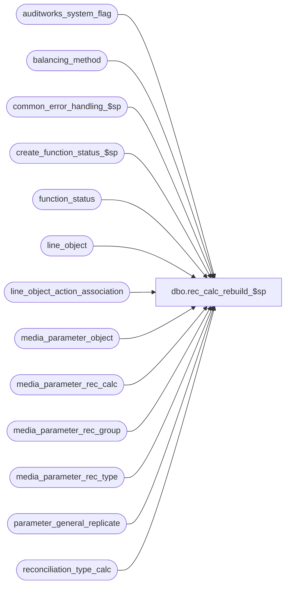

# dbo.rec_calc_rebuild_$sp

**Database:** auditworks_external  
**Server:** bedrockdb01  

## Architecture Diagram



## Table Dependencies

| Referenced Table |
|---|
| auditworks_system_flag |
| balancing_method |
| common_error_handling_$sp |
| create_function_status_$sp |
| function_status |
| line_object |
| line_object_action_association |
| media_parameter_object |
| media_parameter_rec_calc |
| media_parameter_rec_group |
| media_parameter_rec_type |
| parameter_general_replicate |
| reconciliation_type_calc |

## Stored Procedure Code

```sql
CREATE proc [dbo].[rec_calc_rebuild_$sp] 
@process_id		binary(16),
@user_id                int,
@process_no		smallint,
@errmsg			nvarchar(255) OUTPUT
 
AS

 /* 
PROC NAME: rec_calc_rebuild_$sp
     DESC: rebuild table media_parameter_rec_calc.
     Called from rec_balancing_method_edit_$sp and rec_manual_$sp.

HISTORY:
Date     Name         Def#  Desc
May06,14 Paul       148151  Add one second when setting rec_calc_rebuild_date, capture error line
Jun04,13 Paul       143630  improve concurrency with tm: use request time when updating rec_calc_rebuild_date, added try .. catch
Nov18,10 Paul       120413  set rec_calc_rebuild_date in auditworks_system_flag
Aug15,08 Paul       104042  make outer join and hints compatible with SQL 2005 Mode 90
Jun02,08 Vicci      101672  Handle rec-option -2 (assumed reconciliation upon dayend with fund transfer)
Sep20,04 Maryam    DV-1146  Use user_id.
Apr27,04 Maryam    DV-1071  Receive @process_id and pass it to the sub procs.
Jul28,03 Winnie	     11253  Correct logic to handle both in progress case and first request case.
Jun04,03 Winnie	      9250  Media Reconciliation enhancements.	

*/

DECLARE
  @errno			int,
  @errline		int,
  @message_id			int,
  @object_name			nvarchar(255),
  @operation_name		nvarchar(100),
  @process_name			nvarchar(100),
  @exists			integer,
  @rows				integer,
  @flag_alpha_value		integer,
  @try_again			smallint,
  @function_no                  int,
  @last_rebuild_attempt_date    datetime,
  @media_rec_rebuild_request    datetime


SELECT @process_name     = 'rec_calc_rebuild_$sp',
       @message_id       = 201068,
       @function_no      = 74,
       @try_again        = 1;

SELECT    @message_id = 201068,
          @operation_name = 'SELECT',
          @errmsg    = 'Unable to determine pre audit archive option',
            @object_name    = 'parameter_general_replicate';

BEGIN TRY

WHILE @try_again = 1
  BEGIN

     /* read datetime of the latest received rebuild request */
      SELECT @errmsg = 'Failed to select media_rec_rebuild_request.',
 	       @object_name = 'parameter_general_replicate',
	       @operation_name = 'SELECT';

    SELECT @media_rec_rebuild_request = media_rec_rebuild_request
      FROM parameter_general_replicate;

    SELECT @rows  = @@rowcount;
    IF @rows = 0
      SELECT @media_rec_rebuild_request = getdate(); -- safety code

      SELECT @errmsg = 'Failed to select rec_calc_rebuild_required.',
 	       @object_name = 'auditworks_system_flag';
    BEGIN TRAN
    
    SELECT @flag_alpha_value = CONVERT(int,flag_alpha_value)
      FROM auditworks_system_flag WITH (HOLDLOCK)
     WHERE flag_name = 'rec_calc_rebuild_required';
    
    SELECT @rows = @@rowcount;

    IF ISNULL(@flag_alpha_value,1) = 1
      BEGIN
          SELECT @errmsg = 'Failed to execute create_function_status_$sp',
              @object_name = 'create_function_status_$sp', @operation_name = 'EXECUTE';
        EXEC create_function_status_$sp @process_id, @user_id, @function_no, NULL, @errmsg;

        IF @rows = 0 
          BEGIN
              SELECT @errmsg = 'Failed to insert auditworks_system_flag.',
 	               @object_name = 'auditworks_system_flag',
	               @operation_name = 'INSERT';
            INSERT INTO auditworks_system_flag(
                   flag_name,
                   flag_datetime_value,
                   flag_numeric_value,
                   flag_alpha_value,
                   flag_comment,
                   code_type, 
                   flag_datetime_initialize_value, 
                   flag_numeric_initialize_value,
                   flag_alpha_initialize_value)
            VALUES ('rec_calc_rebuild_required',
                   null, 
                   null,
                   '2',
                   'Used to determine whether to rebuild media reconciliation',
                   null,
                   null,
               null,
                   null);       
          END -- IF @row = 0 
        ELSE
          BEGIN -- @row <> 0      
             SELECT @errmsg = 'Failed to update rec_calc_rebuild_required.',
 	               @object_name = 'auditworks_system_flag',
	               @operation_name = 'INSERT';

            UPDATE auditworks_system_flag
               SET flag_alpha_value = '2' -- In progress
             WHERE flag_name = 'rec_calc_rebuild_required';
   
          END --@row <> 0
      END --IF ISNULL(@flag_alpha_value,1) = 1
    ELSE
    BEGIN
      IF @flag_alpha_value = 2 -- in progress, need to check for aborted rebuilds
      BEGIN 
          SELECT @object_name = 'function_status',
	               @operation_name = 'SELECT';
	SELECT @last_rebuild_attempt_date = MAX(entry_date)
	  FROM function_status
	 WHERE function_no = 74;

	IF @last_rebuild_attempt_date IS NOT NULL -- THEN
	  BEGIN
	  /* check whether another user or edit stream is currently rebuilding
	     If last attempt was less than 2 min ago, then loop again to give them a chance to finish */

	    IF DATEDIFF(mi, @last_rebuild_attempt_date, getdate()) < 2 -- THEN
	      BEGIN
		COMMIT
		WAITFOR DELAY '0:00:10'
		CONTINUE
	      END
	  END -- If @last_rebuild_attempt_date

	-- update all rows in case multiple rows exist due to prevous failures
         SELECT @errmsg = 'Failed to set the user_id and entry_date.',
                   @object_name = 'function_status',
                   @operation_name = 'UPDATE';
        UPDATE function_status
           SET user_id = @user_id,
               entry_date = getdate()
         WHERE function_no = 74;
        
      END -- @flag_alpha_value = 2   
    END -- @flag_alpha_value <> 1
    
    COMMIT;

	/* In mssql, there is no danger of reading uncommitted rows.
	   Therefore the following delete-insert-update-commit is safe even if multiple processes run this proc */

     SELECT @errmsg = 'Failed to update media_parameter_rec_calc.',
               @object_name = 'media_parameter_rec_calc',
               @operation_name = 'DELETE';
    BEGIN TRAN
    
    DELETE FROM media_parameter_rec_calc;

      SELECT @operation_name = 'INSERT';
    INSERT INTO media_parameter_rec_calc( 
           media_parameter_set_no,
           line_object,
           line_action,
           rec_side,
           rec_amount_type,
           rec_amount_subtype,
           rec_type,
           balancing_method, 
           store_no_factor,
           register_no_factor,
           till_no_factor,
           cashier_no_factor, 
           bank_no_factor,
           multiple_actual_handling_code,
           rec_group_line_object, 
           contribution_sign,
           foreign_currency_id,
           convert_to_domestic,
           track_qty, 
           short_tolerance_amount,
           short_tolerance_qty,
           short_tolerance_percent, 
           unrec_tolerance_days,
           unrec_tolerance_amount)
    SELECT DISTINCT 
           rt.media_parameter_set_no,
           ro.line_object,
           rtoa.line_action,
           rtoa.rec_side - (1-SIGN(rg.rec_option + 1)),
           rtoa.rec_amount_type,
           rtoa.rec_amount_subtype + ((1-abs(SIGN(rtoa.rec_side - 1))) * (1 + SIGN(rg.rec_option - 1)) * 10), 
           rt.rec_type,
           rt.balancing_method,
           b.store_no_factor,
           b.register_no_factor,
           b.till_no_factor,
           b.cashier_no_factor, 
           b.bank_no_factor,
           rt.multiple_actual_handling_code,
           rg.rec_group_line_object,
           rtoa.contribution_sign, 
           rg.foreign_currency_id,
           rg.convert_to_domestic,
           rg.track_qty,
           rg.short_tolerance_amount,
           rg.short_tolerance_qty, 
           rg.short_tolerance_percent/100,
           rg.unrec_tolerance_days,
           rg.unrec_tolerance_amount
      FROM media_parameter_rec_type rt,
           balancing_method b,
           media_parameter_rec_group rg, 
           media_parameter_object ro,
           line_object_action_association x,
           reconciliation_type_calc rtoa
     WHERE rt.balancing_method = b.balancing_method
       AND rt.media_parameter_set_no = rg.media_parameter_set_no
       AND rt.rec_type = rg.rec_type
       AND (rtoa.rec_side = 0 OR rg.rec_option > -1)  --101672
       AND rg.media_parameter_set_no = ro.media_parameter_set_no
       AND rg.rec_type = ro.rec_type
       AND rg.rec_group_line_object = ro.rec_group_line_object
       AND ro.line_object = x.line_object
       AND ro.rec_type = rtoa.rec_type
       AND x.line_object_type = rtoa.line_object_type
       AND x.line_action = rtoa.line_action
       AND (rtoa.active_rec_type_required IS NULL 
             OR rtoa.active_rec_type_required IN (SELECT dep.rec_type
                                                    FROM media_parameter_rec_type dep
                                                   WHERE rt.media_parameter_set_no = dep.media_parameter_set_no));
       SELECT @operation_name = 'UPDATE';

--101672  
  UPDATE media_parameter_rec_calc
     SET assumed_rec_action = (SELECT CASE WHEN MAX(IsNull(x.line_action, 0)) = 0 THEN MAX(r.line_action) ELSE MAX(IsNull(x.line_action, 0)) END 
                                 FROM line_object o
                                 INNER JOIN reconciliation_type_calc r ON (c.rec_group_line_object = o.line_object
                                    AND o.line_object_type = r.line_object_type
                                    AND c.rec_type = r.rec_type
                                    AND r.rec_side = 1)
	  		         LEFT JOIN line_object_action_association x ON (c.rec_group_line_object = x.line_object
	  		            AND r.line_action = x.line_action AND x.transaction_category = 250))
   FROM media_parameter_rec_calc c
   WHERE rec_side = -2;

   COMMIT;

      SELECT @errmsg = 'Failed to delete function_status.',
               @object_name = 'function_status',
               @operation_name = 'DELETE';
    DELETE function_status
     WHERE function_no = @function_no;
     
     -- set local rebuild flag to done
     SELECT @errmsg = 'Failed to update auditworks_system_flag to 0',
 	       @object_name = 'auditworks_system_flag',
	       @operation_name = 'UPDATE';
    UPDATE auditworks_system_flag
       SET flag_alpha_value = '0'
     WHERE flag_name = 'rec_calc_rebuild_required'
       AND flag_alpha_value = '2';
   
    /* Upon successful completion of the rebuild, set the rebuild datetime to be the same as the request datetime 
	   plus approx 1 sec in order to handle tm concurrency scenarios and to handle possible replication delays. */
      SELECT @errmsg = 'Failed to set rec_calc_rebuild_date';
    UPDATE auditworks_system_flag
       SET flag_datetime_value = DATEADD(ss,1, @media_rec_rebuild_request)
     WHERE flag_name = 'rec_calc_rebuild_date';

    SELECT @try_again = 0;
  END -- WHILE @try_again = 1

RETURN;

END TRY

BEGIN CATCH

        /* global error handler */
        SELECT @errno = ERROR_NUMBER(),
		@errline = ERROR_LINE();

        SELECT @errmsg = CONVERT(nvarchar, @errno) + ':' + @process_name + ':' + CONVERT(nvarchar, @errline) + ':'
               + COALESCE(@errmsg, ' ') + ':' + ERROR_MESSAGE();

	EXEC common_error_handling_$sp @process_no, @errno, @errmsg, 0, @message_id, 
	@process_name, @object_name, @operation_name, 0, 1, 0, null, 0, null, null,
	null, null, null, null, 0, @process_id, @user_id;
	RETURN;

END CATCH;
```

