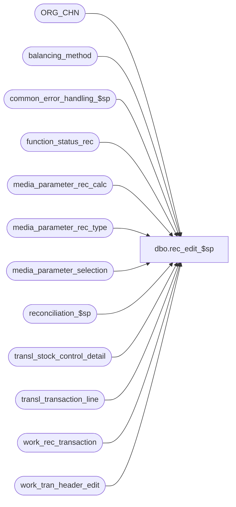

# dbo.rec_edit_$sp

**Database:** auditworks_external  
**Server:** bedrockdb01  

## Architecture Diagram



## Table Dependencies

| Referenced Table |
|---|
| ORG_CHN |
| balancing_method |
| common_error_handling_$sp |
| function_status_rec |
| media_parameter_rec_calc |
| media_parameter_rec_type |
| media_parameter_selection |
| reconciliation_$sp |
| transl_stock_control_detail |
| transl_transaction_line |
| work_rec_transaction |
| work_tran_header_edit |

## Stored Procedure Code

```sql
create proc dbo.rec_edit_$sp 
@process_id	         binary(16),
@user_id                 int,
@edit_process_no         tinyint = 1,
@errmsg                  nvarchar(2000) OUTPUT,
@process_timestamp	 float,
@rec_process_id 	 numeric(12,0) OUTPUT,
@recovery_flag		 tinyint = 0


AS

/* 
PROC NAME: rec_edit_$sp
     DESC: Builds list of tender transaction lines (in work_rec_transaction) for later posting to media rec.
           Called by edit_post_$sp.

 HISTORY: 
Date      Name          Def# Desc
Nov27,14  Paul     TFS-94103 Use try .. catch to capture errors, removed index hints since edit streams can't use them
Aug13,14  Vicci       148123 Revised handling for mutiple-actual-handing option code 4 to handle weird QA scenario where initial float load 
                             (expected amount) was back-dated using attachment 33  (which normally applies only to counts)  
                             even though this option is not valid for rec-types with carryforwards (since it is single date only).
Dec03,13  Vicci       148123 Log business date overridden by date portion for Period Reconciled / Period Entity Reconciled attachments 
			     to Date Reconciled field of work_rec_transaction for counts for use with multipe-media-counts added option.
Sep23,08  Paul        104990 Corrected comments re uplift of 1-3Y341F
May28,08  Vicci       101622 Uplift 1-3Y341F to SA5
Jan29,08  Vicci        97639 Uplift 97569 to SA5 (add till_no when populating work_rec_transaction).
Oct18,06  Tim          77870 add column transaction_no to media_reconciliation_trans, work_rec_transaction,
                             work_rec_exchange_line and populate it.
Nov02,05  Paul         62153 apply 61728 to SA5
Mar03,05  Paul       DV-1216 apply 47977 to SA5
Nov17,04  Paul       DV-1167 apply 44504, 43923 to SA5
Sep20,04  Maryam     DV-1146 Change user name to user_id, apply 31258 to SA5.
Aug05,04  Paul       DV-1071 incorporate ORG_BANK changes, use ORG_CHN table as the new Store table.
May05,04  Maryam     DV-1071 Receive @process_id and pass it to the sub procs
Apr16,04  Sab	     DV-1068 Remove code for petty_cash_reconciliation, media rec variables
          SA5 starts here
May28,08  Vicci     1-3Y341F Do not carry-forward zero dollar counts in order to provide user with method of "expiring"
                             unused tills, avoid clutter of infrequently used tenders/cashiers, etc.
Jan29,08  Vicci        97569 Add till_no when populating work_rec_transaction
Oct16,06  Tim          77868 Add transaction_no when populating work_rec_transaction
Oct27,05  David        61728 Use transl_transaction_line.encrypted_reference_no.
Jan31,05  Daphna       47977 Allow media rec to continue if some store/dates are locked and recovery logic
Nov17,04  Paul         44504 populate reference_type in work_rec_transaction
Nov08,04  Maryam       43923 avoid the split of business date between the 2 Media-Rec systems in the case of 24-hour stores.
Jun29,04  Maryam       31258 update work_rec_transaction when line_action = 56 
Mar10,04  Maryam       25354 fix balancing_entity to default to 1 when till no is not provided and also use the
                             abs(unit) to avoid negative till_no.
Jan19,04  Maryam       22004 Fix update from stock-control attachment to apply balancing_entity
                             to reconciliation pickup's contribution to deposit rec and safe rec
                             even though they are not "rec-side 1" nor carryforwards.
Jan14,04  Maryam       20059 Moved call to rec_calc_rebuild to rec_balancing_method_edit_$sp 
                             Moved call to rec_balancing_method_edit_$sp to edit_post_$sp                                       
Dec29,03  Paul       DV-1007 remove select into, add nolock hints.
                             (Maryam) Do a separate update for stock control header level attachment.
                             As header level attachment for initial float load just has the count date,
                             line level will supersede the header level attachment. 
                             To properly handle the balancing_entity convert units to int.
Nov06,03  Maryam     DV-1010 Take contribution_sign into account for calculation of rec_quantity.
                             (Paul) remove the code of setting the edit_status for edit_function_no of
                             1 and 70, remove call to reconciliation_$sp.
Aug11,03 Paul         11627 improve performance, add forceorder hint
Jul10,03  Maryam     1-KL08H Author
*/

DECLARE
  @cursor_open 			tinyint,
  @errmsg2			nvarchar(2000),
  @errline			int,
  @errno                        int,
  @message_id			int,
  @object_name			nvarchar(255),
  @operation_name		nvarchar(100),
  @process_no			smallint,
  @process_name			nvarchar(100),
  @rows				int,
  @rec_status                   tinyint

SELECT 
       @cursor_open  = 0,       
       @process_no   = 4,
       @process_name = 'rec_edit_$sp',
       @message_id   = 201068

BEGIN TRY

IF @recovery_flag = 1
BEGIN
        SELECT @errmsg         = 'Unable to declare cursor rec_status_crsr',
               @object_name    = 'rec_status_crsr',
               @operation_name = 'OPEN';
  DECLARE rec_status_crsr CURSOR FAST_FORWARD
   FOR 
    SELECT rec_process_id,
           process_id,
           rec_status
      FROM function_status_rec WITH (NOLOCK)
     WHERE edit_process_no = @edit_process_no
     ORDER BY rec_status DESC, rec_process_id;

    OPEN rec_status_crsr;
    SELECT @cursor_open = 1;

    WHILE 1 = 1
    BEGIN
      FETCH rec_status_crsr
       INTO @rec_process_id,
            @process_id,
            @rec_status;
            
      IF @@fetch_status <> 0
        BREAK;
      
     IF @rec_status = 0
       BEGIN
            SELECT @errmsg = 'Failed to delete function_status_rec.',
                   @object_name = 'function_status_rec',
	           @operation_name = 'DELETE';
         DELETE function_status_rec
          WHERE rec_process_id = @rec_process_id;
         /* work_rec_transaction is cleaned up by edit_cleanup_details_$sp */
       END;
      ELSE
       BEGIN -- rollforward media rec
            SELECT @errmsg = 'Failed to execute reconciliation_$sp.',
                   @object_name = 'reconciliation_$sp',
                   @operation_name = 'EXECUTE';
         EXEC reconciliation_$sp @process_no, @process_id, @rec_process_id, @rec_status, @errmsg OUTPUT, @user_id, @edit_process_no;
       END;
    
    END; --WHILE 1 = 1
    
    CLOSE rec_status_crsr;
    DEALLOCATE rec_status_crsr;
    SELECT @cursor_open = 0;

  RETURN; 
END; -- @recovery_flag = 1

      SELECT @errmsg = 'Failed to insert function_status_rec.',
   	     @object_name = 'function_status_rec',
	     @operation_name = 'INSERT';
  INSERT function_status_rec(
         process_id,
         function_no,
         rec_status,   
         edit_process_no)
  VALUES (@process_id,
          @process_no,
          0,
          @edit_process_no);

  SELECT @rec_process_id = @@identity;

      SELECT @errmsg = 'Failed to delete work_rec_transaction.',
	     @object_name = 'work_rec_transaction',
	     @operation_name = 'DELETE';
  DELETE work_rec_transaction
   WHERE rec_process_id = @rec_process_id;

/* Find transactions affecting reconciliation. Get list of tender transaction lines */
/* rec_quantiy is quantity of the expected amounts that are not transfers nor carryforwards 
   OR the actual quantity*/

    SELECT @errmsg = 'Failed to insert work_rec_transaction.(Tender transaction line)',
	   @object_name = 'work_rec_transaction',
	   @operation_name = 'INSERT';
INSERT work_rec_transaction(
       rec_process_id,
       transaction_id,
       transaction_date,
       store_no,
       register_no,
       cashier_no,
       transaction_category,
       line_id,
       line_object,
       line_action,
       reference_no,
       rec_side,
       rec_amount_type,
       rec_amount_subtype,
       tender_total,
       rec_amount,
       rec_quantity,
       rec_exchange,
       void_flag,
       multiple_actual_handling_code,
       period_from_date_time,
       period_to_date_time,
       balancing_store_no,
       balancing_register_no,
       balancing_cashier_no,
       balancing_till_no,
       balancing_bank_no, 
       rec_type,
       balancing_method,
       balancing_entity,
       rec_group_line_object,
       foreign_currency_id,
       convert_to_domestic,
       track_qty,
       short_tolerance_amount,
       short_tolerance_qty,
       short_tolerance_percent,
       unrec_tolerance_days,
       unrec_tolerance_amount, 
       store_no_factor,
       register_no_factor,
       till_no_factor,
       cashier_no_factor,
       bank_no_factor,
       posted_flag,
       audit_activity_flag,
       media_parameter_set_no,
       reference_type,  
       transaction_no,  
       till_no,
       date_reconciled)
SELECT @rec_process_id,
       wh.transaction_id,
       wh.transaction_date,
       wh.store_no,
       wh.register_no,
       wh.cashier_no,
       wh.transaction_category,
       l.line_id,
       l.line_object,
       l.line_action,
       IsNull(l.encrypted_reference_no, l.reference_no),
       o.rec_side,
       o.rec_amount_type,
       o.rec_amount_subtype,
       wh.tender_total, 
       (1-ABS(SIGN(o.rec_amount_type - 1))) * o.contribution_sign * l.gross_line_amount * 
       l.voiding_reversal_flag, --rec_amount
       ( (1-ABS(SIGN(o.rec_amount_type - 1))) * ABS(SIGN(rec_side -1)) *
       ABS(SIGN(o.rec_amount_subtype -3)) * ABS(SIGN(o.rec_amount_subtype)) * 
       l.voiding_reversal_flag * SIGN(l.gross_line_amount)* o.contribution_sign ) +
       ( (1-ABS(SIGN(o.rec_amount_type - 2))) * l.gross_line_amount * 
       l.voiding_reversal_flag ), --rec_quantity
       (1-ABS(SIGN(o.rec_amount_type - 3))) * o.contribution_sign * l.gross_line_amount *
        l.voiding_reversal_flag, --rec_exchange
       (1-SIGN(ABS(SIGN(wh.transaction_void_flag - 8)) * SIGN(wh.transaction_void_flag)  + l.line_void_flag)) * (ABS(SIGN(wh.transaction_void_flag - 8)) - (1-ABS(SIGN(wh.transaction_void_flag - 8)))),
       o.multiple_actual_handling_code, 
       wh.entry_date_time,
       wh.entry_date_time, 
       wh.store_no * store_no_factor,
       wh.register_no * register_no_factor,
       wh.cashier_no * cashier_no_factor,
       ISNULL(wh.till_no, 1) * till_no_factor,
       s.PRMRY_BANK_ACNT_ID * bank_no_factor, 
       o.rec_type,
       o.balancing_method,
       ISNULL(SUBSTRING(CONVERT(nvarchar, wh.store_no), store_no_factor, 255 * store_no_factor) 
       + SUBSTRING(SUBSTRING('.', store_no_factor, 1) + CONVERT(nvarchar, wh.register_no), register_no_factor, 255 * register_no_factor)
       + SUBSTRING(SUBSTRING('.', SIGN(store_no_factor + register_no_factor), 1) + CONVERT(nvarchar, cashier_no), cashier_no_factor, 255 * cashier_no_factor) 
       + SUBSTRING(SUBSTRING('.', SIGN(store_no_factor + register_no_factor + cashier_no_factor), 1) + CONVERT(nvarchar, ISNULL(wh.till_no, 1)), till_no_factor, 255 * till_no_factor)
       + SUBSTRING(SUBSTRING('.', SIGN(store_no_factor + register_no_factor + cashier_no_factor + till_no_factor), 1) + CONVERT(nvarchar, s.PRMRY_BANK_ACNT_ID), bank_no_factor, 255 * bank_no_factor)
        , ' '), --balancing_entity 
       o.rec_group_line_object,
       o.foreign_currency_id,
       o.convert_to_domestic,
       o.track_qty,
       o.short_tolerance_amount,
       o.short_tolerance_qty,
       o.short_tolerance_percent,
       o.unrec_tolerance_days,
       o.unrec_tolerance_amount, 
       o.store_no_factor,
       o.register_no_factor,
       o.till_no_factor,
       o.cashier_no_factor,
       o.bank_no_factor,
 0,
       0,
       p.media_parameter_set_no,
       l.reference_type,
       l.transaction_no,
       wh.till_no,
       CASE WHEN o.multiple_actual_handling_code = 4 AND (o.rec_side = 1 OR o.rec_amount_subtype = 0 OR l.line_action = 56) THEN wh.transaction_date ELSE NULL END  --148123  date_reconciled
  FROM work_tran_header_edit wh WITH (NOLOCK),
       transl_transaction_line l WITH (NOLOCK),
       media_parameter_selection p WITH (NOLOCK),
       media_parameter_rec_calc o WITH (NOLOCK),
       ORG_CHN s WITH (NOLOCK)
 WHERE wh.date_reject_id = 0
   AND wh.sa_rejection_flag = 0
   AND wh.transaction_no = l.transaction_no
   AND wh.entry_date_time = l.entry_date_time
   AND wh.store_no = l.store_no
   AND wh.register_no = l.register_no
   AND wh.transaction_series = l.transaction_series
   AND wh.store_no = s.ORG_CHN_NUM
   AND l.store_no = p.store_no
   AND l.register_no = p.register_no 
   AND l.entry_date_time >= p.effective_from_date 
   AND (l.entry_date_time < p.effective_until_date OR p.effective_until_date IS NULL) 
   AND p.media_parameter_set_no = o.media_parameter_set_no 
   AND l.line_object = o.line_object 
   AND l.line_action = o.line_action
   AND (l.gross_line_amount <> 0 OR o.rec_side <> 0 OR o.rec_amount_subtype <> 0);  --1-3Y341F

/* Get list of closeouts if multiple reconciliation actual handling option is closeout dependent */
   SELECT @errmsg = 'Failed to insert work_rec_transaction.(Closeout dependent transactions)',
	   @object_name = 'work_rec_transaction',
	   @operation_name = 'INSERT';
INSERT work_rec_transaction(
       rec_process_id,
       transaction_id,
       transaction_date,
       store_no,
       register_no,
       cashier_no,
       transaction_category,
       line_id,
       line_object,
       line_action,
       reference_no,
       rec_side,
       rec_amount_type,
       rec_amount_subtype,
       tender_total,
       rec_amount,
       rec_quantity,
       rec_exchange,
       void_flag,
       multiple_actual_handling_code, 
       period_from_date_time,
       period_to_date_time,
       balancing_store_no,
       balancing_register_no,
       balancing_cashier_no,
       balancing_till_no,
       balancing_bank_no, 
       rec_type,
       balancing_method,
       balancing_entity,
       rec_group_line_object,
       foreign_currency_id,
       convert_to_domestic,
       track_qty,
       short_tolerance_amount,
       short_tolerance_qty,
       short_tolerance_percent,
       unrec_tolerance_days,
       unrec_tolerance_amount, 
       store_no_factor,
       register_no_factor,
       till_no_factor,
       cashier_no_factor,
       bank_no_factor,
       posted_flag,
       audit_activity_flag,
       media_parameter_set_no,
       reference_type,
       transaction_no,  
       till_no )
SELECT @rec_process_id,
       wh.transaction_id,
       wh.transaction_date,
       wh.store_no,
       wh.register_no,
       wh.cashier_no,
       wh.transaction_category,
       0,    -- line_id
       -2,   -- line_object
       38,   -- line_action
       null, -- reference_no
       1,    -- rec_side
       0,    -- rec_amount_type
       6,    -- rec_amount_subtype
       0,    -- tender_total,
       0,    -- rec_amount,
       0,
       0,
       1,    -- void_flag
       rt.multiple_actual_handling_code, 
       wh.entry_date_time,
       wh.entry_date_time,
       wh.store_no * store_no_factor,
       wh.register_no * register_no_factor,
       wh.cashier_no * cashier_no_factor,
       ISNULL(wh.till_no, 1) * till_no_factor,
       s.PRMRY_BANK_ACNT_ID * bank_no_factor, 
       rt.rec_type,
       rt.balancing_method,
       ISNULL(SUBSTRING(CONVERT(nvarchar, wh.store_no), store_no_factor, 255 * store_no_factor ) 
       + SUBSTRING(SUBSTRING('.', store_no_factor, 1) + CONVERT(nvarchar, wh.register_no), register_no_factor, 255 * register_no_factor )
 + SUBSTRING(SUBSTRING('.', SIGN(store_no_factor + register_no_factor), 1) + CONVERT(nvarchar, cashier_no), cashier_no_factor, 255 * cashier_no_factor) 
       + SUBSTRING(SUBSTRING('.', SIGN(store_no_factor + register_no_factor + cashier_no_factor), 1) + CONVERT(nvarchar, ISNULL(wh.till_no, 1)), till_no_factor, 255 * till_no_factor)
       + SUBSTRING(SUBSTRING('.', SIGN(store_no_factor + register_no_factor + cashier_no_factor + till_no_factor), 1) + CONVERT(nvarchar, s.PRMRY_BANK_ACNT_ID), bank_no_factor, 255 * bank_no_factor)
       , ' '),   --balancing_entity
       -2,       --rec_group_line_object
       NULL,     --foreign_currency_id
       0,        --convert_to_domestic
       0,        --track_qty
       0,     --short_tolerance_amount
       0,        --short_tolerance_qty
       0,        --short_tolerance_percent
       0,        --unrec_tolerance_days
       0,        --unrec_tolerance_amount
       b.store_no_factor,
       b.register_no_factor,
       b.till_no_factor,
       b.cashier_no_factor,
       b.bank_no_factor,
       0,
       0,
       p.media_parameter_set_no,
       0, -- reference_type n/a
       wh.transaction_no,   
       wh.till_no  
  FROM work_tran_header_edit wh WITH (NOLOCK),
       media_parameter_rec_type rt WITH (NOLOCK),
       media_parameter_selection p WITH (NOLOCK),
       ORG_CHN s WITH (NOLOCK),
       balancing_method b WITH (NOLOCK)
 WHERE wh.closeout_flag > 0
   AND wh.date_reject_id = 0
   AND wh.sa_rejection_flag = 0
   AND wh.transaction_void_flag = 0
   AND wh.store_no = s.ORG_CHN_NUM
   AND rt.multiple_actual_handling_code IN (1, 2) 
   AND rt.media_parameter_set_no = p.media_parameter_set_no 
   AND p.store_no = wh.store_no
   AND p.register_no = wh.register_no
   AND p.effective_from_date <= wh.entry_date_time
   AND (p.effective_until_date IS NULL OR p.effective_until_date > wh.entry_date_time)
   AND rt.balancing_method = b.balancing_method;

/* If a reconciliation transaction with actual amounts has been entered 'on-behalf' of 
   another store/reg/cashier/till or for a period ending 'as-of' another date/time, adjust
   the balancing entity accordingly */

  --Date update limited to actual to prevent a count done Tuesday morning 
  --from becoming part of Monday's expected bank deposit.  As-of dating cannot logically be
  --applied to Media Balance Rec (count/carryforward/rec-pickup combo) since although the pickup must have physically 
  --occurred on Monday the amount picked-up was not known at that time and did not become until
  --until Tuesday.  The system will treat the reconciliation and its pickup as having occurred
  --on Monday, but leave the contribution of this pickup to the Deposit rec on Weds
  --since this is as close as it can model reality, but the result is that funds are
  --removed from the Balance Rec on Monday but only become part of the Deposit rec on Tues.
    
--Header level updates
    SELECT @errmsg = 'Failed to limit the reconciliation period based on the cut-off date (count_date) specified in the header level reconciliation (stock_control) attachment',
	   @object_name = 'work_rec_transaction',
	   @operation_name = 'UPDATE';
UPDATE work_rec_transaction
   SET period_from_date_time = t.count_date,
       period_to_date_time = t.count_date,
       transaction_date = CASE WHEN w.multiple_actual_handling_code = 4 AND w.line_action = 56 THEN CONVERT(smalldatetime, CONVERT(nchar(8), t.count_date,112)) ELSE w.transaction_date END, --148123 revision
       date_reconciled = CASE WHEN w.multiple_actual_handling_code = 4 AND t.count_date < w.transaction_date THEN CONVERT(smalldatetime, convert(nchar(8), t.count_date,112)) ELSE w.date_reconciled END  --148123
	                 --Note, the < transaction date is just used to mitigate the problem if an existing client with multiple media coounts added was actually specifying an after midnight time 
	                 --(time is not longer supposed to be set for multiple_actual_handling_code 4 in attachments) and wanted to preserve prior functionality where it would be added to other counts for the business date;  
	                 --not perfect since reverse issue might exist, i.e. existing client still setting time closed on D1 9PM and count again before midnight but had the attachment and yet still wanted it merged with D2 counts.
  FROM transl_stock_control_detail t WITH (NOLOCK),
       work_rec_transaction w WITH (NOLOCK)
 WHERE t.display_def_id = 33
   AND t.line_id = 0
   AND t.count_date IS NOT NULL --
   AND t.transaction_id = w.transaction_id 
   AND w.rec_process_id = @rec_process_id
   AND (w.rec_side = 1 OR w.rec_amount_subtype = 0 OR line_action = 56);

    SELECT @errmsg = 'Failed to indicate to which balancing entity the reconciliation applies based on the details specified in the header level reconciliation (stock_control) attachment',
	   @object_name = 'work_rec_transaction',
	   @operation_name = 'UPDATE';
UPDATE work_rec_transaction
   SET balancing_store_no = ISNULL(t.originating_store_no * w.store_no_factor, w.balancing_store_no),
       balancing_register_no = ISNULL(t.location_no * w.register_no_factor, balancing_register_no),  
       balancing_cashier_no = ISNULL(t.other_store_no * w.cashier_no_factor, w.balancing_cashier_no), 
       balancing_till_no = ISNULL(ABS(t.units) * w.till_no_factor, w.balancing_till_no),
       balancing_bank_no = s.PRMRY_BANK_ACNT_ID * w.bank_no_factor,
       balancing_entity = ISNULL(SUBSTRING(CONVERT(nvarchar, ISNULL(t.originating_store_no, w.balancing_store_no)), store_no_factor, 255 * store_no_factor) 
       + SUBSTRING(SUBSTRING('.', store_no_factor, 1) + CONVERT(nvarchar, ISNULL(location_no, balancing_register_no)), register_no_factor, 255 * register_no_factor)
       + SUBSTRING(SUBSTRING('.', SIGN(store_no_factor + register_no_factor), 1) + CONVERT(nvarchar, ISNULL(other_store_no, balancing_cashier_no)), cashier_no_factor, 255 * cashier_no_factor) 
       + SUBSTRING(SUBSTRING('.', SIGN(store_no_factor + register_no_factor + cashier_no_factor), 1) + CONVERT(nvarchar, ISNULL(CONVERT(int,ABS(units)), balancing_till_no)), till_no_factor, 255 * till_no_factor)
       + SUBSTRING(SUBSTRING('.', SIGN(store_no_factor + register_no_factor + cashier_no_factor + till_no_factor), 1) + CONVERT(nvarchar, s.PRMRY_BANK_ACNT_ID), bank_no_factor, 255 * bank_no_factor),
       ' ')   --balancing_entity
  FROM transl_stock_control_detail t WITH (NOLOCK),
       work_rec_transaction w WITH (NOLOCK),
       ORG_CHN s WITH (NOLOCK)
 WHERE t.display_def_id IN (33,43)
   AND t.line_id = 0
   AND t.transaction_id = w.transaction_id 
   AND w.rec_process_id = @rec_process_id
   AND ISNULL(t.originating_store_no, w.store_no) = s.ORG_CHN_NUM; -- only update if store is valid

--line level update
    SELECT @errmsg = 'Failed to limit the reconciliation period based on the cut-off date (count_date) specified in the line level reconciliation (stock_control) attachment.',
	   @object_name = 'work_rec_transaction',
	   @operation_name = 'UPDATE';
UPDATE work_rec_transaction
   SET period_from_date_time = t.count_date,
       period_to_date_time = t.count_date,
       transaction_date = CASE WHEN w.multiple_actual_handling_code = 4 AND w.line_action = 56 THEN CONVERT(smalldatetime, CONVERT(nchar(8), t.count_date,112)) ELSE w.transaction_date END, --148123 revision
       date_reconciled = CASE WHEN w.multiple_actual_handling_code = 4 AND t.count_date < w.transaction_date THEN CONVERT(smalldatetime, convert(nchar(8), t.count_date,112)) ELSE w.date_reconciled END  --148123
  FROM transl_stock_control_detail t WITH (NOLOCK),
       work_rec_transaction w WITH (NOLOCK)
 WHERE t.display_def_id = 33
   AND t.count_date IS NOT NULL -- 
   AND t.transaction_id = w.transaction_id 
   AND t.line_id = w.line_id 
   AND w.rec_process_id = @rec_process_id
   AND (w.rec_side = 1 OR w.rec_amount_subtype = 0 OR w.line_action = 56);

    SELECT @errmsg = 'Failed to indicate to which balancing entity the reconciliation applies based on the details specified in the line level reconciliation (stock_control) attachment',
	   @object_name = 'work_rec_transaction',
	   @operation_name = 'UPDATE';
UPDATE work_rec_transaction
   SET balancing_store_no = ISNULL(t.originating_store_no * w.store_no_factor, w.balancing_store_no),
       balancing_register_no = ISNULL(t.location_no * w.register_no_factor, balancing_register_no),  
       balancing_cashier_no = ISNULL(t.other_store_no * w.cashier_no_factor, w.balancing_cashier_no), 
       balancing_till_no = ISNULL(ABS(t.units) * w.till_no_factor, w.balancing_till_no),
       balancing_bank_no = s.PRMRY_BANK_ACNT_ID * w.bank_no_factor,
       balancing_entity = ISNULL(SUBSTRING(CONVERT(nvarchar, ISNULL(t.originating_store_no, w.balancing_store_no)), store_no_factor, 255 * store_no_factor) 
       + SUBSTRING(SUBSTRING('.', store_no_factor, 1) + CONVERT(nvarchar, ISNULL(location_no, balancing_register_no)), register_no_factor, 255 * register_no_factor)
       + SUBSTRING(SUBSTRING('.', SIGN(store_no_factor + register_no_factor), 1) + CONVERT(nvarchar, ISNULL(other_store_no, balancing_cashier_no)), cashier_no_factor, 255 * cashier_no_factor) 
       + SUBSTRING(SUBSTRING('.', SIGN(store_no_factor + register_no_factor + cashier_no_factor), 1) + CONVERT(nvarchar, ISNULL(convert(int,ABS(units)), balancing_till_no)), till_no_factor, 255 * till_no_factor)
       + SUBSTRING(SUBSTRING('.', SIGN(store_no_factor + register_no_factor + cashier_no_factor + till_no_factor), 1) + CONVERT(nvarchar, s.PRMRY_BANK_ACNT_ID), bank_no_factor, 255 * bank_no_factor),
       ' ')   --balancing_entity
  FROM transl_stock_control_detail t WITH (NOLOCK),
       work_rec_transaction w WITH (NOLOCK),
       ORG_CHN s WITH (NOLOCK)
 WHERE t.display_def_id IN (33, 43)
   AND t.transaction_id = w.transaction_id 
   AND t.line_id = w.line_id 
   AND w.rec_process_id = @rec_process_id
   AND ISNULL(t.originating_store_no, w.store_no) = s.ORG_CHN_NUM; -- only update if store is valid


RETURN;


business_error:   /* Business Rule handler. */

	SELECT @errmsg2 = @errmsg;

	/* Could include similar cleanup code to system error trap when needed (example is from move_store_$sp).
	   However, could also exclude the cleanup code here since the outer system error catch should fire again after the exec below. */

	EXEC common_error_handling_$sp 4, @errno, @errmsg, 0, @message_id, 
	@process_name, @object_name, @operation_name, 1, @edit_process_no, 0,
	null, 0, null, null, null, null, null, null, 0, @process_id, @user_id;
	  /* Note: when the exec above raises an error, that action also fires the system error trap (below) */
	RETURN;
END TRY

BEGIN CATCH; -- trap system errors
    /* common error handling. Appending proc name here because a rollback could occur if called within a transaction. */

        SELECT @errno = ERROR_NUMBER(),
		@errline = ERROR_LINE();

        SELECT @errmsg = CONVERT(nvarchar, @errno) + ':' + @process_name + ':' + CONVERT(nvarchar, @errline) + ':'
               + COALESCE(@errmsg, ' ') + ':' + ERROR_MESSAGE();

	 /* this condition will only be true when raise error in traps above fire this general catch */
	IF @errmsg2 IS NOT NULL
	  SELECT @errmsg = @errmsg2;

        IF @cursor_open = 1
	  BEGIN
		CLOSE rec_status_crsr;
		DEALLOCATE rec_status_crsr;
	  END;
	  
	EXEC common_error_handling_$sp 4, @errno, @errmsg, 0, @message_id, 
	@process_name, @object_name, @operation_name, 1, @edit_process_no, 0,
	null, 0, null, null, null, null, null, null, 0, @process_id, @user_id;

	RETURN;
END CATCH;
```

