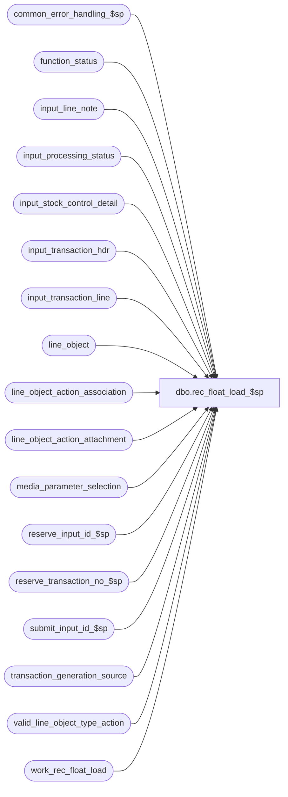

# dbo.rec_float_load_$sp

**Database:** auditworks_external  
**Server:** bedrockdb01  

## Architecture Diagram



## Table Dependencies

| Referenced Table |
|---|
| common_error_handling_$sp |
| function_status |
| input_line_note |
| input_processing_status |
| input_stock_control_detail |
| input_transaction_hdr |
| input_transaction_line |
| line_object |
| line_object_action_association |
| line_object_action_attachment |
| media_parameter_selection |
| reserve_input_id_$sp |
| reserve_transaction_no_$sp |
| submit_input_id_$sp |
| transaction_generation_source |
| valid_line_object_type_action |
| work_rec_float_load |

## Stored Procedure Code

```sql
create proc dbo.rec_float_load_$sp 
@process_id  		binary(16),
@user_id                int,
@rec_group_line_object	smallint,
@media_parameter_set_no	smallint,
@effective_date		datetime,
@errmsg			nvarchar(255) OUTPUT,
@process_start_time 	datetime OUTPUT
 
AS

 /* 
PROC NAME: rec_float_load_$sp
     DESC: Populates generated transactions containing initial float amounts into input tables for processing by edit.
     Called by frontend.

  Can use same version for SA5 and SA5.1

HISTORY:
Date     Name         Def#  Desc
May15,13 Vicci      144012  Configure header-level Entity/Period Reconciled attachment as optional to avoid SA Rejects when header store
                            and float store have same parameter set.  Also add note-type 9007 config if missing.
Apr20,12 Paul       134132  prevent error 2627 by setting dummy_transaction_category on insert
Jun23,11 Vicci      128057  Don't remove other Information Set attachments when the Entity/Period Reconciled attachment is missing.
                            Specify display definition ID upon insert.
Nov14,06 Paul      DV-1335  added nolock hints
Mar03,05 Paul      DV-1216  apply 42764 to SA5 
Sep20,04 Maryam    DV-1146  Change user_name to user_id.
Apr20,04 Maryam    DV-1071  receive @user_name and pass it to the sub procs.
Oct26,04 Daphna      42764  Error trap for media_parameter_selection NOT FOUND for store/reg/eff.date
Jun29,04 Maryam      31258  Properly insert into line_object_action_attachment.
Dec29,03 Maryam    DV-1007  Handle intial float when the media_parameter_set_no of head office store
                            is different from store via header level line_note attachment and stock control attachment.
Aug11,03 Winnie	     11627  Set correct input_id.
Jun04,03 Winnie	      9250  Media Reconciliation enhancements.	

*/

DECLARE
  @errno			int,
  @office_media_parameter_set_no smallint, 
  @message_id			int,
  @object_name			nvarchar(255),
  @operation_name		nvarchar(100),
  @process_name			nvarchar(100),
  @process_no			integer,
  @store_no			int,
  @register_no			smallint,
  @cashier_no			int,
  @transaction_series		nchar(1),
  @transaction_category		tinyint,
  @line_action			tinyint,
  @input_id			numeric(12,0),
  @trans_qty			numeric,
  @originating_store_no		int,
  @location_no			smallint,
  @units			smallint,
  @other_store_no		int,
  @gross_line_amount		money,
  @max_tran_no			int,
  @next_tran_no			int,
  @cursor_open			tinyint,
  @line_id 			smallint,
  @entry_date_time		datetime,
  @rows                         tinyint

SELECT @process_name     = 'rec_float_load_$sp',
       @message_id       = 201068,
       @process_no 	 = 73,
       @line_action 	 = 56,
       @entry_date_time  = getdate()

EXEC reserve_input_id_$sp @process_id, @user_id, null, @input_id OUTPUT, @errmsg OUTPUT, @process_no

SELECT @errno = @@error
IF @errno != 0
  BEGIN
    IF @errmsg IS NULL -- then
      SELECT @errmsg = 'Failed to execute stored proc reserve_input_id_$sp.'
    SELECT @object_name = 'reserve_input_id_$sp',
           @operation_name = 'EXECUTE'
    GOTO error
  END
  
SELECT @store_no = store_no,
       @register_no = register_no,
       @cashier_no = cashier_no,
       @transaction_series = transaction_series,
       @transaction_category = transaction_category
  FROM transaction_generation_source
 WHERE process_no = @process_no    

SELECT @errno = @@error
IF @errno != 0
  BEGIN
    SELECT @errmsg = 'Failed to select from transaction_generation_source.',
           @object_name = 'transaction_generation_source',
           @operation_name = 'SELECT'
    GOTO error
  END 

IF @register_no = 0
BEGIN
  SELECT @errmsg = 'Transaction generation source table has not been set up',
         @errno = 201678,
         @message_id = 201678
  GOTO error
END

SELECT @office_media_parameter_set_no = media_parameter_set_no
  FROM media_parameter_selection 
 WHERE store_no = @store_no
   AND register_no = @register_no
   AND @effective_date >= effective_from_date
   AND (@effective_date< effective_until_date OR effective_until_date IS NULL)
   
SELECT @errno = @@error, @rows = @@rowcount
IF @errno != 0
BEGIN
    SELECT @errmsg = 'Failed to select media_parameter_set_no.',
           @object_name = 'media_parameter_selection',
           @operation_name = 'SELECT'
    GOTO error
  END

IF @rows = 0  -- NO DATA FOUND
BEGIN
  SELECT @errmsg = 'Store No = ' + convert(nvarchar,@store_no) +
                   ', Register No = ' + convert(nvarchar, @register_no) +
                   ', Effective Date = ' + @effective_date + ' not found',
         @object_name = 'media_parameter_selection',
         @operation_name = 'SELECT'
  GOTO error
END 
  
SELECT @trans_qty = CEILING(CONVERT(FLOAT,COUNT(*))/100)
  FROM work_rec_float_load WITH (NOLOCK)
 WHERE process_id = @process_id

SELECT @errno = @@error
IF @errno != 0
  BEGIN
    SELECT @errmsg = 'Failed to select from work_rec_float_load.',
           @object_name = 'work_rec_float_load',
           @operation_name = 'SELECT'
    GOTO error
  END 

EXEC reserve_transaction_no_$sp @process_id, @user_id, @process_no, @store_no,@register_no,@transaction_series,
     @trans_qty, @max_tran_no OUTPUT, @next_tran_no OUTPUT, @errmsg OUTPUT

SELECT @errno = @@error
IF @errno != 0
 BEGIN
    IF @errmsg IS NULL /* then */
      SELECT @errmsg = 'Failed to execute stored procedure reserve_transaction_no_$sp'
  SELECT @object_name = 'reserve_transaction_no_$sp',
           @operation_name = 'EXECUTE'
    GOTO error
  END

IF NOT EXISTS (SELECT line_object
                 FROM line_object_action_association
                WHERE transaction_category = @transaction_category
                  AND line_object = @rec_group_line_object
                  AND line_action = @line_action)  
  BEGIN
    INSERT INTO line_object_action_association
           (transaction_category,
            line_object,
            line_action,
            line_object_type,
            db_cr_none,
            store_balance_group)
    SELECT @transaction_category,
           @rec_group_line_object,
           56,
           o.line_object_type,
           v.default_db_cr_none,
           v.store_balance_group
      FROM valid_line_object_type_action v, line_object o
     WHERE o.line_object = @rec_group_line_object
       AND o.line_object_type = v.line_object_type
       AND v.line_action = 56

    SELECT @errno = @@error
    IF @errno != 0
      BEGIN
        SELECT @errmsg = 'Failed to insert line_object_action_association.',
               @object_name = 'line_object_action_association',
               @operation_name = 'INSERT'
        GOTO error
      END 
  END

IF NOT EXISTS (SELECT line_object
                 FROM line_object_action_attachment
                WHERE (transaction_category = @transaction_category
                       OR transaction_category IS NULL)
                  AND attachment_type = 3
                  AND line_object = @rec_group_line_object
                  AND line_action = @line_action
                  AND note_type = 33)
  BEGIN     
    INSERT INTO line_object_action_attachment
           (line_object,
            line_action,
            transaction_category,
            attachment_type,
            note_type,
            dummy_transaction_category)
    VALUES (@rec_group_line_object,
            @line_action,
            @transaction_category,
            3, 
            33,
            COALESCE(CONVERT(nvarchar,@transaction_category),'null'))                
    SELECT @errno = @@error
    IF @errno != 0
      BEGIN
        SELECT @errmsg = 'Failed to insert line_object_action_attachment.',
               @object_name = 'line_object_action_attachment',
               @operation_name = 'INSERT'
        GOTO error
      END     
  END          

IF @office_media_parameter_set_no <> @media_parameter_set_no
BEGIN

  IF NOT EXISTS (SELECT 1
                 FROM line_object_action_attachment
                WHERE (transaction_category = @transaction_category
                       OR transaction_category IS NULL)
                  AND attachment_type = 3
	          AND line_object = -1
                  AND line_action = 0
                  AND note_type = 33)
  BEGIN         
    INSERT INTO line_object_action_attachment
           (line_object,
            line_action,
            transaction_category,
            attachment_type,
            note_type,
            dummy_transaction_category,
            attachment_mandatory)
    VALUES (-1,
            0,
            @transaction_category,
            3, 
            33,
            COALESCE(CONVERT(nvarchar,@transaction_category),'null'),
            0)                
    SELECT @errno = @@error
    IF @errno != 0
      BEGIN
        SELECT @errmsg = 'Failed to set up a header level attachment for Entity/Period reconciliation attachment.',
               @object_name = 'line_object_action_attachment',
               @operation_name = 'INSERT'
        GOTO error
      END                                
  END

  IF NOT EXISTS (SELECT 1
                 FROM line_object_action_attachment
                WHERE (transaction_category = @transaction_category
                       OR transaction_category IS NULL)
                  AND attachment_type = 10
	          AND line_object = -1
                  AND line_action = 0
                  AND note_type = 9007)
  BEGIN         
    INSERT INTO line_object_action_attachment
           (line_object,
            line_action,
            transaction_category,
            attachment_type,
            note_type,
            dummy_transaction_category,
            attachment_mandatory)
    VALUES (-1,
            0,
            @transaction_category,
            10, 
            9007,
            COALESCE(CONVERT(nvarchar,@transaction_category),'null'),
            0)                
    SELECT @errno = @@error
    IF @errno != 0
      BEGIN
        SELECT @errmsg = 'Failed to set up a header level attachment for Parameter Set attachment.',
               @object_name = 'line_object_action_attachment',
               @operation_name = 'INSERT'
        GOTO error
      END                                
  END
END  --IF @office_media_parameter_set_no <> @media_parameter_set_no

UPDATE function_status
   SET status = 1
 WHERE user_id = @user_id
   AND process_id = @process_id
   AND function_no = @process_no
SELECT @errno = @@error
IF @errno <> 0
  BEGIN
	SELECT @errmsg = 'Unable to update function_status',
	       @object_name = 'function_status',
	       @operation_name = 'UPDATE'
	GOTO error
  END

IF @office_media_parameter_set_no <> @media_parameter_set_no
BEGIN 
   INSERT INTO input_stock_control_detail(
               input_id,
               store_no,
               register_no,
               entry_date_time,
               transaction_series,
               transaction_no,
               line_id,
               units,
               other_store_no,
               location_no,
               count_date,
               originating_store_no,
               display_def_id)
        VALUES (@input_id,
                @store_no,
                @register_no,
                @entry_date_time,
                @transaction_series,
                @next_tran_no,
                0,
                NULL,
                NULL,
                NULL,
                @effective_date,
                NULL,
                33)
        SELECT @errno = @@error
        IF @errno <> 0
          BEGIN
  	    SELECT @errmsg = 'Unable to insert into input_stock_control_detail(1)',
	           @object_name = 'input_stock_control_detail',
	     @operation_name = 'INSERT'
	    GOTO error
          END
          
 INSERT INTO input_line_note(
	input_id,
	store_no,
	register_no,
	entry_date_time,
	transaction_series,
	transaction_no,
	line_id,
	note_type,
	line_note)
 VALUES(@input_id,
	@store_no,
	@register_no, 
	@entry_date_time,
	@transaction_series,
	@next_tran_no, 
	0, --line_id
	9007, --note_type
	CONVERT(nvarchar,@media_parameter_set_no))  --line_note
  SELECT @errno = @@error
  IF @errno != 0
  BEGIN
    SELECT @errmsg = 'Failed to insert input_line_note.',
           @object_name = 'input_line_note',
           @operation_name = 'INSERT'
    GOTO error
  END 

END --@IF @office_media_parameter_set_no <> @media_parameter_set_no

INSERT INTO input_transaction_hdr
       (input_id,
        store_no,
        register_no,
        entry_date_time,
        transaction_series,
        transaction_no,
        cashier_no,
        transaction_category)
VALUES (@input_id,
        @store_no,
        @register_no,
        @entry_date_time,
        @transaction_series,
        @next_tran_no,
        @cashier_no,
        @transaction_category)        
SELECT @errno = @@error
IF @errno != 0
  BEGIN
    SELECT @errmsg = 'Failed to insert input_transaction_hdr. (1)',
           @object_name = 'input_transaction_hdr',
           @operation_name = 'INSERT'
  GOTO error
  END 

UPDATE input_processing_status
   SET status = 0
 WHERE input_id = @input_id
   AND status != 0
SELECT @errno = @@error
IF @errno != 0
  BEGIN
    IF @errmsg IS NULL /* then */
      SELECT @errmsg = 'Failed to update status from input_processing_status '
    SELECT @object_name = 'input_processing_status',
           @operation_name = 'UPDATE'
    GOTO error
  END

DECLARE rec_float_load_crsr CURSOR FAST_FORWARD
FOR
SELECT
	store_no,
	register_no,
	till_no,
	cashier_no,
	initial_float_amount
  FROM work_rec_float_load WITH (NOLOCK)
 WHERE process_id = @process_id
ORDER BY store_no, register_no, till_no, cashier_no, initial_float_amount

OPEN rec_float_load_crsr

SELECT @errno = @@error
IF @errno <> 0
  BEGIN
	SELECT @errmsg = 'Unable to open cursor rec_float_load_crsr',
	       @object_name = 'rec_float_load_crsr',
	       @operation_name = 'OPEN'
	GOTO error
  END

SELECT @cursor_open = 1,
       @line_id = 0 

WHILE 1 = 1
BEGIN
  FETCH rec_float_load_crsr INTO
        @originating_store_no,
	@location_no,
	@units,
	@other_store_no,
	@gross_line_amount

  IF @@fetch_status <> 0
    BREAK

  SELECT @line_id = @line_id + 1
  IF @line_id > 100
    BEGIN
      SELECT @line_id = 1,
             @next_tran_no = @next_tran_no + 1,
             @entry_date_time = getdate()
      IF @next_tran_no > @max_tran_no
        SELECT @next_tran_no = 1          
      
      IF @office_media_parameter_set_no <> @media_parameter_set_no
      BEGIN
 
        INSERT INTO input_stock_control_detail
               (input_id,
               store_no,
               register_no,
               entry_date_time,
               transaction_series,
               transaction_no,
               line_id,
               units,
               other_store_no,
               location_no,
               count_date,
               originating_store_no,
               display_def_id)
        VALUES (@input_id,
                @store_no,
                @register_no,
                @entry_date_time,
                @transaction_series,
                @next_tran_no,
                0,
                NULL,
                NULL,
                NULL,
                @effective_date,
                NULL,
                33)

        SELECT @errno = @@error
        IF @errno <> 0
          BEGIN
  	    SELECT @errmsg = 'Unable to insert into input_stock_control_detail',
	           @object_name = 'input_stock_control_detail',
	           @operation_name = 'INSERT'
	    GOTO error
   END

        INSERT INTO input_line_note(
	       input_id,
	       store_no,
	       register_no,
	       entry_date_time,
	       transaction_series,
	       transaction_no,
	       line_id,
	       note_type,
	       line_note)
        VALUES(@input_id,
	       @store_no,
	       @register_no, 
	       @entry_date_time,
	       @transaction_series,
	       @next_tran_no, 
	       0,     --line_id
	       9007,  --note_type
	       CONVERT(nvarchar,@media_parameter_set_no))  --line_note

        SELECT @errno = @@error
        IF @errno != 0
          BEGIN
            SELECT @errmsg = 'Failed to insert input_line_note(2).',
                   @object_name = 'input_line_note',
                   @operation_name = 'INSERT'
            GOTO error
          END 

      END --@IF @office_meida_parameter_set_no <> @media_parameter_set_no
     

      INSERT INTO input_transaction_hdr
             (input_id,
              store_no,
              register_no,
              entry_date_time,
              transaction_series,
              transaction_no,
              cashier_no,
              transaction_category)
      VALUES (@input_id,
              @store_no,
              @register_no,
              @entry_date_time,
              @transaction_series,
              @next_tran_no,
              @cashier_no,
              @transaction_category)        
      SELECT @errno = @@error
      IF @errno != 0
        BEGIN
          SELECT @errmsg = 'Failed to insert input_transaction_hdr.',
                 @object_name = 'input_transaction_hdr',
                 @operation_name = 'INSERT'
          GOTO error
        END 
    END         
               

  INSERT INTO input_transaction_line
         (input_id,
          store_no,
          register_no,
          entry_date_time,
          transaction_series,
          transaction_no,
          line_id,
          line_object,
          line_action,
          gross_line_amount)
  VALUES (@input_id,
          @store_no,
          @register_no,
          @entry_date_time,
          @transaction_series,
          @next_tran_no,
          @line_id,
          @rec_group_line_object,
          @line_action,
          @gross_line_amount)

  SELECT @errno = @@error
  IF @errno <> 0
    BEGIN
  	  SELECT @errmsg = 'Unable to insert into input_transaction_line',
	        @object_name = 'input_transaction_line',
	         @operation_name = 'INSERT'
	  GOTO error
    END

  INSERT INTO input_stock_control_detail
         (input_id,
          store_no,
          register_no,
          entry_date_time,
          transaction_series,
          transaction_no,
          line_id,
          units,
          other_store_no,
          location_no,
          count_date,
          originating_store_no,
          display_def_id)
  VALUES (@input_id,
          @store_no,
          @register_no,
          @entry_date_time,
          @transaction_series,
          @next_tran_no,
          @line_id,
          @units,
          @other_store_no,
          @location_no,
          @effective_date,
          @originating_store_no,
          33)
  SELECT @errno = @@error
  IF @errno <> 0
    BEGIN
  	  SELECT @errmsg = 'Unable to insert into input_stock_control_detail',
	         @object_name = 'input_stock_control_detail',
	         @operation_name = 'INSERT'
	  GOTO error
    END
END

CLOSE rec_float_load_crsr
DEALLOCATE rec_float_load_crsr
SELECT @cursor_open = 0

DELETE FROM work_rec_float_load
 WHERE process_id = @process_id

SELECT @errno = @@error
IF @errno <> 0
  BEGIN
	SELECT @errmsg = 'Unable to delete work_rec_float_load',
	       @object_name = 'work_rec_float_load',
	       @operation_name = 'DELETE'
	GOTO error
  END

EXEC submit_input_id_$sp @process_id, @user_id, @input_id, @process_start_time OUTPUT, @errmsg OUTPUT

SELECT @errno = @@error
IF @errno <> 0
  BEGIN
	SELECT @errmsg = 'Unable to execute submit_input_is_$sp',
	       @object_name = 'submit_input_is_$sp',
	       @operation_name = 'EXEC'
	GOTO error
  END

RETURN

error:

	IF @cursor_open = 1
	  BEGIN
		CLOSE rec_float_load_crsr
		DEALLOCATE rec_float_load_crsr
		SELECT @cursor_open = 0
	  END
	EXEC common_error_handling_$sp @process_no, @errno, @errmsg, 0, @message_id, 
	@process_name, @object_name, @operation_name, 0 , 1, 0, null, 0, null, null, null,
	  null, null, null, 0, @process_id, @user_id
	RETURN
```

