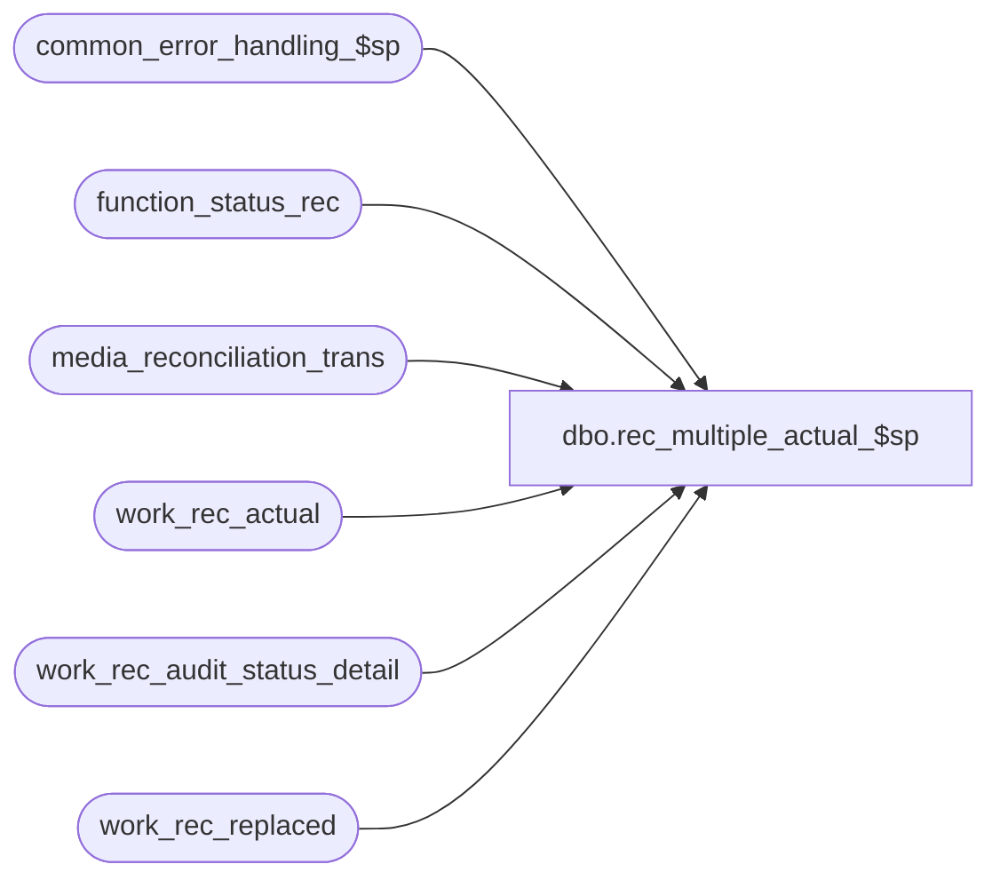

# dbo.rec_multiple_actual_$sp

**Database:** auditworks_external  
**Server:** bedrockdb01  

## Architecture Diagram



## Table Dependencies

| Referenced Table |
|---|
| common_error_handling_$sp |
| function_status_rec |
| media_reconciliation_trans |
| work_rec_actual |
| work_rec_audit_status_detail |
| work_rec_replaced |

## Stored Procedure Code

```sql
create proc dbo.rec_multiple_actual_$sp @process_id         binary(16),
@user_id            int,
@process_no         smallint,
@rec_process_id     numeric(12,0),
@errmsg             nvarchar(2000) OUTPUT,
@edit_process_no    tinyint = 1

AS

/* 
PROC NAME: media_rec_multiple_actual_$sp
     DESC: Perform any replacement/summing required by the multiple reconciliation actual 
           handling option selected. Called by reconciliation_$sp
   
code_type 83:	0 Log each reconciliation
		1 Log last reconciliation prior to each closeout
		2 Log sum of last reconciliation prior to each closeout for business date
		3 Log sum of all reconciliations for business date
		4 Log sum of all reconciliations covering a complete and single business date

HISTORY: 
Date      Name       Def#    Desc
Feb17,15  Vicci   TFS-106188 Log amt_action_object, exchange_action_object for use to avoid integrities in the even of an object-type action mismatch.
Nov27,14  Paul     TFS-94103 Use try .. catch to capture errors, removed index hints since edit streams can't use them
Dec02,13  Vicci       148123 For sum option (3) allow for cross-business-date addition of counts for same period reconciled date and
                             attribute it to the latest transaction date.
May09,13  Vicci       143800 Pull 143507 back out:  it is no longer needed now that reconciliation_$sp has been modified.
Apr29,13  Vicci       143507 Handle scenario where counts are set to be summed but more trade transactions intervene in between counts.
Apr09,13  Vicci       143181 Counts for a store/reg/date that are now being merged into the count for another store/reg/date or
                             replaced by the count of another store/reg/date may have already resulted in an over/short being
                             logged in audit_status an therefore such store/reg/dates must be placed on the list of those to be
                             re-evaluated.
Feb25,08  Vicci        98661 Uplift 98620 (Ensure cross-date counts are not merged even if they have same entry-date-datetime)
Oct25,06 Phu           77931 Fix index hint for SQL 2005 Mode 90.
May09,05 Paul        DV-1234 expand rec_id to use tran_id_datatype
Sep20,04 Maryam      DV-1146 Change user_name to user_id.
Apr27,04  Maryam     Dv-1071 Receive @process_id and @user_name and pass it to common_error_handling_$sp

Feb25,08  Vicci        98620 Ensure cross-date counts are not merged even if they have same entry-date-datetime
Dec29,03  Paul       DV-1007 added nolock hints
Jul17,03  Paul       11627   improved performance by adding hints
Jul10,03  Maryam     1-KL08H Author
*/

DECLARE
  @errmsg2			nvarchar(2000),
  @errline			int,
  @errno                        int,
  @message_id			int,
  @object_name			nvarchar(255),
  @operation_name			nvarchar(100),
  @process_name			nvarchar(100),
  @rows					int,
  @rows_updated	         	int;
  
  SELECT @process_name = 'rec_multiple_actual_$sp',
         @message_id   = 201068;

  BEGIN TRY
    SELECT @errmsg         = 'Failed to create table #work_rec_actual',
           @object_name    = '#work_rec_actual',
           @operation_name = 'CREATE';
  CREATE TABLE #work_rec_actual(
  balancing_entity_id numeric(10,0) not null,
  period_to_date_time datetime not null,
  transaction_date smalldatetime null,
  store_no int null,
  register_no smallint null,
  cashier_no int null,
  transaction_category tinyint null,
  amt_action tinyint null,
  qty_action tinyint null,
  exchange_action tinyint null,
  final_rec_date_time datetime null,
  final_rec_id numeric(14,0) null, -- tran_id_datatype
  rec_id numeric(14,0) null,
  amt_action_object numeric(8,0) null,
  exchange_action_object numeric(8,0) null); 
  
    SELECT @errmsg         = 'Failed to delete work_rec_replaced(1)',
           @object_name    = 'work_rec_replaced',
           @operation_name = 'DELETE';
  DELETE work_rec_replaced
WHERE rec_process_id = @rec_process_id;

    SELECT @errmsg         = 'Failed to delete work_rec_audit_status_detail(status 10)',
           @object_name    = 'work_rec_audit_status_detail',
           @operation_name = 'DELETE';
  DELETE work_rec_audit_status_detail
   WHERE rec_process_id = @rec_process_id
     AND source_rec_status = 10;

    SELECT @errmsg='Failed to back up original list of store/reg/date which may already have an over/short to revise into work_rec_audit_status_detail',
           @object_name = 'work_rec_audit_status_detail -status 10',
           @operation_name = 'INSERT';  
  INSERT work_rec_audit_status_detail(       
         rec_process_id,
         store_no,
         register_no,
         transaction_date,
         actual_flag,
         unrec_flag,
         source_rec_status)
  SELECT DISTINCT
         @rec_process_id,
         store_no,
         register_no,
         transaction_date,
         1,
         0,
         10
    FROM work_rec_actual WITH (NOLOCK)
   WHERE rec_process_id = @rec_process_id
     AND actual_flag = 1;

/* If the multiple actual handling method is based on when closeouts occurred, replace 
   counts where necessary for each actual determine when the next closeout occurred */
    SELECT @errmsg         = 'Failed to set next_closeout_date_time',
           @object_name    = 'work_rec_actual',
           @operation_name = 'UPDATE';
  UPDATE work_rec_actual
     SET next_closeout_date_time = (SELECT MIN(a.period_to_date_time)
                                      FROM work_rec_actual a WITH (NOLOCK)
                                     WHERE a.rec_process_id = wa.rec_process_id 
                                       AND a.balancing_entity_id = wa.balancing_entity_id
                                       AND a.transaction_date = wa.transaction_date
                                       AND a.actual_flag = 0 --closeout
                                       AND a.period_to_date_time >= wa.period_to_date_time)
   FROM work_rec_actual wa
  WHERE rec_process_id = @rec_process_id
    AND multiple_actual_handling_code IN (1, 2)
    AND actual_flag = 1; --actual

/* For each actual determine the last subsequent actual for the same date 
   (prior to closeout if relevant) if any */
    SELECT @errmsg         = 'Failed to set final_rec_date_time',
           @object_name    = 'work_rec_actual',
           @operation_name = 'UPDATE';
  UPDATE work_rec_actual
     SET final_rec_date_time = (SELECT MAX(a.period_to_date_time)
                                  FROM work_rec_actual a WITH (NOLOCK)
                                 WHERE a.rec_process_id = wa.rec_process_id
                                   AND a.balancing_entity_id = wa.balancing_entity_id
                                   AND a.actual_flag = 1
                                   AND COALESCE(a.date_reconciled, a.transaction_date) = COALESCE(wa.date_reconciled, wa.transaction_date)  --148123 Note, date_reconciled only set for multiple_actual_handling_code = 4
                                   AND (a.period_to_date_time <= wa.next_closeout_date_time
                                        OR wa.next_closeout_date_time IS NULL))
    FROM work_rec_actual wa
   WHERE rec_process_id = @rec_process_id
     AND multiple_actual_handling_code > 0
     AND actual_flag = 1 --actual
     AND rec_amount_subtype IN (4, 14, 24);

  --148123
    SELECT @errmsg         = 'Failed to set final transaction_date to max for final rec date time.',
           @object_name    = 'work_rec_actual',
           @operation_name = 'UPDATE';
  UPDATE work_rec_actual
     SET transaction_date = (SELECT MAX(a.transaction_date)
                               FROM work_rec_actual a WITH (NOLOCK)
                              WHERE a.rec_process_id = wa.rec_process_id 
                                AND a.balancing_entity_id = wa.balancing_entity_id
   AND a.actual_flag = 1
                           AND a.period_to_date_time = wa.final_rec_date_time)
    FROM work_rec_actual wa
  WHERE rec_process_id = @rec_process_id
     AND multiple_actual_handling_code = 4  --since the sum option allows a count from D1 and D2 to be added if they both have the same period-reconciled attachment
     AND rec_amount_subtype IN (4, 14, 24)
     AND actual_flag = 1 --actual
     AND final_rec_date_time IS NOT NULL;

    SELECT @errmsg         = 'Failed to set final_rec_id to max of rec_id.',
           @object_name    = 'work_rec_actual',
           @operation_name = 'UPDATE';
UPDATE work_rec_actual
   SET final_rec_id = (SELECT MAX(a.rec_id)
                         FROM work_rec_actual a WITH (NOLOCK)
                        WHERE a.rec_process_id = wa.rec_process_id 
                          AND a.balancing_entity_id = wa.balancing_entity_id
                          AND a.actual_flag = 1
                          AND a.period_to_date_time = wa.final_rec_date_time
                          AND a.transaction_date = wa.transaction_date)  --98620

  FROM work_rec_actual wa
 WHERE rec_process_id = @rec_process_id
   AND multiple_actual_handling_code > 0
   AND rec_amount_subtype IN (4, 14, 24)
   AND actual_flag = 1 --actual
   AND final_rec_date_time IS NOT NULL;

    SELECT @errmsg         = 'Failed to insert #work_rec_actual.',
           @object_name    = '#work_rec_actual',
           @operation_name = 'INSERT';
INSERT #work_rec_actual(
       balancing_entity_id,
       period_to_date_time,
       transaction_date,
       store_no,
       register_no,
       cashier_no,
       transaction_category,
       amt_action,
       qty_action,
       exchange_action,
       final_rec_date_time,
       final_rec_id,
       rec_id,
       amt_action_object,
       exchange_action_object)
SELECT balancing_entity_id,
       period_to_date_time,
       transaction_date,
       store_no,
       register_no,
       cashier_no,
       transaction_category,
       amt_action,
       qty_action,
       exchange_action,
       final_rec_date_time,
       final_rec_id,
       rec_id,
       amt_action_object,
       exchange_action_object
  FROM work_rec_actual WITH (NOLOCK)
 WHERE rec_process_id =  @rec_process_id
   AND actual_flag = 1;
SELECT @rows_updated = @@rowcount;

IF @rows_updated > 0
BEGIN    
        SELECT @errmsg         = 'Failed to set (amt/qty/exchange) action.',
               @object_name    = 'work_rec_actual',
               @operation_name = 'UPDATE';
      UPDATE work_rec_actual
         SET store_no = a.store_no,
             register_no = a.register_no,
             cashier_no = a.cashier_no,
             transaction_category = a.transaction_category,
             amt_action = a.amt_action, 
             qty_action = a.qty_action,
             exchange_action = a.exchange_action,
             amt_action_object = a.amt_action_object,
             exchange_action_object = a.exchange_action_object
        FROM #work_rec_actual a, work_rec_actual wa WITH (NOLOCK)
       WHERE wa.rec_process_id = @rec_process_id
         AND wa.multiple_actual_handling_code > 0
         AND wa.rec_amount_subtype IN (4, 14, 24)
         AND wa.final_rec_date_time IS NOT NULL  
         AND wa.balancing_entity_id = a.balancing_entity_id
         AND wa.final_rec_date_time = a.period_to_date_time
         AND wa.final_rec_id = a.rec_id;

         SELECT @errmsg         = 'Failed to truncate table #work_rec_actual',
                @object_name    = '#work_rec_actual',
                @operation_name = 'TRUNCATE';      
      TRUNCATE TABLE #work_rec_actual;
END; -- If @rows_updated > 0

/* If the multiple reconciliation actual handling method is based on when closeouts occurred
   and hence involves replacement logic, then log which (if any) actuals have been replaced
   Set the void flag of previously posted actuals to 'replaced' or 'not' if it has changed 
   and update their carryforward and/or transfer to another rec-type as well if applicable.*/

-- Build list of replaced/un-replaced transaction_id/line_id:
    SELECT @errmsg         = 'Failed to insert into work_rec_replaced',
           @object_name    = 'work_rec_replaced',
           @operation_name = 'INSERT';
  INSERT work_rec_replaced (
         rec_process_id,
         transaction_id,
         line_id,
         void_flag)
  SELECT @rec_process_id,
         mrt.transaction_id,
         mrt.line_id,
         1 + SIGN(ABS(wra.rec_id - ISNULL(wra.final_rec_id, wra.rec_id)))
    FROM work_rec_actual wra WITH (NOLOCK),
         media_reconciliation_trans mrt WITH (NOLOCK)
   WHERE wra.rec_process_id = @rec_process_id
     AND wra.multiple_actual_handling_code IN (1,2)
     AND wra.actual_flag = 1
     AND (wra.max_void_flag <>  (1 + SIGN(ABS(wra.rec_id - ISNULL(wra.final_rec_id, wra.rec_id))))
          OR wra.max_void_flag <> wra.min_void_flag)
     AND wra.balancing_entity_id  = mrt.balancing_entity_id
     AND wra.rec_id = mrt.transaction_id
     AND mrt.rec_side = 1;

  BEGIN TRANSACTION;
    SELECT @errmsg         = 'Failed to set void_flag',
           @object_name    = 'media_reconciliation_trans',
           @operation_name = 'UPDATE'; 
  UPDATE media_reconciliation_trans
     SET void_flag = wrr.void_flag
    FROM work_rec_replaced wrr WITH (NOLOCK),
         media_reconciliation_trans mrt
   WHERE wrr.rec_process_id = @rec_process_id
     AND mrt.transaction_id  = wrr.transaction_id
     AND mrt.line_id = wrr.line_id;

  -- Remove replaced entries and closeouts from list of reconciliations to be processed
    SELECT @errmsg         = 'Failed to delete work_rec_actual',
           @object_name    = 'work_rec_actual',
           @operation_name = 'DELETE';
  DELETE work_rec_actual
   WHERE rec_process_id = @rec_process_id
    AND multiple_actual_handling_code IN (1,2)
    AND ((actual_flag = 1 AND rec_id <> ISNULL(final_rec_id, rec_id))
         OR actual_flag = 0 );
  
/* If the multiple reconciliation actual handling method requires the summing of the last
   actual prior to each closeout for the day, then determine which if any require summing */
    SELECT @errmsg         = 'Failed to set final_rec_date_time for actual_handling_code = 2',
           @object_name    = 'work_rec_actual',
           @operation_name = 'UPDATE';
  UPDATE work_rec_actual
     SET final_rec_date_time = (SELECT MAX(a.period_to_date_time)
                                  FROM work_rec_actual a WITH (NOLOCK)
                                 WHERE a.rec_process_id = wa.rec_process_id
                                   AND a.transaction_date = wa.transaction_date
                                   AND a.balancing_entity_id = wa.balancing_entity_id)
   FROM work_rec_actual wa
  WHERE rec_process_id = @rec_process_id
    AND multiple_actual_handling_code = 2;
  SELECT @rows = @@rowcount;

  IF @rows > 0 
  BEGIN
        SELECT @errmsg         = 'Failed to insert #work_rec_actual',
               @object_name    = '#work_rec_actual',
               @operation_name = 'INSERT';
    INSERT #work_rec_actual(
           balancing_entity_id,
           period_to_date_time,
           transaction_date,
           store_no,
           register_no,
           cashier_no,
           transaction_category,
           amt_action,
           qty_action,
           exchange_action,
           final_rec_date_time,
           final_rec_id,
           rec_id,
           amt_action_object,
           exchange_action_object)
    SELECT balancing_entity_id,
           period_to_date_time,
           transaction_date,
           store_no,
           register_no,
           cashier_no,
           transaction_category,
           amt_action,
           qty_action,
           exchange_action,
           final_rec_date_time,
           final_rec_id,
           rec_id,
           amt_action_object,
           exchange_action_object
      FROM work_rec_actual WITH (NOLOCK)
     WHERE rec_process_id =  @rec_process_id;
 
        SELECT @errmsg         = 'Failed to set final_rec_id for actual_handling_code = 2',
               @object_name    = 'work_rec_actual',
               @operation_name = 'UPDATE';     
    UPDATE work_rec_actual
       SET final_rec_id = a.rec_id,
           store_no = a.store_no,
           register_no = a.register_no,
           cashier_no = a.cashier_no,
           transaction_category = a.transaction_category ,
           amt_action = a.amt_action, 
           qty_action = a.qty_action,
           exchange_action = a.exchange_action                             
      FROM #work_rec_actual a, work_rec_actual wa 
     WHERE wa.rec_process_id = @rec_process_id
       AND wa.multiple_actual_handling_code = 2    
       AND wa.final_rec_date_time IS NOT NULL
       AND wa.balancing_entity_id = a.balancing_entity_id
       AND a.period_to_date_time = wa.final_rec_date_time
       AND a.transaction_date = wa.transaction_date;
  END; --If @rows  > 0

/*
--143507
UPDATE work_rec_actual
    SET lower_date_time = (SELECT MIN(mrd.period_from_date_time)
                             FROM media_reconciliation_detail mrd WITH (NOLOCK)
							WHERE work_rec_actual.balancing_entity_id = mrd.balancing_entity_id
							  AND work_rec_actual.transaction_date = mrd.transaction_date
							  AND work_rec_actual.transaction_date = mrd.rec_date
							  AND work_rec_actual.period_to_date_time = mrd.period_to_date_time
							  AND mrd.period_from_date_time < work_rec_actual.lower_date_time
							  AND mrd.rec_side = 1
							  AND mrd.rec_amount_type in (1, 2)  --amount, qty
							  AND mrd.rec_amount_subtype in (4, 24))  --actual, actual with fund transfer
   WHERE work_rec_actual.rec_process_id = @rec_process_id
     AND work_rec_actual.actual_flag = 1 --actual
     AND work_rec_actual.multiple_actual_handling_code in (2, 3)  --  summed
     AND work_rec_actual.rec_id <> work_rec_actual.final_rec_id  --this is a row that is being swallowed up by another rec
     AND work_rec_actual.final_rec_date_time IS NOT NULL
     AND EXISTS (SELECT 1
                   FROM media_reconciliation_detail mrd WITH (NOLOCK)
				  WHERE work_rec_actual.balancing_entity_id = mrd.balancing_entity_id
					AND work_rec_actual.transaction_date = mrd.transaction_date
					AND work_rec_actual.transaction_date = mrd.rec_date
					AND work_rec_actual.period_to_date_time = mrd.period_to_date_time
					AND mrd.period_from_date_time < work_rec_actual.lower_date_time
					AND mrd.rec_side = 1
					AND mrd.rec_amount_type in (1, 2)  --amount, qty
					AND mrd.rec_amount_subtype in (4, 24)) --actual, actual with fund transfer
 SELECT @rows = @@rowcount

IF @rows > 0
BEGIN

  UPDATE work_rec_entity
      SET lower_date_time = (SELECT MIN(wra.lower_date_time)
                               FROM work_rec_actual wra WITH (NOLOCK)
	 					  	  WHERE wra.rec_process_id = @rec_process_id
							    AND wra.balancing_entity_id = work_rec_entity.balancing_entity_id
							    AND wra.lower_date_time < work_rec_entity.lower_date_time
							    AND wra.actual_flag = 1 --actual
							    AND wra.multiple_actual_handling_code in (2, 3)  --  summed
							    AND wra.rec_id <> wra.final_rec_id  --this is a row that is being swallowed up by another rec
							    AND wra.final_rec_date_time IS NOT NULL)  --actual, actual with fund transfer
     WHERE work_rec_entity.rec_process_id = @rec_process_id
       AND work_rec_entity.actual_present_flag = 1 --actual
       AND work_rec_entity.multiple_actual_handling_code in (2, 3)  --  summed
       AND work_rec_entity.last_reconciliation_date_time IS NOT NULL  --prior rec existed
       AND EXISTS (SELECT 1
                     FROM work_rec_actual wra WITH (NOLOCK)
		  	  	    WHERE wra.rec_process_id = @rec_process_id
				  	  AND work_rec_entity.balancing_entity_id = wra.balancing_entity_id
					  AND wra.lower_date_time < work_rec_entity.lower_date_time
					  AND wra.actual_flag = 1 --actual
					  AND wra.multiple_actual_handling_code in (2, 3)  --  summed
					  AND wra.rec_id <> wra.final_rec_id  --this is a row that is being swallowed up by another rec
					  AND wra.final_rec_date_time IS NOT NULL) --actual, actual with fund transfer
 END
*/
 
/* If the multiple reconciliation actual handling method requires summing then merge related actuals */
    SELECT @errmsg         = 'Failed to insert into work_rec_actual',
           @object_name    = 'work_rec_actual',
           @operation_name = 'INSERT';
  INSERT work_rec_actual(
         rec_process_id,
         balancing_entity_id,
         period_to_date_time,
         rec_id,
         transaction_date,
         store_no,
         register_no,
         cashier_no,
         transaction_category,
         rec_group_line_object,
         amt_action,
         qty_action,
         exchange_action,
         actual_flag,
         rec_amount_subtype,
         rec_amount,
         rec_quantity,
         rec_exchange,
         rec_exchange_calc, 
         max_void_flag,
         min_void_flag,
         audit_activity_flag,
         lower_date_time,
         multiple_actual_handling_code, 
         next_closeout_date_time,
         final_rec_date_time,
         final_rec_id,
         final_flag,
         convert_to_domestic,
         foreign_currency_id,
         rec_type,
         track_qty,
         short_tolerance_amount,
         short_tolerance_qty,
         short_tolerance_percent,
         date_reconciled)
  SELECT @rec_process_id,
         balancing_entity_id,
         ISNULL(final_rec_date_time, period_to_date_time),
         ISNULL(final_rec_id, rec_id),
         transaction_date,
         store_no,
         register_no,
         cashier_no,
         transaction_category,
         rec_group_line_object,
         amt_action,
         qty_action,
         exchange_action,
         1,
         MIN(rec_amount_subtype),
         SUM(rec_amount),
         SUM(rec_quantity),
         SUM(rec_exchange),
         SUM(rec_exchange_calc),
         1,
         1,
         MAX(audit_activity_flag),
         MIN(lower_date_time),
         MAX(multiple_actual_handling_code), 
         NULL,
         NULL,
         NULL,
         1,
         convert_to_domestic,
         foreign_currency_id,
         rec_type,
         track_qty,
         short_tolerance_amount,
         short_tolerance_qty,
         short_tolerance_percent,
         date_reconciled
    FROM work_rec_actual WITH (NOLOCK)
   WHERE rec_process_id = @rec_process_id
     AND multiple_actual_handling_code >= 2
     AND final_flag = 0
   GROUP BY 
         balancing_entity_id,
         ISNULL(final_rec_date_time, period_to_date_time),
         ISNULL(final_rec_id, rec_id),
         transaction_date,					
         store_no,
         register_no,
         cashier_no,
         transaction_category,
         rec_group_line_object,
         amt_action,
         qty_action,
         exchange_action,
         convert_to_domestic,
         foreign_currency_id,
         rec_type,
         track_qty,
         short_tolerance_amount,
         short_tolerance_qty,
         short_tolerance_percent,
         date_reconciled;
    
    SELECT @errmsg         = 'Failed to delete work_rec_actual(multiple_actual_handling_code >= 2)',
           @object_name    = 'work_rec_actual',
           @operation_name = 'DELETE';        
  DELETE work_rec_actual
   WHERE rec_process_id = @rec_process_id
     AND multiple_actual_handling_code >= 2
     AND final_flag = 0;

    SELECT @errmsg         = 'Failed to clean up work_rec_replaced',
           @object_name    = 'work_rec_replaced',
           @operation_name = 'DELETE';
  DELETE work_rec_replaced
   WHERE rec_process_id = @rec_process_id;
  
     SELECT @errmsg         = 'Failed to SET rec_status to 15.',
           @object_name    = 'function_status_rec',
           @operation_name = 'UPDATE';
  UPDATE function_status_rec
    SET rec_status = 15 
   WHERE rec_process_id = @rec_process_id;
  
  COMMIT;

      SELECT @errmsg='Failed to drop #work_rec_actual table.',
             @object_name = '#work_rec_actual',
             @operation_name = 'DROP'; 
  DROP TABLE #work_rec_actual;

  --Note these rows will be put back again by reconciliation_$sp (done this way to avoid overhead in more normal flow where each reconciliation is logged)
    SELECT @errmsg         = 'Failed to only keep the work_rec_audit_status_detail for replaced/summed-into-other store/reg/date',
           @object_name    = 'work_rec_audit_status_detail',
           @operation_name = 'DELETE';
  DELETE work_rec_audit_status_detail
   WHERE rec_process_id = @rec_process_id
     AND source_rec_status = 10
     AND EXISTS (SELECT 1
                   FROM work_rec_actual wra WITH (NOLOCK)
                  WHERE wra.rec_process_id = @rec_process_id
                    AND wra.actual_flag = 1
                    AND work_rec_audit_status_detail.store_no = wra.store_no
                    AND work_rec_audit_status_detail.register_no = wra.register_no
                    AND work_rec_audit_status_detail.transaction_date = wra.transaction_date);

RETURN;


business_error:   /* Business Rule handler. */

	SELECT @errmsg2 = @errmsg;

	/* Could include similar cleanup code to system error trap when needed (example is from move_store_$sp).
	   However, could also exclude the cleanup code here since the outer system error catch should fire again after the exec below. */

         EXEC common_error_handling_$sp @process_no, @errno, @errmsg, 0, @message_id, 
	@process_name, @object_name, @operation_name, 0, @edit_process_no, 0, null, 0, null, null,
	null, null, null, null, 0, @process_id, @user_id;
	  /* Note: when the exec above raises an error, that action also fires the system error trap (below) */
	RETURN;
END TRY

BEGIN CATCH; -- trap system errors
    /* common error handling. Appending proc name here because a rollback could occur if called within a transaction. */

        SELECT @errno = ERROR_NUMBER(),
		@errline = ERROR_LINE();

        SELECT @errmsg = CONVERT(nvarchar, @errno) + ':' + @process_name + ':' + CONVERT(nvarchar, @errline) + ':'
               + COALESCE(@errmsg, ' ') + ':' + ERROR_MESSAGE();

	 /* this condition will only be true when raise error in traps above fire this general catch */
	IF @errmsg2 IS NOT NULL
	  SELECT @errmsg = @errmsg2;

         EXEC common_error_handling_$sp @process_no, @errno, @errmsg, 0, @message_id, 
	@process_name, @object_name, @operation_name, 0, @edit_process_no, 0, null, 0, null, null,
	null, null, null, null, 0, @process_id, @user_id;

	RETURN;
END CATCH;
```

