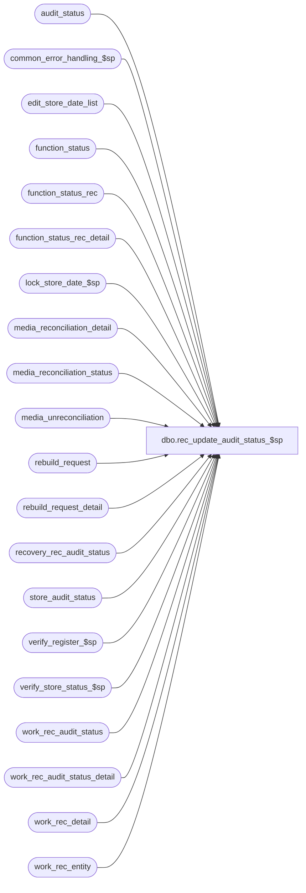

# dbo.rec_update_audit_status_$sp

**Database:** auditworks_external  
**Server:** bedrockdb01  

## Architecture Diagram



## Table Dependencies

| Referenced Table |
|---|
| audit_status |
| common_error_handling_$sp |
| edit_store_date_list |
| function_status |
| function_status_rec |
| function_status_rec_detail |
| lock_store_date_$sp |
| media_reconciliation_detail |
| media_reconciliation_status |
| media_unreconciliation |
| rebuild_request |
| rebuild_request_detail |
| recovery_rec_audit_status |
| store_audit_status |
| verify_register_$sp |
| verify_store_status_$sp |
| work_rec_audit_status |
| work_rec_audit_status_detail |
| work_rec_detail |
| work_rec_entity |

## Stored Procedure Code

```sql
create proc dbo.rec_update_audit_status_$sp @process_id		    binary(16),       --current spid or spid being recovered
@user_id                    int,
@process_no                 smallint,
@rec_process_id             numeric(12,0),
@rec_status		    tinyint,
@errmsg                     nvarchar(2000) OUTPUT,
@edit_process_no            tinyint = 1,
@recover_flag               tinyint = 0

AS
/* 
PROC NAME: rec_update_audit_status_$sp
     DESC: Called by reconciliation_$sp to update media_short, short_by_tender_over_limit and
           unreconciled_media_present in audit status.

 HISTORY: 
Date      Name          Def# Desc
Nov26,14 Paul      TFS-94103 Use try .. catch to capture errors, removed index hints since edit streams can't use them
Nov12,14 Vicci     TFS-92326 Take into account the fact that the value of the output parameter of a proc called with a TRY/CATCH is not returned 
                             to the calling proc when a raise-error occurs, when calling lock_store_date_$sp.
                             Initialize @locked_by_edit INSIDE loop, not outside.
Jan29,14 Vicci        149617 Add try/catch around lock store date execution in order to trap and skip store/date instead of crashing.
Jan06,12  Vicci     1-47GP4M Wrap a precautionary begin/commit around rebuild request header/detail insert to avoid the header being cleaned
                             up because it doesn't yet have details.
Jul11,11  Vicci       128303 Recognize that process 103 (Transaction Modify -Edit Post Void) forms part of the Edit.
Apr20,11  Vicci       126391 Fix updating of media_rec_only_lock to 2 (i.e. can't be locked):  currently nothing will get updated
                             since the work_rec_audit_status rec_process_id won't match that in recovery_rec_audit_status yet
                             it was included in the join.
Apr05,10  Vicci       116035 When creating a new rec_process_id to support recovering a store/date that could not be
                             locked, if the function which is now failing is a recovery attempt, use a new process ID 
                             to ensure that a function_status entry for the new rec_process_id actually gets created, 
                             otherwise the dup key on insert gets trapped and an orphaned rec_process_id results.
Apr05,10  Vicci       115860 Don't assume that if a store/date is locked by Edit then all registers used on that str/date 
			     will exist in batch.  Instead verify this is the case in edit_store_date_list so that registers
			     that are not in the batch but whose stats are side-effected by the reg in batch get verified.
Apr05,10  Vicci       115666 Fix 1-353ZQD.  Status should only be bumped back up to accept if no new unreconciled media has been introduced.
Mar31,10  Vicci       115490 Re-code @rec_status = 55 section:  @rows set incorrectly, scaleout logic needs to be 
			     removed because rebuild_request was previously changed to no longer be view.
Dec09,09  Vicci       114698 Remove process_id references from recovery_rec_audit_status handling since rec_process_id should be sufficient;
                             Ensure new rec_process_id is used for recovery purpose since status for recovery must remain 40
                             and if any other balancing entities for the current rec_process_id couldn't be locked then
                             then the reconciliation proc will be resetting the status of the current rec_process_id to 1.
Sep23,08  Paul        104990 Corrected comments, code reviewed
May12,08  Paul        101133 apply 1-3XYMJH to SA5
Apr04.07  Daphna     DV-1360 apply 84066 to SA5
Nov13,06  Paul       DV-1335 apply 79236 to SA5
Oct25,06  Phu          77931 Fix outer join for SQL 2005 Mode 90.
Oct06,06  Tim        DV-1345 apply defect 76341 to SA5
Aug06,06  Tim        DV-1342 apply defect 73555 to SA5
Dec06,05  Paul         64383 apply 64381 to SA5
Oct25,05  Paul         61345 remove nolock on rebuild_request
Oct17,05  Paul         61842 added NOLOCK hints, verify_register_$sp now resets audit_status to 100 if necessary
Apr29,05  Sab	     DV-1234 Added logic for scaleout when inserting into rebuild_request
Mar04,05  Paul       DV-1216 apply 47977 and 47776 to SA5
Sep20,04  Maryam     DV-1146 Change user name to user_id.
Apr27,04  Maryam     DV-1071 Receive @process_id and pass it to the sub procs.
                             (Paul) Modified the where clause for status_crsr.
May12,08  Paul      1-3XYMJH Leave over/short marked as verified for the special case when unrec_flag = 1 AND actual_flag = 0 
Nov09,07  Paul      1-3T1BWL apply 61842 to SA4.1: verify_register_$sp now resets audit_status to 100 if necessary
Mar19.07  Daphna 84066 avoid duplicate rows in work_rec_audit_status 
Oct30.06  Daphna       79236 do not reset user_name before insert to rebuild_request
                             update work.media_rec_only_lock from audit_status with date_reject_id = 0
Aug22,06  Vicci        76341 Leave over/short marked as verified if all remaining over/shorts
                             in media rec detail are verified
Jun14,06  Vicci        73555 Don't raise front-end error nor create halted process when can't
                             update a store/date locked by the edit, just put it on list of what
                             Edit phase 2 needs to recover.
Sep30,05  Shapoor   1-353ZQD Ensure that the audit_status is set back to 300 for store/reg/date that were previously 
                     / 64381 Accepted, but had to be re-evaluated.
Feb07,05  Maryam       47776 Set the prior_media_short and prior_audit_status from audit_status instead of store_audit_status. 
Jan31,05  Daphna       47977 Allow media rec to continue if some store/dates are locked and recovery logic
Mar10,04  Maryam       25346 Add s.date_reject_id = 0 to the where clause when updating audit_status for side-effected 
                             store/register/dates call verify_register_$sp when trickle_in_progress_flag = 0
Dec29,03  Paul       DV-1007 remove most begin tran to reduce deadlocking
Oct29,03  Maryam     DV-1010 include rec_amount_subtype of 25 when inserting into work_rec_audit_status_detail. 
                             AS the errno of 201550 was not logged to process_error_log use error_no of 201080
Jul17,03  Paul         11627 Improved performance by adding hints
Jul10,03  Maryam     1-KL08H Author
*/


DECLARE
  @cursor_open 			tinyint,
  @edit_store_no		int,
  @edit_transaction_date	smalldatetime,
  @error_code		        int,
  @errline			int,
  @errmsg2			nvarchar(2000),
  @errno                        int,
  @function_no			tinyint,
  @locked_by_edit               tinyint,
  @max_date			smalldatetime,
  @max_request_id		numeric(12,0),
  @max_store_no			int,
  @memo1			nvarchar(50),
  @memo_date			smalldatetime,
  @message_id			int,
  @min_date			smalldatetime,
  @min_store_no			int,
  @new_audit_status		smallint,
  @new_unrec_media_present	tinyint,
  @object_name			nvarchar(255),
  @operation_name		nvarchar(100),
  @prior_audit_status		smallint,
  @prior_unrec_media_present	tinyint,
  @process_name			nvarchar(100),
  @rec_process_id_edit_recover	numeric(12,0),
  @rec_process_id_func_recover	numeric(12,0),
  @process_id_recover		binary(16),
  @request_datetime		datetime,
  @request_id			numeric(12,0),
  @register_no 		        smallint,
  @rows				int,
  @rows1			int,
  @scaleout_flag		int,
  @store_audit_status           smallint,
  @store_no			int,
  @transaction_date		smalldatetime,
  @unlocked                     tinyint,
  @verify_store_status		tinyint;

SELECT @process_name = 'rec_update_audit_status_$sp',
       @message_id   = 201068,
       @cursor_open = 0,
       @errline = 0,
       @errno = 0,
       @function_no = 70,  -- for recovery
       @verify_store_status = 1;

BEGIN TRY;

IF @process_no IN (1,2,4,5,103) --Edit
  SELECT @verify_store_status = 0;

/* NOTE: error recovery cleanup logic for the work tables is in reconciliation_$sp */

-- The table work_rec_audit_status_detail may contain rows that were previously populated by reconciliation_$sp
-- for affected store/reg/date

IF @rec_status = 35
BEGIN  
  -- Build list of store/reg/dates for which unreconciled amounts have been created
    SELECT @errmsg         = 'Failed to insert into work_rec_audit_status_detail for unrec.',
           @object_name    = 'work_rec_audit_status_detail',
           @operation_name = 'INSERT';
  INSERT work_rec_audit_status_detail(
         rec_process_id,
         store_no,
         register_no,
         transaction_date,
         actual_flag,
         unrec_flag,
         source_rec_status)
  SELECT DISTINCT 
         @rec_process_id,  
         store_no,
         register_no,
         transaction_date,
         0,
         1,
         @rec_status
    FROM work_rec_detail wrd WITH (NOLOCK)
   WHERE rec_process_id = @rec_process_id
     AND rec_amount_type IN (1, 3, 5)
     AND rec_side = 0
     AND rec_date IS NULL;

  --Build list of store/reg/dates for which audit_status is to be re-evaluated:
    SELECT @errmsg='Failed to insert into work_rec_audit_status.',
             @object_name = 'work_rec_audit_status',
             @operation_name = 'INSERT';
  INSERT work_rec_audit_status(
         rec_process_id,
         store_no,
         register_no,
         transaction_date,
         media_rec_only_lock,
         actual_flag,
         unrec_flag,
         media_short,
         short_by_tender_over_limit,
         unreconciled_media_present)
  SELECT @rec_process_id,
         store_no,
         register_no,
         transaction_date,
         0,
         MAX(actual_flag),
         MAX(unrec_flag),
         NULL,
         NULL,
         NULL
    FROM work_rec_audit_status_detail WITH (NOLOCK)
   WHERE rec_process_id = @rec_process_id
   GROUP BY store_no, register_no, transaction_date
  HAVING (MAX(actual_flag) <> 0 OR MAX(unrec_flag) <> 0);


  IF @process_no IN (1,2,4,5,103) -- Edit
  BEGIN  
      SELECT @errmsg='Failed to indicate that register was side-effected by Edit (not in its current batch)',
             @object_name = 'work_rec_audit_status',
             @operation_name = 'UPDATE';
    UPDATE work_rec_audit_status
       SET media_rec_only_lock = 3
     WHERE work_rec_audit_status.rec_process_id = @rec_process_id
       AND NOT EXISTS (SELECT 1
       			 FROM edit_store_date_list esdl
       			WHERE work_rec_audit_status.store_no = esdl.store_no
       			  AND work_rec_audit_status.register_no = esdl.register_no
       			  AND work_rec_audit_status.transaction_date = esdl.transaction_date
       			  AND esdl.date_reject_id = 0);
  END;
  ELSE --ELSE of IF @process_no IN (1,2,4,5,103)
  BEGIN
      SELECT @errmsg='Failed to indicate that register was side-effected by manual function (not in its current batch)',
             @object_name = 'work_rec_audit_status',
             @operation_name = 'UPDATE';
    UPDATE work_rec_audit_status 
       SET media_rec_only_lock = 3  --3=store/date already naturally locked by current process but side-effected register not in batch
     WHERE work_rec_audit_status.rec_process_id = @rec_process_id
       AND NOT EXISTS (SELECT 1
        		 FROM function_status_rec_detail fsrd
        		WHERE fsrd.rec_process_id = @rec_process_id
        		  AND work_rec_audit_status.store_no = fsrd.store_no
        		  AND work_rec_audit_status.register_no = fsrd.register_no
        		  AND work_rec_audit_status.transaction_date = fsrd.transaction_date);
  END;  --ELSE of IF i_process_no IN (1,2,4,5,103)
  
  SELECT @rec_status = 40,
          @errmsg='Failed to set rec_status to 40.',
	 @object_name = 'function_status_rec',
	 @operation_name = 'UPDATE';
  UPDATE function_status_rec
    SET rec_status = @rec_status
   WHERE rec_process_id = @rec_process_id;

END; --@rec_status = 35

IF @rec_status = 40
BEGIN
     SELECT @errmsg='Failed to delete table work_rec_audit_status_detail.',
             @object_name = 'work_rec_audit_status_detail',
             @operation_name = 'DELETE';
  DELETE work_rec_audit_status_detail
   WHERE rec_process_id = @rec_process_id;

  IF @recover_flag = 1 
  BEGIN
     -- avoid inserting duplicate rows
       SELECT @errmsg=' WHERE SRD found in work_rec_audit_status',
             @object_name = 'recovery_rec_audit_status',
             @operation_name = 'DELETE';    
    DELETE recovery_rec_audit_status
    FROM recovery_rec_audit_status r, work_rec_audit_status w
    WHERE r.rec_process_id = @rec_process_id
      AND r.rec_process_id = w.rec_process_id 
      AND r.store_no = w.store_no
      AND r.register_no = w.register_no
      AND r.transaction_date = w.transaction_date;

      SELECT @errmsg=' FROM recovery_rec_audit_status',
             @object_name = 'work_rec_audit_status',
             @operation_name = 'INSERT';
    INSERT work_rec_audit_status
           (rec_process_id, store_no, register_no, transaction_date,
           actual_flag, unrec_flag, media_short, short_by_tender_over_limit,
           unreconciled_media_present, media_rec_only_lock, prior_audit_status,
           prior_media_short, prior_unrec_media_present)
    SELECT rec_process_id, store_no, register_no, transaction_date,
           actual_flag, unrec_flag, media_short, short_by_tender_over_limit,
           unreconciled_media_present, media_rec_only_lock, prior_audit_status,
           prior_media_short, prior_unrec_media_present        
      FROM recovery_rec_audit_status WITH (NOLOCK)
     WHERE rec_process_id = @rec_process_id;

      SELECT @errmsg=' for rec_process_id, process_id',
             @object_name = 'recovery_rec_audit_status',
             @operation_name = 'DELETE';   
    DELETE recovery_rec_audit_status
     WHERE rec_process_id = @rec_process_id;
    
  END; --@recover_flag = 1

  /* Declare a cursor on the distinct store_no/transaction_date from store_audit_status
  Which are not already locked and lock them using an update_in_progress flag = @process_no */

      SELECT @errmsg = 'Unable to declare cursor status_crsr',
             @object_name = 'status_crsr',
             @operation_name = 'OPEN';
  DECLARE status_crsr CURSOR FAST_FORWARD
  FOR 
  SELECT DISTINCT sas.store_no,
         wras.transaction_date
    FROM work_rec_audit_status wras WITH (NOLOCK),
         store_audit_status sas -- need read lock
   WHERE wras.rec_process_id = @rec_process_id
     AND wras.store_no = sas.store_no
     AND wras.transaction_date = sas.sales_date
     AND sas.date_reject_id = 0
     AND ((@process_no IN (4,103) AND sas.update_in_progress NOT IN (1,4,103)) -- not already locked by edit
          OR (@process_no NOT IN (4,103) AND (sas.update_in_progress = 0 OR (sas.update_in_progress > 0
              AND (sas.update_in_progress != @process_no OR sas.process_id != @process_id))))); -- locked by another user

  OPEN status_crsr;
  SELECT @cursor_open = 1,
       @unlocked = 0;
  
  WHILE 1 = 1
  BEGIN
    SELECT @locked_by_edit = 0;

    FETCH status_crsr
     INTO @store_no,
          @transaction_date;

    IF @@fetch_status <> 0
      BREAK;

    IF EXISTS (SELECT 1
		 FROM store_audit_status 
                WHERE store_no = @store_no 
                  AND sales_date = @transaction_date
                  AND date_reject_id = 0
                  AND update_in_progress IN (1,4,103))
      SELECT @locked_by_edit = 1, @error_code = 201550;

    -- As there is a begin tran before calling this proc and lock_store_date_$sp calls common_error_handling_$sp
    -- to raise the business rule error and it rolls back the transaction by the time that control gets back to lock_store_date
    -- the real error has replaced by 266, so we use the error code instead of error no to check for errors.
    -- error_code has set to error_no in lock_store_date before going to error
    IF @locked_by_edit = 0
    BEGIN
      SELECT @error_code = NULL,
             @errno = 0,
             @errline = 0;
      BEGIN TRY 
        EXEC lock_store_date_$sp @process_id, @user_id, @store_no, @transaction_date, 0, @process_no, @error_code OUTPUT;
      END TRY
      BEGIN CATCH
        SELECT @errno = ERROR_NUMBER(),
               @errline = ERROR_LINE();
        IF @error_code IS NULL OR @error_code = 0
          SELECT @error_code = @errno;
      END CATCH;
    END;

    IF @error_code = 0 -- the store/date was succesfully locked
    BEGIN
          SELECT @errmsg='Failed to set media_rec_only_lock.',
                 @object_name = 'work_rec_audit_status',
                 @operation_name = 'UPDATE';
      UPDATE work_rec_audit_status
         SET media_rec_only_lock = 1,  --1=side-effected-store_date.temp-locked, 3=side-effected-reg.store-date-naturally-locked
             prior_audit_status = a.audit_status,
             prior_media_short = a.media_short,
             prior_unrec_media_present = a.unreconciled_media_present
        FROM work_rec_audit_status w, audit_status a WITH (NOLOCK)
       WHERE rec_process_id = @rec_process_id
         AND w.store_no = @store_no 
         AND transaction_date = @transaction_date
         AND w.store_no = a.store_no
         AND w.register_no = a.register_no
         AND w.transaction_date = a.sales_date
         AND a.date_reject_id = 0;
  
    END;   --IF @error_code = 0 
    ELSE
    BEGIN
      IF @error_code = 201550 -- There has been a business rule error
                              -- As this is a F/E message and it will not be logged to process_error_log
                              -- then raise a similar message with a category other than -1 (F/E message)
      BEGIN
        /* to prevent 2 processes on same entity for different date from locking each other out */
          SELECT @errmsg=' unlock same entity diff date',
                 @object_name = 'media_rec_status',
                 @operation_name = 'UPDATE';
        UPDATE media_reconciliation_status 
           SET locked_by_spid = NULL, 
               last_activity_date_time = wre.new_last_activity_date_time,
               last_reconciliation_date_time = wre.new_last_rec_date_time,
               last_lock_datetime = getdate()
          FROM work_rec_entity wre WITH (NOLOCK),
               media_reconciliation_status ms
         WHERE wre.rec_process_id = @rec_process_id
         AND wre.balancing_entity_id = ms.balancing_entity_id;

        IF @function_no = @process_no  --i.e. if this is a failure of a recovery attempt (70)
          SELECT @process_id_recover = NEWID();
	ELSE
	  SELECT @process_id_recover = @process_id;
  
        IF @rec_process_id_edit_recover IS NULL AND @locked_by_edit = 1
        BEGIN 
            SELECT @errmsg = 'Failed to insert function_status_rec for edit to recover.',
   	           @object_name = 'function_status_rec',
	          @operation_name = 'INSERT';
          INSERT INTO function_status_rec(
                 process_id,
                 function_no,
                 rec_status,
                 edit_process_no)
	  VALUES (@process_id_recover, 
	  	 @function_no,
	  	 @rec_status,
	  	 @edit_process_no);
          SELECT @rec_process_id_edit_recover = @@identity;
        END; --IF @rec_process_id_edit_recover IS NULL AND @locked_by_edit = 1

        IF @rec_process_id_func_recover IS NULL AND @locked_by_edit = 0
        BEGIN 
            SELECT @errmsg = 'Failed to insert function_status_rec for edit to recover.',
   	           @object_name = 'function_status_rec',
	           @operation_name = 'INSERT';
          INSERT INTO function_status_rec(
                 process_id,
   function_no,
                 rec_status,
                 edit_process_no)
	  VALUES (@process_id_recover, 
	  	 @function_no,
	 	 @rec_status,
	  	 NULL);
          SELECT @rec_process_id_func_recover = @@identity;

            SELECT @errmsg = ' First store/date is not lockable',
     	           @object_name = ' function_status',
	           @operation_name = 'INSERT',
	           @errno = 0;
          BEGIN TRY
          INSERT function_status (
 	         user_id,
 	         process_id,
	         function_no,
	         status,
	         entry_date,
	         transaction_id,
	         store_no,
	         register_no,
	         transaction_date,
	         date_reject_id,
	         from_transaction_no,
	         rec_process_id,
	         released_to_cleanup)
          VALUES (@user_id,
 	         @process_id_recover,
	         @function_no,   -- for recovery
	         @rec_status,
	         getdate(),
	         0,
	         @store_no,
	         0,
	         @transaction_date,
	         0,
	         0,
	         @rec_process_id_func_recover,
	         1);
          END TRY
          BEGIN CATCH;
            SELECT @errno = ERROR_NUMBER(),
		@errmsg = CONVERT(nvarchar, ERROR_NUMBER()) + ':' + @process_name + ':' + CONVERT(nvarchar, ERROR_LINE()) + ':'
               + COALESCE(@errmsg, ' ') + ':' + ERROR_MESSAGE();
          END CATCH;

          IF @errno NOT IN (0, 2601)  -- ignore duplicate key error
            GOTO business_error;

        END; --IF @rec_process_id_func_recover IS NULL AND @locked_by_edit = 0

          SELECT @errmsg=' store/date not lockable',
                 @object_name = 'recovery_rec_audit_status',
                 @operation_name = 'INSERT';              
        INSERT recovery_rec_audit_status
               (rec_process_id, store_no, register_no, transaction_date,
               actual_flag, unrec_flag, media_short, short_by_tender_over_limit,
               unreconciled_media_present, media_rec_only_lock, prior_audit_status,
               prior_media_short, process_id, posting_date_time, locked_by_edit, prior_unrec_media_present)
	SELECT CASE WHEN @locked_by_edit = 0 THEN @rec_process_id_func_recover ELSE @rec_process_id_edit_recover END, 
               store_no, register_no, transaction_date,
               actual_flag, unrec_flag, media_short, short_by_tender_over_limit,
               unreconciled_media_present, media_rec_only_lock, prior_audit_status,
               prior_media_short, @process_id_recover, getdate(), @locked_by_edit, prior_unrec_media_present
          FROM work_rec_audit_status WITH (NOLOCK)
         WHERE rec_process_id = @rec_process_id
           AND store_no = @store_no 
           AND transaction_date = @transaction_date;

        SELECT @unlocked = 1;
     
      END;   -- error 201550
    ELSE -- There has been a hard error
      BEGIN
        SELECT @errmsg  = CONVERT(nvarchar, @errno) + ':' + @process_name + ':' + CONVERT(nvarchar, @errline) + ':'
            + 'Failed to execute stored procedure lock_store_date_$sp.',
               @object_name = 'lock_store_date_$sp',
               @operation_name = 'EXEC';
        GOTO business_error;
      END;

    END;  -- @errno <> 0 
  END; -- WHILE 1=1           

  IF @unlocked = 1  
  BEGIN  
      SELECT @errmsg=' store/date not lockable',
         @object_name = 'work_rec_audit_status',
         @operation_name = 'UPDATE';
    UPDATE work_rec_audit_status
       SET media_rec_only_lock = 2  --2=store/date can't be locked since already locked by another process
      FROM recovery_rec_audit_status r WITH (NOLOCK), work_rec_audit_status w
     WHERE (r.rec_process_id = @rec_process_id_func_recover OR r.rec_process_id = @rec_process_id_edit_recover)
       AND r.process_id = @process_id
       AND @rec_process_id = w.rec_process_id  --126391
       AND r.store_no = w.store_no
       AND r.register_no = w.register_no
 AND r.transaction_date = w.transaction_date
       AND w.media_rec_only_lock IN (0, 3); --126391       
  END;
  
  SELECT @rec_status = 45,
         @errmsg='Failed to set rec_status to 40.',
         @object_name = 'function_status_rec',
         @operation_name = 'UPDATE';
  UPDATE function_status_rec
     SET rec_status = @rec_status
   WHERE rec_process_id = @rec_process_id;

  CLOSE status_crsr;
  DEALLOCATE status_crsr;
  SELECT @cursor_open = 0;

END; --@rec_status = 40  

IF @rec_status = 45
BEGIN
/* Update over/short amount in list of store/reg/dates for which audit_status is to be re-evaluated */
      SELECT @errmsg='Failed to insert into work_rec_audit_status_detail from media_reconciliation_detail.',
             @object_name = 'work_rec_audit_status_detail',
             @operation_name = 'INSERT';
  INSERT work_rec_audit_status_detail(
         rec_process_id,
         transaction_date,
         store_no,
         register_no,
         actual_flag,
         unrec_flag,
         source_rec_status,
         media_short,
         short_by_tender_over_limit,
         media_rec_verified) --defect 76341
  SELECT @rec_process_id,
         wras.transaction_date,
         wras.store_no,
         wras.register_no,
          1,
         0,
         @rec_status,
         ISNULL(SUM(mrd.rec_amount), 0),
         ISNULL(MAX(1 - SIGN(ABS(mrd.issue_flag - 4))), 0),
         ISNULL(MAX(1 - SIGN(ABS(mrd.issue_flag - 4))), 0) * ISNULL(MIN(sign(sign(abs(mrd.issue_flag - 4)) + SIGN(1+ SIGN(mrd.audit_activity_flag -20)))), 0)  --defect 76341
    FROM work_rec_audit_status wras WITH (NOLOCK)
         LEFT JOIN media_reconciliation_detail mrd WITH (NOLOCK)
           ON (wras.store_no = mrd.store_no
               AND wras.register_no = mrd.register_no
               AND wras.transaction_date = mrd.transaction_date
               AND wras.actual_flag = mrd.rec_side
               AND wras.actual_flag = 3 - (SIGN(ABS(mrd.rec_amount_type - 1)) + SIGN(ABS(mrd.rec_amount_type - 3)) + SIGN(ABS(mrd.rec_amount_type - 5)))
               AND wras.actual_flag = 1 - (SIGN(ABS(mrd.rec_amount_subtype - 5)) * SIGN(ABS(mrd.rec_amount_subtype - 15)) * SIGN(ABS(mrd.rec_amount_subtype - 25)) )
              )
   WHERE wras.rec_process_id = @rec_process_id
     AND wras.media_rec_only_lock <> 2
     AND wras.actual_flag = 1
   GROUP BY wras.transaction_date, wras.store_no, wras.register_no;

      SELECT @errmsg='Failed to set short_by_tender_over_limit.',
             @object_name = 'work_rec_audit_status',
             @operation_name = 'UPDATE';
  UPDATE work_rec_audit_status
     SET media_short = t.media_short,
         short_by_tender_over_limit = t.short_by_tender_over_limit,
         media_rec_verified = t.media_rec_verified   --defect 76341
    FROM work_rec_audit_status wras,
         work_rec_audit_status_detail t WITH (NOLOCK)
   WHERE wras.rec_process_id = @rec_process_id
     AND wras.media_rec_only_lock <> 2
     AND wras.actual_flag = 1 
     AND wras.rec_process_id = t.rec_process_id
     AND wras.store_no = t.store_no
     AND wras.register_no = t.register_no
     AND wras.transaction_date = t.transaction_date;

     SELECT @errmsg='Failed to delete from work_rec_audit_status_detail.',
             @object_name = 'work_rec_audit_status_detail',
             @operation_name = 'DELETE';
  DELETE work_rec_audit_status_detail
   WHERE rec_process_id = @rec_process_id;

/* Update unrec flag in list of store/reg/dates for which audit_status is to be
   re-evaluated: */
    SELECT @errmsg='Failed to insert work_rec_audit_status_detail from media_unreconciliation.',
           @object_name = 'work_rec_audit_status_detail',
           @operation_name = 'INSERT';  
  INSERT work_rec_audit_status_detail(
         rec_process_id,
         store_no,
         register_no,
         transaction_date,
         source_rec_status,
         actual_flag,
  unrec_flag,
         unreconciled_media_present)
  SELECT @rec_process_id,
         wras.store_no,
         wras.register_no,
         wras.transaction_date,
         @rec_status,
         0,
         1,
         MAX(ISNULL(SIGN(mu.unrec_activity_flag), 0))
    FROM work_rec_audit_status wras WITH (NOLOCK)
         LEFT JOIN media_unreconciliation mu WITH (NOLOCK)
           ON (wras.store_no = mu.store_no
               AND wras.register_no = mu.register_no
               AND wras.transaction_date = mu.transaction_date)
   WHERE wras.rec_process_id = @rec_process_id
     AND wras.media_rec_only_lock <> 2
     AND wras.unrec_flag = 1
   GROUP BY wras.store_no,
         wras.register_no,
         wras.transaction_date;

    SELECT @errmsg='Failed to set unreconciled_media_present.',
           @object_name = 'work_rec_audit_status',
           @operation_name = 'UPDATE';
  UPDATE work_rec_audit_status
     SET unreconciled_media_present = t.unreconciled_media_present
    FROM work_rec_audit_status wras,
         work_rec_audit_status_detail t WITH (NOLOCK)
   WHERE wras.rec_process_id = @rec_process_id
     AND wras.media_rec_only_lock <> 2
     AND wras.unrec_flag = 1
     AND wras.rec_process_id = t.rec_process_id
     AND wras.store_no = t.store_no
     AND wras.register_no = t.register_no
     AND wras.transaction_date = t.transaction_date;

  SELECT @rec_status = 50,
         @errmsg='Failed to set rec_status to 50.',
         @object_name = 'function_status_rec',
         @operation_name = 'UPDATE';
  UPDATE function_status_rec
     SET rec_status = @rec_status
   WHERE rec_process_id = @rec_process_id;

  END; -- If @rec_status = 45
  
IF @rec_status = 50
BEGIN -- cleanup work table
    SELECT @errmsg='Failed to delete from work_rec_audit_status_detail.',
           @object_name = 'work_rec_audit_status_detail',
           @operation_name = 'DELETE';
  DELETE work_rec_audit_status_detail
   WHERE rec_process_id = @rec_process_id;

  -- Defect 1-3XYMJH: Do not change media_rec_verified for the case where 
  -- there was no count present (actual_flag =0) but unreconciled media exists
      SELECT @errmsg='Failed to set media_short.',
	    @object_name = 'audit_status',
	    @operation_name = 'UPDATE';
  UPDATE audit_status
     SET media_short = ISNULL(wras.media_short, s.media_short), 
         short_by_tender_over_limit = ISNULL(wras.short_by_tender_over_limit, s.short_by_tender_over_limit),
         media_rec_verified = CASE WHEN wras.unrec_flag = 1 AND wras.actual_flag = 0 THEN s.media_rec_verified 
			ELSE wras.media_rec_verified END,
         unreconciled_media_present = ISNULL(wras.unreconciled_media_present, s.unreconciled_media_present)
    FROM work_rec_audit_status wras WITH (NOLOCK), audit_status s
   WHERE wras.rec_process_id = @rec_process_id
     AND wras.media_rec_only_lock <> 2
     AND wras.store_no = s.store_no
     AND wras.register_no = s.register_no
     AND wras.transaction_date = s.sales_date
     AND s.date_reject_id = 0;
    
  /* Update audit_status for side-effected store/register/dates that were only locked for media-rec purposes */

    SELECT @errmsg='Failed to open locked_store_date_crsr cursor.',
           @object_name = 'locked_store_date_crsr',
           @operation_name = 'OPEN';
  DECLARE locked_store_date_crsr CURSOR FAST_FORWARD
      FOR
   SELECT wr.store_no,
          wr.register_no,
          wr.transaction_date,
          wr.prior_audit_status,
          wr.prior_unrec_media_present
     FROM work_rec_audit_status wr WITH (NOLOCK), audit_status s WITH (NOLOCK)
    WHERE rec_process_id = @rec_process_id
      AND media_rec_only_lock in (1, 3)  --(1=store/date side-effected, 3=store/date already naturally locked by current process but side-effected register not in batch)
      AND (prior_audit_status IS NULL OR prior_audit_status NOT IN (400, 500))
      AND wr.store_no = s.store_no
AND wr.register_no = s.register_no
      AND wr.transaction_date = s.sales_date
      AND s.date_reject_id = 0
      AND s.trickle_in_progress_flag = 0;

  OPEN locked_store_date_crsr;

  SELECT @cursor_open = 2;

  WHILE 2 = 2
  BEGIN
    FETCH locked_store_date_crsr
     INTO @store_no,
   @register_no,
          @transaction_date,
          @prior_audit_status,
          @prior_unrec_media_present;

    IF @@fetch_status <> 0
      BREAK;
        
        SELECT @errmsg = 'Failed to execute verify_register_$sp.',
               @object_name = 'verify_register_$sp',
	      @operation_name = 'EXECUTE';
    EXEC verify_register_$sp @process_id, @user_id, @store_no, @register_no, @transaction_date, 0, @errmsg OUTPUT, @verify_store_status;

-- Check to see if the audit_status was downgraded from a 300 (Accepted) to a 200 (Verified)
    IF @prior_audit_status = 300
    BEGIN
            SELECT @errmsg = 'Failed to select @new_audit_status from audit_status',
                   @object_name = 'audit_status',
                   @operation_name = 'SELECT';
      SELECT @new_audit_status = audit_status,
             @new_unrec_media_present = unreconciled_media_present
        FROM audit_status
       WHERE store_no = @store_no
         AND register_no = @register_no
         AND sales_date = @transaction_date
         AND date_reject_id = 0;

--The audit_status was downgraded from 300 to 200  
      IF ( @prior_audit_status = 300 AND  @new_audit_status = 200 
	   AND ( COALESCE(@new_unrec_media_present, 0) = 0 OR COALESCE(@prior_unrec_media_present, 0) = 1))
      BEGIN         
           SELECT @errmsg = 'Failed to update audit_status (audit_status was downgraded to 200)',
                  @object_name = 'audit_status',
                  @operation_name = 'UPDATE';
        UPDATE audit_status
           SET audit_status = @prior_audit_status  -- 300
         WHERE store_no = @store_no
           AND register_no = @register_no
           AND sales_date = @transaction_date
           AND date_reject_id = 0 
           AND audit_status = @new_audit_status; --200
          
        IF @verify_store_status = 1 --This is a manual function so we need to re-evaluate the store status
        BEGIN
             SELECT @errmsg = 'Failed to execute verify_store_status_$sp. called during downgrade',
                    @object_name = 'verify_store_status_$sp',
                    @operation_name = 'EXECUTE';
          EXEC verify_store_status_$sp @process_id, @user_id, @store_no, @transaction_date, 0, @errmsg OUTPUT;
        END; --IF @verify_store_status = 1           

      END; --IF ( @prior_audit_status = 300 AND  @new_audit_status = 200 )
          
    END; --IF @prior_audit_status = 300

  END; -- WHILE 2 = 2

  CLOSE locked_store_date_crsr;
  DEALLOCATE locked_store_date_crsr;
  SELECT @cursor_open = 0;
  
  IF @process_no IN (1,2,4,5,103) --Edit  
  BEGIN
        SELECT @errmsg='Failed to open str_date_crsr cursor.',
               @object_name = 'str_date_crsr',
               @operation_name = 'OPEN';
    DECLARE str_date_crsr CURSOR FAST_FORWARD
    FOR
    SELECT DISTINCT store_no,
              transaction_date
     FROM work_rec_audit_status WITH (NOLOCK)
    WHERE rec_process_id = @rec_process_id
      AND media_rec_only_lock = 1
      AND prior_audit_status NOT IN (400, 500);

    OPEN str_date_crsr;
    SELECT @cursor_open = 3;

    SELECT @errmsg = 'Failed to execute verify_store_status_$sp.',
           @object_name = 'verify_store_status_$sp',
	  @operation_name = 'EXECUTE';
 
    WHILE 3 = 3
    BEGIN
      FETCH str_date_crsr
       INTO @edit_store_no,
            @edit_transaction_date;

      IF @@fetch_status <> 0
        BREAK;
      
      EXEC verify_store_status_$sp @process_id, NULL, @edit_store_no, @edit_transaction_date, 0, @errmsg OUTPUT;
    END; -- WHILE 3 = 3

    CLOSE str_date_crsr;
    DEALLOCATE str_date_crsr;
    SELECT @cursor_open = 0;
     
  END; --IF @process_no IN (1,2,4,5,103)
  
  SELECT @rec_status = 55,
         @errmsg='Failed to set rec_status to 55.',
         @object_name = 'function_status_rec',
         @operation_name = 'UPDATE'; 
  UPDATE function_status_rec
SET rec_status = @rec_status
   WHERE rec_process_id = @rec_process_id;
    
END; -- If @rec_status = 50

IF @rec_status = 55
BEGIN
  SELECT @request_datetime = getdate();
  /* Request any subledger rebuilds required by side-effected store/dates which were already complete */
    SELECT @errmsg = 'Failed to select from work_rec_audit_status',
           @object_name = 'work_rec_audit_status',
           @operation_name = 'SELECT';
  SELECT @min_date = MIN(transaction_date),
	 @max_date = MAX(transaction_date),
	 @min_store_no = COALESCE(MIN(store_no), 0),
	 @max_store_no = COALESCE(MAX(store_no), 0),
	 @rows = COUNT(1)
    FROM work_rec_audit_status wras WITH (NOLOCK)
   WHERE wras.rec_process_id = @rec_process_id
     AND wras.media_rec_only_lock = 1
     AND wras.actual_flag = 1 
     AND wras.prior_audit_status IN (400, 500)
     AND wras.media_short IS NOT NULL --
     AND wras.prior_media_short <> wras.media_short
  HAVING MIN(transaction_date) IS NOT NULL;

  IF @rows > 0
  BEGIN
    BEGIN TRANSACTION  --to avoid request being cleaned up because it doesn't yet have any details

      SELECT @errmsg='Failed to insert into rebuild_request.',
      	     @object_name = 'rebuild_request',
      	     @operation_name = 'INSERT';
    INSERT rebuild_request(
           rebuild_type,
           request_datetime,
           user_id,
           rebuild_from_date,
           rebuild_to_date,
           rebuild_from_store,
           rebuild_to_store)
    VALUES (3,
    	   @request_datetime,
    	   @user_id,
    	   @min_date,
    	   @max_date,
    	   @min_store_no,
    	   @max_store_no);
    SELECT @request_id = @@identity;

      SELECT @errmsg='Failed to insert into rebuild_request_detail.',
             @object_name = 'rebuild_request_detail',
             @operation_name = 'INSERT';
    INSERT rebuild_request_detail (
           request_id,
           rebuild_type,
           store_no,
           transaction_date,
           request_status)
    SELECT DISTINCT 
           @request_id,
           3,
           store_no,
           transaction_date,
           10
      FROM work_rec_audit_status wras WITH (NOLOCK)
     WHERE wras.rec_process_id = @rec_process_id
       AND wras.media_rec_only_lock = 1
       AND wras.actual_flag = 1
       AND wras.prior_audit_status IN (400, 500)
       AND wras.media_short IS NOT NULL --
       AND wras.prior_media_short <> wras.media_short;
    
    COMMIT;
  END; -- If @rows > 0 i.e. subledger rebuild required for side-effected store/dates which were already complete

  BEGIN TRANSACTION;

  /* Unlock the side-effected store/dates that were only locked for media-rec purposes */
    SELECT @errmsg='Failed to set update_in_progress.',
           @object_name = 'store_audit_status',
           @operation_name = 'UPDATE';
  UPDATE store_audit_status
     SET update_in_progress = 0
    FROM work_rec_audit_status wras WITH (NOLOCK), store_audit_status sas
   WHERE wras.rec_process_id = @rec_process_id
    AND wras.media_rec_only_lock = 1
     AND sas.store_no = wras.store_no
     AND sas.sales_date = wras.transaction_date
     AND sas.date_reject_id = 0;

  SELECT @rec_status = 60,
         @errmsg='Failed to set rec_status to 60.',
         @object_name = 'function_status_rec',
         @operation_name = 'UPDATE';
  UPDATE function_status_rec
     SET rec_status = @rec_status
   WHERE rec_process_id = @rec_process_id;

  COMMIT;
  
END; --@rec_status = 55  

RETURN;


business_error:   /* Business Rule handler. */

	SELECT @errmsg2 = @errmsg;

	EXEC common_error_handling_$sp @process_no, @errno, @errmsg, 0, @message_id, 
	@process_name, @object_name, @operation_name, 1, @edit_process_no, 0, NULL,0, @memo1,
	NULL, NULL, @memo_date, null, null, 0, @process_id, @user_id;
	  /* Note: when the exec above raises an error, that action also fires the system error trap (below) */
	RETURN;
END TRY

BEGIN CATCH; -- trap system errors
    /* common error handling. Appending proc name here because a rollback could occur if called within a transaction. */

        SELECT @errno = ERROR_NUMBER(),
		@errline = ERROR_LINE();

        SELECT @errmsg = CONVERT(nvarchar, @errno) + ':' + @process_name + ':' + CONVERT(nvarchar, @errline) + ':'
               + COALESCE(@errmsg, ' ') + ':' + ERROR_MESSAGE();

	 /* this condition will only be true when raise error in traps above fire this general catch */
	IF @errmsg2 IS NOT NULL
	  SELECT @errmsg = @errmsg2;

       IF @cursor_open = 1
	BEGIN
	  CLOSE status_crsr;
	  DEALLOCATE status_crsr;
	END;

        IF @cursor_open = 2
	BEGIN
	  CLOSE locked_store_date_crsr;
	  DEALLOCATE locked_store_date_crsr;
	END;

        IF @cursor_open = 3
	BEGIN
          CLOSE str_date_crsr;
          DEALLOCATE str_date_crsr;
        END;
        
	EXEC common_error_handling_$sp @process_no, @errno, @errmsg, 0, @message_id, 
	@process_name, @object_name, @operation_name, 1, @edit_process_no, 0, NULL,0, @memo1,
	NULL, NULL, @memo_date, null, null, 0, @process_id, @user_id;

	RETURN;
END CATCH;
```

