# dbo.reconciliation_$sp

**Database:** auditworks_external  
**Server:** bedrockdb01  

## Architecture Diagram

```mermaid
flowchart LR
    SP["dbo.reconciliation_$sp"]
    EMPLY(["EMPLY"]) --> SP
    ORG_BANK(["ORG_BANK"]) --> SP
    ORG_BANK_ACNT(["ORG_BANK_ACNT"]) --> SP
    ORG_BANK_BRNCH(["ORG_BANK_BRNCH"]) --> SP
    ORG_CHN(["ORG_CHN"]) --> SP
    ORG_CHN_STR_TRAY(["ORG_CHN_STR_TRAY"]) --> SP
    ORG_CHN_WRKSTN(["ORG_CHN_WRKSTN"]) --> SP
    auditworks_parameter(["auditworks_parameter"]) --> SP
    auditworks_system_flag(["auditworks_system_flag"]) --> SP
    chng_rec_detail(["chng_rec_detail"]) --> SP
    chng_scaleout_media_rec(["chng_scaleout_media_rec"]) --> SP
    code_description(["code_description"]) --> SP
    common_error_handling__sp(["common_error_handling_$sp"]) --> SP
    currency(["currency"]) --> SP
    function_status_rec(["function_status_rec"]) --> SP
    function_status_rec_detail(["function_status_rec_detail"]) --> SP
    language_dependent_description(["language_dependent_description"]) --> SP
    line_object_action_association(["line_object_action_association"]) --> SP
    media_reconciliation_detail(["media_reconciliation_detail"]) --> SP
    media_reconciliation_status(["media_reconciliation_status"]) --> SP
    media_reconciliation_trans(["media_reconciliation_trans"]) --> SP
    media_unreconciliation(["media_unreconciliation"]) --> SP
    rec_foreign_exchange__sp(["rec_foreign_exchange_$sp"]) --> SP
    rec_multiple_actual__sp(["rec_multiple_actual_$sp"]) --> SP
    rec_update_audit_status__sp(["rec_update_audit_status_$sp"]) --> SP
    work_rec_actual(["work_rec_actual"]) --> SP
    work_rec_audit_status(["work_rec_audit_status"]) --> SP
    work_rec_audit_status_detail(["work_rec_audit_status_detail"]) --> SP
    work_rec_detail(["work_rec_detail"]) --> SP
    work_rec_entity(["work_rec_entity"]) --> SP
    work_rec_entity_actual(["work_rec_entity_actual"]) --> SP
    work_rec_exchange_distribution(["work_rec_exchange_distribution"]) --> SP
    work_rec_exchange_line(["work_rec_exchange_line"]) --> SP
    work_rec_exchange_trans(["work_rec_exchange_trans"]) --> SP
    work_rec_transaction(["work_rec_transaction"]) --> SP
```



## Table Dependencies

| Referenced Table |
|---|
| EMPLY |
| ORG_BANK |
| ORG_BANK_ACNT |
| ORG_BANK_BRNCH |
| ORG_CHN |
| ORG_CHN_STR_TRAY |
| ORG_CHN_WRKSTN |
| auditworks_parameter |
| auditworks_system_flag |
| chng_rec_detail |
| chng_scaleout_media_rec |
| code_description |
| common_error_handling_$sp |
| currency |
| function_status_rec |
| function_status_rec_detail |
| language_dependent_description |
| line_object_action_association |
| media_reconciliation_detail |
| media_reconciliation_status |
| media_reconciliation_trans |
| media_unreconciliation |
| rec_foreign_exchange_$sp |
| rec_multiple_actual_$sp |
| rec_update_audit_status_$sp |
| work_rec_actual |
| work_rec_audit_status |
| work_rec_audit_status_detail |
| work_rec_detail |
| work_rec_entity |
| work_rec_entity_actual |
| work_rec_exchange_distribution |
| work_rec_exchange_line |
| work_rec_exchange_trans |
| work_rec_transaction |

## Stored Procedure Code

```sql
create proc dbo.reconciliation_$sp @process_no               smallint,
@process_id		  binary(16),
@rec_process_id           numeric(12,0),
@rec_status	          tinyint,
@errmsg			  nvarchar(2000)	OUTPUT,
@user_id                  int,
@edit_process_no	  tinyint = 1

AS

/* 
PROC NAME: reconciliation_$sp
     DESC: For each reconciliation actual in the list of transaction tender lines to 
           be processed, and for each reconciliation actual previously processed but now 
           being affected by entries in the list of transaction tender lines to be processed,
           calculates the corresponding 'expected' amount as the sum of the tender 
           transaction lines for the balancing-entity/period in question.  Also records any 
           unreconciled amounts remaining.
           Called by rec_edit_$sp and rec_manual_$sp.

 HISTORY: 
Date     Name           Def# Desc
Feb17,15 Vicci    TFS-106188 For actuals, verify that mix-match of transaction line action and rec_group_line_object would not result in an integrity 
                             since this would cause the subledger over/short posting to fail, and if it would then use an object/action pair from the transaction instead.
Jan19,15 Paul     TFS-100973 added rec_process_id to exists clause on work table for efficiency
Nov26,14 Paul      TFS-94103 Use try .. catch to capture errors, removed index hints since they cannot be used by multistream edit
Oct06,14 Vicci     TFS-87530 No change to this proc, but transl_pre_processing_$sp modified to add milliseconds to entry-date-time of Safe Rec transactions
                             with the same timestamp as the Deposit Declaration transaction for Direct Feed customers.
Mar21,14  Vicci    TFS-68463 Ensure media parameter set table maintenance changes to foreign_currency_id are reflected in media_reconciliation_status.
Jan07,14  Vicci       148123 Correct setting of last_reconciliation_date_time for multiple actual handling option 4.
Dec09,13  Vicci       148123 Retrieve and set date_reconciled to support multiple-media counts added option across business dates for counts for same period reconciled date.
			     Provide multiple-media counts added option to reconcile total of a SINGLE business date with no regard for timestamp of count, even if dates are
			     reconciled out of sequence or not all transactions within are given time interval are to be included in rec since some fall on another business date 
			     as can be the case when balancing by store but closing by workstation.
May09,13  Vicci       143800 In a multi-media-counts-added environment, when more counts for the date come in while an unreconciled
                             amount for the date exists (this happens when more trade occurs after the prior count for the date) the
                             lower date must be lowered to include all other trade and counts for the date.
Aug21,12  Vicci      Comment POS would have to address the following issue (POS Defects 128096, 127827, 127149, 1-46VP4O, 137480, 137690):  S/A can't handle a deposit declaration having the same
                             timestamp as a subsequent safe reconciliation.
                             The deposit-declaration's contribution to the expected amount should be included in the reconciliation created by the 
                             safe-rec count transaction despite the fact that it has the same timestamp (which could possibly be done by adding trans# info)
                             but it would also have to be excluded from contributing to the next reconciliation and there is no logical criteria for doing so...
Jan04,12  Vicci       132024 Logic introduced in 131342 cause counts to be logged twice to media_reconciliation_detail when multiple_actual_handling_code = 2.
                             Change conditions under which a count with a datetime match the batch's lower datetime is included in those analysed/logged to 
                             match the conditions for lowering the lower datetime to include the range of the count being added in the case wgere when multiple_actual_handling_code > 0.
Nov22,11  Vicci       131342 Handle case where there are 2 counts entered one after the other (not in same batch) with the same timestamp,
                             on a date that has no expected amount, in an environment using Activity Rec with counts being added (not logged individually), 
                             by summing them as required (instead of just logging the last count and losing the first);  also, if they have different timestamps
                             (still in separate batches) make sure they are summed rather than logged separately.
Oct08,11  Vicci       130366 Add first_batch_rec_date_time_out to handle case where rec alone has been moved back to a date prior to first existing media rec activity.
			     Handle case where last rec has been moved back in time to a date with no expected of its own (lower range based on 
			     next rec following from date).
Jul11,11  Vicci       128303 Handle process_no 103 (edit post void simulating transaction modify) like process_no 100.
Oct21,10  Vicci       121948 Treat unreconciled float amounts as activity otherwise it doesn't come up as an Accept issue 
			     requiring force-accepting even though it shows in Guided Audit and its drill-downs as unreconciled activity.
Jun04,10  Paul        115308 Improve performance of insert to work_rec_actual (removed cursor and avoid OR in where clause)
Apr21,10  Vicci       117292 Don't use @current_date when releasing changes to scaleout since it is often
                             quite a bit earlier than the actual time they were released and therefore
                             potentially earlier that the last posting time of scaleout_reconciliation_$sp 
                             which will therefore think it has already posted them.
Feb16,10  Paul        115950 Scaleout: track store-dates that changed by populating CHNG_REC_DETAIL
Feb09,10  Vicci       115860 Keep track of what store/reg/date where originally fed to reconciliation process;
			     remove 1-3YDOA1 code since failed add recovery since fixed on 115599.
Feb05,09  Vicci     1-3AC7HZ Log balancing entity description with a space between the first and last name.
Oct16,08  Paul      1-3YDOA1 recovery: avoid locked entity message when entity was previously locked by the same user_id
Oct06,08  Paul        105444 populate period_from_date_time in media_unreconciliation for use by gui
Jun03,08  Vicci       101851 Uplift 101672 (Set media parameter set to that most recently used so that build subledger can use it too.)
Feb25,08  Vicci        98661 Uplift 98620 (Ensure cross-date counts subject to merging that have same entry-date-datetime don't get
                             marked as covering the same period).
Jan29,08  Vicci        97639 uplift 97569 to SA5 (Add till_no column to media_reconciliation_trans and populate).
Jan22,08  Paul         93924 uplift 94395, 96617 to SA5
Oct19,07  Paul         93800 apply 1-3TOXCP to SA5
May15,07  Paul       DV-1363 apply 1-3O4563 to SA5
Nov17,06  Paul       DV-1335 apply 79159,79347 to SA5
Oct25,06  Phu        77931   Fix outer join for SQL 2005 Mode 90.
Oct18,06  Tim        77870   add column transaction_no to media_reconciliation_trans, work_rec_transaction,
                             work_rec_exchange_line and populate it (same as 77868).
Oct13,06  Tim        DV-1345 apply 75416,78055 to SA5
Sep05,06  Maryam       76719 Handle null concat.
Mar10,06  Paul         68511 apply 68447 to SA5
Oct25,05  Paul         62745 handle null in @bal_bank_no, updated comments
May11,05  Sab	     DV-1254 corrected error routine
Mar04,05  Paul  DV-1216 apply 47977 to SA5
Nov16,04  Paul       DV-1167 apply 44504, 1-13C2PE to SA5
Sep20,04  Maryam     DV-1146 Use user_id.
Aug30,04  Maryam     DV-1120 Use ORG_CHN_STR_TRAY instead of till. Handle null CMPTR_NAME.
May25,04  David      DV-1071 Use ORG_CHN, ORG_BANK, ORG_CHN_STR_BANK_A, EMPLY tables.
Apr27,04  Maryam     DV-1071 Change @process_id from int to binary(16) and pass @process_id
			     to the sub procs. Use ORG_CHN_WRKSTN instead of register.
Jun03,08  Vicci    101672    Set media parameter set to that most recently used so that build subledger can use it too.
Feb25,08  Vicci     98620    Ensure cross-date counts subject to merging that have same entry-date-datetime don't get
                             marked as covering the same period.
Jan29,08  Vicci     97569    Add till_no column to media_reconciliation_trans and populate.
Jan11,08  Vicci     96617    Avoid a single count and its corresponding over/short being logged multiple times in 
       media_reconciliation_detail with different period_from_dates following moves of registers
                             with expected amounts only, from Day1 to Day3 when the starting point is Day1, 2, 3, 4 each
                             with their respective expecteds/counts.
Nov28,07  Paul   1-3TOXCP  check existence in work table to reduce locking
Oct30,07  Vicci     94395    avoid associating the same expected amounts with 2 different count transactions when they
        both happen to have the same entry-date-time.
May15,07  Paul      1-3O4563 added nolock hints to improve performance
Nov17,06  Daphna       79347 When no activity prior to count, treat counts as balance forward ONLY
                             for Media balance, Float, Store Fund and Safe Rec rec-types.
              remove "odd case" insert to work_rec_actual
Oct27.06  Daphna       79159 use MIN to update work_rec_entity.lower-date-time for case of multiple counts 
                             for same entity with same entry-date-time
Oct17,06  Tim     77868 Add transaction_no column to work_rec_transaction, work_rec_exchange_line and populate.
Oct03,06  Vicci  78055 Don't calculate expected quantity if not tracking quantity because
                             in case of C/L imports qty is too big to fit.
Sep05,06  Maryam       75320 Handle null concat.
Jul28,06  Vicci        75416 Avoid counting balance forward quantity in expected.
Mar01,06  Vicci	       68510 Avoid doubling the count posting when a transaction affecting
  		     / 68447 a prior reconciliation arrives in the same batch as transactions
			     falling after the last reconciliation datetime by lowering the
			     lower date-range limit to include all transactions in the affected reconciliation.
Jan31,05  Daphna       47977 Allow media rec to continue if some store/dates are locked, Recovery logic 
Nov16,04 Paul         44504 populate reference_type in media_reconciliation_trans
Oct06,04  Daphna    1-13C2PE change process_no from 112 to 140 to prevent Locked Store/Date error
Mar11,04  Maryam       25484 redefine initial balance load from count carry_forward to be payin(out)
                             Handle process_no = 154
Dec29,03  Paul       DV-1007 add cleanup logic to allow reducing deadlocks, remove select into, pass @rec_status to
			     rec_foreign_exchange_$sp, add cursor by balancing_entity_id for performance,
			      add nolock hints to reduce contention.
			     (Maryam) Handle voiding and unvoiding and properly flag unreconciled_media_present
			     when deleting the unreconciled amounts.
			     the entry_date_time of a count via stock control detail attachment.	
Nov05,03  Maryam     DV-1010 Add delete_flag <> 1 to the where clause when setting new_last_activity_date_time
                             Set the message_id to 201068. modified the where clause to be
                             wre.period_to_date_time >= wre.last_activity_date_time instead of 
                             wre.period_to_date_time = wre.last_activity_date_time.  Do not treat float rec
                             as unrec ACTIVITY.                           
Oct03,03  Maryam       15869 Where clause of the insert into work_rec_actual is modified
                             to include wre.last_reconciliation_date_time IS NULL
                             Change (1-ABS(1-FLOOR(wra.rec_amount_subtype / 10)))  * 10 + 5 to
                   be FLOOR(wra.rec_amount_subtype / 10) * 10 + 5 and line_action
  When inserting to work_rec_detail
Jul16,03  Paul         11627 improve performance by adding hints
Jul10,03  Maryam  1-KL08H Author
*/

DECLARE
  @audit_activity_flag			tinyint,
  @balancing_method             	smallint,  
  @balancing_entity     		nvarchar(255),
  @balancing_entity_id			numeric(10,0),
  @balancing_store_no 			int,
  @balancing_register_no 		smallint,
  @balancing_cashier_no 		int,
  @balancing_till_no 			smallint,
  @balancing_bank_no 			smallint, 
  @bal_bank_no                       nvarchar(50),
  @bank_no_factor 			tinyint,
  @calc_foreign_exchange		tinyint,
  @cashier_no_factor 			tinyint,
  @closeout_balancing_entity_id		numeric(10,0),
  @change_released_date			datetime,
  @convert_to_domestic                  tinyint,
  @cursor_open 				tinyint,
  @cycle_count				int,
  @display_balancing_entity_desc 	nvarchar(500),
  @display_balancing_entity      	nvarchar(500),
  @errline				int,
  @errmsg2				nvarchar(2000),
  @errno 				int,
  @entity_count 			int,
  @entity_status_count          	int,
  @entity_locked_count       		int,
  @media_parameter_set_no   		smallint,
  @message_id			    	int,	
  @media_short				money,
  @mrs_foreign_currency_id		numeric(12,0),
  @object_name	      			nvarchar(255),	
  @operation_name			nvarchar(100),
  @parallel_run 			tinyint,
  @process_name		        	nvarchar(100),
  @rows					int,
  @recovery_flag                        tinyint,
  @rec_type                     	smallint,
  @rec_group_line_object 		smallint, 
  @register_no_factor 			tinyint,
  @scaleout_flag			int,
  @store_no_factor 			tinyint,
  @store_no_factor_adj			tinyint,
  @short_tolerance_amount		money,
  @short_tolerance_qty 			int,
  @short_tolerance_percent 		float,
  @store_no				int,
  @store_audit_status    	        smallint,
  @try_again 				int,
  @try_no 				int,
  @till_no_factor 			tinyint,
  @transaction_date			smalldatetime,
  @unrec_tolerance_amount 		money,
  @unrec_tolerance_days 		smallint,
  @foreign_currency_code                nvarchar(3),
  @base_language_id	smallint,
  @word_workstation	nvarchar(255),
  @word_store		nvarchar(255),
  @word_cashier		nvarchar(255),
  @word_till		nvarchar(255),
  @word_bank		nvarchar(255),
  @multiple_actual_code4_exists		tinyint,
  @multiple_actual_non4_exists		tinyint;

SELECT @base_language_id = 1033,
       @word_workstation = 'Workstation no.:',  --Note:  @word... must match triggers
       @word_store = 'Store no.:',
       @word_cashier = 'Cashier no.:',
       @word_till = 'Till:',
       @word_bank = 'Bank:',
       @try_again = 1,
       @process_name = 'reconciliation_$sp',
       @message_id = 201068,
       @cursor_open = 0,
       @cycle_count = 0,
       @calc_foreign_exchange = 1,
       @recovery_flag = 0,
       @multiple_actual_code4_exists = 0,
       @multiple_actual_non4_exists = 0;

BEGIN TRY
    SELECT @errmsg = 'Failed to select scaleout_flag',
           @object_name = 'auditworks_system_flag',
          @operation_name = 'SELECT';
SELECT @scaleout_flag = CONVERT(int,flag_numeric_value)
  FROM auditworks_system_flag
 WHERE flag_name = 'scaleout_flag';
SELECT @rows = @@rowcount;
IF @rows = 0
  GOTO business_error;

/* recover from errors if needed */

IF @rec_status = 0  -- normal nonrecovery scenario
BEGIN
    SELECT @errmsg         = 'Failed to list store/reg/dates to be reconciled',
           @object_name    = 'function_status_rec_detail',
           @operation_name = 'INSERT';
  INSERT INTO function_status_rec_detail(rec_process_id, store_no, register_no, transaction_date)
  SELECT DISTINCT rec_process_id, store_no, register_no, transaction_date
    FROM work_rec_transaction wrt
   WHERE wrt.rec_process_id = @rec_process_id;

  SELECT @rec_status = 1;
END;
ELSE
BEGIN  -- recovery scenarios
  SELECT @recovery_flag = 1;
  IF @rec_status < 15
BEGIN
      SELECT @errmsg         = 'Failed to delete work_rec_actual (recovery).',
   @object_name    = 'work_rec_actual',
             @operation_name = 'DELETE';
    DELETE work_rec_actual
     WHERE rec_process_id = @rec_process_id;

      SELECT @errmsg         = 'Failed to delete work_rec_entity_actual.',
             @object_name    = 'work_rec_entity_actual',
             @operation_name = 'DELETE';
    DELETE work_rec_entity_actual
     WHERE rec_process_id = @rec_process_id;

    IF @rec_status = 1 
    BEGIN
        SELECT @errmsg         = 'Failed to delete work_rec_entity (recovery).',
               @object_name    = 'work_rec_entity',
               @operation_name = 'DELETE';
      DELETE work_rec_entity
       WHERE rec_process_id = @rec_process_id;
    END;
  END; -- If @rec_status < 15

  IF @rec_status IN (15, 35, 45)
  BEGIN -- clean up partially inserted details when recovering from errors
      SELECT @errmsg         = 'Failed to delete work_rec_audit_status_detail (recovery).',
             @object_name    = 'work_rec_audit_status_detail',
             @operation_name = 'DELETE';
    DELETE work_rec_audit_status_detail
     WHERE rec_process_id = @rec_process_id
       AND source_rec_status = @rec_status;

    IF @rec_status = 35
    BEGIN
	SELECT @errmsg         = 'Failed to delete work_rec_audit_status (recovery).',
	       @object_name    = 'work_rec_audit_status',
	       @operation_name = 'DELETE';
      DELETE work_rec_audit_status
       WHERE rec_process_id = @rec_process_id;
    END;
  END; -- If @rec_status IN (15, 35, 45)

  IF @rec_status = 25
  BEGIN
      SELECT @errmsg     = 'Failed to delete work_rec_detail (recovery).',
	     @object_name    = 'work_rec_detail',
	     @operation_name = 'DELETE';
    DELETE work_rec_detail
     WHERE rec_process_id = @rec_process_id;
  END; -- If @rec_status = 25

END; -- else (recovery scenarios)


WHILE @try_again = 1  --cycle to side-effected reconciliations (Exchange)
BEGIN
   
  SELECT @try_no = 0,
         @cycle_count = @cycle_count + 1,
         @entity_status_count = 0,
         @entity_locked_count = 0;

  IF @cycle_count >= 500
    BEGIN
	 SELECT @errno   = 201068,
           @errmsg         = 'maximum loop cycles allowed has been surpassed.',
           @object_name    = '@try_again = 1',
           @operation_name = 'WHILE';
	 GOTO business_error;
    END;
  
  IF @rec_status > 1
  BEGIN  
    SELECT @errmsg   = 'Failed to select try_again.',
               @object_name    = 'function_status_rec',
               @operation_name = 'SELECT';
    SELECT @try_again = try_again
      FROM function_status_rec WITH (NOLOCK)
     WHERE rec_process_id = @rec_process_id;
  END; -- IF @rec_status > 1 
  
  IF @rec_status = 1     
  BEGIN

  /* Get list of entities to be posted including rec_group_line_object = -2 
   i.e. closeouts because they will need a balancing_entity_id too. */
      SELECT @errmsg      = 'Failed to insert work_rec_entity.',
               @object_name  = 'work_rec_entity',
               @operation_name = 'INSERT';
    INSERT work_rec_entity(
           rec_process_id,
           rec_type,
           balancing_method,
           balancing_entity,
           rec_group_line_object, 
           balancing_store_no,
           balancing_register_no,
           balancing_cashier_no,
           balancing_till_no,
           balancing_bank_no, 
           store_no_factor,
           register_no_factor,
           till_no_factor,
           cashier_no_factor,
           bank_no_factor,
           from_transaction_date,
    period_from_date_time,
           period_to_date_time, 
           actual_present_flag,
           not_rec_flag, 
           multiple_actual_handling_code,
           foreign_currency_id,
           convert_to_domestic,
           track_qty,
           short_tolerance_amount,
           short_tolerance_qty,
           short_tolerance_percent,
           unrec_tolerance_amount,
unrec_tolerance_days,
           media_parameter_set_no,
           lower_date_time,
           upper_date_time, 
           balancing_entity_id,
           first_unreconciled_date_time,
           last_activity_date_time,
           last_reconciliation_date_time,
           insert_flag,
           update_flag,
           delete_flag,
           new_last_activity_date_time,
           new_last_rec_date_time,
           locked_by_spid,
           mrs_foreign_currency_id,
           first_batch_rec_date_time,
           first_batch_rec_date_time_out)
    SELECT @rec_process_id,
           rec_type,
           balancing_method,
           balancing_entity,
           rec_group_line_object, 
           balancing_store_no,
           balancing_register_no,
           balancing_cashier_no,
           balancing_till_no,
           balancing_bank_no, 
           MAX(store_no_factor),
           MAX(register_no_factor),
           MAX(till_no_factor),
           MAX(cashier_no_factor),
           MAX(bank_no_factor),
           MIN(transaction_date),
           MIN(period_from_date_time), --period_from_date_time
           MAX(period_to_date_time),   --period_to_date_time
           SIGN(SUM(1-(ABS(SIGN(rec_amount_subtype - 4)) * ABS(SIGN(rec_amount_subtype - 14)) *
           ABS(SIGN(rec_amount_subtype - 24)) ) )), --actual_present_flag
           MIN(rec_side), 
           MAX(multiple_actual_handling_code),
           MAX(foreign_currency_id),
           MAX(convert_to_domestic),
           MAX(track_qty), 
           MAX(short_tolerance_amount),
           MAX(short_tolerance_qty),
           MAX(short_tolerance_percent),
           MAX(unrec_tolerance_amount),
           MAX(unrec_tolerance_days),
           MAX(media_parameter_set_no), 
           MIN(CASE WHEN multiple_actual_handling_code = 4 THEN COALESCE(date_reconciled, transaction_date) ELSE period_from_date_time END),  --lower_date_time  --148123
           MAX(CASE WHEN multiple_actual_handling_code = 4 THEN COALESCE(date_reconciled, transaction_date) ELSE period_to_date_time END),    --upper_date_time  --148123
           NULL,
           NULL,                        --first_unreconciled_date_time
           NULL,                --last_activity_date_time
           NULL,                        --last_reconciliation_date_time
           MAX(1-SIGN(posted_flag)),
           MAX(1-ABS(SIGN(posted_flag-3))), --update_flag
           MAX(1-ABS(SIGN(posted_flag-4)) + ((1-ABS(SIGN(posted_flag-3)))* (1-sign(void_flag)))),
           NULL,                         --new_last_activity_date_time
           NULL,                         --new_last_rec_date_time
           NULL,     
           MIN(ISNULL(foreign_currency_id, -1)), 
           MIN(DATEADD(yy, 10 * SIGN(ABS(rec_side - 1)), period_to_date_time)), --first_batch_rec_date_time
           CASE WHEN @process_no NOT IN (1, 4, 5, 150, 154) -- i.e. not edit, add
                THEN MIN(DATEADD(yy, 10 * SIGN(ABS(rec_side - 1)), period_to_date_time)) --first_batch_rec_date_time_out
                ELSE NULL END 
      FROM work_rec_transaction WITH (NOLOCK)
     WHERE rec_process_id = @rec_process_id
     GROUP BY rec_type, balancing_method, balancing_entity, rec_group_line_object, 
           balancing_store_no, balancing_register_no, balancing_cashier_no, balancing_till_no, 
           balancing_bank_no;

    SELECT @entity_count = @@rowcount;

    IF @entity_count = 0 
    BEGIN
        SELECT @errmsg        = 'Failed to DELETE function_status_rec_detail when there is no entity.',
               @object_name    = 'function_status_rec_detail',
               @operation_name = 'DELETE';
      DELETE function_status_rec_detail
       WHERE rec_process_id = @rec_process_id;

        SELECT @errmsg        = 'Failed to DELETE function_status_rec when there is no entity.',
               @object_name    = 'function_status_rec',
               @operation_name = 'DELETE';
      DELETE function_status_rec
       WHERE rec_process_id = @rec_process_id;
    
      RETURN;
    END; --IF @entity_count = 0


        SELECT @errmsg        = 'Failed to select from work_rec_entity.',
               @object_name    = 'work_rec_entity',
               @operation_name = 'SELECT';
    IF EXISTS (SELECT 1 FROM work_rec_entity WHERE multiple_actual_handling_code = 4 AND rec_process_id = @rec_process_id)
      SELECT @multiple_actual_code4_exists = 1;

    IF EXISTS (SELECT 1 FROM work_rec_entity WHERE multiple_actual_handling_code <> 4 AND rec_process_id = @rec_process_id)
      SELECT @multiple_actual_non4_exists = 1;

    IF @process_no IN (100,101,103,154,9,109)  --Move or Modify
    BEGIN -- To handle Modification of entry date time of a count with no expected when it made more recent so that media rec detail will be deleted
          SELECT @errmsg         = 'Failed to set first_batch_rec_date_time.',
                 @object_name    = 'work_rec_entity',
                 @operation_name = 'UPDATE';
      UPDATE work_rec_entity  --130366:  don't touch the first_batch_rec_date_time itself, use the first_batch_rec_date_time_out to handle case where rec has been moved back in time.
         SET first_batch_rec_date_time_out = ISNULL((SELECT MIN(period_to_date_time) 
                                                   FROM work_rec_transaction wrt WITH (NOLOCK)
                                                  WHERE wrt.rec_process_id = @rec_process_id
                                                    AND wrt.rec_type = wre.rec_type
                                                    AND wrt.balancing_method = wre.balancing_method
                                                    AND wrt.balancing_entity = wre.balancing_entity
                                                    AND wrt.rec_group_line_object = wre.rec_group_line_object
                                                    AND wrt.posted_flag = 4
                                                    AND wrt.rec_side = 1) , first_batch_rec_date_time_out)
      FROM work_rec_entity wre
      WHERE rec_process_id = @rec_process_id
        AND insert_flag = 1
        AND delete_flag = 1
        AND actual_present_flag = 1;

    END; -- @process_no IN (100,101,103,154,9,109)
         
    WHILE ( @try_again = 1 AND @try_no < 10 )
    BEGIN  --lock attempt loop
  
      SELECT @try_no = @try_no + 1;
  
      --Lock the entities to be processed 
          SELECT @errmsg         = 'Failed to set last_locked_by_process_no',
		 @object_name    = 'media_reconciliation_status',
                 @operation_name = 'UPDATE';
      UPDATE media_reconciliation_status 
         SET last_locked_by_process_no = @process_no, 
             locked_by_spid = @rec_process_id,               
             last_locked_by_user_id = @user_id,
             last_lock_datetime = getdate(),
             unrec_tolerance_days = w.unrec_tolerance_days,
             unrec_tolerance_amount = w.unrec_tolerance_amount,
             media_parameter_set_no = w.media_parameter_set_no,  --101672
             foreign_currency_id = w.foreign_currency_id,
             foreign_currency_code = (SELECT c.currency_code FROM currency c WHERE w.foreign_currency_id = c.currency_id)
        FROM work_rec_entity w WITH (NOLOCK)
       WHERE w.rec_process_id = @rec_process_id 
         AND (w.locked_by_spid <> @rec_process_id OR w.locked_by_spid IS NULL)
         AND w.rec_type = media_reconciliation_status.rec_type
         AND w.balancing_method = media_reconciliation_status.balancing_method
         AND w.balancing_entity = media_reconciliation_status.balancing_entity
         AND w.rec_group_line_object = media_reconciliation_status.rec_group_line_object
         AND (media_reconciliation_status.locked_by_spid IS NULL OR media_reconciliation_status.locked_by_spid = @rec_process_id);
  
      SELECT @entity_locked_count = @entity_locked_count + @@rowcount;

      /* Find the media reconciliation status information concerning each entity to be processed
	 (including those which were not sucessfully locked */
          SELECT @errmsg='Failed to set first_unreconciled_date_time.',
                 @object_name = 'work_rec_entity',
                 @operation_name = 'UPDATE';  
      UPDATE work_rec_entity
         SET balancing_entity_id = mrs.balancing_entity_id,
             locked_by_spid = mrs.locked_by_spid,
             first_unreconciled_date_time = mrs.first_unreconciled_date_time,
           last_activity_date_time = mrs.last_activity_date_time,
             last_reconciliation_date_time = mrs.last_reconciliation_date_time,
             unrec_tolerance_days = mrs.unrec_tolerance_days,
             unrec_tolerance_amount = mrs.unrec_tolerance_amount,
             new_last_activity_date_time = mrs.last_activity_date_time,
             new_last_rec_date_time = mrs.last_reconciliation_date_time
        FROM work_rec_entity wre WITH (NOLOCK),
             media_reconciliation_status mrs WITH (NOLOCK)
       WHERE wre.rec_process_id = @rec_process_id
         AND (wre.locked_by_spid IS NULL OR wre.locked_by_spid <> @rec_process_id) --not already done on previous attempt 
         AND wre.rec_type = mrs.rec_type
         AND wre.balancing_method = mrs.balancing_method
         AND wre.balancing_entity = mrs.balancing_entity
         AND wre.rec_group_line_object = mrs.rec_group_line_object;

      SELECT @entity_status_count =  @entity_status_count + @@rowcount;
  
      /* If there are balancing entities for which this is the first time data is being 
	     encountered, create media_reconciliation_status entries for them */

      IF @entity_count > @entity_status_count  
      BEGIN
          SELECT @errmsg         = 'Failed to find base language',
                 @object_name    = 'auditworks_parameter',
                 @operation_name = 'SELECT';
        SELECT @base_language_id = IsNull(convert(smallint, par_value), 1033)
          FROM auditworks_parameter
         WHERE par_name = 'base_language_id';

          SELECT @errmsg         = 'Failed to find word cashier',
                 @object_name    = 'code_description';        
        SELECT @word_cashier = COALESCE(ldd.display_description, c.code_display_descr)
          FROM code_description c 
               LEFT OUTER JOIN language_dependent_description ldd
                 ON c.resource_id = ldd.resource_id
                AND ldd.language_id = @base_language_id
         WHERE c.code_type = 223
           AND c.code = 2164;

          SELECT @errmsg = 'Failed to find word workstation';       
        SELECT @word_workstation = COALESCE(ldd.display_description, c.code_display_descr)
          FROM code_description c 
               LEFT OUTER JOIN language_dependent_description ldd
                 ON c.resource_id = ldd.resource_id
                AND ldd.language_id = @base_language_id
         WHERE c.code_type = 223
           AND c.code = 3839;

          SELECT @errmsg = 'Failed to find word till';
        SELECT @word_till = COALESCE(ldd.display_description, c.code_display_descr)
          FROM code_description c 
               LEFT OUTER JOIN language_dependent_description ldd
                 ON c.resource_id = ldd.resource_id
                AND ldd.language_id = @base_language_id
         WHERE c.code_type = 223
           AND c.code = 5680;

          SELECT @errmsg = 'Failed to find word store';
SELECT @word_store = COALESCE(ldd.display_description, c.code_display_descr)
          FROM code_description c 
               LEFT OUTER JOIN language_dependent_description ldd
                 ON c.resource_id = ldd.resource_id
                AND ldd.language_id = @base_language_id
         WHERE c.code_type = 223
           AND c.code = 2539;

          SELECT @errmsg = 'Failed to find word bank';
        SELECT @word_bank = COALESCE(ldd.display_description, c.code_display_descr)
          FROM code_description c 
               LEFT OUTER JOIN language_dependent_description ldd
                 ON c.resource_id = ldd.resource_id
                AND ldd.language_id = @base_language_id
         WHERE c.code_type = 223
           AND c.code = 1033;

	 SELECT @errmsg = 'Unable to declare cursor media_status_crsr',
		@object_name    = 'media_status_crsr',
		@operation_name = 'OPEN';
        DECLARE media_status_crsr CURSOR FAST_FORWARD
        FOR 
        SELECT rec_type,
               balancing_method,
               balancing_entity,
               rec_group_line_object, 
               balancing_store_no,
               balancing_register_no,
               balancing_cashier_no,
               balancing_till_no,
               balancing_bank_no, 
               store_no_factor,
               register_no_factor,
               till_no_factor,
               cashier_no_factor,
               bank_no_factor,
               short_tolerance_amount,
               short_tolerance_qty,
               short_tolerance_percent,
               unrec_tolerance_amount,
               unrec_tolerance_days,
               media_parameter_set_no,
               mrs_foreign_currency_id,
               convert_to_domestic
          FROM work_rec_entity WITH (NOLOCK)
         WHERE rec_process_id = @rec_process_id 
           AND balancing_entity_id IS NULL;

        OPEN media_status_crsr;
        SELECT @cursor_open = 1;

        WHILE 1 = 1
        BEGIN
          FETCH media_status_crsr
           INTO @rec_type,
	       @balancing_method,
                @balancing_entity,
                @rec_group_line_object, 
                @balancing_store_no,
                @balancing_register_no,
                @balancing_cashier_no,
                @balancing_till_no,
                @balancing_bank_no, 
                @store_no_factor,
                @register_no_factor,
                @till_no_factor,
                @cashier_no_factor,
                @bank_no_factor,
                @short_tolerance_amount,
                @short_tolerance_qty,
                @short_tolerance_percent,
                @unrec_tolerance_amount,
                @unrec_tolerance_days,
                @media_parameter_set_no,
                @mrs_foreign_currency_id,
                @convert_to_domestic;
   
          IF @@fetch_status <> 0
            BREAK;
      
          /* @mrs_foreign_currency_id = NULL  domestic or converted to domestic
            @mrs_foreign_currency_id >= 0    foreign */
         
          IF @mrs_foreign_currency_id = -1 OR @convert_to_domestic = 1
            SELECT @mrs_foreign_currency_id = NULL;
          
          SELECT @foreign_currency_code = NULL, --Initialize
                     @errmsg         = 'Failed to select the foreign_currency_code.',
                     @object_name  = 'currency',
                     @operation_name = 'SELECT';     
          SELECT @foreign_currency_code = currency_code
            FROM currency
           WHERE currency_id = @mrs_foreign_currency_id;
 
        /* to exclude store from display for methods other than those using store exclusively
           i.e. Factore other than store exists like register balancing  */
        
          SELECT @store_no_factor_adj =  @store_no_factor *
                   SIGN(@register_no_factor + @cashier_no_factor + @till_no_factor + @bank_no_factor),
                 @display_balancing_entity_desc = '',
                     @errmsg         = 'Failed to select from ORG_CHN',
                     @object_name    = 'ORG_CHN',
                     @operation_name = 'SELECT';
      
          IF (@store_no_factor - @store_no_factor_adj <> 0)
 BEGIN
            SELECT @display_balancing_entity_desc = ORG_CHN_SHRT_NAME 
              FROM ORG_CHN WITH (NOLOCK)
             WHERE ORG_CHN_NUM = @balancing_store_no;
	   SELECT @rows  = @@rowcount;

            IF @rows = 0
	      SELECT @display_balancing_entity_desc = @display_balancing_entity_desc + @word_store + CONVERT(nvarchar, @balancing_store_no);
          END; --( @store_no_factor - @store_no_factor_adj <> 0 )
 
          IF @register_no_factor <> 0
          BEGIN
              SELECT @errmsg        = 'Failed to select from register',
	         @object_name    = 'register',
	         @operation_name = 'SELECT';
            SELECT @display_balancing_entity_desc = @display_balancing_entity_desc + ISNULL(CMPTR_NAME,CONVERT(nvarchar,@balancing_register_no))
              FROM ORG_CHN_WRKSTN WITH (NOLOCK)
             WHERE ORG_CHN_NUM = @balancing_store_no
               AND WRKSTN_NUM = @balancing_register_no;
            SELECT @rows  = @@rowcount;

            IF @rows = 0
              SELECT @display_balancing_entity_desc = @display_balancing_entity_desc + @word_workstation + CONVERT(nvarchar, @balancing_register_no);
 
            IF @cashier_no_factor + @till_no_factor + @bank_no_factor > 0
              SELECT @display_balancing_entity_desc = @display_balancing_entity_desc + '.';
          END; -- IF @register_no_factor <> 0
            
          IF @cashier_no_factor <> 0
          BEGIN
                SELECT @errmsg         = 'Failed to select from employee',
                       @object_name    = 'employee',
                       @operation_name = 'SELECT';
            SELECT @display_balancing_entity_desc =  @display_balancing_entity_desc  + 
                                             LTRIM(COALESCE(e.FRST_NAME + ' ', '') + e.LAST_NAME)
              FROM EMPLY e WITH (NOLOCK)
             WHERE e.EMPLY_NUM = @balancing_cashier_no;
       
            SELECT @rows = @@rowcount;
            IF @rows = 0
              SELECT @display_balancing_entity_desc = @display_balancing_entity_desc + @word_cashier + CONVERT(nvarchar, @balancing_cashier_no);

            IF @till_no_factor + @bank_no_factor > 0
              SELECT @display_balancing_entity_desc = @display_balancing_entity_desc + '.';
          END; --IF @cashier_no_factor <> 0
      
          IF @till_no_factor <> 0
          BEGIN
              SELECT @errmsg         = 'Failed to select from ORG_CHN_STR_TILL',
                     @object_name    = 'ORG_CHN_STR_TILL',
                     @operation_name = 'SELECT';
            SELECT @display_balancing_entity_desc = @display_balancing_entity_desc + ISNULL(TRAY_DESC, @word_till + CONVERT(nvarchar, @balancing_till_no) )
              FROM ORG_CHN_STR_TRAY WITH (NOLOCK)
             WHERE ORG_CHN_NUM = @balancing_store_no
               AND TRAY_NUM = @balancing_till_no;   

            SELECT @rows = @@rowcount;
            IF @rows = 0
              SELECT @display_balancing_entity_desc = @display_balancing_entity_desc + @word_till + CONVERT(nvarchar, @balancing_till_no);

            IF @bank_no_factor > 0
              SELECT @display_balancing_entity_desc = @display_balancing_entity_desc + '.';
          END; --IF @till_no_factor <> 0
      
          IF @bank_no_factor <> 0
          BEGIN
               SELECT @errmsg         = 'Failed to select from ORG_BANK and ORG_CHN_STR_BANK_A',
                       @object_name   = 'ORG_BANK ORG_CHN_STR_BANK_A',
                       @operation_name = 'SELECT';
            SELECT @display_balancing_entity_desc = @display_balancing_entity_desc + BANK_SHRT_NAME
+ '-' + BANK_BRNCH_SHRT_NAME + '-' + BANK_ACNT_DESC,
                   @bal_bank_no = CONVERT(nvarchar, b.INSTN_NUM) + '-' + o.BANK_BRNCH_NUM + '-' +a.BANK_ACNT_NUM
             FROM ORG_BANK_ACNT a WITH (NOLOCK), ORG_BANK_BRNCH o WITH (NOLOCK), ORG_BANK b WITH (NOLOCK)
             WHERE a.BANK_ACNT_ID = @balancing_bank_no
               AND a.BANK_BRNCH_ID = o.BANK_BRNCH_ID
               AND o.BANK_ID = b.BANK_ID;

            SELECT @rows = @@rowcount;
            IF @rows = 0        
              SELECT @display_balancing_entity_desc = @display_balancing_entity_desc + @word_bank + CONVERT(nvarchar, @balancing_bank_no),
                     @bal_bank_no = CONVERT(nvarchar, @balancing_bank_no);
          END; -- IF @bank_no_factor <> 0
   
          IF @display_balancing_entity_desc = '' -- then
            SELECT @display_balancing_entity_desc = ' ';
		
          SELECT @display_balancing_entity = ISNULL(SUBSTRING(CONVERT(nvarchar, @balancing_store_no), @store_no_factor - @store_no_factor_adj, 500 * (@store_no_factor - @store_no_factor_adj)) 
	   + SUBSTRING(SUBSTRING('.', @store_no_factor - @store_no_factor_adj, 1) + CONVERT(nvarchar, @balancing_register_no), @register_no_factor, 500 * @register_no_factor)
	   + SUBSTRING(SUBSTRING('.', SIGN(@store_no_factor - @store_no_factor_adj + @register_no_factor), 1) + CONVERT(nvarchar, @balancing_cashier_no), @cashier_no_factor, 500 * @cashier_no_factor) 
	   + SUBSTRING(SUBSTRING('.', SIGN(@store_no_factor - @store_no_factor_adj + @register_no_factor + @cashier_no_factor), 1) + CONVERT(nvarchar, @balancing_till_no), @till_no_factor, 500 * @till_no_factor)
	   + SUBSTRING(SUBSTRING('.', SIGN(@store_no_factor -@store_no_factor_adj + @register_no_factor + @cashier_no_factor + @till_no_factor), 1) + CONVERT(nvarchar, ISNULL(@bal_bank_no, ' ')), @bank_no_factor, 500 * @bank_no_factor)
	     , ' ');
             
      /* do an if not exists first to avoid messages onscreen which would abort the frontend */
          IF NOT EXISTS (SELECT 1
              FROM media_reconciliation_status
                       WHERE balancing_entity = @balancing_entity
                            AND balancing_method = @balancing_method
                            AND rec_type = @rec_type
                            AND rec_group_line_object = @rec_group_line_object)
        BEGIN                  
               SELECT @errmsg         = 'Failed to insert into media_reconciliation_status.',
                       @object_name    = 'media_reconciliation_status',
	             @operation_name = 'INSERT';
        INSERT media_reconciliation_status(
                   rec_type,
                   balancing_method,
                   balancing_entity,
                   rec_group_line_object,
                   display_balancing_entity,
                   display_balancing_entity_descr,
                   store_no,
                   register_no,
                   cashier_no,
                   till_no,
                   bank_no,
                   first_unreconciled_date_time,
                   last_activity_date_time,
                   last_reconciliation_date_time,
                   unreconciled_activity_amount,
                   unreconciled_exchange_amount,
                   current_balance_amount,
                   last_locked_by_process_no,
                   locked_by_spid,
                   last_locked_by_user_id,
                   last_lock_datetime,
                   unrec_tolerance_days,
                   unrec_tolerance_amount,
                   media_parameter_set_no,
                   foreign_currency_id,
                   foreign_currency_code)
             VALUES(@rec_type,
                    @balancing_method,
                    @balancing_entity,
                    @rec_group_line_object, 
                    @display_balancing_entity, 
                    @display_balancing_entity_desc, 
     @balancing_store_no,
                    @balancing_register_no,
                    @balancing_cashier_no,
                    @balancing_till_no,
                    @balancing_bank_no, 
                    NULL,
                    NULL,
                    NULL,
                    0,
          0,
                    0,
                    @process_no,
                    @rec_process_id,
                    @user_id,
                    getdate(),
                    @unrec_tolerance_days,
                    @unrec_tolerance_amount,
                    @media_parameter_set_no,
                    @mrs_foreign_currency_id,
                    @foreign_currency_code);   
            SELECT @balancing_entity_id = @@identity;

            IF @scaleout_flag = 1
	      BEGIN
	            SELECT @errmsg = 'Failed to insert chng_scaleout_media_rec',
	                   @object_name = 'chng_scaleout_media_rec',
	                   @operation_name = 'INSERT';
	        INSERT INTO chng_scaleout_media_rec (
			balancing_entity_id,
			last_updated_date)
	        VALUES (@balancing_entity_id,
			null);
	      END; -- @scaleout_flag = 1
          END; -- IF NOT EXISTS
      
          SELECT @entity_status_count = @entity_status_count + 1,
	          @entity_locked_count = @entity_locked_count + 1,
		@errmsg='Failed to set balancing_entity_id.',
		@object_name = 'work_rec_entity',
		@operation_name = 'UPDATE';
          UPDATE work_rec_entity
             SET balancing_entity_id = @balancing_entity_id,
	         locked_by_spid = @rec_process_id
           WHERE rec_process_id = @rec_process_id
             AND rec_type = @rec_type
             AND balancing_entity = @balancing_entity
             AND balancing_method = @balancing_method
             AND rec_group_line_object = @rec_group_line_object;

        END; --WHILE 1 = 1
    
        CLOSE media_status_crsr;
        DEALLOCATE media_status_crsr;
        SELECT @cursor_open = 0;
    
      END;  --new entity (IF @entity_count > @entity_status_count)
  
      IF @entity_count = @entity_locked_count --Locked them all
        SELECT @try_again = 0;
      
      ELSE /* some entities remain to be locked */
        IF @try_no < 10
	  WAITFOR DELAY '0:00:02'; -- wait 2 sec and then try again
        ELSE      
        BEGIN -- couldn't lock all entities
            IF @entity_locked_count = 0 -- couldn't lock any entities
             BEGIN
              SELECT @errmsg = 'Entity in use. Please verify halted processes or try again.',
                     @message_id = 201679,
                     @errno = 201679;
              GOTO business_error;
             END;
            ELSE 
             BEGIN -- locked some, skip the others and continue
                SELECT @errmsg         = 'Failed to delete rows for skipped stores',
                     @object_name    = 'work_rec_entity',
                     @operation_name = 'DELETE';
              DELETE work_rec_entity
               WHERE rec_process_id = @rec_process_id
                 AND (locked_by_spid IS NULL OR locked_by_spid <> @rec_process_id);
             END;
        END; 

      END; --WHILE ( @try_again = 1 AND @try_no < 10 )

      SELECT @rec_status = 5,
             @errmsg='Failed to set rec_status to 5.',
             @object_name = 'function_status_rec',
             @operation_name = 'UPDATE';
      UPDATE function_status_rec
         SET rec_status = @rec_status
       WHERE rec_process_id = @rec_process_id;
      
  END; -- If @rec_status = 1

/* Apply the transaction additions/changes/deletions recorded in work_rec_transaction to media_reconciliation_trans */
  IF @rec_status = 5
  BEGIN
    IF @process_no NOT IN (1, 4, 5) -- Edit 
      SELECT @audit_activity_flag = 1;
    ELSE 
      SELECT @audit_activity_flag = 0;

    /* Delete entries to be removed */
    IF @process_no NOT IN (1, 4, 5, 150, 154) -- i.e. not edit, add 
    BEGIN
        SELECT @errmsg         = 'Failed to delete media_reconciliation_trans',
             @object_name    = 'media_reconciliation_trans',
               @operation_name = 'DELETE';
      DELETE media_reconciliation_trans
        FROM work_rec_entity wre WITH (NOLOCK),
             work_rec_transaction wrt WITH (NOLOCK),
             media_reconciliation_trans mrt
       WHERE wre.rec_process_id = @rec_process_id 
         AND wre.delete_flag = 1
         AND wre.rec_process_id = wrt.rec_process_id
         AND wre.rec_type = wrt.rec_type
         AND wre.balancing_method = wrt.balancing_method
         AND wre.balancing_entity = wrt.balancing_entity
         AND wre.rec_group_line_object = wrt.rec_group_line_object
         AND wrt.posted_flag = 4 
         AND wrt.transaction_id = mrt.transaction_id
         AND wrt.line_id = mrt.line_id
         AND wre.balancing_entity_id = mrt.balancing_entity_id
         AND wrt.rec_side = mrt.rec_side
         AND wrt.rec_amount_type = mrt.rec_amount_type
         AND wrt.rec_amount_subtype = mrt.rec_amount_subtype;  

    END; --IF @process_no not in (1, 4, 5, 150, 154)

 BEGIN TRANSACTION;

    --Post new entries 
    IF @process_no NOT IN (30, 35, 40) /* i.e. not delete */
    BEGIN
          SELECT @errmsg         = 'Unable to redefine initial balance load from count carry_forward to be payin(out)',
               @object_name    = 'work_rec_transaction',
                 @operation_name = 'UPDATE';
      UPDATE work_rec_transaction
        SET rec_amount_subtype = 2
       WHERE rec_process_id = @rec_process_id
         AND rec_amount_subtype = 0
         AND rec_side = 0
         AND (CONVERT(nvarchar, period_from_date_time, 109) + '/' + CONVERT(nvarchar, rec_type) + '/' + CONVERT(nvarchar, balancing_method) + '/' + balancing_entity + '/' + CONVERT(nvarchar, rec_group_line_object))
         IN (SELECT CONVERT(nvarchar, period_from_date_time, 109) + '/' + CONVERT(nvarchar, rec_type) + '/' + CONVERT(nvarchar, balancing_method) + '/' +  balancing_entity + '/' + CONVERT(nvarchar, rec_group_line_object)
               FROM work_rec_entity WITH (NOLOCK)
             WHERE rec_process_id = @rec_process_id
                AND last_activity_date_time IS NULL 
                AND lower_date_time = first_batch_rec_date_time
          AND actual_present_flag = 1);     

        SELECT @errmsg         = 'Failed to insert media_reconciliation_trans.',
               @object_name    = 'media_reconciliation_trans',
               @operation_name = 'INSERT';
      INSERT media_reconciliation_trans(
             balancing_entity_id,
             entry_date_time,
             rec_side,
             transaction_id,
             line_id,
             rec_amount_type,
             rec_amount_subtype,
             rec_amount,
             void_flag,
             transaction_category,
             line_object,
             line_action,
             reference_no,
             store_no,
             register_no,
             cashier_no,
             transaction_date,
             tender_total,
             audit_activity_flag,
             reference_type,
             transaction_no,
             till_no,
             date_reconciled)
      SELECT wre.balancing_entity_id,
             wrt.period_to_date_time,
             wrt.rec_side,
             wrt.transaction_id,
             wrt.line_id,
             wrt.rec_amount_type,
             wrt.rec_amount_subtype,
             ABS(SIGN(rec_amount_type - 2)) * (wrt.rec_amount + wrt.rec_exchange) 
             + (1-ABS(SIGN(rec_amount_type - 2))) * wrt.rec_quantity,
             wrt.void_flag,
             wrt.transaction_category,
             wrt.line_object,
             wrt.line_action,
             wrt.reference_no,
             wrt.store_no,
             wrt.register_no,
             wrt.cashier_no,
             wrt.transaction_date,
	    wrt.tender_total,
             @audit_activity_flag * (1-ABS(SIGN(rec_side - 1))),
             wrt.reference_type,
             wrt.transaction_no,
             wrt.till_no,
             wrt.date_reconciled	--148123
        FROM work_rec_entity wre WITH (NOLOCK),
	     work_rec_transaction wrt WITH (NOLOCK)
       WHERE wre.rec_process_id = @rec_process_id 
         AND wre.insert_flag = 1
         AND wre.rec_process_id = wrt.rec_process_id
         AND wre.rec_type = wrt.rec_type
         AND wre.balancing_method = wrt.balancing_method
         AND wre.balancing_entity = wrt.balancing_entity
         AND wre.rec_group_line_object = wrt.rec_group_line_object
         AND wrt.posted_flag = 0;

    END; --IF @process_no NOT IN (30, 35, 40)


 /* Post adjustments to existing entries */
    IF @process_no NOT IN (1, 4, 5, 150, 154, 30, 35, 40) /* i.e. not edit, add, delete */
    BEGIN
          SELECT @errmsg = 'Failed to UPDATE media_reconciliation_trans.',
                 @object_name    = 'media_reconciliation_trans',
                 @operation_name = 'UPDATE';
      UPDATE media_reconciliation_trans
         SET rec_amount = ABS(SIGN(wrt.rec_amount_type - 2)) * (wrt.rec_amount + wrt.rec_exchange) + (1-ABS(SIGN(wrt.rec_amount_type - 2))) * wrt.rec_quantity, 
             void_flag = wrt.void_flag,
             tender_total = wrt.tender_total,
             audit_activity_flag = @audit_activity_flag * (1-ABS(SIGN(wrt.rec_side - 1))),
             date_reconciled = wrt.date_reconciled
        FROM work_rec_entity wre WITH (NOLOCK),
             work_rec_transaction wrt WITH (NOLOCK),
             media_reconciliation_trans mrt
       WHERE wre.rec_process_id = @rec_process_id 
         AND wre.update_flag = 1
         AND wre.rec_process_id = wrt.rec_process_id
         AND wre.rec_type = wrt.rec_type
         AND wre.balancing_method = wrt.balancing_method
         AND wre.balancing_entity = wrt.balancing_entity
         AND wre.rec_group_line_object = wrt.rec_group_line_object
         AND wrt.posted_flag = 3
         AND wre.balancing_entity_id = mrt.balancing_entity_id
         AND wrt.transaction_id = mrt.transaction_id
         AND wrt.line_id = mrt.line_id
         AND wrt.rec_side = mrt.rec_side
         AND wrt.rec_amount_type = mrt.rec_amount_type
         AND wrt.rec_amount_subtype = mrt.rec_amount_subtype;

    END; --IF @process_no not in (1, 4, 5, 150,154, 30, 35, 40)

    SELECT @rec_status = 10,
           @errmsg='Failed to set rec_status to 10.',
           @object_name = 'function_status_rec',
           @operation_name = 'UPDATE';

    UPDATE function_status_rec
       SET rec_status = @rec_status
     WHERE rec_process_id = @rec_process_id;

    COMMIT;

  END; -- If @rec_status = 5     

  IF @rec_status = 10
  BEGIN
  /* Determine the date/time range to be evaluated If affecting the unreconciled total, 
     adjust the lower limit to encompass all existing unreconciled amounts */
    IF @multiple_actual_non4_exists = 1
    BEGIN
      SELECT @errmsg='Failed to set the lower_date_time to last_reconciliation_date_time.',
             @object_name = 'work_rec_entity',
             @operation_name = 'UPDATE';
    UPDATE work_rec_entity
       SET lower_date_time = ISNULL(last_reconciliation_date_time,first_unreconciled_date_time)
     WHERE rec_process_id = @rec_process_id 
       AND ISNULL(last_reconciliation_date_time, first_unreconciled_date_time) < period_from_date_time
       AND multiple_actual_handling_code <> 4; --148123 multiple media counts added uses business date instead

    END; --IF @multiple_actual_non4_exists = 1
   
  /* If receiving a new count and multiple reconciliation handling method involves replacement 
     or summation, or receiving new transactions for a not-reconciled entity adjust the lower 
     limit to include any prior counts for the date */

    -- check for existence to avoid slow query and lock contention
    IF EXISTS (SELECT 1
		FROM work_rec_entity WITH (NOLOCK)
		WHERE rec_process_id = @rec_process_id
		  AND ((actual_present_flag = 1 AND multiple_actual_handling_code > 0) OR not_rec_flag = -1)
-- 143800 This condition had to be removed since even when adding counts, when trade transactions come in after the count 
-- a new unreconciled rec is opened up and will remain unrec until the next rec swallows it up and collapses it into 1 rec.
--		  AND (period_from_date_time <= first_unreconciled_date_time OR first_unreconciled_date_time IS NULL)
              )
    BEGIN
     SELECT @errmsg   = 'Failed to set lower_date_time to min of period_from_date_time.',
	       @object_name    = 'work_rec_entity',
	       @operation_name = 'UPDATE';
      UPDATE work_rec_entity
       SET lower_date_time =
		ISNULL((SELECT MIN(mrd.period_from_date_time)
		          FROM media_reconciliation_detail mrd WITH (NOLOCK)
		         WHERE wr.balancing_entity_id = mrd.balancing_entity_id
		           AND wr.from_transaction_date = mrd.transaction_date
		           AND mrd.rec_side IN (-2, -1, 1)
		           AND mrd.period_from_date_time < wr.lower_date_time), wr.lower_date_time)
      FROM work_rec_entity wr
      WHERE rec_process_id = @rec_process_id
        AND ((    actual_present_flag = 1 
              AND multiple_actual_handling_code > 0 
              AND multiple_actual_handling_code <> 4 --148123 multiple media counts added
              ) 
              OR not_rec_flag = -1);
--        AND (period_from_date_time <= first_unreconciled_date_time OR first_unreconciled_date_time IS NULL)

    END; -- If exists ... FROM work_rec_entity

  /* If receiving new activity dated later than the last reconciliation, extend upper limit
     to include all existing unreconciled amounts */
    IF @multiple_actual_non4_exists = 1
    BEGIN
      SELECT @errmsg='Failed to set upper_date_time to last_activity_date_time.',
             @object_name = 'work_rec_entity',
             @operation_name = 'UPDATE';
      UPDATE work_rec_entity
        SET upper_date_time = last_activity_date_time
       WHERE rec_process_id = @rec_process_id
         AND multiple_actual_handling_code <> 4 --148123 multiple media counts added uses business date instead
         AND (period_to_date_time >= last_reconciliation_date_time 
            OR last_reconciliation_date_time IS NULL)
         AND period_to_date_time < last_activity_date_time;


/* If modifying an existing actual extend the lower limit to include its existing range */
    IF @process_no NOT IN (1, 4, 5, 150, 154) -- i.e. not edit, add   
    BEGIN 
      -- check for existence to avoid slow self join query
      IF EXISTS (SELECT 1
		   FROM work_rec_entity WITH (NOLOCK)
		  WHERE rec_process_id = @rec_process_id
		    AND actual_present_flag = 1
		    AND first_batch_rec_date_time_out <= last_reconciliation_date_time
		    AND multiple_actual_handling_code <> 4) --148123 multiple media counts
      BEGIN		
	  SELECT @errmsg='Failed to set lower_date_time.',
	         @object_name = 'work_rec_entity',
	         @operation_name = 'UPDATE';
        UPDATE work_rec_entity 
           SET lower_date_time = (SELECT ISNULL(MIN(mr.period_from_date_time), wr.lower_date_time)
                                    FROM media_reconciliation_detail mr WITH (NOLOCK)
                                   WHERE wr.rec_process_id = @rec_process_id
                                     AND wr.actual_present_flag = 1
                                     AND wr.first_batch_rec_date_time_out <= wr.last_reconciliation_date_time  
                                     AND wr.balancing_entity_id = mr.balancing_entity_id
                                     AND wr.first_batch_rec_date_time_out = mr.period_to_date_time
                                     AND mr.rec_side = 1
                                     AND mr.rec_amount_type = 1
                   AND mr.rec_amount_subtype IN (4, 14, 24)
                                     AND mr.period_from_date_time < wr.lower_date_time)
          FROM work_rec_entity wr, media_reconciliation_detail mrd WITH (NOLOCK)
         WHERE wr.rec_process_id = @rec_process_id
  AND wr.multiple_actual_handling_code <> 4 --148123 multiple media counts added uses business date instead
           AND wr.actual_present_flag = 1
           AND wr.first_batch_rec_date_time_out <= wr.last_reconciliation_date_time
           AND wr.balancing_entity_id = mrd.balancing_entity_id
           AND wr.first_batch_rec_date_time_out = mrd.period_to_date_time
           AND mrd.rec_side = 1
           AND mrd.rec_amount_type = 1
           AND mrd.rec_amount_subtype IN (4, 14, 24)
           AND mrd.period_from_date_time < wr.lower_date_time;

      END; -- If exists ...
  END; -- If @process_no NOT IN (1, 4, 5, 150, 154)

/* If receiving activity affecting previously posted reconciliations, extend the upper
   and lower limits to include the reconciliation affected */
      SELECT @errmsg='Failed to create table #work_next_rec.',
             @object_name = '#work_next_rec',
             @operation_name = 'CREATE';
    CREATE TABLE #work_next_rec (
	rec_process_id		numeric(12,0) not null,
	balancing_entity_id     numeric(10,0) null,
	period_to_date_time     datetime not null,
	lower_date_time         datetime not null,
	period_from_date_time   datetime null); -- null by default

      SELECT @errmsg='Failed to insert #work_next_rec.',
             @object_name = '#work_next_rec',
             @operation_name = 'INSERT';
    INSERT #work_next_rec (
	   rec_process_id,
	   balancing_entity_id,
	   period_to_date_time,
	   lower_date_time)
    SELECT @rec_process_id,
           wr.balancing_entity_id,
           MIN(mrd.period_to_date_time),
           MIN(wr.lower_date_time) -- to avoid listing in group by
      FROM work_rec_entity wr WITH (NOLOCK), media_reconciliation_detail mrd WITH (NOLOCK)
     WHERE wr.rec_process_id = @rec_process_id
       AND wr.multiple_actual_handling_code <> 4 --148123 multiple media counts added uses business date instead 
       AND wr.period_to_date_time < wr.last_reconciliation_date_time
       AND wr.balancing_entity_id = mrd.balancing_entity_id
       AND mrd.rec_side = 1   
       AND mrd.period_to_date_time > wr.period_to_date_time
     GROUP BY wr.balancing_entity_id;        
    SELECT @rows = @@rowcount;

    IF @rows > 0
    BEGIN
        SELECT @errmsg='Failed to set period_from_date_time.',
               @object_name = '#work_next_rec',
               @operation_name = 'UPDATE';
      UPDATE #work_next_rec 
         SET period_from_date_time = (SELECT MIN(mrd.period_from_date_time)
                                        FROM media_reconciliation_detail mrd WITH (NOLOCK)
                                       WHERE nr.balancing_entity_id = mrd.balancing_entity_id
                                         AND nr.period_to_date_time = mrd.period_to_date_time
                                         AND mrd.rec_side = 1
                                         AND nr.lower_date_time > mrd.period_from_date_time)
        FROM #work_next_rec nr;

      -- Defect 96617 Start.  
      -- For cases such as move of expected amounts only from Day1 to Day3 when last rec was Day4
        SELECT @errmsg='Failed to set period_from_date_time to that of earliest rec affected by new activity',
               @object_name = '#work_next_rec',
               @operation_name = 'UPDATE';
      UPDATE #work_next_rec 
         SET period_from_date_time = (SELECT MIN(mrd.period_from_date_time)
                                        FROM media_reconciliation_detail mrd WITH (NOLOCK)
                                       WHERE nr.period_from_date_time IS NULL
                                      AND mrd.rec_side = 1
      AND nr.balancing_entity_id = mrd.balancing_entity_id
                                         AND nr.lower_date_time < mrd.period_to_date_time
                                    AND nr.period_to_date_time >= mrd.period_to_date_time
                                         AND nr.lower_date_time > mrd.period_from_date_time)
        FROM #work_next_rec nr
       WHERE nr.period_from_date_time IS NULL;  --i.e. the next rec after the lastest activity being pulled in started later than the earliest activity pulled in 
         
    END; --IF @rows > 0
     
      SELECT @errmsg='Failed to find lower limit of reconciliations affected',
             @object_name = '#work_next_rec',
             @operation_name = 'INSERT';
    INSERT #work_next_rec (
    	   rec_process_id,
	   balancing_entity_id,
	   period_to_date_time,
	   lower_date_time,
	   period_from_date_time)
    SELECT @rec_process_id,
           wr.balancing_entity_id,
           MAX(wr.upper_date_time), -- to avoid listing in group by
           MIN(wr.lower_date_time), -- to avoid listing in group by
        MIN(mrd.period_from_date_time)
      FROM work_rec_entity wr WITH (NOLOCK), media_reconciliation_detail mrd WITH (NOLOCK)
     WHERE wr.rec_process_id = @rec_process_id
       AND wr.multiple_actual_handling_code <> 4 --148123 multiple media counts added uses business date instead
       AND wr.period_to_date_time >= wr.last_reconciliation_date_time  --130366 added = to handle case where last rec has been moved back in time to a date with no expected of its own.
       AND wr.period_from_date_time < wr.last_reconciliation_date_time
       AND wr.balancing_entity_id = mrd.balancing_entity_id
       AND mrd.rec_side = 1  
       AND mrd.period_to_date_time > wr.period_from_date_time
       AND mrd.period_from_date_time < wr.lower_date_time
     GROUP BY wr.balancing_entity_id
    SELECT @rows = @rows + @@rowcount;

    IF @rows > 0
    BEGIN
        SELECT @errmsg='Failed to set upper_date_time and lower_date_time.',
               @object_name = 'work_rec_entity',
               @operation_name = 'UPDATE';  
      UPDATE work_rec_entity
         SET upper_date_time = nr.period_to_date_time,
             lower_date_time = ISNULL(nr.period_from_date_time, wr.lower_date_time)
        FROM #work_next_rec nr, work_rec_entity wr
       WHERE wr.rec_process_id = @rec_process_id
         AND wr.rec_process_id = nr.rec_process_id
         AND wr.balancing_entity_id = nr.balancing_entity_id;
      
    END; --IF @rows > 0 
    
      SELECT @errmsg='Failed to drop #work_next_rec table.',
             @object_name = '#work_next_rec',
             @operation_name = 'DROP';
    DROP TABLE #work_next_rec;

    END; --IF @multiple_actual_non4_exists = 1


  /* Determine closeout balancing entity id if multiple actual handling method is based on closeouts */
  
    IF @multiple_actual_non4_exists = 1
    BEGIN 
      SELECT @errmsg         = 'Failed to set closeout_balancing_entity_id.',
             @object_name    = 'work_rec_entity',
             @operation_name = 'UPDATE';
    UPDATE work_rec_entity
       SET closeout_balancing_entity_id = mrs.balancing_entity_id
      FROM work_rec_entity wre, media_reconciliation_status mrs WITH (NOLOCK)
     WHERE wre.rec_process_id = @rec_process_id 
       AND wre.multiple_actual_handling_code IN (1, 2)
       AND wre.rec_type = mrs.rec_type
       AND wre.balancing_method = mrs.balancing_method
       AND wre.balancing_entity = mrs.balancing_entity
       AND mrs.rec_group_line_object = -2;

    END; --IF @multiple_actual_non4_exists = 1  
    
    /* Prepare a list of reconciliations to be evaluated. */

    /* populate work_rec_entity_actual in order to improve the join performance
	       of the subsequent insert to work_rec_actual.
	       work_rec_entity_actual has a one to many relationship with work_rec_entity
	       when closeout_balancing_entity_id != balancing_entity_id */
      SELECT @errmsg         = 'Failed to to populate work_rec_entity_actual (1)',
             @object_name    = 'work_rec_entity_actual',
             @operation_name = 'INSERT';
    INSERT INTO work_rec_entity_actual (
           rec_process_id,
           balancing_entity_id,
           mrt_balancing_entity_id,
           rec_type,
           rec_group_line_object,
           multiple_actual_handling_code,
           foreign_currency_id,
           convert_to_domestic,
           track_qty,
           short_tolerance_amount,
           short_tolerance_qty,
           short_tolerance_percent,
           lower_date_time,
           upper_date_time,
           last_activity_date_time,
           last_reconciliation_date_time,
           closeout_balancing_entity_id,
           first_batch_rec_date_time,
           from_transaction_date,
           actual_present_flag)
    SELECT rec_process_id,
           balancing_entity_id, -- used for group by
           balancing_entity_id, -- used for join to mrt
           rec_type,
           rec_group_line_object,
           multiple_actual_handling_code,
           foreign_currency_id,
           convert_to_domestic,
           track_qty,
           short_tolerance_amount,
           short_tolerance_qty,
           short_tolerance_percent,
           lower_date_time,
           upper_date_time,
           last_activity_date_time,
           last_reconciliation_date_time,
           closeout_balancing_entity_id,
           first_batch_rec_date_time,
           from_transaction_date,
           actual_present_flag
      FROM work_rec_entity wre
     WHERE wre.rec_process_id = @rec_process_id
       AND wre.rec_group_line_object <> -2; -- don't pick up closeout entities

	/* insert any additional closeout_balancing_entity_id that was not already inserted above */
      SELECT @errmsg         = 'Failed to to populate work_rec_entity_actual (2)',
             @object_name  = 'work_rec_entity_actual',
             @operation_name = 'INSERT';
    INSERT INTO work_rec_entity_actual (
           rec_process_id,
           balancing_entity_id,
           mrt_balancing_entity_id,
           rec_type,
           rec_group_line_object,
           multiple_actual_handling_code,
           foreign_currency_id,
           convert_to_domestic,
           track_qty,
           short_tolerance_amount,
           short_tolerance_qty,
           short_tolerance_percent,
           lower_date_time,
           upper_date_time,
           last_activity_date_time,
           last_reconciliation_date_time,
           closeout_balancing_entity_id,
           first_batch_rec_date_time,
           from_transaction_date,
           actual_present_flag)
    SELECT
           rec_process_id,
           balancing_entity_id, -- used for group by
           closeout_balancing_entity_id, -- used for join to mrt
           rec_type,
           rec_group_line_object,
           multiple_actual_handling_code,
           foreign_currency_id,
           convert_to_domestic,
           track_qty,
           short_tolerance_amount,
           short_tolerance_qty,
           short_tolerance_percent,
           lower_date_time,
           upper_date_time,
           last_activity_date_time,
           last_reconciliation_date_time,
           closeout_balancing_entity_id,
           first_batch_rec_date_time,
           from_transaction_date,
           actual_present_flag
      FROM work_rec_entity wre
     WHERE wre.rec_process_id = @rec_process_id
       AND wre.rec_group_line_object <> -2 -- don't pick up closeout entities
       AND wre.closeout_balancing_entity_id IS NOT NULL
       AND wre.closeout_balancing_entity_id != wre.balancing_entity_id
       AND wre.closeout_balancing_entity_id NOT IN (SELECT mrt_balancing_entity_id
			    			      FROM work_rec_entity_actual
			    			     WHERE rec_process_id = @rec_process_id);
	
    /* Create a list of count and closeout transactions */
    IF @multiple_actual_non4_exists = 1
    BEGIN
      SELECT @errmsg='Failed to insert into work_rec_actual for multiple_actual_handling_code <> 4.',
             @object_name = 'work_rec_actual',
             @operation_name = 'INSERT';
    INSERT work_rec_actual(
           rec_process_id,
           balancing_entity_id,
           rec_id,
           period_to_date_time,
           transaction_date,
           store_no,
           register_no,
           cashier_no,
           transaction_category, 
           rec_group_line_object,
           amt_action,
           qty_action,
           exchange_action,
           actual_flag, -- 0=closeout, 1=actual
           rec_amount_subtype,
           rec_amount,
           rec_quantity,
           rec_exchange,
           rec_exchange_calc, 
           max_void_flag,
           min_void_flag,
           audit_activity_flag,
           lower_date_time,
           multiple_actual_handling_code,
           next_closeout_date_time,
           final_rec_date_time,
           final_rec_id,
           final_flag,
           convert_to_domestic,
           foreign_currency_id,
           rec_type,
           track_qty,
           short_tolerance_amount,
           short_tolerance_qty,
           short_tolerance_percent, -- final if no summing involved
           amt_action_object,  --106188
           exchange_action_object)  --106188
    SELECT @rec_process_id,
           wre.balancing_entity_id,
           mrt.transaction_id,
           mrt.entry_date_time,
           mrt.transaction_date,
           mrt.store_no,
           mrt.register_no,
           mrt.cashier_no,
	   mrt.transaction_category,
           MAX(wre.rec_group_line_object),
           MAX(mrt.line_action *(1- ABS(SIGN((mrt.rec_amount_type - 1))))),
           MAX(mrt.line_action *(1- ABS(SIGN((mrt.rec_amount_type - 2))))),
           MAX(mrt.line_action *(1- ABS(SIGN((mrt.rec_amount_type - 3))))),
           SIGN(mrt.rec_amount_type),  --actual_flag
           mrt.rec_amount_subtype,
           SUM(mrt.rec_amount * (1-ABS(SIGN(mrt.rec_amount_type -1)))), 
           SUM(mrt.rec_amount * (1-ABS(SIGN(mrt.rec_amount_type -2)))), 
           SUM(mrt.rec_amount * (1-ABS(SIGN(mrt.rec_amount_type -3)))),
           0, 
           MAX(mrt.void_flag),
           MIN(mrt.void_flag),
	   MAX(mrt.audit_activity_flag),
           MIN(wre.lower_date_time),
           MAX(wre.multiple_actual_handling_code),
           NULL,
           NULL,
           NULL,
           MAX(1 - SIGN(SIGN(wre.multiple_actual_handling_code - 2) + 1)),
           MAX(wre.convert_to_domestic),
           MAX(wre.foreign_currency_id),
           MAX(wre.rec_type),
	  MAX(wre.track_qty),
	  MAX(wre.short_tolerance_amount),
	  MAX(wre.short_tolerance_qty),
           MAX(wre.short_tolerance_percent),
           MAX( (mrt.line_action *(1- ABS(SIGN((mrt.rec_amount_type - 1))))) * 100000 + mrt.line_object ),--106188
           MAX( (mrt.line_action *(1- ABS(SIGN((mrt.rec_amount_type - 3))))) * 100000 + mrt.line_object )--106188
      FROM work_rec_entity_actual wre WITH (NOLOCK), media_reconciliation_trans mrt WITH (NOLOCK)
     WHERE wre.rec_process_id = @rec_process_id
       AND wre.multiple_actual_handling_code <> 4  --148123  see next insert
       AND mrt.balancing_entity_id = wre.mrt_balancing_entity_id
       AND mrt.entry_date_time >= wre.lower_date_time 
       AND mrt.entry_date_time <= wre.upper_date_time
       AND mrt.rec_side = 1
       AND mrt.void_flag <> 0 -- not void
       AND (wre.lower_date_time <> mrt.entry_date_time 
               OR (wre.multiple_actual_handling_code IN (2, 3)  
                   AND wre.actual_present_flag = 1
                   AND wre.from_transaction_date = mrt.transaction_date)--131342 in case where counts are to be added and no prior expected exists
        OR (wre.lower_date_time = wre.first_batch_rec_date_time 
                   AND (wre.last_activity_date_time IS NOT NULL OR wre.rec_type NOT IN (3, 5, 6, 7) )
                   AND mrt.transaction_id IN (SELECT transaction_id
                                                FROM work_rec_transaction WITH (NOLOCK)
                    WHERE rec_process_id = @rec_process_id
                                                 AND rec_side = 1) 
                       ) ) /* to handle case where count is first trans in batch
             and there is no outstanding expected, unless there has been no prior activity example opening float on live date */
     GROUP BY
           wre.balancing_entity_id, -- groups multiple rows together
           mrt.transaction_id,
           mrt.entry_date_time,
           mrt.transaction_date,
           mrt.store_no,
           mrt.register_no,
           mrt.cashier_no,
           mrt.transaction_category,
           SIGN(mrt.rec_amount_type),
           mrt.rec_amount_subtype
    HAVING MIN(mrt.rec_amount_type) < 2; -- ignore quantity/exchange actuals that are not in same transaction as amount actual

    END; --IF @multiple_actual_non4_exists = 1

    --148123 Handle wre.multiple_actual_handling_code = 4
    IF @multiple_actual_code4_exists = 1
    BEGIN
      SELECT @errmsg='Failed to insert into work_rec_actual multiple_actual_handling_code = 4.',
             @object_name = 'work_rec_actual',
             @operation_name = 'INSERT';
    INSERT work_rec_actual(
           rec_process_id,
           balancing_entity_id,
           rec_id,
           period_to_date_time,
           transaction_date,
           store_no,
           register_no,
           cashier_no,
           transaction_category, 
           rec_group_line_object,
           amt_action,
           qty_action,
           exchange_action,
           actual_flag, -- 0=closeout, 1=actual
           rec_amount_subtype,
           rec_amount,
           rec_quantity,
           rec_exchange,
           rec_exchange_calc, 
           max_void_flag,
           min_void_flag,
           audit_activity_flag,
           lower_date_time,
           multiple_actual_handling_code,
           next_closeout_date_time,
           final_rec_date_time,
           final_rec_id,
           final_flag,
           convert_to_domestic,
           foreign_currency_id,
           rec_type,
           track_qty,
           short_tolerance_amount,
           short_tolerance_qty,
           short_tolerance_percent,
           date_reconciled, -- final if no summing involved
           amt_action_object,  --106188
           exchange_action_object  --106188
           ) 
    SELECT @rec_process_id,
           wre.balancing_entity_id,
           mrt.transaction_id,
           COALESCE(mrt.date_reconciled, mrt.entry_date_time),  
           mrt.transaction_date,
           mrt.store_no,
           mrt.register_no,
           mrt.cashier_no,
	   mrt.transaction_category,
           MAX(wre.rec_group_line_object),
           MAX(mrt.line_action *(1- ABS(SIGN((mrt.rec_amount_type - 1))))),
           MAX(mrt.line_action *(1- ABS(SIGN((mrt.rec_amount_type - 2))))),
           MAX(mrt.line_action *(1- ABS(SIGN((mrt.rec_amount_type - 3))))),
           SIGN(mrt.rec_amount_type),  --actual_flag
           mrt.rec_amount_subtype,
           SUM(mrt.rec_amount * (1-ABS(SIGN(mrt.rec_amount_type -1)))), 
           SUM(mrt.rec_amount * (1-ABS(SIGN(mrt.rec_amount_type -2)))), 
           SUM(mrt.rec_amount * (1-ABS(SIGN(mrt.rec_amount_type -3)))),
           0, 
           MAX(mrt.void_flag),
           MIN(mrt.void_flag),
	  MAX(mrt.audit_activity_flag),
           mrt.entry_date_time,  --lower_date_time
           MAX(wre.multiple_actual_handling_code),
           NULL,
           NULL,
           NULL,
           0,	--final_flag
        MAX(wre.convert_to_domestic),
           MAX(wre.foreign_currency_id),
           MAX(wre.rec_type),
	   MAX(wre.track_qty),
	   MAX(wre.short_tolerance_amount),
	   MAX(wre.short_tolerance_qty),
           MAX(wre.short_tolerance_percent),
           COALESCE(mrt.date_reconciled, mrt.transaction_date), --date_reconciled (148123 Note coalescing to support pre 148123 clients who might not already have it set).
           MAX( (mrt.line_action *(1- ABS(SIGN((mrt.rec_amount_type - 1))))) * 100000 + mrt.line_object ),--106188
           MAX( (mrt.line_action *(1- ABS(SIGN((mrt.rec_amount_type - 3))))) * 100000 + mrt.line_object )--106188
      FROM work_rec_entity_actual wre WITH (NOLOCK), media_reconciliation_trans mrt WITH (NOLOCK)
     WHERE wre.rec_process_id = @rec_process_id
       AND wre.multiple_actual_handling_code = 4
       AND mrt.balancing_entity_id = wre.mrt_balancing_entity_id
       AND mrt.entry_date_time >= dateadd(dd, -1, wre.lower_date_time) --148123 Note:  lower/upper is date-reconciled (no time) for multiple_actual_handling_code = 4;  entry_date_time is that of rec overridden by that of period or period-entity-reconciled attachments
       AND mrt.entry_date_time < dateadd(dd, 2, wre.upper_date_time)  --148123 Although entry_date_time is irrelevant for this option, keep using it to give a reasonable range since there is no index on date_reconciled.  Note that if count were entered say 5 days later it would have had to use a period-reconciled attachment which would have made its mrt.entry_date_time the date reconciled.
       AND COALESCE(mrt.date_reconciled, mrt.transaction_date) >= wre.lower_date_time  --148123 Note:  Coalescing because date_reconciled might not be set for dates prior to upgrade.
       AND COALESCE(mrt.date_reconciled, mrt.transaction_date) <= wre.upper_date_time  --148123 Note:  Cross-business-date-rec-trans summation only supported as of upgrade (via period reconciled attachment) but even before, rec on next date could cover several prior business dates' expected which is no longer supported.
       AND mrt.rec_side = 1
       AND mrt.void_flag <> 0 -- not void
     GROUP BY
           wre.balancing_entity_id, -- groups multiple rows together
           mrt.transaction_id,
           mrt.entry_date_time,
           mrt.transaction_date,
           mrt.store_no,
           mrt.register_no,
           mrt.cashier_no,
           mrt.transaction_category,
           SIGN(mrt.rec_amount_type),
           mrt.rec_amount_subtype,
           COALESCE(mrt.date_reconciled, mrt.transaction_date),
           COALESCE(mrt.date_reconciled, mrt.entry_date_time)  
    HAVING MIN(mrt.rec_amount_type) < 2; -- ignore quantity/exchange actuals that are not in same transaction as amount actual

    END; --IF @multiple_actual_code4_exists = 1
    
    IF EXISTS (SELECT 1
 		 FROM work_rec_actual WITH (NOLOCK)
		WHERE rec_process_id = @rec_process_id
		  AND multiple_actual_handling_code > 0)
    BEGIN
        SELECT @errmsg  = 'Failed to execute stored procedure rec_multiple_actual_$sp',
           @object_name   = 'rec_multiple_actual_$sp',
           @operation_name = 'EXECUTE';
      EXEC rec_multiple_actual_$sp @process_id, @user_id, @process_no, @rec_process_id, @errmsg OUTPUT, @edit_process_no;
      
      SELECT @rec_status = 15;
    END
    ELSE
    BEGIN
      SELECT @rec_status = 15,
             @errmsg='Failed to set rec_status to 15.',
             @object_name = 'function_status_rec',
             @operation_name = 'UPDATE';
      UPDATE function_status_rec
         SET rec_status = @rec_status
       WHERE rec_process_id = @rec_process_id;

    END;  -- IF EXISTS multiple_actual_handling_code > 0
  END; -- @rec_status = 10
  
  /* Prepare list of store/register/dates to be evaluated */

  IF @rec_status = 15
  BEGIN

-- Build list of store/dates for which media rec actuals are affected
      SELECT @errmsg='Failed to insert into work_rec_audit_status_detail for actual',
             @object_name = 'work_rec_audit_status_detail',
             @operation_name = 'INSERT';
    INSERT work_rec_audit_status_detail(       
           rec_process_id,
           store_no,
           register_no,
           transaction_date,
           actual_flag,
           unrec_flag,
           source_rec_status)
   SELECT DISTINCT
           @rec_process_id,
           store_no,
           register_no,
           transaction_date,
           1,
           0,
           @rec_status
      FROM work_rec_actual WITH (NOLOCK)
     WHERE rec_process_id = @rec_process_id
       AND actual_flag = 1;

-- Build list of store/dates for which media rec actuals have been deleted
      SELECT @errmsg='Failed to insert into work_rec_audit_status_detail (posted_flag = 4).',
             @object_name = 'work_rec_audit_status_detail',
           @operation_name = 'INSERT';
    INSERT work_rec_audit_status_detail(
           rec_process_id,
           store_no,
           register_no,
           transaction_date,
           actual_flag,
           unrec_flag,
           source_rec_status)
    SELECT DISTINCT 
           @rec_process_id,
           wrt.store_no,
           wrt.register_no,
           wrt.transaction_date,
           1,
           0,
           @rec_status
      FROM work_rec_transaction wrt WITH (NOLOCK)
     WHERE wrt.rec_process_id = @rec_process_id
       AND ((wrt.posted_flag = 4 AND wrt.rec_side = 1)
            OR( wrt.posted_flag = 3 AND wrt.rec_side = 1 AND void_flag = 0) );
    
/* Build list of store/reg/dates for which unreconciled amounts may have been removed 
   by the addition of an actuals for another store/reg/date or
   by deletion of all unreconciled amounts*/
       SELECT @errmsg         = 'Failed to insert into work_rec_audit_status_detail from media_unreconciliation.',
               @object_name = 'work_rec_audit_status_detail',
               @operation_name = 'INSERT';  
    INSERT work_rec_audit_status_detail(
           rec_process_id,
           store_no,
           register_no,
           transaction_date,
           actual_flag,
           unrec_flag,
           source_rec_status)
    SELECT @rec_process_id,
           mu.store_no,
           mu.register_no,
           mu.transaction_date,
           0,
           1,
           @rec_status
      FROM work_rec_entity wre WITH (NOLOCK), media_unreconciliation mu WITH (NOLOCK)
     WHERE wre.rec_process_id = @rec_process_id
       AND (wre.actual_present_flag = 1 OR wre.delete_flag = 1)
       AND wre.balancing_entity_id = mu.balancing_entity_id
       AND wre.first_unreconciled_date_time IS NOt NULL --148123 
       AND (wre.upper_date_time >= wre.first_unreconciled_date_time
            OR (    wre.multiple_actual_handling_code = 4 AND wre.upper_date_time >= mu.transaction_date  --148123  
               ));

    --Add un-reconciliations to the list of reconciliations to be evaluated

    BEGIN TRANSACTION;
        SELECT @errmsg='Failed to insert work_rec_actual for unreconciliations.',
               @object_name = 'work_rec_actual',
               @operation_name = 'INSERT';   
    INSERT work_rec_actual(
           rec_process_id,
           balancing_entity_id,
           period_to_date_time,
           rec_id,
           transaction_date,
           store_no,
           register_no,
           cashier_no,
           transaction_category,
           rec_group_line_object,
           amt_action,
           qty_action,
           exchange_action,
           actual_flag, --0=closeout, 1=actual, 2=unreconciled
           rec_amount_subtype, 
           rec_amount,
           rec_quantity,
           rec_exchange,
           rec_exchange_calc, 
           max_void_flag,
           min_void_flag,
           audit_activity_flag,
           lower_date_time,
           multiple_actual_handling_code,
           next_closeout_date_time,
           final_rec_date_time,
           final_rec_id,
           final_flag,
           convert_to_domestic,
           foreign_currency_id,
           rec_type,
           track_qty,
           short_tolerance_amount,
           short_tolerance_qty,
           short_tolerance_percent, /* final if no summing involved */
           amt_action_object,  --106188
           exchange_action_object)  --106188
    SELECT @rec_process_id,
           wre.balancing_entity_id,
           wre.upper_date_time,  --period_to_date_time
           NULL,
           NULL,
           NULL,
           NULL,
           NULL,
           NULL, 
           NULL,
           NULL,
           NULL,
           NULL,
           2,  --actual_flag
           NULL, 
           0,
           0,
           0,
           0, 
           1,
           1,
           0,
           wre.lower_date_time,
           wre.multiple_actual_handling_code,  --148123 this used to be 0
           NULL,
           NULL,
           NULL,
           1,
           convert_to_domestic,
           foreign_currency_id,
           rec_type,
           NULL,
           NULL,
           NULL,
           NULL,
           NULL,
           NULL
      FROM work_rec_entity wre WITH (NOLOCK)
     WHERE wre.rec_process_id = @rec_process_id
       AND wre.rec_group_line_object <> -2
       AND (wre.upper_date_time >= wre.last_reconciliation_date_time
            OR wre.last_reconciliation_date_time IS NULL
            OR wre.multiple_actual_handling_code = 4) --148123  because when balancing by store/date in a 24 hour environment and some registers close and reopen earlier than other the lower/upper range covers some but not all transactions, since some are on different business dates.
       AND (wre.upper_date_time <> wre.last_reconciliation_date_time 
            OR wre.last_reconciliation_date_time IS NULL
            OR wre.period_to_date_time = wre.upper_date_time
            OR wre.multiple_actual_handling_code = 4); --148123

/* may have deleted the last rec or actual may carry forward hence the '=' in '>=' */

  IF @multiple_actual_non4_exists = 1 
  BEGIN
  --Set date-time ranges applicable to each reconciliation/un-reconciliation
      SELECT @errmsg='Failed to set lower_date_time to the max of period_to_date_time.',
             @object_name = 'work_rec_actual',
             @operation_name = 'UPDATE';
    UPDATE work_rec_actual
       SET lower_date_time = ISNULL((SELECT MAX(a.period_to_date_time)
                                       FROM work_rec_actual a WITH (NOLOCK)
                                      WHERE a.rec_process_id = wa.rec_process_id
                                        AND a.multiple_actual_handling_code <> 4 --148123
                                        AND a.balancing_entity_id = wa.balancing_entity_id
                                        AND ((a.period_to_date_time < wa.period_to_date_time) 
               OR (a.actual_flag = 1 
                                                 AND a.period_to_date_time = wa.period_to_date_time 
                                                 AND wa.actual_flag = 2)
    					     OR (a.actual_flag = 1 --to handle 2 counts with same timestamp  94395
				      --AND a.multiple_actual_handling_code = 0
                       			AND a.period_to_date_time = wa.period_to_date_time 
                                                 AND ((a.rec_id < wa.rec_id AND a.transaction_date = wa.transaction_date)  --98620
                                                  OR a.transaction_date < wa.transaction_date)  --98620
                                                 AND wa.actual_flag = 1) 
                                                 )), lower_date_time)
      FROM work_rec_actual wa
     WHERE wa.rec_process_id = @rec_process_id
       AND wa.multiple_actual_handling_code <> 4; --148123

/* Build list of store/reg/dates for which unreconciled amounts have been created:
   This step will be done after work_rec_detail has been built. 
   Clean up previously posted reconciliations for the date/time range to be evaluated */

      SELECT @errmsg         = 'Failed to delete media_reconciliation_detail (multiple_actual_handling_code <> 4).',
             @object_name    = 'media_reconciliation_detail',
             @operation_name = 'DELETE';
    DELETE media_reconciliation_detail
      FROM work_rec_entity wre WITH (NOLOCK),
           media_reconciliation_detail mrd
     WHERE wre.rec_process_id = @rec_process_id
       AND wre.multiple_actual_handling_code <> 4 --148123
       AND wre.balancing_entity_id = mrd.balancing_entity_id
       AND wre.lower_date_time <= mrd.period_from_date_time
       AND wre.lower_date_time <= mrd.period_to_date_time
       AND wre.upper_date_time >= mrd.period_to_date_time
       AND (mrd.period_to_date_time <> wre.upper_date_time			
	    OR mrd.rec_side = 1 -- exclude actual carry-forward of unmodified previously posted actual
	    OR (mrd.rec_date IS NULL 
	        AND (wre.upper_date_time > wre.last_reconciliation_date_time 
	      OR wre.last_reconciliation_date_time IS NULL
	     OR wre.upper_date_time = wre.period_to_date_time)
              )
           )      /* include unreconciled amts which are not carryforwards or
                   which are being re-evaluated as a result of adding expected
                   after first unrec but earlier than last activity */
       AND (wre.lower_date_time <> mrd.period_from_date_time	
	    OR mrd.rec_side <> 1 
	    OR (wre.multiple_actual_handling_code IN (2,3)  --131342 in case where counts are to be added and no prior expected exists
	        AND wre.actual_present_flag = 1
                AND wre.from_transaction_date = mrd.transaction_date)
	    OR mrd.period_from_date_time <> mrd.period_to_date_time     
	    OR wre.first_batch_rec_date_time = mrd.period_from_date_time);

        SELECT @errmsg         = 'Failed to delete media_unreconciliation for multiple_actual_handling_code <> 4 entities .',
               @object_name    = 'media_unreconciliation',
               @operation_name = 'DELETE';
    DELETE media_unreconciliation
      FROM work_rec_entity wre WITH (NOLOCK),
           media_unreconciliation mu 
     WHERE wre.rec_process_id = @rec_process_id
       AND wre.multiple_actual_handling_code <> 4 --148123
       AND wre.upper_date_time >= wre.first_unreconciled_date_time
       AND wre.balancing_entity_id = mu.balancing_entity_id
       AND (wre.upper_date_time > wre.last_reconciliation_date_time 
            OR wre.last_reconciliation_date_time IS NULL
            OR wre.upper_date_time = wre.period_to_date_time);

    END; --IF @multiple_actual_non4_exists = 1
           
    IF @multiple_actual_code4_exists = 1
    BEGIN
      SELECT @errmsg         = 'Failed to delete media_reconciliation_detail (multiple_actual_handling_code = 4 expecteds).',
             @object_name    = 'media_reconciliation_detail',
             @operation_name = 'DELETE';
    DELETE media_reconciliation_detail
      FROM work_rec_entity wre WITH (NOLOCK),
           media_reconciliation_detail mrd 
     WHERE wre.rec_process_id = @rec_process_id
       AND wre.multiple_actual_handling_code = 4 --148123
       AND wre.balancing_entity_id = mrd.balancing_entity_id
       AND wre.lower_date_time <= mrd.transaction_date  --Note for multiple_actual_handling_code = 4 expecteds the upper/lower datetimes are set to the entry-date-time range.
       AND wre.upper_date_time >= mrd.transaction_date  --Note for multiple_actual_handling_code = 4 the upper/lower datetimes are set to the date range reconciled (no time)
       AND mrd.rec_side <> 1;

      SELECT @errmsg         = 'Failed to delete media_reconciliation_detail (multiple_actual_handling_code = 4 actuals).',
 @object_name    = 'media_reconciliation_detail',
             @operation_name = 'DELETE';
    DELETE media_reconciliation_detail
      FROM work_rec_entity wre WITH (NOLOCK),
           media_reconciliation_detail mrd 
     WHERE wre.rec_process_id = @rec_process_id
       AND wre.multiple_actual_handling_code = 4 --148123
       AND wre.balancing_entity_id = mrd.balancing_entity_id
       AND wre.lower_date_time <= mrd.period_to_date_time  --Note for multiple_actual_handling_code = 4 actuals the period from is the min(expected) and the period to datetimes is set to the date reconciled (no time) which might be earlier that the actual's transaction_date;  note it is therefore legitimate for from to be > to for the actual entry (this avoids their impacting the min/max from/to displayed in the UI.
       AND wre.upper_date_time >= mrd.period_to_date_time  --Note for multiple_actual_handling_code = 4 the upper/lower datetimes are set to the date range reconciled (no time)
       AND mrd.rec_side = 1;

        SELECT @errmsg         = 'Failed to delete media_unreconciliation for multiple_actual_handling_code = 4 entities .',
              @object_name    = 'media_unreconciliation',
              @operation_name = 'DELETE';
    DELETE media_unreconciliation
      FROM work_rec_entity wre WITH (NOLOCK),
           media_unreconciliation mu 
     WHERE wre.rec_process_id = @rec_process_id
       AND wre.multiple_actual_handling_code = 4 --148123
       AND wre.balancing_entity_id = mu.balancing_entity_id
       AND wre.first_unreconciled_date_time IS NOt NULL
       AND wre.lower_date_time <= mu.transaction_date
       AND wre.upper_date_time >= mu.transaction_date;

    END; --IF @multiple_actual_code4_exists = 1
    
    SELECT @rec_status = 20,
           @errmsg='Failed to set rec_status to 20.',
           @object_name = 'function_status_rec',
           @operation_name = 'UPDATE';
    UPDATE function_status_rec
     SET rec_status = @rec_status
     WHERE rec_process_id = @rec_process_id;
  
    COMMIT;

  END; --@rec_status = 15  

  IF @rec_status IN (20, 24)
  BEGIN

    IF @rec_status = 20
    BEGIN
      IF @try_again = 0 --everything is locked
      BEGIN
          SELECT @errmsg='Failed to delete work_rec_transaction.',
                 @object_name = 'work_rec_transaction',
                 @operation_name = 'DELETE';
        DELETE work_rec_transaction
         WHERE rec_process_id = @rec_process_id;
      END;
      ELSE --of IF @try_again = 0
      BEGIN
          SELECT @errmsg='Failed to delete work_rec_transaction for locked entities.',
		 @object_name = 'work_rec_transaction',
		 @operation_name = 'DELETE';
        DELETE work_rec_transaction
          FROM work_rec_entity wre WITH (NOLOCK), work_rec_transaction wrt
         WHERE wrt.rec_process_id = @rec_process_id
           AND wrt.rec_process_id = wre.rec_process_id
           AND wrt.rec_type = wre.rec_type
           AND wrt.balancing_entity = wre.balancing_entity
           AND wrt.rec_group_line_object = wre.rec_group_line_object
           AND wrt.balancing_method = wre.balancing_method;

      END;  --ELSE of IF @try_again = 0
    END; -- IF @rec_status = 20

/* Calculate foreign exchange, if required.  This must be done prior to rest of processing 
   since it may carry forward or affect other rec-type 
   (eg. Exchange on count to be added to expected of deposit).
*/

    SELECT @calc_foreign_exchange = 0;
    IF EXISTS (SELECT 1
                 FROM work_rec_entity WITH (NOLOCK)
                WHERE rec_process_id = @rec_process_id
                  AND foreign_currency_id IS NOT NULL)
      SELECT @calc_foreign_exchange = 1;

    IF @calc_foreign_exchange = 1
    BEGIN
      --Note: Update of function_status_rec happens inside of the rec_foreign_exchange_$sp proc.
         SELECT @errmsg      = 'Failed to execute stored procedure rec_foreign_exchange_$sp',
          @object_name    = 'rec_foreign_exchange_$sp',
	       @operation_name = 'EXECUTE';
      EXEC rec_foreign_exchange_$sp @process_id, @user_id, @process_no, @rec_process_id, @try_again OUTPUT, @errmsg OUTPUT, @edit_process_no, @rec_status;
    END -- If @calc_foreign_exchange = 1

    SELECT @rec_status = 25;
  END; --IF @rec_status IN (20, 24)

/* Log reconciliations / not-reconciliations to media_reconciliation_detail
   Prepare work-list of expected amounts by store/reg/date/cashier/cat/obj/act */
  IF @rec_status = 25
  BEGIN

    IF @calc_foreign_exchange = 1
      BEGIN -- clean up work tables from prior phase
         SELECT @errmsg = 'Failed to delete work_rec_exchange_trans.',
		@object_name = 'work_rec_exchange_trans',
		@operation_name = 'DELETE';
       DELETE work_rec_exchange_trans
        WHERE rec_process_id = @rec_process_id;
  
         SELECT @errmsg = 'Failed to delete work_rec_exchange_distribution.',
		@object_name = 'work_rec_exchange_distribution',
		@operation_name = 'DELETE';
       DELETE work_rec_exchange_distribution
	WHERE rec_process_id = @rec_process_id;
 
         SELECT @errmsg = 'Failed to delete work_rec_exchange_line.',
		@object_name = 'work_rec_exchange_line',
		@operation_name = 'DELETE';
       DELETE work_rec_exchange_line
        WHERE rec_process_id = @rec_process_id;
  
      END; -- If @calc_foreign_exchange = 1

    IF @multiple_actual_non4_exists = 1
    BEGIN
        SELECT @errmsg       = 'Failed to insert work_rec_detail for multiple_actual_handling_code <> 4',
               @object_name    = 'work_rec_detail',
               @operation_name = 'INSERT';
    INSERT work_rec_detail(
	   rec_process_id,
	   transaction_date,
	   store_no,
           register_no,
           cashier_no,
           transaction_category,
           line_object,
           line_action,
           balancing_entity_id,
           rec_side,
           rec_type,
           rec_amount_type,
           rec_amount_subtype,
           rec_amount,
           rec_quantity,
           rec_exchange,
           period_from_date_time,
           period_to_date_time,
           rec_id,
           rec_date,
           rec_date_time,
           issue_flag,
           convert_to_domestic,
	   audit_activity_flag,
           track_qty)
    SELECT wra.rec_process_id,
           mrt.transaction_date,
           mrt.store_no,
           mrt.register_no,
           mrt.cashier_no,
           mrt.transaction_category,
           mrt.line_object,
           ISNULL(wra.amt_action * (1- ABS(SIGN(mrt.rec_amount_type - 5))), mrt.line_action)
           + mrt.line_action * ABS(SIGN(mrt.rec_amount_type - 5 )) * ISNULL(SIGN (ABS(wra.amt_action)), 0), --Use the action of the count(wra.amt_action) for reconciled system calculated exchange otherwise use mrt.line_action
           mrt.balancing_entity_id,
           mrt.rec_side,
           wra.rec_type,
           mrt.rec_amount_type,
           mrt.rec_amount_subtype, 
           SUM((1-ABS(SIGN(mrt.rec_amount_type - 1))) * mrt.rec_amount), -- amount
           IsNull(wra.track_qty, 0) * SUM((1-ABS(SIGN(mrt.rec_amount_type - 1))) * ABS(SIGN(mrt.rec_amount_subtype - 3)) * ABS(SIGN(mrt.line_action - 246)) * ABS(SIGN(mrt.rec_amount_subtype)) * ( 2*SIGN(mrt.void_flag + 1) - 1 ) +
           (1-ABS(SIGN(mrt.rec_amount_type - 2))) * mrt.rec_amount), -- qty
           SUM( (1 - ABS(SIGN((mrt.rec_amount_type - 3) * (mrt.rec_amount_type - 5)))) * mrt.rec_amount), -- exchange
           MIN(mrt.entry_date_time),
           MAX(mrt.entry_date_time),
           ISNULL(wra.rec_id, MAX(mrt.transaction_id)),
           wra.transaction_date,
           wra.period_to_date_time,
           0,
           wra.convert_to_domestic,
           0,
          wra.track_qty
      FROM work_rec_actual wra WITH (NOLOCK),
           media_reconciliation_trans mrt WITH (NOLOCK)
     WHERE wra.rec_process_id = @rec_process_id
       AND wra.multiple_actual_handling_code <> 4 --148123
       AND wra.balancing_entity_id = mrt.balancing_entity_id
       AND wra.lower_date_time <= mrt.entry_date_time
       AND wra.period_to_date_time >= mrt.entry_date_time
       AND (wra.period_to_date_time <> mrt.entry_date_time OR wra.actual_flag = 2 /* unrec */)
       AND mrt.rec_side < 1
       AND mrt.rec_amount_type > 0
       AND ABS(mrt.void_flag) = 1
       AND mrt.rec_amount_subtype <> 6
     GROUP BY 
           wra.rec_process_id,
           mrt.transaction_date,
           mrt.store_no,
           mrt.register_no,
           mrt.cashier_no,
           mrt.transaction_category,
           mrt.line_object,
           ISNULL(wra.amt_action * (1- ABS(SIGN(mrt.rec_amount_type - 5))), mrt.line_action)
             + mrt.line_action * ABS(SIGN(mrt.rec_amount_type - 5 )) * ISNULL(SIGN (ABS(wra.amt_action)), 0),
           mrt.balancing_entity_id,
           mrt.rec_side,
           wra.rec_type,
           mrt.rec_amount_type,
           mrt.rec_amount_subtype, 
           wra.rec_id,
           wra.transaction_date,
           wra.period_to_date_time,
           wra.convert_to_domestic,
           wra.track_qty;

  END; --IF @multiple_actual_non4_exists = 1

  IF @multiple_actual_code4_exists = 1
  BEGIN
--Split into 2 inserts to avoid double posting due to both actual_flag 1 and 2 entries existing in wra for multiple_actual_handling_code = 4 without to/lower datetime range having been set
      SELECT @errmsg       = 'Failed to insert work_rec_detail for multiple_actual_handling_code = 4 for dates with counts.',
             @object_name    = 'work_rec_detail',
             @operation_name = 'INSERT';
  INSERT work_rec_detail(
	   rec_process_id,
	   transaction_date,
	   store_no,
           register_no,
           cashier_no,
           transaction_category,
           line_object,
           line_action,
           balancing_entity_id,
           rec_side,
           rec_type,
           rec_amount_type,
           rec_amount_subtype,
           rec_amount,
           rec_quantity,
           rec_exchange,
           period_from_date_time,
           period_to_date_time,
           rec_id,
           rec_date,
           rec_date_time,
           issue_flag,
           convert_to_domestic,
	   audit_activity_flag,
           track_qty)
    SELECT wra.rec_process_id,
           mrt.transaction_date,
           mrt.store_no,
           mrt.register_no,
           mrt.cashier_no,
           mrt.transaction_category,
           mrt.line_object,
           ISNULL(wra.amt_action * (1- ABS(SIGN(mrt.rec_amount_type - 5))), mrt.line_action)
           + mrt.line_action * ABS(SIGN(mrt.rec_amount_type - 5 )) * ISNULL(SIGN (ABS(wra.amt_action)), 0), --Use the action of the count(wra.amt_action) for reconciled system calculated exchange otherwise use mrt.line_action
           mrt.balancing_entity_id,
           mrt.rec_side,
           wra.rec_type,
           mrt.rec_amount_type,
           mrt.rec_amount_subtype, 
           SUM((1-ABS(SIGN(mrt.rec_amount_type - 1))) * mrt.rec_amount), -- amount
           IsNull(wra.track_qty, 0) * SUM((1-ABS(SIGN(mrt.rec_amount_type - 1))) * ABS(SIGN(mrt.rec_amount_subtype - 3)) * ABS(SIGN(mrt.line_action - 246)) * ABS(SIGN(mrt.rec_amount_subtype)) * ( 2*SIGN(mrt.void_flag + 1) - 1 ) +
           (1-ABS(SIGN(mrt.rec_amount_type - 2))) * mrt.rec_amount), -- qty
           SUM( (1 - ABS(SIGN((mrt.rec_amount_type - 3) * (mrt.rec_amount_type - 5)))) * mrt.rec_amount), -- exchange
           MIN(mrt.entry_date_time),
           MAX(mrt.entry_date_time),
           ISNULL(wra.rec_id, MAX(mrt.transaction_id)),
           wra.transaction_date,
           wra.period_to_date_time,
           0,
           wra.convert_to_domestic,
           0,
           wra.track_qty
      FROM work_rec_actual wra WITH (NOLOCK),
           media_reconciliation_trans mrt WITH (NOLOCK)
     WHERE wra.rec_process_id = @rec_process_id
       AND wra.multiple_actual_handling_code = 4 --148123
       AND wra.actual_flag = 1
       AND wra.balancing_entity_id = mrt.balancing_entity_id
       AND wra.date_reconciled = mrt.transaction_date		--Note actual_flag 2 (unrec) entries for wra have lower/upper set to date reconciled, actual_flag 1 entries (each count) have entry-date-time of count instead but also have date_reconciled set.
       AND mrt.rec_side < 1
       AND mrt.rec_amount_type > 0
       AND ABS(mrt.void_flag) = 1
       AND mrt.rec_amount_subtype <> 6
     GROUP BY 
           wra.rec_process_id,
           mrt.transaction_date,
           mrt.store_no,
           mrt.register_no,
           mrt.cashier_no,
           mrt.transaction_category,
           mrt.line_object,
           ISNULL(wra.amt_action * (1- ABS(SIGN(mrt.rec_amount_type - 5))), mrt.line_action)
             + mrt.line_action * ABS(SIGN(mrt.rec_amount_type - 5 )) * ISNULL(SIGN (ABS(wra.amt_action)), 0),
           mrt.balancing_entity_id,
           mrt.rec_side,
           wra.rec_type,
mrt.rec_amount_type,
           mrt.rec_amount_subtype, 
           wra.rec_id,
           wra.transaction_date,
           wra.period_to_date_time,
           wra.convert_to_domestic,
           wra.track_qty;

      SELECT @errmsg       = 'Failed to insert work_rec_detail for multiple_actual_handling_code = 4 for dates without counts.',
             @object_name    = 'work_rec_detail',
             @operation_name = 'INSERT';
    INSERT work_rec_detail(
	   rec_process_id,
	   transaction_date,
	   store_no,
           register_no,
           cashier_no,
           transaction_category,
           line_object,
           line_action,
           balancing_entity_id,
           rec_side,
           rec_type,
           rec_amount_type,
           rec_amount_subtype,
           rec_amount,
           rec_quantity,
           rec_exchange,
           period_from_date_time,
           period_to_date_time,
           rec_id,
           rec_date,
           rec_date_time,
           issue_flag,
           convert_to_domestic,
	   audit_activity_flag,
           track_qty)
    SELECT wra.rec_process_id,
           mrt.transaction_date,
           mrt.store_no,
           mrt.register_no,
           mrt.cashier_no,
           mrt.transaction_category,
           mrt.line_object,
          ISNULL(wra.amt_action * (1- ABS(SIGN(mrt.rec_amount_type - 5))), mrt.line_action)
           + mrt.line_action * ABS(SIGN(mrt.rec_amount_type - 5 )) * ISNULL(SIGN (ABS(wra.amt_action)), 0), --Use the action of the count(wra.amt_action) for reconciled system calculated exchange otherwise use mrt.line_action
           mrt.balancing_entity_id,
           mrt.rec_side,
           wra.rec_type,
           mrt.rec_amount_type,
           mrt.rec_amount_subtype, 
           SUM((1-ABS(SIGN(mrt.rec_amount_type - 1))) * mrt.rec_amount), -- amount
           IsNull(wra.track_qty, 0) * SUM((1-ABS(SIGN(mrt.rec_amount_type - 1))) * ABS(SIGN(mrt.rec_amount_subtype - 3)) * ABS(SIGN(mrt.line_action - 246)) * ABS(SIGN(mrt.rec_amount_subtype)) * ( 2*SIGN(mrt.void_flag + 1) - 1 ) +
           (1-ABS(SIGN(mrt.rec_amount_type - 2))) * mrt.rec_amount), -- qty
           SUM( (1 - ABS(SIGN((mrt.rec_amount_type - 3) * (mrt.rec_amount_type - 5)))) * mrt.rec_amount), -- exchange
           MIN(mrt.entry_date_time),  --period_from_date_time
           MAX(mrt.entry_date_time),  --period_to_date_time
           ISNULL(wra.rec_id, MAX(mrt.transaction_id)),
           wra.transaction_date,	--Note, will be null since these are actual_flag = 2 entries
           wra.period_to_date_time,
           0,
           wra.convert_to_domestic,
           0,
           wra.track_qty
      FROM work_rec_actual wra WITH (NOLOCK)
           INNER JOIN media_reconciliation_trans mrt WITH (NOLOCK)
             ON wra.balancing_entity_id = mrt.balancing_entity_id
             AND wra.lower_date_time <= mrt.transaction_date		--Note actual_flag 2 (unrec) entries for wra have lower/period-to set to date reconciled, actual_flag 1 entries (each count) have entry-date-time of count instead but also have date_reconciled set.
             AND wra.period_to_date_time >= mrt.transaction_date
             AND mrt.rec_side < 1
             AND mrt.rec_amount_type > 0
             AND ABS(mrt.void_flag) = 1
             AND mrt.rec_amount_subtype <> 6
           LEFT OUTER JOIN work_rec_actual wrac WITH (NOLOCK)	--Note:  we should get away from this without causing any doubling since the counts should all have been added up into a 1 single wrac entry for the date reconciled.
              ON wrac.rec_process_id = @rec_process_id
             AND wrac.multiple_actual_handling_code = 4 --148123
             AND wrac.actual_flag = 1
             AND mrt.balancing_entity_id = wrac.balancing_entity_id
             AND mrt.transaction_date = wrac.date_reconciled
     WHERE wra.rec_process_id = @rec_process_id
       AND wra.multiple_actual_handling_code = 4 --148123
       AND wra.actual_flag = 2
       AND wrac.balancing_entity_id IS NULL  --i.e. the date has not already been inserted from the actual entries
     GROUP BY 
           wra.rec_process_id,
           mrt.transaction_date,
           mrt.store_no,
           mrt.register_no,
           mrt.cashier_no,
           mrt.transaction_category,
           mrt.line_object,
           ISNULL(wra.amt_action * (1- ABS(SIGN(mrt.rec_amount_type - 5))), mrt.line_action)
             + mrt.line_action * ABS(SIGN(mrt.rec_amount_type - 5 )) * ISNULL(SIGN (ABS(wra.amt_action)), 0),
           mrt.balancing_entity_id,
           mrt.rec_side,
           wra.rec_type,
           mrt.rec_amount_type,
           mrt.rec_amount_subtype, 
           wra.rec_id,
           wra.transaction_date,
           wra.period_to_date_time,
           wra.convert_to_domestic,
           wra.track_qty;

    END; --IF @multiple_actual_code4_exists = 1
    
    SELECT @rec_status = 26,
             @errmsg='Failed to set rec_status to 26.',
             @object_name = 'function_status_rec',
             @operation_name = 'UPDATE';

    UPDATE function_status_rec
      SET rec_status = @rec_status
     WHERE rec_process_id = @rec_process_id;

  END; -- If @rec_status = 25

  IF @rec_status = 26
  BEGIN
    IF @multiple_actual_code4_exists = 1
    BEGIN
    --Note:  we do not what to change the lower_date_time until AFTER the wrd insert above since the former relies on it being the date_reconciled;  This update can result in the lower being > period-to which is OK (what we want to avoid it impacting UI min/mas for this option).
      SELECT @errmsg       = 'Failed to change lower_date_time of multiple_actual_handling_code = 4 counts to be the first expected entry_date_time.',
             @object_name    = 'work_rec_actual',
             @operation_name = 'UPDATE';
    UPDATE work_rec_actual
       SET lower_date_time = COALESCE((SELECT MIN(wrd.period_from_date_time)
		                         FROM work_rec_detail wrd WITH (NOLOCK)
		                        WHERE wra.rec_process_id = wrd.rec_process_id 
		                          AND wra.rec_id = wrd.rec_id
		                          AND wra.transaction_date = wrd.rec_date -- to exclude unrec actual carry-forward
		    AND wra.balancing_entity_id = wrd.balancing_entity_id), wra.lower_date_time)
      FROM work_rec_actual wra
     WHERE wra.rec_process_id = @rec_process_id
       AND wra.multiple_actual_handling_code = 4 --148123
       AND wra.actual_flag = 1;

    END; --IF @multiple_actual_code4_exists = 1
    
    BEGIN TRANSACTION;

    --Log the unreconciled rec-ids to media_unreconciliation
      SELECT @errmsg='Failed to insert media_unreconciliation.',
             @object_name = 'media_unreconciliation',
             @operation_name = 'INSERT';
    INSERT media_unreconciliation(
           transaction_date,
           store_no,
           register_no,
           rec_id,
           balancing_entity_id,
           period_from_date_time,
           unrec_activity_flag)
    SELECT transaction_date,
           store_no,
           register_no,
           rec_id,
	   balancing_entity_id,
           MIN(period_from_date_time),
           MAX(SIGN(rec_amount_subtype)) --do not consider count carryforwards as unreconciled activity (Note:  previously also excluded floats i.e. rec_type 3 but this was causing accept to behave differently than Guided Audit).
      FROM work_rec_detail wrd WITH (NOLOCK)
     WHERE rec_process_id = @rec_process_id
       AND rec_amount_type IN (1, 3, 5)
       AND rec_side = 0
       AND rec_date IS NULL --
     GROUP BY transaction_date,
           store_no,
           register_no,
           rec_id,
           balancing_entity_id;

   -- Log over/short amounts if any
      SELECT @errmsg         = 'Failed to insert media_reconciliation_detail(over/short amount).',
	     @object_name    = 'media_reconciliation_detail',
  @operation_name = 'INSERT';
    INSERT media_reconciliation_detail(
           store_no,
           transaction_date,
           register_no,
           cashier_no,
           transaction_category,
           line_object,
           line_action,
           balancing_entity_id,
           rec_side,
           rec_amount_type,
           rec_amount_subtype,
           rec_amount,
           period_from_date_time,
           period_to_date_time,
           rec_id,
           rec_date,
           issue_flag,
           convert_to_domestic,
           audit_activity_flag)
    SELECT wra.store_no,
           wra.transaction_date,
           wra.register_no,
           wra.cashier_no,
           250,
           wra.rec_group_line_object,
           250,
           wra.balancing_entity_id,
           1,
           1,
           FLOOR(wra.rec_amount_subtype / 10)  * 10 + 5,
           SUM(ISNULL(wrd.rec_amount,0) + wra.convert_to_domestic * ISNULL(wrd.rec_exchange,0)) - wra.rec_amount,
           wra.lower_date_time,		--this will be the min expected for multiple_actual_handling_code = 4 --148123
           wra.period_to_date_time,	--this will be the date_reconciled (no time) for multiple_actual_handling_code = 4 so it may be less than the from --148123
           wra.rec_id,
           wra.transaction_date,
           SIGN(ABS((wra.rec_amount + wra.rec_exchange + wra.rec_exchange_calc) - 
            SUM(ISNULL(wrd.rec_amount + wrd.rec_exchange, 0)) 
                   )) *
            (SIGN((SIGN(SIGN(ABS((wra.rec_amount + wra.rec_exchange + wra.rec_exchange_calc) - 
             SUM(ISNULL(wrd.rec_amount + wrd.rec_exchange, 0)) ) - 
                   wra.short_tolerance_amount ) -1) + 1) + 
             (SIGN(SIGN(ABS(((wra.rec_amount + wra.rec_exchange + wra.rec_exchange_calc) - 
                    SUM(ISNULL(wrd.rec_amount + wrd.rec_exchange, 0))) 
                    / 
                    (SUM(ISNULL(wrd.rec_amount + wrd.rec_exchange, 0)) + 
                     ((1-ABS(SIGN(SUM(ISNULL(wrd.rec_amount + wrd.rec_exchange,0))))) * (wra.rec_amount + wra.rec_exchange + wra.rec_exchange_calc) )
                    )
                   )  - 
                wra.short_tolerance_percent
              ) -
           1
    ) + 
      1
     )
    )
 * 2 + 2
),
           wra.convert_to_domestic,
           wra.audit_activity_flag
      FROM work_rec_actual wra WITH (NOLOCK)
           LEFT JOIN work_rec_detail wrd WITH (NOLOCK)
             ON wra.rec_process_id = wrd.rec_process_id 
            AND wra.rec_id = wrd.rec_id
            AND wra.transaction_date = wrd.rec_date -- to exclude unrec actual carry-forward
            AND wra.balancing_entity_id = wrd.balancing_entity_id
    WHERE wra.rec_process_id = @rec_process_id
       AND wra.actual_flag = 1
  GROUP BY wra.store_no,
           wra.transaction_date,
           wra.register_no,
           wra.cashier_no,
	   wra.rec_group_line_object,
           wra.balancing_entity_id,
           FLOOR(wra.rec_amount_subtype / 10)  * 10 + 5,
           wra.rec_amount,
           wra.convert_to_domestic,
           wra.lower_date_time,
           wra.period_to_date_time,
           wra.rec_id,
           wra.transaction_date,
           wra.rec_exchange,
           wra.rec_exchange_calc,
           wra.short_tolerance_amount,
           wra.short_tolerance_percent,
           wra.audit_activity_flag
    HAVING (wra.rec_amount - SUM(ISNULL(wrd.rec_amount,0) + wra.convert_to_domestic * ISNULL(wrd.rec_exchange,0))) <> 0;

    -- Log over/short exchange if any:
      SELECT @errmsg   = 'Failed to insert media_reconciliation_detail(over/short exchange).',
             @object_name    = 'media_reconciliation_detail',
             @operation_name = 'INSERT';
    INSERT media_reconciliation_detail(
           store_no,
           transaction_date,
           register_no,
           cashier_no,
   transaction_category,
           line_object,
           line_action,
           balancing_entity_id,
           rec_side,
           rec_amount_type,
           rec_amount_subtype,
           rec_amount,
           period_from_date_time,
           period_to_date_time,
           rec_id,
           rec_date,
           issue_flag,
           convert_to_domestic,
           audit_activity_flag) 
    SELECT wra.store_no,
           wra.transaction_date,
           wra.register_no,
           wra.cashier_no,
           250,
           wra.rec_group_line_object,
           251,
           wra.balancing_entity_id,
           1,
           (1-SIGN(ABS(wra.rec_exchange_calc))) * 3 + SIGN(ABS(wra.rec_exchange_calc)) * 5,
           FLOOR(wra.rec_amount_subtype / 10)  * 10 + 5,
           SUM(ISNULL(wrd.rec_exchange,0))- (wra.rec_exchange + wra.rec_exchange_calc),
           wra.lower_date_time,		--this will be the min expected for multiple_actual_handling_code = 4 --148123
           wra.period_to_date_time,	--this will be the date_reconciled (no time) for multiple_actual_handling_code = 4 so it may be less than the from --148123
           wra.rec_id,
           wra.transaction_date, 
           SIGN(ABS((wra.rec_amount + wra.rec_exchange + wra.rec_exchange_calc) - 
           SUM(ISNULL(wrd.rec_amount + wrd.rec_exchange, 0)) 
               )) *
     (                   
           SIGN(
     (SIGN(SIGN(ABS((wra.rec_amount + wra.rec_exchange + wra.rec_exchange_calc) - 
                    SUM(ISNULL(wrd.rec_amount + wrd.rec_exchange, 0)) 
                   ) - 
                   wra.short_tolerance_amount
                ) -1
     ) + 1
) + 
     (SIGN(SIGN(ABS(((wra.rec_amount + wra.rec_exchange + wra.rec_exchange_calc) - 
          SUM(ISNULL(wrd.rec_amount + wrd.rec_exchange, 0))) 
                    / 
                    (SUM(ISNULL(wrd.rec_amount + wrd.rec_exchange, 0)) + 
                     ((1-ABS(SIGN(SUM(ISNULL(wrd.rec_amount + wrd.rec_exchange,0))))) * (wra.rec_amount + wra.rec_exchange + wra.rec_exchange_calc) )
                    )
                   )  - 
                wra.short_tolerance_percent
               ) -
           1
          ) + 
      1
     )
  )
 * 2 + 2
),
           0,
           wra.audit_activity_flag
      FROM work_rec_actual wra WITH (NOLOCK)
           LEFT JOIN work_rec_detail wrd WITH (NOLOCK)
             ON (wra.rec_process_id = wrd.rec_process_id
                 AND wra.rec_id = wrd.rec_id
              AND wra.transaction_date = wrd.rec_date -- to exclude unrec actual carry-forward
                 AND wra.balancing_entity_id = wrd.balancing_entity_id)
     WHERE wra.rec_process_id = @rec_process_id
       AND wra.actual_flag = 1
       AND wra.foreign_currency_id IS NOT NULL --
     AND wra.convert_to_domestic = 0
  GROUP BY wra.store_no,
           wra.transaction_date,
           wra.register_no,
           wra.cashier_no,
           wra.rec_group_line_object,
           wra.balancing_entity_id,
           FLOOR(wra.rec_amount_subtype / 10)  * 10 + 5,
           wra.rec_amount,
	   wra.lower_date_time,
           wra.period_to_date_time,
           wra.rec_id,
           wra.transaction_date,
           wra.rec_exchange,
           wra.rec_exchange_calc,
           wra.short_tolerance_amount,
           wra.short_tolerance_percent,
           wra.audit_activity_flag
    HAVING ((wra.rec_exchange + wra.rec_exchange_calc) - SUM(ISNULL(wrd.rec_exchange,0))) <> 0;
    
    -- Log actual amounts
      SELECT @errmsg='Failed to insert media_reconciliation_detail(actual amounts).',
	     @object_name = 'media_reconciliation_detail',
             @operation_name = 'INSERT';
    INSERT media_reconciliation_detail(
           transaction_date,
           store_no,
           register_no,
           cashier_no,
           transaction_category,
           line_object,
           line_action,
           balancing_entity_id,
           rec_side,
           rec_amount_type,
           rec_amount_subtype,
	   rec_amount,
           period_from_date_time,
           period_to_date_time,
           rec_id,
           rec_date,
           issue_flag,
           convert_to_domestic,
           audit_activity_flag)
    SELECT wra.transaction_date,
           wra.store_no,
           wra.register_no,
           wra.cashier_no,
           wra.transaction_category,
           COALESCE(x.line_object, wra.amt_action_object - floor(wra.amt_action_object/100000)*100000) line_object, --106188
           COALESCE(x.line_action, FLOOR(wra.amt_action_object/100000)) amt_action, --106188
           wra.balancing_entity_id,
           1,
           1,
           wra.rec_amount_subtype,
           wra.rec_amount,
           wra.lower_date_time,		--this will be the min expected for multiple_actual_handling_code = 4 --148123
           wra.period_to_date_time,	--this will be the date_reconciled (no time) for multiple_actual_handling_code = 4 so it may be less than the from --148123
           wra.rec_id,
           wra.transaction_date,
           0,
           wra.convert_to_domestic,
           wra.audit_activity_flag
      FROM work_rec_actual wra WITH (NOLOCK)
           LEFT OUTER JOIN line_object_action_association x  --106188 verify that mix-match of transaction line action and rec_group_line_object would not result in an integrity
             ON wra.transaction_category = x.transaction_category
            AND wra.rec_group_line_object = x.line_object
            AND wra.amt_action = x.line_action
     WHERE wra.rec_process_id = @rec_process_id
       AND wra.actual_flag = 1;

-- Log actual exchange:
        SELECT @errmsg='Failed to insert media_reconciliation_detail(actual exchange).',
          @object_name = 'media_reconciliation_detail',
          @operation_name = 'INSERT';
    INSERT media_reconciliation_detail(
           transaction_date,
           store_no,
           register_no,
           cashier_no,
           transaction_category,
           line_object,
           line_action,
           balancing_entity_id,
           rec_side,
           rec_amount_type,
           rec_amount_subtype,
           rec_amount,
           period_from_date_time,
           period_to_date_time,
           rec_id,
           rec_date,
           issue_flag,
           convert_to_domestic,
           audit_activity_flag)
    SELECT wra.transaction_date,
           wra.store_no,
           wra.register_no,
           wra.cashier_no,
           wra.transaction_category,
           COALESCE(x.line_object, 
                CASE WHEN FLOOR(wra.exchange_action_object/100000) = 0 
               THEN wra.amt_action_object - floor(wra.amt_action_object/100000)*100000 
                ELSE wra.exchange_action_object - floor(wra.exchange_action_object/100000)*100000
                END) line_object, --106188
           COALESCE(x.line_action, 
                CASE WHEN FLOOR(wra.exchange_action_object/100000) = 0 
                THEN FLOOR(wra.amt_action_object/100000)
                ELSE FLOOR(wra.exchange_action_object/100000)
                END) line_action, --106188
           wra.balancing_entity_id,
           1,
           (1-SIGN(ABS(wra.rec_exchange_calc))) * 3 + SIGN(ABS(wra.rec_exchange_calc)) * 5,
           wra.rec_amount_subtype,
           wra.rec_exchange + wra.rec_exchange_calc,
           wra.lower_date_time,		--this will be the min expected for multiple_actual_handling_code = 4 --148123
     wra.period_to_date_time,	--this will be the date_reconciled (no time) for multiple_actual_handling_code = 4 so it may be less than the from --148123
           wra.rec_id,
	   wra.transaction_date,
           0,
           0,
           wra.audit_activity_flag
      FROM work_rec_actual wra WITH (NOLOCK)
           LEFT OUTER JOIN line_object_action_association x  --106188 verify that mix-match of transaction line action and rec_group_line_object would not result in an integrity
             ON wra.transaction_category = x.transaction_category
            AND wra.rec_group_line_object = x.line_object
            AND wra.exchange_action + (1-ABS(SIGN(wra.exchange_action))) * wra.amt_action = x.line_action
     WHERE wra.rec_process_id = @rec_process_id
       AND wra.actual_flag = 1
       AND wra.foreign_currency_id IS NOT NULL --
       AND wra.convert_to_domestic = 0;

    --Log over/short quantities if any:
        SELECT @errmsg='Failed to insert media_reconciliation_detail(over/short quantities).',
               @object_name = 'media_reconciliation_detail',
               @operation_name = 'INSERT';
    INSERT media_reconciliation_detail(
           store_no,
           transaction_date,
           register_no,
           cashier_no,
           transaction_category,
           line_object,
	   line_action,
	   balancing_entity_id,
           rec_side,
           rec_amount_type,
           rec_amount_subtype,
           rec_amount,
           period_from_date_time,
           period_to_date_time,
           rec_id,
rec_date,
           issue_flag,
           convert_to_domestic,
           audit_activity_flag)
    SELECT wra.store_no,
           wra.transaction_date,
          wra.register_no,
           wra.cashier_no,
           250,
           wra.rec_group_line_object,
           252,
           wra.balancing_entity_id,
           1,
	   2,
           FLOOR(wra.rec_amount_subtype / 10 ) * 10 + 5,
           SUM(ISNULL(wrd.rec_quantity,0)) - wra.rec_quantity ,
           wra.lower_date_time,		--this will be the min expected for multiple_actual_handling_code = 4 --148123
           wra.period_to_date_time,	--this will be the date_reconciled (no time) for multiple_actual_handling_code = 4 so it may be less than the from --148123
           wra.rec_id,
           wra.transaction_date, 
           SIGN(ABS(wra.rec_quantity - SUM(ISNULL(wrd.rec_quantity, 0)) ))
            * (SIGN((SIGN(SIGN(ABS(wra.rec_quantity -SUM(ISNULL(wrd.rec_quantity, 0)) 
              ) - wra.short_tolerance_qty ) - 1) + 1
             ) + (SIGN(SIGN(ABS((wra.rec_quantity - SUM(ISNULL(wrd.rec_quantity, 0))) 
                  / 
                 (SUM(ISNULL(wrd.rec_quantity, 0)) + 
                     ((1-ABS(SIGN(SUM(ISNULL(wrd.rec_quantity,0))))) * wra.rec_quantity )
   )
                   )  - 
           wra.short_tolerance_percent
               ) - 1 ) + 1 )) * 2 + 2),
           0,
           wra.audit_activity_flag
      FROM work_rec_actual wra WITH (NOLOCK)
           LEFT JOIN work_rec_detail wrd WITH (NOLOCK)
          ON (wra.rec_process_id = wrd.rec_process_id
           AND wra.rec_id = wrd.rec_id
                         AND wra.transaction_date = wrd.rec_date
                         AND wra.balancing_entity_id = wrd.balancing_entity_id)
     WHERE wra.rec_process_id = @rec_process_id
       AND wra.actual_flag = 1
       AND wra.track_qty = 1
     GROUP BY
           wra.store_no,
           wra.transaction_date,
           wra.register_no,
           wra.cashier_no,
           wra.rec_group_line_object,
           wra.balancing_entity_id, 
           floor(wra.rec_amount_subtype / 10 ) * 10 + 5,
           wra.rec_amount,
           wra.lower_date_time,
           wra.period_to_date_time,
           wra.rec_id,
           wra.transaction_date,
           wra.rec_quantity,
           wra.short_tolerance_qty,
           wra.short_tolerance_percent,
           wra.audit_activity_flag
    HAVING wra.rec_quantity - SUM(ISNULL(wrd.rec_quantity,0)) <> 0;

    -- Log actual quantities
        SELECT @errmsg='Failed to insert media_reconciliation_detail(actual quantities).',
               @object_name = 'media_reconciliation_detail',
               @operation_name = 'INSERT';
    INSERT media_reconciliation_detail(
           transaction_date,
           store_no,
           register_no,
           cashier_no,
           transaction_category,
           line_object,
           line_action,
           balancing_entity_id,
           rec_side,
           rec_amount_type,
           rec_amount_subtype,
           rec_amount,
           period_from_date_time,
	   period_to_date_time,
           rec_id,
           rec_date,
           issue_flag,
           convert_to_domestic,
           audit_activity_flag)
    SELECT wra.transaction_date,
           wra.store_no,
           wra.register_no,
           wra.cashier_no,
           wra.transaction_category,
           wra.rec_group_line_object,
           wra.qty_action + (1-ABS(SIGN(wra.qty_action))) * wra.amt_action,
           wra.balancing_entity_id,
           1,
           2,
           wra.rec_amount_subtype,
           wra.rec_quantity,
           wra.lower_date_time,		--this will be the min expected for multiple_actual_handling_code = 4 --148123
           wra.period_to_date_time,	--this will be the date_reconciled (no time) for multiple_actual_handling_code = 4 so it may be less than the from --148123
           wra.rec_id,
           wra.transaction_date,
           0,
           0,
           wra.audit_activity_flag 
      FROM work_rec_actual wra WITH (NOLOCK)
     WHERE wra.rec_process_id = @rec_process_id
       AND wra.actual_flag = 1
       AND wra.track_qty = 1;

    -- Log expected amounts and exchange
      SELECT @errmsg='Failed to insert media_reconciliation_detail(expected amounts and exchange).',
             @object_name = 'media_reconciliation_detail',
             @operation_name = 'INSERT';
    INSERT media_reconciliation_detail(
           transaction_date,
           store_no,
           register_no,
           cashier_no,
           transaction_category,
	   line_object,
           line_action,
           balancing_entity_id,
           rec_side,
           rec_amount_type,
           rec_amount_subtype,
           rec_amount,
           period_from_date_time,
           period_to_date_time,
           rec_id,
           rec_date,
           issue_flag,
           convert_to_domestic,
           audit_activity_flag)
    SELECT transaction_date,
           store_no,
           register_no,
           cashier_no,
           transaction_category,
           line_object,
           line_action,
           balancing_entity_id,
           rec_side,
           rec_amount_type,
           rec_amount_subtype,
           rec_amount + rec_exchange,
           period_from_date_time,
           period_to_date_time,
           rec_id,
           rec_date,
           issue_flag,
           convert_to_domestic,
         audit_activity_flag
      FROM work_rec_detail wrd WITH (NOLOCK)
     WHERE rec_process_id = @rec_process_id
       AND rec_amount_type IN (1, 3, 5);

    /* grouping required since quantities may be found under either an amount_type of 1 or 2 */

  -- Log expected quantities
      SELECT @errmsg='Failed to insert media_reconciliation_detail(expected quantities).',
             @object_name = 'media_reconciliation_detail',
             @operation_name = 'INSERT';
    INSERT media_reconciliation_detail(
           store_no,
           transaction_date,
           register_no,
           cashier_no,
           transaction_category,
           line_object,
           line_action,
           balancing_entity_id,
           rec_side,
           rec_amount_type,
           rec_amount_subtype,
           rec_amount,
           period_from_date_time,
           period_to_date_time,
           rec_id,
           rec_date,
           issue_flag,
           convert_to_domestic,
           audit_activity_flag)
    SELECT store_no,
           transaction_date,
           register_no,
           cashier_no,
           transaction_category,
           line_object,
           line_action,
           balancing_entity_id,
           rec_side,
           2,
           rec_amount_subtype,
           SUM(rec_quantity),
           period_from_date_time,
     period_to_date_time,
           rec_id,
           rec_date,
           issue_flag,
           convert_to_domestic,
           audit_activity_flag
      FROM work_rec_detail wrd  WITH (NOLOCK)
     WHERE rec_process_id = @rec_process_id
       AND rec_amount_type IN (1, 2)
       AND track_qty = 1
     GROUP BY store_no,
           transaction_date,
           register_no,
           cashier_no,
           transaction_category,
           line_object,
           line_action,
           balancing_entity_id,
           rec_side,
           rec_amount_subtype,
           period_from_date_time,
           period_to_date_time,
           rec_id,
           rec_date,
           issue_flag,
           convert_to_domestic,
           audit_activity_flag;

   /* Update media reconciliation status If the last reconciliation may have been deleted 
      reassess the new last for the entity based on prior postings */
   
    SELECT @rec_status = 30,
          @errmsg='Failed to set rec_status to 30.',
          @object_name = 'function_status_rec',
          @operation_name = 'UPDATE';
  UPDATE function_status_rec
       SET rec_status = @rec_status
     WHERE rec_process_id = @rec_process_id;

    COMMIT;
   
  END; -- @rec_status = 26

  IF @rec_status = 30
  BEGIN
      SELECT @errmsg='Failed to set new_last_rec_date_time(1).',
             @object_name = 'work_rec_entity',
             @operation_name = 'UPDATE';
    UPDATE work_rec_entity
       SET new_last_rec_date_time
	=  (SELECT MAX(mrd.period_to_date_time)
	      FROM media_reconciliation_detail mrd WITH (NOLOCK)
	     WHERE wre.balancing_entity_id = mrd.balancing_entity_id
	       AND mrd.rec_side = 1)
      FROM work_rec_entity wre
     WHERE wre.rec_process_id = @rec_process_id
       AND wre.delete_flag = 1
       AND (   (    wre.period_to_date_time >= wre.last_reconciliation_date_time
                AND wre.period_from_date_time <= wre.last_reconciliation_date_time)
            OR (    wre.multiple_actual_handling_code = 4  
                --Note:  for this code the last_reconciliation_date_time is set to the date reconciled without timestamp
                --       and the lower/upper are the range of dates reconciled
                AND wre.upper_date_time >= wre.last_reconciliation_date_time
                AND wre.lower_date_time <= wre.last_reconciliation_date_time)
           );    

/* If the last transaction was deleted reassess the new last for the entity based on prior postings */
      SELECT @errmsg='Failed to set new_last_activity_date_time.(deleted_flag = 1)',
             @object_name = 'work_rec_entity',
             @operation_name = 'UPDATE';
    UPDATE work_rec_entity
       SET new_last_activity_date_time =  (SELECT MAX(mrd.period_to_date_time)
                       FROM media_reconciliation_detail mrd WITH (NOLOCK)
                                            WHERE mrd.balancing_entity_id = wre.balancing_entity_id)
      FROM work_rec_entity wre
     WHERE wre.rec_process_id = @rec_process_id
       AND wre.delete_flag = 1
       AND wre.period_to_date_time >= wre.last_activity_date_time; -- It is possible for the period_to_date_time of a delete to be greater than the last_activity_date_time since the last_activity_date_time does not include the closeout.

/* If transactions later than the last activity have been added adjust the last activity date/time */   
      SELECT @errmsg='Failed to set new_last_activity_date_time.',
             @object_name = 'work_rec_entity',
             @operation_name = 'UPDATE';
    UPDATE work_rec_entity
       SET new_last_activity_date_time = period_to_date_time
     WHERE rec_process_id = @rec_process_id
       AND (period_to_date_time > last_activity_date_time OR last_activity_date_time IS NULL)
       AND delete_flag <> 1;

/* If reconciliations later than the last reconciliation have been added adjust the last reconciliation date/time */
      SELECT @errmsg='Failed to set new_last_rec_date_time(2).',
             @object_name = 'work_rec_entity',
             @operation_name = 'UPDATE';
    UPDATE work_rec_entity
       SET new_last_rec_date_time
 	 = ISNULL((SELECT MAX(wra.period_to_date_time)
	 	     FROM work_rec_actual wra WITH (NOLOCK)
		    WHERE wra.balancing_entity_id = wre.balancing_entity_id
		      AND wra.rec_process_id = wre.rec_process_id
		      AND wra.actual_flag = 1), new_last_rec_date_time)
      FROM work_rec_entity wre
     WHERE wre.rec_process_id = @rec_process_id
       AND ((wre.period_to_date_time > wre.last_reconciliation_date_time 
             AND (wre.period_from_date_time > wre.last_reconciliation_date_time OR wre.delete_flag = 0)
            ) 
            OR wre.last_reconciliation_date_time IS NULL);

/* If activity later than the last reconciliation is affected log the changes to the unreconciled amounts. 
   Use outer-join to ensure that balancing-entities which no longer have any unreconciled amounts go to zero. */
      SELECT @errmsg='Failed to create table #work_unrec.',
             @object_name = '#work_unrec',
             @operation_name = 'CREATE';
    CREATE TABLE #work_unrec (
           balancing_entity_id           numeric(12,0) not null,
           first_unreconciled_date_time  datetime   null,
           unreconciled_activity_amount  money         null,
           unreconciled_exchange_amount  money         null,
           current_balance_amount        money         null,
           current_balance_exchange_amt  money         null);

    SELECT @rows = 0;
    
    IF @multiple_actual_non4_exists = 1
    BEGIN
      SELECT @errmsg='Failed to insert #work_unrec.',
             @object_name = '#work_unrec',
             @operation_name = 'INSERT';
    INSERT #work_unrec (
           balancing_entity_id,
           first_unreconciled_date_time,
           unreconciled_activity_amount,
           unreconciled_exchange_amount,
           current_balance_amount,
           current_balance_exchange_amt)
    SELECT wre.balancing_entity_id,
           MIN(wrd.period_from_date_time),
           SUM(wrd.rec_amount * ABS(SIGN(wrd.rec_amount_subtype))),
           SUM(wrd.rec_exchange * ABS(SIGN(wrd.rec_amount_subtype))),
           SUM(wrd.rec_amount),
           SUM(wrd.rec_exchange) 
      FROM work_rec_entity wre WITH (NOLOCK)
           LEFT JOIN work_rec_detail wrd WITH (NOLOCK)
             	 ON (wre.balancing_entity_id = wrd.balancing_entity_id
             	 AND wre.rec_process_id = wrd.rec_process_id
                 AND wrd.rec_date IS NULL --
                 AND wrd.rec_amount_type IN (1, 3, 5)
                 AND wrd.rec_side = 0)
     WHERE wre.rec_process_id = @rec_process_id
       AND wre.multiple_actual_handling_code <> 4 --148123  Since reconciling only matching date, possibility of having reconciled D2 while D1 still unreconciled exists
       AND (wre.period_to_date_time >= wre.last_reconciliation_date_time 
           OR wre.last_reconciliation_date_time IS NULL)
     GROUP BY wre.balancing_entity_id;
    SELECT @rows = @rows + @@rowcount;

    END; --IF @multiple_actual_non4_exists = 1

    IF @multiple_actual_code4_exists = 1
    BEGIN
      SELECT @errmsg='Failed to insert #work_unrec for multiple_actual_handling_code = 4.',
             @object_name = '#work_unrec',
             @operation_name = 'INSERT';
    INSERT #work_unrec (
           balancing_entity_id,
           first_unreconciled_date_time,
           unreconciled_activity_amount,
           unreconciled_exchange_amount,
           current_balance_amount,
           current_balance_exchange_amt)
    SELECT wre.balancing_entity_id,
           MIN(mrd.period_from_date_time),
           SUM(CASE WHEN mrd.rec_amount_type = 1 THEN mrd.rec_amount * ABS(SIGN(mrd.rec_amount_subtype)) ELSE 0 END),
           SUM(CASE WHEN mrd.rec_amount_type IN (3,5) THEN mrd.rec_amount * ABS(SIGN(mrd.rec_amount_subtype)) ELSE 0 END),
           SUM(CASE WHEN mrd.rec_amount_type = 1 THEN mrd.rec_amount ELSE 0 END),
      SUM(CASE WHEN mrd.rec_amount_type IN (3,5) THEN mrd.rec_amount ELSE 0 END) 
      FROM work_rec_entity wre WITH (NOLOCK)
           LEFT JOIN media_reconciliation_detail mrd
             ON wre.balancing_entity_id = mrd.balancing_entity_id
            AND mrd.transaction_date >= CASE WHEN CONVERT(smalldatetime, CONVERT(nchar(8), wre.first_unreconciled_date_time,112)) < wre.lower_date_time THEN CONVERT(smalldatetime, CONVERT(nchar(8), wre.first_unreconciled_date_time,112)) ELSE wre.lower_date_time END
            AND mrd.rec_date IS NULL --
            AND mrd.rec_amount_type IN (1, 3, 5)
            AND mrd.rec_side = 0            
     WHERE wre.rec_process_id = @rec_process_id
       AND wre.multiple_actual_handling_code = 4 --148123  Since reconciling only matching date, possibility of having reconciled D2 while D1 still unreconciled exists
       AND (wre.first_unreconciled_date_time IS NOT NULL  --i.e. there might be a balance to reset
            OR mrd.balancing_entity_id IS NOT NULL)	  --   or there is still something unreconciled
     GROUP BY wre.balancing_entity_id, mrd.balancing_entity_id;
    SELECT @rows = @rows + @@rowcount;

    END; --IF @multiple_actual_code4_exists = 1
    
    BEGIN TRANSACTION;

    IF @rows > 0 
    BEGIN
        SELECT @errmsg='Failed to set first_unreconciled_date_time from #work_unrec.',
               @object_name = 'media_reconciliation_status',
               @operation_name = 'UPDATE';
      UPDATE media_reconciliation_status 
         SET first_unreconciled_date_time = wu.first_unreconciled_date_time,
             unreconciled_activity_amount = ISNULL(wu.unreconciled_activity_amount, 0),
             unreconciled_exchange_amount = ISNULL(wu.unreconciled_exchange_amount, 0),
             current_balance_amount = ISNULL(wu.current_balance_amount, 0),
             current_balance_exchange_amt = ISNULL(wu.current_balance_exchange_amt, 0)
        FROM #work_unrec wu, media_reconciliation_status ms 
       WHERE ms.balancing_entity_id = wu.balancing_entity_id;
    END;  --@rows > 0
     
    SELECT @rec_status = 35,
           @errmsg='Failed to set rec_status to 35.',
           @object_name = 'function_status_rec',
           @operation_name = 'UPDATE';
    UPDATE function_status_rec
       SET rec_status = @rec_status
     WHERE rec_process_id = @rec_process_id;

    COMMIT;

      SELECT @errmsg='Failed to drop table #work_unrec.',
             @object_name = '#work_unrec',
             @operation_name = 'DROP';
    DROP TABLE #work_unrec;
    
  END; -- @rec_status = 30

  IF @rec_status >= 35 AND @rec_status <= 60
  BEGIN
    IF @process_no = 112
      SELECT @process_no = 140; -- avoid locking error when verifying transl rejects

      SELECT @errmsg       = 'Failed to execute stored procedure rec_update_audit_status_$sp',
             @object_name    = 'rec_update_audit_status_$sp',
             @operation_name = 'EXECUTE';
    EXEC rec_update_audit_status_$sp @process_id, @user_id, @process_no, @rec_process_id, @rec_status, @errmsg OUTPUT, @edit_process_no, @recovery_flag;

    BEGIN TRANSACTION;

    /* Unlock media reconciliation status */
      SELECT @errmsg='Failed to Unlock media_reconciliation_status.',
             @object_name = 'media_reconciliation_status',
             @operation_name = 'UPDATE';
    UPDATE media_reconciliation_status 
       SET locked_by_spid = NULL, 
           last_activity_date_time = wre.new_last_activity_date_time,
           last_reconciliation_date_time = wre.new_last_rec_date_time,
           last_lock_datetime = getdate()
      FROM work_rec_entity wre WITH (NOLOCK),
           media_reconciliation_status ms 
     WHERE wre.rec_process_id = @rec_process_id
       AND wre.balancing_entity_id = ms.balancing_entity_id;

    SELECT @rec_status = 65,
           @errmsg='Failed to set rec_status to 65.',
           @object_name = 'function_status_rec',
           @operation_name = 'UPDATE';
    UPDATE function_status_rec
       SET rec_status = @rec_status
     WHERE rec_process_id = @rec_process_id;

    COMMIT;

  END; --@rec_status >= 35 ...

  IF @rec_status = 65
  BEGIN

    IF @scaleout_flag = 1
    BEGIN
      SELECT @change_released_date = getdate();
      /* track the balancing_entity_id's and the store-dates and that were affected */
        SELECT @errmsg      = 'Failed to insert chng_rec_detail.',
	      @object_name = 'chng_rec_detail',
	      @operation_name = 'INSERT';
      INSERT INTO chng_rec_detail (
	     transaction_date,
	     store_no,
	     balancing_entity_id,
	     entry_date,
	     source_process_no)
      SELECT DISTINCT transaction_date,
             store_no,
             balancing_entity_id,
           @change_released_date,
             @process_no
	FROM work_rec_detail
       WHERE rec_process_id = @rec_process_id
	 AND transaction_date IS NOT NULL -- safety code
	 AND store_no IS NOT NULL -- safety code
       UNION
      SELECT DISTINCT transaction_date,
             store_no,
             balancing_entity_id,
             @change_released_date,
             @process_no
	FROM work_rec_actual
       WHERE rec_process_id = @rec_process_id
	 AND transaction_date IS NOT NULL
	 AND store_no IS NOT NULL;

        SELECT @errmsg = 'Failed to set last_updated_date.',
	       @object_name = 'chng_scaleout_media_rec',
	       @operation_name = 'UPDATE';
      UPDATE chng_scaleout_media_rec
	 SET last_updated_date = @change_released_date,
	     last_posted_date = CASE WHEN last_posted_date > @change_released_date THEN @change_released_date
				     ELSE last_posted_date END  --safety check
	FROM work_rec_entity we, chng_scaleout_media_rec cs
       WHERE cs.balancing_entity_id = we.balancing_entity_id
	 AND we.rec_process_id = @rec_process_id;

    END; -- If @scaleout_flag = 1
   
     /* clean up work tables since no longer needed */
      SELECT @errmsg         = 'Failed to delete work_rec_audit_status.',
             @object_name = 'work_rec_audit_status',
             @operation_name = 'DELETE';
    DELETE work_rec_audit_status
     WHERE rec_process_id = @rec_process_id;

      SELECT @errmsg         = 'Failed to delete work_rec_entity.',
             @object_name    = 'work_rec_entity',
             @operation_name = 'DELETE';
    DELETE work_rec_entity
     WHERE rec_process_id = @rec_process_id;

      SELECT @errmsg         = 'Failed to delete work_rec_entity_actual.',
             @object_name   = 'work_rec_entity_actual',
             @operation_name = 'DELETE';
    DELETE work_rec_entity_actual
     WHERE rec_process_id = @rec_process_id;

      SELECT @errmsg         = 'Failed to delete work_rec_actual.',
             @object_name    = 'work_rec_actual',
             @operation_name = 'DELETE';
    DELETE work_rec_actual
     WHERE rec_process_id = @rec_process_id;

      SELECT @errmsg         = 'Failed to delete work_rec_detail.',
             @object_name    = 'work_rec_detail',
             @operation_name = 'DELETE';
    DELETE work_rec_detail
     WHERE rec_process_id = @rec_process_id;
    
    IF @try_again = 0
    BEGIN
        SELECT @errmsg    = 'Failed to delete function_status_rec_detail.',
               @object_name    = 'function_status_rec_detail',
               @operation_name = 'DELETE';
      DELETE function_status_rec_detail
       WHERE rec_process_id = @rec_process_id;

        SELECT @errmsg    = 'Failed to delete function_status_rec.',
               @object_name    = 'function_status_rec',
               @operation_name = 'DELETE';
      DELETE function_status_rec
       WHERE rec_process_id = @rec_process_id;

    END --@try_again = 0

    ELSE
    BEGIN
        SELECT @errmsg    = 'Failed to partially delete function_status_rec_detail.',
               @object_name    = 'function_status_rec_detail',
               @operation_name = 'DELETE';
      DELETE function_status_rec_detail
       WHERE rec_process_id = @rec_process_id
         AND NOT EXISTS (SELECT 1
                           FROM work_rec_transaction w
                          WHERE w.rec_process_id = @rec_process_id
                            AND w.store_no = function_status_rec_detail.store_no
                            AND w.register_no = function_status_rec_detail.register_no
                            AND w.transaction_date = function_status_rec_detail.transaction_date);

       SELECT @errmsg         = 'Failed to SET rec_status to 1.',
              @object_name    = 'function_status_rec',
              @operation_name = 'UPDATE';
      UPDATE function_status_rec
         SET rec_status = 1
       WHERE rec_process_id = @rec_process_id;

      SELECT @rec_status = 1;
 END;
  
  END; --@rec_status = 65
END; --while @try_again = 1
  
RETURN;


business_error:   /* Business Rule handler. */

	SELECT @errmsg2 = @errmsg;

	EXEC common_error_handling_$sp @process_no, @errno, @errmsg, 0, @message_id, 
	@process_name, @object_name, @operation_name, 0, @edit_process_no, 0, null, 0,
	null, null, null, null, null, null, 0, @process_id, @user_id;
	  /* Note: when the exec above raises an error, that action also fires the system error trap (below) */
	RETURN;
END TRY

BEGIN CATCH; -- trap system errors
    /* common error handling. Appending proc name here because a rollback could occur if called within a transaction. */

        SELECT @errno = ERROR_NUMBER(),
		@errline = ERROR_LINE();

        SELECT @errmsg = CONVERT(nvarchar, @errno) + ':' + @process_name + ':' + CONVERT(nvarchar, @errline) + ':'
               + COALESCE(@errmsg, ' ') + ':' + ERROR_MESSAGE();

	 /* this condition will only be true when raise error in traps above fire this general catch */
	IF @errmsg2 IS NOT NULL
	  SELECT @errmsg = @errmsg2;

	IF @cursor_open = 1
	BEGIN
	  CLOSE media_status_crsr;
	  DEALLOCATE media_status_crsr;
	END;

	EXEC common_error_handling_$sp @process_no, @errno, @errmsg, 0, @message_id, 
	@process_name, @object_name, @operation_name, 0, @edit_process_no, 0, null, 0,
	null, null, null, null, null, null, 0, @process_id, @user_id;
	  
	RETURN;
END CATCH;
```

