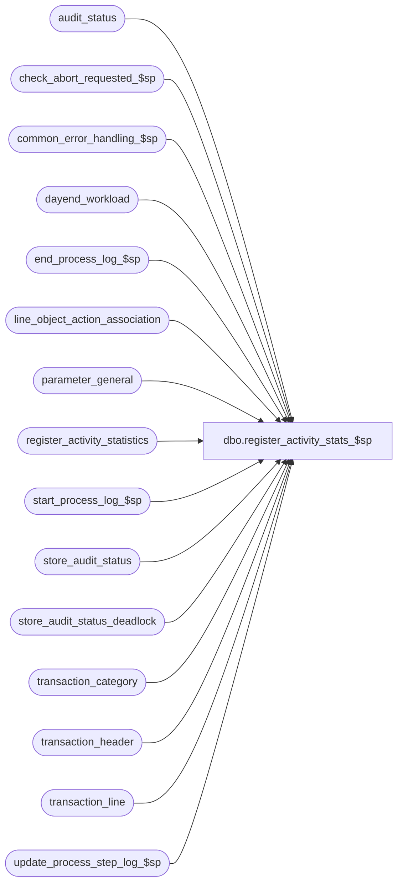

# dbo.register_activity_stats_$sp

**Database:** auditworks_external  
**Server:** bedrockdb01  

## Architecture Diagram



## Table Dependencies

| Referenced Table |
|---|
| audit_status |
| check_abort_requested_$sp |
| common_error_handling_$sp |
| dayend_workload |
| end_process_log_$sp |
| line_object_action_association |
| parameter_general |
| register_activity_statistics |
| start_process_log_$sp |
| store_audit_status |
| store_audit_status_deadlock |
| transaction_category |
| transaction_header |
| transaction_line |
| update_process_step_log_$sp |

## Stored Procedure Code

```sql
create proc [dbo].[register_activity_stats_$sp] 
( @process_id				binary(16),
  @dayend_process_id 			tinyint = NULL,
  @errmsg 				nvarchar(255) OUTPUT,
  @excluded_dayend_from_time            int = 0,
  @excluded_dayend_to_time              int = 0
)

AS

/* 
PROC NAME: register_activity_stats_$sp
     DESC: Will calculate the transaction_count and tender total by
 	   field activity_minute_interval in parameter_general. Will 
	   only calculate values where store_audit_status = 350.
           Called from day_end_posting_$sp.

  HISTORY:
Date     Name		Def# Desc
Dec14,04 David       DV-1191 Improve performance by adding hints.
Oct07,04 David       DV-1146 Remove user_name.
Jul09,04 ShuZ        DV-1071 Expand user_name to nvarchar(50)
May10,04 Maryam      DV-1071 Receive @process_id and @user_name and pass it to check_abort_requested_$sp.
Sep18,03 Maryam        13686 Pass two new parameters for excluded dayend time and call check_abort_requested_$sp
                             to check whether abort has been requested either by the system or user.
Jul22,03 David   11732/11733 Do not multiply tender_total by -1. 
May08,02 Winnie	     1-C2Q5L Add abort logic to dayend.
Nov30,01 Phu		8931 Progress monitor and error handling
May01,01 David M	7589 Missing transactions by transaction series Version 1.0 (recognition of POS transactions).
Mar21,01 Paul		7471 Correctly set store_audit_status when register_activity_days = 0
Sep12,00 Shapoor	6663 Facilitate Multi stream Dayend.
Mar01,00 Phu		5900 Change @@fetch_status > 0 to @@fetch_status <> 0 for MS SQL compatibility
Dec08,99 Paul		5712 speed improvement - remove unnecessary exists
Oct29,99 Shapoor	5531 Process only 1 store/date at a time.
Oct29,99 Paul		5538 properly update dayend workload to avoid skipping stores
Jun07,99 Daphna F	4808 add 'or edit_timestamp >= 1' in inserts to 
				work table to ensure all tran from store are included
May07,99 Daphna F	4531 set all statuses to 355 when complete
May27,98 Paul S			
Apr16,98 Sebastiano V	author version 1.13

*/

DECLARE
	@activity_minute_interval		smallint,
	@cursor_open				tinyint,
	@errno					int,
	@message_id				int,
	@object_name				nvarchar(255),
	@operation_name				nvarchar(100),
	@process_name				nvarchar(100),
	@process_log_entry 			tinyint,
	@process_no				smallint,
	@process_start_time			datetime,
	@process_timestamp			float,
	@register_activity_days			smallint,
	@register_activity_exclud_zero		tinyint,
	@register_activity_user_amount		tinyint,
	@rows 					int,
	@sales_date				smalldatetime,
	@store_no				int,
	@transaction_count			numeric(12,0),
	@abort_flag				tinyint

IF @dayend_process_id IS NULL  
  RETURN

SELECT @process_start_time = getdate(),
	@rows = 0,
	@cursor_open = 0,
	@process_timestamp = 0,
	@process_log_entry = 0,
	@process_no = 27,
	@transaction_count = 0,
	@message_id = 201068,
	@process_name = 'register_activity_stats_$sp',
	@abort_flag = 0

SELECT @activity_minute_interval = activity_minute_interval,
	@register_activity_exclud_zero = register_activity_exclude_zero,
	@register_activity_user_amount = register_activity_user_amounts,
	@register_activity_days = register_activity_days
  FROM parameter_general

/* build temp table to minimize cursor locking */
CREATE TABLE #work_batch_act (
	sales_date 			smalldatetime 	not null,
	store_no 			int 		not null )

SELECT @errno = @@error
IF @errno <> 0 
BEGIN
  SELECT @errmsg = 'Failed to create temp table.',
         @object_name = '#work_batch_act',
         @operation_name = 'CREATE'
  GOTO error  
END

INSERT INTO #work_batch_act
SELECT sales_date,
       store_no
  FROM dayend_workload WITH (NOLOCK)
 WHERE dayend_process_id = @dayend_process_id
   AND store_audit_status = 350
   AND date_reject_id = 0

SELECT @errno = @@error,
	@rows = @@rowcount
IF @errno != 0
BEGIN
  SELECT @errmsg = 'Failed to build temp table #work_batch_act',
	 @object_name = '#work_batch_act',
	 @operation_name = 'INSERT'
  GOTO error
END

IF @rows = 0
  RETURN

CREATE TABLE #work_totals_act (
	sales_date			smalldatetime not null,
	store_no			int not null,
	register_no			smallint not null,
	cashier_no			int not null,
	interval_id			smallint,
	tender_total			money,
	update_register_activity 	smallint)

SELECT @errno = @@error
IF @errno != 0
BEGIN
 SELECT @errmsg = 'Failed to create temp table #work_totals_act',
	 @object_name = '#work_totals_act',
	 @operation_name = 'CREATE'
  GOTO error
END

EXEC start_process_log_$sp @process_no, @process_timestamp OUTPUT,
	@errmsg OUTPUT, @dayend_process_id, @process_start_time

SELECT @errno = @@error
IF @errno != 0
BEGIN
  SELECT @object_name = 'start_process_log_$sp',
	 @operation_name = 'EXECUTE'
  IF @errmsg IS NULL  
    SELECT @errmsg = 'Failed to execute stored procedure start_process_log_$sp'
  GOTO error
END

SELECT @process_log_entry = 1

DECLARE store_date_crsr CURSOR FAST_FORWARD
    FOR
 SELECT store_no,
        sales_date
   FROM #work_batch_act WITH (NOLOCK)

OPEN store_date_crsr

SELECT @errno = @@error
IF @errno <> 0
  BEGIN
	SELECT @errmsg = 'Unable to open cursor store_date_crsr',
	       @object_name = 'store_date_crsr',
	       @operation_name = 'OPEN'
	GOTO error
  END

SELECT @cursor_open = 1

WHILE 1 = 1
BEGIN

FETCH store_date_crsr INTO
	@store_no,
	@sales_date

  IF @@fetch_status <> 0
    BREAK

   EXEC check_abort_requested_$sp @dayend_process_id, @process_id, @process_no,
                        @excluded_dayend_from_time, @excluded_dayend_to_time, @errmsg OUTPUT
        
  SELECT @errno = @@error
  IF @errno != 0 
    BEGIN
      IF @errmsg IS NULL
        SELECT @errmsg = 'Failed to execute stored procedure check_abort_requested_$sp'
      SELECT @object_name = 'check_abort_requested_$sp',
             @operation_name = 'EXECUTE'
      GOTO error
    END


IF ((@activity_minute_interval > 0) AND (@register_activity_days > 0))
BEGIN
  IF @register_activity_user_amount = 0
  BEGIN
     INSERT #work_totals_act (
	    sales_date,
	    store_no,
	    register_no,
	    cashier_no,
	    interval_id,
	    tender_total,
	    update_register_activity)
     SELECT transaction_date,
	    store_no,
	    register_no,
	    cashier_no,
	    FLOOR((DATEPART (hh, entry_date_time) * 60)
		+ (DATEPART(mi, entry_date_time))) / @activity_minute_interval,
	    tender_total, 
	    1
       FROM transaction_header th WITH (NOLOCK), transaction_category tc
      WHERE th.transaction_date = @sales_date
	AND th.store_no = @store_no
	AND date_reject_id = 0
	AND (transaction_void_flag = 0 OR transaction_void_flag = 8)
	AND  th.edit_timestamp >= 1
	AND th.transaction_category = tc.transaction_category
	AND update_register_activity <> 0

     SELECT @errno = @@error
     IF @errno != 0
     BEGIN
	  SELECT @errmsg = 'Failed to insert on #work_totals_act (1)',
		 @object_name = '#work_totals_act',
		 @operation_name = 'INSERT'
	  GOTO error
     END
  END
  ELSE
   BEGIN
     INSERT #work_totals_act (
	    sales_date,
	    store_no,
	    register_no,
	    cashier_no,
	    interval_id,
	    tender_total,
	    update_register_activity)
     SELECT transaction_date,
	    store_no,
	    register_no,
	    cashier_no,
	    FLOOR((DATEPART (hh, entry_date_time) * 60)
		+ (DATEPART(mi, entry_date_time))) / @activity_minute_interval,
	    SUM((tl.gross_line_amount - tl.pos_discount_amount)
	      * tl.db_cr_none * voiding_reversal_flag * -1),
	    COUNT(DISTINCT th.transaction_id)
       FROM transaction_header th WITH (NOLOCK), transaction_line tl WITH (NOLOCK), 
            line_object_action_association lo
      WHERE th.transaction_date = @sales_date
        AND th.store_no = @store_no
        AND date_reject_id = 0
        AND (transaction_void_flag = 0 OR transaction_void_flag = 8)
        AND  th.edit_timestamp >= 1
     AND th.transaction_id = tl.transaction_id
        AND line_void_flag = 0
        AND th.transaction_category = lo.transaction_category
        AND tl.line_object = lo.line_object
        AND tl.line_action = lo.line_action
        AND update_register_activity <> 0
      GROUP BY transaction_date,
	    store_no,
	    register_no,
	    cashier_no,
	    FLOOR((DATEPART (hh, entry_date_time) * 60)
		+ (DATEPART(mi, entry_date_time))) / @activity_minute_interval

     SELECT @errno = @@error
     IF @errno != 0
     BEGIN
	  SELECT @errmsg = 'Failed to insert on #work_totals_act (2)',
		 @object_name = '#work_totals_act',
		 @operation_name = 'INSERT'
	  GOTO error
     END
  END -- else of if @register_activity_user_amount = 0

  BEGIN TRANSACTION

  IF @register_activity_exclud_zero = 0
  BEGIN
    INSERT register_activity_statistics (
	   transaction_date,
	   store_no,
	   register_no,
	   cashier_no,
	   interval_id,
	   transaction_qty,
	   tender_total)
    SELECT sales_date,
	   store_no,
	   register_no,
	   cashier_no,
	   interval_id,
	   SUM(update_register_activity),
	   SUM(tender_total)
      FROM #work_totals_act WITH (NOLOCK)
     GROUP BY sales_date, store_no, register_no, cashier_no, interval_id

     SELECT @errno = @@error,
	    @transaction_count = @transaction_count + @@rowcount
     IF @errno != 0
     BEGIN
	  SELECT @errmsg = 'Failed to insert on register_activity_statistics',
		 @object_name = 'register_activity_statistics',
		 @operation_name = 'INSERT'
	  GOTO error
     END
   END
  ELSE
   BEGIN
    INSERT register_activity_statistics (
	   transaction_date,
	   store_no,
	   register_no,
	   cashier_no,
	   interval_id,
	   transaction_qty,
	   tender_total)
    SELECT sales_date,
	   store_no,
	   register_no,
	   cashier_no,
	   interval_id,
	   SUM(update_register_activity),
	   SUM(tender_total)
      FROM #work_totals_act WITH (NOLOCK)
     WHERE tender_total != 0
     GROUP BY sales_date, store_no, register_no, cashier_no, interval_id

     SELECT @errno = @@error,
	    @transaction_count = @transaction_count + @@rowcount
     IF @errno != 0
     BEGIN
	  SELECT @errmsg = 'Failed to insert on register_activity_statistics',
		 @object_name = 'register_activity_statistics',
		 @operation_name = 'INSERT'
	  GOTO error
     END
   END -- else of if @register_activity_exclud_zero = 0
END -- if ((@activity_minute_interval > 0) AND (@register_activity_days > 0))

UPDATE store_audit_status_deadlock
SET function_no = 18,
	status_date = getdate()

SELECT @errno = @@error
IF @errno <> 0
  BEGIN
	SELECT @errmsg = 'Unable to update store_audit_status_deadlock',
	       @object_name = 'store_audit_status_deadlock',
	       @operation_name = 'UPDATE'
	GOTO error
  END

UPDATE audit_status
   SET audit_status = 355
 WHERE sales_date = @sales_date
   AND store_no = @store_no
   AND date_reject_id = 0
   AND audit_status = 350

SELECT @errno = @@error
IF @errno != 0
 BEGIN
   SELECT @errmsg = 'Failed to update audit_status with status 355',
	  @object_name = 'audit_status',
	  @operation_name = 'UPDATE'
   GOTO error
 END

UPDATE store_audit_status
   SET store_audit_status = 355
 WHERE sales_date = @sales_date
   AND store_no = @store_no
   AND date_reject_id = 0
   AND store_audit_status = 350

SELECT @errno = @@error
IF @errno != 0
 BEGIN
   SELECT @errmsg = 'Failed to update store_audit_status with status 355',
	  @object_name = 'store_audit_status',
	  @operation_name = 'UPDATE'
   GOTO error
 END

UPDATE dayend_workload
   SET store_audit_status = 355
 WHERE dayend_process_id = @dayend_process_id
   AND sales_date = @sales_date
   AND store_no = @store_no
   AND date_reject_id = 0
   AND store_audit_status = 350

SELECT @errno = @@error
IF @errno != 0
 BEGIN
   SELECT @errmsg = 'Failed to update dayend_workload with status 355',
	  @object_name = 'dayend_workload',
	  @operation_name = 'UPDATE'
   GOTO error
 END

EXEC update_process_step_log_$sp 18, @dayend_process_id, 42, NULL, NULL, NULL   
   SELECT @errno = @@error
IF @errno != 0
  BEGIN
   IF @errmsg IS NULL  
     SELECT @errmsg = 'Failed to execute stored proc update_process_step_log_$sp for step 42'
   SELECT @object_name = 'update_process_step_log_$sp',
	  @operation_name = 'EXECUTE'
   GOTO error
  END

COMMIT TRANSACTION

TRUNCATE TABLE #work_totals_act

SELECT @errno = @@error
IF @errno != 0
 BEGIN
   SELECT @errmsg = 'Failed to truncate table #work_totals_act',
	  @object_name = '#work_totals_act',
	  @operation_name = 'TRUNCATE'
   GOTO error
 END

END -- While 1=1

CLOSE store_date_crsr
DEALLOCATE store_date_crsr
SELECT @cursor_open = 0


IF @process_log_entry = 1
BEGIN
  EXEC end_process_log_$sp @process_no, @process_timestamp, @transaction_count

  SELECT @errno = @@error
  IF @errno != 0
    BEGIN
      SELECT @errmsg = 'Unable to execute stored procedure end_process_log_$sp',
             @object_name = 'end_process_log_$sp',
	     @operation_name = 'EXECUTE'
      GOTO error
  END
END  

DROP TABLE #work_totals_act
SELECT @errno = @@error
IF @errno != 0
 BEGIN
   SELECT @errmsg = 'Failed to drop table #work_totals_act',
	  @object_name = '#work_totals_act',
	  @operation_name = 'DROP'
   GOTO error
 END

DROP TABLE #work_batch_act
SELECT @errno = @@error
IF @errno != 0
 BEGIN
   SELECT @errmsg = 'Failed to drop table #work_batch_act',
	  @object_name = '#work_batch_act',
	  @operation_name = 'DROP'
   GOTO error
 END


RETURN

error:
	IF @cursor_open = 1
	  BEGIN
	   CLOSE store_date_crsr
	   DEALLOCATE store_date_crsr
	  END

	EXEC common_error_handling_$sp @process_no, @errno, @errmsg, @abort_flag, @message_id, 
	@process_name, @object_name, @operation_name, 1, @dayend_process_id, @process_log_entry,
	@process_timestamp, @transaction_count
	RETURN
```

