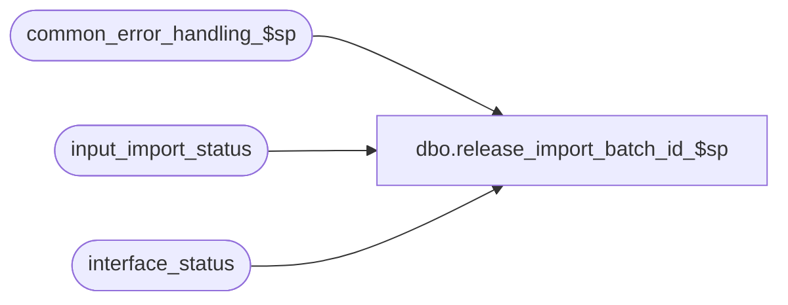

# dbo.release_import_batch_id_$sp

**Database:** auditworks_external  
**Server:** bedrockdb01  

## Architecture Diagram



## Table Dependencies

| Referenced Table |
|---|
| common_error_handling_$sp |
| input_import_status |
| interface_status |

## Stored Procedure Code

```sql
create proc [dbo].[release_import_batch_id_$sp] ( @import_batch_id numeric(12,0), --identifies the batch of reservations, fulfillments, cancellations that have been interfaced
  @errmsg	nvarchar(255) = NULL OUTPUT)
AS
 
/* Name: release_import_batch_id_$sp @import_batch_id
   Desc: This procedure releases the data associated with the import_batch_id specified to the standard import smartload.
         Called from Enterprise Selling.

HISTORY:
Date     Name          Defect#  Desc
Mar31,09 Vicci         109078   author

*/

DECLARE
	@errno				int,
	@message_id			int,
	@object_name			nvarchar(255),
	@operation_name			nvarchar(100),
	@process_no   			smallint,
	@process_name			nvarchar(100),
	@process_start_datetime		datetime,
	@processing_message		nvarchar(255),
	@reference_type			tinyint,
	@register_no			smallint,
	@rows				int,
	@store_no			int,
	@transaction_category		smallint,
	@transaction_series		nchar(1)

SELECT @process_name = 'release_import_batch_id_$sp',
       @process_start_datetime = getdate(),
       @message_id = 201068

SELECT @process_no = process_no
  FROM input_import_status
 WHERE import_batch_id = @import_batch_id
SELECT @errno = @@error
IF @errno != 0 
BEGIN
  SELECT @errmsg = 'Failed to determine process associated with import data batch',
         @object_name = 'input_import_status',
         @operation_name = 'SELECT'
  GOTO error
END  

BEGIN TRANSACTION

  UPDATE input_import_status
     SET status = 1
   WHERE import_batch_id = @import_batch_id
  SELECT @errno = @@error
  IF @errno != 0 
  BEGIN
    SELECT @errmsg = 'Failed to release an import data batch',
           @object_name = 'input_import_status',
           @operation_name = 'UPDATE'
    GOTO error
  END  
  
  UPDATE interface_status
     SET immediate_posting_requested = 1
   WHERE immediate_posting_requested = 0
     AND interface_id = 25  --Standard Import activation
  SELECT @errno = @@error
  IF @errno != 0 
  BEGIN
    SELECT @errmsg = 'Failed to request standard import processing from pre-loaded interface tables',
           @object_name = 'interface_status',
           @operation_name = 'UPDATE'
    GOTO error
  END  

COMMIT TRANSACTION

RETURN

error:

	EXEC common_error_handling_$sp @process_no, @errno, @errmsg, 0, @message_id, 
	@process_name, @object_name, @operation_name, 1

	RETURN
```

