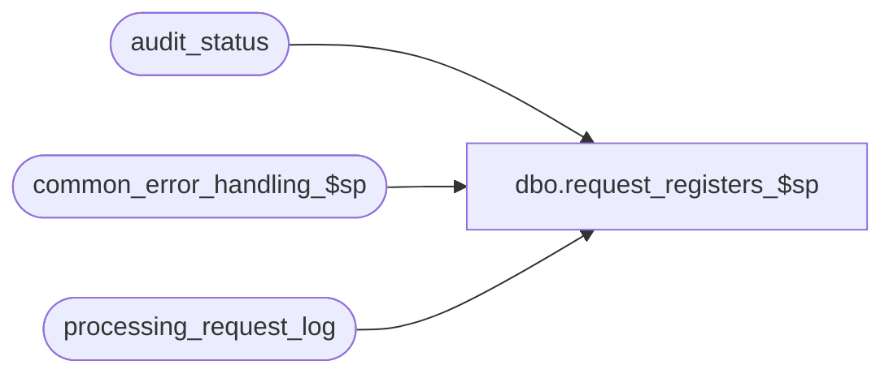

# dbo.request_registers_$sp

**Database:** auditworks_external  
**Server:** bedrockdb01  

## Architecture Diagram



## Table Dependencies

| Referenced Table |
|---|
| audit_status |
| common_error_handling_$sp |
| processing_request_log |

## Stored Procedure Code

```sql
create proc [dbo].[request_registers_$sp] 
@process_id             binary(16),
@user_id                int,
@request_datetime	datetime,
@process_no		tinyint,
@errmsg			nvarchar(255) OUTPUT

AS
/* Version:1.00 Date:1996/06/17
   Proc name : request_registers_$sp
   Insert registers into processing_request_log
   where only store was originally requested ( register_no = 0 )
   by Powerbuilder.
   Called by unaccept_store_$sp, accept_store_$sp.

HISTORY:
Date     Name		Def# Desc
Mar16,10 Vicci        115428 Make @request_datetime a datetime to match UI.
Sep20,04 Maryam      DV-1146 Change user_name to user_id.
Jul09,04 ShuZ        DV-1071 Expand user_id to nvarchar(50)
Apr22,04 Maryam      DV-1071 Receive @process_id and pass it to common_error_handling_$sp
Apr19,02 Winnie	     1-CD0IX R3 error handling
May03,00 Paul		6293 Do not delete rows where register <= 0 when accepting stores
Mar05,98 Vicci
         Phu		author
*/


DECLARE	@errno 	int,
	@rows	int,
        @message_id		       	int,	
        @object_name			nvarchar(255),
        @operation_name		nvarchar(100),
        @process_name		       	nvarchar(100)
 
SELECT @process_name = 'request_registers_$sp',
       @message_id = 201068

SELECT store_no,
	sales_date,
	date_reject_id
 INTO #store_date_list
  FROM processing_request_log
  WHERE user_id = @user_id
  AND request_datetime = @request_datetime
  AND register_no <= 0 

SELECT @rows = @@rowcount,
	@errno = @@error

IF @errno != 0
  BEGIN
   SELECT @errmsg = 'Failed to build table #store_date_list',
          @object_name = '#store_date_list',
          @operation_name = 'CREATE'
   GOTO error
  END

IF @rows = 0
  RETURN

/* do not execute if register_no's are already set (balancing by store) */

IF EXISTS (SELECT register_no
  	    FROM processing_request_log
  	    WHERE user_id = @user_id
  	     AND request_datetime = @request_datetime
  	     AND register_no > 0 )
  RETURN

INSERT processing_request_log (
	user_id,
	request_datetime,
	store_no,
	register_no,
	sales_date,
	date_reject_id )
SELECT
	@user_id,
	@request_datetime,
	st.store_no,
	st.register_no,
	st.sales_date,
	st.date_reject_id
  FROM #store_date_list sd, audit_status st
 WHERE sd.store_no = st.store_no
   AND sd.sales_date = st.sales_date
   AND sd.date_reject_id = st.date_reject_id

SELECT @errno = @@error
IF @errno <> 0
  BEGIN
   SELECT @errmsg = 'Failed to insert table processing_request_log',
          @object_name = 'processing_request_log',
          @operation_name = 'INSERT'
   GOTO error
  END

IF @process_no != 75
  BEGIN
   DELETE processing_request_log
    WHERE user_id = @user_id
      AND request_datetime = @request_datetime
      AND register_no <= 0

   SELECT @errno = @@error
   IF @errno <> 0
     BEGIN
      SELECT @errmsg = 'Failed to delete rows from table processing_request_log',
             @object_name = 'processing_request_log',
             @operation_name = 'DELETE'
      GOTO error
     END
  END

RETURN


error:
	EXEC common_error_handling_$sp @process_no, @errno, @errmsg, 0, @message_id, 
	@process_name, @object_name, @operation_name, 0, 1, 0, null, 0, null, null, 
	null, null, null, null, 0, @process_id, @user_id
     RETURN
	RETURN
```

