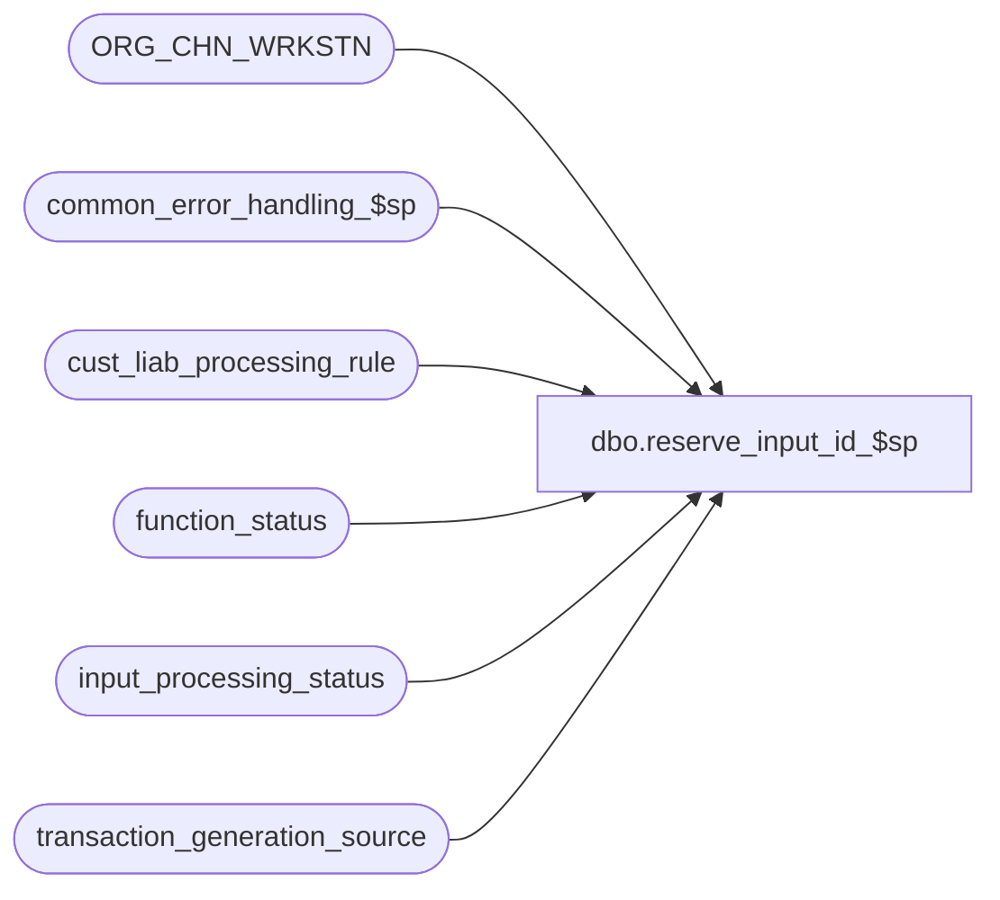

# dbo.reserve_input_id_$sp

**Database:** auditworks_external  
**Server:** bedrockdb01  

## Architecture Diagram



## Table Dependencies

| Referenced Table |
|---|
| ORG_CHN_WRKSTN |
| common_error_handling_$sp |
| cust_liab_processing_rule |
| function_status |
| input_processing_status |
| transaction_generation_source |

## Stored Procedure Code

```sql
create proc dbo.reserve_input_id_$sp ( @process_id   binary(16),
  @user_id      int,
  @rule_id	nvarchar(3), 
  @input_id	numeric(12,0) OUTPUT, 
  @errmsg	nvarchar(2000)  OUTPUT,
  @process_no   smallint = 228)
AS

/* Name: reserve_input_id_$sp
   Desc: This procedure inserts into input_processing_status 
         and returns the new input_id.
         Called from cust_liability_import_$sp and media_rec_float_load

HISTORY:
Date     Name          Defect#  Desc
Feb14,14 Vicci          149581  Use process 51 (ECP Imports) to look up generation source for process 284 (ECP ref adjustment request).
Jun16,11 PaulS          127208  trap duplicate on insert to function_status
Sep15,04 IanK          DV-1146  Use user_id
May20,04 Maryam        DV-1071  Use ORG_CHN_WRKSTN instead of register.
Arp20,04 Maryam        DV-1071  Modified to receive @process_id as input parameter and 
 			        pass it to the sub procs.
Apr10,03 Vicci         7439     make procedure more re-usable (will be needed by media rec)
Sep10,02 Paul S        1-F97LW  added comments, capitalized commands
Feb15,02 David C       AW-8415  Author

*/

DECLARE
	@errno				int,
	@message_id			int,
	@object_name			nvarchar(255),
	@operation_name			nvarchar(100),
	@process_name			nvarchar(100),
	@process_start_datetime		datetime,
	@processing_message		nvarchar(255),
	@reference_type			tinyint,
	@register_no			smallint,
	@rows				int,
	@store_no			int,
	@transaction_category		smallint,
	@transaction_series		nchar(1)

SELECT @process_name = 'reserve_input_id_$sp',
       @process_start_datetime = getdate(),
       @message_id = 201068

IF @process_no = 228
BEGIN
  SELECT  @process_no = transaction_category,
  	  @processing_message = @rule_id,
  	  @transaction_category = transaction_category,
  	  @reference_type = p.reference_type,
	  @store_no = store_no,
	  @register_no = register_no,
	  @transaction_series = 'C'
    FROM cust_liab_processing_rule p
   WHERE p.rule_id = @rule_id

  SELECT @errno = @@error, @rows = @@rowcount
  IF @errno != 0 
  BEGIN
    SELECT @errmsg = 'Failed to select from cust_liab_processing_rule',
           @object_name = 'cust_liab_processing_rule',
           @operation_name = 'SELECT'
    GOTO error
  END  
  IF @rows = 0 
  BEGIN
    SELECT @errmsg = 'rule_id/reference_type combination not found in cust_liab_processing_rule',
           @message_id = 201649,
           @errno = 201649
    GOTO error
  END
END
ELSE
BEGIN
  SELECT  @transaction_category = t.transaction_category,
  	  @reference_type = 0,
	  @store_no = t.store_no,
	  @register_no = t.register_no,
	  @transaction_series = t.transaction_series
    FROM transaction_generation_source t, ORG_CHN_WRKSTN r
   WHERE t.process_no = CASE WHEN @process_no  = 287 THEN 51 ELSE @process_no END
     AND t.store_no = r.ORG_CHN_NUM
     AND t.register_no = r.WRKSTN_NUM

  SELECT @errno = @@error, @rows = @@rowcount
  IF @errno != 0 
  BEGIN
    SELECT @errmsg = 'Failed to select from transaction_generation_source',
           @object_name = 'transaction_generation_source',
           @operation_name = 'SELECT'
    GOTO error
  END  
  IF @rows = 0 
  BEGIN
    SELECT @errmsg = 'No valid store/reg has been assigned as a transaction generation source for this process',
           @message_id = 201676,
           @errno = 201676
    GOTO error
  END
END

BEGIN TRANSACTION

INSERT INTO input_processing_status (
	process_start_datetime, 
	process_no, 
	processing_message, 
	status  ) 
VALUES (
	@process_start_datetime, 
	@process_no, 
	@processing_message, 
	-2      )

SELECT @errno = @@error
IF @errno != 0 
BEGIN
  SELECT @errmsg = 'Failed to insert into input_processing_status',
         @object_name = 'input_processing_status',
         @operation_name = 'INSERT'
  GOTO error
END  


SELECT @input_id = @@identity

/* rows could only exist from prior runs in the event of a halted process that has not yet been cleaned up */


IF NOT EXISTS (SELECT 1 FROM function_status
		WHERE process_id = @process_id AND function_no = @process_no)
BEGIN
 INSERT INTO function_status (
	user_id, 
	process_id, 
	function_no, 
	status, 
	entry_date, 
	store_no, 
	register_no, 
	transaction_date, 
	date_reject_id, 
	transaction_series, 
	transaction_id, 
	reference_type     ) 
 VALUES (
	@user_id,        
	@process_id, 
	@process_no, 
	0, 
	@process_start_datetime, 
	@store_no, 
	@register_no, 
	CONVERT(smalldatetime, CONVERT(nvarchar, @process_start_datetime, 101)), 
	0, 
	@transaction_series, 
	@input_id, 
	@reference_type ) 

 SELECT @errno = @@error
 IF @errno != 0 
 BEGIN
   SELECT @errmsg = 'Failed to insert into function_status',
         @object_name = 'function_status',
         @operation_name = 'INSERT'
   GOTO error
 END  
END -- If not exists

COMMIT TRANSACTION

RETURN

error:

	EXEC common_error_handling_$sp @process_no, @errno, @errmsg, 0, @message_id, 
	@process_name, @object_name, @operation_name, 1, 1, 0, null, 0, null, null, null,
	  null, null, null, 0, @process_id, @user_id

	RETURN
```

