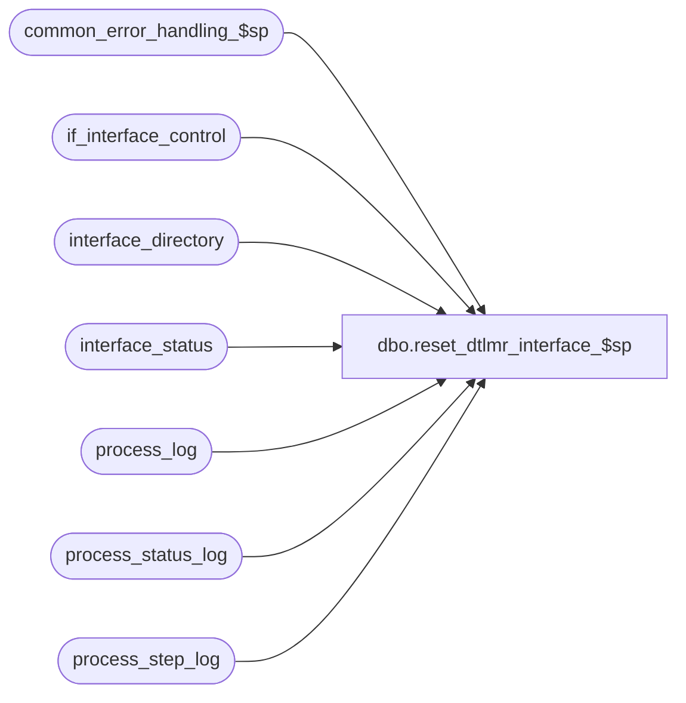

# dbo.reset_dtlmr_interface_$sp

**Database:** auditworks_external  
**Server:** bedrockdb01  

## Architecture Diagram



## Table Dependencies

| Referenced Table |
|---|
| common_error_handling_$sp |
| if_interface_control |
| interface_directory |
| interface_status |
| process_log |
| process_status_log |
| process_step_log |

## Stored Procedure Code

```sql
create proc [dbo].[reset_dtlmr_interface_$sp] 

 (  @posting_in_progress 		tinyint = NULL )

AS

/* Proc name:   reset_dtlmr_interface_$sp
** Description: Reset retrieval_in_progress flag to signal that the basic
**              dtlmr interface file has been completed. Called by
** 		smartload script bscintface.ict

HISTORY
Date     Name		Def#  Desc
Sep02,04 Maryam      DV-1120  Add logic to set the completed_flag in process_status_log
                       38985  
Apr19,02 Winnie	     1-CD0IX  R3 error handling
Oct12,01 Phu		8833  Don't reset posting_in_progress if there is more data to process.
Aug11,99 Paul		4522  avoid = null
         Phu		Author
*/


DECLARE
	@errmsg 			nvarchar(255),
	@errno 				int,
	@rows				tinyint,
        @message_id		       	int,	
        @object_name			nvarchar(255),
        @operation_name			nvarchar(100),
        @process_name		       	nvarchar(100)
 

SELECT @process_name = 'reset_dtlmr_interface_$sp',
       @message_id = 201068

IF EXISTS (SELECT i.if_entry_no
	     FROM  interface_directory d, if_interface_control i
	    WHERE basic_dtlmr_subsystem IS NOT NULL
	   AND ascii_export = 1
	      AND interface_control_flag <= 49
	      AND d.interface_id = i.interface_id )
  SELECT @rows = 1
ELSE
  SELECT @rows = 0

IF @posting_in_progress IS NOT NULL AND @rows = 0
  BEGIN
    UPDATE interface_status
       SET retrieval_in_progress = 0,
	   posting_in_progress = @posting_in_progress
      FROM interface_status s, interface_directory d
     WHERE s.interface_id = d.interface_id
       AND basic_dtlmr_subsystem IS NOT NULL  
       AND ascii_export = 1

    SELECT @errno = @@error
    IF @errno != 0
      BEGIN
        SELECT @errmsg = 'unable to update interface_status',
       	       @object_name = 'interface_status',
	       @operation_name = 'UPDATE'
	GOTO error
      END 
	        --  defect 38985
    UPDATE process_status_log
       SET completed_flag = 1,
           expected_workload =1,
           completed_workload = 1
     WHERE process_no = 203

    SELECT @errno = @@error    
      IF @errno <> 0
        BEGIN
          SELECT @errmsg = 'Unable to update process_status_log for completed_flag',
                 @object_name = 'process_status_log',
                 @operation_name = 'UPDATE'
          GOTO error
        END          

    UPDATE process_step_log
       SET process_step_no = 99,
           expected_workload = 1,
           completed_workload = 1
      FROM interface_status
     WHERE process_no = 203
       AND stream_no = 1

    SELECT @errno = @@error    
    IF @errno <> 0
      BEGIN
        SELECT @errmsg = 'Unable to update process_step_log to step_no 99',
               @object_name = 'process_step_log',
               @operation_name = 'UPDATE'
        GOTO error
      END          
  END 
ELSE
  BEGIN
	UPDATE interface_status
	   SET retrieval_in_progress = 0
	  FROM interface_status s, interface_directory d
	 WHERE s.interface_id = d.interface_id
	   AND basic_dtlmr_subsystem IS NOT NULL          
           AND ascii_export = 1

	SELECT @errno = @@error
	IF @errno <> 0
	  BEGIN
		SELECT @errmsg = 'Unable to set retrieval_in_progress = 0 in interface_status',
                       @object_name = 'interface_status',
	               @operation_name = 'UPDATE'
		GOTO error
	  END
  END
UPDATE process_log
SET process_end_time = DATEADD (ss, 1, process_end_time),
    process_status_flag = 2
WHERE process_no = 203
AND process_start_time = process_end_time
AND process_status_flag != 3

SELECT @errno = @@error
IF @errno <> 0
  BEGIN
	SELECT @errmsg = 'Unable to set process_end_time in process_log',
               @object_name = 'process_log',
               @operation_name = 'UPDATE'	
	GOTO error
  END

RETURN


error:   /* Common error handler */

	EXEC common_error_handling_$sp 203, @errno, @errmsg, 0, @message_id, 
	@process_name, @object_name, @operation_name,1,1
	RETURN
```

