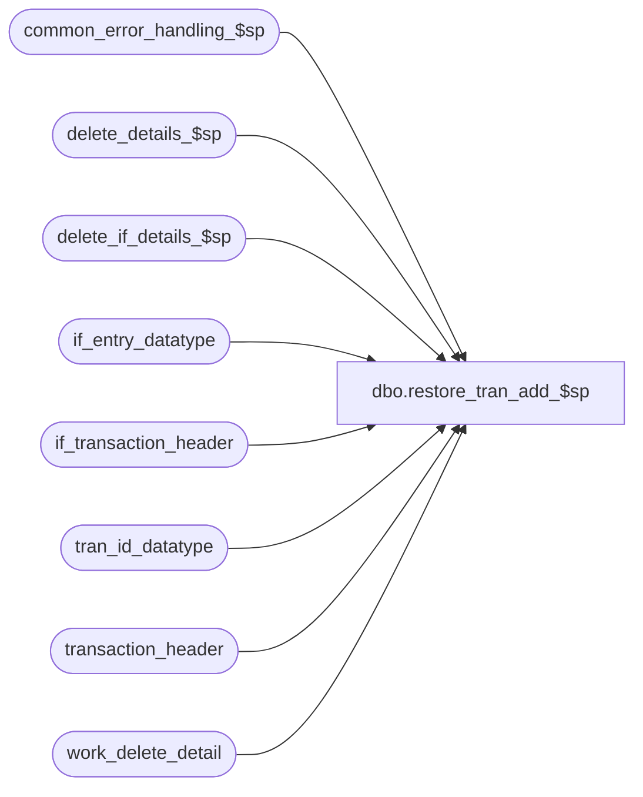

# dbo.restore_tran_add_$sp

**Database:** auditworks_external  
**Server:** bedrockdb01  

## Architecture Diagram



## Table Dependencies

| Referenced Table |
|---|
| common_error_handling_$sp |
| delete_details_$sp |
| delete_if_details_$sp |
| if_entry_datatype |
| if_transaction_header |
| tran_id_datatype |
| transaction_header |
| work_delete_detail |

## Stored Procedure Code

```sql
create proc dbo.restore_tran_add_$sp 
@process_id             binary(16),
@user_id                int,
@transaction_id		tran_id_datatype,
@errmsg			nvarchar(255) OUTPUT,
@cleanup_flag		tinyint = 0 /* 1 = function_cleanup, 2 = partial cleanup */

AS
DECLARE
  @errno		int,
-- used for common error handling.
  @process_no		smallint,
  @object_name		nvarchar(255),
  @process_name		nvarchar(100),
  @operation_name	nvarchar(100),
  @message_id		int,
  @if_entry_no		if_entry_datatype

/*
PROC NAME: restore_tran_add_$sp
     DESC: ( ADD ) Set the transaction back to original state. 
     	   Deletes any details associated with this transaction.
     	   Partial cleanup leaves the transaction_header row in order to allow PB to resave.
     	   Called from function_cleanup_$sp.

HISTORY:

Date     Name		Def  Desc
Feb11,13 Vicci      1-4A7WED When the cause of the transaction add failure was a C/L posting failure, 
                             the transaction will end up rolling back but the C/L entry rolling forward unless the I/F tables are cleaned up too.
Apr28,05 Paul        DV-1234 expand transaction_id to use tran_id_datatype
Sep15,04 IanK        DV-1146 Change user_name to user_id
Apr29,04 Maryam      DV-1071 Receive @process_id and @user_name and pass them to the sub 
                             procs.
May27,02 Henry       1-CD0IX Add R3.5 standardized common error handling
Dec13,99 Paul		5716 added comments
Jul28,99 Daphna F	5026 added call to delete_detail_$sp instead of deleting
			     and setting off delete trigger on transaction_header
Apr17,98 Paul S
Jun18,96 Sebastiano V	author version 1.02

*/


SELECT @process_name = 'restore_tran_add_$sp',
       @message_id = 201068,
       @process_no = 100

IF @cleanup_flag = 0
BEGIN
   UPDATE transaction_header
    SET transaction_remark = NULL,
	cashier_no = 0,
	employee_no = 0,
	transaction_void_flag =0,
	tender_total = 0,
	customer_info_exists = 0,
	last_modified_date_time = NULL
 WHERE transaction_id = @transaction_id

   SELECT @errno = @@error
   IF @errno != 0
   BEGIN
     SELECT @errmsg = 'Failed to UPDATE on transaction_header',
	    @object_name = 'transaction_header',
	    @operation_name = 'UPDATE'
     GOTO error
   END
END /* If cleanup_flag = 0 */

DELETE work_delete_detail
 WHERE process_id = @process_id
 
SELECT @errno = @@error
IF @errno != 0
BEGIN
  SELECT @errmsg = 'Failed to DELETE work_delete_detail',
	 @object_name = 'work_delete_detail',
	 @operation_name = 'DELETE'
  GOTO error
END
 
INSERT work_delete_detail (process_id, transaction_id)
VALUES (@process_id, @transaction_id )

SELECT @errno = @@error
IF @errno != 0
BEGIN
  SELECT @errmsg = 'Failed to populate work_delete_detail',
	 @object_name = 'work_delete_detail',
	 @operation_name = 'INSERT'
  GOTO error
END

EXEC delete_details_$sp @process_id, @user_id, 0, @cleanup_flag

SELECT @errno = @@error
IF @errno != 0
BEGIN
  SELECT @errmsg = 'Failed to execute delete_details_$sp',
	 @object_name = 'delete_details_$sp',
	 @operation_name = 'EXECUTE'
  GOTO error
END

--1-4A7WED
--When the cause of the transaction add failure was a C/L posting failure, the transaction will end up rolling back but the C/L entry rolling forward unless the I/F tables are cleaned up too.
SELECT @if_entry_no = MAX(if_entry_no)
  FROM if_transaction_header
 WHERE transaction_id = @transaction_id
SELECT @errno = @@error    
IF @errno != 0
BEGIN
  SELECT @errmsg = 'Failed to determine I/F entry to be cleaned up.',
         @object_name = 'if_transaction_header',
         @operation_name = 'SELECT'
  GOTO error
END

IF @if_entry_no IS NOT NULL
BEGIN
  DELETE work_delete_detail
   WHERE process_id = @process_id
  SELECT @errno = @@error    
  IF @errno != 0
  BEGIN
    SELECT @errmsg = 'Failed to delete work_delete_detail in preparation for I/F cleanup',
           @object_name = 'work_delete_detail',
 @operation_name = 'DELETE'
    GOTO error
  END
 
  INSERT work_delete_detail (process_id, transaction_id)
  VALUES (@process_id, @if_entry_no)
  SELECT @errno = @@error    
  IF @errno != 0
  BEGIN
    SELECT @errmsg = 'Failed to populate work_delete_detail for I/F cleanup',
           @object_name = 'work_delete_detail',
           @operation_name = 'INSERT'
    GOTO error
  END

  EXEC delete_if_details_$sp @process_id, @user_id       
  SELECT @errno = @@error    
  IF @errno != 0
  BEGIN
    SELECT @errmsg = 'Failed to exec delete_if_details_$sp',
  	   @object_name = 'delete_if_details_$sp',
	   @operation_name = 'EXECUTE'
    GOTO error
  END
END

RETURN

error:   /* Common error handler. */

	EXEC common_error_handling_$sp @process_no, @errno, @errmsg, 0, @message_id, 
	@process_name, @object_name, @operation_name, 0, 1, 0, null, 0, null, null, 
	null, null, null, null, 0, @process_id, @user_id

	RETURN
```

