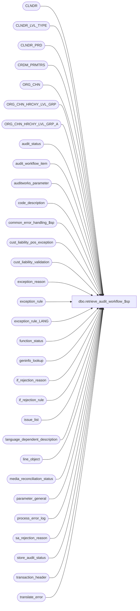

# dbo.retrieve_audit_workflow_$sp

**Database:** auditworks_external  
**Server:** bedrockdb01  

## Architecture Diagram



## Table Dependencies

| Referenced Table |
|---|
| CLNDR |
| CLNDR_LVL_TYPE |
| CLNDR_PRD |
| CRDM_PRMTRS |
| ORG_CHN |
| ORG_CHN_HRCHY_LVL_GRP |
| ORG_CHN_HRCHY_LVL_GRP_A |
| audit_status |
| audit_workflow_item |
| auditworks_parameter |
| code_description |
| common_error_handling_$sp |
| cust_liability_pos_exception |
| cust_liability_validation |
| exception_reason |
| exception_rule |
| exception_rule_LANG |
| function_status |
| geninfo_lookup |
| if_rejection_reason |
| if_rejection_rule |
| issue_list |
| language_dependent_description |
| line_object |
| media_reconciliation_status |
| parameter_general |
| process_error_log |
| sa_rejection_reason |
| store_audit_status |
| transaction_header |
| translate_error |

## Stored Procedure Code

```sql
create proc dbo.retrieve_audit_workflow_$sp   
  @process_id                   binary(16) = NULL,
  @user_id                      int = -1,
  @audit_workflow_code 		smallint = 200,   --code_type 90
  @period_code			char(3) = 'ALL',  --CPD=Current Period (based on today's date), PPD=Prior Periods, ALL=All periods.
  @by_audit_group		tinyint = 0, --0=Provide summary amounts for all stores combined, 
  					     --1=Provide summary amounts for each audit group. 
  					     --If auditor has multiple audit-groups with the same store active, the store will appear in the summary for the last of them
  @language_id			smallint = 1033, 
  @tableName			nvarchar(128) = NULL  --optional security audit-group restriction table name populated with ORG_CHN_NUM/max(HRCHY_LVL_GRP_ID) by SCRTY_EXP_STR_NUM_$SP
--Note: Oracle would have a work table and the UI would have to select from it (returned as i_audit_workflow_status_table  varchar2(30))


AS

/* 
Proc name : retrieve_audit_workflow_$sp
Desc: Given an audit workflow code, a time-period-code, a grouping option and an optional audit-group derived store list table, 
      builds a sequenced summary of outstanding audit issues in accordance with the workflow definition
      provided in the audit_workflow_item master table.
      Note that the time-period-code specified is disregarded for the purpose of process errors and halted processes since the dates they affect are unknown.
      
      Called by front end, which must call the proc and do the select below in the same session connection
      SELECT workflow_issue_type, workflow_item_no, HRCHY_LVL_GRP_ID,
             workflow_issue_type_descr, workflow_item_descr,
             min_date, max_date, store_qty, store_date_qty, trans_qty, amount, instructions,
             drill_down_where_clause_suffix, sequence_no 
        FROM #work_audit_workflow_status 
       ORDER BY sequence_no, workflow_issue_type, workflow_item_no
      
      Performance will probably be too slow and will probably require that the edit/modify/add/delete/move/mass-correct functions build a
      permament work_audit_workflow_status in the same layout as #work_audit_workflow_status but with store/date added as part of key and
      with resource_ids instead of description and that this proc be modified to retrieve from the permanent table instead 
      (grouping to avoid store/date, doing language other input param handling).

      Note that code_description stores the following related information:
	audit_workflow_code:   	    code_type 90
	audit_workflow_item_group:  code_type 91
	workflow_issue_type:   	    code_type 93

      
      Other Related information found in:
	SELECT * FROM audit_workflow_issue_list  --view which supplies TM with list of available issues

      UI TM should allow items to be dragged from audit_workflow_issue_list into a workflow (populating audit_workflow_item)
      and optionally assign it a group and instructions.
      UI TM can then display the workflow (selected from audit_workflow_item_group view of audit_workflow_item) and
      allow user to sequence the workflow items (which may issues or groups of issues), updating the view whose trigger will take care of the underlying table.	
      Workflows with code_meaning_control = 'S' (such as 200) are not modifiable.
	--List of workflows, issue groups, issue types
	SELECT code_type, code, code_meaning_control, code_display_descr from code_description	
	 WHERE code_type in (90, 91, 93)
	    OR (code_type = 0 and code in (90, 91, 93))
	ORDER BY code_type, code
code_type code   code_meaning_control code_display_descr 
        0     90 C                    Audit Workflows
        0     91 C                    Audit Workflow item groups
        0     93 S                    Audit Workflow issue types
       90    200 S                    Standard workflow
       91      0 S                    None
       91    200 S      Store/workstation
       91    201 S                    Business date
       91    202 S                    Transaction configuration
       91    203 S                    Transaction import
       91    204 S                    Employee
       91    205 S                    Tax
       91    206 S                    Merchandise
       91    207 S                    Credit settlement
       91    208 S                    Customer
       91    209 S                    Voucher
       91    210 S                    Order/Layaway
       91  211 S                    Translate output duplicates
       93      1 S                    Process errors
       93      2 S                    Halted processes
       93      3 S                    Transaction import errors
       93      4 S                    Missing store/dates
       93      5 S                    S/A rejections
       93      6 S                    I/F rejections
       93      7 S                    Day-end issues
       93      8 S             Voucher synchronization issues
       93      9 S                    Missing transactions
       93     10 S     (Over)Shorts
       93     11 S                    Unreconciled media
       93     12 S                    Exceptions
       93     13 S                    Duplicate transactions
       93     14 S                    POS Description changes
       93     20 S                    Audit status


	 
	--List of items in each workflow (also provided by audit_workflow_item_group view to all seq to be set)
	SELECT w.audit_workflow_code,
               MIN(w.sequence_no) seq, 
	       w.workflow_issue_type, t.code_display_descr issue_type_desc, 
	       w.workflow_item_no,
	       CASE WHEN w.audit_workflow_item_group <> 0 THEN g.code_display_descr 
	            ELSE l.workflow_issue_descr END workflow_item_descr, 
	            g.code_display_descr group_descr, l.workflow_issue_descr
	  FROM audit_workflow_item w
	       LEFT OUTER JOIN code_description t
	         ON t.code_type = 93
	        AND w.workflow_issue_type = t.code
	       LEFT OUTER JOIN code_description g
	         ON g.code_type = 91
	        AND w.audit_workflow_item_group = g.code
	       LEFT OUTER JOIN audit_workflow_issue_list l
	         ON w.workflow_issue_type = l.workflow_issue_type
	        AND w.workflow_issue_code = l.workflow_issue_code
	        AND w.workflow_issue_code_qualifier = l.workflow_issue_code_qualifier
	 GROUP BY 
	       w.audit_workflow_code,
	       w.workflow_issue_type,  
	       w.workflow_item_no,
	       CASE WHEN w.audit_workflow_item_group <> 0 THEN g.code_display_descr ELSE l.workflow_issue_descr END,
	       CASE WHEN w.audit_workflow_item_group <> 0 THEN g.resource_id ELSE l.resource_id END,       
	       g.code_display_descr, t.code_display_descr, l.workflow_issue_type_descr, g.resource_id, l.resource_id, t.resource_id, l.workflow_issue_descr
	 ORDER BY w.audit_workflow_code, seq, workflow_issue_type, workflow_item_no

TODO:  instructions are not multilingual at present
TODO:  UI current has exception_type = 1 hard-coded.  Would have to be removed.

HISTORY:  
Date     Name         Def# Desc
Aug29,12 Vicci      136606 Author
*/

DECLARE
  -- error handling
  @process_name               nvarchar(100),
  @operation_name             nvarchar(100),
  @object_name                nvarchar(255),
  @message_id                 int,
  @log_error_flag             tinyint,
  @errmsg                     nvarchar(2000),
  @errno                      int,
  @process_no                 smallint,
  @request_datetime           datetime,
  @rows			      int, 
  @clndr_id	              binary(16),
  @lvl_month		      binary(16),                                             
  @lower_datetime_limit	      datetime,  --inclusive
  @last_date_closed 	      datetime,  --inclusive  (used for retrievals that are not limited to store/dates appearing in Guided Audit).
  @upper_datetime_limit	      datetime,	 --exclusive
  @sql_cmd		      nvarchar(2000),
  @workflow_issue_type	      smallint,
  @sql_command 		      nvarchar(2000),
  @cursor_open		      tinyint,
  @workflow_item_no	      nvarchar(32),
  @drill_down_where_clause    nvarchar(max),
  @drill_down_where_clause2   nvarchar(max),
  @min_instructions	      nvarchar(1000),
  @max_instructions	      nvarchar(1000)

SET NOCOUNT ON

SELECT  @errmsg             	= NULL,
        @process_no         	= 36,  --unknown
        @process_name		= 'retrieve_audit_workflow_$sp',
        @message_id 		= 201068,
        @log_error_flag		= 0,  -- not called by smartload
	@request_datetime 	= getdate(),
	@rows			= 0,
	@cursor_open		= 0,
	@period_code		= UPPER(@period_code)
  
IF Object_id('tempdb..#work_audit_workflow_status') IS NOT NULL
BEGIN
  TRUNCATE TABLE #work_audit_workflow_status
    SELECT @errno = @@error
  IF @errno <> 0
  BEGIN
    SELECT @errmsg = 'Failed to clean temp table for reuse',
           @object_name = '#work_audit_workflow_status',
           @operation_name = 'TRUNCATE'
GOTO error
  END 
END
ELSE
BEGIN
  CREATE TABLE #work_audit_workflow_status ( 
         workflow_issue_type 		smallint not null,  	--code_type 93
         workflow_item_no 		nvarchar(32) not null,  --could be an issue-group or an issue, not displayed, just used for index and setting of instructions
         HRCHY_LVL_GRP_ID  		binary(16) null,		
         workflow_issue_type_descr	nvarchar(255) not null, --code_type 93
         workflow_item_descr		nvarchar(500) not null, --could be an issue-group or an issue
         min_date			datetime not null,
         max_date			datetime not null,
         store_qty			int null,
         store_date_qty			int null,
         trans_qty			int null,		--trans qty * issues-per-trans
         amount				money null,
         instructions			nvarchar(max) null, 	--special retrieval code concatenates the distinct instructions of grouped issues.
         drill_down_where_clause_suffix  nvarchar(max) not null,  
         sequence_no 			smallint not null,	--min seq for group
         multi_issue_group_flag		tinyint not null
  )
  SELECT @errno = @@error
  IF @errno <> 0
  BEGIN
     SELECT @errmsg = 'Failed to create temp table to hold results of workflow retrieval',
            @object_name = '#work_audit_workflow_status',
            @operation_name = 'CREATE TABLE'
     GOTO error
  END
  CREATE UNIQUE CLUSTERED INDEX #work_audit_workflow_status_x0 ON #work_audit_workflow_status(workflow_issue_type, workflow_item_no, HRCHY_LVL_GRP_ID)
  SELECT @errno = @@error
  IF @errno <> 0
  BEGIN
    SELECT @errmsg = 'Unable to create index on list of issues to be audited',
           @object_name = '#work_audit_workflow_status',
           @operation_name = 'CREATE INDEX'
    GOTO error
  END 
END

SELECT @upper_datetime_limit = DATEADD(dd, 1, MAX(sales_date))
  FROM store_audit_status
SELECT @errno = @@error
IF @errno <> 0
BEGIN
   SELECT @errmsg = 'Failed to determine upper date limit (to handle future dates)',
          @object_name = 'store_audit_status',
          @operation_name = 'SELECT'
   GOTO error
END
  
IF @process_id IS NULL
  SELECT @process_id = NEWID()

IF LTRIM(@tableName) = ''
  SELECT @tableName = NULL
  
SELECT @lower_datetime_limit = p.guided_audit_start_date,
       @last_date_closed = last_date_closed
  FROM parameter_general p
SELECT @errno = @@error
IF @errno <> 0
BEGIN
   SELECT @errmsg = 'Failed to determine guided audit start date ',
          @object_name = 'parameter_general',
          @operation_name = 'SELECT'
   GOTO error
END
  
IF @period_code in ('CPD', 'PPD')
BEGIN
  SELECT @clndr_id = c.CLNDR_ID
    FROM CRDM_PRMTRS p
         INNER JOIN CLNDR c
            ON p.PRMTR_VAL_BIN = c.CLNDR_ID
   WHERE PRMTR_NAME = 'GL_PSTNG_CLNDR_ID'
  SELECT @errno = @@error, @rows = @@rowcount
  IF @rows = 0 AND @errno = 0
    SELECT @errno = 201612
  IF @errno <> 0
  BEGIN
    SELECT @errmsg = 'Unable to select valid calendar id',
           @object_name = 'CRDM_PRMTRS',
           @operation_name = 'SELECT'
    GOTO error
  END

  SELECT @lvl_month = c.CLNDR_LVL_TYPE_ID
    FROM auditworks_parameter p
         INNER JOIN CLNDR_LVL_TYPE c
            ON p.par_bin_value = c.CLNDR_LVL_TYPE_ID
   WHERE p.par_name = 'clndr_lvl_month'
  SELECT @errno = @@error, @rows = @@rowcount
  IF @rows = 0 AND @errno = 0
    SELECT @errno = 201612
  IF @errno <> 0
  BEGIN
    SELECT @errmsg = 'Unable to select valid month level id',
           @object_name = 'auditworks_parameter',
           @operation_name = 'SELECT'
    GOTO error
  END

  IF @period_code = 'CPD'  --current period
  BEGIN
    SELECT @lower_datetime_limit = CASE WHEN STRT_DATE_TIME > @lower_datetime_limit THEN STRT_DATE_TIME ELSE @lower_datetime_limit END  --inclusive
      FROM CLNDR_PRD c
     WHERE c.CLNDR_ID = @clndr_id
       AND c.CLNDR_LVL_TYPE_ID = @lvl_month
       AND @request_datetime > c.STRT_DATE_TIME AND @request_datetime < c.END_DATE_TIME
    SELECT @errno = @@error
    IF @errno <> 0
    BEGIN
      SELECT @errmsg = 'Unable to raise lower date limit to restrict retrieval to current period',
             @object_name = 'CLNDR_PRD',
             @operation_name = 'SELECT'
      GOTO error
    END

  END
  ELSE --ELSE of IF @period_code = 'CPD' i.e. of prior periods only selected
  BEGIN
    SELECT @upper_datetime_limit = STRT_DATE_TIME  --exclusive
      FROM CLNDR_PRD c
     WHERE c.CLNDR_ID = @clndr_id
       AND c.CLNDR_LVL_TYPE_ID = @lvl_month
       AND @request_datetime > c.STRT_DATE_TIME AND @request_datetime < c.END_DATE_TIME
    SELECT @errno = @@error
    IF @errno <> 0
    BEGIN
      SELECT @errmsg = 'Unable to lower upper date limit to restrict retrieval to past periods',
             @object_name = 'CLNDR_PRD',
             @operation_name = 'SELECT'
      GOTO error
    END
  END
END --IF @period_code in ('CPD', 'CPPD')  
ELSE
  SELECT @period_code = 'ALL'

CREATE TABLE #auditworkflow_store_list(store_no int NOT NULL, HRCHY_LVL_GRP_ID binary(16) NULL)
SELECT @errno = @@error
IF @errno <> 0
BEGIN
  SELECT @errmsg = 'Unable to create list of stores user is allow to access',
         @object_name = '#auditworkflow_store_list',
         @operation_name = 'CREATE TABLE'
  GOTO error
END 
CREATE UNIQUE CLUSTERED INDEX #auditworkflow_store_list_x0 ON #auditworkflow_store_list(store_no)
SELECT @errno = @@error
IF @errno <> 0
BEGIN
  SELECT @errmsg = 'Unable to create index on list of stores user is allow to access',
         @object_name = '#auditworkflow_store_list',
         @operation_name = 'CREATE INDEX'
  GOTO error
END 

IF @tableName IS NOT NULL
BEGIN
  SELECT @sql_cmd = 'INSERT INTO #auditworkflow_store_list(store_no, HRCHY_LVL_GRP_ID) SELECT ORG_CHN_NUM, HRCHY_LVL_GRP_ID FROM ' + @tableName
  BEGIN TRY
    EXEC sp_executesql @sql_cmd
  END TRY
  BEGIN CATCH
    SELECT @errno = @@error, 
           @errmsg = 'Failed to populate list of stores to which user has access' + ERROR_MESSAGE(),
           @object_name = '#auditworkflow_store_list',
           @operation_name = 'INSERT'
    GOTO error
  END CATCH	
END
ELSE
BEGIN  
  IF @by_audit_group = 1
  BEGIN
    INSERT INTO #auditworkflow_store_list(store_no, HRCHY_LVL_GRP_ID) 
    SELECT o.ORG_CHN_NUM, MAX(a.HRCHY_LVL_GRP_ID) 
      FROM ORG_CHN o
           LEFT OUTER JOIN ORG_CHN_HRCHY_LVL_GRP_A a 
             ON o.ORG_CHN_NUM = o.ORG_CHN_NUM
     GROUP BY o.ORG_CHN_NUM
    SELECT @errno = @@error
    IF @errno <> 0
    BEGIN
      SELECT @errmsg = 'Failed to add stores to the retrieval list',
             @object_name = '#auditworkflow_store_list',
             @operation_name = 'INSERT'
      GOTO error
    END 
  END
END

--Always add this row (not just when audit groups don't apply) in order to support issues which are not by store such as some translate errors.
IF NOT EXISTS (SELECT 1 FROM #auditworkflow_store_list WHERE store_no = -1)
BEGIN
  INSERT INTO #auditworkflow_store_list(store_no, HRCHY_LVL_GRP_ID) 
  VALUES(-1, NULL)
  SELECT @errno = @@error
  IF @errno <> 0
  BEGIN
    SELECT @errmsg = 'Failed to add dummy row to the retrieval list to support issues which are not by store such as some translate errors.',
           @object_name = '#auditworkflow_store_list',
           @operation_name = 'INSERT'
    GOTO error
  END 
END

IF @tableName IS NOT NULL OR @by_audit_group = 1
BEGIN
  INSERT INTO #auditworkflow_store_list(store_no, HRCHY_LVL_GRP_ID) 
  SELECT DISTINCT s.store_no, NULL
    FROM store_audit_status s
   WHERE s.sales_date >= @lower_datetime_limit
     AND s.sales_date < @upper_datetime_limit
     AND s.store_audit_status = 7
     AND s.store_no NOT IN (SELECT sl.store_no FROM #auditworkflow_store_list sl)
  SELECT @errno = @@error
  IF @errno <> 0
  BEGIN
    SELECT @errmsg = 'Failed to add invalid stores to the retrieval list',
           @object_name = '#auditworkflow_store_list',
           @operation_name = 'INSERT'
    GOTO error
  END 
END

DECLARE issue_type_cursor CURSOR FAST_FORWARD
    FOR 
 SELECT DISTINCT workflow_issue_type
   FROM audit_workflow_item
  WHERE audit_workflow_code = @audit_workflow_code

SELECT @errno = @@error
IF @errno <> 0
BEGIN
  SELECT @errmsg = 'Failed to determine list of applicable issue types',
         @object_name = 'audit_workflow_item',
         @operation_name = 'SELECT'
  GOTO error
END 

OPEN issue_type_cursor
SELECT @cursor_open = 1

FETCH issue_type_cursor
 INTO @workflow_issue_type
SELECT @errno = @@error
IF @errno <> 0
BEGIN
  SELECT @errmsg = 'Failed to fetch first issue type',
         @object_name = 'issue_type_cursor',
         @operation_name = 'FETCH'
  GOTO error
END

WHILE @@fetch_status = 0 
BEGIN
  IF @workflow_issue_type = 1 --Process Errors
  BEGIN                   
    INSERT INTO #work_audit_workflow_status(
           workflow_issue_type,
           workflow_item_no,
           HRCHY_LVL_GRP_ID,
           workflow_issue_type_descr,
           workflow_item_descr,
           min_date,
           max_date,
           store_qty,
           store_date_qty,
           trans_qty,
           amount,
           instructions,  --Note:  only a max of 2 applicable instructions will be included to avoid overhead of going back to get all those that apply to the particular group/hierarchy-group.
           drill_down_where_clause_suffix,
           sequence_no,
           multi_issue_group_flag)
    SELECT q2.workflow_issue_type, 
           q2.workflow_item_no, 
           q2.HRCHY_LVL_GRP_ID,
           COALESCE(tl.display_description, t.code_display_descr) workflow_issue_type_descr, 
           COALESCE(il.display_description, i.code_display_descr, gl.display_description, g.code_display_descr) workflow_item_descr, 
           q2.min_date,
           q2.max_date,
           q2.store_qty,
           q2.store_date_qty,
           q2.trans_qty,
           q2.amount,
           wi.instructions + CASE WHEN wi2.instructions IS NOT NULL THEN ' 
           ' + wi2.instructions ELSE '' END,
           CASE WHEN q2.audit_workflow_item_group = 0 OR (q2.min_workflow_issue_code = q2.max_workflow_issue_code AND q2.min_issue_code_qualifier = q2.max_issue_code_qualifier) 
                THEN ' 
  AND l.process_no = ' + convert(nvarchar, q2.min_workflow_issue_code) 
                ELSE '' END 
             --@period_code does not apply to halted processes
           drill_down_where_clause_suffix,
           q2.sequence_no,
           CASE WHEN q2.audit_workflow_item_group = 0 OR (q2.min_workflow_issue_code = q2.max_workflow_issue_code AND q2.min_issue_code_qualifier = q2.max_issue_code_qualifier) 
                THEN 0
                ELSE 1
       END multi_issue_group_flag
      --subquery to avoid carrying instructions and description at transaction id level
      FROM (SELECT w.workflow_issue_type, 
                   w.workflow_item_no, 
                   NULL HRCHY_LVL_GRP_ID,
                   MIN(CONVERT(smalldatetime, CONVERT(nvarchar, i.error_timestamp, 101))) min_date,
                   MAX(CONVERT(smalldatetime, CONVERT(nvarchar, i.error_timestamp, 101))) max_date,
                   NULL store_qty, 
                   NULL store_date_qty,
                   COUNT(1) trans_qty,
                   NULL amount,
                   MIN(w.sequence_no) sequence_no,
                   w.audit_workflow_item_group, 
                   CASE WHEN w.audit_workflow_item_group = 0 THEN w.workflow_issue_code ELSE NULL END workflow_issue_code, 
                   CASE WHEN w.audit_workflow_item_group = 0 THEN w.workflow_issue_code_qualifier ELSE NULL END workflow_issue_code_qualifier,                           
                   MIN(w.workflow_issue_code) min_workflow_issue_code,
                   MAX(w.workflow_issue_code) max_workflow_issue_code,
                   MIN(w.workflow_issue_code_qualifier) min_issue_code_qualifier,
                   MAX(w.workflow_issue_code_qualifier) max_issue_code_qualifier,
                   MIN(CASE WHEN w.instructions IS NOT NULL THEN w.workflow_issue_code ELSE 32767 END) min_issue_code_with_instr,
                   MAX(CASE WHEN w.instructions IS NOT NULL THEN w.workflow_issue_code ELSE -32768 END) max_issue_code_with_instr,
                   MIN(CASE WHEN w.instructions IS NOT NULL THEN w.workflow_issue_code_qualifier ELSE '~' END) min_qualifier_with_instr,
                   MAX(CASE WHEN w.instructions IS NOT NULL THEN w.workflow_issue_code_qualifier ELSE ' ' END) max_qualifier_with_instr
              FROM audit_workflow_item w
                   INNER JOIN process_error_log i
                      ON (w.workflow_issue_code = i.process_no OR (w.workflow_issue_code = 36 AND NOT EXISTS (SELECT 1 FROM code_description c WHERE c.code_type = 31 AND c.code = i.process_no)))
                     AND i.verified = 0
             WHERE w.audit_workflow_code = @audit_workflow_code
               AND workflow_issue_type = @workflow_issue_type
             GROUP BY 
                   w.workflow_issue_type, 
                   w.workflow_item_no, 
                   w.audit_workflow_item_group, 
                   CASE WHEN w.audit_workflow_item_group = 0 THEN w.workflow_issue_code ELSE NULL END, 
                   CASE WHEN w.audit_workflow_item_group = 0 THEN w.workflow_issue_code_qualifier ELSE NULL END
           ) q2
           LEFT OUTER JOIN code_description i
             ON i.code_type = 31
            AND i.code = q2.workflow_issue_code
           LEFT OUTER JOIN language_dependent_description il
             ON i.resource_id = il.resource_id
            AND il.language_id = @language_id
           INNER JOIN code_description g
             ON g.code_type = 91
            AND g.code = q2.audit_workflow_item_group
           LEFT OUTER JOIN language_dependent_description gl
             ON g.resource_id = gl.resource_id
            AND gl.language_id = @language_id
           LEFT OUTER JOIN code_description t
             ON t.code_type = 93
            AND t.code = q2.workflow_issue_type
           LEFT OUTER JOIN language_dependent_description tl
             ON t.resource_id = tl.resource_id
            AND tl.language_id = @language_id
           LEFT OUTER JOIN audit_workflow_item wi
             ON q2.min_issue_code_with_instr <> 32767
            AND q2.audit_workflow_item_group = wi.audit_workflow_item_group
            AND q2.min_issue_code_with_instr = wi.workflow_issue_code
            AND q2.min_qualifier_with_instr = wi.workflow_issue_code_qualifier
            AND wi.audit_workflow_code = @audit_workflow_code
            AND wi.workflow_issue_type = @workflow_issue_type
           LEFT OUTER JOIN audit_workflow_item wi2
             ON q2.max_issue_code_with_instr <> -32768
            AND (q2.max_issue_code_with_instr <> q2.min_issue_code_with_instr OR q2.max_qualifier_with_instr <> q2.min_qualifier_with_instr)
            AND q2.audit_workflow_item_group = wi2.audit_workflow_item_group
            AND q2.max_issue_code_with_instr = wi2.workflow_issue_code
            AND q2.max_qualifier_with_instr = wi2.workflow_issue_code_qualifier
            AND wi.audit_workflow_code = @audit_workflow_code
            AND wi.workflow_issue_type = @workflow_issue_type
   SELECT @errno = @@error
    IF @errno <> 0
    BEGIN
      SELECT @errmsg = 'Failed to build list of Translate Error issues',
             @object_name = '#work_audit_workflow_status',
             @operation_name = 'INSERT'
      GOTO error
    END
  END --IF @workflow_issue_type = 1 --Process Errors

  IF @workflow_issue_type = 2 --Halted processes
  BEGIN                   
    INSERT INTO #work_audit_workflow_status(
           workflow_issue_type,
           workflow_item_no,
           HRCHY_LVL_GRP_ID,
           workflow_issue_type_descr,
           workflow_item_descr,
           min_date,
           max_date,
           store_qty,
           store_date_qty,
           trans_qty,
           amount,
           instructions,  --Note:  only a max of 2 applicable instructions will be included to avoid overhead of going back to get all those that apply to the particular group/hierarchy-group.
           drill_down_where_clause_suffix,
           sequence_no,
           multi_issue_group_flag)
    SELECT q2.workflow_issue_type, 
           q2.workflow_item_no, 
           q2.HRCHY_LVL_GRP_ID,
           COALESCE(tl.display_description, t.code_display_descr) workflow_issue_type_descr, 
           COALESCE(il.display_description, i.code_display_descr, gl.display_description, g.code_display_descr) workflow_item_descr, 
           q2.min_date,
           q2.max_date,
           q2.store_qty,
           q2.store_date_qty,
           q2.trans_qty,
           q2.amount,
           wi.instructions + CASE WHEN wi2.instructions IS NOT NULL THEN ' 
           ' + wi2.instructions ELSE '' END,
           CASE WHEN q2.audit_workflow_item_group = 0 OR (q2.min_workflow_issue_code = q2.max_workflow_issue_code AND q2.min_issue_code_qualifier = q2.max_issue_code_qualifier) 
                THEN ' 
  AND fs.function_no = ' + convert(nvarchar, q2.min_workflow_issue_code) 
                ELSE '' END 
	     --@period_code does not apply to halted processes
           drill_down_where_clause_suffix,
           q2.sequence_no,
           CASE WHEN q2.audit_workflow_item_group = 0 OR (q2.min_workflow_issue_code = q2.max_workflow_issue_code AND q2.min_issue_code_qualifier = q2.max_issue_code_qualifier) 
                THEN 0
                ELSE 1
           END multi_issue_group_flag
      --subquery to avoid carrying instructions and description at transaction id level
      FROM (SELECT w.workflow_issue_type, 
                   w.workflow_item_no, 
                   a.HRCHY_LVL_GRP_ID,
                   MIN(COALESCE(h.transaction_date, i.transaction_date, i.to_transaction_date, CONVERT(smalldatetime, CONVERT(nvarchar, i.entry_date, 101)))) min_date,
                   MAX(COALESCE(h.transaction_date, i.transaction_date, i.to_transaction_date, CONVERT(smalldatetime, CONVERT(nvarchar, i.entry_date, 101)))) max_date,
                   COUNT(DISTINCT COALESCE(h.store_no, i.store_no, i.to_store_no, -1)) store_qty, 
                   COUNT(DISTINCT CONVERT(nvarchar, COALESCE(h.store_no, i.store_no, i.to_store_no, -1)) + CONVERT(nvarchar, COALESCE(h.transaction_date, i.transaction_date, i.to_transaction_date, CONVERT(smalldatetime, CONVERT(nvarchar, i.entry_date, 101))))) store_date_qty,
                   COUNT(1) trans_qty,
                   SUM(COALESCE(h.tender_total, 0)) amount,
                   MIN(w.sequence_no) sequence_no,
                   w.audit_workflow_item_group, 
                   CASE WHEN w.audit_workflow_item_group = 0 THEN w.workflow_issue_code ELSE NULL END workflow_issue_code, 
                   CASE WHEN w.audit_workflow_item_group = 0 THEN w.workflow_issue_code_qualifier ELSE NULL END workflow_issue_code_qualifier,                           
                   MIN(w.workflow_issue_code) min_workflow_issue_code,
                   MAX(w.workflow_issue_code) max_workflow_issue_code,
                   MIN(w.workflow_issue_code_qualifier) min_issue_code_qualifier,
                   MAX(w.workflow_issue_code_qualifier) max_issue_code_qualifier,
                   MIN(CASE WHEN w.instructions IS NOT NULL THEN w.workflow_issue_code ELSE 32767 END) min_issue_code_with_instr,
                   MAX(CASE WHEN w.instructions IS NOT NULL THEN w.workflow_issue_code ELSE -32768 END) max_issue_code_with_instr,
                   MIN(CASE WHEN w.instructions IS NOT NULL THEN w.workflow_issue_code_qualifier ELSE '~' END) min_qualifier_with_instr,
                   MAX(CASE WHEN w.instructions IS NOT NULL THEN w.workflow_issue_code_qualifier ELSE ' ' END) max_qualifier_with_instr
              FROM audit_workflow_item w
                   INNER JOIN function_status i
                      ON (w.workflow_issue_code = i.function_no OR (w.workflow_issue_code = 36 AND NOT EXISTS (SELECT 1 FROM code_description c WHERE c.code_type = 31 AND c.code = i.function_no)))
                     AND (i.released_to_cleanup = 1 OR i.entry_date < dateadd(dd, -1, getdate()))
                   LEFT OUTER JOIN transaction_header h
                      ON i.transaction_id = h.transaction_id
                   LEFT OUTER JOIN ORG_CHN o
                      ON COALESCE(h.store_no, i.store_no, i.to_store_no) = o.ORG_CHN_NUM
                     AND COALESCE(h.store_no, i.store_no, i.to_store_no) <> 0
                   INNER JOIN #auditworkflow_store_list a  --note:  invalid stores are already included in the list
                      ON CASE WHEN @tableName IS NOT NULL OR @by_audit_group = 1 THEN COALESCE(o.ORG_CHN_NUM, -1) ELSE -1 END = a.store_no  
             WHERE w.audit_workflow_code = @audit_workflow_code
               AND workflow_issue_type = @workflow_issue_type
             GROUP BY 
                   w.workflow_issue_type, 
                   w.workflow_item_no, 
                   a.HRCHY_LVL_GRP_ID,
                   w.audit_workflow_item_group, 
                   CASE WHEN w.audit_workflow_item_group = 0 THEN w.workflow_issue_code ELSE NULL END, 
                   CASE WHEN w.audit_workflow_item_group = 0 THEN w.workflow_issue_code_qualifier ELSE NULL END
           ) q2
           LEFT OUTER JOIN code_description i
             ON i.code_type = 31
            AND i.code = q2.workflow_issue_code
           LEFT OUTER JOIN language_dependent_description il
             ON i.resource_id = il.resource_id
            AND il.language_id = @language_id
           INNER JOIN code_description g
             ON g.code_type = 91
            AND g.code = q2.audit_workflow_item_group
           LEFT OUTER JOIN language_dependent_description gl
             ON g.resource_id = gl.resource_id
            AND gl.language_id = @language_id
           LEFT OUTER JOIN code_description t
             ON t.code_type = 93
            AND t.code = q2.workflow_issue_type
           LEFT OUTER JOIN language_dependent_description tl
             ON t.resource_id = tl.resource_id
            AND tl.language_id = @language_id
           LEFT OUTER JOIN audit_workflow_item wi
             ON q2.min_issue_code_with_instr <> 32767
            AND q2.audit_workflow_item_group = wi.audit_workflow_item_group
            AND q2.min_issue_code_with_instr = wi.workflow_issue_code
            AND q2.min_qualifier_with_instr = wi.workflow_issue_code_qualifier
            AND wi.audit_workflow_code = @audit_workflow_code
            AND wi.workflow_issue_type = @workflow_issue_type
           LEFT OUTER JOIN audit_workflow_item wi2
             ON q2.max_issue_code_with_instr <> -32768
            AND (q2.max_issue_code_with_instr <> q2.min_issue_code_with_instr OR q2.max_qualifier_with_instr <> q2.min_qualifier_with_instr)
            AND q2.audit_workflow_item_group = wi2.audit_workflow_item_group
            AND q2.max_issue_code_with_instr = wi2.workflow_issue_code
            AND q2.max_qualifier_with_instr = wi2.workflow_issue_code_qualifier
            AND wi.audit_workflow_code = @audit_workflow_code
            AND wi.workflow_issue_type = @workflow_issue_type
    SELECT @errno = @@error
    IF @errno <> 0
    BEGIN
      SELECT @errmsg = 'Failed to build list of Translate Error issues',
             @object_name = '#work_audit_workflow_status',
             @operation_name = 'INSERT'
      GOTO error
    END
  END --IF @workflow_issue_type = 2 --Halted Processes

  --S/A Translate Rejects retrieval
  IF @workflow_issue_type = 3 --Transaction import errors
  BEGIN                   
INSERT INTO #work_audit_workflow_status(
           workflow_issue_type,
           workflow_item_no,
           HRCHY_LVL_GRP_ID,
           workflow_issue_type_descr,
           workflow_item_descr,
           min_date,
           max_date,
           store_qty,
           store_date_qty,
           trans_qty,
           amount,
         instructions,  --Note:  only a max of 2 applicable instructions will be included to avoid overhead of going back to get all those that apply to the particular group/hierarchy-group.
           drill_down_where_clause_suffix,
           sequence_no,
           multi_issue_group_flag)
    SELECT q2.workflow_issue_type, 
           q2.workflow_item_no, 
           q2.HRCHY_LVL_GRP_ID,
           COALESCE(tl.display_description, t.code_display_descr) workflow_issue_type_descr, 
           COALESCE(il.display_description, i.code_display_descr, gl.display_description, g.code_display_descr) workflow_item_descr, 
           q2.min_date,
           q2.max_date,
           q2.store_qty,
           q2.store_date_qty,
           q2.trans_qty,
           q2.amount,
           wi.instructions + CASE WHEN wi2.instructions IS NOT NULL THEN ' 
           ' + wi2.instructions ELSE '' END,
           CASE WHEN q2.audit_workflow_item_group = 0 OR (q2.min_workflow_issue_code = q2.max_workflow_issue_code AND q2.min_issue_code_qualifier = q2.max_issue_code_qualifier) 
                THEN ' 
  AND e.transl_reject_reason = ' + convert(nvarchar, q2.min_workflow_issue_code) 
                ELSE '' END 
           + ' 
  AND ((e.transaction_date >= ''' + CONVERT(nvarchar, q2.min_date, 101) + ''' AND e.transaction_date <= ''' + CONVERT(nvarchar, q2.max_date, 101) + ''') OR e.transaction_date IS NULL) '  
           drill_down_where_clause_suffix,
           q2.sequence_no,
           CASE WHEN q2.audit_workflow_item_group = 0 OR (q2.min_workflow_issue_code = q2.max_workflow_issue_code AND q2.min_issue_code_qualifier = q2.max_issue_code_qualifier) 
                THEN 0
                ELSE 1
           END multi_issue_group_flag
      --subquery to avoid carrying instructions and description at transaction id level
      FROM (SELECT q.workflow_issue_type, 
                   q.workflow_item_no, 
                   q.HRCHY_LVL_GRP_ID,
                   MIN(q.transaction_date) min_date,
                   MAX(q.transaction_date) max_date,
                   COUNT(DISTINCT q.store_no) store_qty,
                   COUNT(DISTINCT CONVERT(nvarchar, q.store_no) + CONVERT(nvarchar, q.transaction_date)) store_date_qty,
                   COUNT(1) trans_qty,
                   SUM(COALESCE(h.tender_total, 0)) amount,
                   MIN(q.sequence_no) sequence_no,
                   q.audit_workflow_item_group, 
                   q.workflow_issue_code,		--only set for ungrouped items
                   q.workflow_issue_code_qualifier,  --only set for ungrouped items
                   MIN(q.min_workflow_issue_code) min_workflow_issue_code,
                   MAX(q.max_workflow_issue_code) max_workflow_issue_code,
                   MIN(q.min_issue_code_qualifier) min_issue_code_qualifier,
                   MAX(q.min_issue_code_qualifier) max_issue_code_qualifier,
                   MIN(q.min_issue_code_with_instr) min_issue_code_with_instr,
                   MAX(q.max_issue_code_with_instr) max_issue_code_with_instr,
          MIN(q.min_qualifier_with_instr) min_qualifier_with_instr,
                   MAX(q.max_qualifier_with_instr) max_qualifier_with_instr
              --subquery to avoid double counting transaction qty and amount when a transaction is rejected for more than one reason
              FROM (SELECT w.workflow_issue_type, 
                           w.workflow_item_no, 
                           w.audit_workflow_item_group, 
                           CASE WHEN w.audit_workflow_item_group = 0 THEN w.workflow_issue_code ELSE NULL END workflow_issue_code, 
                           CASE WHEN w.audit_workflow_item_group = 0 THEN w.workflow_issue_code_qualifier ELSE NULL END workflow_issue_code_qualifier,
                           h.transaction_id,
                           i.transaction_date,
                       i.store_no, 
                           a.HRCHY_LVL_GRP_ID,
                           MIN(w.sequence_no) sequence_no,
                           MIN(w.workflow_issue_code) min_workflow_issue_code,
                           MAX(w.workflow_issue_code) max_workflow_issue_code,
                           MIN(w.workflow_issue_code_qualifier) min_issue_code_qualifier,
                           MAX(w.workflow_issue_code_qualifier) max_issue_code_qualifier,
                           MIN(CASE WHEN w.instructions IS NOT NULL THEN w.workflow_issue_code ELSE 32767 END) min_issue_code_with_instr,
                           MAX(CASE WHEN w.instructions IS NOT NULL THEN w.workflow_issue_code ELSE -32768 END) max_issue_code_with_instr,
                           MIN(CASE WHEN w.instructions IS NOT NULL THEN w.workflow_issue_code_qualifier ELSE '~' END) min_qualifier_with_instr,
                           MAX(CASE WHEN w.instructions IS NOT NULL THEN w.workflow_issue_code_qualifier ELSE ' ' END) max_qualifier_with_instr
                      FROM audit_workflow_item w
                           INNER JOIN translate_error i
                              ON w.workflow_issue_code = i.transl_reject_reason
                             AND (i.transaction_date IS NULL OR (i.transaction_date >= @lower_datetime_limit AND i.transaction_date < @upper_datetime_limit))
                             AND i.verified = 0
                           LEFT OUTER JOIN transaction_header h
                              ON i.transaction_id = h.transaction_id
                           LEFT OUTER JOIN ORG_CHN o
                             ON i.store_no = o.ORG_CHN_NUM
                            AND i.store_no <> 0
                           INNER JOIN #auditworkflow_store_list a  --note:  invalid stores are already included in the list
                              ON CASE WHEN @tableName IS NOT NULL OR @by_audit_group = 1 THEN COALESCE(o.ORG_CHN_NUM, -1) ELSE -1 END = a.store_no  
                     WHERE w.audit_workflow_code = @audit_workflow_code
                       AND workflow_issue_type = @workflow_issue_type
                       AND COALESCE(h.edit_progress_flag, 0) = 0
                       AND NOT EXISTS ( SELECT 1 FROM store_audit_status sa   --done this way since we don't know date-reject-id
                                         WHERE i.store_no = sa.store_no 
                                           AND i.transaction_date = sa.sales_date 
                   AND sa.update_in_progress > 0 )
                     GROUP BY 
                           w.workflow_issue_type, 
                           w.workflow_item_no, 
                           w.audit_workflow_item_group, 
                           CASE WHEN w.audit_workflow_item_group = 0 THEN w.workflow_issue_code ELSE NULL END, 
                           CASE WHEN w.audit_workflow_item_group = 0 THEN w.workflow_issue_code_qualifier ELSE NULL END,
                           h.transaction_id,
                           i.store_no,
                           i.transaction_date,
     a.HRCHY_LVL_GRP_ID
                   )  q
                   LEFT OUTER JOIN transaction_header h
                      ON q.transaction_id = h.transaction_id
                   GROUP BY q.workflow_issue_type, 
                         q.workflow_item_no, 
                         q.HRCHY_LVL_GRP_ID,
                         q.audit_workflow_item_group, 
                         q.workflow_issue_code,	
                         q.workflow_issue_code_qualifier
           ) q2
           LEFT OUTER JOIN code_description i
         ON i.code_type = 30
            AND i.code = q2.workflow_issue_code
           LEFT OUTER JOIN language_dependent_description il
             ON i.resource_id = il.resource_id
            AND il.language_id = @language_id
           INNER JOIN code_description g
             ON g.code_type = 91
            AND g.code = q2.audit_workflow_item_group
           LEFT OUTER JOIN language_dependent_description gl
             ON g.resource_id = gl.resource_id
            AND gl.language_id = @language_id
           LEFT OUTER JOIN code_description t
             ON t.code_type = 93
            AND t.code = q2.workflow_issue_type
           LEFT OUTER JOIN language_dependent_description tl
             ON t.resource_id = tl.resource_id
            AND tl.language_id = @language_id
           LEFT OUTER JOIN audit_workflow_item wi
             ON q2.min_issue_code_with_instr <> 32767
            AND q2.audit_workflow_item_group = wi.audit_workflow_item_group
            AND q2.min_issue_code_with_instr = wi.workflow_issue_code
            AND q2.min_qualifier_with_instr = wi.workflow_issue_code_qualifier
            AND wi.audit_workflow_code = @audit_workflow_code
            AND wi.workflow_issue_type = @workflow_issue_type
           LEFT OUTER JOIN audit_workflow_item wi2
             ON q2.max_issue_code_with_instr <> -32768
            AND (q2.max_issue_code_with_instr <> q2.min_issue_code_with_instr OR q2.max_qualifier_with_instr <> q2.min_qualifier_with_instr)
            AND q2.audit_workflow_item_group = wi2.audit_workflow_item_group
            AND q2.max_issue_code_with_instr = wi2.workflow_issue_code
            AND q2.max_qualifier_with_instr = wi2.workflow_issue_code_qualifier
            AND wi.audit_workflow_code = @audit_workflow_code
            AND wi.workflow_issue_type = @workflow_issue_type
    SELECT @errno = @@error
    IF @errno <> 0
    BEGIN
      SELECT @errmsg = 'Failed to build list of Translate Error issues',
             @object_name = '#work_audit_workflow_status',
             @operation_name = 'INSERT'
      GOTO error
    END
  END --IF @workflow_issue_type = 3 --Transaction import errors


  --S/A Missing Store/Dates Summary retrieval
  IF @workflow_issue_type = 4 --Missing Store/Dates
  BEGIN
    INSERT INTO #work_audit_workflow_status(
           workflow_issue_type,
           workflow_item_no,
           HRCHY_LVL_GRP_ID,
           workflow_issue_type_descr,
           workflow_item_descr,
           min_date,
           max_date,
           store_qty,
           store_date_qty,
           trans_qty,
           amount,
           instructions,  --Note:  only a max of 2 applicable instructions will be included to avoid overhead of going back to get all those that apply to the particular group/hierarchy-group.
           drill_down_where_clause_suffix,
           sequence_no,
           multi_issue_group_flag)
    SELECT q2.workflow_issue_type, 
           q2.workflow_item_no, 
           q2.HRCHY_LVL_GRP_ID,
           COALESCE(tl.display_description, t.code_display_descr) workflow_issue_type_descr, 
           COALESCE(il.display_description, i.code_display_descr, gl.display_description, g.code_display_descr) workflow_item_descr, 
           q2.min_date,
           q2.max_date,
           q2.store_qty,
           q2.store_date_qty,
           q2.trans_qty,
           q2.amount,
          wi.instructions + CASE WHEN wi2.instructions IS NOT NULL THEN ' 
           ' + wi2.instructions ELSE '' END,
           CASE WHEN q2.audit_workflow_item_group = 0 OR (q2.min_workflow_issue_code = q2.max_workflow_issue_code AND q2.min_issue_code_qualifier = q2.max_issue_code_qualifier) 
                THEN ' 
  AND a.audit_status = ' + convert(nvarchar, q2.min_workflow_issue_code) 
                ELSE '' END 
           + ' 
  AND s.sales_date >= ''' + CONVERT(nvarchar, q2.min_date, 101) + ''' AND s.sales_date <= ''' + CONVERT(nvarchar, q2.max_date, 101) + ''''  
           drill_down_where_clause_suffix,
           q2.sequence_no,
           CASE WHEN q2.audit_workflow_item_group = 0 OR (q2.min_workflow_issue_code = q2.max_workflow_issue_code AND q2.min_issue_code_qualifier = q2.max_issue_code_qualifier) 
                THEN 0
                ELSE 1
           END multi_issue_group_flag
      --subquery to avoid carrying instructions and description at transaction id level
      FROM (SELECT w.workflow_issue_type, 
                   w.workflow_item_no, 
                   a.HRCHY_LVL_GRP_ID,
                   MIN(i.sales_date) min_date,
                   MAX(i.sales_date) max_date,
                   COUNT(DISTINCT i.store_no) store_qty,
                   COUNT(1) store_date_qty,
                   0 trans_qty,
                   0 amount,
                   MIN(w.sequence_no) sequence_no,
                   w.audit_workflow_item_group, 
                   CASE WHEN w.audit_workflow_item_group = 0 THEN w.workflow_issue_code ELSE NULL END workflow_issue_code, 
                   CASE WHEN w.audit_workflow_item_group = 0 THEN w.workflow_issue_code_qualifier ELSE NULL END workflow_issue_code_qualifier,
                   MIN(w.workflow_issue_code) min_workflow_issue_code,
                   MAX(w.workflow_issue_code) max_workflow_issue_code,
                   MIN(w.workflow_issue_code_qualifier) min_issue_code_qualifier,
                   MAX(w.workflow_issue_code_qualifier) max_issue_code_qualifier,
                   MIN(CASE WHEN w.instructions IS NOT NULL THEN w.workflow_issue_code ELSE 32767 END) min_issue_code_with_instr,
                   MAX(CASE WHEN w.instructions IS NOT NULL THEN w.workflow_issue_code ELSE -32768 END) max_issue_code_with_instr,
                   MIN(CASE WHEN w.instructions IS NOT NULL THEN w.workflow_issue_code_qualifier ELSE '~' END) min_qualifier_with_instr,
                   MAX(CASE WHEN w.instructions IS NOT NULL THEN w.workflow_issue_code_qualifier ELSE ' ' END) max_qualifier_with_instr
              FROM audit_workflow_item w
                   INNER JOIN store_audit_status i
                      ON w.workflow_issue_code = i.store_audit_status
                     AND i.sales_date >= @lower_datetime_limit
                     AND i.sales_date < @upper_datetime_limit
                     AND i.update_in_progress = 0
                   INNER JOIN #auditworkflow_store_list a  --note:  invalid stores are already included in the list
                      ON CASE WHEN @tableName IS NOT NULL OR @by_audit_group = 1 THEN i.store_no ELSE -1 END = a.store_no                  
             WHERE w.audit_workflow_code = @audit_workflow_code
               AND w.workflow_issue_type = @workflow_issue_type 
             GROUP BY 
         w.workflow_issue_type, 
                   w.workflow_item_no, 
                   a.HRCHY_LVL_GRP_ID,
                   w.audit_workflow_item_group, 
                   CASE WHEN w.audit_workflow_item_group = 0 THEN w.workflow_issue_code ELSE NULL END, 
                   CASE WHEN w.audit_workflow_item_group = 0 THEN w.workflow_issue_code_qualifier ELSE NULL END
           ) q2
           LEFT OUTER JOIN code_description i
             ON i.code_type = 13
            AND i.code = q2.workflow_issue_code
           LEFT OUTER JOIN language_dependent_description il
             ON i.resource_id = il.resource_id
            AND il.language_id = @language_id
           INNER JOIN code_description g
             ON g.code_type = 91
            AND g.code = q2.audit_workflow_item_group
           LEFT OUTER JOIN language_dependent_description gl
             ON g.resource_id = gl.resource_id
            AND gl.language_id = @language_id
           LEFT OUTER JOIN code_description t
             ON t.code_type = 93
            AND t.code = q2.workflow_issue_type
           LEFT OUTER JOIN language_dependent_description tl
             ON t.resource_id = tl.resource_id
            AND tl.language_id = @language_id
           LEFT OUTER JOIN audit_workflow_item wi
             ON q2.min_issue_code_with_instr <> 32767
            AND q2.audit_workflow_item_group = wi.audit_workflow_item_group
            AND q2.min_issue_code_with_instr = wi.workflow_issue_code
            AND q2.min_qualifier_with_instr = wi.workflow_issue_code_qualifier
            AND wi.audit_workflow_code = @audit_workflow_code
            AND wi.workflow_issue_type = @workflow_issue_type
           LEFT OUTER JOIN audit_workflow_item wi2
             ON q2.max_issue_code_with_instr <> -32768
            AND (q2.max_issue_code_with_instr <> q2.min_issue_code_with_instr OR q2.max_qualifier_with_instr <> q2.min_qualifier_with_instr)
            AND q2.audit_workflow_item_group = wi2.audit_workflow_item_group
            AND q2.max_issue_code_with_instr = wi2.workflow_issue_code
            AND q2.max_qualifier_with_instr = wi2.workflow_issue_code_qualifier
            AND wi.audit_workflow_code = @audit_workflow_code
            AND wi.workflow_issue_type = @workflow_issue_type
    SELECT @errno = @@error
    IF @errno <> 0
    BEGIN
      SELECT @errmsg = 'Failed to build list of S/A Missing Store/Date issues',
             @object_name = '#work_audit_workflow_status',
             @operation_name = 'INSERT'
      GOTO error
    END
  END --IF @workflow_issue_type = 4 --Missing Store/Dates

  --S/A Reject Summary retrieval
  IF @workflow_issue_type = 5 --S/A Rejects
  BEGIN
    INSERT INTO #work_audit_workflow_status(
           workflow_issue_type,
           workflow_item_no,
           HRCHY_LVL_GRP_ID,
           workflow_issue_type_descr,
           workflow_item_descr,
           min_date,
           max_date,
           store_qty,
           store_date_qty,
           trans_qty,
           amount,
           instructions,  --Note:  only a max of 2 applicable instructions will be included to avoid overhead of going back to get all those that apply to the particular group/hierarchy-group.
           drill_down_where_clause_suffix,
           sequence_no,
           multi_issue_group_flag)
    SELECT q2.workflow_issue_type, 
           q2.workflow_item_no, 
           q2.HRCHY_LVL_GRP_ID,
           COALESCE(tl.display_description, t.code_display_descr) workflow_issue_type_descr, 
           COALESCE(il.display_description, i.code_display_descr, gl.display_description, g.code_display_descr) workflow_item_descr, 
           q2.min_date,
           q2.max_date,
           q2.store_qty,
           q2.store_date_qty,
           q2.trans_qty,
           q2.amount,
           wi.instructions + CASE WHEN wi2.instructions IS NOT NULL THEN ' 
           ' + wi2.instructions ELSE '' END,
           CASE WHEN q2.audit_workflow_item_group = 0 OR (q2.min_workflow_issue_code = q2.max_workflow_issue_code AND q2.min_issue_code_qualifier = q2.max_issue_code_qualifier) 
                THEN ' 
  AND s.violated_sareject_rule = ' + convert(nvarchar, q2.min_workflow_issue_code) 
                ELSE '' END 
           + ' 
  AND sa.sales_date >= ''' + CONVERT(nvarchar, q2.min_date, 101) + ''' AND sa.sales_date <= ''' + CONVERT(nvarchar, q2.max_date, 101) + ''''  
           drill_down_where_clause_suffix,
           q2.sequence_no,
           CASE WHEN q2.audit_workflow_item_group = 0 OR (q2.min_workflow_issue_code = q2.max_workflow_issue_code AND q2.min_issue_code_qualifier = q2.max_issue_code_qualifier) 
                THEN 0
                ELSE 1
           END multi_issue_group_flag
      --subquery to avoid carrying instructions and description at transaction id level
      FROM (SELECT q.workflow_issue_type, 
                   q.workflow_item_no, 
                   q.HRCHY_LVL_GRP_ID,
                   MIN(h.transaction_date) min_date,
                   MAX(h.transaction_date) max_date,
       COUNT(DISTINCT h.store_no) store_qty,
                   COUNT(DISTINCT CONVERT(nvarchar, h.store_no) + CONVERT(nvarchar, h.transaction_date)) store_date_qty,
                   COUNT(h.transaction_id) trans_qty,
                   SUM(h.tender_total) amount,
                   MIN(q.sequence_no) sequence_no,
                   q.audit_workflow_item_group, 
                   q.workflow_issue_code,		--only set for ungrouped items
                   q.workflow_issue_code_qualifier,  --only set for ungrouped items
                   MIN(q.min_workflow_issue_code) min_workflow_issue_code,
                   MAX(q.max_workflow_issue_code) max_workflow_issue_code,
                   MIN(q.min_issue_code_qualifier) min_issue_code_qualifier,
                   MAX(q.min_issue_code_qualifier) max_issue_code_qualifier,
                   MIN(q.min_issue_code_with_instr) min_issue_code_with_instr,
                   MAX(q.max_issue_code_with_instr) max_issue_code_with_instr,
                   MIN(q.min_qualifier_with_instr) min_qualifier_with_instr,
                   MAX(q.max_qualifier_with_instr) max_qualifier_with_instr
              --subquery to avoid double counting transaction qty and amount when a transaction is rejected for more than one reason
              FROM (SELECT w.workflow_issue_type, 
                           w.workflow_item_no, 
                           w.audit_workflow_item_group, 
                           CASE WHEN w.audit_workflow_item_group = 0 THEN w.workflow_issue_code ELSE NULL END workflow_issue_code, 
                           CASE WHEN w.audit_workflow_item_group = 0 THEN w.workflow_issue_code_qualifier ELSE NULL END workflow_issue_code_qualifier,
                           h.transaction_id,
                           a.HRCHY_LVL_GRP_ID,
                           MIN(w.sequence_no) sequence_no,
                           MIN(w.workflow_issue_code) min_workflow_issue_code,
                           MAX(w.workflow_issue_code) max_workflow_issue_code,
                           MIN(w.workflow_issue_code_qualifier) min_issue_code_qualifier,
                           MAX(w.workflow_issue_code_qualifier) max_issue_code_qualifier,
                           MIN(CASE WHEN w.instructions IS NOT NULL THEN w.workflow_issue_code ELSE 32767 END) min_issue_code_with_instr,
                           MAX(CASE WHEN w.instructions IS NOT NULL THEN w.workflow_issue_code ELSE -32768 END) max_issue_code_with_instr,
                           MIN(CASE WHEN w.instructions IS NOT NULL THEN w.workflow_issue_code_qualifier ELSE '~' END) min_qualifier_with_instr,
                           MAX(CASE WHEN w.instructions IS NOT NULL THEN w.workflow_issue_code_qualifier ELSE ' ' END) max_qualifier_with_instr
                      FROM audit_workflow_item w
                         INNER JOIN sa_rejection_reason i
                              ON w.workflow_issue_code = i.violated_sareject_rule
                           INNER JOIN transaction_header h
                              ON i.transaction_id = h.transaction_id
                             AND h.edit_progress_flag = 0
                             AND h.transaction_date >= @lower_datetime_limit
                             AND h.transaction_date < @upper_datetime_limit
                           INNER JOIN store_audit_status sa 
                              ON h.store_no = sa.store_no 
                  AND h.transaction_date = sa.sales_date 
                             AND h.date_reject_id = sa.date_reject_id
                             AND sa.update_in_progress = 0
                           INNER JOIN #auditworkflow_store_list a  --note:  invalid stores are already included in the list
                              ON CASE WHEN @tableName IS NOT NULL OR @by_audit_group = 1 THEN h.store_no ELSE -1 END = a.store_no                  
                     WHERE w.audit_workflow_code = @audit_workflow_code
                       AND workflow_issue_type = @workflow_issue_type 
                     GROUP BY 
      w.workflow_issue_type, 
                           w.workflow_item_no, 
                           w.audit_workflow_item_group, 
                           CASE WHEN w.audit_workflow_item_group = 0 THEN w.workflow_issue_code ELSE NULL END, 
                           CASE WHEN w.audit_workflow_item_group = 0 THEN w.workflow_issue_code_qualifier ELSE NULL END,
                           h.transaction_id,
                           a.HRCHY_LVL_GRP_ID
                   )  q
                   INNER JOIN transaction_header h
                      ON q.transaction_id = h.transaction_id
                   GROUP BY q.workflow_issue_type, 
                         q.workflow_item_no, 
                         q.HRCHY_LVL_GRP_ID,
                         q.audit_workflow_item_group, 
                         q.workflow_issue_code,	
                         q.workflow_issue_code_qualifier
           ) q2
           LEFT OUTER JOIN code_description i
             ON i.code_type = 9
            AND i.code = q2.workflow_issue_code
           LEFT OUTER JOIN language_dependent_description il
             ON i.resource_id = il.resource_id
            AND il.language_id = @language_id
           INNER JOIN code_description g
             ON g.code_type = 91
            AND g.code = q2.audit_workflow_item_group
           LEFT OUTER JOIN language_dependent_description gl
             ON g.resource_id = gl.resource_id
            AND gl.language_id = @language_id
           LEFT OUTER JOIN code_description t
             ON t.code_type = 93
            AND t.code = q2.workflow_issue_type
           LEFT OUTER JOIN language_dependent_description tl
             ON t.resource_id = tl.resource_id
            AND tl.language_id = @language_id
           LEFT OUTER JOIN audit_workflow_item wi
             ON q2.min_issue_code_with_instr <> 32767
            AND q2.audit_workflow_item_group = wi.audit_workflow_item_group
            AND q2.min_issue_code_with_instr = wi.workflow_issue_code
            AND q2.min_qualifier_with_instr = wi.workflow_issue_code_qualifier
            AND wi.audit_workflow_code = @audit_workflow_code
            AND wi.workflow_issue_type = @workflow_issue_type
           LEFT OUTER JOIN audit_workflow_item wi2
             ON q2.max_issue_code_with_instr <> -32768
            AND (q2.max_issue_code_with_instr <> q2.min_issue_code_with_instr OR q2.max_qualifier_with_instr <> q2.min_qualifier_with_instr)
            AND q2.audit_workflow_item_group = wi2.audit_workflow_item_group
            AND q2.max_issue_code_with_instr = wi2.workflow_issue_code
            AND q2.max_qualifier_with_instr = wi2.workflow_issue_code_qualifier
            AND wi.audit_workflow_code = @audit_workflow_code
            AND wi.workflow_issue_type = @workflow_issue_type
    SELECT @errno = @@error
    IF @errno <> 0
    BEGIN
      SELECT @errmsg = 'Failed to build list of S/A reject issues',
             @object_name = '#work_audit_workflow_status',
             @operation_name = 'INSERT'
      GOTO error
    END
  END --IF @workflow_issue_type = 5 --S/A Rejects	

  --I/F Reject Summary retrieval
  IF @workflow_issue_type = 6--I/F Rejects
  BEGIN
    INSERT INTO #work_audit_workflow_status(
           workflow_issue_type,
           workflow_item_no,
           HRCHY_LVL_GRP_ID,
           workflow_issue_type_descr,
           workflow_item_descr,
           min_date,
           max_date,
           store_qty,
           store_date_qty,
           trans_qty,
           amount,
           instructions,  --Note:  only a max of 2 applicable instructions will be included to avoid overhead of going back to get all those that apply to the particular group/hierarchy-group.
           drill_down_where_clause_suffix,
           sequence_no,
           multi_issue_group_flag)
    SELECT q2.workflow_issue_type, 
           q2.workflow_item_no, 
           q2.HRCHY_LVL_GRP_ID,
           COALESCE(tl.display_description, t.code_display_descr) workflow_issue_type_descr, 
           CASE WHEN i.if_rejection_reason IS NOT NULL 
                THEN COALESCE(il.display_description, i.if_rejection_description) 
                     + CASE WHEN v.validation_id IS NOT NULL THEN ' -' ELSE '' END
                     + COALESCE(vl.display_description, v.reject_reason_description, '')
                ELSE COALESCE(gl.display_description, g.code_display_descr) 
                END workflow_item_descr, 
           q2.min_date,
           q2.max_date,
           q2.store_qty,
           q2.store_date_qty,
           q2.trans_qty,
           q2.amount,
           wi.instructions + CASE WHEN wi2.instructions IS NOT NULL THEN ' 
           ' + wi2.instructions ELSE '' END,
           CASE WHEN q2.audit_workflow_item_group = 0 OR (q2.min_workflow_issue_code = q2.max_workflow_issue_code AND q2.min_issue_code_qualifier = q2.max_issue_code_qualifier) 
                THEN ' 
  AND i.if_reject_reason = ' + convert(nvarchar, q2.min_workflow_issue_code) 
                             + CASE WHEN q2.min_issue_code_qualifier <> '0' 
                                    THEN '
  AND i.memo1 = ''' + q2.min_issue_code_qualifier + ''''
                		    ELSE '' END 
		ELSE '' END 
           + ' 
  AND a.sales_date >= ''' + CONVERT(nvarchar, q2.min_date, 101) + ''' AND a.sales_date <= ''' + CONVERT(nvarchar, q2.max_date, 101) + ''''  
           drill_down_where_clause_suffix,
           q2.sequence_no,
           CASE WHEN q2.audit_workflow_item_group = 0 OR (q2.min_workflow_issue_code = q2.max_workflow_issue_code AND q2.min_issue_code_qualifier = q2.max_issue_code_qualifier) 
                THEN 0
                ELSE 1
           END multi_issue_group_flag

      --subquery to avoid carrying instructions and description at transaction id level
      FROM (SELECT q.workflow_issue_type, 
                   q.workflow_item_no, 
                   q.HRCHY_LVL_GRP_ID,
                   MIN(h.transaction_date) min_date,
                   MAX(h.transaction_date) max_date,
                   COUNT(DISTINCT h.store_no) store_qty,
                   COUNT(DISTINCT CONVERT(nvarchar, h.store_no) + CONVERT(nvarchar, h.transaction_date)) store_date_qty,
                   COUNT(h.transaction_id) trans_qty,
                   SUM(h.tender_total) amount,
                   MIN(q.sequence_no) sequence_no,
                   q.audit_workflow_item_group, 
                   q.workflow_issue_code,		--only set for ungrouped items
                   q.workflow_issue_code_qualifier,  --only set for ungrouped items
                   MIN(q.min_workflow_issue_code) min_workflow_issue_code,
                   MAX(q.max_workflow_issue_code) max_workflow_issue_code,
                   MIN(q.min_issue_code_qualifier) min_issue_code_qualifier,
                   MAX(q.min_issue_code_qualifier) max_issue_code_qualifier,
                   MIN(q.min_issue_code_with_instr) min_issue_code_with_instr,
                   MAX(q.max_issue_code_with_instr) max_issue_code_with_instr,
                   MIN(q.min_qualifier_with_instr) min_qualifier_with_instr,
                   MAX(q.max_qualifier_with_instr) max_qualifier_with_instr
              --subquery to avoid double counting transaction qty and amount when a transaction is rejected for more than one reason
              FROM (SELECT w.workflow_issue_type, 
                           w.workflow_item_no, 
                           w.audit_workflow_item_group, 
                           CASE WHEN w.audit_workflow_item_group = 0 THEN w.workflow_issue_code ELSE NULL END workflow_issue_code, 
                           CASE WHEN w.audit_workflow_item_group = 0 THEN w.workflow_issue_code_qualifier ELSE NULL END workflow_issue_code_qualifier,
           h.transaction_id,
                           a.HRCHY_LVL_GRP_ID,
                           MIN(w.sequence_no) sequence_no,
                           MIN(w.workflow_issue_code) min_workflow_issue_code,
                           MAX(w.workflow_issue_code) max_workflow_issue_code,
                           MIN(w.workflow_issue_code_qualifier) min_issue_code_qualifier,
                           MAX(w.workflow_issue_code_qualifier) max_issue_code_qualifier,
                           MIN(CASE WHEN w.instructions IS NOT NULL THEN w.workflow_issue_code ELSE 32767 END) min_issue_code_with_instr,
                           MAX(CASE WHEN w.instructions IS NOT NULL THEN w.workflow_issue_code ELSE -32768 END) max_issue_code_with_instr,
                           MIN(CASE WHEN w.instructions IS NOT NULL THEN w.workflow_issue_code_qualifier ELSE '~' END) min_qualifier_with_instr,
                           MAX(CASE WHEN w.instructions IS NOT NULL THEN w.workflow_issue_code_qualifier ELSE ' ' END) max_qualifier_with_instr
                      FROM audit_workflow_item w
                           INNER JOIN if_rejection_reason i
                              ON w.workflow_issue_code = i.if_reject_reason
                             AND (w.workflow_issue_code_qualifier = i.memo1 OR w.workflow_issue_code_qualifier = '0')
                             AND i.deferred = 0
                           INNER JOIN transaction_header h
                              ON i.transaction_id = h.transaction_id
                             AND h.edit_progress_flag = 0
                             AND h.transaction_date >= @lower_datetime_limit
                             AND h.transaction_date < @upper_datetime_limit
                           INNER JOIN store_audit_status sa 
                              ON h.store_no = sa.store_no 
                             AND h.transaction_date = sa.sales_date 
                             AND h.date_reject_id = sa.date_reject_id
                             AND sa.update_in_progress = 0
                           INNER JOIN #auditworkflow_store_list a  --note:  invalid stores are already included in the list
                              ON CASE WHEN @tableName IS NOT NULL OR @by_audit_group = 1 THEN h.store_no ELSE -1 END = a.store_no                  
                     WHERE w.audit_workflow_code = @audit_workflow_code
                       AND workflow_issue_type = @workflow_issue_type 
                     GROUP BY 
                           w.workflow_issue_type, 
                           w.workflow_item_no, 
                           w.audit_workflow_item_group, 
                           CASE WHEN w.audit_workflow_item_group = 0 THEN w.workflow_issue_code ELSE NULL END, 
                           CASE WHEN w.audit_workflow_item_group = 0 THEN w.workflow_issue_code_qualifier ELSE NULL END,
                           h.transaction_id,
                           a.HRCHY_LVL_GRP_ID
                   )  q
                   INNER JOIN transaction_header h
                      ON q.transaction_id = h.transaction_id
                   GROUP BY q.workflow_issue_type, 
                         q.workflow_item_no, 
                         q.HRCHY_LVL_GRP_ID,
                         q.audit_workflow_item_group, 
                         q.workflow_issue_code,	
                         q.workflow_issue_code_qualifier
         ) q2
           LEFT OUTER JOIN if_rejection_rule i
             ON i.if_rejection_reason = q2.workflow_issue_code
           LEFT OUTER JOIN language_dependent_description il
             ON i.resource_id = il.resource_id
            AND il.language_id = @language_id
           LEFT OUTER JOIN cust_liability_validation v
             ON CONVERT(nvarchar, v.validation_id) = q2.workflow_issue_code_qualifier
           LEFT OUTER JOIN language_dependent_description vl
             ON v.reason_resource_id = vl.resource_id
            AND vl.language_id = @language_id
           INNER JOIN code_description g
             ON g.code_type = 91
            AND g.code = q2.audit_workflow_item_group
           LEFT OUTER JOIN language_dependent_description gl
             ON g.resource_id = gl.resource_id
            AND gl.language_id = @language_id
           LEFT OUTER JOIN code_description t
             ON t.code_type = 93
            AND t.code = q2.workflow_issue_type
           LEFT OUTER JOIN language_dependent_description tl
             ON t.resource_id = tl.resource_id
            AND tl.language_id = @language_id
           LEFT OUTER JOIN audit_workflow_item wi
             ON q2.min_issue_code_with_instr <> 32767
            AND q2.audit_workflow_item_group = wi.audit_workflow_item_group
            AND q2.min_issue_code_with_instr = wi.workflow_issue_code
            AND q2.min_qualifier_with_instr = wi.workflow_issue_code_qualifier
            AND wi.audit_workflow_code = @audit_workflow_code
            AND wi.workflow_issue_type = @workflow_issue_type
           LEFT OUTER JOIN audit_workflow_item wi2
             ON q2.max_issue_code_with_instr <> -32768
            AND (q2.max_issue_code_with_instr <> q2.min_issue_code_with_instr OR q2.max_qualifier_with_instr <> q2.min_qualifier_with_instr)
            AND q2.audit_workflow_item_group = wi2.audit_workflow_item_group
            AND q2.max_issue_code_with_instr = wi2.workflow_issue_code
            AND q2.max_qualifier_with_instr = wi2.workflow_issue_code_qualifier
            AND wi.audit_workflow_code = @audit_workflow_code
            AND wi.workflow_issue_type = @workflow_issue_type
    SELECT @errno = @@error
    IF @errno <> 0
    BEGIN
      SELECT @errmsg = 'Failed to build list of I/F reject issues',
             @object_name = '#work_audit_workflow_status',
             @operation_name = 'INSERT'
      GOTO error
    END
  END --IF @workflow_issue_type = 6 --I/F Rejects	

    IF @workflow_issue_type = 7 --Dayend Issues
  BEGIN                   
    INSERT INTO #work_audit_workflow_status(
           workflow_issue_type,
           workflow_item_no,
           HRCHY_LVL_GRP_ID,
           workflow_issue_type_descr,
           workflow_item_descr,
           min_date,
           max_date,
           store_qty,
           store_date_qty,
           trans_qty,
           amount,
           instructions,  --Note:  only a max of 2 applicable instructions will be included to avoid overhead of going back to get all those that apply to the particular group/hierarchy-group.
           drill_down_where_clause_suffix,
           sequence_no,
           multi_issue_group_flag)
    SELECT q2.workflow_issue_type, 
           q2.workflow_item_no, 
           q2.HRCHY_LVL_GRP_ID,
           COALESCE(tl.display_description, t.code_display_descr) workflow_issue_type_descr, 
           COALESCE(il.display_description, i.code_display_descr, gl.display_description, g.code_display_descr) workflow_item_descr, 
           q2.min_date,
           q2.max_date,
           q2.store_qty,
           q2.store_date_qty,
           q2.trans_qty,
           q2.amount,
           wi.instructions + CASE WHEN wi2.instructions IS NOT NULL THEN ' 
           ' + wi2.instructions ELSE '' END,
           CASE WHEN q2.audit_workflow_item_group = 0 OR (q2.min_workflow_issue_code = q2.max_workflow_issue_code AND q2.min_issue_code_qualifier = q2.max_issue_code_qualifier) 
                THEN ' 
  AND il.issue_type = ' + convert(nvarchar, q2.min_workflow_issue_code) 
                ELSE '' END 
           + ' 
  AND il.transaction_date >= ''' + CONVERT(nvarchar, q2.min_date, 101) + ''' AND sa.sales_date <= ''' + CONVERT(nvarchar, q2.max_date, 101) + ''''  
           drill_down_where_clause_suffix,
           q2.sequence_no,
           CASE WHEN q2.audit_workflow_item_group = 0 OR (q2.min_workflow_issue_code = q2.max_workflow_issue_code AND q2.min_issue_code_qualifier = q2.max_issue_code_qualifier) 
                THEN 0
                ELSE 1
           END multi_issue_group_flag
      --subquery to avoid carrying instructions and description at transaction id level
      FROM (SELECT w.workflow_issue_type, 
                   w.workflow_item_no, 
                   a.HRCHY_LVL_GRP_ID,
                   MIN(CONVERT(smalldatetime, CONVERT(nvarchar, i.transaction_date, 101))) min_date,
                   MAX(CONVERT(smalldatetime, CONVERT(nvarchar, i.transaction_date, 101))) max_date,
                   COUNT(DISTINCT i.store_no) store_qty, 
                   COUNT(DISTINCT CONVERT(nvarchar, i.store_no) + CONVERT(nvarchar, i.transaction_date)) store_date_qty,
                   COUNT(1) trans_qty,
                   SUM(CASE WHEN i.issue_type = 2 THEN i.tax_amount_collected ELSE i.tax_amount_collected - i.tax_amount_expected END) amount,
                   MIN(w.sequence_no) sequence_no,
                   w.audit_workflow_item_group, 
                   CASE WHEN w.audit_workflow_item_group = 0 THEN w.workflow_issue_code ELSE NULL END workflow_issue_code, 
                   CASE WHEN w.audit_workflow_item_group = 0 THEN w.workflow_issue_code_qualifier ELSE NULL END workflow_issue_code_qualifier,                           
                   MIN(w.workflow_issue_code) min_workflow_issue_code,
                   MAX(w.workflow_issue_code) max_workflow_issue_code,
                   MIN(w.workflow_issue_code_qualifier) min_issue_code_qualifier,
                   MAX(w.workflow_issue_code_qualifier) max_issue_code_qualifier,
                   MIN(CASE WHEN w.instructions IS NOT NULL THEN w.workflow_issue_code ELSE 32767 END) min_issue_code_with_instr,
                   MAX(CASE WHEN w.instructions IS NOT NULL THEN w.workflow_issue_code ELSE -32768 END) max_issue_code_with_instr,
                   MIN(CASE WHEN w.instructions IS NOT NULL THEN w.workflow_issue_code_qualifier ELSE '~' END) min_qualifier_with_instr,
                   MAX(CASE WHEN w.instructions IS NOT NULL THEN w.workflow_issue_code_qualifier ELSE ' ' END) max_qualifier_with_instr
              FROM audit_workflow_item w
                   INNER JOIN issue_list i
                      ON (w.workflow_issue_code = i.issue_type)
                     AND i.verified = 0
                     AND (@period_code = 'ALL'	--since guided audit start date doesn't apply to dayend issues
                          OR (i.transaction_date >= @lower_datetime_limit
                              AND i.transaction_date < @upper_datetime_limit))
                   LEFT OUTER JOIN ORG_CHN o
                      ON i.store_no = o.ORG_CHN_NUM
                   INNER JOIN #auditworkflow_store_list a  --note:  invalid stores are already included in the list
                      ON CASE WHEN @tableName IS NOT NULL OR @by_audit_group = 1 THEN COALESCE(o.ORG_CHN_NUM, -1) ELSE -1 END = a.store_no  
                   INNER JOIN store_audit_status sa 
                      ON i.store_no = sa.store_no 
                     AND i.transaction_date = sa.sales_date 
                     AND 0 = sa.date_reject_id
                     AND sa.update_in_progress = 0
             WHERE w.audit_workflow_code = @audit_workflow_code
               AND workflow_issue_type = @workflow_issue_type
             GROUP BY 
                   w.workflow_issue_type, 
               w.workflow_item_no, 
                   a.HRCHY_LVL_GRP_ID,
                   w.audit_workflow_item_group, 
                   CASE WHEN w.audit_workflow_item_group = 0 THEN w.workflow_issue_code ELSE NULL END, 
                   CASE WHEN w.audit_workflow_item_group = 0 THEN w.workflow_issue_code_qualifier ELSE NULL END
           ) q2
           LEFT OUTER JOIN code_description i
             ON i.code_type = 209
            AND i.code = q2.workflow_issue_code
           LEFT OUTER JOIN language_dependent_description il
             ON i.resource_id = il.resource_id
            AND il.language_id = @language_id
           INNER JOIN code_description g
             ON g.code_type = 91
            AND g.code = q2.audit_workflow_item_group
           LEFT OUTER JOIN language_dependent_description gl
             ON g.resource_id = gl.resource_id
            AND gl.language_id = @language_id
           LEFT OUTER JOIN code_description t
             ON t.code_type = 93
            AND t.code = q2.workflow_issue_type
           LEFT OUTER JOIN language_dependent_description tl
             ON t.resource_id = tl.resource_id
            AND tl.language_id = @language_id
           LEFT OUTER JOIN audit_workflow_item wi
             ON q2.min_issue_code_with_instr <> 32767
            AND q2.audit_workflow_item_group = wi.audit_workflow_item_group
            AND q2.min_issue_code_with_instr = wi.workflow_issue_code
            AND q2.min_qualifier_with_instr = wi.workflow_issue_code_qualifier
            AND wi.audit_workflow_code = @audit_workflow_code
            AND wi.workflow_issue_type = @workflow_issue_type
           LEFT OUTER JOIN audit_workflow_item wi2
             ON q2.max_issue_code_with_instr <> -32768
            AND (q2.max_issue_code_with_instr <> q2.min_issue_code_with_instr OR q2.max_qualifier_with_instr <> q2.min_qualifier_with_instr)
            AND q2.audit_workflow_item_group = wi2.audit_workflow_item_group
            AND q2.max_issue_code_with_instr = wi2.workflow_issue_code
            AND q2.max_qualifier_with_instr = wi2.workflow_issue_code_qualifier
            AND wi.audit_workflow_code = @audit_workflow_code
            AND wi.workflow_issue_type = @workflow_issue_type
    SELECT @errno = @@error
    IF @errno <> 0
    BEGIN
      SELECT @errmsg = 'Failed to build list of DayEnd issues',
             @object_name = '#work_audit_workflow_status',
             @operation_name = 'INSERT'
      GOTO error
    END
  END --IF @workflow_issue_type = 7 --Dayend Issues

  --Voucher synchronization issues Summary retrieval
  --Drills down to Voucher synchronization issues
  IF @workflow_issue_type = 8 --Voucher Synchronization Status (details view) but without prompts and with drill_down_where_clause_suffix instead and investigate why UI is doing a union at present even when only 1 ref-type exists with issues?
  BEGIN
    INSERT INTO #work_audit_workflow_status(
           workflow_issue_type,
           workflow_item_no,
           HRCHY_LVL_GRP_ID,
           workflow_issue_type_descr,
           workflow_item_descr,
           min_date,
           max_date,
           store_qty,
           store_date_qty,
           trans_qty,
           amount,
           instructions,  --Note:  only a max of 2 applicable instructions will be included to avoid overhead of going back to get all those that apply to the particular group/hierarchy-group.
           drill_down_where_clause_suffix,
           sequence_no,
           multi_issue_group_flag)
    SELECT q2.workflow_issue_type, 
           q2.workflow_item_no, 
           q2.HRCHY_LVL_GRP_ID,
           COALESCE(tl.display_description, t.code_display_descr) workflow_issue_type_descr, 
           COALESCE(il.display_description, i.code_display_descr, gl.display_description, g.code_display_descr) workflow_item_descr, 
           q2.min_date,
           q2.max_date,
 q2.store_qty,
           q2.store_date_qty,
           q2.trans_qty,
           q2.amount,
           wi.instructions + CASE WHEN wi2.instructions IS NOT NULL THEN ' 
           ' + wi2.instructions ELSE '' END,
           CASE WHEN q2.audit_workflow_item_group = 0 OR (q2.min_workflow_issue_code = q2.max_workflow_issue_code AND q2.min_issue_code_qualifier = q2.max_issue_code_qualifier) 
                THEN ' 
  AND reference_type = ' + convert(nvarchar, q2.min_workflow_issue_code) 
                ELSE '' END 
       + ' 
  AND insert_date >= ''' + CONVERT(nvarchar, q2.min_date, 101) + ''' AND insert_date <= ''' + CONVERT(nvarchar, q2.max_date, 101) + ''''  
           drill_down_where_clause_suffix,
           q2.sequence_no,
           CASE WHEN q2.audit_workflow_item_group = 0 OR (q2.min_workflow_issue_code = q2.max_workflow_issue_code AND q2.min_issue_code_qualifier = q2.max_issue_code_qualifier) 
                THEN 0
                ELSE 1
           END multi_issue_group_flag
      --subquery to avoid carrying instructions and description at transaction id level
      FROM (SELECT w.workflow_issue_type, 
                           w.workflow_item_no, 
                           a.HRCHY_LVL_GRP_ID,
                           MIN(i.insert_date) min_date,
                           MAX(i.insert_date) max_date,
                           COUNT(DISTINCT i.issuing_store_no) store_qty,
                           COUNT(DISTINCT CONVERT(nvarchar, i.issuing_store_no) + CONVERT(nvarchar, i.insert_date)) store_date_qty,
                           COUNT(1) trans_qty,
                           SUM(COALESCE(i.aw_amount_1, 0) - i.pos_amount_1) amount,
                           MIN(w.sequence_no) sequence_no,
                           w.audit_workflow_item_group, 
                           CASE WHEN w.audit_workflow_item_group = 0 THEN w.workflow_issue_code ELSE NULL END workflow_issue_code,
                           CASE WHEN w.audit_workflow_item_group = 0 THEN w.workflow_issue_code_qualifier ELSE NULL END workflow_issue_code_qualifier, 
                           MIN(w.workflow_issue_code) min_workflow_issue_code,
                           MAX(w.workflow_issue_code) max_workflow_issue_code,
                           MIN(w.workflow_issue_code_qualifier) min_issue_code_qualifier,
                           MAX(w.workflow_issue_code_qualifier) max_issue_code_qualifier,
                           MIN(CASE WHEN w.instructions IS NOT NULL THEN w.workflow_issue_code ELSE 32767 END) min_issue_code_with_instr,
                           MAX(CASE WHEN w.instructions IS NOT NULL THEN w.workflow_issue_code ELSE -32768 END) max_issue_code_with_instr,
                           MIN(CASE WHEN w.instructions IS NOT NULL THEN w.workflow_issue_code_qualifier ELSE '~' END) min_qualifier_with_instr,
                           MAX(CASE WHEN w.instructions IS NOT NULL THEN w.workflow_issue_code_qualifier ELSE ' ' END) max_qualifier_with_instr
                      FROM audit_workflow_item w
                           INNER JOIN cust_liability_pos_exception i
                              ON w.workflow_issue_code = i.reference_type
                             AND i.verified = 0 
                             AND i.insert_date < convert(datetime, convert(nvarchar, getdate(), 101))
AND i.insert_date >= @lower_datetime_limit
                             AND i.insert_date < @upper_datetime_limit
                           INNER JOIN #auditworkflow_store_list a  --note:  invalid stores are already included in the list
                              ON CASE WHEN @tableName IS NOT NULL OR @by_audit_group = 1 THEN i.key_store_no ELSE -1 END = a.store_no                  
                     WHERE w.audit_workflow_code = @audit_workflow_code
                       AND workflow_issue_type = @workflow_issue_type 
                     GROUP BY w.workflow_issue_type, 
          w.workflow_item_no, 
                           a.HRCHY_LVL_GRP_ID,
                           w.audit_workflow_item_group, 
                           CASE WHEN w.audit_workflow_item_group = 0 THEN w.workflow_issue_code ELSE NULL END,
                           CASE WHEN w.audit_workflow_item_group = 0 THEN w.workflow_issue_code_qualifier ELSE NULL END
           ) q2
           LEFT OUTER JOIN code_description i
             ON i.code_type = 22
            AND i.code = q2.workflow_issue_code
  LEFT OUTER JOIN language_dependent_description il
             ON i.resource_id = il.resource_id
            AND il.language_id = @language_id
           INNER JOIN code_description g
             ON g.code_type = 91
            AND g.code = q2.audit_workflow_item_group
           LEFT OUTER JOIN language_dependent_description gl
             ON g.resource_id = gl.resource_id
            AND gl.language_id = @language_id
           LEFT OUTER JOIN code_description t
             ON t.code_type = 93
            AND t.code = q2.workflow_issue_type
           LEFT OUTER JOIN language_dependent_description tl
             ON t.resource_id = tl.resource_id
            AND tl.language_id = @language_id
           LEFT OUTER JOIN audit_workflow_item wi
             ON q2.min_issue_code_with_instr <> 32767
            AND q2.audit_workflow_item_group = wi.audit_workflow_item_group
            AND q2.min_issue_code_with_instr = wi.workflow_issue_code
            AND q2.min_qualifier_with_instr = wi.workflow_issue_code_qualifier
            AND wi.audit_workflow_code = @audit_workflow_code
            AND wi.workflow_issue_type = @workflow_issue_type
           LEFT OUTER JOIN audit_workflow_item wi2
             ON q2.max_issue_code_with_instr <> -32768
            AND (q2.max_issue_code_with_instr <> q2.min_issue_code_with_instr OR q2.max_qualifier_with_instr <> q2.min_qualifier_with_instr)
            AND q2.audit_workflow_item_group = wi2.audit_workflow_item_group
            AND q2.max_issue_code_with_instr = wi2.workflow_issue_code
            AND q2.max_qualifier_with_instr = wi2.workflow_issue_code_qualifier
            AND wi.audit_workflow_code = @audit_workflow_code
            AND wi.workflow_issue_type = @workflow_issue_type
    SELECT @errno = @@error
    IF @errno <> 0
    BEGIN
      SELECT @errmsg = 'Failed to build list of Voucher Synchronization issues',
             @object_name = '#work_audit_workflow_status',
             @operation_name = 'INSERT'
      GOTO error
    END
  END --IF @workflow_issue_type = 8 --Voucher synchronization issues

  --Missing Transaction Summary retrieval
  --Drills down to missing transaction list BUT WITHOUT UNION to av_transaction_missing which frankly should NEVER be there when coming from Guided Audit, nor should "display options".
  IF @workflow_issue_type = 9 --Missing Transactions
  BEGIN
    INSERT INTO #work_audit_workflow_status(
           workflow_issue_type,
           workflow_item_no,
           HRCHY_LVL_GRP_ID,
           workflow_issue_type_descr,
           workflow_item_descr,
           min_date,
           max_date,
           store_qty,
           store_date_qty,
           trans_qty,
           amount,
           instructions,  --Note:  only a max of 2 applicable instructions will be included to avoid overhead of going back to get all those that apply to the particular group/hierarchy-group.
           drill_down_where_clause_suffix,
           sequence_no,
           multi_issue_group_flag)
    SELECT q2.workflow_issue_type, 
           q2.workflow_item_no, 
           q2.HRCHY_LVL_GRP_ID,
           COALESCE(tl.display_description, t.code_display_descr) workflow_issue_type_descr, 
           COALESCE(tl.display_description, t.code_display_descr, gl.display_description, g.code_display_descr) workflow_item_descr, 
           q2.min_date,
           q2.max_date,
           q2.store_qty,
           q2.store_date_qty,
           q2.trans_qty,
           q2.amount,
           --No multi-row groups since only one item exists
           wi.instructions,
           '
  AND a.date_reject_id = 0 
  AND a.missing_qty > 0
  AND a.missing_verified = 0
  AND a.audit_status <= 200
  AND a.sales_date >= ''' + CONVERT(nvarchar, q2.min_date, 101) + ''' AND a.sales_date <= ''' + CONVERT(nvarchar, q2.max_date, 101) + ''''         
           drill_down_where_clause_suffix,  
           q2.sequence_no,
           0 multi_issue_group_flag
      --subquery to avoid carrying instructions and description at transaction id level
      FROM (SELECT w.workflow_issue_type, 
                   w.workflow_item_no, 
                   a.HRCHY_LVL_GRP_ID,
                   MIN(i.sales_date) min_date,
                   MAX(i.sales_date) max_date,
                   COUNT(DISTINCT i.store_no) store_qty,
                   COUNT(DISTINCT CONVERT(nvarchar, i.store_no) + CONVERT(nvarchar, i.sales_date)) store_date_qty,
                   SUM(missing_qty) trans_qty,
                   0 amount,
                   MIN(w.sequence_no) sequence_no,
                   w.audit_workflow_item_group, 
                   CASE WHEN w.audit_workflow_item_group = 0 THEN w.workflow_issue_code ELSE NULL END workflow_issue_code, 
                   CASE WHEN w.audit_workflow_item_group = 0 THEN w.workflow_issue_code_qualifier ELSE NULL END workflow_issue_code_qualifier,
                   MIN(w.workflow_issue_code) min_workflow_issue_code,
                   MAX(w.workflow_issue_code) max_workflow_issue_code,
                   MIN(w.workflow_issue_code_qualifier) min_issue_code_qualifier,
                   MAX(w.workflow_issue_code_qualifier) max_issue_code_qualifier,
                   MIN(CASE WHEN w.instructions IS NOT NULL THEN w.workflow_issue_code ELSE 32767 END) min_issue_code_with_instr,
                   MAX(CASE WHEN w.instructions IS NOT NULL THEN w.workflow_issue_code ELSE -32768 END) max_issue_code_with_instr,
                   MIN(CASE WHEN w.instructions IS NOT NULL THEN w.workflow_issue_code_qualifier ELSE '~' END) min_qualifier_with_instr,
                   MAX(CASE WHEN w.instructions IS NOT NULL THEN w.workflow_issue_code_qualifier ELSE ' ' END) max_qualifier_with_instr
              FROM audit_workflow_item w
                   INNER JOIN audit_status i
                      ON i.sales_date >= @lower_datetime_limit 
                     AND i.sales_date < @upper_datetime_limit
                     AND i.date_reject_id = 0 
                     AND i.missing_qty > 0
                     AND i.missing_verified = 0
                     AND i.audit_status <= 200
                   INNER JOIN store_audit_status sa 
                      ON i.store_no = sa.store_no 
                     AND i.sales_date = sa.sales_date 
                     AND i.date_reject_id = sa.date_reject_id
                     AND sa.update_in_progress = 0
                   INNER JOIN #auditworkflow_store_list a  --note:  invalid stores are already included in the list
                      ON CASE WHEN @tableName IS NOT NULL OR @by_audit_group = 1 THEN i.store_no ELSE -1 END = a.store_no                  
             WHERE w.audit_workflow_code = @audit_workflow_code
               AND w.workflow_issue_type = @workflow_issue_type 
             GROUP BY 
                   w.workflow_issue_type, 
                   w.workflow_item_no, 
                   a.HRCHY_LVL_GRP_ID,
                   w.audit_workflow_item_group, 
                   CASE WHEN w.audit_workflow_item_group = 0 THEN w.workflow_issue_code ELSE NULL END, 
                   CASE WHEN w.audit_workflow_item_group = 0 THEN w.workflow_issue_code_qualifier ELSE NULL END
           ) q2
           INNER JOIN code_description g
             ON g.code_type = 91
            AND g.code = q2.audit_workflow_item_group
           LEFT OUTER JOIN language_dependent_description gl
             ON g.resource_id = gl.resource_id
            AND gl.language_id = @language_id
           LEFT OUTER JOIN code_description t
             ON t.code_type = 93
            AND t.code = q2.workflow_issue_type
           LEFT OUTER JOIN language_dependent_description tl
             ON t.resource_id = tl.resource_id
            AND tl.language_id = @language_id
           LEFT OUTER JOIN audit_workflow_item wi
             ON q2.min_issue_code_with_instr <> 32767
            AND q2.audit_workflow_item_group = wi.audit_workflow_item_group
            AND q2.min_issue_code_with_instr = wi.workflow_issue_code
            AND q2.min_qualifier_with_instr = wi.workflow_issue_code_qualifier
            AND wi.audit_workflow_code = @audit_workflow_code
            AND wi.workflow_issue_type = @workflow_issue_type
           LEFT OUTER JOIN audit_workflow_item wi2
             ON q2.max_issue_code_with_instr <> -32768
            AND (q2.max_issue_code_with_instr <> q2.min_issue_code_with_instr OR q2.max_qualifier_with_instr <> q2.min_qualifier_with_instr)
            AND q2.audit_workflow_item_group = wi2.audit_workflow_item_group
            AND q2.max_issue_code_with_instr = wi2.workflow_issue_code
            AND q2.max_qualifier_with_instr = wi2.workflow_issue_code_qualifier
            AND wi.audit_workflow_code = @audit_workflow_code
            AND wi.workflow_issue_type = @workflow_issue_type
    SELECT @errno = @@error
    IF @errno <> 0
    BEGIN
      SELECT @errmsg = 'Failed to build list of S/A Missing Transactions',
             @object_name = '#work_audit_workflow_status',
             @operation_name = 'INSERT'
      GOTO error
    END  
  END --IF @workflow_issue_type = 9 --Missing Transaction retrieval

  --S/A (Over)Short Summary retrieval
  --Can go to Guided Audit filtered for now, although this implies that the only over/shorts below tolerance that will be shown are those for store/dates with other issues
  --but if filter not obvious then it would have to retrieve store/dates as though it had gone to GA filter into a list a pretend a drill-down on the total O/S was selected
  IF @workflow_issue_type = 10 --(Over)Short
  BEGIN
    INSERT INTO #work_audit_workflow_status(
           workflow_issue_type,
           workflow_item_no,
           HRCHY_LVL_GRP_ID,
           workflow_issue_type_descr,
           workflow_item_descr,
           min_date,
           max_date,
           store_qty,
           store_date_qty,
           trans_qty,
           amount,
           instructions,  --Note:  only a max of 2 applicable instructions will be included to avoid overhead of going back to get all those that apply to the particular group/hierarchy-group.
           drill_down_where_clause_suffix,
           sequence_no,
           multi_issue_group_flag)
    SELECT q2.workflow_issue_type, 
           q2.workflow_item_no, 
           q2.HRCHY_LVL_GRP_ID,
           COALESCE(tl.display_description, t.code_display_descr) workflow_issue_type_descr, 
           COALESCE(il.display_description, i.code_display_descr, gl.display_description, g.code_display_descr) workflow_item_descr, 
           q2.min_date,
           q2.max_date,
           q2.store_qty,
           q2.store_date_qty,
           q2.trans_qty,
           q2.amount,
      wi.instructions + CASE WHEN wi2.instructions IS NOT NULL THEN ' 
           ' + wi2.instructions ELSE '' END,
           CASE WHEN q2.audit_workflow_item_group = 0 OR (q2.min_workflow_issue_code = q2.max_workflow_issue_code AND q2.min_issue_code_qualifier = q2.max_issue_code_qualifier) 
                THEN ' 
  AND CASE WHEN a.short_by_tender_over_limit = 0 THEN 2 ELSE 4 END = ' + convert(nvarchar, q2.min_workflow_issue_code) 
                ELSE '' END 
           + '
  AND a.media_short <> 0 
  AND a.date_reject_id = 0 
  AND a.sales_date >= ''' + CONVERT(nvarchar, q2.min_date, 101) + ''' AND a.sales_date <= ''' + CONVERT(nvarchar, q2.max_date, 101) + ''''  
           drill_down_where_clause_suffix,
           q2.sequence_no,
           CASE WHEN q2.audit_workflow_item_group = 0 OR (q2.min_workflow_issue_code = q2.max_workflow_issue_code AND q2.min_issue_code_qualifier = q2.max_issue_code_qualifier) 
                THEN 0
                ELSE 1
           END multi_issue_group_flag
      --subquery to avoid carrying instructions and description at transaction id level
 FROM (SELECT w.workflow_issue_type, 
                   w.workflow_item_no, 
                   a.HRCHY_LVL_GRP_ID,
                   MIN(i.sales_date) min_date,
                   MAX(i.sales_date) max_date,
                   COUNT(DISTINCT i.store_no) store_qty,
                   COUNT(DISTINCT CONVERT(nvarchar, i.store_no) + CONVERT(nvarchar, i.sales_date)) store_date_qty,
                   0 trans_qty,
                   SUM(i.media_short) amount,
                   MIN(w.sequence_no) sequence_no,
                   w.audit_workflow_item_group, 
                   CASE WHEN w.audit_workflow_item_group = 0 THEN w.workflow_issue_code ELSE NULL END workflow_issue_code, 
                   CASE WHEN w.audit_workflow_item_group = 0 THEN w.workflow_issue_code_qualifier ELSE NULL END workflow_issue_code_qualifier,
                   MIN(w.workflow_issue_code) min_workflow_issue_code,
                   MAX(w.workflow_issue_code) max_workflow_issue_code,
                   MIN(w.workflow_issue_code_qualifier) min_issue_code_qualifier,
                   MAX(w.workflow_issue_code_qualifier) max_issue_code_qualifier,
                   MIN(CASE WHEN w.instructions IS NOT NULL THEN w.workflow_issue_code ELSE 32767 END) min_issue_code_with_instr,
                   MAX(CASE WHEN w.instructions IS NOT NULL THEN w.workflow_issue_code ELSE -32768 END) max_issue_code_with_instr,
                   MIN(CASE WHEN w.instructions IS NOT NULL THEN w.workflow_issue_code_qualifier ELSE '~' END) min_qualifier_with_instr,
                   MAX(CASE WHEN w.instructions IS NOT NULL THEN w.workflow_issue_code_qualifier ELSE ' ' END) max_qualifier_with_instr
              FROM audit_workflow_item w
                   INNER JOIN audit_status i
                      ON w.workflow_issue_code = CASE WHEN i.short_by_tender_over_limit = 0 THEN 2 ELSE 4 END
                     AND i.sales_date >= @lower_datetime_limit
                     AND i.sales_date < @upper_datetime_limit
                     AND i.date_reject_id = 0
                     AND i.media_rec_verified = 0
                     AND i.media_short <> 0
                     AND i.audit_status < 200  --limit to those that have not been force-accepted
                   INNER JOIN store_audit_status sa 
                      ON i.store_no = sa.store_no 
                     AND i.sales_date = sa.sales_date 
                     AND i.date_reject_id = sa.date_reject_id
                     AND sa.update_in_progress = 0
                   INNER JOIN #auditworkflow_store_list a  --note:  invalid stores are already included in the list
                      ON CASE WHEN @tableName IS NOT NULL OR @by_audit_group = 1 THEN i.store_no ELSE -1 END = a.store_no                  
             WHERE w.audit_workflow_code = @audit_workflow_code
               AND w.workflow_issue_type = @workflow_issue_type 
             GROUP BY 
                   w.workflow_issue_type, 
                   w.workflow_item_no, 
                   a.HRCHY_LVL_GRP_ID,
                   w.audit_workflow_item_group, 
                   CASE WHEN w.audit_workflow_item_group = 0 THEN w.workflow_issue_code ELSE NULL END, 
 CASE WHEN w.audit_workflow_item_group = 0 THEN w.workflow_issue_code_qualifier ELSE NULL END
           ) q2
           LEFT OUTER JOIN code_description i
             ON i.code_type = 86
            AND i.code = q2.workflow_issue_code
           LEFT OUTER JOIN language_dependent_description il
             ON i.resource_id = il.resource_id
            AND il.language_id = @language_id
           INNER JOIN code_description g
             ON g.code_type = 91
            AND g.code = q2.audit_workflow_item_group
           LEFT OUTER JOIN language_dependent_description gl
             ON g.resource_id = gl.resource_id
            AND gl.language_id = @language_id
           LEFT OUTER JOIN code_description t
             ON t.code_type = 93
     AND t.code = q2.workflow_issue_type
           LEFT OUTER JOIN language_dependent_description tl
             ON t.resource_id = tl.resource_id
            AND tl.language_id = @language_id
           LEFT OUTER JOIN audit_workflow_item wi
             ON q2.min_issue_code_with_instr <> 32767
            AND q2.audit_workflow_item_group = wi.audit_workflow_item_group
            AND q2.min_issue_code_with_instr = wi.workflow_issue_code
            AND q2.min_qualifier_with_instr = wi.workflow_issue_code_qualifier
            AND wi.audit_workflow_code = @audit_workflow_code
            AND wi.workflow_issue_type = @workflow_issue_type
           LEFT OUTER JOIN audit_workflow_item wi2
             ON q2.max_issue_code_with_instr <> -32768
            AND (q2.max_issue_code_with_instr <> q2.min_issue_code_with_instr OR q2.max_qualifier_with_instr <> q2.min_qualifier_with_instr)
            AND q2.audit_workflow_item_group = wi2.audit_workflow_item_group
            AND q2.max_issue_code_with_instr = wi2.workflow_issue_code
            AND q2.max_qualifier_with_instr = wi2.workflow_issue_code_qualifier
            AND wi.audit_workflow_code = @audit_workflow_code
            AND wi.workflow_issue_type = @workflow_issue_type
    SELECT @errno = @@error
    IF @errno <> 0
    BEGIN
      SELECT @errmsg = 'Failed to build list of S/A (Over)/Shorts',
             @object_name = '#work_audit_workflow_status',
             @operation_name = 'INSERT'
      GOTO error
    END
  END --IF @workflow_issue_type = 10 --(Over)Short

  --Unreconciled Media Summary retrieval
  --Drills down to Unreconciled Media Amounts Analysis
  IF @workflow_issue_type = 11 --Unreconciled Media
  BEGIN
    INSERT INTO #work_audit_workflow_status(
           workflow_issue_type,
           workflow_item_no,
           HRCHY_LVL_GRP_ID,
           workflow_issue_type_descr,
           workflow_item_descr,
           min_date,
           max_date,
           store_qty,
           store_date_qty,
           trans_qty,
           amount,
           instructions,  --Note:  only a max of 2 applicable instructions will be included to avoid overhead of going back to get all those that apply to the particular group/hierarchy-group.
           drill_down_where_clause_suffix,
           sequence_no,
           multi_issue_group_flag)
    SELECT q2.workflow_issue_type, 
           q2.workflow_item_no, 
           q2.HRCHY_LVL_GRP_ID,
           COALESCE(tl.display_description, t.code_display_descr) workflow_issue_type_descr, 
           COALESCE(tl.display_description, t.code_display_descr, gl.display_description, g.code_display_descr) workflow_item_descr, 
           q2.min_date,
           q2.max_date,
           q2.store_qty,
           q2.store_date_qty,
           q2.trans_qty,
           q2.amount,
           --Note:  only 1 item exists for this reference type so a group can only contain 1 item
           wi.instructions,
           ' 
  AND m.first_unreconciled_date_time < ''' + convert(nvarchar, @upper_datetime_limit) + ''' '
           drill_down_where_clause_suffix,
           q2.sequence_no,
           0 multi_issue_group_flag
      --subquery to avoid carrying instructions and description at transaction id level
      FROM (SELECT w.workflow_issue_type, 
                           w.workflow_item_no, 
                           a.HRCHY_LVL_GRP_ID,
                           MIN(i.first_unreconciled_date_time) min_date,
                           MAX(i.last_activity_date_time) max_date,
                           COUNT(DISTINCT i.store_no) store_qty,
                           COUNT(DISTINCT CONVERT(nvarchar, i.store_no) + CONVERT(nvarchar, i.first_unreconciled_date_time)) store_date_qty,
                           0 trans_qty,
                           SUM(i.unreconciled_activity_amount + i.unreconciled_exchange_amount) amount,
                           MIN(w.sequence_no) sequence_no,
                           w.audit_workflow_item_group, 
                           CASE WHEN w.audit_workflow_item_group = 0 THEN w.workflow_issue_code ELSE NULL END workflow_issue_code,
                           CASE WHEN w.audit_workflow_item_group = 0 THEN w.workflow_issue_code_qualifier ELSE NULL END workflow_issue_code_qualifier, 
                           MIN(w.workflow_issue_code) min_workflow_issue_code,
                           MAX(w.workflow_issue_code) max_workflow_issue_code,
                           MIN(w.workflow_issue_code_qualifier) min_issue_code_qualifier,
                           MAX(w.workflow_issue_code_qualifier) max_issue_code_qualifier,
                           MIN(CASE WHEN w.instructions IS NOT NULL THEN w.workflow_issue_code ELSE 32767 END) min_issue_code_with_instr,
                           MAX(CASE WHEN w.instructions IS NOT NULL THEN w.workflow_issue_code ELSE -32768 END) max_issue_code_with_instr,
                           MIN(CASE WHEN w.instructions IS NOT NULL THEN w.workflow_issue_code_qualifier ELSE '~' END) min_qualifier_with_instr,
                           MAX(CASE WHEN w.instructions IS NOT NULL THEN w.workflow_issue_code_qualifier ELSE ' ' END) max_qualifier_with_instr
                      FROM audit_workflow_item w
                           INNER JOIN media_reconciliation_status i WITH (NOLOCK) 
                              ON i.first_unreconciled_date_time is not null 
                             AND i.unreconciled_activity_amount <> 0 
                             AND i.first_unreconciled_date_time < @upper_datetime_limit
                             AND (abs(i.unreconciled_activity_amount) > i.unrec_tolerance_amount 
                                  OR DATEDIFF(dd, i.first_unreconciled_date_time, getdate()) > i.unrec_tolerance_days) 
                           INNER JOIN #auditworkflow_store_list a  --note:  invalid stores are already included in the list
                              ON CASE WHEN @tableName IS NOT NULL OR @by_audit_group = 1 THEN CASE WHEN i.store_no = 0 THEN -1 ELSE i.store_no END ELSE -1 END = a.store_no                  
                     WHERE w.audit_workflow_code = @audit_workflow_code
                       AND workflow_issue_type = @workflow_issue_type 
                     GROUP BY w.workflow_issue_type, 
                           w.workflow_item_no, 
                           a.HRCHY_LVL_GRP_ID,
                           w.audit_workflow_item_group, 
                           CASE WHEN w.audit_workflow_item_group = 0 THEN w.workflow_issue_code ELSE NULL END,
                           CASE WHEN w.audit_workflow_item_group = 0 THEN w.workflow_issue_code_qualifier ELSE NULL END
           ) q2
           INNER JOIN code_description g
             ON g.code_type = 91
            AND g.code = q2.audit_workflow_item_group
           LEFT OUTER JOIN language_dependent_description gl
             ON g.resource_id = gl.resource_id
            AND gl.language_id = @language_id
           LEFT OUTER JOIN code_description t
             ON t.code_type = 93
            AND t.code = q2.workflow_issue_type
           LEFT OUTER JOIN language_dependent_description tl
             ON t.resource_id = tl.resource_id
            AND tl.language_id = @language_id
           LEFT OUTER JOIN audit_workflow_item wi
             ON q2.min_issue_code_with_instr <> 32767
            AND q2.audit_workflow_item_group = wi.audit_workflow_item_group
            AND q2.min_issue_code_with_instr = wi.workflow_issue_code
            AND q2.min_qualifier_with_instr = wi.workflow_issue_code_qualifier
            AND wi.audit_workflow_code = @audit_workflow_code
            AND wi.workflow_issue_type = @workflow_issue_type
    SELECT @errno = @@error
    IF @errno <> 0
    BEGIN
      SELECT @errmsg = 'Failed to build list of Voucher Synchronization issues',
             @object_name = '#work_audit_workflow_status',
             @operation_name = 'INSERT'
      GOTO error
    END
  END --IF @workflow_issue_type = 11 --Unreconciled Media

  --Exception Summary retrieval
  IF @workflow_issue_type = 12 --Exceptions
  BEGIN
    INSERT INTO #work_audit_workflow_status(
           workflow_issue_type,
           workflow_item_no,
           HRCHY_LVL_GRP_ID,
           workflow_issue_type_descr,
           workflow_item_descr,
           min_date,
           max_date,
           store_qty,
           store_date_qty,
           trans_qty,
           amount,
           instructions,  --Note:  only a max of 2 applicable instructions will be included to avoid overhead of going back to get all those that apply to the particular group/hierarchy-group.
           drill_down_where_clause_suffix,
           sequence_no,
           multi_issue_group_flag)
    SELECT q2.workflow_issue_type, 
           q2.workflow_item_no, 
           q2.HRCHY_LVL_GRP_ID,
           COALESCE(tl.display_description, t.code_display_descr) workflow_issue_type_descr, 
           COALESCE(il.exception_name, i.exception_name, gl.display_description, g.code_display_descr) workflow_item_descr, 
           q2.min_date,
           q2.max_date,
           q2.store_qty,
           q2.store_date_qty,
           q2.trans_qty,
           q2.amount,
           wi.instructions + CASE WHEN wi2.instructions IS NOT NULL THEN ' 
           ' + wi2.instructions ELSE '' END,
           CASE WHEN q2.audit_workflow_item_group = 0 OR (q2.min_workflow_issue_code = q2.max_workflow_issue_code AND q2.min_issue_code_qualifier = q2.max_issue_code_qualifier) 
                THEN ' 
  AND e.violated_exception_rule = ' + convert(nvarchar, q2.min_workflow_issue_code) 
                ELSE '' END 
           + ' 
  AND sa.sales_date >= ''' + CONVERT(nvarchar, q2.min_date, 101) + ''' AND sa.sales_date <= ''' + CONVERT(nvarchar, q2.max_date, 101) + ''''  
           drill_down_where_clause_suffix,
           q2.sequence_no,
           CASE WHEN q2.audit_workflow_item_group = 0 OR (q2.min_workflow_issue_code = q2.max_workflow_issue_code AND q2.min_issue_code_qualifier = q2.max_issue_code_qualifier) 
                THEN 0
                ELSE 1
           END multi_issue_group_flag
      --subquery to avoid carrying instructions and description at transaction id level
      FROM (SELECT q.workflow_issue_type, 
                   q.workflow_item_no, 
                   q.HRCHY_LVL_GRP_ID,
                   MIN(h.transaction_date) min_date,
                   MAX(h.transaction_date) max_date,
                   COUNT(DISTINCT h.store_no) store_qty,
                   COUNT(DISTINCT CONVERT(nvarchar, h.store_no) + CONVERT(nvarchar, h.transaction_date)) store_date_qty,
                   COUNT(h.transaction_id) trans_qty,
                   SUM(h.tender_total) amount,
                   MIN(q.sequence_no) sequence_no,
                   q.audit_workflow_item_group, 
                   q.workflow_issue_code,		--only set for ungrouped items
                   q.workflow_issue_code_qualifier,  --only set for ungrouped items
                   MIN(q.min_workflow_issue_code) min_workflow_issue_code,
                   MAX(q.max_workflow_issue_code) max_workflow_issue_code,
                   MIN(q.min_issue_code_qualifier) min_issue_code_qualifier,
                   MAX(q.min_issue_code_qualifier) max_issue_code_qualifier,
                   MIN(q.min_issue_code_with_instr) min_issue_code_with_instr,
                   MAX(q.max_issue_code_with_instr) max_issue_code_with_instr,
                   MIN(q.min_qualifier_with_instr) min_qualifier_with_instr,
                   MAX(q.max_qualifier_with_instr) max_qualifier_with_instr
              --subquery to avoid double counting transaction qty and amount when a transaction is an exception for more than one reason
              FROM (SELECT w.workflow_issue_type, 
w.workflow_item_no, 
                           w.audit_workflow_item_group, 
                           CASE WHEN w.audit_workflow_item_group = 0 THEN w.workflow_issue_code ELSE NULL END workflow_issue_code, 
                           CASE WHEN w.audit_workflow_item_group = 0 THEN w.workflow_issue_code_qualifier ELSE NULL END workflow_issue_code_qualifier,
                           h.transaction_id,
                           a.HRCHY_LVL_GRP_ID,
                           MIN(w.sequence_no) sequence_no,
                           MIN(w.workflow_issue_code) min_workflow_issue_code,
                           MAX(w.workflow_issue_code) max_workflow_issue_code,
                           MIN(w.workflow_issue_code_qualifier) min_issue_code_qualifier,
                           MAX(w.workflow_issue_code_qualifier) max_issue_code_qualifier,
                           MIN(CASE WHEN w.instructions IS NOT NULL THEN w.workflow_issue_code ELSE 32767 END) min_issue_code_with_instr,
                           MAX(CASE WHEN w.instructions IS NOT NULL THEN w.workflow_issue_code ELSE -32768 END) max_issue_code_with_instr,
                           MIN(CASE WHEN w.instructions IS NOT NULL THEN w.workflow_issue_code_qualifier ELSE '~' END) min_qualifier_with_instr,
                           MAX(CASE WHEN w.instructions IS NOT NULL THEN w.workflow_issue_code_qualifier ELSE ' ' END) max_qualifier_with_instr
                      FROM audit_workflow_item w
                           INNER JOIN exception_reason i
                              ON w.workflow_issue_code = i.violated_exception_rule
                             AND i.verified = 0
                           INNER JOIN transaction_header h
                              ON i.transaction_id = h.transaction_id
                             AND h.edit_progress_flag = 0
                             AND h.transaction_date >= @lower_datetime_limit
                             AND h.transaction_date < @upper_datetime_limit
                           INNER JOIN store_audit_status sa 
                              ON h.store_no = sa.store_no 
                             AND h.transaction_date = sa.sales_date 
                             AND h.date_reject_id = sa.date_reject_id
                             AND sa.update_in_progress = 0
                           INNER JOIN #auditworkflow_store_list a  --note:  invalid stores are already included in the list
                              ON CASE WHEN @tableName IS NOT NULL OR @by_audit_group = 1 THEN h.store_no ELSE -1 END = a.store_no                  
                     WHERE w.audit_workflow_code = @audit_workflow_code
                       AND workflow_issue_type = @workflow_issue_type 
                     GROUP BY 
                           w.workflow_issue_type, 
                           w.workflow_item_no, 
        w.audit_workflow_item_group, 
                           CASE WHEN w.audit_workflow_item_group = 0 THEN w.workflow_issue_code ELSE NULL END, 
                           CASE WHEN w.audit_workflow_item_group = 0 THEN w.workflow_issue_code_qualifier ELSE NULL END,
                           h.transaction_id,
                           a.HRCHY_LVL_GRP_ID
                   )  q
                   INNER JOIN transaction_header h
                      ON q.transaction_id = h.transaction_id
                   GROUP BY q.workflow_issue_type, 
                         q.workflow_item_no, 
                    q.HRCHY_LVL_GRP_ID,
                         q.audit_workflow_item_group, 
                         q.workflow_issue_code,	
                         q.workflow_issue_code_qualifier
           ) q2
           LEFT OUTER JOIN exception_rule i
             ON i.exception_rule = q2.workflow_issue_code
           LEFT OUTER JOIN exception_rule_LANG il
             ON il.exception_rule = q2.workflow_issue_code
            AND il.lang_id = @language_id
           INNER JOIN code_description g
             ON g.code_type = 91
            AND g.code = q2.audit_workflow_item_group
           LEFT OUTER JOIN language_dependent_description gl
             ON g.resource_id = gl.resource_id
            AND gl.language_id = @language_id
           LEFT OUTER JOIN code_description t
             ON t.code_type = 93
            AND t.code = q2.workflow_issue_type
           LEFT OUTER JOIN language_dependent_description tl
             ON t.resource_id = tl.resource_id
            AND tl.language_id = @language_id
           LEFT OUTER JOIN audit_workflow_item wi
             ON q2.min_issue_code_with_instr <> 32767
            AND q2.audit_workflow_item_group = wi.audit_workflow_item_group
            AND q2.min_issue_code_with_instr = wi.workflow_issue_code
            AND q2.min_qualifier_with_instr = wi.workflow_issue_code_qualifier
            AND wi.audit_workflow_code = @audit_workflow_code
            AND wi.workflow_issue_type = @workflow_issue_type
           LEFT OUTER JOIN audit_workflow_item wi2
             ON q2.max_issue_code_with_instr <> -32768
            AND (q2.max_issue_code_with_instr <> q2.min_issue_code_with_instr OR q2.max_qualifier_with_instr <> q2.min_qualifier_with_instr)
            AND q2.audit_workflow_item_group = wi2.audit_workflow_item_group
            AND q2.max_issue_code_with_instr = wi2.workflow_issue_code
            AND q2.max_qualifier_with_instr = wi2.workflow_issue_code_qualifier
            AND wi.audit_workflow_code = @audit_workflow_code
            AND wi.workflow_issue_type = @workflow_issue_type
    SELECT @errno = @@error
    IF @errno <> 0
    BEGIN
      SELECT @errmsg = 'Failed to build list of S/A Exception issues',
             @object_name = '#work_audit_workflow_status',
             @operation_name = 'INSERT'
      GOTO error
    END
  END --IF @workflow_issue_type = 12 --Exception Summary retrieval 

  --Duplicate Transactions Summary retrieval
  --Drills down to duplicate transaction list which should be corrected to have an AND sa.update_in_progress = 0 clause
  IF @workflow_issue_type = 13 --Duplicate Transaction retrieval
  BEGIN
    INSERT INTO #work_audit_workflow_status(
           workflow_issue_type,
           workflow_item_no,
           HRCHY_LVL_GRP_ID,
           workflow_issue_type_descr,
           workflow_item_descr,
           min_date,
           max_date,
           store_qty,
           store_date_qty,
           trans_qty,
           amount,
           instructions,  --Note:  only a max of 2 applicable instructions will be included to avoid overhead of going back to get all those that apply to the particular group/hierarchy-group.
           drill_down_where_clause_suffix,
           sequence_no,
           multi_issue_group_flag)
    SELECT q2.workflow_issue_type, 
           q2.workflow_item_no, 
           q2.HRCHY_LVL_GRP_ID,
           COALESCE(tl.display_description, t.code_display_descr) workflow_issue_type_descr, 
           COALESCE(tl.display_description, t.code_display_descr, gl.display_description, g.code_display_descr) workflow_item_descr, 
           q2.min_date,
           q2.max_date,
           q2.store_qty,
           q2.store_date_qty,
           q2.trans_qty,
           q2.amount,
           wi.instructions,
           --No groups since only one item exists CASE WHEN q2.audit_workflow_item_group = 0 OR (q2.min_workflow_issue_code = q2.max_workflow_issue_code AND q2.min_issue_code_qualifier = q2.max_issue_code_qualifier) THEN ... ELSE '' END + 
           '
  AND a.date_reject_id = 0 
  AND a.duplicate_qty > 0
  AND a.duplicate_verified = 0
  AND a.audit_status <= 200
  AND a.sales_date >= ''' + CONVERT(nvarchar, q2.min_date, 101) + ''' AND a.sales_date <= ''' + CONVERT(nvarchar, q2.max_date, 101) + ''''         
           drill_down_where_clause_suffix,  
           q2.sequence_no,
           0 multi_issue_group_flag
      --subquery to avoid carrying instructions and description at transaction id level
      FROM (SELECT w.workflow_issue_type, 
                   w.workflow_item_no, 
                   a.HRCHY_LVL_GRP_ID,
                   MIN(i.sales_date) min_date,
                   MAX(i.sales_date) max_date,
                   COUNT(DISTINCT i.store_no) store_qty,
                   COUNT(DISTINCT CONVERT(nvarchar, i.store_no) + CONVERT(nvarchar, i.sales_date)) store_date_qty,
                   SUM(missing_qty) trans_qty,
                   0 amount,
                   MIN(w.sequence_no) sequence_no,
                   w.audit_workflow_item_group, 
                   CASE WHEN w.audit_workflow_item_group = 0 THEN w.workflow_issue_code ELSE NULL END workflow_issue_code, 
                   CASE WHEN w.audit_workflow_item_group = 0 THEN w.workflow_issue_code_qualifier ELSE NULL END workflow_issue_code_qualifier,
                   MIN(w.workflow_issue_code) min_workflow_issue_code,
                   MAX(w.workflow_issue_code) max_workflow_issue_code,
                   MIN(w.workflow_issue_code_qualifier) min_issue_code_qualifier,
                   MAX(w.workflow_issue_code_qualifier) max_issue_code_qualifier,
                   MIN(CASE WHEN w.instructions IS NOT NULL THEN w.workflow_issue_code ELSE 32767 END) min_issue_code_with_instr,
                   MAX(CASE WHEN w.instructions IS NOT NULL THEN w.workflow_issue_code ELSE -32768 END) max_issue_code_with_instr,
                   MIN(CASE WHEN w.instructions IS NOT NULL THEN w.workflow_issue_code_qualifier ELSE '~' END) min_qualifier_with_instr,
                   MAX(CASE WHEN w.instructions IS NOT NULL THEN w.workflow_issue_code_qualifier ELSE ' ' END) max_qualifier_with_instr
              FROM audit_workflow_item w
                   INNER JOIN audit_status i
                      ON i.sales_date >= @lower_datetime_limit 
                     AND i.sales_date < @upper_datetime_limit
                     AND i.date_reject_id = 0 
                     AND i.duplicate_qty > 0
                     AND i.duplicate_verified = 0
                     AND i.audit_status <= 200
                   INNER JOIN store_audit_status sa 
                      ON i.store_no = sa.store_no 
                     AND i.sales_date = sa.sales_date 
                     AND i.date_reject_id = sa.date_reject_id
                     AND sa.update_in_progress = 0
                   INNER JOIN #auditworkflow_store_list a  --note:  invalid stores are already included in the list
                      ON CASE WHEN @tableName IS NOT NULL OR @by_audit_group = 1 THEN i.store_no ELSE -1 END = a.store_no                  
             WHERE w.audit_workflow_code = @audit_workflow_code
               AND w.workflow_issue_type = @workflow_issue_type 
             GROUP BY 
                   w.workflow_issue_type, 
                   w.workflow_item_no, 
                   a.HRCHY_LVL_GRP_ID,
                   w.audit_workflow_item_group, 
                   CASE WHEN w.audit_workflow_item_group = 0 THEN w.workflow_issue_code ELSE NULL END, 
                   CASE WHEN w.audit_workflow_item_group = 0 THEN w.workflow_issue_code_qualifier ELSE NULL END
           ) q2
           INNER JOIN code_description g
             ON g.code_type = 91
            AND g.code = q2.audit_workflow_item_group
           LEFT OUTER JOIN language_dependent_description gl
             ON g.resource_id = gl.resource_id
            AND gl.language_id = @language_id
           LEFT OUTER JOIN code_description t
             ON t.code_type = 93
            AND t.code = q2.workflow_issue_type
           LEFT OUTER JOIN language_dependent_description tl
             ON t.resource_id = tl.resource_id
            AND tl.language_id = @language_id
           LEFT OUTER JOIN audit_workflow_item wi
             ON q2.min_issue_code_with_instr <> 32767
            AND q2.audit_workflow_item_group = wi.audit_workflow_item_group
            AND q2.min_issue_code_with_instr = wi.workflow_issue_code
            AND q2.min_qualifier_with_instr = wi.workflow_issue_code_qualifier
            AND wi.audit_workflow_code = @audit_workflow_code
            AND wi.workflow_issue_type = @workflow_issue_type
           LEFT OUTER JOIN audit_workflow_item wi2
             ON q2.max_issue_code_with_instr <> -32768
            AND (q2.max_issue_code_with_instr <> q2.min_issue_code_with_instr OR q2.max_qualifier_with_instr <> q2.min_qualifier_with_instr)
            AND q2.audit_workflow_item_group = wi2.audit_workflow_item_group
            AND q2.max_issue_code_with_instr = wi2.workflow_issue_code
            AND q2.max_qualifier_with_instr = wi2.workflow_issue_code_qualifier
            AND wi.audit_workflow_code = @audit_workflow_code
            AND wi.workflow_issue_type = @workflow_issue_type
    SELECT @errno = @@error
    IF @errno <> 0
    BEGIN
      SELECT @errmsg = 'Failed to build list of S/A Duplicate transactions',
             @object_name = '#work_audit_workflow_status',
             @operation_name = 'INSERT'
      GOTO error
    END  
  END --IF @workflow_issue_type = 13 --Duplicate Transaction retrieval

  --POS Description changes Summary retrieval
  --Drills down to duplicate transaction list which should be corrected to have an AND sa.update_in_progress = 0 clause
  IF @workflow_issue_type = 14 --POS Description changes
  BEGIN
    INSERT INTO #work_audit_workflow_status(
           workflow_issue_type,
           workflow_item_no,
           HRCHY_LVL_GRP_ID,
           workflow_issue_type_descr,
           workflow_item_descr,
           min_date,
           max_date,
           store_qty,
           store_date_qty,
           trans_qty,
           amount,
           instructions,  --Note:  only a max of 2 applicable instructions will be included to avoid overhead of going back to get all those that apply to the particular group/hierarchy-group.
           drill_down_where_clause_suffix,
           sequence_no,
           multi_issue_group_flag)
    SELECT w.workflow_issue_type, 
           w.workflow_item_no, 
           NULL HRCHY_LVL_GRP_ID,
           COALESCE(tl.display_description, t.code_display_descr) workflow_issue_type_descr, 
           COALESCE(tl.display_description, t.code_display_descr, gl.display_description, g.code_display_descr) workflow_item_descr, 
           @lower_datetime_limit min_date,
           @upper_datetime_limit max_date,
           0 store_qty,
           0 store_date_qty,
           SUM(q2.descr_change_count),
           0 amount,
           --No groups since only one item exists:
           w.instructions,
           '' drill_down_where_clause_suffix,  --none applies to config
           w.sequence_no,
           0 multi_issue_group_flag  ----No groups since only one item exists 
      FROM ( SELECT 'line_object' table_name, count(1) descr_change_count
               FROM line_object
              WHERE line_object > 0
                AND auto_config_verified = 2
             UNION ALL
             SELECT 'geninfo_lookup' table_name, count(1) descr_change_count
               FROM geninfo_lookup
              WHERE auto_config_verified = 2
             UNION ALL
             SELECT 'code_description' table_name, count(1) descr_change_count
               FROM code_description
              WHERE auto_config_verified = 2
           ) q2
          INNER JOIN audit_workflow_item w
             ON w.audit_workflow_code = @audit_workflow_code
            AND w.workflow_issue_type = @workflow_issue_type 
           INNER JOIN code_description g
             ON g.code_type = 91
            AND g.code = w.audit_workflow_item_group
           LEFT OUTER JOIN language_dependent_description gl
             ON g.resource_id = gl.resource_id
            AND gl.language_id = @language_id
           LEFT OUTER JOIN code_description t
             ON t.code_type = 93
            AND t.code = w.workflow_issue_type
           LEFT OUTER JOIN language_dependent_description tl
             ON t.resource_id = tl.resource_id
            AND tl.language_id = @language_id
     GROUP BY w.workflow_issue_type, 
           w.workflow_item_no, 
           COALESCE(tl.display_description, t.code_display_descr), 
           COALESCE(tl.display_description, t.code_display_descr, gl.display_description, g.code_display_descr),
           w.instructions,
           w.sequence_no
    SELECT @errno = @@error
    IF @errno <> 0
    BEGIN
      SELECT @errmsg = 'Failed to build list of auto-config description changes',
             @object_name = '#work_audit_workflow_status',
             @operation_name = 'INSERT'
      GOTO error
    END  
  END --IF @workflow_issue_type = 14 --POS Description changes

  --S/A Store Audit Status Summary retrieval  (UI drills down to Audit Status All Available Stores/Business Dates (Summary) probably needing new context ID to avoid user-preferences, and appends where clause)
  IF @workflow_issue_type = 20 --Store Audit Status
  BEGIN
    INSERT INTO #work_audit_workflow_status(
           workflow_issue_type,
           workflow_item_no,
           HRCHY_LVL_GRP_ID,
           workflow_issue_type_descr,
           workflow_item_descr,
           min_date,
           max_date,
           store_qty,
           store_date_qty,
           trans_qty,
           amount,
           instructions,  --Note:  only a max of 2 applicable instructions will be included to avoid overhead of going back to get all those that apply to the particular group/hierarchy-group.
           drill_down_where_clause_suffix,
           sequence_no,
           multi_issue_group_flag)
    SELECT q2.workflow_issue_type, 
           q2.workflow_item_no, 
           q2.HRCHY_LVL_GRP_ID,
           COALESCE(tl.display_description, t.code_display_descr) workflow_issue_type_descr, 
           COALESCE(il.display_description, i.code_display_descr, gl.display_description, g.code_display_descr) workflow_item_descr, 
           q2.min_date,
           q2.max_date,
           q2.store_qty,
           q2.store_date_qty,
           q2.trans_qty,
           q2.amount,
           wi.instructions + CASE WHEN wi2.instructions IS NOT NULL THEN ' 
           ' + wi2.instructions ELSE '' END,
           '
  WHERE A.date_reject_id = 0 '
           + 
           CASE WHEN q2.audit_workflow_item_group = 0 OR (q2.min_workflow_issue_code = q2.max_workflow_issue_code AND q2.min_issue_code_qualifier = q2.max_issue_code_qualifier) 
                THEN ' 
  AND CASE WHEN A.update_in_progress = 0 AND A.store_trickle_flag = 0 AND (A.store_audit_status <= 300 OR A.store_audit_status >= 400) THEN A.store_audit_status ELSE 50 END = ' + convert(nvarchar, q2.min_workflow_issue_code) 
                ELSE '' END 
           + ' 
  AND A.sales_date >= ''' + CONVERT(nvarchar, q2.min_date, 101) + ''' AND A.sales_date <= ''' + CONVERT(nvarchar, q2.max_date, 101) + ''''  
           drill_down_where_clause_suffix,  --note A represents SV_GUIDED_AUDIT_STATUS
           q2.sequence_no,
           CASE WHEN q2.audit_workflow_item_group = 0 OR (q2.min_workflow_issue_code = q2.max_workflow_issue_code AND q2.min_issue_code_qualifier = q2.max_issue_code_qualifier) 
                THEN 0
                ELSE 1
           END multi_issue_group_flag
      --subquery to avoid carrying instructions and description at transaction id level
      FROM (SELECT w.workflow_issue_type, 
                   w.workflow_item_no, 
                   a.HRCHY_LVL_GRP_ID,
                   MIN(i.sales_date) min_date,
                   MAX(i.sales_date) max_date,
                   COUNT(DISTINCT i.store_no) store_qty,
                   COUNT(1) store_date_qty,
                   0 trans_qty,
                   0 amount,
                   MIN(w.sequence_no) sequence_no,
                   w.audit_workflow_item_group, 
                   CASE WHEN w.audit_workflow_item_group = 0 THEN w.workflow_issue_code ELSE NULL END workflow_issue_code, 
                   CASE WHEN w.audit_workflow_item_group = 0 THEN w.workflow_issue_code_qualifier ELSE NULL END workflow_issue_code_qualifier,
                   MIN(w.workflow_issue_code) min_workflow_issue_code,
                   MAX(w.workflow_issue_code) max_workflow_issue_code,
                   MIN(w.workflow_issue_code_qualifier) min_issue_code_qualifier,
                   MAX(w.workflow_issue_code_qualifier) max_issue_code_qualifier,
                   MIN(CASE WHEN w.instructions IS NOT NULL THEN w.workflow_issue_code ELSE 32767 END) min_issue_code_with_instr,
                   MAX(CASE WHEN w.instructions IS NOT NULL THEN w.workflow_issue_code ELSE -32768 END) max_issue_code_with_instr,
                   MIN(CASE WHEN w.instructions IS NOT NULL THEN w.workflow_issue_code_qualifier ELSE '~' END) min_qualifier_with_instr,
                   MAX(CASE WHEN w.instructions IS NOT NULL THEN w.workflow_issue_code_qualifier ELSE ' ' END) max_qualifier_with_instr
              FROM audit_workflow_item w
                   INNER JOIN store_audit_status i
                      ON w.workflow_issue_code = CASE WHEN i.update_in_progress = 0 AND i.trickle_in_progress_flag = 0 AND (i.store_audit_status <= 300 OR i.store_audit_status >= 400) THEN i.store_audit_status ELSE 50 END
                     AND i.sales_date >= @last_date_closed 
                     AND i.sales_date < @upper_datetime_limit
                     AND i.date_reject_id = 0 
                   INNER JOIN #auditworkflow_store_list a  --note:  invalid stores are already included in the list
                      ON CASE WHEN @tableName IS NOT NULL OR @by_audit_group = 1 THEN i.store_no ELSE -1 END = a.store_no                  
             WHERE w.audit_workflow_code = @audit_workflow_code
               AND w.workflow_issue_type = @workflow_issue_type 
             GROUP BY 
                   w.workflow_issue_type, 
                   w.workflow_item_no, 
                   a.HRCHY_LVL_GRP_ID,
                   w.audit_workflow_item_group, 
                   CASE WHEN w.audit_workflow_item_group = 0 THEN w.workflow_issue_code ELSE NULL END, 
                   CASE WHEN w.audit_workflow_item_group = 0 THEN w.workflow_issue_code_qualifier ELSE NULL END
           ) q2
           LEFT OUTER JOIN code_description i
             ON i.code_type = 13
            AND i.code = q2.workflow_issue_code
           LEFT OUTER JOIN language_dependent_description il
             ON i.resource_id = il.resource_id
            AND il.language_id = @language_id
           INNER JOIN code_description g
             ON g.code_type = 91
    AND g.code = q2.audit_workflow_item_group
           LEFT OUTER JOIN language_dependent_description gl
             ON g.resource_id = gl.resource_id
            AND gl.language_id = @language_id
           LEFT OUTER JOIN code_description t
             ON t.code_type = 93
            AND t.code = q2.workflow_issue_type
           LEFT OUTER JOIN language_dependent_description tl
             ON t.resource_id = tl.resource_id
            AND tl.language_id = @language_id
           LEFT OUTER JOIN audit_workflow_item wi
             ON q2.min_issue_code_with_instr <> 32767
            AND q2.audit_workflow_item_group = wi.audit_workflow_item_group
            AND q2.min_issue_code_with_instr = wi.workflow_issue_code
            AND q2.min_qualifier_with_instr = wi.workflow_issue_code_qualifier
            AND wi.audit_workflow_code = @audit_workflow_code
            AND wi.workflow_issue_type = @workflow_issue_type
           LEFT OUTER JOIN audit_workflow_item wi2
             ON q2.max_issue_code_with_instr <> -32768
            AND (q2.max_issue_code_with_instr <> q2.min_issue_code_with_instr OR q2.max_qualifier_with_instr <> q2.min_qualifier_with_instr)
            AND q2.audit_workflow_item_group = wi2.audit_workflow_item_group
            AND q2.max_issue_code_with_instr = wi2.workflow_issue_code
            AND q2.max_qualifier_with_instr = wi2.workflow_issue_code_qualifier
            AND wi.audit_workflow_code = @audit_workflow_code
            AND wi.workflow_issue_type = @workflow_issue_type
    SELECT @errno = @@error
    IF @errno <> 0
    BEGIN
      SELECT @errmsg = 'Failed to build list of S/A Store Audit Status',
             @object_name = '#work_audit_workflow_status',
             @operation_name = 'INSERT'
      GOTO error
    END
  END --IF @workflow_issue_type = 20 --Store Audit Status

  FETCH issue_type_cursor
   INTO @workflow_issue_type
  SELECT @errno = @@error
  IF @errno <> 0
  BEGIN
    SELECT @errmsg = 'Failed to fetch next issue type',
           @object_name = 'issue_type_cursor',
           @operation_name = 'FETCH'
    GOTO error
  END

END /* while not end of issue_type_cursor */

CLOSE issue_type_cursor
DEALLOCATE issue_type_cursor
SELECT @cursor_open = 0


--Set drilldown clause of groups than include more that 1 issue
DECLARE workflow_group_cursor CURSOR FAST_FORWARD
    FOR
 SELECT w.workflow_issue_type,
        w.workflow_item_no  
   FROM #work_audit_workflow_status w
  WHERE w.multi_issue_group_flag = 1  --i.e. the ones that are grouped
SELECT @errno = @@error
IF @errno <> 0
BEGIN
  SELECT @errmsg = 'Failed to fetch workflow groups with multiple issues to identify',
         @object_name = 'issue_type_cursor',
         @operation_name = 'FETCH'
  GOTO error
END

OPEN workflow_group_cursor
SELECT @cursor_open = 2

FETCH workflow_group_cursor
 INTO @workflow_issue_type, @workflow_item_no

WHILE @@fetch_status = 0 
BEGIN
  SELECT @drill_down_where_clause = CASE @workflow_issue_type 	WHEN 1 THEN '
  AND l.process_no IN ('
                                                              	WHEN 2 THEN '
  AND fs.function_no IN ('
                                                              	WHEN 3 THEN '
  AND e.transl_reject_reason IN ('
                                                              	WHEN 4 THEN '
  AND a.audit_status IN ('
                                                              	WHEN 5 THEN '
  AND s.violated_sareject_rule IN ('
                                                              	WHEN 6 THEN '
  AND i.if_reject_reason IN ('
                                                              	WHEN 7 THEN '
  AND il.issue_type IN ('
                                                              	WHEN 8 THEN '
  AND reference_type IN ('
  								--Note, 9 and 13 not applicable since only have one item
                                                              	WHEN 10 THEN '
  AND CASE WHEN a.short_by_tender_over_limit = 0 THEN 2 ELSE 4 END IN ('
                                                              	WHEN 12 THEN '
  AND e.violated_exception_rule IN ('
                                                              	WHEN 20 THEN '
  AND CASE WHEN A.update_in_progress = 0 AND A.trickle_in_progress_flag = 0 AND (A.store_audit_status <= 300 OR A.store_audit_status >= 400) THEN A.store_audit_status ELSE 50 END IN ('
                                                              	ELSE NULL
                                    END,
         @drill_down_where_clause2 = CASE @workflow_issue_type 	WHEN 6 THEN ' 
  AND (i.if_reject_reason <> 100 OR i.memo1 IN ('
   								ELSE NULL
                                    END

  SELECT @drill_down_where_clause = @drill_down_where_clause + convert(nvarchar, q.workflow_issue_code) + ', '
    FROM (SELECT DISTINCT workflow_issue_code --since may repeat for I/F reject reason 100 which uses qualifiers
            FROM audit_workflow_item w
	   WHERE w.audit_workflow_code = @audit_workflow_code
	     AND w.workflow_issue_type = @workflow_issue_type
	     AND w.workflow_item_no = @workflow_item_no) q
  SELECT @errno = @@error
  IF @errno <> 0
  BEGIN
    SELECT @errmsg = 'Failed to build drill-down clause',
           @object_name = 'audit_workflow_item',
           @operation_name = 'SELECT'
    GOTO error
  END

  SELECT @drill_down_where_clause2 = @drill_down_where_clause2 + '''' + workflow_issue_code_qualifier + ''', '
    FROM audit_workflow_item w
   WHERE w.audit_workflow_code = @audit_workflow_code
     AND w.workflow_issue_type = @workflow_issue_type
     AND w.workflow_item_no = @workflow_item_no
     AND w.workflow_issue_code_qualifier <> '0'
  SELECT @errno = @@error
  IF @errno <> 0
  BEGIN
    SELECT @errmsg = 'Failed to build drill-down clause',
           @object_name = 'audit_workflow_item',
           @operation_name = 'SELECT'
    GOTO error
  END

  SELECT @drill_down_where_clause = LEFT(@drill_down_where_clause, len(@drill_down_where_clause) - 1) + ')',
         @drill_down_where_clause2 = CASE WHEN COALESCE(RIGHT(@drill_down_where_clause2, 4), 'IN (') <> 'IN ('
                                          THEN LEFT(@drill_down_where_clause2, len(@drill_down_where_clause2) - 1) + '))' 
                                          ELSE '' END

  UPDATE #work_audit_workflow_status
     SET drill_down_where_clause_suffix = drill_down_where_clause_suffix + @drill_down_where_clause + @drill_down_where_clause2
   WHERE workflow_issue_type = @workflow_issue_type
     AND workflow_item_no = @workflow_item_no
     AND @drill_down_where_clause <> ''
     AND @drill_down_where_clause IS NOT NULL
  SELECT @errno = @@error
  IF @errno <> 0
  BEGIN
    SELECT @errmsg = 'Failed to set drill-down clause for groups',
           @object_name = '#work_audit_workflow_status',
           @operation_name = 'UPDATE'
    GOTO error
  END
    	
  FETCH workflow_group_cursor
   INTO @workflow_issue_type, @workflow_item_no
END /* while not end of workflow_group_cursor */

CLOSE workflow_group_cursor
DEALLOCATE workflow_group_cursor
SELECT @cursor_open = 0

IF @by_audit_group = 1
BEGIN
  UPDATE #work_audit_workflow_status
     SET drill_down_where_clause_suffix = drill_down_where_clause_suffix + ' 
  AND EXISTS (SELECT 1 
                FROM ORG_CHN_HRCHY_LVL_GRP g
                     INNER JOIN ORG_CHN_HRCHY_LVL_GRP_A x
                        ON g.HRCHY_LVL_GRP_ID = x.HRCHY_LVL_GRP_ID
                       AND x.ORG_CHN_NUM = ' + CASE WHEN #work_audit_workflow_status.workflow_issue_type in (5, 6, 12) 
                                                    THEN 'h.store_no' ELSE CASE #work_audit_workflow_status.workflow_issue_type 
                                                                           WHEN 2 THEN 'COALESCE(h.store_no, fs.store_no, fs.to_store_no)'
                                                         WHEN 3 THEN 'e.store_no' 
                                                                           WHEN 4 THEN 's.store_no'
                                                                           WHEN 7 THEN 'il.store_no' 
                                                                           WHEN 8 THEN 'key_store_no'
                                                                           WHEN 11 THEN 'CASE WHEN m.store_no = 0 THEN -1 ELSE m.store_no END'
                                                                           WHEN 20 THEN 'A.store_no'
                                                                           ELSE --issue type 9, 10, 13
                                                                                's.store_no' END END + ' 
               WHERE g.HRCHY_LVL_GRP_IDNTY = ' +  CONVERT(nvarchar, hg.HRCHY_LVL_GRP_IDNTY) + ' )'
  FROM ORG_CHN_HRCHY_LVL_GRP hg 
 WHERE #work_audit_workflow_status.HRCHY_LVL_GRP_ID IS NOT NULL  --always NULL for workflow_issue_type 1 Process Errors, 14 POS Descr Changes
   AND #work_audit_workflow_status.HRCHY_LVL_GRP_ID = hg.HRCHY_LVL_GRP_ID
END

/*
-- Retrieval will converts since SQL Prog doesn't handle unicode/large fields
SELECT workflow_issue_type,
       convert(nvarchar, workflow_item_no) workflow_item_no,
       HRCHY_LVL_GRP_ID,
       convert(nvarchar, workflow_issue_type_descr) workflow_issue_type_descr,
       convert(nvarchar, workflow_item_descr) workflow_item_descr,
       min_date,
       max_date,
       store_qty,
       store_date_qty,
       trans_qty,
       amount,
       convert(nvarchar(3000), instructions) instructions,
       convert(nvarchar(200), SUBSTRING(drill_down_where_clause_suffix, 1, 200)) drill_down_where_clause1,
       convert(nvarchar(200), SUBSTRING(drill_down_where_clause_suffix, 201, 200)) drill_down_where_clause2,
       convert(nvarchar(200), SUBSTRING(drill_down_where_clause_suffix, 401, 200)) drill_down_where_clause3,
       convert(nvarchar(200), SUBSTRING(drill_down_where_clause_suffix, 601, 200)) drill_down_where_clause4,
       sequence_no
  FROM #work_audit_workflow_status
 ORDER BY sequence_no
SELECT @errno = @@error
IF @errno <> 0
BEGIN
   SELECT @errmsg = 'Failed to retrieve list of S/A workflow issues',
          @object_name = '#work_audit_workflow_status',
          @operation_name = 'SELECT'
   GOTO error
END
*/

SET NOCOUNT OFF
RETURN


error: /* Common error handler */

     IF @cursor_open = 2
     BEGIN
       CLOSE workflow_group_cursor
       DEALLOCATE workflow_group_cursor
     END

     IF @cursor_open = 1
     BEGIN
       CLOSE issue_type_cursor
       DEALLOCATE issue_type_cursor
     END

     SET NOCOUNT OFF
     
     EXEC common_error_handling_$sp @process_no, @errno, @errmsg, 0, @message_id,
                @process_name, @object_name, @operation_name, @log_error_flag, 1,
          0, null, 0, null, null, null, null, null, null, 0, @process_id, @user_id

     RETURN
```

