# dbo.rprt_av_transaction_list_$sp

**Database:** auditworks_external  
**Server:** bedrockdb01  

## Architecture Diagram

```mermaid
flowchart LR
    SP["dbo.rprt_av_transaction_list_$sp"]
    ORG_CHN_PSTN(["ORG_CHN_PSTN"]) --> SP
    auditworks_parameter(["auditworks_parameter"]) --> SP
    auditworks_system_flag(["auditworks_system_flag"]) --> SP
    av_authorization_detail(["av_authorization_detail"]) --> SP
    av_customer(["av_customer"]) --> SP
    av_exception_reason(["av_exception_reason"]) --> SP
    av_if_rejection_reason(["av_if_rejection_reason"]) --> SP
    av_line_note(["av_line_note"]) --> SP
    av_merchandise_detail(["av_merchandise_detail"]) --> SP
    av_payroll_detail(["av_payroll_detail"]) --> SP
    av_post_void_detail(["av_post_void_detail"]) --> SP
    av_return_detail(["av_return_detail"]) --> SP
    av_special_order_detail(["av_special_order_detail"]) --> SP
    av_stock_control_detail(["av_stock_control_detail"]) --> SP
    av_tax_detail(["av_tax_detail"]) --> SP
    av_tax_override_detail(["av_tax_override_detail"]) --> SP
    av_transaction_line(["av_transaction_line"]) --> SP
    card_type(["card_type"]) --> SP
    code_description(["code_description"]) --> SP
    common_error_handling__sp(["common_error_handling_$sp"]) --> SP
    exception_rule_LANG(["exception_rule_LANG"]) --> SP
    dbo_get_resource_text__fn(["dbo.get_resource_text_$fn"]) --> SP
    if_rejection_rule(["if_rejection_rule"]) --> SP
    interface_directory(["interface_directory"]) --> SP
    language_dependent_description(["language_dependent_description"]) --> SP
    line_action(["line_action"]) --> SP
    line_object(["line_object"]) --> SP
    location(["location"]) --> SP
    note_type(["note_type"]) --> SP
    report_tracing(["report_tracing"]) --> SP
    restricted_field(["restricted_field"]) --> SP
    rprt_av_transaction_list__sp(["rprt_av_transaction_list_$sp"]) --> SP
    sa_rejection_reason(["sa_rejection_reason"]) --> SP
    stock_control_display_def(["stock_control_display_def"]) --> SP
    style_ref_id_datatype(["style_ref_id_datatype"]) --> SP
    style_sa(["style_sa"]) --> SP
    tax_jurisdiction(["tax_jurisdiction"]) --> SP
    tran_id_datatype(["tran_id_datatype"]) --> SP
    transaction_category(["transaction_category"]) --> SP
    unit_datatype(["unit_datatype"]) --> SP
```



## Table Dependencies

| Referenced Table |
|---|
| ORG_CHN_PSTN |
| auditworks_parameter |
| auditworks_system_flag |
| av_authorization_detail |
| av_customer |
| av_exception_reason |
| av_if_rejection_reason |
| av_line_note |
| av_merchandise_detail |
| av_payroll_detail |
| av_post_void_detail |
| av_return_detail |
| av_special_order_detail |
| av_stock_control_detail |
| av_tax_detail |
| av_tax_override_detail |
| av_transaction_line |
| card_type |
| code_description |
| common_error_handling_$sp |
| exception_rule_LANG |
| dbo.get_resource_text_$fn |
| if_rejection_rule |
| interface_directory |
| language_dependent_description |
| line_action |
| line_object |
| location |
| note_type |
| report_tracing |
| restricted_field |
| rprt_av_transaction_list_$sp |
| sa_rejection_reason |
| stock_control_display_def |
| style_ref_id_datatype |
| style_sa |
| tax_jurisdiction |
| tran_id_datatype |
| transaction_category |
| unit_datatype |

## Stored Procedure Code

```sql
CREATE proc [dbo].[rprt_av_transaction_list_$sp] ( @store_group_table_name          nvarchar(40),  -- created by foundation, extracted by rdl
  @TH                              nvarchar(1000),
  @MA                              int = 0, -- display only trans containing merchandise
  @language_id                     int = 1033
)

AS

/*
Proc name: rprt_av_transaction_list_$sp (5.1 / SA_PART version)
     Desc: Archived Transaction List (Details) report from archive tran detail tables.
           This proc handles non-scaleout as well as scaleout.
           Called by Archived Transaction List.rdl or by rprt_transaction_list_$sp for pre-audit archive environment.
           This proc has been converted to use try .. catch to support SQL 2012.

Important: Please apply any defect changes to the proc rprt_transaction_list_$sp as well as to the SA_PART version (5.0 only)
           of rprt_av_transaction_list_$sp (joins av tables on transaction_date for performance).
           Normally, it will be easiest to modify the av version of the proc first since can copy that proc afterwards to
           the non-av version and then search and replace 'av_tr' and 'av_' in the non-av version afterwards (but fix exec line).
           For SA5.0, the SA_PART version of rprt_transaction_list_$sp will have the join clauses on transaction_date uncommented
           in order to maximize join performance in a partitioned environment.

HISTORY:
Date     Name                Defect# Desc
May21,15 Phu                  119009 Populate Host/Terminal Capture.
Jan07,14 Vicci             TFS-98506 Clarify display of VAT savings resulting from discounts.
Jul07,14 Vicci             TFS-74694 Correct merch attachment logging:  Include cost, remove NULL checks on its non-nullable columns, 
                                     add missing source and fulfillment stores, correct POS Identifier Type description to reflect that it is user defined.
Apr04,14 Phu                 B#68829 Populate tax detail.
Dec06,13 Phu                  144693 Do not mask authorization number.
Mar29,13 Paul                 142813 Improve performance (line_note_crsr, av_line_note), populate end of proc message,
					remove joins to #restricted_field and restricted_field,
					log row count to report_tracing, improve joins to stock_control
					use from, to date for partitioned performance. Converted to try .. catch
Dec04,12 Paul                 140068 corrected alias on partitioned column
Nov06,12 Ian                  136949 If empty store list passed into then max sure min and max are not null
Sep17,12 Ian                  136949 Performance enhancements - Remove descriptor function calls and do only once at top of proc
                                                                Remove order by clauses
                                                                Create new function to get labels and remove loop inside of cursors
                                                                Create new line note descriptor table and and join in cursor
                                                                Create new rprt_store_list table and populate with number, name and dflt currency
                                                                Return only text from cursors with trimming embedded in SQL to simplify cursor loop
                                                                Added where clauses on partitioned transaction_date.
Apr02,12 Paul                 132766 do not display tax_override_flag since it is an internal posting flag (content is not useful for users),
					also improve performance by adding in-dices to temp tables, minimize cost of language joins
Feb01,12 Phu                  132407 Prevent the tender from being displayed more than once for authorization detail attachment.
Jan19,12 Vicci                132481 Remove usage of data length function for substring extraction from unicode strings since it returns a length
                                     of double that corresponding to the character positions within the string in the case of nvarchar and nchar data types.
Jul11,11 Phu                  125487 Add fields from customer_detail, post_void_detail, return_detail tables to report.
Feb09,11 Phu                  124496 Display swipe indicator whose values is greater than 1.
Feb09,11 Phu                  124492 Return the correct column name entryDateTime for report to display.
Dec03,10 Phu                  123183 Display description instead value for stock_control_detail.pos_identifier_type.
Oct21,10 Phu                  121287 Correctly retrieve tax override detail header attachment.
Nov20,09 Phu                  114315 Remove redundancy to improve the performance.
Jul24,09 Phu                1-3ZZR15 Initial development

*/

DECLARE
@active_flag                       tinyint,
@attachment_text                   nvarchar(4000),
@authorization_no                  smallint,
@code                              int,
@count                             int,
@cursor_open                       tinyint,
@date_from                         smalldatetime,
@date_to                           smalldatetime,
@equal_sign                        nchar(1),
@errmsg                            nvarchar(255),
@errno                             int,
@expiry_date                       smallint,
@license_no                        smallint,
@line_id                           numeric(5,0),
@line_note                         nvarchar(4000),
@line_sequence                     numeric(7,0),
@max_string                        int,
@message_id                        int,
@note_type                         smallint,
@note_type_description             nvarchar(80),
@object_name                       nvarchar(255),
@operation_name                    nvarchar(100),
@other_id                          smallint,
@partitioning_in_use               smallint,
@part_join                         nvarchar(80),
@payroll_id                        smallint,
@pre_audit_archive                 smallint,
@process_name                      nvarchar(100),
@process_no                        int,
@replace_string                    nvarchar(50),
@report_rows                       numeric(14,0),
@restriction_level                 tinyint,
@row_found                         int,
@rows                              int,
@rprt_name                         nvarchar(255),
@sql_string                        nvarchar(4000),
@temp_desc                         nvarchar(255),
@trace_report                      tinyint,
@store_from                        int,
@store_to                          int,

@transaction_id                    tran_id_datatype,
@temp_string                       nvarchar(4000),
@temp_text                         nvarchar(4000),
@desc                              nvarchar(255),
@desc2                             nvarchar(255),
@desc3                             nvarchar(255),
@desc4                             nvarchar(255),
@desc5                             nvarchar(255),
@title                             nvarchar(10),
@state                             nvarchar(40),
@country                           nvarchar(40),

@upc_no                            numeric(14,0),
@merchandise_key                   numeric(14,0),
@initiated_by_host                 tinyint,
@units                             unit_datatype,
@other_store_no                    int,
@location_no                       int,
@vendor_no                         nvarchar(1500),
@count_date                        datetime,
@pos_identifier                    nvarchar(1500),
@pos_identifier_type               tinyint,
@pos_deptclass                     int,

@upc_lookup_division               tinyint,
@originating_store_no              int,
@sku_id                            numeric(14,0),
@reason                            nvarchar(1500),
@imrd                              nvarchar(1500),
@style_reference_id                style_ref_id_datatype,

@return_reason_message   nvarchar(40),
@disposition_description   nvarchar(255),
@via_warehouse_flag                tinyint,
@original_salesperson              int,
@original_salesperson2             int,
@return_from_store                 int,
@return_from_reg                   smallint,
@return_from_date                  smalldatetime,
@return_from_transno               int,
@without_receipt_flag              tinyint,

@start_pos                         int,
@counter                           int,
@code_type    int,
@end_pos         int,
@resource_id                       int,
@resource_label                    nvarchar(255),
@replace_string2                   nvarchar(255),
@search_string                     nvarchar(50),

/* Get Language dependant resources only once to save function calls and extra joins */

@col_title             nvarchar(2000), 
@col_first_name        nvarchar(2000),
@col_last_name         nvarchar(2000),
@col_address_1         nvarchar(2000),
@col_address_2      nvarchar(2000),
@col_city              nvarchar(2000),
@col_county            nvarchar(2000),
@col_state             nvarchar(2000),
@col_post_code         nvarchar(2000),
@col_country           nvarchar(2000),
@col_tel_no            nvarchar(2000),
@col_customer_no       nvarchar(2000),
@col_fax_no            nvarchar(2000),
@col_email             nvarchar(2000),
@col_juris_code        nvarchar(2000),
@col_ret_reason_code   nvarchar(2000),
@col_return_msg        nvarchar(2000),
@col_disposition       nvarchar(2000),
@col_via_warehouse     nvarchar(2000),
@col_orig_sales_pers   nvarchar(2000),
@col_orig_sales_pers2  nvarchar(2000),
@col_return_from_store nvarchar(2000),
@col_return_from_wkstn nvarchar(2000),
@col_return_from_date  nvarchar(2000),
@col_return_from_tran  nvarchar(2000),
@col_without_receipt   nvarchar(2000),
@col_upc               nvarchar(2000),
@col_pos_id            nvarchar(2000),
@col_pos_deptclass     nvarchar(2000),
@col_scanned           nvarchar(2000),
@txt_no_2              nvarchar(2000),
@txt_yes_2             nvarchar(2000),
@col_units             nvarchar(2000),
@col_sold_at           nvarchar(2000),
@col_ticket_price      nvarchar(2000),
@col_sku_id            nvarchar(2000),
@col_class_code        nvarchar(2000),
@col_upc_lkp_div       nvarchar(2000),
@col_style             nvarchar(2000),
@col_salesperson       nvarchar(2000),
@col_salesperson2      nvarchar(2000),
@col_orig_store_no     nvarchar(2000),
@col_source_store_no   nvarchar(2000),
@col_fulfillment_store_no nvarchar(2000),
@col_cost	       nvarchar(2000),
@col_tax_category      nvarchar(2000),
@col_non_taxable       nvarchar(2000),
@col_taxable           nvarchar(2000),
@col_exception_juris   nvarchar(2000),
@col_exempt_no         nvarchar(2000),
@col_sa_rejects        nvarchar(2000),
@col_if_rejects        nvarchar(2000),
@col_exceptions        nvarchar(2000),
@txt_sa_reject         nvarchar(2000),
@txt_if_reject         nvarchar(2000),
@txt_exception         nvarchar(2000),
@col_post_void_wkstn   nvarchar(2000),
@col_post_void_tran    nvarchar(2000),
@ddbl_no               nvarchar(10),
@ddbl_yes              nvarchar(10),
@col_post_void_reason  nvarchar(2000),
@col_post_void_success nvarchar(2000),
@col_entry_datetime    nvarchar(2000),
@col_card_type         nvarchar(2000),
@col_auth_no           nvarchar(2000),
@col_exp_date          nvarchar(2000),
@col_swipe_ind         nvarchar(2000),
@col_approval_msg      nvarchar(2000),
@col_license_no        nvarchar(2000),
@col_pos_state_code    nvarchar(2000),
@col_other_id_type     nvarchar(2000),
@col_other_id          nvarchar(2000),
@col_def_bill_date     nvarchar(2000),
@col_def_bill_plan     nvarchar(2000),
@col_signature_obt     nvarchar(2000),
@col_merchandise       nvarchar(2000),
@col_expected_date     nvarchar(2000),
@col_color        nvarchar(2000),
@col_size              nvarchar(2000),
@col_width             nvarchar(2000),
@col_vendor            nvarchar(2000),
@col_vendor_style      nvarchar(2000),
@col_spec_order_class  nvarchar(2000),
@col_vendor_no         nvarchar(2000),
@col_employee_no       nvarchar(2000),
@col_payroll_date      nvarchar(2000),
@col_payroll_id        nvarchar(2000),
@col_employee_type     nvarchar(2000),
@col_payroll_datetime  nvarchar(2000),

@col_above_threshold     nvarchar(255),
@col_non_taxable_amount  nvarchar(255),
@col_taxable_amount      nvarchar(255),
@col_tax_amount          nvarchar(255),
@col_tax_amount_expected nvarchar(255),
@col_tax_level           nvarchar(255),
@col_tax_strip           nvarchar(255),
@col_tax_jurisdiction    nvarchar(255),
@col_tax_rate_code       nvarchar(255),
@col_applied_by_line_id  nvarchar(255),

@txt_settlement_option   nvarchar(255),
@txt_unknown             nvarchar(50),
@txt_host_capture        nvarchar(50),
@txt_terminal_capture    nvarchar(50)


SELECT @max_string = 3998,
          @message_id = 201068,
          @operation_name = 'SELECT',
          @pre_audit_archive = 0,
          @process_no = 300,
          @report_rows = 0,
          @rprt_name = 'rprt_av_transaction_list_$sp', -- must match the proc name
          @trace_report = 0,
          @partitioning_in_use = 0,
          @equal_sign = '='

BEGIN TRY

/* Determine whether it's pre audit archive or not in order to retrieve data from transaction_header or av_transaction_header.
     Using common logic here to minimize differences between av and non-av proc versions. */

   SELECT @errmsg    = 'Unable to determine pre audit archive option',
            @object_name    = 'auditworks_parameter'
   SELECT @pre_audit_archive = d.update_timing
     FROM auditworks_parameter p
          INNER JOIN interface_directory d ON (convert(tinyint, p.par_value) = d.interface_id)
    WHERE p.par_name = 'scaleout_interface_id'

   /* If pre-audit archive then execute report against the av tran tables */
   IF @pre_audit_archive = 1 AND @rprt_name = 'rprt_transaction_list_$sp' -- safety check (don't modify this line)
   BEGIN
     SELECT @errmsg         = 'Unable to execute stored procedure',
              @object_name    = 'rprt_av_transaction_list_$sp',
              @operation_name = 'EXECUTE'
     EXEC rprt_av_transaction_list_$sp @store_group_table_name, @TH, @MA, @language_id -- (don't modify av on this line)

     RETURN
   END

/* Pre-Load all possible Column Labels into variables, in order to avoid repeatedly calling fn inside selects */

SET @col_title             = dbo.get_resource_text_$fn('COL_TITLE=', @language_id)
SET @col_first_name        = dbo.get_resource_text_$fn('COL_FIRST_NAME=', @language_id)
SET @col_last_name         = dbo.get_resource_text_$fn('COL_LAST_NAME=', @language_id)
SET @col_address_1         = dbo.get_resource_text_$fn('COL_ADDRESS_1=', @language_id)
SET @col_address_2         = dbo.get_resource_text_$fn('COL_ADDRESS_2=', @language_id)
SET @col_city              = dbo.get_resource_text_$fn('COL_CITY=', @language_id)
SET @col_county            = dbo.get_resource_text_$fn('COL_COUNTY=', @language_id)
SET @col_state             = dbo.get_resource_text_$fn('COL_STATE=', @language_id)
SET @col_post_code         = dbo.get_resource_text_$fn('COL_POST_CODE=', @language_id)
SET @col_country           = dbo.get_resource_text_$fn('COL_COUNTRY=', @language_id)
SET @col_tel_no            = dbo.get_resource_text_$fn('COL_TEL_NO=', @language_id)
SET @col_customer_no       = dbo.get_resource_text_$fn('COL_CUSTOMER_NO=', @language_id)
SET @col_fax_no            = dbo.get_resource_text_$fn('COL_FAX_PHONE_NO=', @language_id)
SET @col_email             = dbo.get_resource_text_$fn('COL_E-MAIL=', @language_id)
SET @col_juris_code        = dbo.get_resource_text_$fn('COL_POS_JURISDICTION_CODE=', @language_id)

SET @col_ret_reason_code   = dbo.get_resource_text_$fn('COL_RETURN_REASON_CODE=', @language_id)
SET @col_return_msg        = dbo.get_resource_text_$fn('COL_RETURN_MSG=', @language_id)
SET @col_disposition       = dbo.get_resource_text_$fn('COL_DISPOSITION=', @language_id)
SET @col_via_warehouse     = dbo.get_resource_text_$fn('COL_VIA_WAREHOUSE=', @language_id)
SET @col_orig_sales_pers   = dbo.get_resource_text_$fn('COL_ORIGINAL_SALESPERSON_NO=', @language_id)
SET @col_orig_sales_pers2  = dbo.get_resource_text_$fn('COL_ORIGINAL_SALESPERSON2_NO=', @language_id)
SET @col_return_from_store = dbo.get_resource_text_$fn('COL_RETURN_FROM_STORE_NO=', @language_id)
SET @col_return_from_wkstn = dbo.get_resource_text_$fn('COL_RETURN_FROM_WKSTN_NO=', @language_id)
SET @col_return_from_date  = dbo.get_resource_text_$fn('COL_RETURN_FROM_DATE=', @language_id)
SET @col_return_from_tran  = dbo.get_resource_text_$fn('COL_RETURN_FROM_TRANS_NO=', @language_id)
SET @col_without_receipt   = dbo.get_resource_text_$fn('COL_WITHOUT_RECEIPT=', @language_id)

SET @col_upc               = dbo.get_resource_text_$fn('COL_UPC=', @language_id)
SET @col_pos_id            = dbo.get_resource_text_$fn('COL_POS_ID=', @language_id)
SET @col_pos_deptclass     = dbo.get_resource_text_$fn('COL_POS_DEPT/CLASS=', @language_id)
SET @col_scanned         = dbo.get_resource_text_$fn('COL_SCANNED=', @language_id)
SET @txt_no_2              = dbo.get_resource_text_$fn('TXT_NO_2', @language_id)
SET @txt_yes_2             = dbo.get_resource_text_$fn('TXT_YES_2', @language_id)
SET @col_units             = dbo.get_resource_text_$fn('COL_UNITS=', @language_id)
SET @col_sold_at           = dbo.get_resource_text_$fn('COL_SOLD_AT=', @language_id)
SET @col_ticket_price      = dbo.get_resource_text_$fn('COL_TICKET_PRICE=', @language_id)
SET @col_sku_id            = dbo.get_resource_text_$fn('COL_SKU_ID=', @language_id)
SET @col_class_code        = dbo.get_resource_text_$fn('COL_CLASS_CODE=', @language_id)
SET @col_upc_lkp_div       = dbo.get_resource_text_$fn('COL_UPC_LOOKUP_DIVISION=', @language_id)
SET @col_style             = dbo.get_resource_text_$fn('COL_STYLE=', @language_id)
SET @col_salesperson       = dbo.get_resource_text_$fn('COL_SALESPERSON_NO=', @language_id)
SET @col_salesperson2      = dbo.get_resource_text_$fn('COL_SALESPERSON2_NO=', @language_id)
SET @col_orig_store_no     = dbo.get_resource_text_$fn('COL_ORIGINAL_STORE_NO=', @language_id)
SET @col_source_store_no      = dbo.get_resource_text_$fn('COL_SOURCE_STORE', @language_id) + '='
SET @col_fulfillment_store_no = dbo.get_resource_text_$fn('COL_FULFILLMENT_STORE', @language_id) + '='
SET @col_cost		   = dbo.get_resource_text_$fn('COL_UNIT_COST=', @language_id)

SET @col_tax_category      = dbo.get_resource_text_$fn('COL_TAX_CATEGORY=', @language_id)
SET @col_non_taxable       = dbo.get_resource_text_$fn('COL_NON-TAXABLE', @language_id)
SET @col_taxable           = dbo.get_resource_text_$fn('COL_TAXABLE', @language_id)
SET @col_exception_juris   = dbo.get_resource_text_$fn('COL_EXCEPTION_JURISDICTION=', @language_id)
SET @col_exempt_no         = dbo.get_resource_text_$fn('COL_EXEMPT_NO=', @language_id)

SET @col_sa_rejects        = dbo.get_resource_text_$fn('COL_S/A_REJECTS', @language_id)
SET @col_if_rejects        = dbo.get_resource_text_$fn('COL_I/F_REJECTS', @language_id)
SET @col_exceptions        = dbo.get_resource_text_$fn('COL_EXCEPTIONS',  @language_id)
SET @txt_sa_reject         = dbo.get_resource_text_$fn('TXT_S/A_REJECT', @language_id)
SET @txt_if_reject         = dbo.get_resource_text_$fn('TXT_I/F_REJECT_3', @language_id)
SET @txt_exception         = dbo.get_resource_text_$fn('TXT_EXCEPTION', @language_id)

SET @col_post_void_wkstn   = dbo.get_resource_text_$fn('COL_POST_VOIDED_WKSTN_NO=', @language_id)
SET @col_post_void_tran    = dbo.get_resource_text_$fn('COL_POST_VOIDED_TRANS_NO=', @language_id)
SET @col_post_void_success = dbo.get_resource_text_$fn('COL_POST_VOIDED_SUCCESSFUL=', @language_id)
SET @ddbl_no               = dbo.get_resource_text_$fn('DDLB_NO', @language_id)
SET @ddbl_yes              = dbo.get_resource_text_$fn('DDLB_YES', @language_id)
SET @col_post_void_reason  = dbo.get_resource_text_$fn('COL_POST_VOID_REASON=', @language_id)
SET @col_entry_datetime    = dbo.get_resource_text_$fn('COL_ENTRY_DATE/TIME=', @language_id)

SET @col_card_type         = dbo.get_resource_text_$fn('COL_CARD_TYPE=', @language_id)
SET @col_auth_no           = dbo.get_resource_text_$fn('COL_AUTHORIZATION_NO=', @language_id)
SET @col_exp_date          = dbo.get_resource_text_$fn('COL_EXPIRY_DATE=', @language_id)
SET @col_swipe_ind         = dbo.get_resource_text_$fn('COL_SWIPE_INDICATOR=', @language_id)
SET @col_approval_msg      = dbo.get_resource_text_$fn('COL_APPROVAL_MSG=', @language_id)
SET @col_license_no        = dbo.get_resource_text_$fn('COL_LICENSE_NO=', @language_id)
SET @col_pos_state_code    = dbo.get_resource_text_$fn('COL_POS_STATE_CODE=', @language_id)
SET @col_other_id_type     = dbo.get_resource_text_$fn('COL_OTHER_ID_TYPE=', @language_id)
SET @col_other_id        = dbo.get_resource_text_$fn('COL_OTHER_ID=', @language_id)
SET @col_def_bill_date     = dbo.get_resource_text_$fn('COL_DEFERRED_BILLING_DATE=', @language_id)
SET @col_def_bill_plan     = dbo.get_resource_text_$fn('COL_DEFERRED_BILLING_PLAN=', @language_id)
SET @col_signature_obt     = dbo.get_resource_text_$fn('COL_CUSTOMER_SIGNATURE_OBTAINED=', @language_id)

SET @col_merchandise       = dbo.get_resource_text_$fn('COL_MERCHANDISE=', @language_id)
SET @col_expected_date     = dbo.get_resource_text_$fn('COL_EXPECTED_DELIVERY_DATE=', @language_id)
SET @col_color             = dbo.get_resource_text_$fn('COL_COLOR=', @language_id)
SET @col_size              = dbo.get_resource_text_$fn('COL_SIZE=', @language_id)
SET @col_width             = dbo.get_resource_text_$fn('COL_WIDTH=', @language_id)
SET @col_vendor            = dbo.get_resource_text_$fn('COL_VENDOR=', @language_id)
SET @col_vendor_style      = dbo.get_resource_text_$fn('COL_VENDOR_STYLE=', @language_id)
SET @col_spec_order_class  = dbo.get_resource_text_$fn('COL_SPECIAL_ORDER_CLASS=', @language_id)
SET @col_vendor_no         = dbo.get_resource_text_$fn('COL_VENDOR_NO=', @language_id)

SET @col_employee_no       = dbo.get_resource_text_$fn('COL_EMPLOYEE_NO=', @language_id)
SET @col_payroll_date      = dbo.get_resource_text_$fn('COL_PAYROLL_DATE=', @language_id)
SET @col_payroll_id        = dbo.get_resource_text_$fn('COL_EMPLOYEE_PAYROLL_ID=', @language_id)
SET @col_employee_type     = dbo.get_resource_text_$fn('COL_EMPLOYEE_TYPE=', @language_id)
SET @col_payroll_datetime  = dbo.get_resource_text_$fn('COL_PAYROLL_ENTRY_TYPE=', @language_id)

SET @col_tax_category      = dbo.get_resource_text_$fn('COL_TAX_CATEGORY=', @language_id)
SET @col_non_taxable       = dbo.get_resource_text_$fn('COL_NON-TAXABLE', @language_id)
SET @col_taxable           = dbo.get_resource_text_$fn('COL_TAXABLE', @language_id)
SET @col_exception_juris   = dbo.get_resource_text_$fn('COL_EXCEPTION_JURISDICTION=', @language_id)
SET @col_exempt_no         = dbo.get_resource_text_$fn('COL_EXEMPT_NO=', @language_id)

SET @col_above_threshold     = dbo.get_resource_text_$fn('COL_ABOVE_THRESHOLD', @language_id) + @equal_sign
SET @col_non_taxable_amount  = dbo.get_resource_text_$fn('COL_NON-TAXABLE_AMT', @language_id) + @equal_sign
SET @col_taxable_amount      = dbo.get_resource_text_$fn('COL_TAXABLE_AMOUNT', @language_id) + @equal_sign
SET @col_tax_amount          = dbo.get_resource_text_$fn('COL_TAX_AMOUNT', @language_id) + @equal_sign
SET @col_tax_amount_expected = dbo.get_resource_text_$fn('COL_TAX_AMOUNT_EXPECTED', @language_id) + @equal_sign
SET @col_tax_level           = dbo.get_resource_text_$fn('COL_TAX_LEVEL', @language_id) + @equal_sign
SET @col_tax_strip           = dbo.get_resource_text_$fn('COL_TAX_STRIP', @language_id) + @equal_sign
SET @col_tax_jurisdiction    = dbo.get_resource_text_$fn('COL_TAX_JURISDICTION', @language_id) + @equal_sign
SET @col_tax_rate_code       = dbo.get_resource_text_$fn('COL_TAX_RATE_CODE', @language_id) + @equal_sign
SET @col_applied_by_line_id  = ' ' + dbo.get_resource_text_$fn('TAB_DISCOUNT', @language_id)

SET @txt_settlement_option   = dbo.get_resource_text_$fn('TXT_SETTLEMENT_OPTION', @language_id)
SET @txt_unknown             = dbo.get_resource_text_$fn('DDLB_UNKNOWN', @language_id)
SET @txt_host_capture        = dbo.get_resource_text_$fn('DDLB_HOST_CAPTURE_(POS_SETTLEMENT)', @language_id)
SET @txt_terminal_capture    = dbo.get_resource_text_$fn('DDLB_TERMINAL_CAPTURE_(S/A_SETTLEMENT)', @language_id)

   SET CONCAT_NULL_YIELDS_NULL OFF

   SELECT @errmsg    = 'Unable to retrieve the trace_report option',
            @object_name    = 'auditworks_parameter',
            @operation_name = 'SELECT'

   SELECT @trace_report = convert(tinyint, par_value)
     FROM auditworks_parameter
    WHERE par_name = 'trace_report'

   -- determine whether partitioning is turned on
   SELECT @errmsg = 'Unable to retrieve partitioning_in_use',
         @object_name = 'auditworks_system_flag'
   SELECT @partitioning_in_use = flag_numeric_value
     FROM auditworks_system_flag
    WHERE flag_name = 'partitioning_in_use';

   /* Create lookup tables that contain descriptions in the selected language. Minimizes cost of joining to language tables. */

   SELECT @errmsg = 'Unable to create temporary table',
            @object_name = '#rpt_store_list',
            @operation_name = 'CREATE'

   CREATE TABLE #rpt_store_list ( ORG_CHN_NUM     int          not null,  
                                  ORG_CHN_NAME    nvarchar(255) not null,
                                  DFLT_CRNCY_CODE nchar(3)      null)

   SELECT @object_name = '#card_type'
   CREATE TABLE #card_type ( card_type             nchar(1)      not null,
                             card_type_description nvarchar(255) null)

   SELECT @object_name = '#line_note_descr'
   CREATE TABLE #line_note_descr (
	   note_type              smallint not null,
	   note_type_description  nvarchar(80)  null,
	   code_type              smallint     null,
	   code                   nvarchar(5)   null,
	   alpha_code             nvarchar(20)  null,
	   code_display_descr     nvarchar(255) null )

   SELECT @object_name = '#restricted_field'
   CREATE TABLE #restricted_field( authorization_no smallint null,
                                   expiry_date      smallint null,
                                   other_id         smallint null,
                                   license_no       smallint null,
                                   payroll_id       smallint null, 
                                   replace_string   nvarchar(50))

   SELECT @object_name = '#work_trans_header'
   CREATE TABLE #work_trans_header ( transaction_id          numeric(14,0) not null,
                                     store_no                int           not null,
                                     store_name              nvarchar(255)  not null,
                                     currency_code     nchar(3)      null,
                                     register_no             smallint      not null,
                                     cashier_no              int           not null,
                                     till_no                 smallint      null,
                                     transaction_date        smalldatetime not null,
                                     entry_date_time         datetime      not null,
                                     transaction_category    nvarchar(255)  not null,
                                     tender_total            money         not null,
                                     employee_no             int           null,
                                     transaction_no          int           not null,
                                     transaction_series      nchar(1)       not null,
                                     transaction_remark      nvarchar(1000) null,
                                     last_modified_date_time smalldatetime null,
                                     issue_type              nvarchar(1000) not null,
                                     void_reason             nvarchar(255)  not null,
                                     language_id             smallint      not null,
                                     tax_override_flag       tinyint     not null)

   SELECT @object_name = '#work_trans_line'
   CREATE TABLE #work_trans_line ( 
              transaction_id           numeric(14,0) not null,
              line_id                  numeric(5,0)  not null,
              line_sequence            numeric(7,0)  not null,
              store_no                 int           not null,
              store_name               nvarchar(255)  not null,
              currency_code            nchar(3)       null,
              register_no              smallint      not null,
              cashier_no               int           not null,
              till_no                  smallint      null,
              transaction_date         smalldatetime not null,
              entry_date_time          datetime      not null,
              transaction_category     nvarchar(255)  not null,
              tender_total             money         not null,
              employee_no              int           null,
              transaction_no           int           not null,
              transaction_series       nchar(1)       not null,
              transaction_remark       nvarchar(1000) null,
              last_modified_date_time  smalldatetime null,
              issue_type               nvarchar(1000) not null,
              void_reason              nvarchar(255),
              line_action              nvarchar(255)  not null,
              line_object              nvarchar(255)  not null,
              gross_line_amount        money         not null,
              db_cr_none               smallint      not null,
              reference_no             nvarchar(80)   null,
              pos_discount_amount      money         not null,
              interface_rejection_flag tinyint       not null,
              line_void_flag           tinyint       not null,
              restricted_flag          smallint      not null,
              language_id              smallint      not null)

   SELECT @object_name = '#attachment'
   CREATE TABLE #attachment (transaction_id  numeric(14,0) not null,
                             line_id         numeric(5,0)  not null,
                             line_sequence   numeric(7,0),
                             attachment_type numeric(2,0),
                             attachment_text nvarchar(4000))

   SELECT @object_name = '#code_description'
   CREATE TABLE #code_description (code_type          smallint      not null,
                                   code               smallint      not null,
                                   code_display_descr nvarchar(255)  null,
                                   resource_id        numeric(12,0) null)

   SELECT @object_name = '#note_type'
   CREATE TABLE #note_type (note_type             smallint     not null,
                            code_type             smallint     not null,
                            note_type_description nvarchar(255) null)

   SELECT @object_name = '#stock_display_def'
   CREATE TABLE #stock_display_def (
	display_def_id                        smallint not null,
	display_def_descr                     nvarchar(255) not null,
	upc_no_fe_resource_id                 int not null,
	merchandise_key_fe_resource_id        int not null,
        initiated_by_fe_resource_id           int not null,
        units_fe_resource_id                  int not null,
        other_store_no_fe_resource_id         int not null,
        location_no_fe_resource_id            int not null,
        vendor_no_fe_resource_id              int not null,
	count_date_fe_resource_id             int not null,
	pos_identifier_fe_resource_id         int not null,
	pos_id_type_fe_resource_id            int not null,
	pos_deptclass_fe_resource_id          int not null,
	upc_division_fe_resource_id           int not null,
	originating_str_fe_resource_id        int not null,
	reason_fe_resource_id                 int not null,
	imrd_fe_resource_id                 int not null)

   /* Set up restricted field data (one row) */

     SELECT @errmsg         = 'Unable to insert row',
            @object_name    = '#restricted_field',
            @operation_name = 'INSERT'
   INSERT INTO #restricted_field (authorization_no, expiry_date, other_id , license_no , payroll_id, replace_string)
                          VALUES (null, null, null, null, null, '**************************************************')

     SELECT @errmsg         = 'Unable to update column authorization_no',
            @operation_name = 'UPDATE'
   UPDATE #restricted_field
      SET authorization_no = 1 
    WHERE EXISTS (SELECT 1
                    FROM restricted_field
                   WHERE field_name = 'authorization_no'
                     AND active_flag = 1)

     SELECT @errmsg = 'Unable to update column other_id'
   UPDATE #restricted_field
      SET other_id = 1
    WHERE EXISTS (SELECT 1
          FROM restricted_field
                   WHERE field_name = 'other_id'
                     AND active_flag = 1)

     SELECT @errmsg = 'Unable to update column expiry_date'
   UPDATE #restricted_field
      SET expiry_date = 1
    WHERE EXISTS (SELECT 1
                    FROM restricted_field
                   WHERE field_name = 'expiry_date'
                     AND active_flag = 1)

     SELECT @errmsg = 'Unable to update column license_no'
   UPDATE #restricted_field
      SET license_no = 1
    WHERE EXISTS (SELECT 1
                    FROM restricted_field
                   WHERE field_name = 'license_no'
                     AND active_flag = 1)

     SELECT @errmsg = 'Unable to update column employee_payroll_id'
   UPDATE #restricted_field
      SET payroll_id = 1
    WHERE EXISTS (SELECT 1
                    FROM restricted_field
                   WHERE field_name = 'employee_payroll_id'
                     AND active_flag = 1)

   /* load lookup values that are needed for rprt_transaction line joins */
     SELECT @errmsg         = 'Unable to find replace_string',
            @object_name    = '#restricted_field',
            @operation_name = 'SELECT'

   SELECT @authorization_no = authorization_no,
   	@expiry_date = expiry_date,
   	@other_id = other_id,
   	@license_no = license_no,
   	@payroll_id = payroll_id,
   	@replace_string = replace_string
    FROM #restricted_field;

   /* lookup active_flag value for reference_type 1 that is needed for transaction line insert */
     SELECT @errmsg = 'Unable to find authorization_no',
     	@active_flag = 0 /* default to zero since column is not nullable */

   SELECT @active_flag = active_flag
    FROM restricted_field
   WHERE field_name = 'reference_type'
     AND field_value = 1;

   /* Populate lookup tables with descriptions for the selected @language_id. reduces cost of subsequent joins. */
     SELECT @errmsg         = 'Unable to insert from code_description',
            @object_name    = '#code_description',
            @operation_name = 'INSERT'
   INSERT INTO #code_description( code_type, code, code_display_descr, resource_id)
                           SELECT c.code_type, c.code, COALESCE(ld.display_description, c.code_display_descr), c.resource_id
                             FROM code_description c
                                  LEFT OUTER JOIN language_dependent_description ld WITH (NOLOCK) ON (c.resource_id = ld.resource_id AND ld.language_id = @language_id)
                            WHERE code_type IN (1, 2, 4, 6, 7, 9, 12, 22, 23, 26, 27, 29, 41, 68, 205, 223)

   /* Add transaction categories */
    SELECT @errmsg         = 'Unable to insert tran category descr'
   INSERT INTO #code_description( code_type, code, code_display_descr, resource_id)
                          SELECT  2000, c.transaction_category, COALESCE(ld.display_description, c.description), c.resource_id
                            FROM transaction_category c WITH (NOLOCK)
                            LEFT OUTER JOIN language_dependent_description ld WITH (NOLOCK) ON (c.resource_id = ld.resource_id AND ld.language_id = @language_id)

   /* Add line_object rows */
     SELECT @errmsg         = 'Unable to insert line_object'
   INSERT INTO #code_description( code_type, code, code_display_descr, resource_id)
                          SELECT 2001, lo.line_object, COALESCE(ld.display_description, lo.line_object_description), lo.resource_id
                            FROM line_object lo WITH (NOLOCK)
                            LEFT OUTER JOIN language_dependent_description ld WITH (NOLOCK) ON (lo.resource_id = ld.resource_id AND ld.language_id = @language_id)

   /* Add line_action rows */
     SELECT @errmsg         = 'Unable to insert line_action'
   INSERT INTO #code_description( code_type, code, code_display_descr, resource_id)
                          SELECT  2002, la.line_action,  COALESCE(ld.display_description, la.line_action_display_descr), la.resource_id
                            FROM  line_action la WITH (NOLOCK)
                            LEFT OUTER JOIN language_dependent_description ld WITH (NOLOCK) ON (la.resource_id = ld.resource_id AND ld.language_id = @language_id)

   /* Add card types */
     SELECT @errmsg         = 'Unable to insert card_type',
            @object_name    = '#card_type'
   INSERT INTO #card_type( card_type, card_type_description)
                   SELECT  card_type, COALESCE(ld.display_description, c.card_type_description)
                     FROM  card_type c WITH (NOLOCK)
                           LEFT OUTER JOIN language_dependent_description ld WITH (NOLOCK) ON (c.resource_id = ld.resource_id AND ld.language_id = @language_id)

   /* Get a list of valid note_type rows */
     SELECT @errmsg         = 'Unable to insert note_type',
            @object_name    = '#note_type'
   INSERT INTO #note_type ( note_type, code_type, note_type_description)
                   SELECT n.note_type, n.code_type, COALESCE(ld.display_description, n.note_type_description)
                     FROM  note_type n WITH (NOLOCK)
                     LEFT OUTER JOIN language_dependent_description ld WITH (NOLOCK) ON (n.resource_id = ld.resource_id AND ld.language_id = @language_id)

   /* Get a list of valid line_note descriptions. For some note types, a row will not exist in code_description */
     SELECT @errmsg         = 'Unable to insert #line_note_descr',
            @object_name    = '#line_note_descr'
   INSERT INTO #line_note_descr (note_type, note_type_description, code_type, code, alpha_code, code_display_descr)
   SELECT DISTINCT 
         n.note_type, n.note_type_description,
         c.code_type,
         CONVERT(nvarchar, c.code),
         COALESCE(c.alpha_code, CONVERT(nvarchar, c.code)),
         COALESCE(ldd.display_description, c.code_display_descr)
    FROM #note_type n WITH (NOLOCK) 
     LEFT JOIN code_description c ON (n.code_type = c.code_type AND c.code_type <> 5)
     LEFT JOIN language_dependent_description ldd WITH (NOLOCK) ON (c.resource_id = ldd.resource_id AND ldd.language_id = @language_id)

   /* Get a list of configured values from stock_control_display_def */

     SELECT @errmsg         = 'Unable to populate #stock_display_def',
            @object_name    = '#stock_display_def'
    INSERT INTO #stock_display_def (
	display_def_id,
	display_def_descr,
	upc_no_fe_resource_id,
	merchandise_key_fe_resource_id,
        initiated_by_fe_resource_id,
        units_fe_resource_id,
        other_store_no_fe_resource_id,
        location_no_fe_resource_id,
        vendor_no_fe_resource_id,
	count_date_fe_resource_id,
	pos_identifier_fe_resource_id,
	pos_id_type_fe_resource_id,
	pos_deptclass_fe_resource_id,
	upc_division_fe_resource_id,
	originating_str_fe_resource_id,
	reason_fe_resource_id,
	imrd_fe_resource_id )
    SELECT display_def_id,
	COALESCE(ld.display_description, d.display_def_descr),
	upc_no_fe_resource_id,
	merchandise_key_fe_resource_id,
        initiated_by_fe_resource_id,
        units_fe_resource_id,
        other_store_no_fe_resource_id,
        location_no_fe_resource_id,
        vendor_no_fe_resource_id,
	count_date_fe_resource_id,
	pos_identifier_fe_resource_id,
	pos_id_type_fe_resource_id,
	pos_deptclass_fe_resource_id,
	upc_division_fe_resource_id,
	originating_str_fe_resource_id,
	reason_fe_resource_id,
	imrd_fe_resource_id
    FROM stock_control_display_def d
    LEFT JOIN language_dependent_description ld
      ON (d.resource_id = ld.resource_id AND ld.language_id = @language_id);

   /* Create indices on the temp tables for performance */
     SELECT @errmsg         = 'Unable to create index on temp table',
            @object_name    = 't_code_description_x0',
            @operation_name = 'CREATE'
   CREATE UNIQUE NONCLUSTERED INDEX t_code_description_x0
   ON #code_description (code_type, code) INCLUDE (code_display_descr)

     SELECT @object_name  = 't_card_type_x0'
   CREATE UNIQUE NONCLUSTERED INDEX t_card_type_x0
   ON #card_type (card_type) INCLUDE (card_type_description)

     SELECT @object_name = 't_note_type_x0'
   CREATE UNIQUE NONCLUSTERED INDEX t_note_type_x0
   ON #note_type (note_type) INCLUDE (code_type, note_type_description)

     SELECT @object_name    = 't_attachment_x0'
   CREATE NONCLUSTERED INDEX t_attachment_x0
   ON #attachment (transaction_id, line_id) INCLUDE (attachment_text)

     SELECT @object_name = 't_line_note_descr_x0'
   CREATE UNIQUE NONCLUSTERED INDEX t_line_note_descr_x0 
   ON #line_note_descr(note_type, code_type, code, alpha_code) INCLUDE (code_display_descr, note_type_description)

     SELECT @object_name = 't_stock_display_def_x0'
   CREATE UNIQUE NONCLUSTERED INDEX t_stock_display_def_x0 
   ON #stock_display_def(display_def_id) INCLUDE (display_def_descr)

   /* Get a list of selected stores with the related store name and currency code */

   SELECT @errmsg         = 'Unable to log tracing for @store_group_table_name',
               @object_name    = 'report_tracing',
               @operation_name = 'INSERT'
   SELECT @sql_string = 'INSERT INTO #rpt_store_list ( ORG_CHN_NUM, ORG_CHN_NAME, DFLT_CRNCY_CODE)
                                              SELECT   s.ORG_CHN_NUM, COALESCE(ol.ORG_CHN_NAME, s.ORG_CHN_NAME), s.DFLT_CRNCY_CODE
                                                FROM ' + @store_group_table_name + ' w
                                                       INNER JOIN ORG_CHN s WITH (NOLOCK) ON (w.ORG_CHN_NUM = s.ORG_CHN_NUM)
                                                       LEFT JOIN ORG_CHN_LANG ol WITH (NOLOCK) ON (s.ORG_CHN_NUM = ol.ORG_CHN_NUM AND ol.LANG_ID = <language_id>)'

   SELECT @sql_string = REPLACE(@sql_string, '<language_id>', convert(nvarchar, @language_id))

   IF @trace_report = 1
   BEGIN
     BEGIN TRAN
     INSERT INTO report_tracing (trace_source, trace_object, trace_timestamp, trace_value, trace_comment)
                         VALUES (@rprt_name, '@store_group_table_name', getdate(), @store_group_table_name, 'Value of @store_group_table_name passed from rdl.')

     INSERT INTO report_tracing (trace_source, trace_object, trace_timestamp, trace_value, trace_comment)
                         VALUES (@rprt_name, '@TH', getdate(), @TH, 'Value of @TH passed from rdl.')

     INSERT INTO report_tracing (trace_source, trace_object, trace_timestamp, trace_value, trace_comment)
                         VALUES (@rprt_name, '@MA', getdate(), @MA, 'Value of @MA passed from rdl.')

     INSERT INTO report_tracing (trace_source, trace_object, trace_timestamp, trace_value, trace_comment)
                         VALUES (@rprt_name, '@sql_string', getdate(), @sql_string, 'Dynamic sql to insert into #rpt_store_list table.')
     COMMIT
   END

     SELECT @errmsg         = 'Unable to execute dynamic SQL for #rpt_store_list',
            @object_name    = 'sp_executesql',
            @operation_name = 'EXECUTE'
   EXEC sp_executesql @sql_string
 
   /* Get Min and Max stores */

   SELECT @sql_string = 'SELECT @min_store = COALESCE(min(ORG_CHN_NUM),-1), @max_store = COALESCE(MAX(ORG_CHN_NUM),-1)
                           FROM ' + @store_group_table_name

   IF @trace_report = 1
BEGIN
         SELECT @errmsg         = 'Unable to log SQL String for min and max store no.',
                @object_name    = 'report_tracing',
                @operation_name = 'INSERT'
     BEGIN TRAN
       INSERT INTO report_tracing (trace_source, trace_object, trace_timestamp, trace_value, trace_comment)
                            SELECT @rprt_name, '@sql_string', getdate(), @sql_string, 'SQL String for min and max store no.'
     COMMIT
   END

     SELECT @errmsg         = 'Unable to execute dynamic SQL for min and max store no',
            @object_name    = 'sp_executesql',
            @operation_name = 'EXECUTE'
   EXEC sp_executesql @sql_string, N'@min_store INT OUTPUT, @max_store INT OUTPUT', @store_from OUTPUT, @store_to OUTPUT
 

  /* start of report. Search for transactions that match the selection criteria clause in i_TH */

       SELECT @errmsg         = 'Unable to log tracing for @sql_string',
              @object_name    = 'report_tracing',
              @operation_name = 'INSERT'

   IF @partitioning_in_use = 1
     SELECT @part_join = ' AND h.transaction_date = l.transaction_date '
   ELSE
     SELECT @part_join = ' '


   SELECT @sql_string = 'INSERT INTO #work_trans_header( transaction_id, store_no, store_name, currency_code, register_no, cashier_no, till_no,
                                                         transaction_date, entry_date_time, transaction_category, tender_total, employee_no,
                                                         transaction_no, transaction_series, transaction_remark, last_modified_date_time, language_id,
                                                         tax_override_flag, issue_type, void_reason) 
                                         SELECT DISTINCT h.av_transaction_id, h.store_no, w.ORG_CHN_NAME, w.DFLT_CRNCY_CODE, h.register_no, h.cashier_no,
                                                         h.till_no, h.transaction_date, h.entry_date_time, c.code_display_descr, h.tender_total,
                                                         h.employee_no, h.transaction_no, h.transaction_series, h.transaction_remark,
                                                         h.last_modified_date_time, <language_id> , 0, 
                                                         CASE h.sa_rejection_flag  WHEN 1 THEN ''' + @col_sa_rejects + '; ''' + ' ELSE '' '' END +
                                                         CASE h.if_rejection_flag  WHEN 1 THEN ''' + @col_if_rejects + '; ''' + ' ELSE '''' END +
                                                         CASE h.exception_flag     WHEN 1 THEN ''' + @col_exceptions + '; ''' + ' ELSE '''' END,
                                                         CASE h.transaction_void_flag WHEN 0 THEN '' '' ELSE cd.code_display_descr END
                                                    FROM #rpt_store_list w' +
                                                       ' INNER JOIN av_transaction_header h WITH (NOLOCK) ON (w.ORG_CHN_NUM = h.store_no) 
                                                         INNER JOIN av_transaction_line l WITH (NOLOCK) ON (h.av_transaction_id = l.av_transaction_id ' + @part_join + ')
                      INNER JOIN #code_description c WITH (NOLOCK) ON (h.transaction_category = c.code AND c.code_type = 2000)
                                                         INNER JOIN #code_description cd WITH (NOLOCK) ON (h.transaction_void_flag = cd.code AND cd.code_type = 6)
  '

   IF @MA > 0 /* searching only for trans than contain merch attachments */
   BEGIN
     SELECT @sql_string = @sql_string + 
     ' INNER JOIN av_merchandise_detail m WITH (NOLOCK) ON (l.av_transaction_id = m.av_transaction_id AND l.line_id = m.line_id'
     IF @partitioning_in_use = 1
       SELECT @sql_string = @sql_string + ' AND l.transaction_date = m.transaction_date'
     SELECT @sql_string = @sql_string + ') '
   END -- If @MA > 0

   SELECT @sql_string = @sql_string + ' WHERE 1 = 1 ' + @TH +
                                   '   AND h.store_no >= ' + convert(nvarchar,@store_from) + ' AND h.store_no <= ' + convert(nvarchar,@store_to)

   SELECT @sql_string = REPLACE(@sql_string, '<language_id>', convert(nvarchar, @language_id))

   IF @trace_report = 1
   BEGIN
     INSERT INTO report_tracing (trace_source, trace_object, trace_timestamp, trace_value, trace_comment)
                         VALUES (@rprt_name, '@sql_string', getdate(), @sql_string, 'Dynamic sql to insert into #work_trans_header table.')
   END 

  /* Build list of transactions */

     SELECT @errmsg         = 'Unable to execute dynamic SQL for header',
            @object_name    = 'sp_executesql',
       @operation_name = 'EXECUTE'
   EXEC sp_executesql @sql_string

   /* Determine min and max date for partition performance */
       SELECT @errmsg = 'Unable to get row count from rprt_trans_header';
   SELECT @date_from = MIN(transaction_date), @date_to = MAX(transaction_date), @rows = COUNT(1)
   FROM #work_trans_header

   IF @trace_report = 1
   BEGIN
       SELECT @errmsg         = 'Unable to log tracing for #work_trans_header',
              @object_name    = 'report_tracing',
              @operation_name = 'INSERT'
     INSERT INTO report_tracing (trace_source, trace_object, trace_timestamp, trace_value, trace_comment)
     SELECT @rprt_name, '#work_trans_header', getdate(), CONVERT(nvarchar,@rows), 'End of inserting into #work_trans_header table using dynamic sql.'
   END

   /* Build transaction Line records */
     SELECT @errmsg         = 'Unable to insert from #work_trans_header',
            @object_name    = '#work_trans_line',
            @operation_name = 'INSERT'
   INSERT INTO #work_trans_line( transaction_id, line_id, line_sequence, store_no, store_name, currency_code, register_no, cashier_no,
           till_no, transaction_date, entry_date_time, transaction_category, tender_total, employee_no, transaction_no,
           transaction_series, transaction_remark, last_modified_date_time, issue_type, void_reason, line_action,
           line_object, gross_line_amount, db_cr_none, reference_no, pos_discount_amount, interface_rejection_flag,
           line_void_flag, restricted_flag, language_id)
    SELECT t.transaction_id, l.line_id, l.line_sequence, t.store_no, t.store_name, t.currency_code, t.register_no,
           t.cashier_no, t.till_no, t.transaction_date, t.entry_date_time, t.transaction_category, t.tender_total,
           t.employee_no, t.transaction_no, t.transaction_series, t.transaction_remark, t.last_modified_date_time,
           t.issue_type, t.void_reason, la.code_display_descr, lo.code_display_descr, l.gross_line_amount, l.db_cr_none, 
           l.reference_no, l.pos_discount_amount, l.interface_rejection_flag,
           l.line_void_flag, CASE WHEN l.reference_type = 1 THEN @active_flag ELSE 0 END, t.language_id  
     FROM #work_trans_header t
    INNER JOIN av_transaction_line l WITH (NOLOCK) ON (t.transaction_id = l.av_transaction_id AND t.transaction_date = l.transaction_date )
    INNER JOIN #code_description la WITH (NOLOCK) ON (l.line_action = la.code AND la.code_type = 2002)
    INNER JOIN #code_description lo WITH (NOLOCK) ON (l.line_object = lo.code AND lo.code_type = 2001)
    WHERE l.line_id <> 0
   SELECT @rows = @@rowcount
   SELECT @report_rows = @rows

   IF @trace_report = 1
   BEGIN
       SELECT @errmsg         = 'Unable to log tracing for #work_trans_line',
              @object_name    = 'report_tracing',
              @operation_name = 'INSERT'
     INSERT INTO report_tracing (trace_source, trace_object, trace_timestamp, trace_value, trace_comment)
       SELECT @rprt_name, '#work_trans_line', getdate(), CONVERT(nvarchar,@rows), 'End of inserting into #work_trans_line table. rows=' + CONVERT(nvarchar,@rows)
   END


   /**** Start processing Attachments ****/


 /**************************/
   /**** CUSTOMER DETAILS ****/
   /**************************/
   
   SELECT @errmsg = 'Unable to open cust_attach_crsr',
	        @object_name    = 'cust_attach_crsr',
	        @operation_name = 'OPEN'

   DECLARE cust_attach_crsr CURSOR FAST_FORWARD
   FOR
   SELECT t.transaction_id,  
          REVERSE(SUBSTRING(REVERSE(
          cd.code_display_descr + ': ' +
          CASE COALESCE(c.title, 'null')         WHEN 'null' THEN '' ELSE @col_title       + c.title         + '; ' END +
          CASE COALESCE(c.first_name, 'null')    WHEN 'null' THEN '' ELSE @col_first_name  + c.first_name    + '; ' END +
          CASE COALESCE(c.last_name, 'null')     WHEN 'null' THEN '' ELSE @col_last_name   + c.last_name     + '; ' END +
          CASE COALESCE(c.address_1, 'null')     WHEN 'null' THEN '' ELSE @col_address_1   + c.address_1     + '; ' END +
          CASE COALESCE(c.address_2, 'null')     WHEN 'null' THEN '' ELSE @col_address_2   + c.address_2     + '; ' END +
          CASE COALESCE(c.city, 'null')          WHEN 'null' THEN '' ELSE @col_city        + c.city          + '; ' END +
          CASE COALESCE(c.county, 'null')        WHEN 'null' THEN '' ELSE @col_county      + c.county        + '; ' END +
          CASE COALESCE(c.state, 'null')         WHEN 'null' THEN '' ELSE @col_state       + c.state         + '; ' END +
          CASE COALESCE(c.post_code, 'null')     WHEN 'null' THEN '' ELSE @col_post_code   + c.post_code     + '; ' END +
          CASE COALESCE(c.country, 'null')       WHEN 'null' THEN '' ELSE @col_country     + c.country       + '; ' END +
          CASE COALESCE(c.telephone_no1, 'null') WHEN 'null' THEN '' ELSE @col_tel_no      + c.telephone_no1 + '; ' END +
          CASE COALESCE(c.telephone_no2, 'null') WHEN 'null' THEN '' ELSE ' /='            + c.telephone_no2 + '; ' END +
          CASE COALESCE(c.customer_no, -1)       WHEN -1     THEN '' ELSE @col_customer_no + convert(nvarchar, c.customer_no) + '; ' END +
          CASE COALESCE(c.fax, 'null')           WHEN 'null' THEN '' ELSE @col_fax_no      + c.fax           + '; ' END +
          CASE COALESCE(c.email_address, 'null') WHEN 'null' THEN '' ELSE @col_email       + c.email_address + '; ' END +
          CASE COALESCE(c.pos_tax_jurisdiction_code, 'null') WHEN 'null' THEN '' ELSE @col_juris_code + c.pos_tax_jurisdiction_code  + '; ' END
          ),3,4000)) as temp_text
     FROM #work_trans_header t
          INNER JOIN av_customer c WITH (NOLOCK) ON (t.transaction_id = c.av_transaction_id AND c.line_id = 0 AND t.transaction_date = c.transaction_date)
          INNER JOIN #code_description cd WITH (NOLOCK) ON (c.customer_role = cd.code AND cd.code_type = 7)
    WHERE LEN(RTRIM(COALESCE(c.title,'') + COALESCE(c.first_name,'') + COALESCE(c.last_name,'') + COALESCE(c.address_1,'') + 
                    COALESCE(c.address_2,'') + COALESCE(c.city,'') + COALESCE(c.county,'') + COALESCE(c.state,'') + COALESCE(c.post_code,'') +
                    COALESCE(c.country,'') + COALESCE(c.telephone_no1,'') + COALESCE(c.telephone_no2,'') + 
                    COALESCE(convert(nvarchar, customer_no),'') + COALESCE(c.fax,'') + COALESCE(c.email_address,'') + 
 COALESCE(c.pos_tax_jurisdiction_code,''))) > 0

   /* Cursor Through Header Attachments - This is necessary as there can be multiple customer role records for line 0 */ 
   OPEN cust_attach_crsr

   SELECT @cursor_open = 1

   WHILE 1 = 1
   BEGIN

     FETCH cust_attach_crsr INTO
        @transaction_id, @temp_string

     IF @@fetch_status <> 0
       BREAK
     
     SELECT @row_found = 0, @attachment_text = null,
	@errmsg = 'Unable to select attachment_text for customer (header level)'

     SELECT @attachment_text = attachment_text
       FROM #attachment
      WHERE transaction_id = @transaction_id
        AND line_id = 0

     SELECT @row_found = @@rowcount

     IF @row_found = 0
      BEGIN
	SELECT @errmsg = 'Unable to insert for customer (header level)'
       INSERT INTO #attachment( transaction_id,  line_id, line_sequence, attachment_type, attachment_text) 
                       VALUES ( @transaction_id, 0,       0,             11,              @temp_string)
      END

     ELSE IF @attachment_text IS NULL
      BEGIN
	SELECT @errmsg = 'Unable to set attachment_text for customer (header level)'
       UPDATE #attachment
          SET attachment_text = @temp_string
        WHERE transaction_id = @transaction_id
          AND line_id = 0
      END
     
     ELSE IF (LEN(@attachment_text) + LEN(@temp_string) < @max_string)
     BEGIN
        SELECT @errmsg = 'Unable to append attachment_text for customer (header level)'
       UPDATE #attachment
          SET attachment_text = attachment_text + '; ' + @temp_string
        WHERE transaction_id = @transaction_id
          AND line_id = 0

     END -- if @row_found = 0
   END -- While 1 = 1

   CLOSE cust_attach_crsr
   DEALLOCATE cust_attach_crsr
   SELECT @cursor_open = 0

   IF @trace_report = 1
   BEGIN
         SELECT @errmsg         = 'Unable to log tracing for customer',
                @object_name    = 'report_tracing',
                @operation_name = 'INSERT'
       INSERT INTO report_tracing (trace_source, trace_object, trace_timestamp, trace_value, trace_comment)
                 VALUES (@rprt_name, '#attachment', getdate(), '#attachment', 'End of inserting for customer.')
   END

   /* Bulk Customer Detail Line Records */
     SELECT @errmsg         = 'Unable to insert for customer (line level)',
            @object_name    = '#attachment',
            @operation_name = 'INSERT'

   INSERT INTO #attachment( transaction_id, line_id,line_sequence, attachment_type, attachment_text) 
        SELECT t.transaction_id, 
               t.line_id,
               t.line_sequence,
               11,
               REVERSE(SUBSTRING(REVERSE(
               cd.code_display_descr + ': ' +
               CASE COALESCE(c.title, 'null')         WHEN 'null' THEN '' ELSE @col_title       + title         + '; ' END +
               CASE COALESCE(c.first_name, 'null')    WHEN 'null' THEN '' ELSE @col_first_name  + first_name + '; ' END +
               CASE COALESCE(c.last_name, 'null')     WHEN 'null' THEN '' ELSE @col_last_name   + last_name     + '; ' END +
               CASE COALESCE(c.address_1, 'null')     WHEN 'null' THEN '' ELSE @col_address_1   + address_1     + '; ' END +
               CASE COALESCE(c.address_2, 'null')     WHEN 'null' THEN '' ELSE @col_address_2   + address_2     + '; ' END +
               CASE COALESCE(c.city, 'null')          WHEN 'null' THEN '' ELSE @col_city        + city          + '; ' END +
               CASE COALESCE(c.county, 'null')        WHEN 'null' THEN '' ELSE @col_county      + county        + '; ' END +
               CASE COALESCE(c.state, 'null')         WHEN 'null' THEN '' ELSE @col_state       + state         + '; ' END +
               CASE COALESCE(c.post_code, 'null')     WHEN 'null' THEN '' ELSE @col_post_code   + post_code     + '; ' END +
               CASE COALESCE(c.country, 'null')       WHEN 'null' THEN '' ELSE @col_country     + country  + '; ' END +
               CASE COALESCE(c.telephone_no1, 'null') WHEN 'null' THEN '' ELSE @col_tel_no      + telephone_no1 + '; ' END +
               CASE COALESCE(c.telephone_no2, 'null') WHEN 'null' THEN '' ELSE ' /='            + telephone_no2 + '; ' END +
               CASE COALESCE(c.customer_no, -1)       WHEN -1     THEN '' ELSE @col_customer_no + convert(nvarchar, customer_no) + '; ' END +
               CASE COALESCE(c.fax, 'null')           WHEN 'null' THEN '' ELSE @col_fax_no      + fax           + '; ' END +
               CASE COALESCE(c.email_address, 'null') WHEN 'null' THEN '' ELSE @col_email       + email_address + '; ' END +
               CASE COALESCE(c.pos_tax_jurisdiction_code, 'null') WHEN 'null' THEN '' ELSE @col_juris_code + pos_tax_jurisdiction_code + '; ' END 
               ),3,4000)) as temp_text
          FROM #work_trans_line t
               INNER JOIN av_customer c WITH (NOLOCK) ON (t.transaction_id = c.av_transaction_id AND t.line_id = c.line_id AND t.transaction_date = c.transaction_date)
               INNER JOIN #code_description cd WITH (NOLOCK) ON (c.customer_role = cd.code AND cd.code_type = 7)
         WHERE LEN(RTRIM(COALESCE(c.title,'') + COALESCE(c.first_name,'') + COALESCE(c.last_name,'') + COALESCE(c.address_1,'') + 
                         COALESCE(c.address_2,'') + COALESCE(c.city,'') + COALESCE(c.county,'') + COALESCE(c.state,'') + COALESCE(c.post_code,'') +
                         COALESCE(c.country,'') + COALESCE(c.telephone_no1,'') + COALESCE(c.telephone_no2,'') + 
                         COALESCE(convert(nvarchar, customer_no),'') + COALESCE(c.fax,'') + COALESCE(c.email_address,'') + 
                         COALESCE(c.pos_tax_jurisdiction_code,''))) > 0

   IF @trace_report = 1
   BEGIN
        SELECT @errmsg         = 'Unable to log tracing for customer (detail level)',
               @object_name    = 'report_tracing',
               @operation_name = 'INSERT'
      INSERT INTO report_tracing (trace_source, trace_object, trace_timestamp, trace_value, trace_comment)
                  VALUES (@rprt_name, '#attachment', getdate(), '#attachment', 'End of inserting for customer (detail level).')
   END

   /*******************************/
   /**** STOCK CONTROL DETAILS ****/
   /*******************************/

   /* Stock Control Header Attachment Cursor */
   SELECT @errmsg = 'Unable to open stock_attach_crsr',
	        @object_name = 'stock_attach_crsr',
	        @operation_name = 'OPEN'

   DECLARE stock_attach_crsr CURSOR FAST_FORWARD
   FOR
   SELECT t.transaction_id,
          d.display_def_descr + ': ' +
          CASE COALESCE(upc_no, -1)            WHEN -1     THEN '' ELSE '<1.resid='+convert(nvarchar,d.upc_no_fe_resource_id)+ '>' + convert(nvarchar, upc_no) + '; ' END +
          CASE COALESCE(merchandise_key, -1)      WHEN -1     THEN '' ELSE '<2.resid='+convert(nvarchar,d.merchandise_key_fe_resource_id)+ '>' + convert(nvarchar, merchandise_key) + '; ' END +
          CASE COALESCE(initiated_by_host, 0)     WHEN  0     THEN '' ELSE '<3.resid='+convert(nvarchar,d.initiated_by_fe_resource_id)+ '>' + convert(nvarchar, initiated_by_host) + '; ' END +
          CASE COALESCE(units, -1)                WHEN -1     THEN '' ELSE '<4.resid='+convert(nvarchar,d.units_fe_resource_id)+ '>' + convert(nvarchar, units) + '; ' END +
          CASE COALESCE(other_store_no, -1)       WHEN -1     THEN '' ELSE '<5.resid='+convert(nvarchar,d.other_store_no_fe_resource_id)+ '>' + convert(nvarchar, other_store_no) + '; ' END +
          CASE COALESCE(location_no, -1)          WHEN -1     THEN '' ELSE '<6.resid='+convert(nvarchar,d.location_no_fe_resource_id)+ '>' + convert(nvarchar, location_no) + '; ' END +
          CASE COALESCE(vendor_no, 'null')        WHEN 'null' THEN '' ELSE '<7.resid='+convert(nvarchar,d.vendor_no_fe_resource_id)+ '>' + vendor_no + '; ' END +
          CASE COALESCE(convert(nvarchar,count_date,101), 'null') WHEN 'null' THEN '' ELSE '<8.resid='+convert(nvarchar,d.count_date_fe_resource_id)+ '>' + convert(nvarchar, count_date, 101) + '; ' END +
          CASE COALESCE(pos_identifier, 'null')   WHEN 'null' THEN '' ELSE '<9.resid='+convert(nvarchar,d.pos_identifier_fe_resource_id)+ '>' + pos_identifier + '; ' END +
          CASE COALESCE(pos_identifier_type,0)    WHEN 0      THEN '' ELSE '<10.resid='+convert(nvarchar,d.pos_id_type_fe_resource_id)+ '>' + COALESCE(c.code_display_descr,convert(nvarchar,pos_identifier_type)) + '; ' END + 
          CASE COALESCE(pos_deptclass, -1)        WHEN -1     THEN '' ELSE '<12.resid='+convert(nvarchar,d.pos_deptclass_fe_resource_id)+ '>' + convert(nvarchar, pos_deptclass) + '; ' END +
          CASE COALESCE(upc_lookup_division, 0)   WHEN 0      THEN '' ELSE '<13.resid='+convert(nvarchar,d.upc_division_fe_resource_id)+ '>' + convert(nvarchar, upc_lookup_division)  + '; ' END +
          CASE COALESCE(originating_store_no, -1) WHEN -1     THEN '' ELSE '<14.resid='+convert(nvarchar,d.originating_str_fe_resource_id)+ '>' + convert(nvarchar, originating_store_no) + '; ' END +
          CASE COALESCE(reason, 'null')           WHEN 'null' THEN '' ELSE '<15.resid='+convert(nvarchar,d.reason_fe_resource_id)+ '>' + reason + '; ' END +
          CASE COALESCE(imrd, 'null')             WHEN 'null' THEN '' ELSE '<16.resid='+convert(nvarchar,d.imrd_fe_resource_id)+ '>' + imrd + '; ' END as temp_text
     FROM #work_trans_header t
          INNER JOIN av_stock_control_detail s WITH (NOLOCK) ON (t.transaction_id = s.av_transaction_id AND s.line_id = 0 AND t.transaction_date = s.transaction_date)
          LEFT  JOIN #code_description c WITH (NOLOCK) ON (c.code_type = 68 AND c.code = s.pos_identifier_type)
          INNER JOIN #stock_display_def d WITH (NOLOCK) ON (s.display_def_id = d.display_def_id)
    WHERE LEN(RTRIM(COALESCE(convert(nvarchar, upc_no),'') + COALESCE(convert(nvarchar, merchandise_key),'') + COALESCE(convert(nvarchar,initiated_by_host),'') +
                    COALESCE(convert(nvarchar, units),'') + COALESCE(convert(nvarchar, other_store_no),'') + COALESCE(convert(nvarchar, location_no),'') + 
                    COALESCE(vendor_no,'') + COALESCE(convert(nvarchar,count_date,101),'') +  COALESCE(pos_identifier,'') + COALESCE(convert(nvarchar, pos_identifier_type),'') + 
                    COALESCE(convert(nvarchar,pos_deptclass),'') + COALESCE(convert(nvarchar,upc_lookup_division),'') +  
                    COALESCE(convert(nvarchar, originating_store_no),'') + COALESCE(reason,'') + COALESCE(imrd,''))) > 0

   /* Cursor Through Header Attachments - This is necessary as there can be multiple stock control records for line 0 */ 
   OPEN stock_attach_crsr

   SELECT @cursor_open = 2

   WHILE 2 = 2
   BEGIN
 
     FETCH stock_attach_crsr 
      INTO @transaction_id, @temp_string

     IF @@fetch_status <> 0
       BREAK

     SELECT @counter = 1

     /* Switch out resource id tokens for actual descriptors */
     WHILE @counter < 17
     BEGIN

       SELECT @search_string = '%<' + convert(nvarchar,@counter) + '.resid=%'
       
       SELECT @start_pos = PATINDEX(@search_string,@temp_string)

       IF @start_pos <> 0
       BEGIN

          SELECT @code_type = 223
          IF @counter = 11
            SELECT @code_type = 68

          SELECT @end_pos        = CHARINDEX('>',@temp_string, @start_pos+(LEN(@search_string)-2))

          SELECT @resource_id    = CONVERT(int,SUBSTRING(@temp_string,@start_pos+LEN(@search_string)-2,@end_pos - (@start_pos+LEN(@search_string)-2)))

          /* Read language dependant text description */
          SELECT @resource_label = code_display_descr
            FROM #code_description
           WHERE code_type  = @code_type
             AND code       = @resource_id   

          IF substring(reverse(@resource_label),1,1) <> ':'
             SELECT @resource_label = @resource_label + ':'

      SELECT @replace_string2 = '<' + CONVERT(nvarchar,@counter) + '.resid=' + CONVERT(nvarchar,@resource_id) + '>'

          SELECT @temp_string    = REPLACE(@temp_string,@replace_string2,@resource_label)
       END
       SELECT @counter = @counter + 1
     END

     SELECT @temp_string = REVERSE(SUBSTRING(REVERSE(@temp_string),3,4000))

     SELECT @row_found = 0, @attachment_text = null,
		@errmsg = 'Unable to retrieve attachment_text for stock control (header level)'
     SELECT @attachment_text = attachment_text
       FROM #attachment
      WHERE transaction_id = @transaction_id
        AND line_id = 0

     SELECT @row_found = @@rowcount

     /* Currently no header record so create one */   
     IF @row_found = 0
     BEGIN
	SELECT @errmsg = 'Unable to insert for stock control (header level)'
       INSERT INTO #attachment(transaction_id,  line_id,line_sequence, attachment_type, attachment_text) 
                       VALUES (@transaction_id, 0,      0,             3,               @temp_string)
      END

       /* Found a header record but currently empty so just add new text */
     ELSE IF @attachment_text IS NULL
     BEGIN
	SELECT @errmsg = 'Unable to set attachment_text for stock control (header level)'
       UPDATE #attachment
          SET attachment_text = @temp_string
        WHERE transaction_id = @transaction_id
          AND line_id = 0
      END

     /* Found a header record and already has an attachment - Add new text only if enough room */
     ELSE IF (LEN(@attachment_text) + LEN(@temp_string) < @max_string)
     BEGIN
	SELECT @errmsg = 'Unable to append attachment_text for stock control (header level)'
       UPDATE #attachment
          SET attachment_text = attachment_text + '; ' + @temp_string
        WHERE transaction_id = @transaction_id
          AND line_id = 0
     END -- if @row = 0

   END -- while 2 = 2

   CLOSE stock_attach_crsr
   DEALLOCATE stock_attach_crsr
   SELECT @cursor_open = 0

   IF @trace_report = 1
   BEGIN
         SELECT @errmsg         = 'Unable to log tracing for stock control',
                @object_name    = 'report_tracing',
                @operation_name = 'INSERT'
      INSERT INTO report_tracing (trace_source, trace_object, trace_timestamp, trace_value, trace_comment)
                          VALUES (@rprt_name, '#attachment', getdate(), '#attachment', 'End of inserting for stock control header.')
   END

   /* Stock Control Line Attachment Cursor */
	 SELECT @errmsg         = 'Unable to open stock_attach_crsr',
	        @object_name    = 'stock_attach_crsr',
	        @operation_name = 'OPEN'

   DECLARE stock_attach_crsr CURSOR FAST_FORWARD
   FOR
   SELECT t.transaction_id,
          t.line_id,
          d.display_def_descr + ': ' +
          CASE COALESCE(upc_no, -1)               WHEN -1     THEN '' ELSE '<1.resid='+convert(nvarchar,d.upc_no_fe_resource_id)+ '>' + convert(nvarchar, upc_no) + '; ' END +
          CASE COALESCE(merchandise_key, -1)      WHEN -1     THEN '' ELSE '<2.resid='+convert(nvarchar,d.merchandise_key_fe_resource_id)+ '>' + convert(nvarchar, merchandise_key) + '; ' END +
          CASE COALESCE(initiated_by_host, 0)     WHEN  0     THEN '' ELSE '<3.resid='+convert(nvarchar,d.initiated_by_fe_resource_id)+ '>' + convert(nvarchar, initiated_by_host) + '; ' END +
          CASE COALESCE(units, -1)                WHEN -1     THEN '' ELSE '<4.resid='+convert(nvarchar,d.units_fe_resource_id)+ '>' + convert(nvarchar, units) + '; ' END +
          CASE COALESCE(other_store_no, -1)       WHEN -1     THEN '' ELSE '<5.resid='+convert(nvarchar,d.other_store_no_fe_resource_id)+ '>' + convert(nvarchar, other_store_no) + '; ' END +
          CASE COALESCE(location_no, -1)          WHEN -1     THEN '' ELSE '<6.resid='+convert(nvarchar,d.location_no_fe_resource_id)+ '>' + convert(nvarchar, location_no) + '; ' END +
          CASE COALESCE(vendor_no, 'null')        WHEN 'null' THEN '' ELSE '<7.resid='+convert(nvarchar,d.vendor_no_fe_resource_id)+ '>' + vendor_no + '; ' END +
          CASE COALESCE(convert(nvarchar,count_date,101), 'null') WHEN 'null' THEN '' ELSE '<8.resid='+convert(nvarchar,d.count_date_fe_resource_id)+ '>' + convert(nvarchar, count_date, 101) + '; ' END +
          CASE COALESCE(pos_identifier, 'null')  WHEN 'null' THEN '' ELSE '<9.resid='+convert(nvarchar,d.pos_identifier_fe_resource_id)+ '>' + pos_identifier + '; ' END +
          CASE COALESCE(pos_identifier_type,0)    WHEN 0      THEN '' ELSE '<10.resid='+convert(nvarchar,d.pos_id_type_fe_resource_id)+ '>' + COALESCE(c.code_display_descr,convert(nvarchar,pos_identifier_type)) + '; ' END + 
          CASE COALESCE(pos_deptclass, -1)        WHEN -1     THEN '' ELSE '<12.resid='+convert(nvarchar,d.pos_deptclass_fe_resource_id)+ '>' + convert(nvarchar, pos_deptclass) + '; ' END +
          CASE COALESCE(upc_lookup_division, 0)   WHEN 0      THEN '' ELSE '<13.resid='+convert(nvarchar,d.upc_division_fe_resource_id)+ '>' + convert(nvarchar, upc_lookup_division)  + '; ' END +
          CASE COALESCE(originating_store_no, -1) WHEN -1     THEN '' ELSE '<14.resid='+convert(nvarchar,d.originating_str_fe_resource_id)+ '>' + convert(nvarchar, originating_store_no) + '; ' END +
          CASE COALESCE(reason, 'null')           WHEN 'null' THEN '' ELSE '<15.resid='+convert(nvarchar,d.reason_fe_resource_id)+ '>' + reason + '; ' END +
          CASE COALESCE(imrd, 'null')   WHEN 'null' THEN '' ELSE '<16.resid='+convert(nvarchar,d.imrd_fe_resource_id)+ '>' + imrd + '; ' END as temp_text
     FROM #work_trans_line t
          INNER JOIN av_stock_control_detail s WITH (NOLOCK) ON (t.transaction_id = s.av_transaction_id AND s.line_id = t.line_id AND t.transaction_date = s.transaction_date)
          LEFT  JOIN #code_description c WITH (NOLOCK) ON (c.code_type = 68 AND c.code = s.pos_identifier_type)
          INNER JOIN #stock_display_def d WITH (NOLOCK) ON (s.display_def_id = d.display_def_id)
    WHERE LEN(RTRIM(COALESCE(convert(nvarchar, upc_no),'') + COALESCE(convert(nvarchar, merchandise_key),'') + COALESCE(convert(nvarchar,initiated_by_host),'') +
                    COALESCE(convert(nvarchar, units),'') + COALESCE(convert(nvarchar, other_store_no),'') + COALESCE(convert(nvarchar, location_no),'') + 
                    COALESCE(vendor_no,'') + COALESCE(convert(nvarchar,count_date,101),'') +  COALESCE(pos_identifier,'') + COALESCE(convert(nvarchar, pos_identifier_type),'') + 
                    COALESCE(convert(nvarchar,pos_deptclass),'') + COALESCE(convert(nvarchar,upc_lookup_division),'') +  
                    COALESCE(convert(nvarchar, originating_store_no),'') + COALESCE(reason,'') + COALESCE(imrd,''))) > 0

   /* Cursor Through Line Attachments - This is necessary as the labels need to be in the correct language */
   OPEN stock_attach_crsr

   SELECT @cursor_open = 2, @operation_name = 'SELECT'

   WHILE 2 = 2
   BEGIN
 
     FETCH stock_attach_crsr 
      INTO @transaction_id, @line_id, @temp_string

     IF @@fetch_status <> 0
       BREAK

     SELECT @counter = 1

     /* Switch out resource id tokens for actual descriptors */
     WHILE @counter < 17
     BEGIN

       SELECT @search_string = '%<' + convert(nvarchar,@counter) + '.resid=%'
       
       SELECT @start_pos = PATINDEX(@search_string,@temp_string)

       IF @start_pos <> 0
       BEGIN

          SELECT @code_type = 223
          IF @counter = 11
            SELECT @code_type = 68

          SELECT @end_pos        = CHARINDEX('>',@temp_string, @start_pos+(LEN(@search_string)-2))

          SELECT @resource_id    = CONVERT(int,SUBSTRING(@temp_string,@start_pos+LEN(@search_string)-2,@end_pos - (@start_pos+LEN(@search_string)-2)))

          /* Read language dependant text description */
          SELECT @resource_label = code_display_descr
            FROM #code_description
           WHERE code_type  = @code_type
             AND code   = @resource_id   

          IF substring(reverse(@resource_label),1,1) <> ':'
             SELECT @resource_label = @resource_label + ':'

          SELECT @replace_string2 = '<' + CONVERT(nvarchar,@counter) + '.resid=' + CONVERT(nvarchar,@resource_id) + '>'

          SELECT @temp_string    = REPLACE(@temp_string,@replace_string2,@resource_label)
       END
       SELECT @counter = @counter + 1
     END

     SELECT @temp_string = REVERSE(SUBSTRING(REVERSE(@temp_string),3,4000)),
		@errmsg         = 'Unable to insert attachment_text for stock control (line level)'
     INSERT INTO #attachment ( transaction_id,  line_id,  line_sequence,  attachment_type, attachment_text) 
                      VALUES ( @transaction_id, @line_id ,@line_sequence, 3,              @temp_string)

   END -- While @counter < 17

   CLOSE stock_attach_crsr
   DEALLOCATE stock_attach_crsr
   SELECT @cursor_open = 0

   IF @trace_report = 1
   BEGIN
         SELECT @errmsg         = 'Unable to log tracing for stock control Line',
                @object_name    = 'report_tracing',
                @operation_name = 'INSERT'
      INSERT INTO report_tracing (trace_source, trace_object, trace_timestamp, trace_value, trace_comment)
                          VALUES (@rprt_name, '#attachment', getdate(), '#attachment', 'End of inserting for stock control line.')
   END


   /***************************/
   /**** LINE NOTE DETAILS ****/
   /***************************/
     SELECT @errmsg         = 'Unable to open line_note_crsr',
	        @object_name    = 'line_note_crsr',
	        @operation_name = 'OPEN'

   DECLARE line_note_crsr CURSOR FAST_FORWARD
       FOR
    SELECT t.transaction_id, ln.note_type_description, COALESCE(ln.code_display_descr, l.line_note) as temp_text,
           l.note_type
      FROM #work_trans_header t
           INNER JOIN av_line_note l WITH (NOLOCK) ON (t.transaction_id = l.av_transaction_id AND l.line_id = 0 AND t.transaction_date = l.transaction_date)
           LEFT  JOIN #line_note_descr ln ON (l.note_type = ln.note_type AND (l.line_note = ln.alpha_code OR l.line_note = ln.code OR ln.code_type IS NULL)) 

   /* Cursor Through Header Attachments - This is necessary as there may already be a line 0 records */
   OPEN line_note_crsr

   SELECT @cursor_open = 3, @operation_name = 'SELECT'

   WHILE 3 = 3
   BEGIN
   
     FETCH line_note_crsr 
      INTO @transaction_id, @note_type_description, @temp_text, @note_type

     IF @@fetch_status <> 0
      BREAK

     IF @note_type_description IS NULL -- THEN 
	       /* look up note_type description if not found by cursor select (should be rare) */
	BEGIN
		SELECT @note_type_description = note_type_description
		  FROM #note_type
		 WHERE note_type = @note_type;

		IF @note_type_description IS NULL /* not found */
		  SELECT @note_type_description = CONVERT(nvarchar,@note_type);
	END

     SELECT @temp_string = @note_type_description + ': ' + @temp_text;

     SELECT @row_found = 0, @attachment_text = null,
     	@errmsg = 'Unable to retrieve attachment_text for line note (header level)'

     SELECT @attachment_text = attachment_text
       FROM #attachment
      WHERE transaction_id = @transaction_id
        AND line_id = 0

     SELECT @row_found = @@rowcount

     /* Currently no header record so create one */   
     IF @row_found = 0
       BEGIN
	   SELECT @errmsg = 'Unable to insert for line note (header level)'    
         INSERT INTO #attachment(transaction_id,  line_id, line_sequence, attachment_type, attachment_text) 
              VALUES (@transaction_id, 0,       0,             10,              @temp_string)
       END

     /* Found a header record but currently empty so just add new text */
     ELSE IF @attachment_text IS NULL
      BEGIN
		SELECT @errmsg = 'Unable to set attachment_text for line note (header level)'
        UPDATE #attachment
           SET attachment_text = @temp_string
         WHERE transaction_id = @transaction_id
           AND line_id = 0
      END
      
     /* Found a header record and already has an attachment - Add new text only if enough room */
     ELSE IF (LEN(@attachment_text) + LEN(@temp_string) < @max_string)
     BEGIN
		SELECT @errmsg = 'Unable to append attachment_text for line note (header level)'
       UPDATE #attachment
          SET attachment_text = attachment_text + '; ' + @temp_string
        WHERE transaction_id = @transaction_id
      AND line_id = 0

     END -- if @row_found = 0

   END -- while 3 = 3

   CLOSE line_note_crsr
   DEALLOCATE line_note_crsr
   SELECT @cursor_open = 0

   IF @trace_report = 1
   BEGIN
       SELECT @errmsg = 'Unable to log tracing for line_note (header level)',
              @object_name    = 'report_tracing',
              @operation_name = 'INSERT'
     INSERT INTO report_tracing (trace_source, trace_object, trace_timestamp, trace_value, trace_comment)
                         VALUES (@rprt_name, '#attachment', getdate(), '#attachment', 'End of inserting for line_note (header level).')
   END

   /* Bulk Insert Line Note Line Records */
     SELECT @errmsg         = 'Unable to insert for line note (header level)',
            @object_name    = '#attachment',
            @operation_name = 'INSERT'

   INSERT INTO #attachment( transaction_id, line_id, line_sequence, attachment_type, attachment_text)
                     SELECT t.transaction_id,
                            t.line_id,
                            t.line_sequence,
                            10,
                            COALESCE(ln.note_type_description,CONVERT(nvarchar,l.note_type)) + ': ' + COALESCE( ln.code_display_descr, l.line_note) as temp_text
                       FROM #work_trans_line t
                            INNER JOIN av_line_note l WITH (NOLOCK) ON (t.transaction_id = l.av_transaction_id AND l.line_id = t.line_id AND t.transaction_date = l.transaction_date)
                            LEFT  JOIN #line_note_descr ln ON (l.note_type = ln.note_type AND (l.line_note = ln.alpha_code OR l.line_note = ln.code OR ln.code_type IS NULL)) 
                      WHERE LEN(COALESCE(ln.code_display_descr, l.line_note)) > 0

   IF @trace_report = 1
   BEGIN
       SELECT @errmsg         = 'Unable to log tracing for line_note (line level)',
              @object_name    = 'report_tracing',
              @operation_name = 'INSERT'
     INSERT INTO report_tracing (trace_source, trace_object, trace_timestamp, trace_value, trace_comment)
                         VALUES (@rprt_name, '#attachment', getdate(), '#attachment', 'End of inserting for line_note (line level).')
   END


   /*******************************/
   /**** RETURN DETAIL RECORDS ****/
   /*******************************/ 


 
   /* Get attachment description only once to save function call or extra join */
     SELECT @errmsg    = 'Unable to read code description for return detail',
            @object_name    = '#attachment',
            @operation_name = 'SELECT'

   SELECT @temp_desc = code_display_descr + ': '
     FROM #code_description
    WHERE code = 9
      AND code_type = 23

     SELECT @errmsg         = 'Unable to open return_detail_crsr',
	        @object_name    = 'return_detail_crsr',
	        @operation_name = 'OPEN'

   DECLARE return_detail_crsr CURSOR FAST_FORWARD
       FOR
    SELECT t.transaction_id,
           REVERSE(SUBSTRING(REVERSE(
           @temp_desc +
           CASE COALESCE(return_reason_code,-1)         WHEN -1 THEN '' ELSE @col_ret_reason_code + c1.code_display_descr + '; ' END +
           CASE COALESCE(return_reason_message, 'null') WHEN 'null' THEN '' ELSE @col_return_msg + return_reason_message + '; ' END +
           CASE COALESCE(mdse_disposition_code, -1)          WHEN -1 THEN '' ELSE @col_disposition +  + c2.code_display_descr + '; ' END +
           CASE COALESCE(via_warehouse_flag, 255) WHEN 255    THEN '' ELSE @col_via_warehouse + convert(nvarchar, via_warehouse_flag) + '; ' END +
           CASE COALESCE(original_salesperson, -1)      WHEN -1     THEN '' ELSE @col_orig_sales_pers + convert(nvarchar, original_salesperson) + '; ' END +
           CASE COALESCE(original_salesperson2, -1)     WHEN -1     THEN '' ELSE @col_orig_sales_pers2 + convert(nvarchar, original_salesperson2) + '; ' END +
           CASE COALESCE(return_from_store, -1)         WHEN -1     THEN '' ELSE @col_return_from_store + convert(nvarchar, return_from_store) + '; ' END +
           CASE COALESCE(return_from_reg, -1)           WHEN -1     THEN '' ELSE @col_return_from_wkstn + convert(nvarchar, return_from_reg) + '; ' END +
           CASE COALESCE(return_from_date, convert(nvarchar, getdate(), 101)) WHEN convert(nvarchar, getdate(), 101) THEN '' ELSE @col_return_from_date + convert(nvarchar, return_from_date, 101) + '; ' END +
           CASE COALESCE(return_from_transno, -1)       WHEN -1     THEN '' ELSE @col_return_from_tran + convert(nvarchar, return_from_transno) + '; ' END +
           CASE COALESCE(without_receipt_flag, 255)     WHEN 255    THEN '' ELSE @col_without_receipt + CASE without_receipt_flag WHEN 0 THEN @txt_no_2 ELSE @txt_yes_2 END + '; ' END
           ),3,4000)) as temp_text
      FROM #work_trans_header t
           INNER JOIN av_return_detail r WITH (NOLOCK) ON (t.transaction_id = r.av_transaction_id AND r.line_id = 0 AND t.transaction_date = r.transaction_date)
           LEFT JOIN #code_description c1 ON (r.return_reason_code = c1.code AND c1.code_type = 4)
           LEFT JOIN #code_description c2 ON (r.mdse_disposition_code = c2.code AND c2.code_type = 2)
     WHERE LEN(RTRIM(COALESCE(convert(nvarchar, return_reason_code),'') + COALESCE(return_reason_message,'') + COALESCE(convert(nvarchar,mdse_disposition_code),'') +
                     COALESCE(convert(nvarchar, via_warehouse_flag),'') + COALESCE(convert(nvarchar, original_salesperson),'') + COALESCE(convert(nvarchar, original_salesperson2),'') + 
                     COALESCE(convert(nvarchar, return_from_store),'') + COALESCE(convert(nvarchar,return_from_date,101),'') +  COALESCE(convert(nvarchar,return_from_reg),'') +
                     COALESCE(convert(nvarchar, return_from_transno),'') + COALESCE(convert(nvarchar,without_receipt_flag),''))) > 0

   /* Cursor Through Header Attachments - This is necessary as there may already be line 0 records */
   OPEN return_detail_crsr

   SELECT @cursor_open = 4, @operation_name = 'SELECT'

   WHILE 4 = 4
   BEGIN
  
     FETCH return_detail_crsr 
      INTO @transaction_id, @temp_string

     IF @@fetch_status <> 0
       BREAK

     SELECT @row_found = 0, @attachment_text = null,
		@errmsg = 'Unable to retrieve attachment_text for return detail (header level)'
     SELECT @attachment_text = attachment_text
       FROM #attachment
      WHERE transaction_id = @transaction_id
        AND line_id = 0

     SELECT @row_found = @@rowcount

     /* Currently no header record so create one */   
     IF @row_found = 0
      BEGIN
         SELECT @errmsg = 'Unable to insert for return detail (header level)',
                @object_name = '#attachment',
                @operation_name = 'INSERT'
       INSERT INTO #attachment( transaction_id,  line_id, line_sequence, attachment_type, attachment_text) 
                       VALUES ( @transaction_id, 0,       0,             9,               @temp_string)

      END
     
     /* Found a header record but currently empty so just add new text */
     ELSE IF @attachment_text IS NULL
      BEGIN
	SELECT @errmsg  = 'Unable to set attachment_text for return detail (header level)',
                @object_name    = '#attachment',
                @operation_name = 'UPDATE'
       UPDATE #attachment
          SET attachment_text = @temp_string
        WHERE transaction_id = @transaction_id
          AND line_id = 0
      END
     
/* Found a header record and already has an attachment - Add new text only if enough room */
     ELSE IF (LEN(@attachment_text) + LEN(@temp_string) < @max_string)
      BEGIN
		SELECT @errmsg = 'Unable to append attachment_text for return detail (header level)',
              @object_name    = '#attachment',
                @operation_name = 'UPDATE'
       UPDATE #attachment
          SET attachment_text = attachment_text + '; ' + @temp_string
  WHERE transaction_id = @transaction_id
          AND line_id = 0

      END

   END -- while 4 = 4

   IF @trace_report = 1
   BEGIN
       SELECT @errmsg         = 'Unable to log tracing for returns (header level)',
              @object_name    = 'report_tracing',
              @operation_name = 'INSERT'
     INSERT INTO report_tracing (trace_source, trace_object, trace_timestamp, trace_value, trace_comment)
                         VALUES (@rprt_name, '#attachment', getdate(), '#attachment', 'End of inserting for returns (header level).')
   END

   CLOSE return_detail_crsr
   DEALLOCATE return_detail_crsr
   SELECT @cursor_open = 0

   /* Bulk Insert Return Detail Line Records */  
     SELECT @errmsg         = 'Unable to insert attachments for return detail (line level)',
            @object_name    = '#attachment',
            @operation_name = 'INSERT'

   INSERT INTO #attachment ( transaction_id, line_id, line_sequence, attachment_type, attachment_text)
    SELECT t.transaction_id,
           t.line_id,
           t.line_sequence,
           13,
           REVERSE(SUBSTRING(REVERSE(
           @temp_desc +
           CASE COALESCE(return_reason_code,-1)         WHEN -1 THEN '' ELSE @col_ret_reason_code + c1.code_display_descr + '; ' END +
           CASE COALESCE(return_reason_message, 'null') WHEN 'null' THEN '' ELSE @col_return_msg + return_reason_message + '; ' END +
           CASE COALESCE(mdse_disposition_code, -1)     WHEN -1 THEN '' ELSE @col_disposition +  + c2.code_display_descr + '; ' END +
           CASE COALESCE(via_warehouse_flag, 255)       WHEN 255    THEN '' ELSE @col_via_warehouse + convert(nvarchar, via_warehouse_flag) + '; ' END +
           CASE COALESCE(original_salesperson, -1)      WHEN -1     THEN '' ELSE @col_orig_sales_pers + convert(nvarchar, original_salesperson) + '; ' END +
           CASE COALESCE(original_salesperson2, -1)     WHEN -1     THEN '' ELSE @col_orig_sales_pers2 + convert(nvarchar, original_salesperson2) + '; ' END +
           CASE COALESCE(return_from_store, -1)         WHEN -1     THEN '' ELSE @col_return_from_store + convert(nvarchar, return_from_store) + '; ' END +
           CASE COALESCE(return_from_reg, -1)           WHEN -1     THEN '' ELSE @col_return_from_wkstn + convert(nvarchar, return_from_reg) + '; ' END +
           CASE COALESCE(return_from_date, convert(nvarchar, getdate(), 101)) WHEN convert(nvarchar, getdate(), 101) THEN '' ELSE @col_return_from_date + convert(nvarchar, return_from_date, 101) + '; ' END +
           CASE COALESCE(return_from_transno, -1)       WHEN -1     THEN '' ELSE @col_return_from_tran + convert(nvarchar, return_from_transno) + '; ' END +
           CASE COALESCE(without_receipt_flag, 255)     WHEN 255    THEN '' ELSE @col_without_receipt + CASE without_receipt_flag WHEN 0 THEN @txt_no_2 ELSE @txt_yes_2 END + '; ' END
           ),3,4000)) as temp_text
      FROM #work_trans_line t
           INNER JOIN av_return_detail r WITH (NOLOCK) ON (t.transaction_id = r.av_transaction_id AND r.line_id = t.line_id AND t.transaction_date = r.transaction_date)
           LEFT JOIN #code_description c1 ON (r.return_reason_code = c1.code AND c1.code_type = 4)
           LEFT JOIN #code_description c2 ON (r.mdse_disposition_code = c2.code AND c2.code_type = 2)
     WHERE LEN(RTRIM(COALESCE(convert(nvarchar, return_reason_code),'') + COALESCE(return_reason_message,'') + COALESCE(convert(nvarchar,mdse_disposition_code),'') +
                     COALESCE(convert(nvarchar, via_warehouse_flag),'') + COALESCE(convert(nvarchar, original_salesperson),'') + COALESCE(convert(nvarchar, original_salesperson2),'') + 
                     COALESCE(convert(nvarchar, return_from_store),'') + COALESCE(convert(nvarchar,return_from_date,101),'') +  COALESCE(convert(nvarchar,return_from_reg),'') +
                     COALESCE(convert(nvarchar, return_from_transno),'') + COALESCE(convert(nvarchar,without_receipt_flag),''))) > 0

   IF @trace_report = 1
   BEGIN
       SELECT @errmsg         = 'Unable to log tracing for returns (line level)',
              @object_name    = 'report_tracing',
              @operation_name = 'INSERT'
     INSERT INTO report_tracing (trace_source, trace_object, trace_timestamp, trace_value, trace_comment)
                         VALUES (@rprt_name, '#attachment', getdate(), '#attachment', 'End of inserting for returns (Line level).')
   END


   /********************/
   /**** TAX DETAIL ****/
   /********************/ 

   SELECT @errmsg = 'Unable to read code description for tax detail',
          @object_name = '#code_description',
          @operation_name = 'SELECT'

   SELECT @temp_desc = code_display_descr
   FROM #code_description
   WHERE code_type = 23
   AND code = 12

   SELECT @errmsg = 'Unable to insert attachments for tax detail',
          @object_name = '#attachment'

   INSERT INTO #attachment(transaction_id, line_id,line_sequence, attachment_type, attachment_text) 
        SELECT t.transaction_id, 
               t.line_id,
               t.line_sequence,
               12,
               REVERSE(SUBSTRING(REVERSE(
               @temp_desc + CASE WHEN d.applied_by_line_id IS NOT NULL THEN @col_applied_by_line_id + ': ' ELSE ': ' END + 
               @col_tax_jurisdiction + d.tax_jurisdiction + '; ' +
               @col_tax_level + COALESCE(c1.code_display_descr, convert(nvarchar, d.tax_level)) + '; ' +
               @col_tax_category + COALESCE(c2.code_display_descr, convert(nvarchar, d.tax_category)) + '; ' +
               @col_tax_rate_code + convert(nvarchar, d.tax_rate_code) + '; ' +
               @col_taxable_amount + convert(nvarchar, d.taxable_amount) + '; ' +
               @col_tax_amount + convert(nvarchar, d.tax_amount) + '; ' +
               @col_tax_amount_expected + convert(nvarchar, d.tax_amount_expected) + '; ' +
               @col_non_taxable_amount + convert(nvarchar, d.nontaxable_amount) + '; ' +
               @col_tax_strip + CASE d.tax_strip_flag WHEN 0 THEN @ddbl_no ELSE @ddbl_yes END + '; ' +
               @col_above_threshold + CASE d.above_threshold_flag WHEN 0 THEN @ddbl_no ELSE @ddbl_yes END + '; '
	       ),3,4000))
          FROM #work_trans_line t
               INNER JOIN av_tax_detail d WITH (NOLOCK) ON (t.transaction_id = d.av_transaction_id AND t.line_id = d.line_id AND t.transaction_date = d.transaction_date)
               LEFT JOIN #code_description c1 ON (d.tax_level = c1.code AND c1.code_type = 41)
               LEFT JOIN #code_description c2 ON (d.tax_category = c2.code AND c2.code_type = 26)

   IF @trace_report = 1
   BEGIN
      SELECT @errmsg = 'Unable to log tracing for tax detail',
             @object_name = 'report_tracing',
             @operation_name = 'INSERT'
      INSERT INTO report_tracing (trace_source, trace_object, trace_timestamp, trace_value, trace_comment)
      VALUES (@rprt_name, '#attachment', getdate(), '#attachment', 'End of inserting for tax detail.')
   END


   /******************************/
   /**** TAX OVERRIDE RECORDS ****/
   /******************************/ 

 
   /* Get attachment description only once to save function call or extra join */
     SELECT @errmsg         = 'Unable to read code description for tax override detail',
            @object_name    = '#attachment',
            @operation_name = 'SELECT'

   SELECT @temp_desc = code_display_descr + ': '
     FROM #code_description
    WHERE code = 8
      AND code_type = 23

     SELECT @errmsg         = 'Unable to open tax_override_crsr',
	        @object_name    = 'tax_override_crsr',
	        @operation_name = 'OPEN'
   DECLARE tax_override_crsr CURSOR FAST_FORWARD
       FOR
  SELECT t.transaction_id,
           REVERSE(SUBSTRING(REVERSE(
           CASE COALESCE(c1.code_display_descr, 'null')          WHEN 'null' THEN '' ELSE @temp_desc + c1.code_display_descr + '; ' END +
           @col_tax_category + c2.code_display_descr + '; ' +
           CASE tod.taxable        WHEN 0      THEN @col_non_taxable + '; ' WHEN 1 THEN @col_taxable + '; ' ELSE '' END +
           CASE COALESCE(tod.exception_tax_jurisdiction, 'null') WHEN 'null' THEN '' ELSE @col_exception_juris + tod.exception_tax_jurisdiction + ' ' + j.jurisdiction_name + '; ' END +
           CASE COALESCE(tod.tax_exempt_no, 'null')              WHEN 'null' THEN '' ELSE @col_exempt_no + tod.tax_exempt_no + '; ' END
           ),3,4000)) as temp_text
      FROM #work_trans_header t
           INNER JOIN av_tax_override_detail tod WITH (NOLOCK) ON (t.transaction_id = tod.av_transaction_id AND tod.line_id = 0 AND t.transaction_date = tod.transaction_date)
           LEFT JOIN tax_jurisdiction j WITH (NOLOCK) ON (tod.exception_tax_jurisdiction = j.tax_jurisdiction)
           LEFT JOIN #code_description c1 ON (tod.tax_level = c1.code AND c1.code_type = 41)
           LEFT JOIN #code_description c2 ON (tod.tax_category = c2.code AND c2.code_type = 26)
     WHERE LEN(RTRIM(COALESCE(convert(nvarchar,tod.tax_level),'') + COALESCE(convert(nvarchar,tod.tax_category),'') + COALESCE(convert(nvarchar,tod.taxable),'') +
                     COALESCE(tod.exception_tax_jurisdiction,'') + COALESCE(tod.tax_exempt_no,'') )) > 0

   /* Cursor Through Header Attachments - This is necessary as there may already be a line 0 records */
   OPEN tax_override_crsr

   SELECT @cursor_open = 5, @operation_name = 'SELECT'

   WHILE 5 = 5
   BEGIN
     
     FETCH tax_override_crsr 
      INTO @transaction_id, @temp_string

     IF @@fetch_status <> 0
       BREAK

     SELECT @row_found = 0, @attachment_text = null

	SELECT @errmsg         = 'Unable to retrieve attachment_text for tax override (header level)',
              @object_name    = '#attachment',
		 @operation_name = 'SELECT'
     SELECT @attachment_text = attachment_text
       FROM #attachment
      WHERE transaction_id = @transaction_id
        AND line_id = 0

     SELECT @row_found = @@rowcount

     /* Currently no header record so create one */   
     IF @row_found = 0
      BEGIN
         SELECT @errmsg         = 'Unable to insert for tax override (header level)',
                @operation_name = 'INSERT'
       INSERT INTO #attachment( transaction_id,  line_id, line_sequence, attachment_type, attachment_text) 
                       VALUES ( @transaction_id, 0,       0,             8,               @temp_string)
      END

     /* Found a header record but currently empty so just add new text */
     ELSE IF @attachment_text IS NULL
      BEGIN
	SELECT @errmsg         = 'Unable to set attachment_text for tax override (header level)',
                 @operation_name = 'UPDATE'
       UPDATE #attachment
          SET attachment_text = @temp_string
        WHERE transaction_id = @transaction_id
          AND line_id = 0
      END

     /* Found a header record and already has an attachment - Add new text only if enough room */
     ELSE IF (LEN(@attachment_text) + LEN(@temp_string) < @max_string)
     BEGIN
         SELECT @errmsg         = 'Unable to append attachment_text for tax override (header level)',
                @operation_name = 'UPDATE'
       UPDATE #attachment
          SET attachment_text = attachment_text + '; ' + @temp_string
        WHERE transaction_id = @transaction_id
          AND line_id = 0

     END -- if @row_found = 0

   END -- while 5 = 5

   CLOSE tax_override_crsr
   DEALLOCATE tax_override_crsr
   SELECT @cursor_open = 0

   IF @trace_report = 1
   BEGIN
         SELECT @errmsg         = 'Unable to log tracing for tax override (header level)',
                @object_name    = 'report_tracing',
                @operation_name = 'INSERT'
       INSERT INTO report_tracing (trace_source, trace_object, trace_timestamp, trace_value, trace_comment)
                           VALUES (@rprt_name, '#attachment', getdate(), '#attachment', 'End of inserting for tax override (header level).')
   END

   /* Bulk Insert tax override Line Records */  

     SELECT @errmsg         = 'Unable to insert for tax override (detail level)',
            @object_name    = '#attachment',
            @operation_name = 'INSERT'

   INSERT INTO #attachment(transaction_id, line_id,line_sequence, attachment_type, attachment_text) 
        SELECT t.transaction_id, 
               t.line_id,
              t.line_sequence,
               8,
               REVERSE(SUBSTRING(REVERSE(
               CASE COALESCE(c1.code_display_descr, 'null')          WHEN 'null' THEN '' ELSE @temp_desc + c1.code_display_descr + '; ' END +
               @col_tax_category + c2.code_display_descr + '; ' +
               CASE tod.taxable                                      WHEN 0      THEN @col_non_taxable + '; ' WHEN 1 THEN @col_taxable + '; ' ELSE '' END +
               CASE COALESCE(tod.exception_tax_jurisdiction, 'null') WHEN 'null' THEN '' ELSE @col_exception_juris + tod.exception_tax_jurisdiction + ' ' + j.jurisdiction_name + '; ' END +
               CASE COALESCE(tod.tax_exempt_no, 'null')              WHEN 'null' THEN '' ELSE @col_exempt_no + tod.tax_exempt_no + '; ' END
               ),3,4000)) as temp_text
          FROM #work_trans_line t
               INNER JOIN av_tax_override_detail tod WITH (NOLOCK) ON (t.transaction_id = tod.av_transaction_id AND tod.line_id = t.line_id AND t.transaction_date = tod.transaction_date)
               LEFT JOIN tax_jurisdiction j WITH (NOLOCK) ON (tod.exception_tax_jurisdiction = j.tax_jurisdiction)
         LEFT JOIN #code_description c1 ON (tod.tax_level = c1.code AND c1.code_type = 41)
               LEFT JOIN #code_description c2 ON (tod.tax_category = c2.code AND c2.code_type = 26)
     WHERE LEN(RTRIM(COALESCE(convert(nvarchar,tod.tax_level),'') + COALESCE(convert(nvarchar,tod.tax_category),'') + COALESCE(convert(nvarchar,tod.taxable),'') +
        COALESCE(tod.exception_tax_jurisdiction,'') + COALESCE(tod.tax_exempt_no,'') )) > 0

   IF @trace_report = 1
   BEGIN
         SELECT @errmsg         = 'Unable to log tracing for tax override (detail level)',
                @object_name    = 'report_tracing',
                @operation_name = 'INSERT'
       INSERT INTO report_tracing (trace_source, trace_object, trace_timestamp, trace_value, trace_comment)
                           VALUES (@rprt_name, '#attachment', getdate(), '#attachment', 'End of inserting for tax override (detail level).')
   END


   /*************************************/
   /**** Sales Audit Reject  RECORDS ****/   
   /*************************************/

   /* Bulk Insert the Sales Audit Reject line attachment. */
     SELECT @errmsg         = 'Unable to insert for Sales Audit Reject',
            @object_name    = '#attachment',
            @operation_name = 'INSERT'
   INSERT INTO #attachment( transaction_id, line_id, line_sequence, attachment_type, attachment_text) 
        SELECT t.transaction_id, 
               t.line_id,
               t.line_sequence,
               1,
               @txt_sa_reject + cd.code_display_descr
          FROM #work_trans_line t
               INNER JOIN sa_rejection_reason r WITH (NOLOCK) ON (t.transaction_id = r.transaction_id AND t.line_id = r.line_id)
               INNER JOIN #code_description cd WITH (NOLOCK) ON (r.violated_sareject_rule = cd.code AND cd.code_type = 9)

   IF @trace_report = 1
   BEGIN
          SELECT @errmsg = 'Unable to log tracing for SA reject',
                 @object_name = 'report_tracing',
               @operation_name = 'INSERT'
       INSERT INTO report_tracing (trace_source, trace_object, trace_timestamp, trace_value, trace_comment)
                           VALUES (@rprt_name, '#attachment', getdate(), '#attachment', 'End of inserting for SA reject.')
   END


   /***********************************/
   /**** Interface Reject  RECORDS ****/   
   /***********************************/

   /* Bulk Insert the Interface Reject line attachment. */
   	SELECT @errmsg = 'Unable to insert for Interface Reject',
	            @object_name = '#attachment',
	            @operation_name = 'INSERT'
   INSERT INTO #attachment( transaction_id, line_id, line_sequence, attachment_type, attachment_text) 
        SELECT t.transaction_id, 
               t.line_id,
               t.line_sequence,
               2,
               @txt_if_reject  + COALESCE(ld.display_description, r.if_rejection_description)
          FROM #work_trans_line t
               INNER JOIN av_if_rejection_reason i WITH (NOLOCK) ON (t.transaction_id = i.av_transaction_id AND t.line_id = i.line_id AND t.transaction_date = i.transaction_date)
               INNER JOIN if_rejection_rule r WITH (NOLOCK) ON (i.if_reject_reason = r.if_rejection_reason)
               LEFT JOIN language_dependent_description ld WITH (NOLOCK) ON (r.resource_id = ld.resource_id AND ld.language_id = @language_id)
         WHERE t.interface_rejection_flag > 0

   IF @trace_report = 1
   BEGIN
         SELECT @errmsg         = 'Unable to log tracing for Interface reject',
                @object_name    = 'report_tracing',
                @operation_name = 'INSERT'
       INSERT INTO report_tracing (trace_source, trace_object, trace_timestamp, trace_value, trace_comment)
                           VALUES (@rprt_name, '#attachment', getdate(), '#attachment', 'End of inserting for Interface reject.')
   END


   /***********************************/
   /**** Exception Reason  RECORDS ****/   
   /***********************************/

   /* Bulk Insert the Exception Reason line attachment. */
     SELECT @errmsg         = 'Unable to insert for exception reason',
            @object_name    = '#attachment',
            @operation_name = 'INSERT'
   INSERT INTO #attachment( transaction_id, line_id, line_sequence, attachment_type, attachment_text) 
        SELECT t.transaction_id, 
               t.line_id,
               t.line_sequence,
               3,
               @txt_exception + ': ' + r.exception_name
          FROM #work_trans_line t
               INNER JOIN av_exception_reason e WITH (NOLOCK) ON (t.transaction_id = e.av_transaction_id AND t.line_id = e.line_id AND t.transaction_date = e.transaction_date)
               INNER JOIN exception_rule_LANG r WITH (NOLOCK) ON (e.violated_exception_rule = r.exception_rule AND r.lang_id = @language_id)

   IF @trace_report = 1
   BEGIN
         SELECT @errmsg         = 'Unable to log tracing for exception',
                @object_name    = 'report_tracing',
                @operation_name = 'INSERT'
       INSERT INTO report_tracing (trace_source, trace_object, trace_timestamp, trace_value, trace_comment)
                           VALUES (@rprt_name, '#attachment', getdate(), '#attachment', 'End of inserting for exception.')
   END

   /*************************************/
   /**** Merchandise Detail  RECORDS ****/   
   /*************************************/

   /* Get attachment descriptions only once to save function call or extra join */
     SELECT @errmsg         = 'Unable to retrieve description for code = 1 AND code_type = 23',
            @object_name    = '#attachment',
            @operation_name = 'SELECT '
   SELECT @temp_desc = code_display_descr
     FROM #code_description
    WHERE code = 1 
      AND code_type = 23;

     SELECT @errmsg         = 'Unable to insert for merchandise detail',
            @object_name    = '#attachment',
            @operation_name = 'INSERT'
   INSERT INTO #attachment( transaction_id, line_id, line_sequence, attachment_type, attachment_text) 
        SELECT t.transaction_id, 
               t.line_id,
               t.line_sequence,
               1,
               REVERSE(SUBSTRING(REVERSE(   --to strip semi-colon off end of attachment since we do not know which non-null field will be last
 @temp_desc + ': ' +
               @col_upc           + convert(nvarchar,m.upc_no)        + '; ' +
               CASE WHEN COALESCE(m.pos_identifier, '0') = '0' THEN '' ELSE COALESCE(pi.code_display_descr + '=', @col_pos_id) + m.pos_identifier + '; ' END +
               CASE WHEN m.pos_deptclass = 0 THEN '' ELSE @col_pos_deptclass + convert(nvarchar,m.pos_deptclass) + '; ' END +
               CASE WHEN m.scanned IS NULL THEN  '' ELSE @col_scanned       + CASE m.scanned WHEN 0 THEN @txt_no_2 ELSE @txt_yes_2 END  + '; ' END +
               @col_units         + convert(nvarchar,m.units)         + '; ' +
               @col_sold_at       + convert(nvarchar,m.sold_at_price) + '; '  +
               @col_ticket_price  + convert(nvarchar,m.ticket_price)  + '; '  +
               CASE WHEN m.cost IS NULL THEN '' ELSE @col_cost 	    + convert(nvarchar,m.cost) +  '; ' END +
               @col_sku_id       + convert(nvarchar,m.sku_id)        + '; '+
               @col_class_code    + convert(nvarchar,m.class_code)    + '; ' +
               @col_upc_lkp_div   + c.code_display_descr             + '; '+
               CASE WHEN s.style_short_description IS NULL THEN '' ELSE @col_style         + s.style_short_description        + '; ' END +
               CASE WHEN m.salesperson IS NULL THEN '' ELSE @col_salesperson   + convert(nvarchar,m.salesperson)    + '; ' END +
               CASE WHEN COALESCE(m.salesperson2, 0) = 0 THEN '' ELSE @col_salesperson2  + convert(nvarchar,m.salesperson2)         + '; ' END +
               CASE WHEN m.originating_store_no IS NULL THEN '' ELSE @col_orig_store_no + convert(nvarchar,m.originating_store_no) + '; ' END + 
               CASE WHEN m.source_store_no IS NULL THEN '' ELSE @col_source_store_no + convert(nvarchar,m.source_store_no) + '; ' END + 
               CASE WHEN m.fulfillment_store_no IS NULL THEN '' ELSE @col_fulfillment_store_no + convert(nvarchar,m.fulfillment_store_no) + '; ' END
               ),3,4000)) as temp_text               
          FROM #work_trans_line t
               INNER JOIN av_merchandise_detail m WITH (NOLOCK) ON (t.transaction_id = m.av_transaction_id AND t.line_id = m.line_id AND t.transaction_date = m.transaction_date)
               INNER JOIN #code_description c ON (m.upc_lookup_division = c.code AND c.code_type = 205)
               LEFT  JOIN #code_description pi WITH (NOLOCK) ON (pi.code_type = 68 AND pi.code = m.pos_identifier_type AND pi.code NOT IN (0, 100))
               LEFT JOIN style_sa s WITH (NOLOCK) ON (m.upc_lookup_division = s.upc_lookup_division AND m.style_reference_id = s.style_reference_id)

   IF @trace_report = 1
   BEGIN
         SELECT @errmsg         = 'Unable to log tracing for merchandise',
                @object_name    = 'report_tracing',
                @operation_name = 'INSERT'
       INSERT INTO report_tracing (trace_source, trace_object, trace_timestamp, trace_value, trace_comment)
                           VALUES (@rprt_name, '#attachment', getdate(), '#attachment', 'End of inserting for merchandise.')
   END

   /****************************/
   /**** Post Void  RECORDS ****/   
   /****************************/

     SELECT @errmsg         = 'Unable to retrieve description for code = 5 AND code_type = 23',
            @object_name    = '#attachment',
            @operation_name = 'SELECT'
   SELECT @temp_desc = code_display_descr
     FROM #code_description
    WHERE code = 5 
      AND code_type = 23

     SELECT @errmsg         = 'Unable to insert for post void detail',
            @object_name    = '#attachment',
            @operation_name = 'INSERT'
   INSERT INTO #attachment( transaction_id, line_id, line_sequence, attachment_type, attachment_text) 
        SELECT t.transaction_id,
               t.line_id,
               t.line_sequence,
               5,
               REVERSE(SUBSTRING(REVERSE(
               @temp_desc + ': ' +
               @col_post_void_wkstn + convert(nvarchar, p.post_voided_register) + '; ' +
               @col_post_void_tran + convert(nvarchar, p.post_voided_trans_no) + '; ' +
               @col_post_void_success + CASE p.post_void_successful WHEN 0 THEN @ddbl_no WHEN 1 THEN @ddbl_yes ELSE ' ' END + '; ' +
               CASE COALESCE(p.post_void_reason_code , -1) WHEN -1 THEN '' ELSE @col_post_void_reason + COALESCE(c.code_display_descr, convert(nvarchar, p.post_void_reason_code)) END + '; ' +
               CASE COALESCE(p.entry_date_time, convert(nvarchar, getdate(), 101)) WHEN convert(nvarchar, getdate(), 101) THEN '' ELSE @col_entry_datetime + convert(nvarchar, p.entry_date_time, 101) END
               ),3,4000)) as temp_text
          FROM #work_trans_line t
               INNER JOIN av_post_void_detail p WITH (NOLOCK) ON (t.transaction_id = p.av_transaction_id AND t.line_id = p.line_id AND t.transaction_date = p.transaction_date)
               LEFT JOIN #code_description c ON (p.post_void_reason_code = c.code AND c.code_type = 27)

   IF @trace_report = 1
   BEGIN
         SELECT @errmsg         = 'Unable to log tracing for post void',
                @object_name    = 'report_tracing',
                @operation_name = 'INSERT'
       INSERT INTO report_tracing (trace_source, trace_object, trace_timestamp, trace_value, trace_comment)
                           VALUES (@rprt_name, '#attachment', getdate(), '#attachment', 'End of inserting for post void.')
   END


   /***************************************/
   /**** Authorization Detail  RECORDS ****/   
   /***************************************/ 

     SELECT @errmsg         = 'Unable to retrieve description for code = 2 AND code_type = 23',
            @object_name    = '#attachment',
            @operation_name = 'SELECT'
   SELECT @temp_desc = code_display_descr
     FROM #code_description
    WHERE code = 2 
      AND code_type = 23;

     SELECT @errmsg         = 'Unable to insert for Authorization detail',
            @object_name    = '#attachment',
            @operation_name = 'INSERT'
   INSERT INTO #attachment( transaction_id, line_id, line_sequence, attachment_type, attachment_text) 
        SELECT w.transaction_id, 
               w.line_id,
               w.line_sequence,
               2,
               REVERSE(SUBSTRING(REVERSE(
               @temp_desc + ': ' +
               @col_card_type + t.card_type_description + '; ' +
               CASE COALESCE(a.authorization_no, 'null')  WHEN 'null' THEN '' ELSE @col_auth_no + CASE @authorization_no WHEN 1 THEN COALESCE(SUBSTRING(@replace_string, 1, LEN(a.authorization_no)), a.authorization_no) ELSE a.authorization_no END + '; ' END +
               CASE COALESCE(a.expiry_date, -1)           WHEN -1     THEN '' ELSE @col_exp_date + COALESCE(SUBSTRING(@replace_string, 1, LEN(a.expiry_date)), convert(nvarchar, a.expiry_date)) + '; ' END +
               CASE COALESCE(a.swipe_indicator, 255)      WHEN 255    THEN '' ELSE @col_swipe_ind+ COALESCE(c1.code_display_descr, convert(nvarchar, a.swipe_indicator)) + '; ' END +
               CASE COALESCE(a.approval_message, 'null')  WHEN 'null' THEN '' ELSE @col_approval_msg + a.approval_message + '; ' END +
               CASE COALESCE(a.license_no, 'null')        WHEN 'null' THEN '' ELSE @col_license_no + COALESCE(SUBSTRING(@replace_string, 1, LEN(a.license_no)), a.license_no) + '; ' END +
               CASE COALESCE(l.pos_location_code, 'null') WHEN 'null' THEN '' ELSE @col_pos_state_code + l.pos_location_code + '; ' END +
               CASE COALESCE(a.other_id_type, -1)         WHEN -1     THEN '' ELSE @col_other_id_type + c.code_display_descr + '; ' END +
               CASE a.card_type 
                 WHEN 'B' THEN 
                   CASE COALESCE(a.other_id, 'null') WHEN 'null' THEN '' ELSE @col_other_id + COALESCE(SUBSTRING(@replace_string, 1, LEN(a.other_id)), a.other_id) + '; ' END
                 ELSE
                   @txt_settlement_option + 
                   CASE COALESCE(a.other_id, 'null')
                     WHEN 'HostCapture' THEN @txt_host_capture + '; '
                     WHEN 'TerminalCapture' THEN @txt_terminal_capture + '; '
                     ELSE @txt_unknown + '; ' END END +
               CASE COALESCE(a.deferred_billing_date, convert(nvarchar, getdate(), 101)) WHEN convert(nvarchar, getdate(), 101) THEN '' ELSE @col_def_bill_date + convert(nvarchar, a.deferred_billing_date, 101) + '; ' END +
               CASE COALESCE(a.deferred_billing_plan, -1) WHEN -1 THEN null ELSE @col_def_bill_plan + convert(nvarchar, a.deferred_billing_plan) + '; ' END +
               @col_signature_obt + CASE a.customer_signature_obtained WHEN 0 THEN @ddbl_no ELSE @ddbl_yes END
               ),3,4000)) as temp_text
          FROM #work_trans_line w
               INNER JOIN av_authorization_detail a WITH (NOLOCK) ON (w.transaction_id = a.av_transaction_id AND w.line_id = a.line_id AND w.transaction_date = a.transaction_date)
               INNER JOIN #card_type t WITH (NOLOCK) ON (a.card_type = t.card_type)
               LEFT JOIN  #code_description c ON (a.other_id_type = c.code AND c.code_type = 12)
               LEFT JOIN  #code_description c1 ON (a.swipe_indicator = c1.code AND c1.code_type = 1)
             LEFT JOIN location l WITH (NOLOCK) ON (a.pos_state_code = l.location_code AND l.location_type IN (2,3))

   IF @trace_report = 1
   BEGIN
          SELECT @errmsg = 'Unable to log tracing for authorization',
                 @object_name = 'report_tracing',
                 @operation_name = 'INSERT'
       INSERT INTO report_tracing (trace_source, trace_object, trace_timestamp, trace_value, trace_comment)
                           VALUES (@rprt_name, '#attachment', getdate(), '#attachment', 'End of inserting for authorization.')
   END


   /***************************************/
   /**** Special Order Detail  RECORDS ****/   
   /***************************************/ 

     SELECT @errmsg         = 'Unable to retrieve description for code = 4 AND code_type = 23',
            @object_name    = '#attachment',
            @operation_name = 'SELECT'
   SELECT @temp_desc = code_display_descr
     FROM #code_description
    WHERE code = 4 
      AND code_type = 23

   /* Bulk Insert special order detail attachment */
     SELECT @errmsg         = 'Unable to insert for special order detail',
            @object_name    = '#attachment',
            @operation_name = 'INSERT'
   INSERT INTO #attachment( transaction_id, line_id,line_sequence, attachment_type, attachment_text) 
    SELECT t.transaction_id, 
               t.line_id,
          t.line_sequence,
               4,
               REVERSE(SUBSTRING(REVERSE(
               @temp_desc + ': ' +
               @col_units + convert(nvarchar, s.units) + '; ' +
               CASE COALESCE(s.salesperson, -1)                  WHEN -1     THEN '' ELSE @col_salesperson + convert(nvarchar, s.salesperson) + '; ' END +
               CASE COALESCE(s.merchandise_description, 'null')  WHEN 'null' THEN '' ELSE @col_merchandise + s.merchandise_description + '; ' END +
               CASE COALESCE(s.expecting_delivery_on, 'null')    WHEN 'null' THEN '' ELSE @col_expected_date + s.expecting_delivery_on + '; ' END +
               CASE COALESCE(s.color_description, 'null')        WHEN 'null' THEN '' ELSE @col_color + s.color_description + '; ' END +
               CASE COALESCE(s.size_description, 'null')         WHEN 'null' THEN '' ELSE @col_size + s.size_description + '; ' END +
               CASE COALESCE(s.width_description, 'null')        WHEN 'null' THEN '' ELSE @col_width + s.width_description + '; ' END +
               CASE COALESCE(s.vendor_name, 'null')              WHEN 'null' THEN '' ELSE @col_vendor + s.vendor_name + '; ' END +
               CASE COALESCE(s.vendor_style_description, 'null') WHEN 'null' THEN '' ELSE @col_vendor_style + s.vendor_style_description + '; ' END +
               CASE COALESCE(s.spo_class_description, 'null')    WHEN 'null' THEN '' ELSE @col_spec_order_class + s.spo_class_description + '; ' END +
               CASE COALESCE(s.vendor_no, 'null')                WHEN 'null' THEN '' ELSE @col_vendor_no + s.vendor_no END
               ),3,4000)) as temp_text
          FROM #work_trans_line t
               INNER JOIN av_special_order_detail s WITH (NOLOCK) ON (t.transaction_id = s.av_transaction_id AND t.line_id = s.line_id AND t.transaction_date = s.transaction_date)

   IF @trace_report = 1
   BEGIN
         SELECT @errmsg         = 'Unable to log tracing for special order',
	            @object_name    = 'report_tracing',
                @operation_name = 'INSERT'
       INSERT INTO report_tracing (trace_source, trace_object, trace_timestamp, trace_value, trace_comment) 
                           VALUES (@rprt_name, '#attachment', getdate(), '#attachment', 'End of inserting for special order.')
   END


   
   /*********************************/
   /**** Payroll Detail  RECORDS ****/   
   /********************************/ 

     SELECT @errmsg         = 'Unable to retrieve description for code = 6 AND code_type = 23',
            @object_name = '#attachment',
        @operation_name = 'SELECT'
   SELECT @temp_desc = code_display_descr
     FROM #code_description
    WHERE code = 6 
      AND code_type = 23

     SELECT @errmsg         = 'Unable to insert for payroll detail',
            @object_name    = '#attachment',
            @operation_name = 'INSERT'
   INSERT INTO #attachment( transaction_id, line_id, line_sequence, attachment_type, attachment_text) 
        SELECT DISTINCT 
               t.transaction_id,
               t.line_id,
               t.line_sequence,
               6,
               REVERSE(SUBSTRING(REVERSE(
               @temp_desc + ': ' +
               @col_employee_no + convert(nvarchar, p.employee_no) + '; ' +
               CASE COALESCE(p.payroll_date, convert(nvarchar, getdate(), 101)) WHEN convert(nvarchar, getdate(), 101) THEN '' ELSE @col_payroll_date + convert(nvarchar, p.payroll_date, 101) + '; ' END +
               CASE COALESCE(p.employee_payroll_id, 'null') WHEN 'null' THEN '' ELSE @col_payroll_id + COALESCE(SUBSTRING(@replace_string, 1, LEN(p.employee_payroll_id)), p.employee_payroll_id) + '; ' END +
               CASE COALESCE(e.PSTN_DESC, 'null')           WHEN 'null' THEN '' ELSE @col_employee_type + e.PSTN_DESC + '; ' END +
               CASE COALESCE(c.code_display_descr, 'null')  WHEN 'null' THEN '' ELSE @col_payroll_datetime + c.code_display_descr END
               ),3,4000)) as temp_text
          FROM #work_trans_line t
               INNER JOIN av_payroll_detail p WITH (NOLOCK) ON (t.transaction_id = p.av_transaction_id AND t.line_id = p.line_id AND t.transaction_date = p.transaction_date)
               LEFT JOIN  ORG_CHN_PSTN e WITH (NOLOCK) ON (p.employee_type = e.PSTN_CODE)
               LEFT JOIN  #code_description c ON (p.payroll_entry_type = c.code AND c.code_type = 29)

   IF @trace_report = 1
   BEGIN
         SELECT @errmsg         = 'Unable to log tracing for payroll',
              @object_name    = 'report_tracing',
              @operation_name = 'INSERT'
       INSERT INTO report_tracing (trace_source, trace_object, trace_timestamp, trace_value, trace_comment)
                           VALUES (@rprt_name, '#attachment', getdate(), '#attachment', 'End of inserting for payroll.');
   END

    /*********************************/
   /**** SELECT FROM OUTPUT TABLE ****/   
   /**********************************/ 

   SELECT @errmsg         = 'Final select - Unable to retrieve data using union',
            @object_name    = '#work_trans_header, #work_trans_line',
            @operation_name = 'SELECT'

   SELECT  h.transaction_id AS transId, 0 AS lineId, 0 AS lineSequence, h.store_no AS storeNo, h.store_name AS storeName, h.currency_code AS currencyCode,
           h.register_no AS regNo, h.cashier_no AS cashierNo, h.till_no AS tillNo, h.transaction_date AS transDate, h.entry_date_time AS entryDateTime,
           h.transaction_category AS transCategory, h.tender_total AS tenderTotal, h.employee_no AS employeeNo, h.transaction_no AS transNo,
           h.transaction_series AS transSeries, h.transaction_remark AS transRemark, h.last_modified_date_time AS lastModifiedDate, h.issue_type AS issueType,
           h.void_reason AS voidReason, null AS lineAction, null AS lineObject, null AS grossLineAmount, null AS dbCrNone, null AS referenceNo,
           null AS posDiscountAmount, null AS ifRejectFlag, null AS restrictedFlag, null AS lineVoidFlag, a.attachment_text AS headerAttachment,
           null AS lineAttachment, 0 AS 'row'
      FROM #work_trans_header h
           LEFT JOIN #attachment a ON (h.transaction_id = a.transaction_id AND a.line_id = 0)
     UNION
    SELECT l.transaction_id AS transId, l.line_id AS lineId, l.line_sequence AS lineSequence, l.store_no AS storeNo, l.store_name AS storeName,
           l.currency_code AS currencyCode, l.register_no AS regNo, l.cashier_no AS cashierNo, l.till_no AS tillNo, l.transaction_date AS transDate,
       l.entry_date_time AS entryDateTime, l.transaction_category AS transCategory, l.tender_total AS tenderTotal, l.employee_no AS employeeNo,
           l.transaction_no AS transNo, l.transaction_series AS transSeries, l.transaction_remark AS transRemark, l.last_modified_date_time AS lastModifiedDate,
           l.issue_type AS issueType, l.void_reason AS voidReason, l.line_action AS lineAction, l.line_object AS lineObject,l.gross_line_amount AS grossLineAmount,
           l.db_cr_none AS dbCrNone, l.reference_no AS referenceNo, l.pos_discount_amount AS posDiscountAmount, l.interface_rejection_flag AS ifRejectFlag,
           l.restricted_flag AS restrictedFlag, l.line_void_flag AS lineVoidFlag, null AS headerAttachment, a.attachment_text AS lineAttachment,
           convert(int, l.line_id) % 2 AS 'row'
      FROM #work_trans_line l 
       LEFT JOIN #attachment a ON (l.transaction_id = a.transaction_id AND l.line_id = a.line_id)
     ORDER BY 10,4,1,2

  /* Clean up work tables */

   SELECT @errmsg = 'Unable to clean up temp table before exiting',
	          @object_name = '#restricted_field',
	          @operation_name = 'DROP'

	DROP TABLE #restricted_field

	SELECT @object_name = '#work_trans_header'
	DROP TABLE #work_trans_header

	SELECT @object_name = '#work_trans_line'
	DROP TABLE #work_trans_line

	SELECT @object_name = '#attachment'
	DROP TABLE #attachment

	SELECT @object_name = '#code_description'
	DROP TABLE #code_description

	SELECT @object_name = '#card_type'
	DROP TABLE #card_type

	SELECT @object_name = '#note_type'
	DROP TABLE #note_type

	SELECT @object_name = '#line_note_descr'
	DROP TABLE #line_note_descr

	SELECT @object_name = '#rpt_store_list'
	DROP TABLE #rpt_store_list

	SELECT @object_name = '#stock_display_def'
	DROP TABLE #stock_display_def

   IF @trace_report = 1
   BEGIN
         SELECT @errmsg         = 'Unable to log end of tracing',
                @object_name    = 'report_tracing',
                @operation_name = 'INSERT'
       INSERT INTO report_tracing (trace_source, trace_object, trace_timestamp, trace_value, trace_comment)
                            SELECT @rprt_name, 'End of proc', getdate(), CONVERT(nvarchar,@report_rows), 'End execution of the proc with line count.'
   END

RETURN

END TRY


BEGIN CATCH
error:   /* global error handler */

   SELECT @errno = ERROR_NUMBER(),
		@errmsg = COALESCE(@errmsg, ' ') + ERROR_MESSAGE()

   IF @cursor_open = 1
   BEGIN
      CLOSE cust_attach_crsr
      DEALLOCATE cust_attach_crsr
   END

   IF @cursor_open = 2
   BEGIN
      CLOSE stock_attach_crsr
      DEALLOCATE stock_attach_crsr
   END

   IF @cursor_open = 3
   BEGIN
      CLOSE line_note_crsr
      DEALLOCATE line_note_crsr
   END

   IF @cursor_open = 4
   BEGIN
      CLOSE return_detail_crsr
      DEALLOCATE return_detail_crsr
   END

   IF @cursor_open = 5
   BEGIN
      CLOSE tax_override_crsr
      DEALLOCATE tax_override_crsr
   END

   EXEC common_error_handling_$sp @process_no, @errno, @errmsg, 0, @message_id, 
        @process_name, @object_name, @operation_name, 1

RETURN

END CATCH
```

