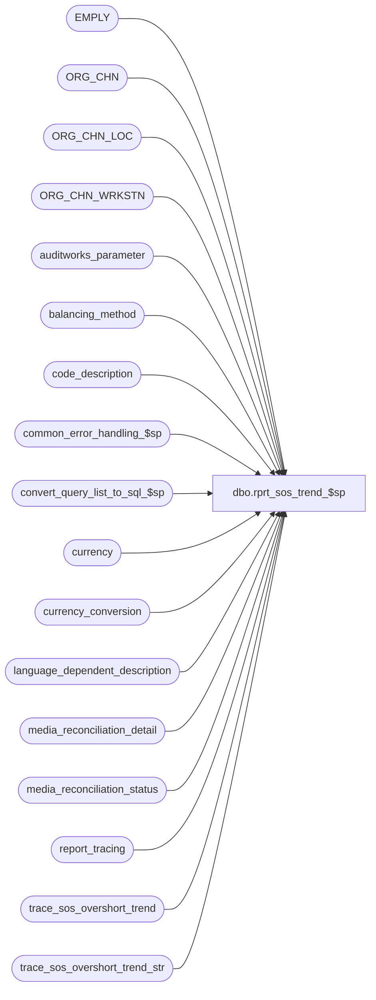

# dbo.rprt_sos_trend_$sp

**Database:** auditworks_external  
**Server:** bedrockdb01  

## Architecture Diagram



## Table Dependencies

| Referenced Table |
|---|
| EMPLY |
| ORG_CHN |
| ORG_CHN_LOC |
| ORG_CHN_WRKSTN |
| auditworks_parameter |
| balancing_method |
| code_description |
| common_error_handling_$sp |
| convert_query_list_to_sql_$sp |
| currency |
| currency_conversion |
| language_dependent_description |
| media_reconciliation_detail |
| media_reconciliation_status |
| report_tracing |
| trace_sos_overshort_trend |
| trace_sos_overshort_trend_str |

## Stored Procedure Code

```sql
create proc dbo.rprt_sos_trend_$sp ( 
  @store_group_table_name          nvarchar(40) = 'ORG_CHN', 	-- created by foundation, extracted by rdl, contains stores selected or if all  then those to which user's audit group grants access.
  @language_id                     smallint = 1033,
  @from_date                       smalldatetime = null,
  @to_date                         smalldatetime = null,
  @group_by                        int = null,		--0=Date, 1=Store, 2=Cashier, 3=Register Location (or register if no loc configured), 4=Bal Entity, 5=Day of Week
  @rec_type                        nvarchar(200) = null,
  @tender                          nvarchar(400) = null,
  @drill_cashier                   nvarchar(200) = null,	--single value, or -1=All
  @drill_store                     nvarchar(200) = null,	--single value, or -1=All --NOT USED:  rdl sends @store_group_table_name instead.
  @ve                              tinyint = 1,	  		-- 1 = Over/Shorts Only   2 = Memo only  3 = Both
  @rec_date                        smalldatetime = null,  --NOT USED:  rdl sends @from_date/@to_date instead.
  @cashier_query_list              varchar(8000) = null,       	-- comma delimited value and/or value-range list, or -1=All
  @home_store_query_list   	   varchar(8000) = null,	-- comma delimited value and/or value-range list, or -1=All
  @cashier_active_status	   varchar(2) = '-1',		-- 0=Inactive, 1=Active, -1=All
  @convert_to_base		   tinyint = 0, 		-- 0=report in base currency, 1=report in store local currency
  @currency_code		char(3) = null,		-- Any value that does not exist in currency table will be treated as "all";  if @drill_store given, @currency_code is ignored.
  @include_summary_records		   tinyint = 1, --0=only return detail records, 1= return summary records to support graphs as well.
  @drill_reg_loc				nvarchar(500) = null, --single value, or -1=All
  @selling_area_list			varchar(8000) = null,  -- comma delimited value and/or value-range list, or -1=All
  @run_as_trace_execution_time 	   datetime = null
) 
AS
   /*
      Proc name: rprt_sos_trend_$sp
           Desc: Media Reconciliation (Over) Short Trending Report
                 This proc replaces the SQL in the 8 O/S rdl's. Each rdl now passes in a number which identifies to this
                 proc how it should summarize the data by dynamically changing the group by and order by clauses.

      HISTORY:
      Date     Name                Defect# Desc
      May30,14 Vicci             TFS-63835 Attribute over/shorts to cashiers who contributed;  Expand @tender to support more than 40 5-digit tenders;
                                           Since all of the reports currently exclude $0.00 over/shorts from their retrieval from #rprt_sos_rec_os, 
                                           limit this proc to just outputing over/shorts for performance reasons;
                                           Remove hard join on EMPLY since many clients do not populate employee master.
                                           Correct join to currency since default currency code is optional in store master.
                                           Support @group_by for soft groupings to done by proc (with addition of new register location and balancing entity options).
                                           Support new query criteria for selling areas.
                                           Theoretically @home_store_query_list should also be handled properly i.e. as cashier selection criteria not media rec trans selection criteria.

                                           Also, the report functions that generate @cashier_query_list and @home_store_query_list need to be fixed for the 
               datatype / efficiency issues above as well as because: if you run the report "for terminated associates only" 
                                           it does: "m.store_no IN (select PRMY_ORG_CHN_NUM from EMPLY where ACTV = 0)", i.e. it reports on all 
         over/shorts for all stores where any employee has ever been terminated.
                                           
                                           Also, the reports that retrieve in local currency fail because they are retrieving the currency desc but not grouping by it (Column '#rprt_sos_os_trend_store_list.crncy_desc' is invalid in the select list because it is not contained in either an aggregate function or the GROUP BY clause)
                                           Also, the report retrievals fail with a divide by zero if a 100% over/short exists.
                                           Also, the report retrieval fails if you select 3 cashiers and ask the report to be limited based on termination status (The identifier that starts with ' AND ( (m.cashier_no like '13') OR (m.cashier_no like '2323') OR (m.cashier_no like '6') ) AND m.cashier_no IN (select EMPLY_NUM' is too long. Maximum length is 128. at System.Data.SqlClient.SqlConnection.OnError(SqlException exception, Boolean breakConnection) at )
                                           Also, the report retrieval fails if you select a cashier list longer that 128 characters (The identifier that starts with ' AND ( (m.cashier_no like '13') OR (m.cashier_no like '2323') OR (m.cashier_no like '6') ) AND m.cashier_no IN (select EMPLY_NUM' is too long. Maximum length is 128. at System.Data.SqlClient.SqlConnection.OnError(SqlException exception, Boolean breakConnection) at )
                                           Also, An error has occurred during report processing. (rsProcessingAborted) Query execution failed for dataset 'dsOverShortRankingbyStore'. (rsErrorExecutingCommand)Input string was not in a correct format.
                                           Note, report excessively slow if you ask for large store range (example 0-9999) instead of "all" since inserts one at a time in RS table...
      Aug16,12 Ian                1-47MZXT Initial Creation - Replace SQL in 8 rdl's with this procedure.
   */

DECLARE
  @cashier_field_name 		varchar(100),
  @home_store_field_name 	varchar(100),
  @cashier_list_sql 		varchar(8000),
  @home_store_list_sql 		varchar(8000), 
  @query_list_sql		varchar(8000), 
  @selling_area_list_sql	varchar(8000),
  @selling_area_field_name 	varchar(100),

   @errmsg            nvarchar(2000),
   @errmsg2	      nvarchar(2000),
   @errno             int,
   @message_id        int,
   @object_name       nvarchar(255),
   @operation_name    nvarchar(100),
   @process_name      nvarchar(100),
   @process_no        int,

   @min_store         int,
   @max_store         int,
   @sql               nvarchar(max),
   @base_currency_code  nvarchar(3),
   @base_currency_id  numeric(12,0),
   @attribution_required tinyint,
   @attribution_possibly_required tinyint,
   @execution_datetime datetime,
   
   @word_workstation  nvarchar(255),
   @word_cashier      nvarchar(255);

SELECT @process_name = 'rprt_sos_trend_$sp',
       @process_no   = 302,
       @message_id   = 201068,
       @execution_datetime = getdate(),
       @cashier_field_name = 'm.cashier_no',
       @home_store_field_name = 'COALESCE(ep.ORG_CHN_NUM, e.PRMY_ORG_CHN_NUM, -1)',
       @selling_area_field_name = 'f.FNCTN_NUM';

BEGIN TRY;  --Trace input parameters

  IF @run_as_trace_execution_time IS NOT NULL
  BEGIN
    SELECT @store_group_table_name = store_group_table_name, @language_id = language_id, @from_date = from_date, @to_date = to_date, 
           @group_by = group_by, @rec_type = rec_type, @tender = tender, @drill_store = drill_store, @drill_cashier = drill_cashier,
           @ve = ve, @rec_date = rec_date, @cashier_query_list = cashier_query_list, @home_store_query_list = home_store_query_list,
           @cashier_active_status = cashier_active_status, @convert_to_base = convert_to_base, @currency_code = currency_code, 
           @include_summary_records = include_summary_records, @drill_reg_loc = drill_reg_loc, @selling_area_list = selling_area_list
      FROM trace_sos_overshort_trend
     WHERE execution_datetime = @run_as_trace_execution_time;
  END
  SELECT @errmsg         = 'Unable to log trace information. ',
         @object_name    = 'trace_sos_overshort_trend',
         @operation_name = 'INSERT';
  IF NOT EXISTS (SELECT 1 FROM sysobjects WHERE type = 'U' AND name = 'trace_sos_overshort_trend')
  BEGIN
  CREATE TABLE trace_sos_overshort_trend (
         execution_datetime		 datetime  DEFAULT getdate() NOT NULL,
         store_group_table_name          nvarchar(40) NULL,
         language_id                     int NULL,
         from_date                       smalldatetime NULL,
         to_date                         smalldatetime NULL,
         group_by                        int NULL,
         rec_type                        nvarchar(200) NULL,
         tender                          nvarchar(400) NULL,
         drill_cashier                   nvarchar(200) NULL,
         drill_store                     nvarchar(200) NULL,
         ve                              tinyint NULL,
         rec_date                        smalldatetime NULL,
         cashier_query_list              varchar(8000) NULL,
         home_store_query_list           varchar(8000) NULL,
         cashier_active_status	   	 smallint NULL,
         convert_to_base		 tinyint,
         currency_code		         char(3),
         include_summary_records		 tinyint NULL,
         drill_reg_loc					 nvarchar(500) NULL,
         selling_area_list			     varchar(8000) NULL, 
         run_as_trace_execution_time 	 datetime NULL
  ); 
  END
  ELSE
  BEGIN
    DELETE trace_sos_overshort_trend
     WHERE execution_datetime < dateadd(dd, -4, getdate());
  END;   

  IF NOT EXISTS (SELECT 1 FROM sysobjects WHERE type = 'U' AND name = 'trace_sos_overshort_trend_str')
  BEGIN
  CREATE TABLE trace_sos_overshort_trend_str (
         execution_datetime	datetime  DEFAULT getdate() NOT NULL,
         ORG_CHN_NUM		int NULL
  );
  END
  ELSE
  BEGIN
    DELETE trace_sos_overshort_trend_str
     WHERE execution_datetime < dateadd(dd, -4, getdate());
  END;   
  
  DELETE report_tracing
   WHERE trace_timestamp < dateadd(dd, -7, getdate());
  
  IF @run_as_trace_execution_time IS NULL
  BEGIN
    SELECT @sql = '  INSERT INTO trace_sos_overshort_trend_str(execution_datetime, ORG_CHN_NUM) SELECT @execution_datetime, ORG_CHN_NUM FROM ' + @store_group_table_name
    SELECT @errmsg         = 'Unable to execute dynamic sql for populating trace_sos_overshort_trend_str. ',
           @object_name    = '@sql',
           @operation_name = 'EXECUTE';
    EXEC sp_executesql @sql, N'@execution_datetime datetime', @execution_datetime;
  END;
  ELSE
  BEGIN
    SELECT @errmsg         = 'Unable to populate trace_sos_overshort_trend_str. ',
           @object_name    = 'trace_sos_overshort_trend_str',
           @operation_name = 'INSERT';
    INSERT INTO trace_sos_overshort_trend_str(execution_datetime, ORG_CHN_NUM) 
    SELECT @execution_datetime, ORG_CHN_NUM 
      FROM trace_sos_overshort_trend_str
     WHERE execution_datetime = @run_as_trace_execution_time
  END;
  
  INSERT into trace_sos_overshort_trend(
         execution_datetime,
         store_group_table_name,
         language_id,
         from_date,
         to_date,
         group_by,
         rec_type,
         tender,
         drill_cashier,
         drill_store,
         ve,
         rec_date,
         cashier_query_list,
         home_store_query_list,
         cashier_active_status,
         convert_to_base,
         currency_code,
         include_summary_records,
         drill_reg_loc,
         selling_area_list, 
         run_as_trace_execution_time)
  VALUES(@execution_datetime,
         @store_group_table_name,
         @language_id,
         @from_date,
         @to_date,
         @group_by,
         @rec_type,
         @tender,
         @drill_cashier,
         @drill_store,
         @ve,
         @rec_date,
         @cashier_query_list,
         @home_store_query_list,
         @cashier_active_status,
         @convert_to_base,
         @currency_code,
         @include_summary_records,
         @drill_reg_loc,
         @selling_area_list, 
         @run_as_trace_execution_time);
END TRY  --trace input parameters
BEGIN CATCH
  SELECT @errno = ERROR_NUMBER();
  IF @errmsg2 IS NULL
  BEGIN
    SELECT @errmsg2 = @process_name + ':  ' + COALESCE(@errmsg, '') + ' Line: ' + CONVERT(varchar, ERROR_LINE()) + ', ' + ERROR_MESSAGE();
  END;
  SELECT @errmsg = @errmsg2;  
  EXEC common_error_handling_$sp @process_no, @errno, @errmsg2, 3, @message_id, @process_name, @object_name, @operation_name, 0;
END CATCH;  --trace input parameters


BEGIN TRY;

  IF LTRIM(RTRIM(@selling_area_list)) IN ('-1', '')
    SELECT @selling_area_list = NULL
  
  SELECT @errmsg         = 'Unable to convert list of selling area number values and ranges to SQL. ',
         @object_name    = 'convert_query_list_to_sql_$sp',
         @operation_name = 'EXECUTE';  
  IF @selling_area_list IS NULL
    SELECT @selling_area_list_sql = '-1'
  ELSE
  BEGIN
    EXEC convert_query_list_to_sql_$sp @selling_area_list, @selling_area_field_name, @query_list_sql OUTPUT
    SELECT @selling_area_list_sql = @query_list_sql
  END

  IF LTRIM(RTRIM(@drill_reg_loc)) IN ('-1', '')
    SELECT @drill_reg_loc = NULL
    
  --Get cashier query clause
  IF LTRIM(RTRIM(@drill_cashier)) = '' OR @drill_cashier IS NULL
    SELECT @drill_cashier = '-1'

  IF @drill_cashier <> '-1' 
    SELECT @cashier_query_list = @drill_cashier,  --if only one cashier requested, no point in getting all of them so overlay @cashier_query_list and @home_store_query_list
           @home_store_query_list = '-1'
           
  IF LTRIM(RTRIM(@cashier_query_list)) = '' OR @cashier_query_list IS NULL
  SELECT @cashier_query_list = '-1'
         
  SELECT @errmsg         = 'Unable to convert list of cashier number values and ranges to SQL. ',
         @object_name    = 'convert_query_list_to_sql_$sp',
         @operation_name = 'EXECUTE';  
  IF @cashier_query_list = '-1'
    SELECT @cashier_list_sql = '-1'
  ELSE
  BEGIN
    EXEC convert_query_list_to_sql_$sp @cashier_query_list, @cashier_field_name, @query_list_sql OUTPUT
    SELECT @cashier_list_sql = @query_list_sql
  END
  IF LTRIM(RTRIM(@cashier_list_sql)) = '' OR @cashier_list_sql IS NULL
    SELECT @cashier_list_sql = '-1'

  --Auto-correct @cashier_active_status
  IF @cashier_active_status NOT IN ('-1', '0', '1') OR @cashier_active_status IS NULL
    SELECT @cashier_active_status = '-1'

  --Get cashier home store query clause
  IF LTRIM(RTRIM(@home_store_query_list)) = '' OR @home_store_query_list IS NULL
    SELECT @home_store_query_list = '-1'
       
  SELECT @errmsg         = 'Unable to convert list of cashier home-store number values and ranges to SQL. ',
         @object_name    = 'convert_query_list_to_sql_$sp',
         @operation_name = 'EXECUTE';  
  IF @home_store_query_list = '-1'
    SELECT @home_store_list_sql = '-1'
  ELSE
  BEGIN
    EXEC convert_query_list_to_sql_$sp @home_store_query_list, @home_store_field_name, @query_list_sql OUTPUT
    SELECT @home_store_list_sql = @query_list_sql
  END
  
  IF LTRIM(RTRIM(@home_store_list_sql)) = '' OR @home_store_list_sql IS NULL
    SELECT @home_store_list_sql = '-1'

  IF @cashier_active_status <> '-1'  
    SELECT @home_store_list_sql = CASE WHEN @home_store_list_sql = '-1' 
                                         THEN 'e.ACTV = ' + @cashier_active_status + ' ' 
                                         ELSE 'e.ACTV = ' + @cashier_active_status + ' AND ('  + @home_store_list_sql + ') '
                                    END
  
  SELECT @errmsg         = 'Unable to create output table. ',
         @object_name    = '#rprt_sos_os_trend_store_list',
         @operation_name = 'CREATE TABLE';
  CREATE TABLE #rprt_sos_os_trend_store_list (
         store_no           int          not null,
         store_name         nvarchar(50) not null,
         currency_code    nchar(3)     null,
         crncy_desc         nvarchar(50) null,
         currency_id        int		 null)

  SELECT @errmsg         = 'Unable to create temp table to hold list of locations for selling areas selected.',
         @object_name    = '#selling_area_location',
         @operation_name = 'EXECUTE';    
  CREATE TABLE #selling_area_location(
         LOC_ID binary(16) NULL,
         valid tinyint NOT NULL);

  SELECT @errmsg         = 'Unable to create output table. ',
         @object_name    = '#rprt_sos_os_trend_rec_id',
         @operation_name = 'CREATE TABLE';
  CREATE TABLE #rprt_sos_os_trend_rec_id ( 
         rec_id               numeric(14,0) not null,
         balancing_entity_id  numeric(12,0) not null,
         currency_id	     int NULL,
         currency_code	     nchar(3) NULL);

  SELECT @errmsg         = 'Unable to create output table. ',
         @object_name    = '#rprt_sos_os_trend_detail',
         @operation_name = 'CREATE TABLE';
  CREATE TABLE #rprt_sos_os_trend_detail ( 
         rec_id              numeric(14,0) NOT NULL,
         balancing_entity_id numeric(12,0) NOT NULL,
         rec_date            smalldatetime NOT NULL,                                 
         store_no            int NOT NULL,
         group_by_value      nvarchar(500) NOT NULL,  
         attribution_required tinyint NOT NULL,
         group_by_desc       nvarchar(500) NOT NULL, 
         expected_amount     numeric(38,2) NOT NULL,
         tender_short        numeric(38,2) NULL,
         attributed_tender_short numeric(38,2) NULL,
         actual_amount       numeric(38,2) NULL,
         attributed_actual_amount numeric(38,2) NULL,
         currency_id	     numeric(12,0) NULL,
         currency_code	     nchar(3) NULL,
         display_balancing_entity nvarchar(500) NULL, 
         balancing_method    nvarchar(500) NULL
         );
/* 
--Note:  this is not needed for MSSQL because we just select at the end of the proc.  Left here as reminder for Oracle.
  SELECT @errmsg         = 'Unable to create output table. ',
         @object_name    = '#rprt_sos_os_trend_detail',
         @operation_name = 'CREATE TABLE';
  CREATE TABLE #rprt_sos_os_trend_final ( 
         currency_code	     nchar(3) NULL,
         rec_date            smalldatetime NOT NULL,                                 
         store_no            int NOT NULL,
         group_by_value      nvarchar(500) NOT NULL,  --cashier_no or register_no or balancing_entity_id or selling area or day of week
         group_by_desc       nvarchar(500) NOT NULL, --or cashier_first_name, register name or display_balancing_entity or selling area description
         expected_amount     numeric(38,2) NOT NULL,
         tender_short        numeric(38,2) NULL,
         attributed_tender_short numeric(38,2) NULL,
         actual_amount       numeric(38,2) NULL,
         attributed_actual_amount numeric(38,2) NULL,
         short_pct_of_expected numeric(38,2) NULL
         );
*/

   SELECT @errmsg         = 'Unable to retrieve base currency ID. ',
          @object_name    = 'auditworks_parameter',
          @operation_name = 'SELECT';
   SELECT @base_currency_id = par_value
     FROM auditworks_parameter
    WHERE par_name = 'common_currency'
      AND IsNumeric(par_value) = 1;
    
   SELECT @errmsg         = 'Unable to retrieve base currency code. ',
          @object_name    = 'currency',
          @operation_name = 'SELECT';
   SELECT @base_currency_code = currency_code, 
          @base_currency_id = currency_id
     FROM currency
    WHERE currency_id = @base_currency_id;

   IF @base_currency_code IS NULL
     SELECT @base_currency_code = 'USD',
            @base_currency_id = 141;
     
   /* Create temporary store list table */
   
   SELECT @errmsg         = 'Unable to set dynamic sql for populating #rprt_sos_os_trend_store_list. ',
          @object_name    = '@sql',
          @operation_name = 'SELECT';
   SELECT @sql = 'INSERT INTO #rprt_sos_os_trend_store_list ( store_no, store_name, currency_code, crncy_desc, currency_id)
                  SELECT s.ORG_CHN_NUM, COALESCE(l.ORG_CHN_NAME, s.ORG_CHN_NAME) as ORG_CHN_NAME, 
                         c.currency_code, COALESCE(ldc.display_description, c.currency_description) AS CRNCY_DESC,
                         c.currency_id
             	    FROM ORG_CHN s
	                     LEFT JOIN ORG_CHN_LANG l ON (s.ORG_CHN_NUM = l.ORG_CHN_NUM AND l.LANG_ID = ' + convert(varchar,@language_id) + ')
	                     INNER JOIN currency c ON COALESCE(s.DFLT_CRNCY_CODE, @base_currency_code) = c.currency_code 
	                     LEFT JOIN language_dependent_description ldc ON (c.resource_id = ldc.resource_id AND ldc.language_id = ' + convert(varchar,@language_id) + ')';

  IF LTRIM(RTRIM(@drill_store)) = '' OR @drill_store IS NULL
    SELECT @drill_store = '-1'

  IF @currency_code NOT IN (SELECT currency_code FROM currency WHERE currency_code = @currency_code)
    SELECT @currency_code = NULL

   IF @drill_store <> '-1' 
      SELECT @sql = @sql + ' WHERE s.ORG_CHN_NUM = ' + @drill_store;
   ELSE
   BEGIN
     IF @currency_code IS NOT NULL
       SELECT @sql = @sql + ' WHERE c.currency_code = ''' + @currency_code + ''' AND '
     ELSE
       SELECT @sql = @sql + ' WHERE '
       
     IF @run_as_trace_execution_time IS NULL
       SELECT @sql = @sql + 's.ORG_CHN_NUM IN (SELECT ORG_CHN_NUM FROM ' + @store_group_table_name + ' )';
     ELSE
       SELECT @sql = @sql + 's.ORG_CHN_NUM IN (SELECT ORG_CHN_NUM FROM trace_sos_overshort_trend_str WHERE execution_datetime = @run_as_trace_execution_time' + ' )';
   END
 
   SELECT @errmsg         = 'Unable to execute dynamic sql for populating #rprt_sos_os_trend_store_list. ',
          @object_name    = '@sql',
          @operation_name = 'EXECUTE';
   EXEC sp_executesql @sql, N'@base_currency_code char(3), @run_as_trace_execution_time datetime', @base_currency_code, @run_as_trace_execution_time;
   
   --Get min and max stores to help with index selection
   SELECT @errmsg         = 'Unable to select min and max store no. ',
          @object_name    = '#rprt_sos_os_trend_store_list',
          @operation_name = 'SELECT';
   SELECT @min_store = min(store_no), @max_store = MAX(store_no) FROM #rprt_sos_os_trend_store_list;
  
    --If no stores meet the selection criteria, exit
   IF @min_store IS NULL
   BEGIN
     SELECT @base_currency_code currency_code,
            @to_date rec_date,  
            0 store_no,    
            '0' group_by_value,  --0=Date, 1=Store, 2=Cashier, 3=Register Location, 4=Bal Entity, 5=Day of Week          
            '0' group_by_desc,  --0=Date, 1=Store, 2=Cashier, 3=Register Location, 4=Bal Entity, 5=Day of Week          
            CONVERT(numeric(38,2), NULL) expected_amount,      
            CONVERT(numeric(38,2), NULL) tender_short,      
            CONVERT(numeric(38,2), NULL) attributed_tender_short,
            CONVERT(numeric(38,2), NULL) actual_amount,
            CONVERT(numeric(38,2), NULL) attributed_actual_amount,
            CONVERT(numeric(38,2), NULL) short_pct_of_expected,
            '' store_name,
            '' currency_description,
            0 detail_record,
            '' display_balancing_entity,
            0 balancing_method,   --To support drill-down to media rec report
            '' balancing_method_desc;
     RETURN;
   END;  
   --Get list of locations for selling areas selected.
   IF @selling_area_list_sql <> '-1'
   BEGIN
     SELECT @errmsg         = 'Unable to prepare dynamic SQL to populate temp table to hold list of locations for selling areas selected.',
            @object_name    = '@sql',
            @operation_name = 'SELECT';
     SELECT @sql = '
      INSERT INTO #selling_area_location(LOC_ID, valid)
      SELECT DISTINCT f.LOC_ID, 1
      FROM #rprt_sos_os_trend_store_list w
        INNER JOIN ORG_CHN_WRKSTN r
           ON w.store_no = r.ORG_CHN_NUM
        INNER JOIN ORG_CHN_LOC_FNCTN_A f
           ON r.LOC_ID = f.LOC_ID
          AND (' + @selling_area_list_sql + ')';
  
     SELECT @errmsg         = 'Unable to execute dynamic SQL to populate temp table to hold list of locations for selling areas selected.',
            @object_name    = '@sql',
            @operation_name = 'EXECUTE';
     EXEC sp_executesql @sql;
   END
   ELSE
   BEGIN
     INSERT INTO #selling_area_location(LOC_ID, valid)
     VALUES(NULL, 1);
   END;

   IF @to_date IS NULL
     SELECT @to_date = CONVERT(smalldatetime, CONVERT(varchar, getdate(), 101))
     
   IF @from_date IS NULL
     SELECT @from_date = '01/01/1970'

   /* Get list of rec_id / bal ents with counts that are applicable for the transaction date range, stores, rec-type, cashiers selected */
   --Ensure only rec_ids involving store/dates selected are included
   SELECT @errmsg         = 'Unable to set dynamic sql for populating #rprt_sos_os_trend_rec_id. ',
          @object_name    = '@sql',
          @operation_name = 'SELECT';
   SELECT @sql = 
   'INSERT INTO #rprt_sos_os_trend_rec_id(rec_id, balancing_entity_id, currency_id, currency_code)
    SELECT DISTINCT m.rec_id, m.balancing_entity_id, w.currency_id, w.currency_code
      FROM #rprt_sos_os_trend_store_list w
     INNER JOIN media_reconciliation_detail m
              ON w.store_no = m.store_no
              AND m.store_no >= ' + convert(varchar, @min_store) + '
              AND m.store_no <= ' + convert(varchar, @max_store) + '
              AND m.transaction_date    >= ' + '''' + convert(varchar,@from_date) + '''' + '
              AND m.transaction_date    <= ' + '''' + convert(varchar,@to_date) + '''';                                                                  

   --Ensure only rec_ids with counts are included
   IF @rec_date IS NOT NULL
     SELECT @sql = @sql + ' AND m.rec_date = ' + '''' + convert(varchar,@rec_date) + '''';
   ELSE
     SELECT @sql = @sql + ' AND m.rec_date IS NOT NULL';
     
   --Ensure only rec_ids for rec-types selected are included
   IF LTRIM(RTRIM(@rec_type)) = '' OR @rec_type IS NULL
      SELECT @rec_type = '-1'
   IF LTRIM(RTRIM(@tender)) = '' OR @tender IS NULL
      SELECT @tender = '-1'

   IF @rec_type <> '-1' OR @tender <> '-1'
   BEGIN
     SELECT @sql = @sql + ' 
           INNER JOIN media_reconciliation_status s
              ON m.balancing_entity_id = s.balancing_entity_id';

     IF @rec_type <> '-1'
       SELECT @sql = @sql + ' AND s.rec_type IN (' + @rec_type + ')';

     IF @tender <> '-1'
       SELECT @sql = @sql + ' AND s.rec_group_line_object IN (' + @tender + ')';
   END;

   --Ensure only rec_ids involving workstations for selected selling areas are included
   IF @selling_area_list_sql <> '-1'
   BEGIN
     SELECT @sql = @sql + ' 
        INNER JOIN ORG_CHN_WRKSTN r
           ON m.store_no = r.ORG_CHN_NUM
          AND m.register_no = r.WRKSTN_NUM
        INNER JOIN ORG_CHN_LOC_FNCTN_A f
           ON r.LOC_ID = f.LOC_ID
          AND (' + @selling_area_list_sql + ')';
   END
   
   --Ensure only rec_ids involving cashiers selected are included
   IF @cashier_list_sql <> '-1' OR @home_store_list_sql <> '-1'
   BEGIN
     SELECT @sql = @sql + ' 
    WHERE ';
     
     --Ensure only rec_ids involving cashiers selected are included     
     IF @cashier_list_sql <> '-1'
     BEGIN       
       SELECT @sql = @sql + '(' + @cashier_list_sql + ')';
     END;
     
     IF @cashier_list_sql <> '-1' AND @home_store_list_sql <> '-1'
     BEGIN
       SELECT @sql = @sql + '
      AND ';
     END;
     
     IF @home_store_list_sql <> '-1'
     BEGIN
       SELECT @sql = @sql + 'm.cashier_no IN (SELECT e.EMPLY_NUM  
                         FROM EMPLY e
                              LEFT OUTER JOIN EMPLY_ORG_CHN_PSTN_A_HSTRY ep 	
                                ON e.EMPLY_NUM = ep.EMPLY_NUM
                               AND m.transaction_date >= ep.EFCTV_DATE
                               AND (m.transaction_date < ep.EXPRTN_DATE OR ep.EXPRTN_DATE IS NULL)
                               AND ep.PRMRY_LOC_A = 1
                         WHERE ' +  @home_store_list_sql + ' )';
     END;
     
   END;

   SELECT @errmsg         = 'Unable to execute dynamic sql for populating #rprt_sos_os_trend_rec_id with list of rec_ids pertinent to selection criteria. ',
          @object_name    = '@sql',
          @operation_name = 'EXECUTE';
   EXEC sp_executesql @sql;

   SELECT @errmsg         = 'Unable to to find translation for word workstation. ',
          @object_name    = 'language_dependent_description',
          @operation_name = 'SELECT';
   SELECT @word_workstation = display_description
     FROM language_dependent_description
    WHERE language_id = @language_id
      AND resource_id = 1130;
   IF @word_workstation IS NULL
     SELECT @word_workstation = 'Workstation';

   SELECT @errmsg         = 'Unable to to find translation for cashier. ',
          @object_name    = 'language_dependent_description',
          @operation_name = 'SELECT';
   SELECT @word_cashier = display_description
     FROM language_dependent_description
    WHERE language_id = @language_id
      AND resource_id = 948;
   IF @word_cashier IS NULL
     SELECT @word_cashier = 'Cashier';

   --If reporting option is grouping by store/cashier/reg and they don't balance at that level, then attribution to those involved may be required
   SELECT @attribution_possibly_required = 0;
   IF @group_by IN (1, 2, 3) OR @drill_reg_loc IS NOT NULL OR @selling_area_list IS NOT NULL
   BEGIN
     IF    ((@group_by IN (1, 2, 3) OR @drill_reg_loc IS NOT NULL OR @selling_area_list IS NOT NULL) AND EXISTS (SELECT 1 FROM (SELECT DISTINCT balancing_entity_id FROM #rprt_sos_os_trend_rec_id) w, media_reconciliation_status s WHERE w.balancing_entity_id = s.balancing_entity_id AND s.last_reconciliation_date_time IS NOT NULL AND s.store_no = 0))
        OR (@group_by = 2 AND EXISTS (SELECT 1 FROM (SELECT DISTINCT balancing_entity_id FROM #rprt_sos_os_trend_rec_id) w, media_reconciliation_status s WHERE w.balancing_entity_id = s.balancing_entity_id AND s.last_reconciliation_date_time IS NOT NULL AND s.cashier_no = 0))
        OR ((@group_by = 3 OR @drill_reg_loc IS NOT NULL OR @selling_area_list IS NOT NULL) AND EXISTS (SELECT 1 FROM (SELECT DISTINCT balancing_entity_id FROM #rprt_sos_os_trend_rec_id) w, media_reconciliation_status s WHERE w.balancing_entity_id = s.balancing_entity_id AND s.last_reconciliation_date_time IS NOT NULL AND s.register_no = 0))
     BEGIN
       SELECT @attribution_possibly_required = 1;
     END;
   END;

   IF @ve IS NULL
     SELECT @ve = '3'

   IF @attribution_possibly_required = 0  --If there is no possibility of attribution being required, #rprt_sos_os_trend can be populated directly with going through #rprt_sos_os_trend_detail. 
   BEGIN
     SELECT @errmsg         = 'Unable to populate #rprt_sos_os_trend with no attribution. ',
            @object_name    = '#rprt_sos_os_trend',
            @operation_name = 'INSERT';
/* 
--Note:  this is not needed for MSSQL because we just select at the end of the proc.  Left here as reminder for Oracle.
     INSERT INTO #rprt_sos_os_trend_final(
            currency_code, rec_date, store_no, group_by_value, group_by_desc, 
            expected_amount, tender_short, attributed_tender_short, actual_amount, attributed_actual_amount, short_pct_of_expected)
*/
     -- RETURN detail or detail-summary-combo records to UI (no attribution possibly required)
     SELECT CASE WHEN @convert_to_base = 1 THEN @base_currency_code ELSE w.currency_code END currency_code,
            CASE WHEN @group_by = 0 THEN m.rec_date ELSE @to_date END rec_date,  
            CASE WHEN @group_by in (0, 5) THEN 0 ELSE s.store_no END store_no,    
            CASE @group_by WHEN 2 THEN CONVERT(nvarchar, s.cashier_no)  
                           WHEN 3 THEN COALESCE(rloc.LOC_DESC, CONVERT(nvarchar, s.register_no)) 
                           WHEN 4 THEN s.balancing_entity
                           WHEN 5 THEN CONVERT(nvarchar, datepart(dw, m.rec_date))
                           ELSE '0' END group_by_value,  --0=Date, 1=Store, 2=Cashier, 3=Register Location, 4=Bal Entity, 5=Day of Week          
            CASE @group_by WHEN 2 THEN CASE WHEN e.FRST_NAME IS NULL AND e.LAST_NAME IS NULL THEN @word_cashier 
                                            ELSE CASE WHEN e.LAST_NAME IS NULL THEN e.FRST_NAME ELSE e.LAST_NAME + ', ' + COALESCE(e.FRST_NAME, '') END
                                       END + ' (' + CONVERT(nvarchar, s.cashier_no) + ')'
                           WHEN 3 THEN COALESCE(rloc.LOC_DESC, r.CMPTR_NAME, @word_workstation + ' ' + CONVERT(nvarchar, s.register_no)) --will be 0 if not balancing by register
                           WHEN 4 THEN CASE WHEN s.register_no = 0 AND s.cashier_no = 0 AND s.till_no = 0 AND s.bank_no = 0 AND s.store_no <> 0 THEN '' ELSE s.display_balancing_entity_descr END
                           WHEN 5 THEN COALESCE (dwl.display_description, dw.code_display_descr)
                           ELSE '0' END group_by_desc,  --0=Date, 1=Store, 2=Cashier, 3=Register Location, 4=Bal Entity, 5=Day of Week          
            CONVERT(numeric(38,2), ROUND(SUM( CASE WHEN m.rec_side = 0 THEN m.rec_amount ELSE 0 END * COALESCE(cc.exchange_rate,1)), 2)) expected_amount,      
            CONVERT(numeric(38,2), ROUND(SUM( CASE WHEN m.rec_side = 1 AND m.rec_amount_subtype IN (5,15, 25) THEN m.rec_amount ELSE 0 END * COALESCE(cc.exchange_rate,1)), 2)) tender_short,      
            NULL attributed_tender_short,
            CONVERT(numeric(38,2), ROUND(SUM( CASE WHEN m.rec_side = 1 AND m.rec_amount_subtype IN (4,14,24) THEN m.rec_amount ELSE 0 END * COALESCE(cc.exchange_rate,1)), 2)) actual_amount,
            NULL attributed_actual_amount,
            CONVERT(numeric(38,1), ROUND(100.00 * ROUND(SUM( CASE WHEN m.rec_side = 1 AND m.rec_amount_subtype IN (5,15, 25) THEN m.rec_amount ELSE 0 END * COALESCE(cc.exchange_rate,1)), 2) / 
                                   CASE WHEN ROUND(SUM( CASE WHEN m.rec_side = 0 THEN m.rec_amount ELSE 0 END * COALESCE(cc.exchange_rate,1)), 2) = 0 THEN 0.01 ELSE ROUND(SUM( CASE WHEN m.rec_side = 0 THEN m.rec_amount ELSE 0 END * COALESCE(cc.exchange_rate,1)), 2) END, 1)) short_pct_of_expected,
            COALESCE(o.ORG_CHN_NAME, '') store_name,
            COALESCE(c.currency_description, '') currency_description,
            CASE WHEN @group_by IN (0, 5) THEN 2 ELSE 1 END detail_record,  --0=false i.e. summary record, 1=true i.e. detail record, 2=both, i.e. report run at date or day of week level so detail record also serves as a summary record.
            CASE WHEN MIN(s.balancing_entity) = MAX(s.balancing_entity) AND MIN(s.balancing_method) = MAX(s.balancing_method) THEN MAX(s.display_balancing_entity) ELSE NULL END display_balancing_entity,  --To support narrowing drill-down to media rec report
            CASE WHEN MIN(s.balancing_entity) = MAX(s.balancing_entity) AND MIN(s.balancing_method) = MAX(s.balancing_method) THEN MAX(s.balancing_method) ELSE NULL END balancing_method,   --To support drill-down to media rec report
            CASE WHEN MIN(s.balancing_entity) = MAX(s.balancing_entity) AND MIN(s.balancing_method) = MAX(s.balancing_method) THEN MAX(COALESCE(ldd_bm.display_description, bm.balancing_method_description)) END balancing_method_desc
       FROM #rprt_sos_os_trend_rec_id w
            INNER JOIN media_reconciliation_detail m
               ON w.balancing_entity_id  = m.balancing_entity_id
              AND w.rec_id               = m.rec_id
              AND m.rec_side             >= 0
              AND m.rec_amount_type     IN (1,3,5)
              AND m.rec_date            IS NOT NULL
            INNER JOIN media_reconciliation_status s
               ON w.balancing_entity_id = s.balancing_entity_id
            LEFT OUTER JOIN EMPLY e
               ON @group_by = 2
              AND s.cashier_no = e.EMPLY_NUM
            LEFT OUTER JOIN ORG_CHN_WRKSTN r
               ON (@group_by = 3 OR @drill_reg_loc IS NOT NULL OR @selling_area_list IS NOT NULL)
              AND s.store_no = r.ORG_CHN_NUM
              AND s.register_no = r.WRKSTN_NUM
            LEFT OUTER JOIN #selling_area_location sar
               ON r.LOC_ID = COALESCE(sar.LOC_ID, r.LOC_ID)
            LEFT OUTER JOIN ORG_CHN_LOC rloc
              ON (@group_by = 3 OR @drill_reg_loc IS NOT NULL)
             AND r.LOC_ID = rloc.LOC_ID
            LEFT OUTER JOIN code_description dw 
              ON @group_by = 5
             AND DATEPART(dw, m.rec_date) = dw.code 
             AND dw.code_type = 55
            LEFT OUTER JOIN language_dependent_description dwl
              ON @group_by = 5
             AND dw.resource_id = dwl.resource_id 
             AND dwl.language_id = @language_id
            LEFT OUTER JOIN currency_conversion cc
              ON @convert_to_base = 1
             AND w.currency_id = cc.currency_id
             AND cc.effective_date_from <= m.rec_date
             AND (cc.effective_date_to >= m.rec_date OR cc.effective_date_to IS NULL )  
             AND cc.currency_conversion_type_id = 1
            LEFT OUTER JOIN ORG_CHN o
              ON @group_by NOT IN (0, 5)
             AND s.store_no = o.ORG_CHN_NUM
            LEFT OUTER JOIN currency c
              ON CASE WHEN @convert_to_base = 1 THEN @base_currency_id ELSE w.currency_id END = c.currency_id
            LEFT OUTER JOIN balancing_method bm
              ON s.balancing_method = bm.balancing_method
            LEFT OUTER JOIN language_dependent_description ldd_bm
              ON bm.resource_id = ldd_bm.resource_id
             AND ldd_bm.language_id = @language_id
   WHERE (@drill_reg_loc IS NULL OR COALESCE(rloc.LOC_DESC, CONVERT(nvarchar, s.register_no)) = @drill_reg_loc)
     AND (@selling_area_list IS NULL OR sar.valid = 1)
   GROUP BY CASE WHEN @convert_to_base = 1 THEN @base_currency_code ELSE w.currency_code END,
            CASE WHEN @group_by = 0 THEN m.rec_date ELSE @to_date END,  
            CASE WHEN @group_by in (0, 5) THEN 0 ELSE s.store_no END,    
            CASE @group_by WHEN 2 THEN CONVERT(nvarchar, s.cashier_no)  
                           WHEN 3 THEN COALESCE(rloc.LOC_DESC, CONVERT(nvarchar, s.register_no)) 
                           WHEN 4 THEN s.balancing_entity
                           WHEN 5 THEN CONVERT(nvarchar, datepart(dw, m.rec_date))
                           ELSE '0' END,  
            CASE @group_by WHEN 2 THEN CASE WHEN e.FRST_NAME IS NULL AND e.LAST_NAME IS NULL THEN @word_cashier 
                                            ELSE CASE WHEN e.LAST_NAME IS NULL THEN e.FRST_NAME ELSE e.LAST_NAME + ', ' + COALESCE(e.FRST_NAME, '') END
                                       END + ' (' + CONVERT(nvarchar, s.cashier_no) + ')'
                           WHEN 3 THEN COALESCE(rloc.LOC_DESC, r.CMPTR_NAME, @word_workstation + ' ' + CONVERT(nvarchar, s.register_no)) --will be 0 if not balancing by register
                           WHEN 4 THEN CASE WHEN s.register_no = 0 AND s.cashier_no = 0 AND s.till_no = 0 AND s.bank_no = 0 AND s.store_no <> 0 THEN '' ELSE s.display_balancing_entity_descr END
                           WHEN 5 THEN COALESCE (dwl.display_description, dw.code_display_descr)
                 ELSE '0' END,  
            CASE WHEN @convert_to_base = 1 THEN @base_currency_code ELSE w.currency_code END,
            o.ORG_CHN_NAME,
            c.currency_description
     HAVING SUM( CASE @ve
                 WHEN 1 THEN CASE WHEN m.rec_side = 1 AND m.rec_amount_subtype IN (5,25)    THEN m.rec_amount ELSE 0 END 
                 WHEN 2 THEN CASE WHEN m.rec_side = 1 AND m.rec_amount_subtype IN (15)      THEN m.rec_amount ELSE 0 END 
                 WHEN 3 THEN CASE WHEN m.rec_side = 1 AND m.rec_amount_subtype IN (5,15,25) THEN m.rec_amount ELSE 0 END 
                 END) <> 0
     UNION --If the graph was requested and the report is being run with detail records at a lower level than date/day-of-week
     SELECT CASE WHEN @convert_to_base = 1 THEN @base_currency_code ELSE w.currency_code END currency_code,
            m.rec_date rec_date,  
            0 store_no,    '0' group_by_value, '0' group_by_desc,
            CONVERT(numeric(38,2), ROUND(SUM( CASE WHEN m.rec_side = 0 THEN m.rec_amount ELSE 0 END * COALESCE(cc.exchange_rate,1)), 2)) expected_amount,      
            CONVERT(numeric(38,2), ROUND(SUM( CASE WHEN m.rec_side = 1 AND m.rec_amount_subtype IN (5,15, 25) THEN m.rec_amount ELSE 0 END * COALESCE(cc.exchange_rate,1)), 2)) tender_short,      
            NULL attributed_tender_short,
            CONVERT(numeric(38,2), ROUND(SUM( CASE WHEN m.rec_side = 1 AND m.rec_amount_subtype IN (4,14,24) THEN m.rec_amount ELSE 0 END * COALESCE(cc.exchange_rate,1)), 2)) actual_amount,
            NULL attributed_actual_amount,
            CONVERT(numeric(38,1), ROUND(100.00 * ROUND(SUM( CASE WHEN m.rec_side = 1 AND m.rec_amount_subtype IN (5,15, 25) THEN m.rec_amount ELSE 0 END * COALESCE(cc.exchange_rate,1)), 2) / 
                                   CASE WHEN ROUND(SUM( CASE WHEN m.rec_side = 0 THEN m.rec_amount ELSE 0 END * COALESCE(cc.exchange_rate,1)), 2) = 0 THEN 0.01 ELSE ROUND(SUM( CASE WHEN m.rec_side = 0 THEN m.rec_amount ELSE 0 END * COALESCE(cc.exchange_rate,1)), 2) END, 1)) short_pct_of_expected,
            '' store_name,
            COALESCE(c.currency_description, '') currency_description,
            0 detail_record,  --0=false i.e. summary record, 1=true i.e. detail record, 2=both, i.e. report run at date or day of week level so detail record also serves as a summary record.
            CONVERT(nvarchar(500), NULL) display_balancing_entity,
            CONVERT(nvarchar(500), NULL) balancing_method,
            CONVERT(nvarchar(500), NULL) balancing_method_desc            
       FROM #rprt_sos_os_trend_rec_id w
            INNER JOIN media_reconciliation_detail m
               ON w.balancing_entity_id  = m.balancing_entity_id
              AND w.rec_id               = m.rec_id
              AND m.rec_side             >= 0
              AND m.rec_amount_type     IN (1,3,5)
              AND m.rec_date            IS NOT NULL
            INNER JOIN media_reconciliation_status s
               ON w.balancing_entity_id = s.balancing_entity_id
            LEFT OUTER JOIN currency_conversion cc
              ON @convert_to_base = 1
             AND w.currency_id = cc.currency_id
             AND cc.effective_date_from <= m.rec_date
             AND (cc.effective_date_to >= m.rec_date OR cc.effective_date_to IS NULL )  
             AND cc.currency_conversion_type_id = 1
            LEFT OUTER JOIN currency c
              ON CASE WHEN @convert_to_base = 1 THEN @base_currency_id ELSE w.currency_id END = c.currency_id
      WHERE @include_summary_records = 1 AND @group_by NOT IN (0, 5)
      GROUP BY CASE WHEN @convert_to_base = 1 THEN @base_currency_code ELSE w.currency_code END,
            m.rec_date,  
            COALESCE(c.currency_description, '')
     HAVING SUM( CASE @ve
                 WHEN 1 THEN CASE WHEN m.rec_side = 1 AND m.rec_amount_subtype IN (5,25)    THEN m.rec_amount ELSE 0 END 
                 WHEN 2 THEN CASE WHEN m.rec_side = 1 AND m.rec_amount_subtype IN (15)      THEN m.rec_amount ELSE 0 END 
                 WHEN 3 THEN CASE WHEN m.rec_side = 1 AND m.rec_amount_subtype IN (5,15,25) THEN m.rec_amount ELSE 0 END 
                 END) <> 0
     ORDER BY 14 DESC, 1 ASC, 7 DESC, 8 DESC;
   END; --IF @attribution_possibly_required = 0
   ELSE
   BEGIN 
   
     /* Find list of over/shorts (and corresponding actuals) applicable to selection criteria. */
     SELECT @errmsg         = 'Unable to populate #rprt_sos_os_trend_detail with over/shorts. ',
            @object_name    = '#rprt_sos_os_trend_detail',
            @operation_name = 'INSERT';
     INSERT INTO #rprt_sos_os_trend_detail(
          rec_id, balancing_entity_id, rec_date, store_no, group_by_value, attribution_required, 
          group_by_desc, expected_amount, tender_short, attributed_tender_short, actual_amount, attributed_actual_amount, currency_id, currency_code, display_balancing_entity, balancing_method)
     SELECT CASE WHEN (@group_by = 2 AND s.cashier_no = 0) OR (@group_by NOT IN (0, 5) AND s.store_no = 0) OR ((@group_by = 3 OR @drill_reg_loc IS NOT NULL OR @selling_area_list IS NOT NULL) AND s.register_no = 0) --attribution required
               THEN m.rec_id
               ELSE 0 END,
          CASE WHEN (@group_by = 2 AND s.cashier_no = 0) OR (@group_by NOT IN (0, 5) AND s.store_no = 0) OR ((@group_by = 3 OR @drill_reg_loc IS NOT NULL OR @selling_area_list IS NOT NULL) AND s.register_no = 0) --attribution required
               THEN m.balancing_entity_id
               ELSE 0 END,
          CASE WHEN @group_by = 0 OR (@group_by = 2 AND s.cashier_no = 0) OR (@group_by NOT IN (0, 5) AND s.store_no = 0) OR ((@group_by = 3 OR @drill_reg_loc IS NOT NULL OR @selling_area_list IS NOT NULL) AND s.register_no = 0)  --by date or attribution required 
               THEN m.rec_date ELSE @to_date END,  
          CASE WHEN @group_by in (0, 5) THEN 0 ELSE s.store_no END,    --will be 0 if not balancing by store.	   
          CASE @group_by WHEN 2 THEN CONVERT(nvarchar, s.cashier_no)  --will be 0 if not balancing by cashier
                         WHEN 3 THEN COALESCE(rloc.LOC_DESC, CONVERT(nvarchar, s.register_no)) --will be 0 if not balancing by register
                         WHEN 4 THEN s.balancing_entity
                         WHEN 5 THEN CONVERT(nvarchar, datepart(dw, m.rec_date))
                         ELSE '0'END,  --0=Date, 1=Store, 2=Cashier, 3=Register Location, 4=Bal Entity, 5=Day of Week          
          CASE WHEN (@group_by = 2 AND s.cashier_no = 0) OR (@group_by NOT IN (0, 5) AND s.store_no = 0) OR ((@group_by = 3 OR @drill_reg_loc IS NOT NULL OR @selling_area_list IS NOT NULL) AND s.register_no = 0)  
               THEN 1 ELSE 0 END,  --attribution required
          CASE @group_by WHEN 2 THEN CASE WHEN e.FRST_NAME IS NULL AND e.LAST_NAME IS NULL THEN @word_cashier 
                                          ELSE CASE WHEN e.LAST_NAME IS NULL THEN e.FRST_NAME ELSE e.LAST_NAME + ', ' + COALESCE(e.FRST_NAME, '') END
                                     END + ' (' + CONVERT(nvarchar, s.cashier_no) + ')'
                         WHEN 3 THEN COALESCE(rloc.LOC_DESC, r.CMPTR_NAME, @word_workstation + ' ' + CONVERT(nvarchar, s.register_no)) --will be 0 if not balancing by register
                         WHEN 4 THEN CASE WHEN s.register_no = 0 AND s.cashier_no = 0 AND s.till_no = 0 AND s.bank_no = 0 AND s.store_no <> 0 THEN '' ELSE s.display_balancing_entity_descr END
                         WHEN 5 THEN COALESCE (dwl.display_description, dw.code_display_descr)
                         ELSE '0' END,  --0=Date, 1=Store, 2=Cashier, 3=Register Location, 4=Bal Entity, 5=Day of Week          
          ROUND(SUM( CASE WHEN m.rec_side = 0 THEN m.rec_amount ELSE 0 END * COALESCE(cc.exchange_rate,1)), 2) expected_amount,      
          ROUND(SUM( CASE WHEN m.rec_side = 1 AND m.rec_amount_subtype IN (5,15, 25) THEN m.rec_amount ELSE 0 END * COALESCE(cc.exchange_rate,1)), 2) tender_short,      
          NULL attributed_tender_short,
          ROUND(SUM( CASE WHEN m.rec_side = 1 AND m.rec_amount_subtype IN (4,14,24) THEN m.rec_amount ELSE 0 END * COALESCE(cc.exchange_rate,1)), 2) actual_amount,
          NULL attributed_actual_amount,
          CASE WHEN @convert_to_base = 1 THEN @base_currency_id ELSE w.currency_id END,
          CASE WHEN @convert_to_base = 1 THEN @base_currency_code ELSE w.currency_code END,
          CASE WHEN MIN(s.balancing_entity) = MAX(s.balancing_entity) AND MIN(s.balancing_method) = MAX(s.balancing_method) THEN MAX(s.display_balancing_entity) ELSE NULL END display_balancing_entity,  --To support narrowing drill-down to media rec report
          CASE WHEN MIN(s.balancing_entity) = MAX(s.balancing_entity) AND MIN(s.balancing_method) = MAX(s.balancing_method) THEN MAX(s.balancing_method) ELSE NULL END balancing_method   --To support narrowing drill-down to media rec report
     FROM #rprt_sos_os_trend_rec_id w
          INNER JOIN media_reconciliation_detail m
             ON w.balancing_entity_id  = m.balancing_entity_id
            AND w.rec_id               = m.rec_id
            AND m.rec_side             >= 0
            AND m.rec_amount_type     IN (1,3,5)
            AND m.rec_date            IS NOT NULL
          INNER JOIN media_reconciliation_status s
             ON w.balancing_entity_id = s.balancing_entity_id
          LEFT OUTER JOIN EMPLY e
             ON @group_by = 2
            AND s.cashier_no = e.EMPLY_NUM
          LEFT OUTER JOIN ORG_CHN_WRKSTN r
             ON @group_by = 3				--@drill_reg_loc and @selling_area_list limitations will be applied later
            AND s.store_no = r.ORG_CHN_NUM
            AND s.register_no = r.WRKSTN_NUM
          LEFT OUTER JOIN ORG_CHN_LOC rloc
            ON @group_by = 3
           AND r.LOC_ID = rloc.LOC_ID
          LEFT OUTER JOIN code_description dw 
            ON @group_by = 5
           AND DATEPART(dw, m.rec_date) = dw.code 
           AND dw.code_type = 55
          LEFT OUTER JOIN language_dependent_description dwl
            ON @group_by = 5
           AND dw.resource_id = dwl.resource_id 
           AND dwl.language_id = @language_id
          LEFT JOIN currency_conversion cc
            ON @convert_to_base = 1
           AND w.currency_id = cc.currency_id
           AND cc.effective_date_from <= m.rec_date
           AND (cc.effective_date_to >= m.rec_date OR cc.effective_date_to IS NULL )  
           AND cc.currency_conversion_type_id = 1
      GROUP BY CASE WHEN (@group_by = 2 AND s.cashier_no = 0) OR (@group_by NOT IN (0, 5) AND s.store_no = 0) OR ((@group_by = 3 OR @drill_reg_loc IS NOT NULL OR @selling_area_list IS NOT NULL) AND s.register_no = 0) --attribution required
               THEN m.rec_id
               ELSE 0 END,
          CASE WHEN (@group_by = 2 AND s.cashier_no = 0) OR (@group_by NOT IN (0, 5) AND s.store_no = 0) OR ((@group_by = 3 OR @drill_reg_loc IS NOT NULL OR @selling_area_list IS NOT NULL) AND s.register_no = 0) --attribution required
               THEN m.balancing_entity_id
               ELSE 0 END,
          CASE WHEN @group_by = 0 OR (@group_by = 2 AND s.cashier_no = 0) OR (@group_by NOT IN (0, 5) AND s.store_no = 0) OR ((@group_by = 3 OR @drill_reg_loc IS NOT NULL OR @selling_area_list IS NOT NULL) AND s.register_no = 0)  --by date or attribution required 
               THEN m.rec_date ELSE @to_date END,
          CASE WHEN @group_by in (0, 5) THEN 0 ELSE s.store_no END,
          CASE @group_by WHEN 2 THEN CONVERT(nvarchar, s.cashier_no)  
                         WHEN 3 THEN COALESCE(rloc.LOC_DESC, CONVERT(nvarchar, s.register_no)) 
                         WHEN 4 THEN s.balancing_entity
                         WHEN 5 THEN CONVERT(nvarchar, datepart(dw, m.rec_date))
                         ELSE '0' END,
          CASE WHEN (@group_by = 2 AND s.cashier_no = 0) OR (@group_by NOT IN (0, 5) AND s.store_no = 0) OR ((@group_by = 3 OR @drill_reg_loc IS NOT NULL OR @selling_area_list IS NOT NULL) AND s.register_no = 0)  
               THEN 1 ELSE 0 END,
          CASE @group_by WHEN 2 THEN CASE WHEN e.FRST_NAME IS NULL AND e.LAST_NAME IS NULL THEN @word_cashier 
                                          ELSE CASE WHEN e.LAST_NAME IS NULL THEN e.FRST_NAME ELSE e.LAST_NAME + ', ' + COALESCE(e.FRST_NAME, '') END
                                     END + ' (' + CONVERT(nvarchar, s.cashier_no) + ')'
                         WHEN 3 THEN COALESCE(rloc.LOC_DESC, r.CMPTR_NAME, @word_workstation + ' ' + CONVERT(nvarchar, s.register_no)) 
                         WHEN 4 THEN CASE WHEN s.register_no = 0 AND s.cashier_no = 0 AND s.till_no = 0 AND s.bank_no = 0 AND s.store_no <> 0 THEN '' ELSE s.display_balancing_entity_descr END
                         WHEN 5 THEN COALESCE (dwl.display_description, dw.code_display_descr)
                         ELSE '0' END,
          CASE WHEN @convert_to_base = 1 THEN @base_currency_id ELSE w.currency_id END,
          CASE WHEN @convert_to_base = 1 THEN @base_currency_code ELSE w.currency_code END
     HAVING SUM( CASE @ve
               WHEN 1 THEN CASE WHEN m.rec_side = 1 AND m.rec_amount_subtype IN (5,25)    THEN m.rec_amount ELSE 0 END 
               WHEN 2 THEN CASE WHEN m.rec_side = 1 AND m.rec_amount_subtype IN (15)      THEN m.rec_amount ELSE 0 END 
               WHEN 3 THEN CASE WHEN m.rec_side = 1 AND m.rec_amount_subtype IN (5,15,25) THEN m.rec_amount ELSE 0 END 
               END) <> 0;

     IF EXISTS (SELECT 1 FROM #rprt_sos_os_trend_detail w WHERE w.attribution_required = 1)
       SELECT @attribution_required = 1;
     ELSE
       SELECT @attribution_required = 0;
     IF @attribution_required = 1  --and therefore @group_by must be IN (1, 2, 3) OR @drill_reg_loc IS NOT NULL OR @selling_area_list IS NOT NULL
     BEGIN
       SELECT @errmsg         = 'Unable to set dynamic sql for populating #rprt_sos_os_trend_detail with attributed over/shorts. ',
              @object_name    = '@sql',
              @operation_name = 'SELECT';
       SELECT @sql = '
       INSERT INTO #rprt_sos_os_trend_detail(
            rec_id, balancing_entity_id, rec_date, store_no, group_by_value, attribution_required, 
            group_by_desc, expected_amount, tender_short, attributed_tender_short, actual_amount, attributed_actual_amount, 
            currency_id, currency_code, display_balancing_entity, balancing_method)
       SELECT w.rec_id, w.balancing_entity_id, CASE WHEN @group_by = 0 THEN w.rec_date ELSE @to_date END rec_date,
            m.store_no, 
            CASE @group_by WHEN 2 THEN CONVERT(nvarchar, m.cashier_no)  
                           WHEN 3 THEN COALESCE(rloc.LOC_DESC, CONVERT(nvarchar, m.register_no))
                           ELSE w.group_by_value END,  
            0 attribution_required, 
            CASE @group_by WHEN 2 THEN CASE WHEN em.FRST_NAME IS NULL AND em.LAST_NAME IS NULL THEN @word_cashier 
                                            ELSE CASE WHEN em.LAST_NAME IS NULL THEN em.FRST_NAME ELSE em.LAST_NAME + '', '' + COALESCE(em.FRST_NAME, '''') END
                                       END + '' ('' + CONVERT(nvarchar, m.cashier_no) + '')''
                           WHEN 3 THEN COALESCE(rloc.LOC_DESC, r.CMPTR_NAME, @word_workstation + '' '' + CONVERT(nvarchar, m.register_no)) 
                           ELSE w.group_by_desc END,  
            ROUND(SUM( CASE WHEN m.rec_side = 0 THEN m.rec_amount * COALESCE(cc.exchange_rate,1) ELSE 0 END), 2) expected_amount,      
            NULL tender_short,      
            w.tender_short attributed_tender_short,    --Note, cannot sum because it is one to many given we are joining to both expected and actual amount rows
            NULL actual_amount,
            w.actual_amount attributed_actual_amount,  --Note, cannot sum because it is one to many given we are joining to both expected and actual amount rows
            w.currency_id,
            w.currency_code,
            w.display_balancing_entity,
            w.balancing_method
       FROM #rprt_sos_os_trend_detail w
            INNER JOIN media_reconciliation_detail m
               ON w.balancing_entity_id = m.balancing_entity_id
              AND w.rec_id = m.rec_id
              AND m.rec_side >= 0  --note we even want cashiers that did not ring up sales but only entered the count since they still had their fingers in the pot.
              AND w.rec_date = m.rec_date
            INNER JOIN #rprt_sos_os_trend_store_list rs  --only attribute recs that the stores selected were involved in to the stores selected
               ON m.store_no = rs.store_no
            LEFT OUTER JOIN EMPLY em
               ON @group_by = 2
              AND m.cashier_no = em.EMPLY_NUM
            LEFT OUTER JOIN ORG_CHN_WRKSTN r
               ON (@group_by = 3 OR @drill_reg_loc IS NOT NULL OR @selling_area_list IS NOT NULL)
              AND m.store_no = r.ORG_CHN_NUM
              AND m.register_no = r.WRKSTN_NUM
            LEFT OUTER JOIN #selling_area_location sar
               ON r.LOC_ID = COALESCE(sar.LOC_ID, r.LOC_ID)
            LEFT OUTER JOIN ORG_CHN_LOC rloc
              ON (@group_by = 3 OR @drill_reg_loc IS NOT NULL)
             AND r.LOC_ID = rloc.LOC_ID
            LEFT JOIN currency_conversion cc
              ON @convert_to_base = 1
             AND w.currency_id = cc.currency_id
             AND cc.effective_date_from <= m.rec_date
             AND (cc.effective_date_to >= m.rec_date OR cc.effective_date_to IS NULL )  
             AND cc.currency_conversion_type_id = 1             
       WHERE w.attribution_required = 1 
         AND (@drill_reg_loc IS NULL OR COALESCE(rloc.LOC_DESC, CONVERT(nvarchar, m.register_no)) = @drill_reg_loc)
         AND (@selling_area_list IS NULL OR sar.valid = 1) '

       --Ensure only bother attributing to cashiers selected (not all those involved)
       IF @cashier_list_sql <> '-1' OR @home_store_list_sql <> '-1'
       BEGIN 
         IF @cashier_list_sql <> '-1'
           SELECT @sql = @sql + ' AND (' + @cashier_list_sql + ')';
          
         IF @home_store_list_sql <> '-1'
         BEGIN
           SELECT @sql = @sql + 'AND m.cashier_no IN (SELECT e.EMPLY_NUM  
                         FROM EMPLY e
                              LEFT OUTER JOIN EMPLY_ORG_CHN_PSTN_A_HSTRY ep 	
                                ON e.EMPLY_NUM = ep.EMPLY_NUM
                             AND m.transaction_date >= ep.EFCTV_DATE
                               AND (m.transaction_date < ep.EXPRTN_DATE OR ep.EXPRTN_DATE IS NULL)
                               AND ep.PRMRY_LOC_A = 1
                         WHERE ' +  @home_store_list_sql + ' )';
         END;     
       END;
   
       SELECT @sql = @sql + '
        GROUP BY w.rec_id, w.balancing_entity_id, m.store_no, CASE WHEN @group_by = 0 THEN w.rec_date ELSE @to_date END,
            CASE @group_by WHEN 2 THEN CONVERT(nvarchar, m.cashier_no)  
                           WHEN 3 THEN COALESCE(rloc.LOC_DESC, CONVERT(nvarchar, m.register_no))
                           ELSE w.group_by_value END,
            CASE @group_by WHEN 2 THEN CASE WHEN em.FRST_NAME IS NULL AND em.LAST_NAME IS NULL THEN @word_cashier 
                                            ELSE CASE WHEN em.LAST_NAME IS NULL THEN em.FRST_NAME ELSE em.LAST_NAME + '', '' + COALESCE(em.FRST_NAME, '''') END
                                       END + '' ('' + CONVERT(nvarchar, m.cashier_no) + '')''
                           WHEN 3 THEN COALESCE(rloc.LOC_DESC, r.CMPTR_NAME, @word_workstation + '' '' + CONVERT(nvarchar, m.register_no)) 
                           ELSE w.group_by_desc END, 
            w.currency_id, w.currency_code, w.tender_short, w.actual_amount, w.display_balancing_entity, w.balancing_method';

   SELECT @errmsg         = 'Unable to execute dynamic sql for populating #rprt_sos_os_trend_detail with attributed over/shorts. ',
              @object_name    = '@sql',
              @operation_name = 'EXECUTE';
       EXEC sp_executesql @sql, N'@group_by tinyint, @word_cashier nvarchar(255), @word_workstation nvarchar(255), @convert_to_base tinyint, @to_date smalldatetime, @drill_reg_loc nvarchar(500), @selling_area_list varchar(8000)', @group_by, @word_cashier, @word_workstation, @convert_to_base, @to_date, @drill_reg_loc, @selling_area_list;

     END; --IF @attribution_required = 1                                       
 
     SELECT @errmsg         = 'Unable to populate #rprt_sos_os_trend in attribution-required case. ',
            @object_name    = '#rprt_sos_os_trend',
            @operation_name = 'INSERT';
/* 
--Note:  this is not needed for MSSQL because we just select at the end of the proc.  Left here as reminder for Oracle.
     INSERT INTO #rprt_sos_os_trend_final(
            currency_code, rec_date, store_no, group_by_value, group_by_desc, 
            expected_amount, tender_short, attributed_tender_short, actual_amount, attributed_actual_amount, short_pct_of_expected)
*/
     -- RETURN data to UI
     SELECT w.currency_code, w.rec_date, w.store_no, w.group_by_value, w.group_by_desc, 
            CONVERT(numeric(38, 2), SUM(w.expected_amount)) expected_amount, CONVERT(numeric(38, 2), SUM(COALESCE(w.tender_short, 0))) tender_short, 
            CONVERT(numeric(38, 2), SUM(COALESCE(w.attributed_tender_short, 0))) attributed_tender_short, 
            CONVERT(numeric(38, 2), SUM(COALESCE(w.actual_amount, 0))) actual_amount, 
            CONVERT(numeric(38, 2), SUM(COALESCE(w.attributed_actual_amount, 0))) attributed_actual_amount,
            CONVERT(numeric(38, 1), ROUND(100.00 * SUM(COALESCE(w.tender_short, w.attributed_tender_short, 0)) / CASE WHEN SUM(w.expected_amount) = 0 THEN 0.01 ELSE SUM(w.expected_amount) END, 1)) short_pct_of_expected,
            COALESCE(o.ORG_CHN_NAME, '') store_name,
            COALESCE(c.currency_description, '') currency_description,
            1 detail_record,  --0=false i.e. summary record, 1=true i.e. detail record
            CASE WHEN MIN(w.display_balancing_entity) = MAX(w.display_balancing_entity) AND MIN(w.balancing_method) = MAX(w.balancing_method) THEN MAX(w.display_balancing_entity) ELSE NULL END display_balancing_entity,
            CASE WHEN MIN(w.display_balancing_entity) = MAX(w.display_balancing_entity) AND MIN(w.balancing_method) = MAX(w.balancing_method) THEN MAX(w.balancing_method) ELSE NULL END balancing_method,
            CASE WHEN MIN(w.display_balancing_entity) = MAX(w.display_balancing_entity) AND MIN(w.balancing_method) = MAX(w.balancing_method) THEN MAX(COALESCE(ldd_bm.display_description, bm.balancing_method_description)) END balancing_method_desc
       FROM #rprt_sos_os_trend_detail w
            LEFT OUTER JOIN ORG_CHN o
              ON w.store_no = o.ORG_CHN_NUM
            LEFT OUTER JOIN currency c
              ON w.currency_id = c.currency_id
            LEFT OUTER JOIN balancing_method bm
              ON w.balancing_method = bm.balancing_method
            LEFT OUTER JOIN language_dependent_description ldd_bm
              ON bm.resource_id = ldd_bm.resource_id
             AND ldd_bm.language_id = @language_id
      WHERE w.attribution_required = 0
      GROUP BY w.currency_code, w.rec_date, w.store_no, w.group_by_value, w.group_by_desc, o.ORG_CHN_NAME, c.currency_description
     UNION  --If the graph was requested and the report is being run with detail records at a lower level than date/day-of-week
     SELECT CASE WHEN @convert_to_base = 1 THEN @base_currency_code ELSE w.currency_code END currency_code,
            m.rec_date rec_date,  
            0 store_no,    '0' group_by_value, '0' group_by_desc,
            CONVERT(numeric(38,2), ROUND(SUM( CASE WHEN m.rec_side = 0 THEN m.rec_amount ELSE 0 END * COALESCE(cc.exchange_rate,1)), 2)) expected_amount,      
            CONVERT(numeric(38,2), ROUND(SUM( CASE WHEN m.rec_side = 1 AND m.rec_amount_subtype IN (5,15, 25) THEN m.rec_amount ELSE 0 END * COALESCE(cc.exchange_rate,1)), 2)) tender_short,      
            NULL attributed_tender_short,
            CONVERT(numeric(38,2), ROUND(SUM( CASE WHEN m.rec_side = 1 AND m.rec_amount_subtype IN (4,14,24) THEN m.rec_amount ELSE 0 END * COALESCE(cc.exchange_rate,1)), 2)) actual_amount,
            NULL attributed_actual_amount,
            CONVERT(numeric(38,1), ROUND(100.00 * ROUND(SUM( CASE WHEN m.rec_side = 1 AND m.rec_amount_subtype IN (5,15, 25) THEN m.rec_amount ELSE 0 END * COALESCE(cc.exchange_rate,1)), 2) / 
                                   CASE WHEN ROUND(SUM( CASE WHEN m.rec_side = 0 THEN m.rec_amount ELSE 0 END * COALESCE(cc.exchange_rate,1)), 2) = 0 THEN 0.01 ELSE ROUND(SUM( CASE WHEN m.rec_side = 0 THEN m.rec_amount ELSE 0 END * COALESCE(cc.exchange_rate,1)), 2) END, 1)) short_pct_of_expected,
            '' store_name,
            COALESCE(c.currency_description, '') currency_description,
            0 detail_record,  --0=false i.e. summary record, 1=true i.e. detail record, 2=both, i.e. report run at date or day of week level so detail record also serves as a summary record.
            CONVERT(nvarchar(500), NULL) display_balancing_entity, 
            CONVERT(nvarchar(500), NULL) balancing_method,
            CONVERT(nvarchar(500), NULL) balancing_method_desc
       FROM #rprt_sos_os_trend_rec_id w
            INNER JOIN media_reconciliation_detail m
               ON w.balancing_entity_id  = m.balancing_entity_id
              AND w.rec_id               = m.rec_id
              AND m.rec_side             >= 0
              AND m.rec_amount_type     IN (1,3,5)
              AND m.rec_date            IS NOT NULL
            INNER JOIN media_reconciliation_status s
               ON w.balancing_entity_id = s.balancing_entity_id
            LEFT OUTER JOIN currency_conversion cc
              ON @convert_to_base = 1
             AND w.currency_id = cc.currency_id
             AND cc.effective_date_from <= m.rec_date
             AND (cc.effective_date_to >= m.rec_date OR cc.effective_date_to IS NULL )  
             AND cc.currency_conversion_type_id = 1
            LEFT OUTER JOIN currency c
              ON CASE WHEN @convert_to_base = 1 THEN @base_currency_id ELSE w.currency_id END = c.currency_id
      WHERE @include_summary_records = 1
      GROUP BY CASE WHEN @convert_to_base = 1 THEN @base_currency_code ELSE w.currency_code END,
            m.rec_date,  
            COALESCE(c.currency_description, '')
     HAVING SUM( CASE @ve
                 WHEN 1 THEN CASE WHEN m.rec_side = 1 AND m.rec_amount_subtype IN (5,25)    THEN m.rec_amount ELSE 0 END 
                 WHEN 2 THEN CASE WHEN m.rec_side = 1 AND m.rec_amount_subtype IN (15)      THEN m.rec_amount ELSE 0 END 
                 WHEN 3 THEN CASE WHEN m.rec_side = 1 AND m.rec_amount_subtype IN (5,15,25) THEN m.rec_amount ELSE 0 END 
                 END) <> 0
      ORDER BY 14 DESC, 1 ASC, 7 DESC, 8 DESC;

   END;  --ELSE of IF @attribution_possibly_required = 0    

RETURN;

END TRY

BEGIN CATCH
  SELECT @errno = ERROR_NUMBER();
  IF @errmsg2 IS NULL
  BEGIN
    SELECT @errmsg2 = @process_name + ':  ' + COALESCE(@errmsg, '') + ' Line: ' + CONVERT(varchar, ERROR_LINE()) + ', ' + ERROR_MESSAGE();
  END;
  SELECT @errmsg = @errmsg2;  

  IF @object_name = '@sql' AND @operation_name = 'EXECUTE'
  BEGIN
     INSERT INTO report_tracing (trace_source, trace_object, trace_timestamp, trace_value, trace_comment)
     VALUES (@process_name, 'SQL', getdate(), @sql, @errmsg);
     
     SELECT @errmsg2 = @errmsg2 + '  -see report_tracing table for details of failed dynamic sql.'
  END

  EXEC common_error_handling_$sp @process_no, @errno, @errmsg2, 0, @message_id, @process_name, @object_name, @operation_name, 0;
  
  RETURN;
END CATCH;
```

