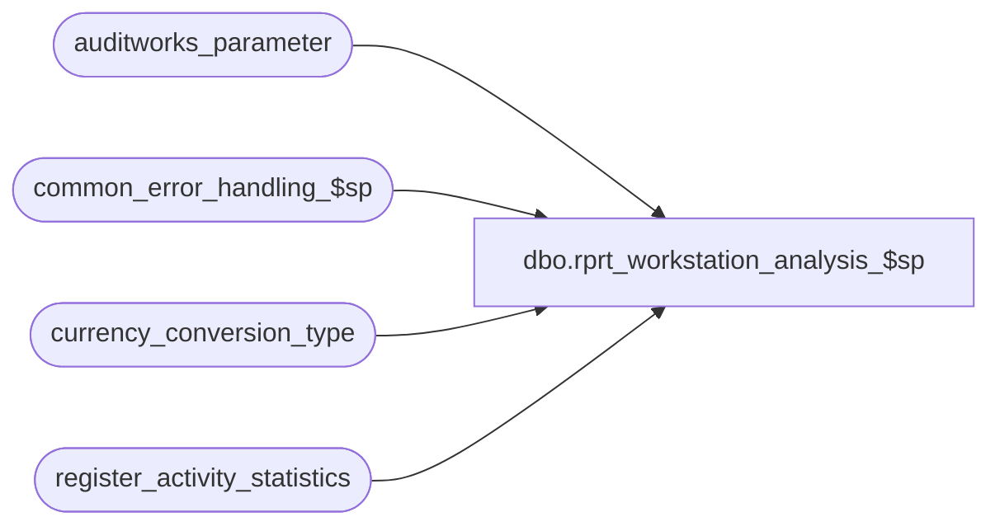

# dbo.rprt_workstation_analysis_$sp

**Database:** auditworks_external  
**Server:** bedrockdb01  

## Architecture Diagram



## Table Dependencies

| Referenced Table |
|---|
| auditworks_parameter |
| common_error_handling_$sp |
| currency_conversion_type |
| register_activity_statistics |

## Stored Procedure Code

```sql
CREATE PROCEDURE dbo.rprt_workstation_analysis_$sp
(
  @Lang          int,
  @StoreList     varchar(200),
  @function      varchar(10),
  @date_from     smalldatetime,
  @date_to       smalldatetime,
  @day_from      int,
  @day_to        int,
  @view			 int,
  @multiCurrency int
)

AS

/* 
Proc name : report_workstation_analysis_$sp
Desc: Accepts parameters from calling Report, and queries data

Lang = Language id, typically 1033
StoreList = The Returned string from the <<ConstraintStore>> function in the RDL
function = Typically AVG for Average, used in the Pivot function
date_from/to = The From and To date to report data from
day_from/to = The day of the week to return data from, typically 1-7
view = The view of the calling report, the grouping of data is based off of this
multiCurrency = Provided by the RDL, again, grouping by currency is affected

HISTORY:  
Date           Name           Def#   Desc
Apr 15, 2015   Vicci         117398  Correct join to currency_conversion to take currency conversion type into account.
Dec 15, 2014   SergueiD       93490  Workstation Activity Report returns errors/no results
May7,2014      TonyF          86181  New proc called by a new set of reports
*/


DECLARE
  @intFlag							 int,
  @intFlagMax						 int,
  @intFlagMin						 int,
  @cols								 nvarchar(MAX),
  @destCols							 nvarchar(MAX),
  @storequery						 nvarchar(MAX),
  @sourceDataStart					 nvarchar(MAX),
  @sourceDataEnd					 nvarchar(MAX),
  @query							 nvarchar(MAX),
  @viewCols							 nvarchar(MAX),
  @viewJoin							 nvarchar(MAX),
  @store_group_table_name			 nvarchar(40),
  @comp_mode						 int,

  -- Error Handling Variables
  @errmsg                            nvarchar(2000),
  @errno                             int,
  @process_name                      nvarchar(100),
  @process_no                        int,
  @message_id                        int,
  @object_name                       nvarchar(255),
  @operation_name                    nvarchar(100),
  @currency_conversion_type_id       int;

BEGIN TRY

-- Check if Compatibility mode is right, should be 90 or greater for PIVOT function
select @comp_mode = compatibility_level from sys.databases where database_id = DB_ID()
IF (@comp_mode < 90)
BEGIN
SELECT @errmsg    = 'Proc cannot run on this database, requires compability mode 90 or higher ',
       @object_name    = 'rprt_workstation_analysis_$sp'
    RAISERROR ('', 16, 1);
END

SELECT @errmsg    = 'Unable to determine currency conversion type.  ',
       @object_name    = 'auditworks_parameter$sp',
       @operation_name = 'SELECT';
SELECT @currency_conversion_type_id = par_value
  FROM auditworks_parameter
 WHERE par_name = 'default_currency_type_id'
IF NOT EXISTS (SELECT 1 FROM currency_conversion_type WHERE currency_conversion_type_id = @currency_conversion_type_id)
  SELECT @currency_conversion_type_id = 1

/*
  If the @function is not passed in, assume SUM
  Basically used to determine the data returned
*/
IF LEN(@function) = 0
BEGIN
  SELECT @function = 'SUM'
END
/* 
  Extract the dynamic store groups table name created by foundation
  @StoreList has value of either '(-1) OR (select ORG_CHN_NUM from RS_7_1383238337_18044455890)'  or
  '(select ORG_CHN_NUM from RS_7_1383238337_18044455890) OR (-1)'
*/

SELECT @errmsg    = 'Unable to resolve Store Group list',
       @object_name    = 'rprt_workstation_analysis_$sp',
       @operation_name = 'INSERT'

CREATE TABLE #store_group (ORG_CHN_NUM int not null)

-- If no RS table, use all stores, this default is set
SELECT @storequery = 'INSERT INTO #store_group (ORG_CHN_NUM) SELECT DISTINCT ORG_CHN_NUM FROM ORG_CHN'
IF CHARINDEX('RS_', @StoreList, 1) > 0
BEGIN
	SELECT @store_group_table_name = SUBSTRING(@StoreList, CHARINDEX('RS_', @StoreList, 1)   ,   ((CHARINDEX(')', @StoreList, CHARINDEX('RS_', @StoreList, 1))) - CHARINDEX('RS_', @StoreList, 1))  )
	IF @store_group_table_name IS NOT NULL
	BEGIN
		SELECT @storequery = 'INSERT INTO #store_group (ORG_CHN_NUM) SELECT DISTINCT ORG_CHN_NUM FROM ' + @store_group_table_name
	END
END

/*
  Build list of Time Interval columns to retrieve and query on
  Used to Build the query performed on the server.
*/

SELECT @errmsg    = 'Unable to resolve List of Time Intervals'

SELECT @cols = ''
SELECT @destCols = ''

SELECT @intFlagMin = MIN(interval_id), @intFlagMax = MAX(interval_id) FROM register_activity_statistics

IF @intFlagMin IS NULL
BEGIN
	SET @intFlagMin = 0
END

IF @intFlagMax > 47 OR @intFlagMax IS NULL
BEGIN
  SET @intFlagMax = 47
END

-- shift min and max by 1 due to a bug in the initial implementation
SET @intFlagMin = @intFlagMin + 1
SET @intFlagMax = @intFlagMax + 1 


SET @intFlag = @intFlagMin

WHILE (@intFlag <= @intFlagMax)
BEGIN
    IF (@intFlag <> @intFlagMin)
    BEGIN
      SELECT @cols = @cols + ', '
      SELECT @destCols = @destCols + ', '
    END
    
    SELECT @cols = @cols + QUOTENAME(@intFlag)
    SELECT @destCols = @destCols + 'COALESCE(a.' + QUOTENAME(@intFlag) + ', 0) as Amount' + CONVERT(varchar, @intFlag) + ', '
    SELECT @destCols = @destCols + 'COALESCE(q.' + QUOTENAME(@intFlag) + ', 0) as Qty' + CONVERT(varchar, @intFlag)
    SELECT @destCols = @destCols + '
'
    SET @intFlag = @intFlag + 1
END

IF (@view = 4)
BEGIN
  SELECT @viewCols = 'store_no, REPLICATE(''x'', 6) as CurrencyCode, REPLICATE(''x'', 510) as CurrencyDesc, REPLICATE(''x'', 100) as StoreName, NULL as StoreArea, NULL as cashier_no, NULL as register_no, NULL as day_of_week, '
  SELECT @viewJoin = 'a.store_no = q.store_no'
END

IF (@view = 5)
BEGIN
  SELECT @viewCols = 'store_no, REPLICATE(''x'', 6) as CurrencyCode, REPLICATE(''x'', 510) as CurrencyDesc, REPLICATE(''x'', 100) as StoreName, NULL as StoreArea,  cashier_no, NULL as register_no, NULL as day_of_week, '
  SELECT @viewJoin = 'a.store_no = q.store_no AND a.cashier_no = q.cashier_no'
END

IF (@view = 6)
BEGIN
  SELECT @viewCols = 'store_no, REPLICATE(''x'', 6) as CurrencyCode, REPLICATE(''x'', 510) as CurrencyDesc, REPLICATE(''x'', 100) as StoreName, REPLICATE(''x'', 510) as StoreArea, NULL as cashier_no, register_no, NULL as day_of_week, '
  SELECT @viewJoin = 'a.store_no = q.store_no AND a.register_no = q.register_no'
END

IF (@view = 7)
BEGIN
  SELECT @viewCols = 'store_no, REPLICATE(''x'', 6) as CurrencyCode, REPLICATE(''x'', 510) as CurrencyDesc, REPLICATE(''x'', 100) as StoreName, NULL as StoreArea,  NULL as cashier_no, NULL as register_no, DATEPART(WEEKDAY, ras.transaction_date) as day_of_week, '
  SELECT @viewJoin = 'a.store_no = q.store_no AND a.day_of_week = q.day_of_week'
END


/*
  Build the query using the PIVOT function, turns rows of data to columns
*/

SELECT @errmsg    = 'Unable to build the query'

SELECT @storequery = @storequery + ' 
SELECT * INTO #ras
FROM register_activity_statistics ras
INNER JOIN #store_group sg ON sg.ORG_CHN_NUM = ras.store_no
WHERE ras.transaction_date >= ''' + convert(varchar(10), @date_from, 20) +
 ''' AND ras.transaction_date <= ''' + convert(varchar(10), @date_to, 20) + ''' '

IF (@view = 7)
BEGIN
  SELECT @storequery = @storequery + 
    ' AND DATEPART(WEEKDAY, ras.transaction_date) >= ' + CONVERT(varchar,  @day_from) + 
    ' AND DATEPART(WEEKDAY, ras.transaction_date) <= ' + CONVERT(varchar,  @day_to) + ' '
END

/* If we are using base currency, we need to convert the amounts to the base currency */
IF (@multiCurrency = 1)
BEGIN
SELECT @storequery = @storequery + 
'
UPDATE #ras
SET tender_total = 
(
   SELECT Cast(ROUND(tender_total * COALESCE(v.exchange_rate, 1), 2) as money)
   FROM ORG_CHN s1
   INNER JOIN currency c ON s1.DFLT_CRNCY_CODE = c.currency_code
   INNER JOIN currency_conversion v 
   ON (c.currency_id = v.currency_id
     AND v.currency_conversion_type_id = ' + CONVERT(varchar, @currency_conversion_type_id) + ' 
     AND v.effective_date_from <= transaction_date 
     AND (v.effective_date_to >= transaction_date OR v.effective_date_to IS NULL))
   WHERE store_no = s1.ORG_CHN_NUM 
 ) 
'
END

SELECT @sourceDataStart = '(
  SELECT ' + @viewCols + 'interval_id, '

SELECT @sourceDataEnd = ' FROM #ras ras) As SourceData'

SELECT @query = @storequery +
' SELECT * INTO #TempAmount
FROM ' + + @sourceDataStart + 'tender_total' + @sourceDataEnd + 
' pivot
(
   ' + @function + '(tender_total)
   FOR interval_id in (' + @cols + ')
) As PivotData

SELECT *
INTO #TempQty
FROM ' + @sourceDataStart + 'transaction_qty' + @sourceDataEnd + 
' pivot
(
   ' + @function + '(transaction_qty)
   FOR interval_id in (' + @cols + ')
) As PivotData
'

if (@view = 6)
BEGIN
select @query = @query + 
'
UPDATE #TempAmount
SET StoreArea = 
(
  SELECT COALESCE(loclang.LOC_DESC, loc.LOC_DESC)
  FROM ORG_CHN_WRKSTN wrk
  INNER JOIN ORG_CHN_LOC loc
  ON wrk.LOC_ID = loc.LOC_ID
  FULL OUTER JOIN ORG_CHN_LOC_LANG loclang
  ON loc.LOC_ID = loclang.LOC_ID AND loclang.LANG_ID = ' + CONVERT(varchar(5), @Lang)+
  ' WHERE wrk.ORG_CHN_NUM = store_no AND wrk.WRKSTN_NUM = register_no
)
'
END

select @query = @query + 
'
UPDATE #TempAmount
SET StoreName = 
(
  SELECT COALESCE(chnlang.ORG_CHN_NAME, chn.ORG_CHN_NAME)
  FROM ORG_CHN chn
  FULL OUTER JOIN ORG_CHN_LANG chnlang
  ON chn.ORG_CHN_NUM = chnlang.ORG_CHN_NUM AND chnlang.LANG_ID = ' + CONVERT(varchar(5), @Lang)+
  ' WHERE chn.ORG_CHN_NUM = store_no
),

CurrencyCode = 
(
  SELECT DFLT_CRNCY_CODE
  FROM ORG_CHN
  WHERE ORG_CHN_NUM = store_no
),

CurrencyDesc = 
(
  SELECT COALESCE(cl.CRNCY_DESC, c.CRNCY_DESC)
  FROM CRNCY c
  FULL OUTER JOIN CRNCY_LANG cl
  ON c.CRNCY_CODE = cl.CRNCY_CODE AND cl.LANG_ID = ' + CONVERT(varchar(5), @Lang)+
  ' WHERE c.CRNCY_CODE = (SELECT DFLT_CRNCY_CODE FROM ORG_CHN WHERE ORG_CHN_NUM = store_no)
)
'


select @query = @query + 
'SELECT ''' + @function + ''' AS Func, ' +
   CONVERT(varchar(2), @intFlagMin - 1) + ' AS IntervalMin, ' + --shift by 1 back
   CONVERT(varchar(2), @intFlagMax - 1) + ' AS IntervalMax, ' + --shift by 1 back
' a.CurrencyCode, a.CurrencyDesc, a.store_no, a.StoreName, a.StoreArea, a.cashier_no, a.register_no, a.day_of_week, ' + @destCols + '
FROM #TempAmount a
INNER JOIN #TempQty q 
ON ' + @viewJoin 

/* Determine of we need to Order by currency or not */
IF (@multiCurrency = 0)
BEGIN
  SELECT @query = @query + ' ORDER BY 3, 4, 5, 6'
END

IF (@multiCurrency = 1)
BEGIN
  SELECT @query = @query + ' ORDER BY 2, 3, 4, 5, 6'
END


SELECT @errmsg = 'Unable to run the query'

--SELECT @query
EXECUTE(@query)
DROP TABLE #store_group

RETURN

END TRY

BEGIN CATCH
error:  /* Global Error routine */

   SELECT @errno = ERROR_NUMBER(),
		@errmsg = COALESCE(@errmsg, ' ') + ERROR_MESSAGE()

   EXEC common_error_handling_$sp @process_no, @errno, @errmsg, 0, @message_id, 
        @process_name, @object_name, @operation_name, 1

RETURN

END CATCH
```

