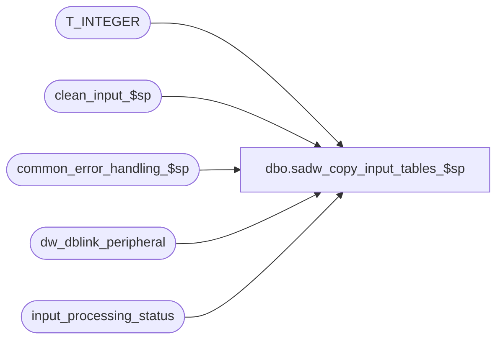

# dbo.sadw_copy_input_tables_$sp

**Database:** auditworks_external  
**Server:** bedrockdb01  

## Architecture Diagram



## Table Dependencies

| Referenced Table |
|---|
| T_INTEGER |
| clean_input_$sp |
| common_error_handling_$sp |
| dw_dblink_peripheral |
| input_processing_status |

## Stored Procedure Code

```sql
create proc [dbo].[sadw_copy_input_tables_$sp] AS
/*********************************************************************************
Proc name:	sadw_copy_input_tables_$sp

Description:	In a scaleout environment, the consolidated server will copy the input tables to the
		destination peripheral server. The proc will check for data in input_processing_status 
		with a status of -3. A curosr will be used to traverse this table for status = -3 and
		copy the input tables on the peripheral server using dynamic SQL since the database link
		will be defined on a local table.
*********************************************************************************
HISTORY

Date     Name           Def# Desc
Jan09,09 Paul         107351 added error trap for missing scaleout config
Nov15,04 Sab         DV-1191 Author
*/

DECLARE
  @cursor_open		tinyint,
  @dblink_name		nvarchar(128),
  @errmsg		nvarchar(255),
  @errno		int,
  @input_id		numeric(12,0),
  @instance_id		T_INTEGER,
  @message_id		int,
  @object_name		nvarchar(255),
  @operation_name	nvarchar(100),
  @ParmDefinition	nvarchar(500),
  @process_name		nvarchar(100),
  @process_no		smallint,
  @rows			int,
  @sql_string		nvarchar(500)

SELECT @process_no = 1,
       @process_name = 'sadw_copy_input_tables_$sp',
       @message_id = 201068

DECLARE input_id_crsr CURSOR FAST_FORWARD
FOR
SELECT input_id, instance_id
  FROM input_processing_status
 WHERE status = -3

SELECT @errno = @@error
IF @errno <> 0
BEGIN
  SELECT @errmsg = 'Unable to declare cursor input_id_crsr',
         @object_name = 'input_id_crsr',
         @operation_name = 'DECLARE CURSOR'
  GOTO error
END

OPEN input_id_crsr
SELECT @cursor_open = 1

WHILE 1 = 1
BEGIN
  FETCH input_id_crsr INTO
	@input_id,
	@instance_id

  IF @@fetch_status <> 0
    BREAK

  /* Ensure the data being copied is clean. We delete rows on the consolidated server if data exists for that input_id */
  EXECUTE clean_input_$sp NULL, NULL, @input_id, @errmsg OUTPUT

  /* Get peripheral server connection information */
  SELECT @dblink_name = dblink_name
    FROM dw_dblink_peripheral
   WHERE instance_id = @instance_id

  SELECT @errno = @@error, @rows = @@rowcount
  IF @errno != 0 OR @rows = 0
   BEGIN
     SELECT @errmsg = 'Failed to retrieve connection info for peripheral',
	    @object_name = 'dw_dblink_peripheral',
	    @operation_name = 'SELECT'
     GOTO error
   END

  -- Build and execute the copy_input_tables_sadw_$sp procedure to copy the data from peripheral to consolidated server.
  SET @sql_string = N'EXEC ' + @dblink_name + '.dbo.copy_input_tables_sadw_$sp ' + CONVERT(nvarchar(14),@input_id)
  EXEC sp_executesql @sql_string

  SELECT @errno = @@error
  IF @errno != 0 
   BEGIN
     IF @errmsg IS NULL
       SELECT @errmsg = 'Failed to execute ' + @dblink_name + '.dbo.copy_input_tables_sadw_$sp'

     SELECT @object_name = 'copy_input_tables_sadw_$sp', 
	    @operation_name = 'EXECUTE'
     GOTO error
   END  

  /* Mark the status as copied to consolidated Value (-4) */
  UPDATE input_processing_status
     SET status = -4
   WHERE input_id = @input_id

  SELECT @errno = @@error
  IF @errno != 0
   BEGIN
     SELECT @errmsg = 'Failed to UPDATE input_processing_status',
	    @object_name = 'input_processing_status',
	    @operation_name = 'UPDATE'
     GOTO error
   END

  -- Build and execute the SQL to delete the data for that input_id for all input tables on the peripheral server.
  SET @sql_string = N'EXEC ' + @dblink_name + '.dbo.clean_input_$sp NULL,NULL,' + CONVERT(nvarchar(14),@input_id) + ',@errmsgOUT OUTPUT'
  SET @ParmDefinition = '@errmsgOUT nvarchar(255) OUTPUT'
  EXEC sp_executesql @sql_string, @ParmDefinition, @errmsgOUT = @errmsg OUTPUT

  SELECT @errno = @@error
  IF @errno != 0
   BEGIN
     IF @errmsg IS NULL
       SELECT @errmsg = 'Failed to execute ' + @dblink_name + '.dbo.clean_input_$sp'

 SELECT @object_name = 'clean_input_$sp',
	    @operation_name = 'EXECUTE'
     GOTO error
   END

END -- while 1=1

CLOSE input_id_crsr
DEALLOCATE input_id_crsr

SELECT @cursor_open = 0

RETURN

error:   /* Common error handler. */
	IF @cursor_open = 1
	BEGIN
	  CLOSE input_id_crsr
	  DEALLOCATE input_id_crsr
	END

	EXEC common_error_handling_$sp @process_no, @errno, @errmsg, 0, @message_id, 
	@process_name, @object_name, @operation_name, 0, 1, 0, null, 0, null, null,
	null, null, null, null, 0, 0, null

	RETURN
```

