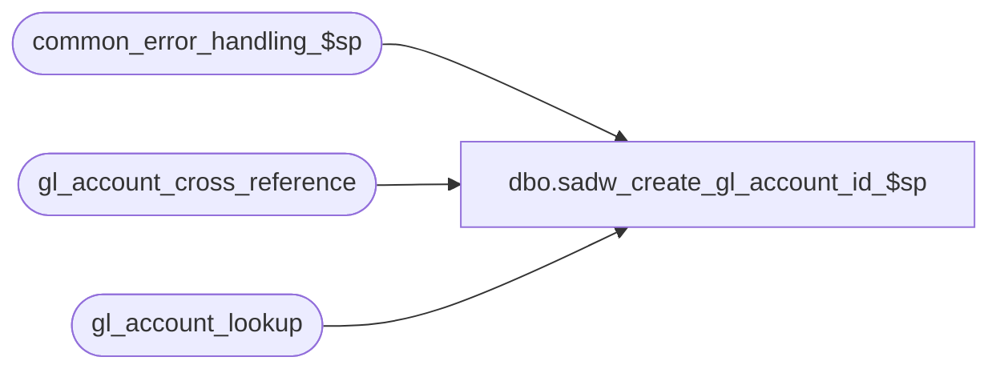

# dbo.sadw_create_gl_account_id_$sp

**Database:** auditworks_external  
**Server:** bedrockdb01  

## Architecture Diagram



## Table Dependencies

| Referenced Table |
|---|
| common_error_handling_$sp |
| gl_account_cross_reference |
| gl_account_lookup |

## Stored Procedure Code

```sql
create proc dbo.sadw_create_gl_account_id_$sp (
@store_no 				int,
@transaction_category 			tinyint,
@line_object 				smallint,
@line_action 				tinyint,
@class_code 				int,
@tax_jurisdiction 			nchar(5),
@store_deposit_destination 		smallint,
@discounted_line_object 		int,
@return_from_store 			int,
@card_type 				nchar(1),
@taxable				tinyint,
@gl_account_no 				nvarchar(160),
@originating_store_no                   int,
@process_no 				smallint,
@empl_purch_flag			tinyint, 
@failed_lookup_type			tinyint, 
@failed_lookup_value			nvarchar(255),
@gl_account_reference			nvarchar(20) = NULL
)
AS

/*********************************************************************************
Proc name:	sadw_create_gl_account_id_$sp

Description:	In a multi-server environment, the peripheral servers will execute this procedure on the consolidated
		Server to populate the gl_account_cross_reference and gl_account_lookup in a begin transaction.
This procedure is execute on the consolidated server only.
*********************************************************************************
HISTORY

Date     Name		Def#	Desc
Jan16,14 Vicci           149341 Support new Transaction G/L Account Reference lookup type 17
Jun15,10 Vicci           102089 Indicate which G/L account segment lookup type/value failed when logging a new
                                G/L account lookup combination and mark the G/L account ID as invalid.
Sep09,09 Vicci            73379 Add employee purchase support overlooked in initial port from S/A 4.1
Jul11,05 Sab		DV-1295	Author
*/

DECLARE
	@errmsg 				nvarchar(255),
	@errno 					int,
	@gl_account_id 				int,
	@rows 					int,
	@object_name				nvarchar(255),
	@process_name				nvarchar(100),
	@operation_name				nvarchar(100),
	@message_id				int,
	@log_flag 				tinyint

SELECT	@process_name = 'sadw_create_gl_account_id_$sp',
	@message_id = 201068,
	@log_flag = 0

BEGIN TRAN

SELECT @gl_account_id = MAX(gl_account_id)
  FROM gl_account_cross_reference WITH (HOLDLOCK)

SELECT @errno = @@error
IF @errno <> 0
 BEGIN
   SELECT @errmsg = ' Failed to read table gl_account_cross_reference',
	  @object_name = 'gl_account_cross_reference',
	  @operation_name = 'SELECT'	
   GOTO error	  
 END

IF @gl_account_id IS NULL  
  SELECT @gl_account_id = 1
ELSE
  SELECT @gl_account_id = @gl_account_id + 1

INSERT gl_account_cross_reference (
       gl_account_id,
       gl_account_no,
       gl_account_description,
       invalid_account_flag )
VALUES (@gl_account_id,
       @gl_account_no,
       NULL,
       CASE WHEN @gl_account_no = '0' THEN 1 ELSE 0 END)
SELECT @errno = @@error
IF @errno <> 0
BEGIN
  SELECT @errmsg = ' Failed to insert gl_account_cross_reference',
	 @object_name = 'gl_account_cross_reference',
	 @operation_name = 'INSERT'
  GOTO error
END

INSERT gl_account_lookup (
	store_no,
	transaction_category,
	line_object,
	line_action,
	class_code,
	tax_jurisdiction,
	store_deposit_destination,
	discounted_line_object,
	return_from_store,
	card_type,
	taxable,
	gl_account_id,
	originating_store_no,
	empl_purch_flag,
	failed_lookup_type, 
	failed_lookup_value,
	gl_account_reference)
VALUES (@store_no,
	@transaction_category,
	@line_object,
	@line_action,
	@class_code,
	@tax_jurisdiction,
	@store_deposit_destination,
	@discounted_line_object,
	@return_from_store,
	@card_type,
	@taxable,
	@gl_account_id,
	@originating_store_no,
	@empl_purch_flag,
	@failed_lookup_type, 
	@failed_lookup_value,
	@gl_account_reference )
SELECT @errno = @@error
IF @errno <> 0
BEGIN
  SELECT @errmsg = ' Failed to insert gl_account_lookup',
	 @object_name = 'gl_account_lookup',
	 @operation_name = 'INSERT'
  GOTO error
END

COMMIT TRAN

RETURN

error:   /* Common error handler */
	EXEC common_error_handling_$sp @process_no, @errno, @errmsg, 0, @message_id,
		@process_name, @object_name, @operation_name, @log_flag
	RETURN
```

